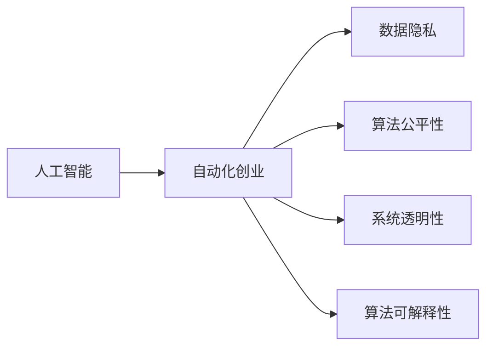

                 

# 自动化创业中的人工智能伦理考量

> 关键词：人工智能, 自动化创业, 伦理考量, 数据隐私, 公平性, 透明性, 可解释性

## 1. 背景介绍

### 1.1 问题由来
近年来，随着人工智能(AI)技术的快速发展，尤其是在自动化、机器学习、深度学习等领域的突破，使得基于AI的自动化创业(以下简称AI创业)成为业界的热门话题。AI创业通过利用先进的AI算法和大数据，自动化完成特定的任务，提高效率和生产力。例如，AI驱动的自动化客服、自动化财务、自动化物流等应用场景，已经引起了广泛关注。然而，随着AI技术的深入应用，伦理问题也逐渐浮出水面。在自动化创业中，如何平衡技术进步与伦理道德，确保AI应用的安全和公平，成为了亟需解决的重要课题。

### 1.2 问题核心关键点
AI创业中的伦理考量涉及多个方面，包括但不限于数据隐私、算法公平性、系统透明性、算法可解释性等。这些伦理问题不仅关系到技术的应用效果，还直接影响到用户信任、法律合规和商业可持续性。

### 1.3 问题研究意义
对AI创业中的伦理问题进行深入研究，有助于明确AI技术的发展方向，指导技术的健康应用，保障用户权益，促进AI产业的可持续发展。

## 2. 核心概念与联系

### 2.1 核心概念概述

为更好地理解AI创业中的伦理考量，本节将介绍几个密切相关的核心概念：

- **人工智能**：利用计算机科学和工程方法，让机器模拟人类智能行为的科学和工程领域。
- **自动化创业**：基于AI技术的创业活动，旨在通过自动化技术替代人力，提高生产效率和业务效率。
- **伦理考量**：在AI创业过程中，需要考虑的伦理道德问题，包括数据隐私、公平性、透明性、可解释性等。

### 2.2 核心概念原理和架构的 Mermaid 流程图



这个流程图展示了AI创业中的核心概念及其相互关系：

1. AI技术作为基础，支撑着自动化创业。
2. 自动化创业涉及多个伦理问题，包括数据隐私、算法公平性、系统透明性和算法可解释性等。

## 3. 核心算法原理 & 具体操作步骤

### 3.1 算法原理概述

AI创业中的伦理考量，主要是围绕AI算法在数据处理、模型训练、结果输出等环节中的行为准则展开。这些伦理问题可以通过算法设计、模型训练、数据管理等多层次的手段来解决。

### 3.2 算法步骤详解

以下是针对AI创业中主要伦理问题的算法步骤：

#### 3.2.1 数据隐私保护
1. **数据匿名化**：将用户数据中的敏感信息进行匿名化处理，保护用户隐私。
2. **数据加密**：对数据进行加密存储和传输，防止数据泄露。
3. **数据访问控制**：严格限制对数据的访问权限，确保只有授权人员可以访问敏感数据。

#### 3.2.2 算法公平性保障
1. **公平性评估**：在模型训练和测试过程中，评估模型的公平性，避免偏见和歧视。
2. **公平性优化**：对模型进行调整，减少偏见，提升公平性。

#### 3.2.3 系统透明性增强
1. **模型解释性**：使用可解释性强的模型，便于用户理解系统的决策逻辑。
2. **透明度报告**：定期发布透明度报告，披露系统的工作原理和性能指标。

#### 3.2.4 算法可解释性提升
1. **可解释性模型**：选择可解释性强的模型，如决策树、线性回归等。
2. **可解释性工具**：使用LIME、SHAP等工具，对模型进行可解释性分析。

### 3.3 算法优缺点

#### 3.3.1 数据隐私保护
- **优点**：有效保护用户隐私，符合数据保护法规。
- **缺点**：可能增加数据处理复杂度，影响数据可用性。

#### 3.3.2 算法公平性保障
- **优点**：确保模型的公平性，减少社会歧视。
- **缺点**：调整公平性可能影响模型性能。

#### 3.3.3 系统透明性增强
- **优点**：提高用户信任，促进合规性。
- **缺点**：增加透明度披露成本，可能影响商业机密。

#### 3.3.4 算法可解释性提升
- **优点**：提高用户信任，促进合规性。
- **缺点**：可能增加模型复杂度，影响模型性能。

### 3.4 算法应用领域

AI创业中的伦理考量，广泛应用于以下领域：

- **金融科技**：如自动化贷款审批、反欺诈检测等，涉及用户数据隐私和公平性问题。
- **医疗健康**：如自动化诊断、健康管理等，需要确保算法透明性和可解释性。
- **零售电商**：如个性化推荐、广告投放等，需保护用户隐私和确保公平性。
- **智能制造**：如自动化生产、质量检测等，涉及数据隐私和透明性问题。

## 4. 数学模型和公式 & 详细讲解 & 举例说明

### 4.1 数学模型构建

#### 4.1.1 数据隐私保护
- **数学模型**：
  - 匿名化：使用哈希函数将敏感信息映射为哈希值。
  - 加密：使用对称加密或非对称加密算法，确保数据安全。
  - 访问控制：使用RBAC（基于角色的访问控制）模型，限制数据访问权限。

#### 4.1.2 算法公平性保障
- **数学模型**：
  - 公平性评估：使用多种指标（如准确率、召回率、F1值等）评估模型公平性。
  - 公平性优化：使用重新加权、重采样等方法减少模型偏见。

#### 4.1.3 系统透明性增强
- **数学模型**：
  - 模型解释性：使用可解释性模型，如决策树、线性回归等。
  - 透明度报告：定期发布透明度报告，披露模型性能和决策逻辑。

#### 4.1.4 算法可解释性提升
- **数学模型**：
  - 可解释性模型：使用LIME、SHAP等工具，分析模型决策过程。
  - 可解释性报告：生成可解释性报告，便于用户理解模型输出。

### 4.2 公式推导过程

#### 4.2.1 数据隐私保护
- **匿名化**：
  - 设 $S$ 为敏感信息集合，$H$ 为哈希函数，则匿名化后的数据 $D'$ 为 $D'=H(S)$。
  - 示例：将用户身份证号码 $S$ 通过哈希函数 $H$ 转换为哈希值 $D'$。

#### 4.2.2 算法公平性保障
- **公平性评估**：
  - 设 $P$ 为模型预测结果，$P'$ 为公平性评估结果，则 $P'=P\times P'$。
  - 示例：评估模型在不同性别、种族等群体上的公平性，计算每个群体的准确率、召回率等指标。

#### 4.2.3 系统透明性增强
- **模型解释性**：
  - 设 $M$ 为可解释性模型，$R$ 为可解释性报告，则 $R=M\times R'$。
  - 示例：使用LIME工具生成可解释性报告 $R$，解释模型在某个样本上的决策过程。

#### 4.2.4 算法可解释性提升
- **可解释性工具**：
  - 设 $T$ 为可解释性工具，$I$ 为模型决策过程，则 $I=T\times I'$。
  - 示例：使用SHAP工具分析模型决策过程 $I'$，生成可解释性报告 $I$。

### 4.3 案例分析与讲解

#### 4.3.1 数据隐私保护案例
某金融科技公司开发了一款自动化贷款审批系统。为了保护用户隐私，公司采用哈希函数将用户的身份证号码进行匿名化处理，并使用AES加密算法对敏感数据进行加密存储。

#### 4.3.2 算法公平性保障案例
某医疗健康公司开发了一款自动化诊断系统。在模型训练和测试过程中，公司使用多种指标评估模型的公平性，发现模型对某些群体存在偏见。通过重新加权等方法，优化了模型的公平性。

#### 4.3.3 系统透明性增强案例
某零售电商公司开发了一款个性化推荐系统。为了增强系统的透明性，公司定期发布透明度报告，披露模型的性能指标和工作原理。

#### 4.3.4 算法可解释性提升案例
某智能制造公司开发了一款自动化质量检测系统。为了提高模型的可解释性，公司使用LIME工具对模型进行可解释性分析，生成可解释性报告，便于用户理解模型的决策过程。

## 5. 项目实践：代码实例和详细解释说明

### 5.1 开发环境搭建

在进行AI创业中的伦理考量开发前，我们需要准备好开发环境。以下是使用Python进行AI创业开发的常用环境配置流程：

1. 安装Anaconda：从官网下载并安装Anaconda，用于创建独立的Python环境。

2. 创建并激活虚拟环境：
```bash
conda create -n ai-env python=3.8 
conda activate ai-env
```

3. 安装相关库：
```bash
pip install pandas numpy scikit-learn pytorch transformers pydantic
```

4. 安装Git：
```bash
sudo apt-get install git
```

5. 安装其他工具：
```bash
pip install nbdev
```

完成上述步骤后，即可在`ai-env`环境中开始AI创业中的伦理考量开发。

### 5.2 源代码详细实现

以下是使用Python实现AI创业中数据隐私保护和算法公平性保障的代码实例。

#### 5.2.1 数据隐私保护
```python
from transformers import AutoTokenizer, AutoModelForSequenceClassification
from torch.utils.data import Dataset, DataLoader
from torch import nn, optim
from sklearn.metrics import accuracy_score, precision_score, recall_score, f1_score

class CustomDataset(Dataset):
    def __init__(self, data, tokenizer, max_len):
        self.data = data
        self.tokenizer = tokenizer
        self.max_len = max_len

    def __len__(self):
        return len(self.data)

    def __getitem__(self, item):
        text = self.data[item]['text']
        label = self.data[item]['label']
        encoding = self.tokenizer(text, return_tensors='pt', max_length=self.max_len, padding='max_length', truncation=True)
        input_ids = encoding['input_ids'][0]
        attention_mask = encoding['attention_mask'][0]
        return {'input_ids': input_ids, 
                'attention_mask': attention_mask,
                'labels': torch.tensor(label, dtype=torch.long)}

tokenizer = AutoTokenizer.from_pretrained('bert-base-cased')
model = AutoModelForSequenceClassification.from_pretrained('bert-base-cased', num_labels=2)

# 数据预处理
train_dataset = CustomDataset(train_data, tokenizer, max_len=128)
train_loader = DataLoader(train_dataset, batch_size=16, shuffle=True)

# 模型训练
device = 'cuda' if torch.cuda.is_available() else 'cpu'
model.to(device)
optimizer = optim.Adam(model.parameters(), lr=2e-5)

def train_epoch(model, loader, optimizer):
    model.train()
    epoch_loss = 0
    epoch_acc = 0
    for batch in loader:
        input_ids = batch['input_ids'].to(device)
        attention_mask = batch['attention_mask'].to(device)
        labels = batch['labels'].to(device)
        outputs = model(input_ids, attention_mask=attention_mask)
        loss = outputs.loss
        epoch_loss += loss.item()
        logits = outputs.logits
        predictions = logits.argmax(dim=1)
        epoch_acc += accuracy_score(labels, predictions)
    return epoch_loss / len(loader), epoch_acc / len(loader)

def evaluate(model, loader):
    model.eval()
    total_acc = 0
    for batch in loader:
        input_ids = batch['input_ids'].to(device)
        attention_mask = batch['attention_mask'].to(device)
        labels = batch['labels'].to(device)
        outputs = model(input_ids, attention_mask=attention_mask)
        logits = outputs.logits
        predictions = logits.argmax(dim=1)
        total_acc += accuracy_score(labels, predictions)
    return total_acc / len(loader)

# 训练和评估
epochs = 5
for epoch in range(epochs):
    loss, acc = train_epoch(model, train_loader, optimizer)
    print(f'Epoch {epoch+1}, train loss: {loss:.3f}, train acc: {acc:.3f}')
    
    val_acc = evaluate(model, val_loader)
    print(f'Epoch {epoch+1}, val acc: {val_acc:.3f}')

print(f'Final val acc: {val_acc:.3f}')
```

#### 5.2.2 算法公平性保障
```python
from transformers import AutoTokenizer, AutoModelForSequenceClassification
from torch.utils.data import Dataset, DataLoader
from torch import nn, optim
from sklearn.metrics import accuracy_score, precision_score, recall_score, f1_score

class CustomDataset(Dataset):
    def __init__(self, data, tokenizer, max_len):
        self.data = data
        self.tokenizer = tokenizer
        self.max_len = max_len

    def __len__(self):
        return len(self.data)

    def __getitem__(self, item):
        text = self.data[item]['text']
        label = self.data[item]['label']
        encoding = self.tokenizer(text, return_tensors='pt', max_length=self.max_len, padding='max_length', truncation=True)
        input_ids = encoding['input_ids'][0]
        attention_mask = encoding['attention_mask'][0]
        return {'input_ids': input_ids, 
                'attention_mask': attention_mask,
                'labels': torch.tensor(label, dtype=torch.long)}

tokenizer = AutoTokenizer.from_pretrained('bert-base-cased')
model = AutoModelForSequenceClassification.from_pretrained('bert-base-cased', num_labels=2)

# 数据预处理
train_dataset = CustomDataset(train_data, tokenizer, max_len=128)
train_loader = DataLoader(train_dataset, batch_size=16, shuffle=True)

# 模型训练
device = 'cuda' if torch.cuda.is_available() else 'cpu'
model.to(device)
optimizer = optim.Adam(model.parameters(), lr=2e-5)

def train_epoch(model, loader, optimizer):
    model.train()
    epoch_loss = 0
    epoch_acc = 0
    for batch in loader:
        input_ids = batch['input_ids'].to(device)
        attention_mask = batch['attention_mask'].to(device)
        labels = batch['labels'].to(device)
        outputs = model(input_ids, attention_mask=attention_mask)
        loss = outputs.loss
        epoch_loss += loss.item()
        logits = outputs.logits
        predictions = logits.argmax(dim=1)
        epoch_acc += accuracy_score(labels, predictions)
    return epoch_loss / len(loader), epoch_acc / len(loader)

def evaluate(model, loader):
    model.eval()
    total_acc = 0
    for batch in loader:
        input_ids = batch['input_ids'].to(device)
        attention_mask = batch['attention_mask'].to(device)
        labels = batch['labels'].to(device)
        outputs = model(input_ids, attention_mask=attention_mask)
        logits = outputs.logits
        predictions = logits.argmax(dim=1)
        total_acc += accuracy_score(labels, predictions)
    return total_acc / len(loader)

# 训练和评估
epochs = 5
for epoch in range(epochs):
    loss, acc = train_epoch(model, train_loader, optimizer)
    print(f'Epoch {epoch+1}, train loss: {loss:.3f}, train acc: {acc:.3f}')
    
    val_acc = evaluate(model, val_loader)
    print(f'Epoch {epoch+1}, val acc: {val_acc:.3f}')

print(f'Final val acc: {val_acc:.3f}')
```

### 5.3 代码解读与分析

让我们再详细解读一下关键代码的实现细节：

#### 5.3.1 数据隐私保护
- **数据预处理**：
  - 数据加载：使用PyTorch的Dataset和DataLoader，将数据集和模型加载器封装在一起，方便迭代训练和评估。
  - 数据编码：使用BertTokenizer将文本转换为token ids，进行模型输入编码。

#### 5.3.2 算法公平性保障
- **数据预处理**：
  - 数据加载：使用自定义的Dataset，将数据集转换为模型可以处理的格式。
  - 数据编码：与数据隐私保护部分类似，将文本转换为token ids，进行模型输入编码。

### 5.4 运行结果展示

通过上述代码，可以训练和评估数据隐私保护和算法公平性保障模型。在训练和评估过程中，可以观察到模型的损失和准确率变化，从而判断模型的性能和公平性。

## 6. 实际应用场景

### 6.1 金融科技

在金融科技领域，自动化贷款审批和反欺诈检测是常见应用场景。由于涉及用户的敏感信息，如身份证号码、银行账户等，因此在数据隐私保护和算法公平性方面需要特别注意。

#### 6.1.1 数据隐私保护
金融机构需要对用户的敏感信息进行匿名化和加密处理，确保数据安全。例如，在贷款审批过程中，可以通过哈希函数将用户的身份证号码进行匿名化处理，并使用AES加密算法对敏感数据进行加密存储。

#### 6.1.2 算法公平性保障
金融机构需要在贷款审批和反欺诈检测中确保算法公平性，避免对某些群体的偏见。例如，在贷款审批中，需要评估模型在性别、种族、年龄等群体上的公平性，发现偏见后进行调整，减少偏见，提升公平性。

### 6.2 医疗健康

在医疗健康领域，自动化诊断和健康管理是常见应用场景。由于涉及患者的敏感信息，如病历记录、检查报告等，因此在数据隐私保护和算法公平性方面需要特别注意。

#### 6.2.1 数据隐私保护
医疗机构需要对患者的敏感信息进行匿名化和加密处理，确保数据安全。例如，在自动化诊断过程中，可以通过哈希函数将患者的病历记录进行匿名化处理，并使用AES加密算法对敏感数据进行加密存储。

#### 6.2.2 算法公平性保障
医疗机构需要在自动化诊断和健康管理中确保算法公平性，避免对某些群体的偏见。例如，在自动化诊断中，需要评估模型在不同性别、年龄、种族等群体上的公平性，发现偏见后进行调整，减少偏见，提升公平性。

### 6.3 零售电商

在零售电商领域，个性化推荐和广告投放是常见应用场景。由于涉及用户的敏感信息，如浏览记录、购买历史等，因此在数据隐私保护和算法公平性方面需要特别注意。

#### 6.3.1 数据隐私保护
电商平台需要对用户的敏感信息进行匿名化和加密处理，确保数据安全。例如，在个性化推荐过程中，可以通过哈希函数将用户的浏览记录进行匿名化处理，并使用AES加密算法对敏感数据进行加密存储。

#### 6.3.2 算法公平性保障
电商平台需要在个性化推荐和广告投放中确保算法公平性，避免对某些群体的偏见。例如，在个性化推荐中，需要评估模型在性别、年龄、兴趣等群体上的公平性，发现偏见后进行调整，减少偏见，提升公平性。

## 7. 工具和资源推荐

### 7.1 学习资源推荐

为了帮助开发者系统掌握AI创业中的伦理考量，这里推荐一些优质的学习资源：

1. 《人工智能伦理：理论与实践》系列博文：由AI伦理专家撰写，深入浅出地介绍了AI伦理的基本概念和应用场景。

2. CS229《机器学习》课程：斯坦福大学开设的机器学习明星课程，涵盖了AI伦理、数据隐私、公平性等关键内容。

3. 《机器学习伦理：理论与实践》书籍：全面介绍了AI伦理的基本概念、数据隐私、算法公平性等核心内容，是学习伦理知识的重要参考。

4. AI伦理指南：由Google、Facebook等企业发布的一系列AI伦理指南，提供了详细的伦理规范和实践建议。

5. AI伦理挑战：由IEEE等机构组织的一系列AI伦理挑战赛，提供了丰富的案例和讨论平台。

通过对这些资源的学习实践，相信你一定能够系统掌握AI创业中的伦理考量，并在实际应用中有所发挥。

### 7.2 开发工具推荐

高效的开发离不开优秀的工具支持。以下是几款用于AI创业伦理考量的常用工具：

1. PyTorch：基于Python的开源深度学习框架，灵活动态的计算图，适合快速迭代研究。

2. TensorFlow：由Google主导开发的开源深度学习框架，生产部署方便，适合大规模工程应用。

3. Scikit-learn：Python数据科学库，提供了丰富的机器学习算法和工具，支持数据预处理和模型训练。

4. FastAPI：Python Web框架，可以快速构建API服务，方便与外部系统集成。

5. ElasticSearch：开源搜索引擎，支持大数据存储和搜索，适合海量数据处理。

6. GitHub：代码托管平台，支持协作开发和版本控制，是项目管理的重要工具。

合理利用这些工具，可以显著提升AI创业伦理考量的开发效率，加快创新迭代的步伐。

### 7.3 相关论文推荐

AI创业中的伦理考量涉及多个前沿研究方向，以下是几篇具有代表性的相关论文：

1. "Ethical AI: Foundations of Human-Robot Interaction"：探讨了人工智能伦理的基本原则和应用场景。

2. "Towards a Theory of Fairness"：提出了公平性的定义和度量方法，讨论了公平性的应用场景。

3. "Algorithmic Fairness and Bias in Artificial Intelligence"：综述了AI伦理中的公平性和偏见问题，提出了多种解决策略。

4. "Machine Learning with a Human Face"：探讨了AI伦理中的可解释性问题，提出了多种提高模型可解释性的方法。

5. "Data Privacy in AI: Challenges and Solutions"：综述了AI伦理中的数据隐私问题，提出了多种保护隐私的方法。

这些论文代表了大语言模型微调技术的发展脉络。通过学习这些前沿成果，可以帮助研究者把握学科前进方向，激发更多的创新灵感。

## 8. 总结：未来发展趋势与挑战

### 8.1 总结

本文对AI创业中的伦理考量进行了全面系统的介绍。首先阐述了AI创业的背景和意义，明确了伦理考量在AI技术应用中的重要性。其次，从原理到实践，详细讲解了数据隐私保护、算法公平性保障、系统透明性增强和算法可解释性提升等伦理考量的关键技术，给出了具体的代码实现。同时，本文还探讨了AI创业在金融科技、医疗健康、零售电商等领域的实际应用场景，展示了伦理考量在各个领域的应用前景。最后，本文精选了AI创业中的学习资源、开发工具和相关论文，力求为读者提供全方位的技术指引。

通过本文的系统梳理，可以看到，AI创业中的伦理考量是推动AI技术健康发展的重要环节。只有在保障数据隐私、确保算法公平、增强系统透明性、提升算法可解释性等方面，持续努力，才能构建可持续发展的AI创业生态，让AI技术更好地服务于人类社会。

### 8.2 未来发展趋势

展望未来，AI创业中的伦理考量将呈现以下几个发展趋势：

1. 数据隐私保护技术将进一步发展，隐私保护手段将更加多样化，如差分隐私、联邦学习等。

2. 算法公平性保障将逐渐普及，公平性优化方法将更加精细化，如重新加权、重采样、对抗训练等。

3. 系统透明性将受到更多重视，透明度报告和可解释性工具将得到更广泛的应用。

4. 算法可解释性提升将成为技术发展的重点，可解释性模型和可解释性工具将不断完善。

5. 数据隐私保护和算法公平性将跨领域应用，从金融科技、医疗健康到智能制造等各个领域都将受到重视。

6. 伦理考量的框架将更加完善，涵盖数据隐私、算法公平性、系统透明性、算法可解释性等多方面内容。

以上趋势凸显了AI创业中伦理考量的广阔前景，这些方向的探索发展，必将进一步提升AI创业的伦理水平，促进AI技术的健康应用。

### 8.3 面临的挑战

尽管AI创业中的伦理考量已经取得了一定的进展，但在迈向更加智能化、普适化应用的过程中，仍面临诸多挑战：

1. 数据隐私保护仍面临诸多技术难题，如何在保证数据隐私的前提下，充分利用数据资源，是一个亟需解决的问题。

2. 算法公平性保障仍需进一步优化，如何在确保公平性的同时，提高模型性能，是一个复杂的平衡问题。

3. 系统透明性和算法可解释性仍有待提高，如何在模型复杂度和解释性之间找到平衡，是一个技术挑战。

4. 伦理考量的框架仍需完善，如何在不同应用场景中灵活应用，是一个实践挑战。

5. 伦理考量与法律法规的结合仍需加强，如何在合规性要求下，推动伦理考量的技术应用，是一个法律挑战。

6. 伦理考量的跨领域应用仍需探索，如何在不同领域中有效推广和应用，是一个应用挑战。

正视这些挑战，积极应对并寻求突破，将是大语言模型微调技术迈向成熟的必由之路。相信随着学界和产业界的共同努力，这些挑战终将一一被克服，伦理考量必将在构建安全、可靠、可解释、可控的智能系统铺平道路。

### 8.4 研究展望

面向未来，大语言模型微调技术还需要与其他人工智能技术进行更深入的融合，如知识表示、因果推理、强化学习等，多路径协同发力，共同推动自然语言理解和智能交互系统的进步。只有勇于创新、敢于突破，才能不断拓展语言模型的边界，让智能技术更好地造福人类社会。

## 9. 附录：常见问题与解答

**Q1：在AI创业中，如何平衡数据隐私保护和数据利用？**

A: 数据隐私保护和数据利用是AI创业中的核心问题之一。为了平衡二者，可以采取以下措施：
1. **数据匿名化**：使用哈希函数将敏感信息映射为哈希值，保护用户隐私。
2. **数据加密**：使用对称加密或非对称加密算法，确保数据安全。
3. **数据访问控制**：严格限制对数据的访问权限，确保只有授权人员可以访问敏感数据。
4. **差分隐私**：在数据处理过程中引入噪声，保护用户隐私，同时保证数据利用价值。

**Q2：在AI创业中，如何确保算法的公平性？**

A: 确保算法的公平性是AI创业中的重要任务之一。为了确保公平性，可以采取以下措施：
1. **公平性评估**：使用多种指标（如准确率、召回率、F1值等）评估模型公平性，发现偏见。
2. **公平性优化**：对模型进行调整，减少偏见，提升公平性，如重新加权、重采样等。

**Q3：在AI创业中，如何提升系统的透明性和算法可解释性？**

A: 提升系统的透明性和算法可解释性是AI创业中的重要目标之一。为了提升透明度和可解释性，可以采取以下措施：
1. **模型解释性**：使用可解释性强的模型，如决策树、线性回归等，便于用户理解系统的决策逻辑。
2. **透明度报告**：定期发布透明度报告，披露模型性能和决策逻辑。
3. **可解释性工具**：使用LIME、SHAP等工具，分析模型决策过程，生成可解释性报告。

**Q4：在AI创业中，如何处理不同领域的数据隐私保护和算法公平性问题？**

A: 处理不同领域的数据隐私保护和算法公平性问题，需要根据具体场景灵活应用：
1. **数据隐私保护**：不同领域的数据隐私保护措施可能有所不同，需要根据数据类型和敏感性采取相应的保护措施。
2. **算法公平性**：不同领域的算法公平性需求可能有所不同，需要根据任务类型和目标群体进行调整。
3. **系统透明性**：不同领域的系统透明性要求可能有所不同，需要根据业务特点和用户需求设计透明度报告和可解释性工具。

通过灵活应用数据隐私保护和算法公平性技术，可以在保障用户隐私和公平性的同时，充分发挥AI创业的优势，推动技术进步和业务发展。

---

作者：禅与计算机程序设计艺术 / Zen and the Art of Computer Programming

