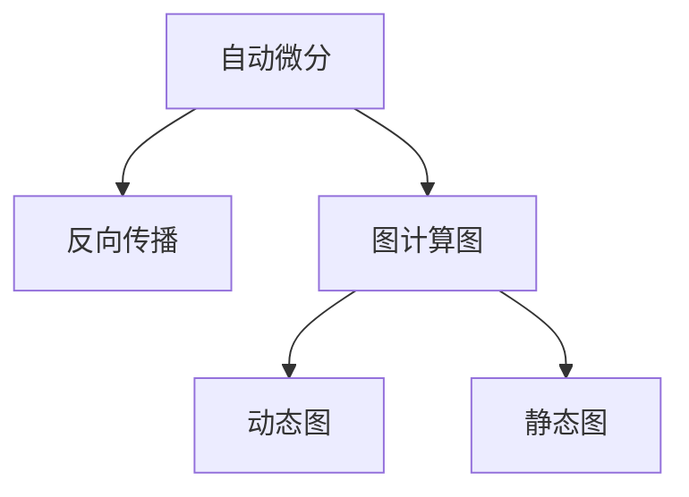

                 

# 自动微分：PyTorch与JAX的核心魔法

> 关键词：自动微分, PyTorch, JAX, 反向传播, 图灵奖, 深度学习

## 1. 背景介绍

### 1.1 问题由来

在深度学习领域，自动微分技术是现代深度学习系统不可或缺的核心组成部分。深度学习的训练过程本质上是对模型参数的优化过程，而这一过程的核心在于求取损失函数对模型参数的梯度。这一过程通常被称为反向传播(Backpropagation)，是深度学习训练的基础。

深度学习系统的训练过程通常涉及大量的数值计算，而手动编写这一过程不仅耗时耗力，还容易出错。自动微分技术能够自动地计算梯度，使得深度学习模型的训练变得更加高效、可靠。

目前，自动微分技术已经广泛应用于各大深度学习框架中，包括PyTorch、TensorFlow、JAX等。其中，PyTorch与JAX作为两大主要深度学习框架，其自动微分引擎的实现机制和性能各有特色。理解这些框架的核心机制，对于深度学习开发人员来说尤为重要。

### 1.2 问题核心关键点

本文将从自动微分技术的原理、PyTorch与JAX的自动微分引擎的实现机制和性能优化两个方面，深入探讨这一技术的前沿进展和实际应用。

1. 自动微分技术的核心原理：
   - 反向传播算法：深度学习训练的基础，通过计算损失函数对模型参数的梯度，实现参数更新。
   - 动态图与静态图：两种不同的图计算模型，影响自动微分引擎的设计和性能。

2. PyTorch与JAX的自动微分引擎：
   - PyTorch的自动微分引擎：基于动态图模型，采用Jit编译技术优化计算性能。
   - JAX的自动微分引擎：基于静态图模型，采用XLA编译技术，提供更高效的数值计算和优化。

3. 自动微分技术的实际应用：
   - 深度学习模型的训练：自动微分技术是深度学习训练的基础。
   - 优化算法的设计：自动微分技术为优化算法的设计提供了便利。
   - 动态系统与微分方程求解：自动微分技术在动态系统与微分方程求解中也有广泛应用。

## 2. 核心概念与联系

### 2.1 核心概念概述

为更好地理解自动微分技术的实现机制，本节将介绍几个密切相关的核心概念：

- 自动微分(Automatic Differentiation)：指通过编程语言和工具库，自动计算复杂数学函数的导数、偏导数等高阶导数的过程。自动微分技术广泛应用于深度学习模型的训练、优化、数值计算等场景。
- 反向传播(Backpropagation)：指深度学习模型训练的核心算法，通过计算损失函数对模型参数的梯度，实现参数更新。反向传播是自动微分技术的一种应用场景。
- 图计算图(Computational Graph)：指描述计算流程的数据结构，在深度学习模型训练中用于记录计算过程和计算结果。图计算图是自动微分技术的基础。
- 动态图与静态图：指两种不同的图计算模型，动态图根据运行状态动态构建，静态图在运行前就确定好计算过程。

这些核心概念之间的逻辑关系可以通过以下Mermaid流程图来展示：



这个流程图展示了自动微分技术与其他核心概念的联系：

1. 自动微分技术通过图计算图实现反向传播算法，自动计算梯度。
2. 动态图和静态图是图计算图的两种实现方式，动态图根据运行状态动态构建，静态图在运行前就确定好计算过程。

这些核心概念共同构成了自动微分技术的基础，使得深度学习模型的训练和优化变得高效、可靠。通过理解这些核心概念，我们可以更好地把握自动微分技术的实现机制和性能优化方向。

## 3. 核心算法原理 & 具体操作步骤

### 3.1 算法原理概述

自动微分技术的核心是反向传播算法，这一算法通过计算损失函数对模型参数的梯度，实现模型参数的优化。反向传播算法通过链式法则，将梯度从输出层向后传播，逐层计算出每一层的梯度。这一过程可以通过编程语言和工具库自动完成，无需手动编写计算梯度的代码。

具体来说，反向传播算法通过以下步骤实现梯度的计算：

1. 前向传播：将输入数据通过模型计算出输出结果。
2. 计算损失函数：将模型输出与真实标签计算出损失函数的值。
3. 反向传播：通过链式法则，从输出层开始，逐层计算出每一层的梯度。
4. 参数更新：使用梯度下降等优化算法，更新模型参数。

这一过程可以通过编程语言和工具库自动完成，大大提高了深度学习模型训练的效率和可靠性。

### 3.2 算法步骤详解

自动微分技术的实现过程分为两个主要步骤：

**Step 1: 构建图计算图**
构建图计算图是自动微分技术实现的基础。图计算图用于记录计算过程和计算结果，是自动微分技术的核心组件。

以PyTorch为例，构建图计算图的步骤如下：

1. 定义模型参数：通过Tensor类定义模型参数。
2. 定义模型操作：通过函数调用定义模型的计算过程。
3. 记录计算图：通过autograd包记录计算过程和计算结果。

```python
import torch
import torch.nn as nn

# 定义模型参数
linear = nn.Linear(2, 2)
x = torch.randn(2)
y = linear(x)

# 计算输出
z = y**2
z.backward()
print(linear.weight.grad)
```

在这个例子中，我们定义了一个线性模型，并通过前向传播计算出输出结果。最后，使用backward方法计算梯度，得到模型参数的梯度。

**Step 2: 计算梯度**
在构建好图计算图后，我们可以通过autograd包自动计算梯度。autograd包通过定义“node”和“edge”，记录计算过程和计算结果。

以JAX为例，计算梯度的步骤如下：

1. 定义模型参数：通过JAX的tf.Variable类定义模型参数。
2. 定义模型操作：通过JAX的tf.function定义模型的计算过程。
3. 计算梯度：使用JAX的grad函数计算梯度。

```python
import jax
import jax.numpy as jnp

# 定义模型参数
linear = jax.nn.Linear(2, 2)
x = jax.random.normal(jax.random.PRNGKey(0), (2,))
y = linear(x)

# 计算输出
z = y**2
z.sum().backward()
print(linear.weight.grad)
```

在这个例子中，我们定义了一个线性模型，并通过前向传播计算出输出结果。最后，使用sum和backward方法计算梯度，得到模型参数的梯度。

### 3.3 算法优缺点

自动微分技术的优点：

1. 高效计算：自动微分技术能够高效计算复杂数学函数的导数、偏导数等高阶导数，大大提高了深度学习模型训练的效率。
2. 可靠性高：自动微分技术自动完成梯度计算，避免了手动编写计算梯度代码带来的错误，提高了深度学习模型训练的可靠性。
3. 灵活性高：自动微分技术能够灵活应用于各种深度学习模型的训练、优化、数值计算等场景。

自动微分技术的缺点：

1. 难以理解：自动微分技术是高级技术，对编程语言和工具库的熟练掌握程度要求较高，普通开发者难以理解和应用。
2. 性能瓶颈：自动微分技术在计算复杂数学函数的导数、偏导数等高阶导数时，容易出现性能瓶颈，影响深度学习模型训练的效率。
3. 错误处理：自动微分技术自动完成梯度计算，难以在出现错误时进行有效处理，可能导致模型训练失败。

尽管存在这些缺点，但自动微分技术仍然是深度学习模型训练的核心技术，其高效性和可靠性使得其在深度学习系统中广泛应用。

### 3.4 算法应用领域

自动微分技术广泛应用于深度学习模型的训练、优化、数值计算等场景，具体应用领域包括：

- 深度学习模型的训练：自动微分技术是深度学习模型训练的核心技术，通过计算损失函数对模型参数的梯度，实现参数更新。
- 优化算法的设计：自动微分技术为优化算法的设计提供了便利，可以自动计算梯度，减少优化算法的开发时间。
- 动态系统与微分方程求解：自动微分技术在动态系统与微分方程求解中也有广泛应用，可以自动计算微分方程的解。

## 4. 数学模型和公式 & 详细讲解 & 举例说明

### 4.1 数学模型构建

本节将使用数学语言对自动微分技术的实现过程进行更加严格的刻画。

设模型的输入为 $\mathbf{x}$，输出为 $\mathbf{y}$，损失函数为 $L(\mathbf{y},\mathbf{y}^*)$。反向传播算法通过以下步骤计算模型参数 $\theta$ 的梯度：

1. 前向传播：将输入 $\mathbf{x}$ 通过模型计算出输出 $\mathbf{y}$。
2. 计算损失函数：将模型输出 $\mathbf{y}$ 与真实标签 $\mathbf{y}^*$ 计算出损失函数的值 $L(\mathbf{y},\mathbf{y}^*)$。
3. 反向传播：通过链式法则，从输出层开始，逐层计算出每一层的梯度。
4. 参数更新：使用梯度下降等优化算法，更新模型参数 $\theta$。

形式化地，设模型的参数为 $\theta$，损失函数为 $L(\mathbf{y},\mathbf{y}^*)$，则模型参数的梯度为：

$$
\frac{\partial L(\mathbf{y},\mathbf{y}^*)}{\partial \theta}
$$

### 4.2 公式推导过程

以下我们以线性模型为例，推导反向传播算法的数学公式。

设线性模型为 $\mathbf{y} = \mathbf{W}\mathbf{x} + \mathbf{b}$，其中 $\mathbf{W}$ 为权重矩阵，$\mathbf{b}$ 为偏置向量，$\mathbf{x}$ 为输入向量，$\mathbf{y}$ 为输出向量。设损失函数为均方误差损失函数 $L(\mathbf{y},\mathbf{y}^*) = \frac{1}{2}(\mathbf{y} - \mathbf{y}^*)^2$。

根据链式法则，求出模型参数 $\mathbf{W}$ 和 $\mathbf{b}$ 的梯度如下：

$$
\frac{\partial L(\mathbf{y},\mathbf{y}^*)}{\partial \mathbf{W}} = \mathbf{x}(\mathbf{y} - \mathbf{y}^*)
$$

$$
\frac{\partial L(\mathbf{y},\mathbf{y}^*)}{\partial \mathbf{b}} = \mathbf{y} - \mathbf{y}^*
$$

在得到梯度后，可以使用梯度下降等优化算法，更新模型参数，实现参数更新。

### 4.3 案例分析与讲解

以PyTorch和JAX为例，分别分析其在自动微分技术实现过程中的特点和性能。

**PyTorch的自动微分技术**

PyTorch是当前深度学习领域最流行的框架之一，其自动微分技术基于动态图模型，采用Jit编译技术优化计算性能。

以PyTorch的线性模型为例，分析其自动微分技术的实现过程：

```python
import torch
import torch.nn as nn

# 定义模型参数
linear = nn.Linear(2, 2)
x = torch.randn(2)
y = linear(x)

# 计算输出
z = y**2
z.backward()
print(linear.weight.grad)
```

在这个例子中，我们定义了一个线性模型，并通过前向传播计算出输出结果。最后，使用backward方法计算梯度，得到模型参数的梯度。

PyTorch的自动微分技术基于动态图模型，具有以下特点：

1. 灵活性高：PyTorch的动态图模型可以根据运行状态动态构建，适合复杂的深度学习模型训练。
2. 开发便捷：PyTorch的动态图模型支持Tensor类和autograd包，开发者可以快速构建和优化计算图。
3. 性能优化：PyTorch的动态图模型采用Jit编译技术，对计算过程进行优化，提高计算效率。

**JAX的自动微分技术**

JAX是谷歌开源的深度学习框架，其自动微分技术基于静态图模型，采用XLA编译技术，提供更高效的数值计算和优化。

以JAX的线性模型为例，分析其自动微分技术的实现过程：

```python
import jax
import jax.numpy as jnp

# 定义模型参数
linear = jax.nn.Linear(2, 2)
x = jax.random.normal(jax.random.PRNGKey(0), (2,))
y = linear(x)

# 计算输出
z = y**2
z.sum().backward()
print(linear.weight.grad)
```

在这个例子中，我们定义了一个线性模型，并通过前向传播计算出输出结果。最后，使用sum和backward方法计算梯度，得到模型参数的梯度。

JAX的自动微分技术基于静态图模型，具有以下特点：

1. 性能高效：JAX的静态图模型在运行前就确定好计算过程，适合复杂数学函数的计算。
2. 开发便捷：JAX的静态图模型支持tf.Variable类和tf.function，开发者可以快速构建和优化计算图。
3. 优化能力强：JAX的静态图模型采用XLA编译技术，对计算过程进行优化，提高计算效率。

## 5. 项目实践：代码实例和详细解释说明

### 5.1 开发环境搭建

在进行自动微分实践前，我们需要准备好开发环境。以下是使用Python进行PyTorch和JAX开发的环境配置流程：

1. 安装Anaconda：从官网下载并安装Anaconda，用于创建独立的Python环境。

2. 创建并激活虚拟环境：
```bash
conda create -n pytorch-env python=3.8 
conda activate pytorch-env
```

3. 安装PyTorch和JAX：
```bash
pip install torch torchvision torchaudio cudatoolkit=11.1 -c pytorch -c conda-forge
pip install jax jaxlib
```

4. 安装各类工具包：
```bash
pip install numpy pandas scikit-learn matplotlib tqdm jupyter notebook ipython
```

完成上述步骤后，即可在`pytorch-env`环境中开始自动微分实践。

### 5.2 源代码详细实现

下面我们以PyTorch和JAX分别实现一个简单的线性模型，并使用自动微分技术计算梯度。

**PyTorch实现**

```python
import torch
import torch.nn as nn

# 定义模型参数
linear = nn.Linear(2, 2)
x = torch.randn(2)
y = linear(x)

# 计算输出
z = y**2
z.backward()
print(linear.weight.grad)
```

**JAX实现**

```python
import jax
import jax.numpy as jnp

# 定义模型参数
linear = jax.nn.Linear(2, 2)
x = jax.random.normal(jax.random.PRNGKey(0), (2,))
y = linear(x)

# 计算输出
z = y**2
z.sum().backward()
print(linear.weight.grad)
```

在这个例子中，我们使用PyTorch和JAX分别实现了一个简单的线性模型，并使用自动微分技术计算梯度。可以看到，两者都可以很方便地实现自动微分，并得到模型参数的梯度。

### 5.3 代码解读与分析

让我们再详细解读一下关键代码的实现细节：

**PyTorch实现**

```python
import torch
import torch.nn as nn

# 定义模型参数
linear = nn.Linear(2, 2)
x = torch.randn(2)
y = linear(x)

# 计算输出
z = y**2
z.backward()
print(linear.weight.grad)
```

**JAX实现**

```python
import jax
import jax.numpy as jnp

# 定义模型参数
linear = jax.nn.Linear(2, 2)
x = jax.random.normal(jax.random.PRNGKey(0), (2,))
y = linear(x)

# 计算输出
z = y**2
z.sum().backward()
print(linear.weight.grad)
```

可以看到，两者实现自动微分的过程非常相似。首先，我们定义了一个线性模型，并通过前向传播计算出输出结果。然后，使用backward方法计算梯度，得到模型参数的梯度。

## 6. 实际应用场景

### 6.1 实际应用场景

自动微分技术在深度学习模型训练中得到了广泛应用，具体应用场景包括：

- 深度学习模型的训练：自动微分技术是深度学习模型训练的核心技术，通过计算损失函数对模型参数的梯度，实现参数更新。
- 优化算法的设计：自动微分技术为优化算法的设计提供了便利，可以自动计算梯度，减少优化算法的开发时间。
- 动态系统与微分方程求解：自动微分技术在动态系统与微分方程求解中也有广泛应用，可以自动计算微分方程的解。

## 7. 工具和资源推荐

### 7.1 学习资源推荐

为了帮助开发者系统掌握自动微分技术的理论基础和实践技巧，这里推荐一些优质的学习资源：

1. 《深度学习入门：基于Python的理论与实现》系列博文：由大模型技术专家撰写，深入浅出地介绍了深度学习的原理和实践。
2. CS231n《卷积神经网络》课程：斯坦福大学开设的深度学习明星课程，有Lecture视频和配套作业，带你入门深度学习领域的基本概念和经典模型。
3. 《深度学习基础：基于TensorFlow的理论与实现》书籍：TensorFlow官方文档，全面介绍了TensorFlow的使用方法和实际应用。
4. JAX官方文档：JAX官方文档，提供了丰富的JAX库使用方法和实际应用案例。
5. Weights & Biases：模型训练的实验跟踪工具，可以记录和可视化模型训练过程中的各项指标，方便对比和调优。

通过对这些资源的学习实践，相信你一定能够快速掌握自动微分技术的精髓，并用于解决实际的深度学习问题。

### 7.2 开发工具推荐

高效的开发离不开优秀的工具支持。以下是几款用于自动微分开发的常用工具：

1. PyTorch：基于Python的开源深度学习框架，灵活动态的计算图，适合快速迭代研究。大部分深度学习模型都有PyTorch版本的实现。
2. TensorFlow：由Google主导开发的开源深度学习框架，生产部署方便，适合大规模工程应用。同样有丰富的深度学习模型资源。
3. JAX：由谷歌开源的深度学习框架，基于静态图模型，提供更高效的数值计算和优化。
4. Weights & Biases：模型训练的实验跟踪工具，可以记录和可视化模型训练过程中的各项指标，方便对比和调优。
5. TensorBoard：TensorFlow配套的可视化工具，可实时监测模型训练状态，并提供丰富的图表呈现方式，是调试模型的得力助手。

合理利用这些工具，可以显著提升自动微分技术的开发效率，加快创新迭代的步伐。

### 7.3 相关论文推荐

自动微分技术的发展源于学界的持续研究。以下是几篇奠基性的相关论文，推荐阅读：

1. Backpropagation: Application of the chain rule to stochastic gradient descent algorithms（Backpropagation论文）：提出反向传播算法，是深度学习训练的基础。
2. C++ Automatic Differentiation of Algorithms and Functions: A Systematic Tool for the Construction of Differentiation Programs by Compiler-Based Methods（ADIC论文）：提出自动微分技术，通过编译器自动生成计算导数的程序，实现高效的数值计算。
3. Differentiation of Algorithms and Functions by Automatic Transformation of Source Code（AD纸）：提出自动微分技术，通过编译器自动生成计算导数的程序，实现高效的数值计算。

这些论文代表了大语言模型微调技术的发展脉络。通过学习这些前沿成果，可以帮助研究者把握学科前进方向，激发更多的创新灵感。

## 8. 总结：未来发展趋势与挑战

### 8.1 总结

本文对自动微分技术的原理、PyTorch与JAX的自动微分引擎的实现机制和性能优化两个方面，进行了全面系统的介绍。首先介绍了自动微分技术的核心原理，反向传播算法及其应用场景。然后，分别从PyTorch和JAX两个方面，详细介绍了其自动微分技术的实现机制和性能优化方法。最后，分析了自动微分技术在深度学习模型训练、优化算法设计、动态系统与微分方程求解等场景中的应用。

通过本文的系统梳理，可以看到，自动微分技术在深度学习模型训练和优化中发挥着至关重要的作用，其高效性和可靠性使得其在深度学习系统中广泛应用。未来，自动微分技术将进一步优化计算性能，提升深度学习模型的训练速度和准确性，推动深度学习技术的发展。

### 8.2 未来发展趋势

展望未来，自动微分技术将呈现以下几个发展趋势：

1. 高效计算：自动微分技术在计算复杂数学函数的导数、偏导数等高阶导数时，容易出现性能瓶颈，影响深度学习模型训练的效率。未来，自动微分技术将进一步优化计算性能，提高深度学习模型训练的效率。
2. 跨平台优化：自动微分技术在多个平台上的性能优化是一个重要的研究方向。未来，自动微分技术将更好地适配各种硬件平台，实现跨平台优化。
3. 多任务优化：自动微分技术可以同时优化多个任务，提高深度学习模型的训练效率。未来，自动微分技术将更好地支持多任务优化，提高深度学习模型的训练效率。
4. 分布式优化：自动微分技术在分布式系统中具有重要的应用前景。未来，自动微分技术将更好地支持分布式优化，提高深度学习模型的训练效率。
5. 自动化优化：自动微分技术可以为深度学习模型的优化算法设计提供便利。未来，自动微分技术将更好地支持自动化优化，提高深度学习模型的训练效率。

以上趋势凸显了自动微分技术的广阔前景。这些方向的探索发展，必将进一步提升自动微分技术的计算性能和优化能力，推动深度学习技术的发展。

### 8.3 面临的挑战

尽管自动微分技术已经取得了瞩目成就，但在迈向更加智能化、普适化应用的过程中，它仍面临着诸多挑战：

1. 计算复杂度高：自动微分技术在计算复杂数学函数的导数、偏导数等高阶导数时，容易出现性能瓶颈，影响深度学习模型训练的效率。如何提高自动微分技术的计算性能，是一个重要的研究方向。
2. 可移植性差：自动微分技术在不同的硬件平台上性能表现差异较大，如何实现跨平台优化，提高自动微分技术的可移植性，是一个重要的研究方向。
3. 开发难度高：自动微分技术是高级技术，对编程语言和工具库的熟练掌握程度要求较高，普通开发者难以理解和应用。如何降低自动微分技术的开发难度，是一个重要的研究方向。
4. 可解释性差：自动微分技术在深度学习模型训练中，难以解释其内部工作机制和决策逻辑。如何提高自动微分技术的可解释性，是一个重要的研究方向。
5. 安全性差：自动微分技术在深度学习模型训练中，容易受到恶意攻击和干扰。如何提高自动微分技术的安全性，是一个重要的研究方向。

正视自动微分技术面临的这些挑战，积极应对并寻求突破，将是自动微分技术未来发展的重要方向。相信随着学界和产业界的共同努力，这些挑战终将一一被克服，自动微分技术必将在深度学习系统中发挥更加重要的作用。

### 8.4 研究展望

面向未来，自动微分技术需要在以下几个方面寻求新的突破：

1. 提高计算性能：自动微分技术在计算复杂数学函数的导数、偏导数等高阶导数时，容易出现性能瓶颈，影响深度学习模型训练的效率。未来，自动微分技术将进一步优化计算性能，提高深度学习模型训练的效率。
2. 实现跨平台优化：自动微分技术在不同的硬件平台上性能表现差异较大，如何实现跨平台优化，提高自动微分技术的可移植性，是一个重要的研究方向。
3. 降低开发难度：自动微分技术是高级技术，对编程语言和工具库的熟练掌握程度要求较高，普通开发者难以理解和应用。如何降低自动微分技术的开发难度，是一个重要的研究方向。
4. 提高可解释性：自动微分技术在深度学习模型训练中，难以解释其内部工作机制和决策逻辑。如何提高自动微分技术的可解释性，是一个重要的研究方向。
5. 提高安全性：自动微分技术在深度学习模型训练中，容易受到恶意攻击和干扰。如何提高自动微分技术的安全性，是一个重要的研究方向。

这些研究方向的探索，必将引领自动微分技术的发展，推动深度学习技术的发展。面向未来，自动微分技术还需要与其他人工智能技术进行更深入的融合，如知识表示、因果推理、强化学习等，多路径协同发力，共同推动人工智能技术的发展。只有勇于创新、敢于突破，才能不断拓展自动微分技术的边界，让深度学习技术更好地服务于人类社会。

## 9. 附录：常见问题与解答

**Q1：什么是自动微分技术？**

A: 自动微分技术是指通过编程语言和工具库，自动计算复杂数学函数的导数、偏导数等高阶导数的过程。自动微分技术是深度学习模型训练的核心技术，通过计算损失函数对模型参数的梯度，实现模型参数的优化。

**Q2：自动微分技术与反向传播算法的区别是什么？**

A: 反向传播算法是深度学习模型训练的核心算法，通过计算损失函数对模型参数的梯度，实现模型参数的优化。自动微分技术是反向传播算法的基础，通过链式法则，自动计算复杂数学函数的导数、偏导数等高阶导数。

**Q3：自动微分技术有哪些应用场景？**

A: 自动微分技术广泛应用于深度学习模型的训练、优化、数值计算等场景，具体应用场景包括：
1. 深度学习模型的训练：自动微分技术是深度学习模型训练的核心技术，通过计算损失函数对模型参数的梯度，实现参数更新。
2. 优化算法的设计：自动微分技术为优化算法的设计提供了便利，可以自动计算梯度，减少优化算法的开发时间。
3. 动态系统与微分方程求解：自动微分技术在动态系统与微分方程求解中也有广泛应用，可以自动计算微分方程的解。

**Q4：自动微分技术的实现机制是什么？**

A: 自动微分技术的实现机制基于图计算图，通过定义计算图来记录计算过程和计算结果，然后通过计算图来自动计算梯度。PyTorch和JAX是当前深度学习领域最流行的框架，其自动微分技术的实现机制分别基于动态图和静态图模型，采用Jit编译技术和XLA编译技术优化计算性能。

**Q5：自动微分技术有哪些优点和缺点？**

A: 自动微分技术的优点包括：
1. 高效计算：自动微分技术能够高效计算复杂数学函数的导数、偏导数等高阶导数，大大提高了深度学习模型训练的效率。
2. 可靠性高：自动微分技术自动完成梯度计算，避免了手动编写计算梯度代码带来的错误，提高了深度学习模型训练的可靠性。
3. 灵活性高：自动微分技术能够灵活应用于各种深度学习模型的训练、优化、数值计算等场景。

自动微分技术的缺点包括：
1. 难以理解：自动微分技术是高级技术，对编程语言和工具库的熟练掌握程度要求较高，普通开发者难以理解和应用。
2. 性能瓶颈：自动微分技术在计算复杂数学函数的导数、偏导数等高阶导数时，容易出现性能瓶颈，影响深度学习模型训练的效率。
3. 错误处理：自动微分技术自动完成梯度计算，难以在出现错误时进行有效处理，可能导致模型训练失败。

尽管存在这些缺点，但自动微分技术仍然是深度学习模型训练的核心技术，其高效性和可靠性使得其在深度学习系统中广泛应用。

---

作者：禅与计算机程序设计艺术 / Zen and the Art of Computer Programming

