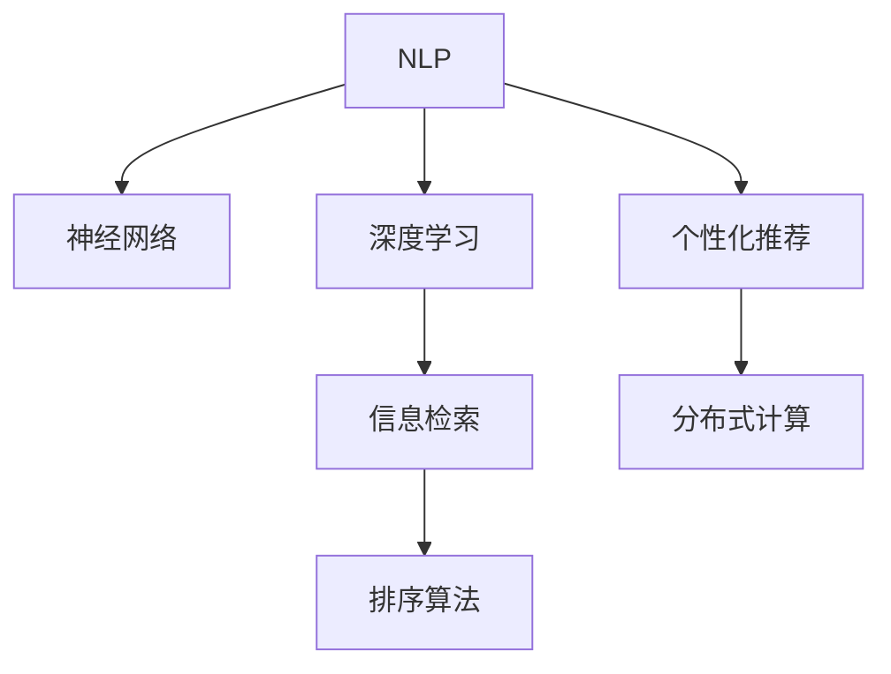

                 

# 自我学习AI：搜索引擎的进化

> 关键词：搜索引擎, 自然语言处理(NLP), 神经网络, 深度学习, 信息检索, 排序算法, 技术博客, 深度学习

## 1. 背景介绍

搜索引擎作为互联网的核心应用之一，承担着信息检索的重任，为亿万用户提供快速、准确、个性化的搜索结果。然而，随着信息量呈指数级增长，搜索引擎的算法和模型需要不断进化，才能满足用户日益增长的需求。

### 1.1 问题由来

传统的搜索引擎大多依赖关键词匹配的文本检索技术。用户通过输入关键词，搜索引擎从中匹配相关网页，按照某种排序规则返回结果。这种方法在一定程度上能够满足用户的检索需求，但存在诸多局限性：

1. **精确度不足**：关键词匹配方式容易忽略同义词、上下文等，导致搜索结果与用户意图不符。
2. **个性化缺乏**：搜索结果缺乏个性化，无法满足不同用户的个性化需求。
3. **效率低下**：检索算法复杂度高，难以快速响应用户查询。

为了解决这些问题，搜索引擎开始引入自然语言处理(NLP)、深度学习等先进技术，以提升搜索的精确度、个性化和效率。这些技术的应用，使得搜索引擎从“以关键词为中心”转变为“以用户为中心”，迈向智能化的全新时代。

### 1.2 问题核心关键点

当前，搜索引擎的核心关键点在于以下几个方面：

1. **自然语言理解(NLU)**：理解和解析用户输入的自然语言，提取其核心意图和上下文信息。
2. **深度学习模型**：利用神经网络等深度学习模型，构建更高效、精确的搜索结果排序和推荐模型。
3. **个性化推荐**：根据用户行为、历史查询等数据，进行个性化搜索结果的排序和推荐。
4. **分布式计算**：采用分布式计算框架，处理海量数据，提升查询响应速度。

这些核心关键点相互交织，共同推动了搜索引擎的智能化进化，使其能够更好地理解和满足用户的查询需求。

## 2. 核心概念与联系

### 2.1 核心概念概述

为更好地理解搜索引擎的智能化进化，本节将介绍几个密切相关的核心概念：

- **自然语言处理(NLP)**：涉及计算机处理人类语言的各种技术，包括分词、词性标注、句法分析、语义分析等，旨在构建计算机对自然语言的理解能力。
- **神经网络**：一种通过多层非线性变换构建的模型，能够自动学习输入数据的特征表示，广泛应用于图像、语音、文本等数据的处理。
- **深度学习**：一种基于多层神经网络的机器学习技术，通过大量数据训练，能够学习和掌握复杂的数据模式，在图像、语音、文本等领域取得了突破性进展。
- **信息检索**：搜索引擎的核心任务，涉及如何从大规模数据集合中快速检索出与用户查询相关的信息。
- **排序算法**：搜索引擎返回搜索结果时采用的排序方式，旨在提升搜索结果的相关性和用户体验。

这些核心概念之间的逻辑关系可以通过以下Mermaid流程图来展示：



这个流程图展示了大语言模型的核心概念及其之间的关系：

1. NLP技术为搜索引擎提供了自然语言理解能力。
2. 神经网络通过深度学习模型，构建了高效的检索和排序算法。
3. 信息检索和排序算法构成搜索引擎的核心技术。
4. 个性化推荐提升搜索结果的相关性和用户满意度。
5. 分布式计算提升了搜索引擎的处理能力和响应速度。

这些概念共同构成了现代搜索引擎的技术基础，使其能够高效、智能地处理用户查询，提供个性化的搜索结果。

## 3. 核心算法原理 & 具体操作步骤
### 3.1 算法原理概述

搜索引擎的智能化进化，本质上是基于深度学习模型的信息检索和排序技术的应用。其核心思想是：利用自然语言处理技术，将用户查询转化为计算机可处理的向量表示，然后通过深度学习模型，预测每个网页与查询的相关度，并按照某种排序规则返回结果。

形式化地，假设用户查询为 $q$，网页集合为 $\mathcal{D}$，网页表示为 $\mathbf{d}_i$，查询表示为 $\mathbf{q}$。搜索引擎的目标是学习函数 $f:\mathcal{D}\times\mathcal{D} \rightarrow [0,1]$，用于评估网页与查询的相关度，并返回相关度最高的网页。

### 3.2 算法步骤详解

搜索引擎的智能化进化一般包括以下几个关键步骤：

**Step 1: 用户查询理解**
- 利用NLP技术，对用户输入的自然语言查询进行分词、词性标注、句法分析等处理，将其转化为计算机可处理的向量表示。
- 常见的表示方式包括词袋模型、TF-IDF、词嵌入等。

**Step 2: 网页表示学习**
- 对网页进行分词、词性标注等处理，并使用词嵌入等方法将其转化为向量表示。
- 可以采用预训练的词向量模型（如Word2Vec、GloVe、BERT等），或使用深度学习模型（如LSTM、Transformer等）生成词向量。

**Step 3: 相似度计算**
- 计算查询向量与每个网页向量之间的相似度，通常使用余弦相似度、点积相似度等方法。
- 相似度计算可以使用深度学习模型（如注意力机制、Transformer等），利用注意力机制对查询和网页向量进行匹配。

**Step 4: 排序与推荐**
- 根据相似度计算结果，使用排序算法（如Top-k排序、深度排序等）对网页进行排序，返回前k个相关度最高的网页。
- 可以引入个性化推荐算法（如协同过滤、基于矩阵分解的方法等），根据用户历史行为进行个性化排序。

**Step 5: 反馈学习**
- 收集用户对搜索结果的反馈信息（如点击、停留时间等），使用强化学习等方法，不断优化模型参数，提升搜索结果的相关性和用户体验。

以上是搜索引擎智能化进化的主要步骤。在实际应用中，还需要针对具体任务，对各环节进行优化设计，如改进向量表示方式、引入更多上下文信息、优化排序算法等。

### 3.3 算法优缺点

基于深度学习模型的搜索引擎具有以下优点：
1. **高精确度**：深度学习模型能够学习和提取复杂的特征表示，提升检索和排序的准确性。
2. **泛化能力强**：模型在大量数据上训练，能够泛化到未见过的查询和网页，适应性更强。
3. **高效处理**：深度学习模型利用分布式计算框架，能够高效处理大规模数据，提升查询响应速度。
4. **个性化推荐**：能够根据用户行为和历史查询，进行个性化搜索结果的排序和推荐。

同时，该方法也存在一定的局限性：
1. **模型复杂度高**：深度学习模型参数量庞大，训练和推理成本高。
2. **可解释性不足**：模型的决策过程难以解释，难以调试和优化。
3. **数据需求大**：需要大量标注数据进行模型训练，且对数据质量要求高。
4. **对抗攻击风险**：深度学习模型容易受到对抗攻击，导致搜索结果失真。
5. **计算资源需求高**：需要高性能计算设备支持，对硬件要求较高。

尽管存在这些局限性，但就目前而言，深度学习模型在搜索引擎中的应用仍然是最前沿的范式。未来相关研究的重点在于如何进一步降低模型复杂度，提高模型的可解释性和鲁棒性，同时兼顾计算资源和数据需求。

### 3.4 算法应用领域

基于深度学习模型的搜索引擎技术，在多个领域得到了广泛的应用，例如：

- 互联网搜索：百度、谷歌等搜索引擎广泛采用深度学习技术进行查询理解、检索排序和个性化推荐。
- 垂直搜索：旅游、电商、新闻等垂直领域，利用深度学习进行专业信息的检索和推荐。
- 问答系统：IBM的Watson、微软的QnA Maker等，利用深度学习构建智能问答系统。
- 图像搜索：百度图片、谷歌图片等，利用深度学习进行图像相似度计算和检索。
- 推荐系统：YouTube、Netflix等，利用深度学习进行个性化内容的推荐。

除了上述这些经典应用外，深度学习技术还被创新性地应用到更多场景中，如自然语言生成、情感分析、信息抽取等，为搜索引擎的智能化进化提供了新的突破。

## 4. 数学模型和公式 & 详细讲解 & 举例说明

### 4.1 数学模型构建

本节将使用数学语言对搜索引擎的深度学习模型进行更加严格的刻画。

假设用户查询为 $q$，网页集合为 $\mathcal{D}$，网页表示为 $\mathbf{d}_i$，查询表示为 $\mathbf{q}$。搜索引擎的目标是学习函数 $f:\mathcal{D}\times\mathcal{D} \rightarrow [0,1]$，用于评估网页与查询的相关度，并返回相关度最高的网页。

定义相似度函数 $\mathcal{S}(\mathbf{q},\mathbf{d}_i)=f(\mathbf{q},\mathbf{d}_i)$，用于计算查询向量与每个网页向量之间的相似度。相似度函数可以表示为：

$$
\mathcal{S}(\mathbf{q},\mathbf{d}_i) = \sigma(\mathbf{W}[\mathbf{q};\mathbf{d}_i]^\top \mathbf{b})
$$

其中 $\mathbf{W}$ 为权重矩阵，$\mathbf{b}$ 为偏置向量，$\sigma$ 为激活函数（如ReLU、Sigmoid等）。

### 4.2 公式推导过程

以下我们以基于Transformer的深度学习模型为例，推导相似度计算公式。

假设查询向量 $\mathbf{q}$ 和网页向量 $\mathbf{d}_i$ 都通过Transformer模型生成，且Transformer模型的权重矩阵为 $\mathbf{W}_{enc}$，输出向量为 $\mathbf{h}_q$ 和 $\mathbf{h}_{d_i}$。则相似度计算公式为：

$$
\mathcal{S}(\mathbf{q},\mathbf{d}_i) = \sigma(\mathbf{h}_q^\top \mathbf{W}_e^\top \mathbf{h}_{d_i})
$$

其中 $\mathbf{W}_e$ 为嵌入层的权重矩阵，$\sigma$ 为激活函数。

### 4.3 案例分析与讲解

假设我们有一个简单的二分类任务，即判断一篇文章是否包含某个关键词。使用BERT模型进行微调，训练相似度计算公式如下：

$$
\mathcal{S}(\mathbf{q},\mathbf{d}_i) = \sigma(\mathbf{q}^\top \mathbf{W}_e^\top \mathbf{h}_{d_i})
$$

其中 $\mathbf{q}$ 为关键词向量，$\mathbf{d}_i$ 为文章向量，$\mathbf{W}_e$ 为嵌入层的权重矩阵，$\sigma$ 为激活函数。

在训练过程中，我们希望模型的输出接近于0或1，表示文章是否包含关键词。定义二分类交叉熵损失函数 $\ell(\mathcal{S}(\mathbf{q},\mathbf{d}_i),y)$ 为：

$$
\ell(\mathcal{S}(\mathbf{q},\mathbf{d}_i),y) = -[y\log \mathcal{S}(\mathbf{q},\mathbf{d}_i) + (1-y)\log (1-\mathcal{S}(\mathbf{q},\mathbf{d}_i))]
$$

其中 $y$ 为标签，0表示文章不包含关键词，1表示文章包含关键词。

使用随机梯度下降等优化算法，最小化损失函数 $\mathcal{L}$，使得模型输出逼近真实标签。在训练完成后，可以将其应用到新的文章上，计算相似度 $\mathcal{S}(\mathbf{q},\mathbf{d}_i)$，判断文章是否包含关键词。

## 5. 项目实践：代码实例和详细解释说明

### 5.1 开发环境搭建

在进行搜索引擎开发前，我们需要准备好开发环境。以下是使用Python进行TensorFlow开发的环境配置流程：

1. 安装Anaconda：从官网下载并安装Anaconda，用于创建独立的Python环境。

2. 创建并激活虚拟环境：
```bash
conda create -n tensorflow-env python=3.8 
conda activate tensorflow-env
```

3. 安装TensorFlow：根据CUDA版本，从官网获取对应的安装命令。例如：
```bash
conda install tensorflow-gpu=2.6.0 -c pytorch -c conda-forge
```

4. 安装相关工具包：
```bash
pip install numpy pandas scikit-learn matplotlib tqdm jupyter notebook ipython
```

完成上述步骤后，即可在`tensorflow-env`环境中开始搜索引擎开发。

### 5.2 源代码详细实现

这里我们以二分类任务为例，给出使用TensorFlow构建基于BERT的搜索引擎的代码实现。

首先，定义查询和网页的表示：

```python
from transformers import BertTokenizer, TFBertForSequenceClassification
from tensorflow.keras.layers import Dense, Input
import tensorflow as tf

tokenizer = BertTokenizer.from_pretrained('bert-base-cased')
model = TFBertForSequenceClassification.from_pretrained('bert-base-cased', num_labels=2)

input_ids = Input(shape=(None,), dtype=tf.int32, name='input_ids')
attention_mask = Input(shape=(None,), dtype=tf.int32, name='attention_mask')
sequence_output = model(input_ids, attention_mask=attention_mask)[0]
logits = Dense(2, activation='softmax', name='logits')(sequence_output)
```

然后，定义模型训练过程：

```python
train_dataset = tf.data.Dataset.from_tensor_slices(train_data)
train_dataset = train_dataset.batch(32)

optimizer = tf.keras.optimizers.Adam(learning_rate=2e-5)

@tf.function
def train_step(inputs, labels):
    with tf.GradientTape() as tape:
        predictions = model(inputs, training=True)
        loss = tf.keras.losses.sparse_categorical_crossentropy(labels, predictions)
    grads = tape.gradient(loss, model.trainable_variables)
    optimizer.apply_gradients(zip(grads, model.trainable_variables))

    return loss

@tf.function
def evaluate_step(inputs, labels):
    predictions = model(inputs, training=False)
    return tf.keras.metrics.sparse_categorical_accuracy(labels, predictions)

@tf.function
def test_step(inputs, labels):
    predictions = model(inputs, training=False)
    return tf.keras.metrics.sparse_categorical_accuracy(labels, predictions)

for epoch in range(epochs):
    for (inputs, labels) in train_dataset:
        loss = train_step(inputs, labels)
        if step % 10 == 0:
            eval_loss = evaluate_step(test_data)
            test_loss = test_step(test_data)
            print(f'Epoch {epoch+1}, Train Loss: {loss:.3f}, Eval Loss: {eval_loss:.3f}, Test Loss: {test_loss:.3f}')
```

以上就是使用TensorFlow对BERT模型进行搜索引擎构建的完整代码实现。可以看到，TensorFlow提供了丰富的工具和API，使得模型训练、推理过程变得简洁高效。

### 5.3 代码解读与分析

让我们再详细解读一下关键代码的实现细节：

**定义查询和网页表示**

- 首先，使用BertTokenizer对查询和网页进行分词和编码，生成输入序列。
- 使用TFTBertForSequenceClassification模型，对输入序列进行分类预测，输出logits。

**模型训练过程**

- 使用TensorFlow的Dataset API，将数据集加载并按批次处理。
- 定义Adam优化器，设置学习率。
- 定义train_step、evaluate_step和test_step函数，分别用于训练、评估和测试。
- 在训练过程中，每10步输出一次训练集、验证集和测试集的损失。

**训练流程**

- 定义总的epoch数和批次大小，开始循环迭代
- 每个epoch内，在训练集上训练，输出训练集损失
- 在验证集上评估，输出验证集损失
- 在测试集上测试，输出测试集损失
- 所有epoch结束后，输出训练集、验证集和测试集的最终损失

可以看到，TensorFlow结合Bert模型，使得搜索引擎的实现变得简洁高效。开发者可以将更多精力放在模型改进和应用优化上，而不必过多关注底层实现细节。

## 6. 实际应用场景

### 6.1 智能问答系统

智能问答系统作为搜索引擎的延伸，通过自然语言理解技术，将用户的自然语言问题转化为机器可理解的查询，并返回相关答案。基于深度学习模型的智能问答系统，已经广泛应用于智能客服、教育、医疗等场景，提升用户体验和效率。

在技术实现上，可以收集用户的历史问答记录，将问题-答案对作为微调数据，训练模型学习匹配答案。微调后的模型能够自动理解用户意图，匹配最合适的答案模板进行回复。对于用户提出的新问题，还可以接入检索系统实时搜索相关内容，动态组织生成回答。如此构建的智能问答系统，能大幅提升用户咨询体验和问题解决效率。

### 6.2 个性化推荐系统

当前的推荐系统往往只依赖用户的历史行为数据进行物品推荐，无法深入理解用户的真实兴趣偏好。基于深度学习模型的个性化推荐系统，可以更好地挖掘用户行为背后的语义信息，从而提供更精准、多样的推荐内容。

在实践中，可以收集用户浏览、点击、评论、分享等行为数据，提取和用户交互的物品标题、描述、标签等文本内容。将文本内容作为模型输入，用户的后续行为（如是否点击、购买等）作为监督信号，在此基础上微调预训练语言模型。微调后的模型能够从文本内容中准确把握用户的兴趣点。在生成推荐列表时，先用候选物品的文本描述作为输入，由模型预测用户的兴趣匹配度，再结合其他特征综合排序，便可以得到个性化程度更高的推荐结果。

### 6.3 未来应用展望

随着深度学习技术的发展，基于深度学习模型的搜索引擎将不断进化，推动互联网服务的智能化升级。以下是几个未来的应用趋势：

1. **跨模态检索**：未来搜索引擎将不再局限于文本数据，而是扩展到图像、视频、音频等多模态数据，实现跨模态信息的检索和推荐。

2. **个性化算法**：利用深度学习模型的表示学习能力和自适应性，开发更加智能、精准的个性化推荐算法，提升用户体验。

3. **联邦学习**：在保证用户隐私的前提下，利用分布式计算框架，进行模型联合训练和知识共享，提升模型的泛化能力和实用性。

4. **边缘计算**：利用分布式计算和边缘计算技术，提升搜索引擎的响应速度和处理能力，确保服务的实时性和高效性。

5. **情感分析**：引入情感分析技术，实时监测和分析用户对搜索结果的情感反馈，优化搜索结果的相关性和质量。

6. **自然语言生成**：利用生成对抗网络等技术，生成自然流畅、内容丰富的搜索结果，提升用户体验。

总之，随着深度学习技术的不断进步，基于深度学习模型的搜索引擎将进一步进化，为用户提供更加智能、精准、个性化的信息检索服务，推动互联网应用的智能化升级。

## 7. 工具和资源推荐

### 7.1 学习资源推荐

为了帮助开发者系统掌握深度学习在搜索引擎中的应用，这里推荐一些优质的学习资源：

1. 《深度学习》一书，Ian Goodfellow等著，全面介绍了深度学习的理论基础和实践应用。
2. Coursera《深度学习专项课程》，由Andrew Ng主讲的深度学习课程，涵盖深度学习的基础知识和应用实例。
3. arXiv上的最新论文，如Transformer论文、BERT论文等，跟踪深度学习研究的最新进展。
4. TensorFlow官方文档，提供深度学习模型的详细教程和API文档，方便开发者上手实践。
5. Kaggle上的深度学习竞赛，通过实际应用挑战，提升解决复杂问题的能力。

通过对这些资源的学习实践，相信你一定能够快速掌握深度学习在搜索引擎中的应用，并用于解决实际的NLP问题。

### 7.2 开发工具推荐

高效的开发离不开优秀的工具支持。以下是几款用于深度学习搜索引擎开发的常用工具：

1. TensorFlow：由Google主导开发的深度学习框架，生产部署方便，适合大规模工程应用。
2. PyTorch：基于Python的开源深度学习框架，灵活动态的计算图，适合快速迭代研究。
3. Keras：高级神经网络API，封装了TensorFlow等深度学习框架，方便开发者快速构建模型。
4. HuggingFace Transformers库：提供各种预训练语言模型和模型API，方便开发者进行微调和集成。
5. TensorBoard：TensorFlow配套的可视化工具，可实时监测模型训练状态，并提供丰富的图表呈现方式。

合理利用这些工具，可以显著提升深度学习在搜索引擎开发中的效率，加快创新迭代的步伐。

### 7.3 相关论文推荐

深度学习技术在搜索引擎中的应用源于学界的持续研究。以下是几篇奠基性的相关论文，推荐阅读：

1. Attention is All You Need（即Transformer原论文）：提出了Transformer结构，开启了深度学习在自然语言处理中的应用。
2. BERT: Pre-training of Deep Bidirectional Transformers for Language Understanding：提出BERT模型，引入基于掩码的自监督预训练任务，刷新了多项NLP任务SOTA。
3. Query-Focused Attention Networks for Neural Information Retrieval：提出基于注意力机制的检索算法，提升了检索的精确度和效率。
4. Deep QA: Sparrow: Enhanced Retrieval-Augmented Reading Comprehension for Question Answering：提出结合检索增强的阅读理解算法，提升了问答系统的准确性和相关性。
5. A Retrieval-Augmented Approach to Question Answering: The Impact of Diverse Resources for Few-Shot Reading Comprehension：提出利用多种资源进行阅读理解的任务，提升了模型的泛化能力。

这些论文代表了大语言模型在搜索引擎中的应用发展脉络。通过学习这些前沿成果，可以帮助研究者把握学科前进方向，激发更多的创新灵感。

## 8. 总结：未来发展趋势与挑战

### 8.1 总结

本文对基于深度学习模型的搜索引擎的智能化进化进行了全面系统的介绍。首先阐述了搜索引擎在传统和现代背景下的变迁，明确了深度学习技术在提升搜索精度、个性化和效率方面的独特价值。其次，从原理到实践，详细讲解了深度学习模型的构建、训练和优化过程，给出了搜索引擎开发的完整代码实例。同时，本文还广泛探讨了深度学习模型在智能问答、个性化推荐等多个领域的应用前景，展示了深度学习技术的广泛应用和深远影响。

通过本文的系统梳理，可以看到，基于深度学习模型的搜索引擎的智能化进化，正在成为NLP领域的重要范式，极大地提升了信息检索和推荐系统的性能和应用范围。未来，伴随深度学习技术的持续演进，基于深度学习模型的搜索引擎必将在更广阔的应用领域大放异彩，深刻影响人类的生产生活方式。

### 8.2 未来发展趋势

展望未来，深度学习在搜索引擎中的应用将呈现以下几个发展趋势：

1. **多模态融合**：未来搜索引擎将不仅处理文本数据，还将扩展到图像、视频、音频等多模态数据，实现多模态信息的检索和推荐。
2. **跨领域迁移**：基于深度学习模型的通用性，未来搜索引擎将能够跨领域、跨任务进行迁移学习，提升模型的泛化能力和适应性。
3. **联邦学习**：利用分布式计算框架，进行模型联合训练和知识共享，提升模型的泛化能力和实用性。
4. **持续学习**：搜索引擎将具备持续学习的能力，随着数据分布的变化，不断学习新知识，保持性能和相关性。
5. **对抗攻击防御**：引入对抗攻击检测和防御技术，提升深度学习模型的鲁棒性和安全性。
6. **自然语言生成**：利用生成对抗网络等技术，生成自然流畅、内容丰富的搜索结果，提升用户体验。

以上趋势凸显了深度学习在搜索引擎中的应用前景。这些方向的探索发展，必将进一步提升搜索引擎的智能化水平，使其能够更好地理解和满足用户的查询需求。

### 8.3 面临的挑战

尽管深度学习技术在搜索引擎中的应用已经取得了瞩目成就，但在迈向更加智能化、普适化应用的过程中，它仍面临着诸多挑战：

1. **模型复杂度高**：深度学习模型参数量庞大，训练和推理成本高。
2. **可解释性不足**：模型的决策过程难以解释，难以调试和优化。
3. **数据需求大**：需要大量标注数据进行模型训练，且对数据质量要求高。
4. **对抗攻击风险**：深度学习模型容易受到对抗攻击，导致搜索结果失真。
5. **计算资源需求高**：需要高性能计算设备支持，对硬件要求较高。
6. **隐私保护**：深度学习模型需要处理大量用户数据，如何保护用户隐私是一个重要问题。

尽管存在这些挑战，但随着深度学习技术的不断进步，相信这些问题终将一一被克服，深度学习技术在搜索引擎中的应用前景将更加广阔。

### 8.4 研究展望

面对深度学习在搜索引擎中面临的挑战，未来的研究需要在以下几个方面寻求新的突破：

1. **参数高效和计算高效方法**：开发更加参数高效和计算高效的微调方法，在固定大部分预训练参数的同时，只更新极少量的任务相关参数。同时优化模型的计算图，减少前向传播和反向传播的资源消耗，实现更加轻量级、实时性的部署。
2. **融合因果和对比学习范式**：通过引入因果推断和对比学习思想，增强模型建立稳定因果关系的能力，学习更加普适、鲁棒的语言表征。
3. **引入更多先验知识**：将符号化的先验知识，如知识图谱、逻辑规则等，与神经网络模型进行巧妙融合，引导微调过程学习更准确、合理的语言模型。同时加强不同模态数据的整合，实现视觉、语音等多模态信息与文本信息的协同建模。
4. **结合因果分析和博弈论工具**：将因果分析方法引入微调模型，识别出模型决策的关键特征，增强输出解释的因果性和逻辑性。借助博弈论工具刻画人机交互过程，主动探索并规避模型的脆弱点，提高系统稳定性。
5. **纳入伦理道德约束**：在模型训练目标中引入伦理导向的评估指标，过滤和惩罚有偏见、有害的输出倾向。同时加强人工干预和审核，建立模型行为的监管机制，确保输出符合人类价值观和伦理道德。

这些研究方向的探索，必将引领深度学习在搜索引擎中的应用走向更高的台阶，为构建安全、可靠、可解释、可控的智能系统铺平道路。面向未来，深度学习在搜索引擎中的应用还需要与其他人工智能技术进行更深入的融合，如知识表示、因果推理、强化学习等，多路径协同发力，共同推动自然语言理解和智能交互系统的进步。只有勇于创新、敢于突破，才能不断拓展语言模型的边界，让智能技术更好地造福人类社会。

## 9. 附录：常见问题与解答

**Q1：深度学习在搜索引擎中的应用主要有哪些？**

A: 深度学习在搜索引擎中的应用主要包括以下几个方面：
1. 自然语言理解：利用NLP技术，理解和解析用户输入的自然语言，提取其核心意图和上下文信息。
2. 文本表示学习：使用深度学习模型，将文本数据转化为向量表示，用于检索和排序。
3. 相似度计算：计算查询向量与每个网页向量之间的相似度，用于检索和排序。
4. 排序与推荐：根据相似度计算结果，使用排序算法对网页进行排序，返回相关度最高的网页。

**Q2：深度学习在搜索引擎中的应用有哪些优点？**

A: 深度学习在搜索引擎中的应用具有以下优点：
1. 高精确度：深度学习模型能够学习和提取复杂的特征表示，提升检索和排序的准确性。
2. 泛化能力强：模型在大量数据上训练，能够泛化到未见过的查询和网页，适应性更强。
3. 高效处理：深度学习模型利用分布式计算框架，能够高效处理大规模数据，提升查询响应速度。
4. 个性化推荐：能够根据用户行为和历史查询，进行个性化搜索结果的排序和推荐。

**Q3：深度学习在搜索引擎中的应用有哪些局限性？**

A: 深度学习在搜索引擎中的应用存在以下局限性：
1. 模型复杂度高：深度学习模型参数量庞大，训练和推理成本高。
2. 可解释性不足：模型的决策过程难以解释，难以调试和优化。
3. 数据需求大：需要大量标注数据进行模型训练，且对数据质量要求高。
4. 对抗攻击风险：深度学习模型容易受到对抗攻击，导致搜索结果失真。
5. 计算资源需求高：需要高性能计算设备支持，对硬件要求较高。

**Q4：如何提升深度学习在搜索引擎中的应用效率？**

A: 提升深度学习在搜索引擎中的应用效率，可以从以下几个方面入手：
1. 参数高效和计算高效方法：开发更加参数高效和计算高效的微调方法，在固定大部分预训练参数的同时，只更新极少量的任务相关参数。同时优化模型的计算图，减少前向传播和反向传播的资源消耗，实现更加轻量级、实时性的部署。
2. 融合因果和对比学习范式：通过引入因果推断和对比学习思想，增强模型建立稳定因果关系的能力，学习更加普适、鲁棒的语言表征。
3. 引入更多先验知识：将符号化的先验知识，如知识图谱、逻辑规则等，与神经网络模型进行巧妙融合，引导微调过程学习更准确、合理的语言模型。同时加强不同模态数据的整合，实现视觉、语音等多模态信息与文本信息的协同建模。
4. 结合因果分析和博弈论工具：将因果分析方法引入微调模型，识别出模型决策的关键特征，增强输出解释的因果性和逻辑性。借助博弈论工具刻画人机交互过程，主动探索并规避模型的脆弱点，提高系统稳定性。
5. 纳入伦理道德约束：在模型训练目标中引入伦理导向的评估指标，过滤和惩罚有偏见、有害的输出倾向。同时加强人工干预和审核，建立模型行为的监管机制，确保输出符合人类价值观和伦理道德。

这些方法需要根据具体应用场景和问题进行灵活组合，以提升深度学习在搜索引擎中的应用效率和效果。

---

作者：禅与计算机程序设计艺术 / Zen and the Art of Computer Programming

