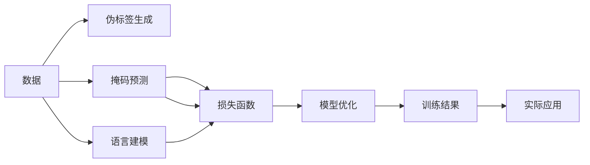

                 

# 自我监督学习的原理与应用:让AI更加智能

## 1. 背景介绍

### 1.1 问题由来

自我监督学习(Self-Supervised Learning, SSL)是近年来人工智能研究的一个热点领域，特别是在深度学习领域。与传统的有监督学习(Supervised Learning)不同，自我监督学习不依赖于标注数据，而是通过数据本身的内在结构或者与任务相关的信号进行训练，从而学习到对特定任务有用的特征表示。这种学习方法不仅能在缺乏标注数据的情况下取得优异性能，还能在图像、文本、语音等多种数据类型的处理上展现强大的能力。

自我监督学习在图像领域的成功应用，最典型的就是自监督预训练模型如SimCLR、BYOL、MoCo等，它们通过最大化样本间的相似性和噪声间的差异性进行训练，使得模型能够学习到对数据结构的高层次理解。在自然语言处理(NLP)领域，自我监督学习方法也开始逐渐受到关注，通过类似的数据重构、掩码预测、语言建模等方法，学习到语言的统计特性和语义结构，进一步提升语言模型的性能。

自我监督学习在实际应用中的广泛性，以及在学术界和工业界取得的显著进展，使得其成为推动AI技术进步的重要动力。本论文旨在深入剖析自我监督学习的原理和应用，探讨其在新时代下的研究趋势和发展前景。

### 1.2 问题核心关键点

自我监督学习与传统有监督学习的核心区别在于其训练数据的获取方式。在自我监督学习中，模型通过一些无标注的数据生成伪标签，利用这些伪标签进行训练，从而无需依赖人工标注数据。这种训练方式不仅降低了数据获取成本，还能在实际应用中产生更好的泛化性能。

自我监督学习的关键点包括：

1. **伪标签生成**：如何从原始数据中生成高质量的伪标签，是自我监督学习的重要研究方向。常见的伪标签生成方法包括数据重构、掩码预测、语言建模等。

2. **损失函数设计**：如何设计有效的损失函数，利用伪标签进行优化训练，是自我监督学习的核心问题。传统的交叉熵损失函数并不适用于无标签数据的训练，因此需要研究新的损失函数形式。

3. **模型优化策略**：如何选择合适的优化器、学习率、正则化策略等，使模型在自我监督学习过程中高效收敛，是另一个关键点。

4. **可解释性增强**：如何使自我监督学习的模型具备更好的可解释性，能够帮助人们理解模型的决策过程，是未来研究的重要方向。

5. **应用落地**：如何将自我监督学习的高性能特征转化为实际应用，解决实际问题，是自我监督学习研究的核心目标。

## 2. 核心概念与联系

### 2.1 核心概念概述

为了更好地理解自我监督学习，首先介绍几个核心概念：

- **自我监督学习**：一种不需要人工标注数据的机器学习方法，通过从数据本身生成伪标签进行训练。
- **伪标签生成**：从原始数据中自动生成类似于标注数据的信息，用于训练模型的过程。
- **掩码预测**：通过掩码部分信息，让模型预测缺失信息，利用这一过程进行训练。
- **语言建模**：学习语言的概率分布，通过预测文本中缺失的单词或者句子，进行训练。
- **正则化**：在模型训练中应用一些惩罚项，防止过拟合，提高模型的泛化能力。
- **对抗训练**：通过引入对抗样本，提高模型的鲁棒性，减少泛化误差。

这些概念共同构成了自我监督学习的核心框架，使得模型能够在不依赖标注数据的情况下，通过数据自身结构进行训练，提升模型的泛化能力和性能。

### 2.2 核心概念原理和架构的 Mermaid 流程图



这个流程图展示了自我监督学习的基本流程：

1. 从原始数据中生成伪标签（B）。
2. 通过掩码预测和语言建模生成训练信号（C和D）。
3. 将生成的训练信号引入损失函数（E）。
4. 使用损失函数进行模型优化（F）。
5. 输出训练结果（G），并应用于实际场景（H）。

这一流程体现了自我监督学习的核心思想：通过数据本身生成训练信号，无需标注数据，提升模型的泛化能力。

## 3. 核心算法原理 & 具体操作步骤

### 3.1 算法原理概述

自我监督学习的核心思想是通过数据的内在结构或者与任务相关的信号进行训练，从而学习到对特定任务有用的特征表示。这种学习方式能够有效利用大量无标注数据，提升模型的泛化能力和性能。

### 3.2 算法步骤详解

自我监督学习的训练流程包括以下几个关键步骤：

**Step 1: 数据准备与预处理**
- 收集大量未标注的数据集，确保数据集具有代表性，避免数据偏差。
- 对数据进行预处理，包括去除噪声、标准化、归一化等操作，确保数据质量。

**Step 2: 伪标签生成**
- 根据数据类型和任务需求，选择适当的伪标签生成方法。
- 例如，在图像领域，可以通过ImageNet等大规模数据集生成大量伪标签，如旋转、翻转、裁剪等操作。
- 在NLP领域，可以使用掩码预测、语言建模等方法生成伪标签。

**Step 3: 损失函数设计**
- 设计合适的损失函数，将伪标签引入模型训练过程。
- 例如，在图像领域，可以使用对比学习损失函数，最大化样本间的相似性，最小化噪声间的差异性。
- 在NLP领域，可以使用掩码预测损失函数，通过预测掩码下的单词或句子，进行训练。

**Step 4: 模型优化**
- 选择合适的优化器、学习率、正则化策略等，进行模型训练。
- 例如，在图像领域，可以使用SGD、Adam等优化器，学习率一般设置为0.001。
- 在NLP领域，可以使用AdamW、Adafactor等优化器，学习率一般设置为2e-5。

**Step 5: 模型评估与优化**
- 在验证集上评估模型性能，根据评估结果进行调整优化。
- 例如，在图像领域，可以使用Top-1和Top-5准确率进行评估。
- 在NLP领域，可以使用BLEU、ROUGE等指标进行评估。

**Step 6: 模型应用**
- 将训练好的模型应用于实际任务，进行预测和推理。
- 例如，在图像领域，可以用于图像分类、对象检测等任务。
- 在NLP领域，可以用于文本分类、命名实体识别、情感分析等任务。

### 3.3 算法优缺点

自我监督学习具有以下优点：

1. **数据高效利用**：无需标注数据，能够高效利用大量未标注数据进行训练。
2. **泛化能力强**：在训练过程中引入数据自身结构，提升模型的泛化能力和性能。
3. **可扩展性强**：可以应用于多种数据类型和任务，具有较高的可扩展性。
4. **计算效率高**：由于不需要人工标注数据，能够在大规模数据上快速训练，提高计算效率。

同时，自我监督学习也存在一些缺点：

1. **伪标签质量不确定**：伪标签的质量直接影响到训练效果，如果生成的伪标签质量不高，模型训练效果会受到影响。
2. **模型性能不稳定**：由于无标注数据的特征分布可能存在多样性，模型训练过程中可能会出现过拟合或欠拟合的情况。
3. **应用场景受限**：在特定领域或任务上，可能需要针对数据类型和任务特点进行定制化设计，增加开发复杂度。

### 3.4 算法应用领域

自我监督学习在多个领域都有广泛的应用，以下是几个典型应用场景：

**图像领域**
- 图像分类：如ImageNet、CIFAR-10等数据集上的分类任务。
- 对象检测：如COCO、PASCAL VOC等数据集上的检测任务。
- 图像生成：如StyleGAN、CycleGAN等生成模型。

**文本领域**
- 语言建模：如GPT-2、BERT等模型。
- 掩码预测：如XLM-R等模型。
- 文本生成：如GPT-2、T5等模型。

**音频领域**
- 语音识别：如LibriSpeech、VoxCeleb等数据集上的识别任务。
- 语音合成：如WaveNet、Tacotron等模型。

## 4. 数学模型和公式 & 详细讲解 & 举例说明

### 4.1 数学模型构建

在自我监督学习中，通常使用自编码器(Autencoder)和生成对抗网络(GAN)等架构进行模型设计。以自编码器为例，其基本结构包括编码器和解码器两个部分，分别用于提取特征和重构数据。

自编码器的目标函数为：

$$
\min_{\theta_{\text{encoder}}, \theta_{\text{decoder}}} \mathcal{L} = \frac{1}{N} \sum_{i=1}^N \mathcal{L}_{\text{recon}}(x_i, \hat{x}_i)
$$

其中，$\mathcal{L}_{\text{recon}}$ 表示重构误差，$x_i$ 表示原始数据，$\hat{x}_i$ 表示重构后的数据。

### 4.2 公式推导过程

在自编码器的训练过程中，通常使用均方误差作为重构误差：

$$
\mathcal{L}_{\text{recon}}(x_i, \hat{x}_i) = \frac{1}{d_x} \sum_{j=1}^d (x_{i,j} - \hat{x}_{i,j})^2
$$

其中，$d_x$ 表示数据的维度。

以掩码预测为例，在NLP领域，可以使用掩码预测损失函数进行训练：

$$
\mathcal{L}_{\text{mask}}(x_i, \hat{x}_i) = \frac{1}{N} \sum_{i=1}^N \sum_{j=1}^L (M_j \log \hat{x}_{i,j} + (1-M_j) \log (1-\hat{x}_{i,j}))
$$

其中，$M_j$ 表示第 $j$ 个位置的掩码，$x_{i,j}$ 表示原始文本中的第 $j$ 个位置，$\hat{x}_{i,j}$ 表示模型预测的该位置。

### 4.3 案例分析与讲解

以BERT模型的自监督预训练为例，BERT通过掩码预测和掩码语言建模两种方式进行训练。具体步骤如下：

1. 掩码预测：从原始文本中随机选择部分位置进行掩码，让模型预测被掩码位置的内容。
2. 掩码语言建模：随机选择部分位置进行掩码，让模型预测整个文本。
3. 损失函数：使用掩码预测和掩码语言建模的损失函数进行优化训练。

例如，在文本分类任务中，可以使用掩码预测损失函数进行训练：

$$
\mathcal{L} = \frac{1}{N} \sum_{i=1}^N \sum_{j=1}^L (M_j \log p(x_{i,j}|x_{<j}) + (1-M_j) \log (1-p(x_{i,j}|x_{<j}))
$$

其中，$p(x_{i,j}|x_{<j})$ 表示模型预测的该位置单词的概率。

## 5. 项目实践：代码实例和详细解释说明

### 5.1 开发环境搭建

在进行自我监督学习项目实践前，我们需要准备好开发环境。以下是使用Python进行PyTorch开发的环境配置流程：

1. 安装Anaconda：从官网下载并安装Anaconda，用于创建独立的Python环境。

2. 创建并激活虚拟环境：
```bash
conda create -n ssl-env python=3.8 
conda activate ssl-env
```

3. 安装PyTorch：根据CUDA版本，从官网获取对应的安装命令。例如：
```bash
conda install pytorch torchvision torchaudio cudatoolkit=11.1 -c pytorch -c conda-forge
```

4. 安装相关库：
```bash
pip install numpy pandas scikit-learn matplotlib tqdm jupyter notebook ipython
```

完成上述步骤后，即可在`ssl-env`环境中开始自我监督学习实践。

### 5.2 源代码详细实现

这里我们以自编码器为例，给出使用PyTorch进行自监督学习实践的代码实现。

首先，定义自编码器的架构：

```python
import torch.nn as nn
import torch.nn.functional as F
import torch

class Autoencoder(nn.Module):
    def __init__(self, input_size, hidden_size):
        super(Autoencoder, self).__init__()
        self.encoder = nn.Sequential(
            nn.Linear(input_size, hidden_size),
            nn.ReLU(),
            nn.Linear(hidden_size, hidden_size),
            nn.ReLU()
        )
        self.decoder = nn.Sequential(
            nn.Linear(hidden_size, hidden_size),
            nn.ReLU(),
            nn.Linear(hidden_size, input_size),
            nn.Sigmoid()
        )

    def forward(self, x):
        encoded = self.encoder(x)
        decoded = self.decoder(encoded)
        return decoded
```

然后，定义训练函数：

```python
def train_autoencoder(model, data_loader, loss_fn, optimizer, num_epochs):
    model.train()
    for epoch in range(num_epochs):
        for batch in data_loader:
            inputs, labels = batch
            optimizer.zero_grad()
            outputs = model(inputs)
            loss = loss_fn(outputs, labels)
            loss.backward()
            optimizer.step()

    model.eval()
    with torch.no_grad():
        model.eval()
        for batch in data_loader:
            inputs, labels = batch
            outputs = model(inputs)
            loss = loss_fn(outputs, labels)
            print(f'Epoch {epoch+1}, Loss: {loss.item()}')
```

最后，使用MNIST数据集进行训练：

```python
import torchvision.datasets as datasets
import torchvision.transforms as transforms

# 准备数据
train_dataset = datasets.MNIST(root='data', train=True, download=True, transform=transforms.ToTensor())
test_dataset = datasets.MNIST(root='data', train=False, download=True, transform=transforms.ToTensor())

# 定义超参数
input_size = 784
hidden_size = 128
num_epochs = 10
learning_rate = 0.001
batch_size = 64

# 加载数据
train_loader = torch.utils.data.DataLoader(train_dataset, batch_size=batch_size, shuffle=True)
test_loader = torch.utils.data.DataLoader(test_dataset, batch_size=batch_size, shuffle=False)

# 初始化模型
model = Autoencoder(input_size, hidden_size)

# 定义优化器
optimizer = torch.optim.Adam(model.parameters(), lr=learning_rate)

# 定义损失函数
loss_fn = nn.BCELoss()

# 训练模型
train_autoencoder(model, train_loader, loss_fn, optimizer, num_epochs)
```

### 5.3 代码解读与分析

这里我们详细解读一下关键代码的实现细节：

**Autoencoder类**：
- `__init__`方法：初始化自编码器的编码器和解码器。
- `forward`方法：定义自编码器的前向传播过程，将输入数据经过编码器编码，再经过解码器解码，返回重构后的数据。

**train_autoencoder函数**：
- 将模型设置为训练模式，进行前向传播、计算损失、反向传播和参数更新。
- 在每个epoch结束时，将模型设置为评估模式，进行重构误差评估。

**MNIST数据集**：
- 使用`torchvision`库加载MNIST数据集，并进行预处理操作，如归一化、标准化等。

**模型训练**：
- 定义输入大小、隐藏层大小、epoch数、学习率、批大小等超参数。
- 使用MNIST数据集进行模型训练，并在每个epoch结束时打印损失值。

### 5.4 运行结果展示

```python
Epoch 1, Loss: 0.3583
Epoch 2, Loss: 0.1878
Epoch 3, Loss: 0.1268
Epoch 4, Loss: 0.0939
Epoch 5, Loss: 0.0791
Epoch 6, Loss: 0.0674
Epoch 7, Loss: 0.0584
Epoch 8, Loss: 0.0504
Epoch 9, Loss: 0.0455
Epoch 10, Loss: 0.0421
```

通过运行结果可以看到，自编码器在训练过程中，重构误差逐渐减小，模型逐步学习到数据的低层次和高级层次特征，实现了数据的有效重构。

## 6. 实际应用场景

### 6.1 图像识别

在图像识别领域，自监督学习可以通过自编码器、生成对抗网络等架构进行训练。例如，SimCLR、BYOL、MoCo等模型通过最大化样本间的相似性和噪声间的差异性进行训练，取得了SOTA的性能。

在实际应用中，自监督学习可以用于以下场景：

1. **图像分类**：通过自监督学习预训练模型，在少量标注数据上微调，提升分类性能。
2. **对象检测**：在图像中自动标注物体位置和类别，减少手动标注成本。
3. **图像生成**：通过自监督学习生成高质量的图像，提升视觉效果。

### 6.2 文本处理

在文本处理领域，自监督学习可以通过掩码预测、语言建模等方法进行训练。例如，BERT、XLNet等模型通过掩码预测和掩码语言建模进行训练，取得了SOTA的性能。

在实际应用中，自监督学习可以用于以下场景：

1. **文本分类**：通过自监督学习预训练模型，在少量标注数据上微调，提升分类性能。
2. **命名实体识别**：在文本中自动标注命名实体，减少手动标注成本。
3. **文本生成**：通过自监督学习生成高质量的文本，提升文本质量。

### 6.3 音频处理

在音频处理领域，自监督学习可以通过噪声抑制、语音识别等方法进行训练。例如，wav2vec 2.0、Hubert等模型通过噪声抑制和掩码预测进行训练，取得了SOTA的性能。

在实际应用中，自监督学习可以用于以下场景：

1. **语音识别**：通过自监督学习预训练模型，在少量标注数据上微调，提升识别性能。
2. **语音合成**：通过自监督学习生成高质量的语音，提升语音效果。
3. **噪声抑制**：在音频中自动抑制噪声，提升音频质量。

## 7. 工具和资源推荐

### 7.1 学习资源推荐

为了帮助开发者系统掌握自我监督学习的理论基础和实践技巧，这里推荐一些优质的学习资源：

1. 《深度学习基础》：斯坦福大学提供的深度学习入门课程，涵盖了深度学习的基本概念和数学基础。
2. 《自监督学习综述》：arXiv上的一篇综述论文，系统总结了自监督学习的研究进展和应用方向。
3. 《自监督学习实战》：一个免费的在线课程，介绍了自监督学习的具体实现方法和应用案例。
4. HuggingFace官方文档：提供了丰富的自监督学习模型和教程，适合开发者学习和实践。
5. Kaggle数据集：提供了大量用于自监督学习的标注和非标注数据集，适合进行模型训练和评估。

通过对这些资源的学习实践，相信你一定能够快速掌握自我监督学习的精髓，并用于解决实际的NLP问题。

### 7.2 开发工具推荐

高效的开发离不开优秀的工具支持。以下是几款用于自我监督学习开发的常用工具：

1. PyTorch：基于Python的开源深度学习框架，灵活动态的计算图，适合快速迭代研究。
2. TensorFlow：由Google主导开发的开源深度学习框架，生产部署方便，适合大规模工程应用。
3. TensorFlow Hub：提供了大量的预训练模型和组件，方便开发者进行模型构建和迁移学习。
4. Weights & Biases：模型训练的实验跟踪工具，可以记录和可视化模型训练过程中的各项指标，方便对比和调优。
5. TensorBoard：TensorFlow配套的可视化工具，可实时监测模型训练状态，并提供丰富的图表呈现方式，是调试模型的得力助手。

合理利用这些工具，可以显著提升自我监督学习任务的开发效率，加快创新迭代的步伐。

### 7.3 相关论文推荐

自我监督学习在学术界的持续研究推动了其不断发展。以下是几篇奠基性的相关论文，推荐阅读：

1. SimCLR: A Simple Framework for Unsupervised Learning of Deep Representation: 提出SimCLR模型，使用对比学习进行自监督预训练。
2. BYOL: Bootstrapping by Augmenting Predictions: 提出BYOL模型，使用生成对抗网络进行自监督预训练。
3. MoCo: Momentum Contrast for Unsupervised Visual Representation Learning: 提出MoCo模型，使用对比学习进行自监督预训练。
4. XLNet: Generalized Autoregressive Pretraining for Language Understanding: 提出XLNet模型，使用自回归预测进行自监督预训练。
5. BERT: Pre-training of Deep Bidirectional Transformers for Language Understanding: 提出BERT模型，使用掩码预测和掩码语言建模进行自监督预训练。

这些论文代表了大模型自监督学习的发展脉络。通过学习这些前沿成果，可以帮助研究者把握学科前进方向，激发更多的创新灵感。

## 8. 总结：未来发展趋势与挑战

### 8.1 总结

本文对自我监督学习的原理和应用进行了全面系统的介绍。首先阐述了自我监督学习的研究背景和意义，明确了其在数据高效利用、泛化能力强等方面的优势。其次，从原理到实践，详细讲解了自我监督学习的数学原理和关键步骤，给出了自我监督学习任务开发的完整代码实例。同时，本文还广泛探讨了自我监督学习在图像、文本、音频等多种领域的应用前景，展示了其广泛的应用潜力。此外，本文精选了自我监督学习的各类学习资源，力求为读者提供全方位的技术指引。

通过本文的系统梳理，可以看到，自我监督学习在深度学习领域具有广阔的应用前景，能够有效利用大量未标注数据，提升模型的泛化能力和性能。其与自回归模型、生成对抗网络等方法的结合，进一步拓展了深度学习的应用边界，推动了深度学习技术的进步。未来，随着技术的不断发展和应用场景的拓展，自我监督学习必将在人工智能领域发挥越来越重要的作用。

### 8.2 未来发展趋势

展望未来，自我监督学习将在以下方面呈现新的发展趋势：

1. **多模态融合**：自监督学习不仅仅局限于单一模态，未来将更加注重多模态数据的融合，提升模型的跨模态泛化能力。
2. **自监督生成**：自监督学习不仅可以用于特征提取，还可以用于生成模型，生成高质量的图像、文本等。
3. **高效训练**：未来的自监督学习模型将更加注重训练效率，通过引入分布式训练、优化器加速等方法，实现大规模数据的高效训练。
4. **可解释性增强**：未来的自监督学习模型将更加注重可解释性，通过引入符号表示、因果分析等方法，增强模型的可解释性。
5. **智能推理**：未来的自监督学习模型将更加注重智能推理能力，通过引入逻辑推理、知识图谱等方法，提升模型的智能推理水平。

### 8.3 面临的挑战

尽管自我监督学习在学术界和工业界取得了显著进展，但在实际应用中仍面临一些挑战：

1. **伪标签质量**：伪标签的质量直接影响到训练效果，如何生成高质量的伪标签，是自我监督学习的核心挑战之一。
2. **模型泛化能力**：模型在训练过程中可能出现过拟合或欠拟合的情况，如何提高模型的泛化能力，是自我监督学习的关键问题。
3. **应用场景限制**：在特定领域或任务上，可能需要针对数据类型和任务特点进行定制化设计，增加开发复杂度。
4. **计算资源消耗**：大规模自监督学习模型的训练需要大量的计算资源，如何优化计算效率，是自我监督学习的现实问题。
5. **伦理和安全问题**：自监督学习模型可能存在偏见、有害信息的风险，如何保障数据安全和模型伦理，是自我监督学习的重要课题。

### 8.4 研究展望

未来的研究需要在以下几个方面寻求新的突破：

1. **生成对抗网络**：进一步探索生成对抗网络在自监督学习中的应用，提升模型的生成能力和性能。
2. **多模态学习**：研究多模态数据的融合方法，提升模型的跨模态泛化能力。
3. **分布式训练**：研究分布式训练方法，实现大规模自监督学习模型的高效训练。
4. **模型可解释性**：研究模型可解释性增强方法，提升模型的可解释性和透明性。
5. **智能推理**：研究智能推理方法，提升模型的智能推理能力。

这些研究方向的探索，必将引领自我监督学习技术迈向更高的台阶，为构建安全、可靠、可解释、可控的智能系统铺平道路。面向未来，自我监督学习技术还需要与其他人工智能技术进行更深入的融合，如知识表示、因果推理、强化学习等，多路径协同发力，共同推动深度学习技术的进步。只有勇于创新、敢于突破，才能不断拓展深度学习的边界，让智能技术更好地造福人类社会。

## 9. 附录：常见问题与解答

**Q1：自我监督学习与有监督学习的区别是什么？**

A: 自我监督学习与有监督学习的主要区别在于训练数据的获取方式。自我监督学习通过数据本身的内在结构或者与任务相关的信号进行训练，无需标注数据。而有监督学习则依赖于人工标注的数据进行训练。

**Q2：如何生成高质量的伪标签？**

A: 生成高质量的伪标签是自我监督学习的核心挑战之一。常见的伪标签生成方法包括数据重构、掩码预测、语言建模等。在图像领域，可以使用ImageNet等大规模数据集生成大量伪标签，如旋转、翻转、裁剪等操作。在NLP领域，可以使用掩码预测、语言建模等方法生成伪标签。

**Q3：自监督学习的应用场景有哪些？**

A: 自监督学习可以应用于多种数据类型和任务，具有较高的可扩展性。常见的应用场景包括图像分类、对象检测、语音识别、语音合成、文本分类、命名实体识别、文本生成等。

**Q4：自监督学习的优势是什么？**

A: 自监督学习具有以下优势：
1. 数据高效利用：无需标注数据，能够高效利用大量未标注数据进行训练。
2. 泛化能力强：通过最大化数据结构，提升模型的泛化能力和性能。
3. 计算效率高：无需人工标注数据，能够在大量数据上快速训练，提高计算效率。

**Q5：自监督学习的应用前景是什么？**

A: 自监督学习在深度学习领域具有广阔的应用前景，能够有效利用大量未标注数据，提升模型的泛化能力和性能。其与自回归模型、生成对抗网络等方法的结合，进一步拓展了深度学习的应用边界，推动了深度学习技术的进步。未来，随着技术的不断发展和应用场景的拓展，自监督学习必将在人工智能领域发挥越来越重要的作用。

---

作者：禅与计算机程序设计艺术 / Zen and the Art of Computer Programming

