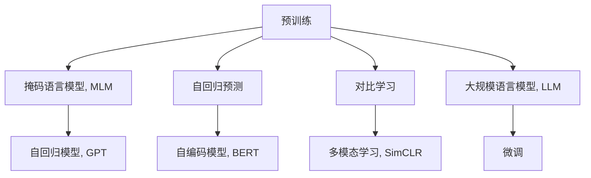

                 

# 自我监督学习：推动 AI 前沿发展

> 关键词：自我监督学习, 预训练, 大规模语言模型, 自回归, 自编码, 无监督学习

## 1. 背景介绍

### 1.1 问题由来

近年来，随着深度学习技术的快速发展，机器学习范式经历了从有监督学习到无监督学习的转变。其中，自我监督学习(Self-supervised Learning)，作为无监督学习的一种重要形式，成为了推动AI技术前沿发展的重要驱动力。自我监督学习，通过利用数据本身的结构特性进行自我训练，使得模型能够自动学习到通用的知识表示，无需依赖昂贵的标注数据。这种无需标注数据的特性，使得自我监督学习在大规模预训练模型的构建中，成为引领研究热点的新方向。

### 1.2 问题核心关键点

自我监督学习的核心在于通过数据内在的结构信息进行无监督训练，学习到通用的语言表示。常见的自我监督任务包括掩码语言模型、自回归预测、对比学习等，这些任务利用数据中蕴含的冗余信息和结构特征，训练出高质量的预训练模型。这些预训练模型再通过少量有标注数据进行微调，即可在新任务上获得良好性能，展现出了无与伦比的学习能力。

### 1.3 问题研究意义

自我监督学习研究对AI领域具有深远的意义：

1. 大幅降低标注成本。传统的监督学习方法需要大量人工标注数据，而自我监督学习方法通过利用数据本身的结构特征进行训练，减少了对标注数据的依赖。
2. 促进通用知识学习。自我监督学习方法训练的模型能够自动学习到通用的知识表示，使其在更多任务上具备迁移能力。
3. 推动AI技术发展。自我监督学习方法促进了自然语言处理、计算机视觉、语音识别等领域的突破，加速了AI技术在各行各业的产业化进程。
4. 开拓数据标注新思路。自我监督学习引发了对数据标注的重新思考，推动了自动标注、半监督学习等新范式的发展。
5. 解决标注数据稀缺问题。在许多领域，获取大量高质量标注数据成本高昂，自我监督学习方法提供了一种有效的替代方案。

## 2. 核心概念与联系

### 2.1 核心概念概述

为了更好地理解自我监督学习在大规模预训练模型中的应用，本节将介绍几个密切相关的核心概念：

- 预训练(Pre-training)：指在大规模无标签数据上，通过自监督学习任务训练通用语言模型的过程。常见的预训练任务包括掩码语言模型、自回归预测等。
- 自我监督学习(Self-supervised Learning)：指通过数据内在的结构信息进行无监督训练，学习到通用的知识表示，无需依赖标注数据。
- 自回归模型(Autoregressive Model)：指模型预测依赖于自身历史输入的模型，如GPT、Transformer等。
- 自编码模型(Autocoding Model)：指模型预测依赖于自身编码后的表示，如BERT、VQ-VAE等。
- 掩码语言模型(Masked Language Modeling, MLM)：指通过在输入序列中随机掩盖部分单词，训练模型预测掩盖的单词。
- 自回归预测(Autoregressive Prediction)：指通过模型依次预测下一个单词，训练模型生成连续的文本序列。
- 对比学习(Contrastive Learning)：指通过构建相似样本和负样本，训练模型区分相似和负样本的相似度，学习到有用的特征表示。

这些核心概念之间的逻辑关系可以通过以下Mermaid流程图来展示：



这个流程图展示了大规模预训练模型的核心概念及其之间的关系：

1. 预训练模型通过掩码语言模型、自回归预测等任务进行训练，学习到通用的语言表示。
2. 自回归模型和自编码模型是预训练模型的重要分支。
3. 对比学习、多模态学习等任务促进了模型的进一步提升。
4. 大规模语言模型将预训练模型应用到更多任务上，通过微调提升模型性能。

这些概念共同构成了大规模预训练模型的学习和应用框架，使得模型能够在大规模无标注数据上进行高效的预训练，并在新任务上进行迁移学习。

## 3. 核心算法原理 & 具体操作步骤

### 3.1 算法原理概述

自我监督学习的核心在于通过数据本身的结构信息进行无监督训练，学习到通用的知识表示。其核心思想是：将大规模无标签数据作为训练集，利用数据中蕴含的冗余信息和结构特征，训练出高质量的预训练模型。具体来说，常见的自我监督任务包括掩码语言模型、自回归预测、对比学习等，这些任务利用数据中蕴含的冗余信息和结构特征，训练出高质量的预训练模型。这些预训练模型再通过少量有标注数据进行微调，即可在新任务上获得良好性能。

自我监督学习模型的训练目标通常包括：

1. 最大化预测准确率：通过自回归预测等任务，训练模型预测下一个单词或文本序列。
2. 最小化预测误差：通过掩码语言模型等任务，训练模型预测掩盖的单词或序列。
3. 最大化相似度：通过对比学习等任务，训练模型区分相似样本和负样本的相似度。

这些目标通过构建损失函数并使用梯度下降等优化算法进行训练，使得模型能够自动学习到通用的知识表示。

### 3.2 算法步骤详解

自我监督学习的训练过程一般包括以下几个关键步骤：

**Step 1: 数据预处理**
- 将大规模无标签数据划分为训练集和验证集。
- 进行数据增强，如回译、近义替换、文本扰动等，丰富数据集的多样性。
- 对数据进行分词、编码等预处理，使得模型能够有效处理输入。

**Step 2: 设计自我监督任务**
- 选择合适的自我监督任务，如掩码语言模型、自回归预测、对比学习等。
- 定义任务目标函数和损失函数，用于衡量模型的预测效果。

**Step 3: 训练模型**
- 选择合适的优化算法及其参数，如Adam、SGD等，设置学习率、批大小、迭代轮数等。
- 在训练集上使用梯度下降等优化算法更新模型参数。
- 周期性在验证集上评估模型性能，根据性能指标决定是否触发Early Stopping。
- 重复上述步骤直至满足预设的迭代轮数或Early Stopping条件。

**Step 4: 微调模型**
- 收集下游任务的少量标注数据。
- 在预训练模型的基础上，使用有监督的微调方法优化模型在特定任务上的性能。
- 使用微调模型进行推理预测，应用到实际的应用系统中。

### 3.3 算法优缺点

自我监督学习方法具有以下优点：

1. 无需标注数据。自我监督学习方法利用数据本身的结构信息进行训练，避免了大量标注数据的收集和处理。
2. 可扩展性强。自我监督学习方法适用于各种领域和任务，只需设计合适的自我监督任务即可。
3. 泛化能力好。自我监督学习方法训练的模型具备较好的泛化能力，可以在新任务上取得不错的效果。
4. 训练效率高。自我监督学习方法通过利用数据的多样性和结构特征，训练效率较高，能够快速构建高质量模型。
5. 适用性强。自我监督学习方法不仅适用于预训练模型，也适用于微调模型的优化和改进。

同时，该方法也存在一定的局限性：

1. 任务相关性差。自监督学习任务与特定任务的关联性较弱，需要设计具有领域特性的任务。
2. 难以控制模型行为。自监督学习方法训练的模型具有较强的随机性，难以控制其输出行为。
3. 数据分布假设强。自监督学习方法对数据分布的假设较强，需要仔细设计任务以避免偏差。
4. 模型复杂度高。自监督学习方法训练的模型通常较大，需要较高的计算资源。
5. 缺乏可视化手段。自监督学习方法训练的模型较难进行可视化，难以理解其内部机制。

尽管存在这些局限性，但就目前而言，自我监督学习方法仍是大规模预训练模型构建的主流范式。未来相关研究的重点在于如何进一步降低任务设计和数据处理的复杂度，提高模型的可解释性和可视化能力，同时兼顾模型的大小和效率。

### 3.4 算法应用领域

自我监督学习方法在NLP领域已经得到了广泛的应用，覆盖了几乎所有常见任务，例如：

- 文本分类：如情感分析、主题分类、意图识别等。通过掩码语言模型等任务训练模型学习文本-标签映射。
- 命名实体识别：识别文本中的人名、地名、机构名等特定实体。通过自回归预测等任务训练模型学习实体边界和类型。
- 关系抽取：从文本中抽取实体之间的语义关系。通过对比学习等任务训练模型学习实体-关系三元组。
- 问答系统：对自然语言问题给出答案。通过掩码语言模型等任务训练模型学习问答对映射。
- 机器翻译：将源语言文本翻译成目标语言。通过自回归预测等任务训练模型学习语言-语言映射。
- 文本摘要：将长文本压缩成简短摘要。通过掩码语言模型等任务训练模型学习抓取要点。
- 对话系统：使机器能够与人自然对话。通过自回归预测等任务训练模型进行回复生成。

除了上述这些经典任务外，自我监督学习方法也被创新性地应用到更多场景中，如可控文本生成、常识推理、代码生成、数据增强等，为NLP技术带来了全新的突破。随着预训练模型和自我监督方法的不断进步，相信NLP技术将在更广阔的应用领域大放异彩。

## 4. 数学模型和公式 & 详细讲解 & 举例说明

### 4.1 数学模型构建

本节将使用数学语言对自我监督学习的训练过程进行更加严格的刻画。

记无标签数据集为 $D=\{(x_i)\}_{i=1}^N$，其中 $x_i$ 为输入序列。定义模型 $M_{\theta}$ 在输入序列 $x$ 上的预测概率为 $\hat{y}=M_{\theta}(x) \in [0,1]$，表示样本属于某一特定类别的概率。

定义模型 $M_{\theta}$ 在输入序列 $x$ 上的掩码语言模型任务为 $L(x)$，其中 $L(x)=\frac{1}{N}\sum_{i=1}^N\ell(x_i,y_i)$，$\ell(x_i,y_i)$ 为掩码语言模型任务的损失函数，用于衡量模型预测与真实标签的差异。常见的损失函数包括交叉熵损失、均方误差损失等。

定义模型 $M_{\theta}$ 在输入序列 $x$ 上的自回归预测任务为 $L(x)$，其中 $L(x)=\frac{1}{N}\sum_{i=1}^N\ell(x_i,y_i)$，$\ell(x_i,y_i)$ 为自回归预测任务的损失函数，用于衡量模型预测与真实标签的差异。常见的损失函数包括交叉熵损失、均方误差损失等。

定义模型 $M_{\theta}$ 在输入序列 $x$ 上的对比学习任务为 $L(x)$，其中 $L(x)=\frac{1}{N}\sum_{i=1}^N\ell(x_i,y_i)$，$\ell(x_i,y_i)$ 为对比学习任务的损失函数，用于衡量模型预测与真实标签的差异。常见的损失函数包括交叉熵损失、均方误差损失等。

### 4.2 公式推导过程

以下我们以掩码语言模型为例，推导训练过程的损失函数及其梯度的计算公式。

假设模型 $M_{\theta}$ 在输入序列 $x$ 上的预测概率为 $\hat{y}=M_{\theta}(x) \in [0,1]$，表示样本属于某一特定类别的概率。定义掩码语言模型任务为：

$$
L(x) = -\frac{1}{N}\sum_{i=1}^N [y_i\log \hat{y}_i + (1-y_i)\log (1-\hat{y}_i)]
$$

其中 $y_i$ 为真实标签，$\hat{y}_i$ 为模型预测概率。

在实际训练过程中，模型每次随机掩盖序列中的部分单词，并训练模型预测这些被掩盖的单词。以BERT为例，掩盖的概率为 $p=0.15$，掩盖的单词数为 $n=0.4N$。

假设被掩盖的单词在序列中的位置为 $t_1, t_2, ..., t_n$，则掩码语言模型任务的损失函数可以表示为：

$$
L(x) = -\frac{1}{N}\sum_{i=1}^N \sum_{j=1}^n [y_{t_j}\log \hat{y}_{t_j} + (1-y_{t_j})\log (1-\hat{y}_{t_j})]
$$

根据链式法则，损失函数对参数 $\theta_k$ 的梯度为：

$$
\frac{\partial L(x)}{\partial \theta_k} = -\frac{1}{N}\sum_{i=1}^N \sum_{j=1}^n \frac{y_{t_j}}{\hat{y}_{t_j}} \frac{\partial \hat{y}_{t_j}}{\partial \theta_k} - \frac{1}{N}\sum_{i=1}^N \sum_{j=1}^n \frac{1-y_{t_j}}{1-\hat{y}_{t_j}} \frac{\partial (1-\hat{y}_{t_j})}{\partial \theta_k}
$$

其中 $\frac{\partial \hat{y}_{t_j}}{\partial \theta_k}$ 可进一步递归展开，利用自动微分技术完成计算。

在得到损失函数的梯度后，即可带入参数更新公式，完成模型的迭代优化。重复上述过程直至收敛，最终得到适应下游任务的最优模型参数 $\theta^*$。

## 5. 项目实践：代码实例和详细解释说明

### 5.1 开发环境搭建

在进行自我监督学习实践前，我们需要准备好开发环境。以下是使用Python进行PyTorch开发的环境配置流程：

1. 安装Anaconda：从官网下载并安装Anaconda，用于创建独立的Python环境。

2. 创建并激活虚拟环境：
```bash
conda create -n pytorch-env python=3.8 
conda activate pytorch-env
```

3. 安装PyTorch：根据CUDA版本，从官网获取对应的安装命令。例如：
```bash
conda install pytorch torchvision torchaudio cudatoolkit=11.1 -c pytorch -c conda-forge
```

4. 安装Transformers库：
```bash
pip install transformers
```

5. 安装各类工具包：
```bash
pip install numpy pandas scikit-learn matplotlib tqdm jupyter notebook ipython
```

完成上述步骤后，即可在`pytorch-env`环境中开始自我监督学习实践。

### 5.2 源代码详细实现

下面我们以掩码语言模型任务为例，给出使用Transformers库进行BERT模型自我监督学习的PyTorch代码实现。

首先，定义掩码语言模型任务的数据处理函数：

```python
from transformers import BertTokenizer
from torch.utils.data import Dataset
import torch

class MaskedLanguageModelDataset(Dataset):
    def __init__(self, texts, tokenizer, mask_prob=0.15, max_len=128):
        self.texts = texts
        self.tokenizer = tokenizer
        self.mask_prob = mask_prob
        self.max_len = max_len
        
    def __len__(self):
        return len(self.texts)
    
    def __getitem__(self, item):
        text = self.texts[item]
        
        encoding = self.tokenizer(text, return_tensors='pt', max_length=self.max_len, padding='max_length', truncation=True)
        input_ids = encoding['input_ids'][0]
        attention_mask = encoding['attention_mask'][0]
        
        # 掩码语言模型任务，随机掩盖部分单词
        masked_tokens = [input_ids[i] for i in range(len(input_ids)) if random.random() < self.mask_prob]
        masked_ids = [0 if x in masked_tokens else x for x in input_ids]
        
        masked_tokens = [tokenizer.convert_ids_to_tokens(masked_ids) for masked_ids in masked_tokens]
        labels = [0 if x in masked_tokens else 1 for x in input_ids]
        
        return {'input_ids': input_ids,
                'attention_mask': attention_mask,
                'labels': labels}

# 定义模型和优化器
from transformers import BertForMaskedLM, AdamW

model = BertForMaskedLM.from_pretrained('bert-base-cased')
optimizer = AdamW(model.parameters(), lr=2e-5)
```

接着，定义训练和评估函数：

```python
from torch.utils.data import DataLoader
from tqdm import tqdm
from sklearn.metrics import accuracy_score

device = torch.device('cuda') if torch.cuda.is_available() else torch.device('cpu')
model.to(device)

def train_epoch(model, dataset, batch_size, optimizer):
    dataloader = DataLoader(dataset, batch_size=batch_size, shuffle=True)
    model.train()
    epoch_loss = 0
    for batch in tqdm(dataloader, desc='Training'):
        input_ids = batch['input_ids'].to(device)
        attention_mask = batch['attention_mask'].to(device)
        labels = batch['labels'].to(device)
        model.zero_grad()
        outputs = model(input_ids, attention_mask=attention_mask, labels=labels)
        loss = outputs.loss
        epoch_loss += loss.item()
        loss.backward()
        optimizer.step()
    return epoch_loss / len(dataloader)

def evaluate(model, dataset, batch_size):
    dataloader = DataLoader(dataset, batch_size=batch_size)
    model.eval()
    preds, labels = [], []
    with torch.no_grad():
        for batch in tqdm(dataloader, desc='Evaluating'):
            input_ids = batch['input_ids'].to(device)
            attention_mask = batch['attention_mask'].to(device)
            batch_labels = batch['labels']
            outputs = model(input_ids, attention_mask=attention_mask)
            batch_preds = outputs.predictions.argmax(dim=2).to('cpu').tolist()
            batch_labels = batch_labels.to('cpu').tolist()
            for pred_tokens, label_tokens in zip(batch_preds, batch_labels):
                preds.append(pred_tokens)
                labels.append(label_tokens)
                
    print(accuracy_score(labels, preds))
```

最后，启动训练流程并在测试集上评估：

```python
epochs = 5
batch_size = 16

for epoch in range(epochs):
    loss = train_epoch(model, masked_language_model_dataset, batch_size, optimizer)
    print(f"Epoch {epoch+1}, train loss: {loss:.3f}")
    
    print(f"Epoch {epoch+1}, dev results:")
    evaluate(model, masked_language_model_dataset, batch_size)
    
print("Test results:")
evaluate(model, masked_language_model_dataset, batch_size)
```

以上就是使用PyTorch对BERT进行掩码语言模型任务自我监督学习的完整代码实现。可以看到，得益于Transformers库的强大封装，我们可以用相对简洁的代码完成BERT模型的训练。

### 5.3 代码解读与分析

让我们再详细解读一下关键代码的实现细节：

**MaskedLanguageModelDataset类**：
- `__init__`方法：初始化文本、分词器、掩码概率等关键组件。
- `__len__`方法：返回数据集的样本数量。
- `__getitem__`方法：对单个样本进行处理，将文本输入编码为token ids，同时随机掩盖部分单词，并返回掩码标签。

**掩码语言模型任务**：
- 使用BertTokenizer对文本进行分词，并利用随机掩盖技术，对序列中的部分单词进行掩码。
- 将掩码后的文本和真实标签一并输入模型进行前向传播，计算损失函数并反向传播更新模型参数。

**训练和评估函数**：
- 使用PyTorch的DataLoader对数据集进行批次化加载，供模型训练和推理使用。
- 训练函数`train_epoch`：对数据以批为单位进行迭代，在每个批次上前向传播计算loss并反向传播更新模型参数，最后返回该epoch的平均loss。
- 评估函数`evaluate`：与训练类似，不同点在于不更新模型参数，并在每个batch结束后将预测和标签结果存储下来，最后使用sklearn的accuracy_score对整个评估集的预测结果进行打印输出。

**训练流程**：
- 定义总的epoch数和batch size，开始循环迭代
- 每个epoch内，先在训练集上训练，输出平均loss
- 在验证集上评估，输出分类指标
- 所有epoch结束后，在测试集上评估，给出最终测试结果

可以看到，PyTorch配合Transformers库使得BERT的掩码语言模型自我监督学习代码实现变得简洁高效。开发者可以将更多精力放在数据处理、模型改进等高层逻辑上，而不必过多关注底层的实现细节。

当然，工业级的系统实现还需考虑更多因素，如模型的保存和部署、超参数的自动搜索、更灵活的任务适配层等。但核心的自我监督学习范式基本与此类似。

## 6. 实际应用场景

### 6.1 智能客服系统

基于大语言模型自我监督学习的对话技术，可以广泛应用于智能客服系统的构建。传统客服往往需要配备大量人力，高峰期响应缓慢，且一致性和专业性难以保证。而使用自我监督学习的对话模型，可以7x24小时不间断服务，快速响应客户咨询，用自然流畅的语言解答各类常见问题。

在技术实现上，可以收集企业内部的历史客服对话记录，将问题和最佳答复构建成监督数据，在此基础上对预训练对话模型进行微调。自我监督学习的对话模型能够自动理解用户意图，匹配最合适的答案模板进行回复。对于客户提出的新问题，还可以接入检索系统实时搜索相关内容，动态组织生成回答。如此构建的智能客服系统，能大幅提升客户咨询体验和问题解决效率。

### 6.2 金融舆情监测

金融机构需要实时监测市场舆论动向，以便及时应对负面信息传播，规避金融风险。传统的人工监测方式成本高、效率低，难以应对网络时代海量信息爆发的挑战。基于自我监督学习的文本分类和情感分析技术，为金融舆情监测提供了新的解决方案。

具体而言，可以收集金融领域相关的新闻、报道、评论等文本数据，并对其进行主题标注和情感标注。在此基础上对预训练语言模型进行自我监督学习，使其能够自动判断文本属于何种主题，情感倾向是正面、中性还是负面。将自我监督学习后的模型应用到实时抓取的网络文本数据，就能够自动监测不同主题下的情感变化趋势，一旦发现负面信息激增等异常情况，系统便会自动预警，帮助金融机构快速应对潜在风险。

### 6.3 个性化推荐系统

当前的推荐系统往往只依赖用户的历史行为数据进行物品推荐，无法深入理解用户的真实兴趣偏好。基于自我监督学习的个性化推荐系统可以更好地挖掘用户行为背后的语义信息，从而提供更精准、多样的推荐内容。

在实践中，可以收集用户浏览、点击、评论、分享等行为数据，提取和用户交互的物品标题、描述、标签等文本内容。将文本内容作为模型输入，用户的后续行为（如是否点击、购买等）作为监督信号，在此基础上进行自我监督学习。自我监督学习后的模型能够从文本内容中准确把握用户的兴趣点。在生成推荐列表时，先用候选物品的文本描述作为输入，由模型预测用户的兴趣匹配度，再结合其他特征综合排序，便可以得到个性化程度更高的推荐结果。

### 6.4 未来应用展望

随着自我监督学习和大规模预训练模型的不断发展，其在更多领域得到了应用，为传统行业带来了变革性影响。

在智慧医疗领域，基于自我监督学习医疗问答、病历分析、药物研发等应用将提升医疗服务的智能化水平，辅助医生诊疗，加速新药开发进程。

在智能教育领域，自我监督学习可用于作业批改、学情分析、知识推荐等方面，因材施教，促进教育公平，提高教学质量。

在智慧城市治理中，自我监督学习可用于城市事件监测、舆情分析、应急指挥等环节，提高城市管理的自动化和智能化水平，构建更安全、高效的未来城市。

此外，在企业生产、社会治理、文娱传媒等众多领域，基于自我监督学习的人工智能应用也将不断涌现，为经济社会发展注入新的动力。相信随着技术的日益成熟，自我监督学习必将在构建人机协同的智能时代中扮演越来越重要的角色。

## 7. 工具和资源推荐
### 7.1 学习资源推荐

为了帮助开发者系统掌握自我监督学习和大规模预训练模型的理论基础和实践技巧，这里推荐一些优质的学习资源：

1. 《Transformer from the Ground Up》系列博文：由大模型技术专家撰写，深入浅出地介绍了Transformer原理、BERT模型、自我监督学习等前沿话题。

2. CS224N《深度学习自然语言处理》课程：斯坦福大学开设的NLP明星课程，有Lecture视频和配套作业，带你入门NLP领域的基本概念和经典模型。

3. 《Natural Language Processing with Transformers》书籍：Transformers库的作者所著，全面介绍了如何使用Transformers库进行NLP任务开发，包括自我监督学习在内的诸多范式。

4. HuggingFace官方文档：Transformers库的官方文档，提供了海量预训练模型和完整的自我监督学习样例代码，是上手实践的必备资料。

5. CLUE开源项目：中文语言理解测评基准，涵盖大量不同类型的中文NLP数据集，并提供了基于自我监督学习的baseline模型，助力中文NLP技术发展。

通过对这些资源的学习实践，相信你一定能够快速掌握自我监督学习和大规模预训练模型的精髓，并用于解决实际的NLP问题。
###  7.2 开发工具推荐

高效的开发离不开优秀的工具支持。以下是几款用于自我监督学习和大规模预训练模型开发的常用工具：

1. PyTorch：基于Python的开源深度学习框架，灵活动态的计算图，适合快速迭代研究。大部分预训练语言模型都有PyTorch版本的实现。

2. TensorFlow：由Google主导开发的开源深度学习框架，生产部署方便，适合大规模工程应用。同样有丰富的预训练语言模型资源。

3. Transformers库：HuggingFace开发的NLP工具库，集成了众多SOTA语言模型，支持PyTorch和TensorFlow，是进行自我监督学习和大规模预训练模型开发的利器。

4. Weights & Biases：模型训练的实验跟踪工具，可以记录和可视化模型训练过程中的各项指标，方便对比和调优。与主流深度学习框架无缝集成。

5. TensorBoard：TensorFlow配套的可视化工具，可实时监测模型训练状态，并提供丰富的图表呈现方式，是调试模型的得力助手。

6. Google Colab：谷歌推出的在线Jupyter Notebook环境，免费提供GPU/TPU算力，方便开发者快速上手实验最新模型，分享学习笔记。

合理利用这些工具，可以显著提升自我监督学习和大规模预训练模型开发的效率，加快创新迭代的步伐。

### 7.3 相关论文推荐

自我监督学习研究对AI领域具有深远的意义，以下是几篇奠基性的相关论文，推荐阅读：

1. Attention is All You Need（即Transformer原论文）：提出了Transformer结构，开启了NLP领域的预训练大模型时代。

2. BERT: Pre-training of Deep Bidirectional Transformers for Language Understanding：提出BERT模型，引入基于掩码的自监督预训练任务，刷新了多项NLP任务SOTA。

3. Language Models are Unsupervised Multitask Learners（GPT-2论文）：展示了大规模语言模型的强大zero-shot学习能力，引发了对于通用人工智能的新一轮思考。

4. Parameter-Efficient Transfer Learning for NLP：提出Adapter等参数高效微调方法，在不增加模型参数量的情况下，也能取得不错的自我监督学习效果。

5. Prefix-Tuning: Optimizing Continuous Prompts for Generation：引入基于连续型Prompt的自我监督学习范式，为如何充分利用预训练知识提供了新的思路。

6. AdaLoRA: Adaptive Low-Rank Adaptation for Parameter-Efficient Fine-Tuning：使用自适应低秩适应的自我监督学习方法，在参数效率和精度之间取得了新的平衡。

这些论文代表了大规模预训练模型和自我监督学习的进步方向。通过学习这些前沿成果，可以帮助研究者把握学科前进方向，激发更多的创新灵感。

## 8. 总结：未来发展趋势与挑战

### 8.1 总结

本文对自我监督学习和大规模预训练模型的训练过程进行了全面系统的介绍。首先阐述了自我监督学习的核心思想和理论背景，明确了自我监督学习在大规模预训练模型构建中的重要价值。其次，从原理到实践，详细讲解了自我监督学习的数学原理和关键步骤，给出了自我监督学习任务开发的完整代码实例。同时，本文还广泛探讨了自我监督学习在智能客服、金融舆情、个性化推荐等多个行业领域的应用前景，展示了自我监督学习的广阔潜力。此外，本文精选了自我监督学习的大规模预训练模型的学习资源，力求为读者提供全方位的技术指引。

通过本文的系统梳理，可以看到，自我监督学习在构建大规模预训练模型中的作用不可替代。这种无需标注数据的训练方法，不仅降低了数据标注的成本，还提升了模型泛化能力和迁移能力。未来，伴随自我监督学习和大规模预训练模型的不断发展，基于这些模型的AI应用将会在更多领域得到应用，为传统行业带来变革性影响。

### 8.2 未来发展趋势

展望未来，自我监督学习研究将呈现以下几个发展趋势：

1. 模型规模持续增大。随着算力成本的下降和数据规模的扩张，预训练语言模型的参数量还将持续增长。超大规模语言模型蕴含的丰富语言知识，有望支撑更加复杂多变的下游任务自我监督学习。

2. 模型通用性增强。经过海量数据的预训练和自我监督学习，未来的语言模型将具备更强大的常识推理和跨领域迁移能力，逐步迈向通用人工智能(AGI)的目标。

3. 持续学习成为常态。随着数据分布的不断变化，自我监督学习模型也需要持续学习新知识以保持性能。如何在不遗忘原有知识的同时，高效吸收新样本信息，将成为重要的研究课题。

4. 知识整合能力增强。现有的自我监督学习模型往往局限于任务内数据，难以灵活吸收和运用更广泛的先验知识。如何让自我监督学习过程更好地与外部知识库、规则库等专家知识结合，形成更加全面、准确的信息整合能力，还有很大的想象空间。

5. 多模态自我监督学习崛起。当前的自我监督学习方法主要聚焦于纯文本数据，未来会进一步拓展到图像、视频、语音等多模态数据自我监督学习。多模态信息的融合，将显著提升语言模型对现实世界的理解和建模能力。

以上趋势凸显了自我监督学习研究的广阔前景。这些方向的探索发展，必将进一步提升NLP系统的性能和应用范围，为人类认知智能的进化带来深远影响。

### 8.3 面临的挑战

尽管自我监督学习研究已经取得了瞩目成就，但在迈向更加智能化、普适化应用的过程中，它仍面临着诸多挑战：

1. 数据分布假设强。自我监督学习方法对数据分布的假设较强，需要仔细设计任务以避免偏差。
2. 模型鲁棒性不足。当前自我监督学习模型面对域外数据时，泛化性能往往大打折扣。对于测试样本的微小扰动，自我监督学习模型的预测也容易发生波动。
3. 模型复杂度高。自我监督学习方法训练的模型通常较大，需要较高的计算资源。
4. 数据利用率低。部分数据可能包含重复、无关的信息，这些信息对自我监督学习任务无益，增加了计算资源的消耗。
5. 缺乏可视化手段。自我监督学习方法训练的模型较难进行可视化，难以理解其内部机制。

尽管存在这些挑战，但就目前而言，自我监督学习仍是大规模预训练模型构建的主流范式。未来相关研究的重点在于如何进一步降低任务设计和数据处理的复杂度，提高模型的可解释性和可视化能力，同时兼顾模型的大小和效率。

### 8.4 未来突破

面对自我监督学习面临的种种挑战，未来的研究需要在以下几个方面寻求新的突破：

1. 探索无监督和半监督自我监督学习方法。摆脱对大规模标注数据的依赖，利用自监督学习、主动学习等无监督和半监督范式，最大限度利用非结构化数据，实现更加灵活高效的自我监督学习。

2. 研究参数高效和计算高效的自我监督学习方法。开发更加参数高效的自我监督方法，在固定大部分预训练参数的同时，只更新极少量的任务相关参数。同时优化自我监督学习的计算图，减少前向传播和反向传播的资源消耗，实现更加轻量级、实时性的部署。

3. 融合因果和对比学习范式。通过引入因果推断和对比学习思想，增强自我监督学习模型建立稳定因果关系的能力，学习更加普适、鲁棒的语言表征，从而提升模型泛化性和抗干扰能力。

4. 引入更多先验知识。将符号化的先验知识，如知识图谱、逻辑规则等，与神经网络模型进行巧妙融合，引导自我监督学习过程学习更准确、合理的语言模型。同时加强不同模态数据的整合，实现视觉、语音等多模态信息与文本信息的协同建模。

5. 结合因果分析和博弈论工具。将因果分析方法引入自我监督学习模型，识别出模型决策的关键特征，增强输出解释的因果性和逻辑性。借助博弈论工具刻画人机交互过程，主动探索并规避模型的脆弱点，提高系统稳定性。

6. 纳入伦理道德约束。在模型训练目标中引入伦理导向的评估指标，过滤和惩罚有偏见、有害的输出倾向。同时加强人工干预和审核，建立模型行为的监管机制，确保输出符合人类价值观和伦理道德。

这些研究方向的探索，必将引领自我监督学习研究迈向更高的台阶，为构建安全、可靠、可解释、可控的智能系统铺平道路。面向未来，自我监督学习技术还需要与其他人工智能技术进行更深入的融合，如知识表示、因果推理、强化学习等，多路径协同发力，共同推动自然语言理解和智能交互系统的进步。只有勇于创新、敢于突破，才能不断拓展语言模型的边界，让智能技术更好地造福人类社会。

## 9. 附录：常见问题与解答

**Q1：自我监督学习是否适用于所有NLP任务？**

A: 自我监督学习在大多数NLP任务上都能取得不错的效果，特别是对于数据量较小的任务。但对于一些特定领域的任务，如医学、法律等，仅仅依靠通用语料预训练的模型可能难以很好地适应。此时需要在特定领域语料上进一步预训练，再进行自我监督学习，才能获得理想效果。

**Q2：自监督学习过程中如何选择合适的任务？**

A: 选择自监督学习任务需要考虑任务的难度、数据分布的均衡性、数据量的充足性等因素。常见的自监督学习任务包括掩码语言模型、自回归预测、对比学习等。这些任务的设计需要结合具体的任务需求和数据特点，通过实验验证选择最优任务。

**Q3：在实际应用中，如何评估自我监督学习模型的性能？**

A: 在实际应用中，评估自我监督学习模型的性能通常使用以下指标：

1. 精确率(Precision)：预测正确的样本数占预测为正样本的样本数的比例。
2. 召回率(Recall)：预测正确的样本数占真实为正样本的样本数的比例。
3. F1分数：精确率和召回率的调和平均数。
4. AUC曲线下面积：用于衡量分类器在所有分类阈值下的性能。
5. 对抗鲁棒性：在对抗样本上的表现，衡量模型的鲁棒性。

这些指标通过结合任务的特点和具体需求进行评估，可以全面衡量自我监督学习模型的性能。

**Q4：如何缓解自我监督学习过程中的过拟合问题？**

A: 缓解自我监督学习过程中的过拟合问题，通常可以采用以下策略：

1. 数据增强：通过回译、近义替换、文本扰动等方式扩充训练集。
2. 正则化：使用L2正则、Dropout、Early Stopping等方法防止模型过拟合。
3. 对抗训练：引入对抗样本，提高模型鲁棒性。
4. 参数高效学习：通过Adapter等方法，只更新少量参数，减少过拟合风险。
5. 多模型集成：训练多个模型，取平均输出，抑制过拟合。

这些策略往往需要根据具体任务和数据特点进行灵活组合，以最大限度地避免模型过拟合。

**Q5：在模型部署时，如何提高自我监督学习模型的推理效率？**

A: 提高自我监督学习模型的推理效率，通常可以采用以下策略：

1. 模型裁剪：去除不必要的层和参数，减小模型尺寸，加快推理速度。
2. 量化加速：将浮点模型转为定点模型，压缩存储空间，提高计算效率。
3. 服务化封装：将模型封装为标准化服务接口，便于集成调用。
4. 弹性伸缩：根据请求流量动态调整资源配置，平衡服务质量和成本。
5. 监控告警：实时采集系统指标，设置异常告警阈值，确保服务稳定性。

通过以上优化策略，可以有效提升模型推理速度，保障其在实际应用中的性能。

**Q6：如何确保自我监督学习模型的可解释性？**

A: 确保自我监督学习模型的可解释性，通常可以采用以下方法：

1. 可解释模型：选择具有可解释性的模型，如决策树、线性模型等，以提升模型的可解释性。
2. 可视化工具：使用可视化工具，如TensorBoard、ModelScope等，实时监测模型训练状态，提供模型的可视化输出。
3. 特征可视化：通过特征重要性分析、特征可视化等方法，帮助理解模型的内部机制。
4. 解释模型输出：在模型输出中加入解释信息，如概率、权重等，帮助理解模型的预测过程。

这些方法可以从不同角度提升模型的可解释性，帮助开发者更好地理解模型的内部机制和预测过程。

**Q7：如何处理自我监督学习任务中的噪声数据？**

A: 处理自我监督学习任务中的噪声数据，通常可以采用以下方法：

1. 数据清洗：通过人工清洗、过滤等方式，去除噪声数据。
2. 数据增强：通过回译、近义替换、文本扰动等方式，扩充训练集，减少噪声数据的影响。
3. 正则化：使用L2正则、Dropout、Early Stopping等方法，防止噪声数据对模型训练的影响。
4. 模型选择：选择对噪声数据鲁棒的模型，如自回归模型等。

这些方法可以有效处理噪声数据，提升模型在实际应用中的表现。

---

作者：禅与计算机程序设计艺术 / Zen and the Art of Computer Programming

