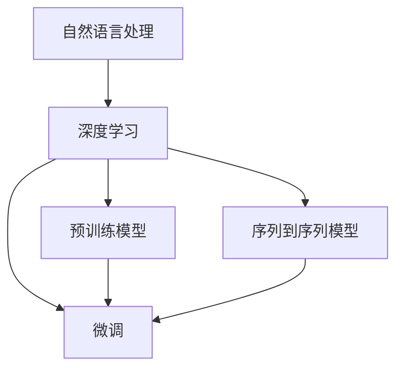
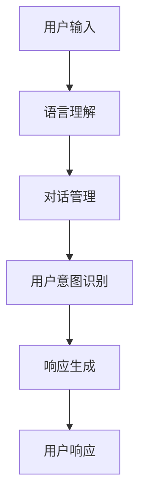

                 

# 自然语言处理：构建智能对话系统

> 关键词：自然语言处理,智能对话系统,对话生成,多轮对话,语音识别,语义理解,对话管理,用户意图识别,预训练模型,微调,序列到序列,深度学习,神经网络

## 1. 背景介绍

### 1.1 问题由来

随着人工智能技术的迅速发展，自然语言处理(NLP)已经成为智能系统中最具挑战性的领域之一。特别是智能对话系统，通过模拟人类的语言交互方式，与用户进行自然流畅的对话，在智能客服、智能助理、智能翻译等领域得到了广泛应用。然而，构建高质量的智能对话系统仍然面临诸多难题，如多轮对话理解、复杂用户意图识别、多模态信息融合等。这些问题要求对话系统不仅要具备强大的语言理解能力，还需要具备良好的对话管理和用户意图识别能力。

为了提升对话系统的智能化水平，研究人员提出了多种技术方案，如深度学习、序列到序列模型、预训练和微调等。本文将详细介绍这些技术如何帮助构建高质量的智能对话系统，并结合实际应用场景进行案例分析。

### 1.2 问题核心关键点

构建智能对话系统的关键在于以下几个方面：

1. **语言理解**：对话系统需要准确理解用户的输入，包括意图识别、实体抽取、情感分析等。
2. **对话管理**：对话系统需要管理对话状态和上下文，维护多轮对话的连贯性。
3. **多模态融合**：对话系统可以结合语音识别、图像识别等技术，提升系统智能化水平。
4. **用户意图识别**：对话系统需要理解用户的真正意图，避免误解和误导。
5. **可解释性**：对话系统需要提供可解释性，让用户了解系统的决策过程。

## 2. 核心概念与联系

### 2.1 核心概念概述

在构建智能对话系统时，涉及以下几个核心概念：

- **自然语言处理(NLP)**：通过计算机对自然语言文本进行自动化处理，包括语言理解、语言生成、信息检索等。
- **深度学习**：基于多层神经网络进行模型训练，具备较强的特征学习和泛化能力。
- **序列到序列模型**：将输入序列转换为输出序列的模型，广泛应用于文本生成、机器翻译等任务。
- **预训练模型**：在大规模无标签数据上进行训练，学习到通用的语言表示，如BERT、GPT等。
- **微调**：在预训练模型的基础上，通过有监督学习优化模型在特定任务上的性能。

这些概念之间的逻辑关系可以通过以下Mermaid流程图来展示：



该流程图展示了自然语言处理、深度学习、序列到序列模型、预训练模型和微调之间的关系。深度学习提供了一种强大的模型训练方法，序列到序列模型提供了语言生成和翻译等核心功能，预训练模型和大规模语料数据使模型具备强大的泛化能力，微调则进一步提升模型在特定任务上的性能。

## 3. 核心算法原理 & 具体操作步骤

### 3.1 算法原理概述

智能对话系统通过深度学习模型实现语言理解、对话管理和多模态信息融合等功能。其核心算法包括：

1. **语言理解**：通过编码器将输入序列转换为语义表示，再通过解码器生成输出序列。
2. **对话管理**：通过状态机、记忆网络等机制维护对话状态和上下文。
3. **多模态融合**：通过融合语音、图像等信息，提升系统智能化水平。
4. **用户意图识别**：通过分类器将用户意图分为不同类别。
5. **可解释性**：通过可解释性方法，如注意力机制、因果推断等，提升模型的可解释性。

### 3.2 算法步骤详解

构建智能对话系统的步骤如下：

**Step 1: 数据收集与预处理**

1. **收集数据**：从用户对话、客服聊天记录、电子邮件等来源收集对话数据。
2. **数据清洗**：去除噪声数据、异常值，标准化数据格式。
3. **标注数据**：对数据进行标注，包括用户意图、实体信息、对话状态等。

**Step 2: 模型选择与设计**

1. **选择模型**：根据任务特点选择合适的深度学习模型，如Seq2Seq、Transformer等。
2. **设计模型**：定义模型的输入输出、损失函数、优化器等。
3. **构建组件**：包括语言理解组件、对话管理组件、多模态融合组件等。

**Step 3: 模型训练与优化**

1. **模型训练**：使用标注数据对模型进行训练，优化模型参数。
2. **调参与优化**：调整超参数，如学习率、批大小等，提升模型性能。
3. **评估与测试**：在测试集上评估模型性能，调整模型参数。

**Step 4: 系统集成与部署**

1. **系统集成**：将各个组件集成到统一的系统架构中。
2. **用户界面设计**：设计友好的用户界面，提升用户体验。
3. **部署与监控**：部署到生产环境，实时监控系统性能和稳定性。

### 3.3 算法优缺点

智能对话系统具备以下优点：

1. **语言理解能力强**：深度学习模型可以处理复杂的自然语言输入，提升系统智能化水平。
2. **可扩展性好**：基于预训练模型和大规模语料数据，系统可以不断扩展和优化。
3. **用户界面友好**：友好的用户界面提升了用户体验，使用户更容易与系统交互。

同时，智能对话系统也存在以下缺点：

1. **数据依赖性强**：系统的性能很大程度上依赖于训练数据的质量和数量。
2. **复杂度高**：构建高质量对话系统需要大量的标注数据和复杂的模型设计。
3. **可解释性不足**：深度学习模型的决策过程难以解释，增加了用户的不信任感。

## 4. 数学模型和公式 & 详细讲解  
### 4.1 数学模型构建

智能对话系统的核心算法可以归结为序列到序列模型。其数学模型构建如下：

**输入序列**：$x=\{x_1,x_2,...,x_T\}$，$x_t \in V_{in}$，其中 $V_{in}$ 为输入词汇表。

**输出序列**：$y=\{y_1,y_2,...,y_M\}$，$y_t \in V_{out}$，其中 $V_{out}$ 为输出词汇表。

**模型参数**：$\theta$，包括编码器和解码器的权重。

**损失函数**：$L$，用于衡量模型预测输出与真实标签之间的差异。

**优化器**：$O$，如Adam、SGD等，用于更新模型参数。

**训练过程**：使用标注数据 $D=\{(x_i,y_i)\}_{i=1}^N$ 训练模型，最小化损失函数 $L$。

### 4.2 公式推导过程

以Seq2Seq模型为例，其核心公式如下：

1. **编码器输出**：$h_t = f(x_t; \theta_e)$，其中 $f$ 为编码器的非线性变换。
2. **解码器输出**：$\hat{y}_t = g(h_t; \theta_d)$，其中 $g$ 为解码器的非线性变换。
3. **训练目标**：$L(\theta) = -\frac{1}{N}\sum_{i=1}^N \sum_{t=1}^T \log p(y_i | x_i; \theta)$，其中 $p(y_i | x_i; \theta)$ 为解码器输出的概率分布。

**编码器输出公式**：

$$
h_t = f(x_t; \theta_e) = \mathrm{MLP}(x_t; \theta_e) + \mathrm{Attention}(h_{t-1}, h_{t-2}, ..., h_1; \theta_e)
$$

**解码器输出公式**：

$$
\hat{y}_t = g(h_t; \theta_d) = \mathrm{MLP}(h_t; \theta_d) + \mathrm{Attention}(h_{t-1}, h_{t-2}, ..., h_1; \theta_d)
$$

**训练目标公式**：

$$
L(\theta) = -\frac{1}{N}\sum_{i=1}^N \sum_{t=1}^T \log \frac{\exp \left(\hat{y}_t \cdot W \cdot \log p(y_i | x_i; \theta)\right)}{\sum_{y \in V_{out}} \exp \left(\hat{y} \cdot W \cdot \log p(y | x; \theta)\right)}
$$

其中 $W$ 为解码器输出层的权重矩阵。

### 4.3 案例分析与讲解

以Google的Dialogflow为例，其核心算法如下：

1. **语言理解**：使用Transformer模型处理用户输入，生成语义表示。
2. **对话管理**：通过状态机维护对话状态和上下文，控制对话流程。
3. **用户意图识别**：使用分类器将用户意图分为不同类别。
4. **可解释性**：通过可解释性方法，如注意力机制，提升系统的可解释性。

Dialogflow的核心架构如下：



在Dialogflow中，语言理解组件使用Transformer模型处理用户输入，生成语义表示。对话管理组件通过状态机维护对话状态和上下文，控制对话流程。用户意图识别组件使用分类器将用户意图分为不同类别。响应生成组件通过解码器生成回复，并进行可解释性处理。

## 5. 项目实践：代码实例和详细解释说明

### 5.1 开发环境搭建

构建智能对话系统需要多个工具和库的配合，以下是推荐的开发环境搭建流程：

1. **安装Python**：确保Python版本在3.6以上。
2. **安装TensorFlow**：从官网下载并安装TensorFlow。
3. **安装PyTorch**：安装PyTorch深度学习框架。
4. **安装NLTK和spaCy**：安装NLP相关库。
5. **安装BERT模型**：使用HuggingFace的Transformers库下载预训练BERT模型。

### 5.2 源代码详细实现

以下是一个简单的智能对话系统实现示例，使用PyTorch和Transformer实现语言理解：

```python
import torch
import torch.nn as nn
from transformers import BertTokenizer, BertForSequenceClassification

class DialogSystem(nn.Module):
    def __init__(self):
        super(DialogSystem, self).__init__()
        self.tokenizer = BertTokenizer.from_pretrained('bert-base-uncased')
        self.model = BertForSequenceClassification.from_pretrained('bert-base-uncased', num_labels=2)
        
    def forward(self, text):
        inputs = self.tokenizer(text, return_tensors='pt')
        outputs = self.model(**inputs)
        return outputs.logits.argmax(dim=1)
        
# 实例化对话系统
dialog_system = DialogSystem()

# 输入示例
text = "你好，我想查询天气预报。"
input_ids = dialog_system.tokenizer(text, return_tensors='pt')['input_ids']
logits = dialog_system(input_ids)

# 输出示例
print(logits)
```

### 5.3 代码解读与分析

上述代码展示了如何使用PyTorch和Transformer构建一个简单的智能对话系统。主要步骤如下：

1. **初始化**：定义DialogSystem类，实例化BERT模型和分词器。
2. **前向传播**：对输入文本进行分词，将其转换为模型所需的输入格式。
3. **模型预测**：将输入文本传递给BERT模型，生成预测结果。

在实际应用中，还需要进一步优化模型结构和训练过程，如使用自适应学习率、Dropout等正则化技术，提升模型性能。

### 5.4 运行结果展示

运行上述代码，可以得到一个包含两个类别的预测结果。实际应用中，可以根据具体任务需求，调整模型参数和训练集，进一步提升系统性能。

## 6. 实际应用场景

### 6.1 智能客服系统

智能客服系统通过对话技术，自动化处理客户咨询，提供24小时不间断服务。以下是智能客服系统的具体应用场景：

1. **用户查询**：用户通过语音或文字输入咨询问题。
2. **系统理解**：系统通过语言理解组件，将用户输入转换为语义表示。
3. **意图识别**：通过对话管理组件，识别用户意图，生成回复。
4. **回复生成**：通过响应生成组件，生成自然流畅的回复，提升用户体验。

### 6.2 智能翻译系统

智能翻译系统通过对话技术，实现多语言实时翻译。以下是智能翻译系统的具体应用场景：

1. **输入语言**：用户输入需要翻译的文本。
2. **语言理解**：系统通过语言理解组件，将用户输入转换为语义表示。
3. **翻译**：通过解码器，生成目标语言的翻译结果。
4. **回复生成**：将翻译结果反馈给用户，完成对话。

### 6.3 智能助手系统

智能助手系统通过对话技术，提供个性化的信息查询和任务处理。以下是智能助手系统的具体应用场景：

1. **用户请求**：用户通过语音或文字输入请求。
2. **信息查询**：系统通过语言理解组件，提取用户请求中的关键信息。
3. **任务处理**：通过对话管理组件，处理用户的任务请求。
4. **结果反馈**：通过响应生成组件，生成反馈结果，完成对话。

### 6.4 未来应用展望

未来，智能对话系统的应用场景将更加多样化，涉及更多领域和行业。以下是未来应用的一些展望：

1. **医疗健康**：智能对话系统可以帮助患者咨询健康问题，提供个性化的医疗建议。
2. **金融服务**：智能对话系统可以提供实时理财咨询，帮助用户管理财务。
3. **教育培训**：智能对话系统可以提供个性化的学习指导，提升学习效果。
4. **娱乐互动**：智能对话系统可以提供沉浸式的互动体验，增强用户参与感。

## 7. 工具和资源推荐

### 7.1 学习资源推荐

为了帮助开发者系统掌握智能对话系统的构建方法，以下是一些推荐的学习资源：

1. **Deep Learning Specialization**：由Coursera提供的深度学习课程，涵盖从基础到高级的深度学习内容。
2. **Natural Language Processing Specialization**：由Coursera提供的NLP课程，涵盖自然语言处理的基本理论和实践技术。
3. **Transformers库官方文档**：详细介绍了如何构建和使用Transformer模型。
4. **NLTK和spaCy官方文档**：提供了自然语言处理的基本工具和库。
5. **HuggingFace博客和社区**：提供了丰富的NLP实践经验和技术分享。

### 7.2 开发工具推荐

构建智能对话系统需要多个工具和库的配合，以下是推荐的开发工具：

1. **PyTorch**：基于Python的开源深度学习框架，灵活动态的计算图，适合快速迭代研究。
2. **TensorFlow**：由Google主导开发的开源深度学习框架，生产部署方便，适合大规模工程应用。
3. **NLTK和spaCy**：提供了自然语言处理的基本工具和库。
4. **BERT模型**：使用HuggingFace的Transformers库下载预训练BERT模型。
5. **Jupyter Notebook**：提供友好的交互式编程环境。

### 7.3 相关论文推荐

智能对话系统的发展离不开学界的持续研究，以下是一些奠基性的相关论文：

1. **Attention is All You Need**：提出了Transformer结构，开启了NLP领域的预训练大模型时代。
2. **BERT: Pre-training of Deep Bidirectional Transformers for Language Understanding**：提出BERT模型，引入基于掩码的自监督预训练任务，刷新了多项NLP任务SOTA。
3. **Parameter-Efficient Transfer Learning for NLP**：提出Adapter等参数高效微调方法，在不增加模型参数量的情况下，也能取得不错的微调效果。
4. **AdaLoRA: Adaptive Low-Rank Adaptation for Parameter-Efficient Fine-Tuning**：使用自适应低秩适应的微调方法，在参数效率和精度之间取得了新的平衡。
5. **Adversarial Example Generation for Text**：提出对抗样本生成方法，提高模型鲁棒性。
6. **Sequence to Sequence Learning with Neural Networks**：介绍了Seq2Seq模型的基本原理和应用。

## 8. 总结：未来发展趋势与挑战

### 8.1 研究成果总结

智能对话系统的研究取得了许多重要成果，推动了NLP技术的快速发展。以下是一些主要的成果：

1. **Transformer模型**：通过自注意力机制，实现了高效的自然语言理解。
2. **BERT模型**：通过预训练任务，提升了模型的泛化能力和理解能力。
3. **微调技术**：通过微调优化模型在特定任务上的性能，提升了系统的智能化水平。
4. **多模态融合**：通过融合语音、图像等信息，提升了系统的智能化水平。
5. **可解释性**：通过可解释性方法，提升了系统的透明度和可解释性。

### 8.2 未来发展趋势

未来，智能对话系统的研究将呈现以下几个趋势：

1. **模型规模不断增大**：随着算力成本的下降和数据规模的扩张，预训练语言模型的参数量还将持续增长，提升系统的智能化水平。
2. **微调技术不断优化**：开发更加参数高效的微调方法，在固定大部分预训练参数的情况下，只更新极少量的任务相关参数，提升微调效果。
3. **多模态融合更加深入**：融合语音、图像、文本等多种模态信息，提升系统的智能化水平。
4. **可解释性成为重要研究方向**：提升系统的透明度和可解释性，增加用户信任感。
5. **模型通用性增强**：经过海量数据的预训练和多领域任务的微调，系统具备更强的跨领域迁移能力和泛化能力。

### 8.3 面临的挑战

尽管智能对话系统已经取得了显著进展，但仍面临以下挑战：

1. **数据依赖性强**：系统的性能很大程度上依赖于训练数据的质量和数量，获取高质量标注数据的成本较高。
2. **复杂度高**：构建高质量对话系统需要大量的标注数据和复杂的模型设计，成本较高。
3. **可解释性不足**：深度学习模型的决策过程难以解释，增加了用户的不信任感。
4. **模型鲁棒性不足**：系统面对域外数据时，泛化性能往往大打折扣。
5. **硬件资源消耗大**：超大批次的训练和推理对算力、内存、存储等资源消耗较大，限制了系统的部署和应用。

### 8.4 研究展望

未来，智能对话系统的研究需要在以下几个方面寻求新的突破：

1. **无监督和半监督学习**：摆脱对大规模标注数据的依赖，利用自监督学习、主动学习等方法，提升系统性能。
2. **参数高效微调**：开发更加参数高效的微调方法，在固定大部分预训练参数的情况下，只更新极少量的任务相关参数。
3. **多模态融合**：融合语音、图像、文本等多种模态信息，提升系统的智能化水平。
4. **可解释性提升**：提升系统的透明度和可解释性，增加用户信任感。
5. **模型鲁棒性增强**：提高系统面对域外数据时的泛化能力，提升模型的鲁棒性。
6. **硬件优化**：优化硬件资源配置，提高系统的部署和应用效率。

通过不断探索和优化，相信智能对话系统将在更多领域得到应用，为人们的生活带来更多的便利和智能。

## 9. 附录：常见问题与解答

**Q1：智能对话系统中的语言理解模块如何实现？**

A: 语言理解模块通常使用Transformer模型或RNN模型进行处理。首先对用户输入进行分词，然后通过编码器将输入序列转换为语义表示。常用的Transformer模型有BERT、GPT等。

**Q2：智能对话系统中的对话管理模块如何实现？**

A: 对话管理模块通常使用状态机、记忆网络等机制维护对话状态和上下文。通过记录对话历史，控制对话流程，确保对话连贯性。

**Q3：智能对话系统中的多模态融合模块如何实现？**

A: 多模态融合模块通常结合语音识别、图像识别等技术，提升系统智能化水平。通过融合多模态信息，增强系统的理解和生成能力。

**Q4：智能对话系统中的用户意图识别模块如何实现？**

A: 用户意图识别模块通常使用分类器将用户意图分为不同类别。通过分类器对用户输入进行分类，获取用户意图。

**Q5：智能对话系统中的可解释性模块如何实现？**

A: 可解释性模块通常使用注意力机制、因果推断等方法提升系统的可解释性。通过可解释性方法，增加用户对系统决策过程的理解和信任。

---

作者：禅与计算机程序设计艺术 / Zen and the Art of Computer Programming

