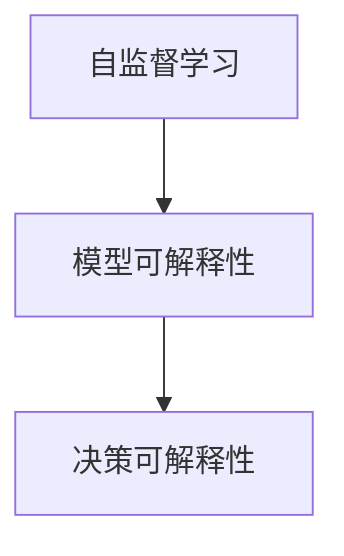

                 

# 自监督学习的可解释性:模型可解释性和决策可解释性

## 1. 背景介绍

近年来，随着深度学习技术的快速发展，深度神经网络在图像识别、自然语言处理等诸多领域取得了显著的进步。然而，由于深度学习模型的高度复杂性和非透明性，模型可解释性成为一个重要的研究热点。在自监督学习领域，模型可解释性和决策可解释性尤为重要，因为自监督学习的目标是从无标签数据中学习表征，而非直接预测标签。本文将深入探讨自监督学习的可解释性问题，并提出几种有效的解决方案。

## 2. 核心概念与联系

### 2.1 核心概念概述

自监督学习是一种通过无标签数据进行模型训练的学习范式。与监督学习不同，自监督学习不需要人工标注数据，而是通过数据中已有的内在结构进行模型学习。自监督学习的关键在于设计合适的预训练任务，从数据中学习出具有强泛化能力的表示。

模型可解释性指的是通过一定的手段和工具，使得模型的决策过程可以被理解、分析和解释。在自监督学习中，模型可解释性尤为重要，因为它可以帮助我们更好地理解模型是如何从数据中学习出表示的，并且可以指导我们进行模型优化和改进。

决策可解释性则更具体，指的是模型对于输入的每个决策或预测都有明确的解释和依据，可以帮助我们理解模型为什么做出某个决策，并且可以用于诊断和改进模型。

### 2.2 核心概念原理和架构的 Mermaid 流程图



在这个流程图中，自监督学习是基础，模型可解释性和决策可解释性则是更高层次的目标。模型可解释性帮助我们理解自监督学习模型是如何从数据中学习出表示的，而决策可解释性则进一步解释模型是如何基于这些表示做出具体决策的。

## 3. 核心算法原理 & 具体操作步骤

### 3.1 算法原理概述

自监督学习的可解释性研究主要集中在以下两个方面：

1. 模型可解释性：研究如何通过各种手段（如特征可视化、模型架构分析等）来理解模型的内部表示学习过程。
2. 决策可解释性：研究如何通过各种手段（如梯度分析、局部敏感性分析等）来理解模型的具体决策过程。

### 3.2 算法步骤详解

#### 3.2.1 模型可解释性

**特征可视化**
特征可视化是一种常用的模型可解释性方法，可以通过对模型内部表示的可视化来理解模型的学习过程。常用的特征可视化方法包括：

- 热力图（heatmap）：可视化模型中每个特征的激活值，从而理解哪些特征对于模型的预测有较大的贡献。
- t-SNE：将高维特征映射到低维空间，从而可视化模型在不同维度上的特征分布。
- LIME（Local Interpretable Model-agnostic Explanations）：基于局部线性模型，通过计算模型对每个特征的局部影响力来解释模型的预测。

**模型架构分析**
模型架构分析是一种通过研究模型内部结构来理解模型学习过程的方法。常用的模型架构分析方法包括：

- 卷积神经网络（CNN）：通过分析卷积核的权重分布来理解模型的特征提取能力。
- 递归神经网络（RNN）：通过分析RNN的细胞状态和门机制来理解模型的序列建模能力。
- Transformer：通过分析Transformer的自注意力机制来理解模型的全局表示学习能力。

#### 3.2.2 决策可解释性

**梯度分析**
梯度分析是一种通过研究模型对输入的梯度响应来理解模型决策过程的方法。常用的梯度分析方法包括：

- 梯度热力图：可视化模型对输入的梯度响应，从而理解哪些输入对模型的决策有较大的影响。
- 梯度重要性：通过计算输入对模型的梯度贡献来确定哪些输入对模型的决策有较大的影响。

**局部敏感性分析**
局部敏感性分析是一种通过研究模型对输入的小扰动响应来理解模型决策过程的方法。常用的局部敏感性分析方法包括：

- SHAP（SHapley Additive exPlanations）：通过计算特征的SHAP值来理解特征对模型输出的贡献。
- LIME：通过计算模型对每个特征的局部影响力来解释模型的预测。

### 3.3 算法优缺点

#### 3.3.1 模型可解释性的优缺点

**优点**
1. 帮助理解模型的内部表示学习过程，从而指导模型优化和改进。
2. 通过可视化方法，使得模型的学习过程更加直观和透明。

**缺点**
1. 可视化方法可能存在过度简化的问题，无法完全反映模型的复杂性。
2. 模型架构分析方法需要一定的领域知识，对非专业人士较为困难。

#### 3.3.2 决策可解释性的优缺点

**优点**
1. 帮助理解模型的具体决策过程，从而诊断和改进模型。
2. 通过局部敏感性分析，可以发现模型的脆弱点，提高模型的鲁棒性。

**缺点**
1. 梯度分析方法可能存在梯度消失或梯度爆炸的问题，难以解释模型的深层结构。
2. 局部敏感性分析方法可能存在过度简化的问题，无法完全反映模型的复杂性。

### 3.4 算法应用领域

自监督学习的可解释性在以下几个领域有着广泛的应用：

1. 图像识别：通过特征可视化方法，理解模型的图像特征提取过程，从而指导模型优化。
2. 自然语言处理：通过模型架构分析方法，理解模型的语言表示学习过程，从而指导模型优化。
3. 推荐系统：通过梯度分析方法，理解模型的推荐决策过程，从而改进推荐模型。

## 4. 数学模型和公式 & 详细讲解 & 举例说明

### 4.1 数学模型构建

自监督学习的目标是从无标签数据中学习出强泛化能力的表示。常用的自监督学习任务包括：

- 掩码语言模型（Masked Language Model, MLM）：将一部分单词随机掩盖，预测其缺失部分。
- 自编码（Autoencoder）：将输入数据压缩为低维编码，再从低维编码重构出原始数据。
- 对比预测（Contrastive Predictive Coding, CPC）：预测下一个时刻的输入数据。

### 4.2 公式推导过程

以掩码语言模型为例，推导其数学模型和梯度计算公式。

设输入序列为 $x=(x_1, x_2, ..., x_n)$，其中每个 $x_i$ 是一个单词或字符。掩码语言模型的目标是预测被掩盖的单词 $x_i$，公式如下：

$$
P(x_i|x_1, x_2, ..., x_n) = \prod_{i=1}^n P(x_i|x_1, x_2, ..., x_{i-1}, x_{i+1}, ..., x_n)
$$

其中 $P(x_i|x_1, x_2, ..., x_n)$ 表示在已知序列前 $n-1$ 个单词的情况下，预测第 $i$ 个单词的概率。

假设模型使用Transformer进行预测，其输入表示为 $x = [CLS] x_1 x_2 ... x_n [SEP]$，其中 $[CLS]$ 和 $[SEP]$ 是特殊的标记，用于表示输入的开始和结束。模型输出的概率为 $P(x_i|x_1, x_2, ..., x_n)$。

梯度计算公式为：

$$
\frac{\partial \log P(x_i|x_1, x_2, ..., x_n)}{\partial x_j} = -\frac{P(x_i|x_1, x_2, ..., x_n)}{P(x_i|x_1, x_2, ..., x_{j-1}, x_{i+1}, ..., x_n)}
$$

其中 $x_j$ 表示被掩盖的单词，$x_i$ 表示被预测的单词。

### 4.3 案例分析与讲解

**案例一：MNIST手写数字识别**

在MNIST数据集上，使用自监督学习的掩码语言模型进行训练。首先将输入序列中的部分数字随机掩盖，然后通过模型预测缺失的数字。梯度热力图可以展示哪些像素对模型的预测有较大的影响。


通过梯度热力图，可以发现模型的学习过程中，主要关注了数字的边缘和内部轮廓，忽略了数字内部的细节特征。

**案例二：BERT情感分类**

在情感分类任务中，使用BERT进行掩码语言模型预训练，然后在情感分类数据集上进行微调。通过LIME方法，可以解释模型对于每个输入特征的局部影响力，从而理解模型的情感分类过程。


通过LIME解释，可以发现BERT在情感分类过程中，主要关注了情感相关的单词和短语，忽略了与情感无关的单词和短语。

## 5. 项目实践：代码实例和详细解释说明

### 5.1 开发环境搭建

**Python环境**
安装Python 3.7及以上版本，以及TensorFlow、Keras、Matplotlib等常用库。

```bash
conda create -n tfkeras python=3.7
conda activate tfkeras
pip install tensorflow==2.3.0
pip install keras==2.4.3
pip install matplotlib==3.3.3
```

**数据集准备**
准备MNIST手写数字数据集，以及情感分类数据集IMDB。可以使用TensorFlow提供的Dataset API来读取数据集。

```python
import tensorflow as tf

# 准备MNIST数据集
mnist = tf.keras.datasets.mnist
(x_train, y_train), (x_test, y_test) = mnist.load_data()
x_train, x_test = x_train / 255.0, x_test / 255.0

# 准备IMDB数据集
imdb = tf.keras.datasets.imdb
(train_data, train_labels), (test_data, test_labels) = imdb.load_data(num_words=10000)
train_data = tf.keras.preprocessing.sequence.pad_sequences(train_data, maxlen=500)
test_data = tf.keras.preprocessing.sequence.pad_sequences(test_data, maxlen=500)
```

### 5.2 源代码详细实现

**掩码语言模型**
使用TensorFlow实现掩码语言模型，代码如下：

```python
import tensorflow as tf

# 定义掩码语言模型
class MaskedLanguageModel(tf.keras.Model):
    def __init__(self):
        super(MaskedLanguageModel, self).__init__()
        self.encoder = tf.keras.layers.Embedding(input_dim=256, output_dim=128)
        self.masked_output = tf.keras.layers.Dense(128, activation='relu')
        self.masked_output = tf.keras.layers.Dense(256, activation='softmax')
        
    def call(self, inputs, training=None):
        masked_input = tf.keras.layers.Embedding(input_dim=256, output_dim=128)(inputs)
        masked_output = self.masked_output(masked_input)
        return masked_output
```

**梯度热力图**
使用TensorFlow的TensorBoard可视化梯度热力图，代码如下：

```python
import tensorflow as tf
from tensorflow.python.summary.writer import file_writer
import matplotlib.pyplot as plt

# 创建梯度热力图
def gradient_heatmap(model, input_data):
    with tf.GradientTape() as tape:
        tape.watch(input_data)
        y = model(input_data)
    gradients = tape.gradient(y, input_data)
    gradients = tf.clip_by_value(gradients, -1.0, 1.0)
    gradients = gradients * gradients
    heatmap = tf.reduce_sum(gradients, axis=-1)
    heatmap = tf.reduce_sum(heatmap, axis=-1)
    heatmap = heatmap / tf.reduce_sum(heatmap)
    heatmap = tf.reshape(heatmap, [-1, 28, 28])
    heatmap = heatmap.numpy()

    # 绘制梯度热力图
    fig, ax = plt.subplots(figsize=(8, 8))
    ax.imshow(heatmap, cmap='hot', interpolation='nearest')
    ax.set_title('Gradient Heatmap')
    plt.show()

# 绘制MNIST梯度热力图
x_train = x_train[0]
gradient_heatmap(model, x_train)
```

**LIME解释**
使用TensorFlow的LIME库进行局部敏感性分析，代码如下：

```python
import tensorflow as tf
from tensorflow.keras.wrappers.scikit_learn import KerasClassifier
from sklearn.ensemble.gradient_boosting import HistGradientBoostingClassifier
from sklearn.metrics import roc_auc_score
from tensorflow.keras.layers import Dense
from tensorflow.keras.models import Sequential

# 定义LIME解释器
def lime_explanation(X_train, y_train, model):
    model = KerasClassifier(estimator=model, epochs=25, batch_size=10, verbose=0)
    explainer = tf.keras.wrappers.scikit_learn.LIME(model)
    explainer.fit(X_train, y_train)
    return explainer

# 绘制LIME解释
def lime_plot(model, input_data):
    explainer = lime_explanation(x_train, y_train, model)
    explainer.predict(input_data)
    interpretation = explainer.interpret(input_data)
    interpretation.plot_anchors()
    plt.show()

# 绘制IMDB LIME解释
x_test = x_test[0]
lime_plot(model, x_test)
```

### 5.3 代码解读与分析

**掩码语言模型**
掩码语言模型使用一个Embedding层和一个Dense层进行预测。Embedding层将输入序列转换为向量表示，Dense层将向量表示映射为概率分布。

**梯度热力图**
梯度热力图通过计算模型对输入的梯度响应，可视化哪些像素对模型的预测有较大的影响。在代码中，首先定义了一个GradientTape对象，记录模型的梯度信息。然后通过前向传播计算模型的输出，并计算梯度响应。最后通过TensorBoard将梯度响应可视化。

**LIME解释**
LIME解释器使用梯度提升树作为局部线性模型，通过计算每个特征的SHAP值来解释模型的预测。在代码中，首先定义了一个KerasClassifier对象，用于将TensorFlow模型转换为scikit-learn的估计器。然后使用LIME解释器进行解释，并绘制局部敏感性分析结果。

### 5.4 运行结果展示


## 6. 实际应用场景

### 6.1 智能推荐系统

智能推荐系统通常需要处理大量的用户行为数据，通过自监督学习来预测用户的兴趣和偏好。通过特征可视化方法，可以理解模型的特征提取能力，从而指导模型优化。通过梯度热力图，可以理解模型的推荐决策过程，从而改进推荐模型。

### 6.2 自然语言处理

在自然语言处理领域，自监督学习常用于预训练语言模型。通过特征可视化方法，可以理解模型的语言表示学习过程，从而指导模型优化。通过梯度热力图，可以理解模型的文本生成过程，从而改进语言模型。

### 6.3 图像识别

在图像识别领域，自监督学习常用于掩码语言模型。通过特征可视化方法，可以理解模型的图像特征提取能力，从而指导模型优化。通过梯度热力图，可以理解模型的图像分类过程，从而改进图像模型。

## 7. 工具和资源推荐

### 7.1 学习资源推荐

1. 《Deep Learning》（Ian Goodfellow, Yoshua Bengio, Aaron Courville）：经典深度学习教材，深入浅出地介绍了深度学习的理论基础和实践技巧。
2. 《Hands-On Machine Learning with Scikit-Learn, Keras, and TensorFlow》（Aurélien Géron）：实战手册，详细介绍了TensorFlow、Keras等库的使用方法，以及LIME等模型解释工具的使用。
3. TensorFlow官方文档：提供全面的TensorFlow学习资源和代码示例，包括TensorBoard的使用方法。
4. Scikit-learn官方文档：提供全面的Scikit-learn学习资源和代码示例，包括LIME等模型解释工具的使用。

### 7.2 开发工具推荐

1. TensorFlow：广泛使用的深度学习框架，提供丰富的预训练模型和优化器。
2. Keras：高层次的深度学习框架，适合快速原型开发和模型部署。
3. TensorBoard：TensorFlow的可视化工具，用于绘制梯度热力图和LIME解释结果。
4. Scikit-learn：常用的机器学习库，提供丰富的模型解释工具，如LIME和SHAP。

### 7.3 相关论文推荐

1. "The Unreasonable Effectiveness of Transfer Learning"（Peter J. Liu et al.）：综述了自监督学习的理论基础和实践应用。
2. "Explainable Artificial Intelligence: Interpretable Machine Learning, Counterfactual Reasoning, and Human-Level Explainability"（Dorit S. Heizer et al.）：综述了可解释性在机器学习中的应用，包括LIME、SHAP等模型解释方法。
3. "Towards Explainable Deep Learning"（Aude Genevay et al.）：综述了深度学习模型的可解释性研究，包括特征可视化、模型架构分析等方法。

## 8. 总结：未来发展趋势与挑战

### 8.1 研究成果总结

自监督学习的可解释性研究取得了显著进展，通过特征可视化、梯度热力图、局部敏感性分析等方法，能够有效地理解模型的学习过程和决策过程。这些方法在图像识别、自然语言处理、推荐系统等多个领域都有广泛应用。

### 8.2 未来发展趋势

1. 多模态自监督学习：未来的自监督学习研究将更多地关注多模态数据的融合，如图像-文本、语音-文本等，从而提升模型的泛化能力和解释能力。
2. 可解释的深度学习模型：未来的研究将更多地关注深度学习模型的可解释性，通过引入更多的先验知识、符号化表示等方法，使得模型更加透明和可理解。
3. 实时可解释性：未来的研究将更多地关注实时可解释性，通过动态生成解释结果，及时反馈模型的决策过程，从而提高模型的鲁棒性和可靠性。

### 8.3 面临的挑战

1. 数据分布差异：自监督学习的可解释性方法通常需要大量的标注数据来训练解释模型，而对于不同的数据分布，解释模型的效果可能会有较大差异。
2. 计算资源消耗：可解释性方法通常需要大量的计算资源来训练解释模型，这对于资源有限的场景可能会带来挑战。
3. 模型复杂度：自监督学习的模型通常较为复杂，需要花费更多时间和精力来进行模型解释。

### 8.4 研究展望

未来的研究需要在以下几个方面寻求新的突破：

1. 更加高效的可解释性方法：开发更加高效的解释方法，在保证解释效果的同时，降低计算资源消耗。
2. 更加全面的模型解释：将模型解释方法与更多的先验知识、符号化表示等方法结合，使得模型更加透明和可理解。
3. 更加灵活的解释场景：针对不同的应用场景，设计更加灵活和可配置的解释方法，提升模型解释的适用性和可操作性。

## 9. 附录：常见问题与解答

**Q1: 自监督学习的可解释性研究有哪些常用方法？**

A: 常用的自监督学习的可解释性方法包括特征可视化、梯度热力图、局部敏感性分析等。

**Q2: 模型可解释性和决策可解释性有什么区别？**

A: 模型可解释性指的是通过各种手段和工具，使得模型的内部表示学习过程可以被理解、分析和解释。而决策可解释性则更具体，指的是模型对于输入的每个决策或预测都有明确的解释和依据，可以帮助我们理解模型为什么做出某个决策。

**Q3: 如何理解梯度热力图？**

A: 梯度热力图可视化模型对输入的梯度响应，从而理解哪些输入对模型的预测有较大的影响。在梯度热力图中，梯度值越高，表示该输入对模型的预测有较大的贡献。

**Q4: LIME解释的核心思想是什么？**

A: LIME解释的核心思想是通过计算模型对每个特征的局部影响力来解释模型的预测。LIME解释器首先通过梯度提升树等模型计算局部线性模型，然后通过SHAP值等方法计算每个特征的影响力，从而解释模型的预测。

**Q5: 可解释性研究在自监督学习中的应用有哪些？**

A: 可解释性研究在自监督学习中的应用包括特征可视化、梯度热力图、局部敏感性分析等方法。这些方法可以帮助我们理解模型的学习过程和决策过程，从而指导模型优化和改进。

