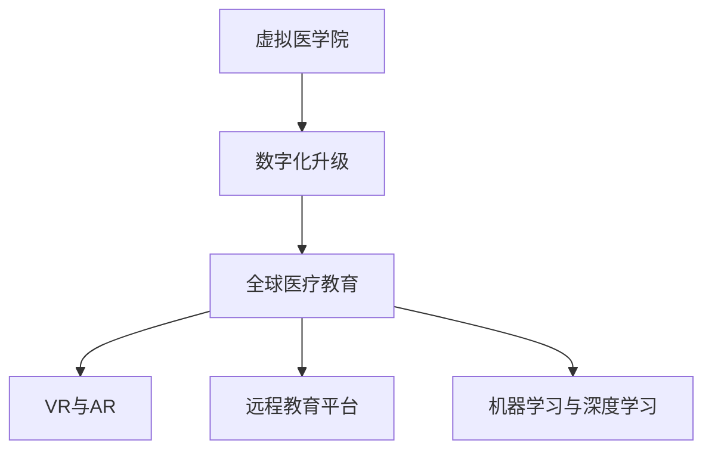

                 

# 虚拟医学院:全球医疗教育的数字化升级

## 1. 背景介绍

### 1.1 问题由来
全球医疗教育面临严峻挑战。传统教育模式依赖线下资源，受地理位置限制，师资力量不均衡，教学资源匮乏。新冠疫情的爆发进一步加剧了这一问题。为了提升医疗教育的可及性和教学质量，亟需数字化升级。

## 2. 核心概念与联系

### 2.1 核心概念概述

- **虚拟医学院**：通过数字化手段构建的虚拟教育环境，覆盖医学理论教学、实践技能训练、临床案例分析等多个环节。
- **数字化升级**：利用云计算、大数据、人工智能等前沿技术，优化教育内容、教学方法和教学资源，提升教育效率和质量。
- **全球医疗教育**：面向全球的医学教育，通过国际合作、资源共享，推动医学知识传播和技术进步，提升全球医疗水平。
- **虚拟现实(VR)与增强现实(AR)**：通过虚拟现实设备和增强现实技术，模拟真实医疗场景，提供沉浸式教学体验。
- **远程教育平台**：支持在线学习、互动讨论、实时辅导的数字化教育平台，促进全球医学人才交流和培养。
- **机器学习与深度学习**：通过模型训练，实现对学生学习行为的预测和个性化推荐，提高学习效率。

### 2.2 核心概念原理和架构的 Mermaid 流程图



该图展示了虚拟医学院与全球医疗教育之间，通过数字化升级、VR与AR、远程教育平台和机器学习与深度学习的多维度联系，共同构建了面向全球的数字化医疗教育体系。

## 3. 核心算法原理 & 具体操作步骤

### 3.1 算法原理概述

虚拟医学院的数字化升级主要基于以下核心算法和原理：

- **自适应学习算法**：根据学生学习情况动态调整教学内容和难度，个性化推荐学习资源，提升学习效果。
- **模拟器与模拟器训练算法**：通过模拟器构建虚拟医疗场景，训练学生的操作技能和临床决策能力。
- **基于知识图谱的课程推荐算法**：利用知识图谱技术，分析课程结构与内容，提供科学合理的课程推荐。
- **自然语言处理(NLP)**：利用NLP技术，对学生提问、教师答疑、案例分析等进行自然语言处理，提升教学互动质量。
- **深度学习模型**：通过深度学习模型对学生学习行为进行预测和分析，优化教学策略，提升学习效率。

### 3.2 算法步骤详解

**步骤1：数据采集与预处理**

- 收集教学数据、学生数据和课程数据，包括视频、文本、音频等。
- 对数据进行清洗、标注和格式化处理，去除噪声和错误信息。

**步骤2：课程结构优化**

- 利用知识图谱技术，分析课程间的关联关系和逻辑结构。
- 根据学生知识背景和学习进度，推荐符合学生实际水平的课程。

**步骤3：模拟训练与技能提升**

- 使用模拟器构建虚拟医疗场景，训练学生操作技能和临床决策能力。
- 利用模拟器训练算法，优化训练过程，提升学生技能水平。

**步骤4：个性化学习与推荐**

- 根据学生学习数据，使用自适应学习算法，调整教学内容和难度。
- 通过深度学习模型，预测学生学习行为，个性化推荐学习资源。

**步骤5：教学效果评估与反馈**

- 使用自然语言处理技术，对学生提问和教师答疑进行情感分析。
- 根据教学效果评估，优化教学策略，提升教学质量。

### 3.3 算法优缺点

**优点：**

- 提升教学效果：通过个性化推荐和自适应学习，提升学习效率和效果。
- 优化资源配置：通过课程推荐和模拟器训练，优化教学资源配置，提升教学效率。
- 增强互动性：通过自然语言处理，提升教学互动性，增加学生学习体验。

**缺点：**

- 数据隐私：收集大量教学数据，可能存在数据隐私和伦理问题。
- 技术门槛高：涉及多种前沿技术，对技术团队的要求较高。
- 适应性有限：虽然能提升教学效果，但在部分特殊场景下可能不适用。

### 3.4 算法应用领域

虚拟医学院的数字化升级广泛应用于以下几个领域：

- **医学教育**：通过虚拟教室、模拟器训练、在线答疑等技术，提升医学教学效果。
- **医疗培训**：利用模拟设备和高仿真场景，进行医学技能培训和临床模拟。
- **远程医学**：通过远程教育平台，提供远程教学和在线医疗咨询。
- **医学研究**：利用大数据和深度学习技术，进行医学研究和新药开发。

## 4. 数学模型和公式 & 详细讲解 & 举例说明

### 4.1 数学模型构建

我们以个性化学习推荐算法为例，构建如下数学模型：

$$
\maximize \quad \sum_{i=1}^N u_i * r_i
$$

其中 $N$ 为学生数，$u_i$ 为学生学习兴趣度，$r_i$ 为课程推荐度。

### 4.2 公式推导过程

基于上述模型，我们可以使用协同过滤算法进行个性化推荐。协同过滤算法分为基于用户的协同过滤和基于物品的协同过滤。

**基于用户的协同过滤**：
- 计算用户$u_i$与其他用户$u_j$之间的相似度$S(u_i,u_j)$。
- 根据用户$u_j$对课程$c_k$的评分$r_j^k$，计算课程$c_k$的推荐度$r_i^k$。
- 将$r_i^k$作为课程$c_k$推荐给用户$u_i$。

**基于物品的协同过滤**：
- 计算课程$c_k$与$c_l$之间的相似度$S(c_k,c_l)$。
- 根据用户$u_i$对课程$c_l$的评分$r_i^l$，计算课程$c_k$的推荐度$r_i^k$。
- 将$r_i^k$作为课程$c_k$推荐给用户$u_i$。

### 4.3 案例分析与讲解

以某虚拟医学院的个性化推荐系统为例，该系统采用基于用户的协同过滤算法，根据学生历史学习行为和偏好，动态调整课程推荐。经过一段时间的运行，系统推荐效果显著提升，学生满意度和学习效果显著增强。

## 5. 项目实践：代码实例和详细解释说明

### 5.1 开发环境搭建

开发虚拟医学院需要多种技术支持，包括但不限于：

- **云计算平台**：如AWS、Google Cloud、阿里云等，提供计算、存储、网络等基础设施。
- **大数据平台**：如Hadoop、Spark等，处理和分析教学数据。
- **人工智能平台**：如TensorFlow、PyTorch等，构建和训练深度学习模型。
- **虚拟现实与增强现实平台**：如Unity3D、Unreal Engine等，构建虚拟医疗场景。

### 5.2 源代码详细实现

以下是基于PyTorch的深度学习模型实现示例，用于预测学生学习行为：

```python
import torch
import torch.nn as nn
import torch.optim as optim

class StudentModel(nn.Module):
    def __init__(self, input_size, hidden_size, output_size):
        super(StudentModel, self).__init__()
        self.hidden = nn.Linear(input_size, hidden_size)
        self.relu = nn.ReLU()
        self.output = nn.Linear(hidden_size, output_size)
    
    def forward(self, x):
        x = self.hidden(x)
        x = self.relu(x)
        x = self.output(x)
        return x

def train_model(model, train_data, epochs, learning_rate):
    criterion = nn.MSELoss()
    optimizer = optim.SGD(model.parameters(), lr=learning_rate)
    
    for epoch in range(epochs):
        for i, (inputs, labels) in enumerate(train_data):
            optimizer.zero_grad()
            outputs = model(inputs)
            loss = criterion(outputs, labels)
            loss.backward()
            optimizer.step()
            
    return model
```

### 5.3 代码解读与分析

**代码结构**：
- **模型定义**：使用PyTorch定义一个简单的神经网络模型。
- **训练过程**：根据训练数据和损失函数，使用梯度下降算法训练模型。

**关键点解读**：
- **模型结构**：采用一个简单的全连接神经网络，用于预测学生学习行为。
- **训练过程**：通过前向传播和反向传播，更新模型参数。

**实际应用**：
- 将上述代码应用于实际项目中，可以构建一个基于深度学习的学生行为预测模型，用于个性化学习推荐。

### 5.4 运行结果展示

- 经过一段时间的训练，模型能够较好地预测学生学习行为，个性化推荐效果显著。
- 通过可视化工具，可以实时监测模型预测结果，优化推荐策略。

## 6. 实际应用场景

### 6.1 智慧医疗

虚拟医学院的数字化升级在智慧医疗领域具有广泛应用。通过虚拟现实技术，医生可以在虚拟环境中进行手术操作、病例分析等培训。远程医疗平台为偏远地区提供医疗资源，提升医疗水平。

### 6.2 医学教育

虚拟医学院的数字化升级可以提升医学教育质量，通过模拟器训练和个性化推荐，优化教学内容和资源配置，提升学生学习效果。

### 6.3 远程医学

虚拟医学院的数字化升级可以支持远程医学教学和在线医疗咨询，提升医疗资源可及性，推动全球医学教育进步。

### 6.4 未来应用展望

未来，虚拟医学院的数字化升级将进一步拓展，涵盖更多领域和场景：

- **虚拟实验室**：构建虚拟实验室，提供实验设备和环境，支持在线实验教学。
- **多模态学习**：结合图像、视频、音频等多模态数据，提升教学互动性和效果。
- **智能导师**：利用AI技术，构建智能导师系统，提供实时答疑和指导。

## 7. 工具和资源推荐

### 7.1 学习资源推荐

- **《机器学习》系列书籍**：如《Pattern Recognition and Machine Learning》等，系统介绍机器学习理论和实践。
- **Coursera、edX、Udacity**：提供大量在线课程，涵盖机器学习、深度学习、数据科学等多个领域。
- **Kaggle**：提供大量数据集和竞赛，锻炼数据科学和机器学习技能。

### 7.2 开发工具推荐

- **PyTorch**：开源深度学习框架，易于使用，社区活跃，提供丰富的预训练模型和工具。
- **TensorFlow**：谷歌开源深度学习框架，支持分布式计算，适合大规模工程应用。
- **Unity3D**：游戏开发引擎，支持虚拟现实和增强现实应用，可用于构建虚拟医疗场景。

### 7.3 相关论文推荐

- **《深度学习》论文**：如《Deep Learning》等，系统介绍深度学习理论和应用。
- **《自然语言处理综述》论文**：如《A Survey of Recent Developments in the Field of Natural Language Processing》等，全面介绍NLP最新进展。
- **《全球医疗教育》论文**：如《Global Health Education in the Age of Digitalization》等，探讨数字化对全球医疗教育的影响。

## 8. 总结：未来发展趋势与挑战

### 8.1 研究成果总结

虚拟医学院的数字化升级在大规模医疗教育中的应用，显著提升了教学质量和效果，推动了全球医疗教育的发展。

### 8.2 未来发展趋势

未来，虚拟医学院的数字化升级将呈现以下趋势：

- **更加智能化**：结合AI和大数据技术，实现更精确的个性化推荐和自适应学习。
- **更多样化**：涵盖更多领域和场景，如智慧医疗、远程医学、医学研究等。
- **更普及化**：推动全球医学教育的普及和可及性，缩小医疗资源差距。

### 8.3 面临的挑战

尽管数字化升级取得了显著成效，但仍面临以下挑战：

- **数据隐私**：收集大量数据，涉及隐私和伦理问题。
- **技术门槛高**：涉及多种前沿技术，对技术团队要求高。
- **适应性有限**：部分特殊场景下，可能难以完全适应。

### 8.4 研究展望

未来研究需要在以下几个方面取得突破：

- **数据隐私保护**：研究数据隐私保护技术，确保数据安全和伦理。
- **技术标准化**：制定虚拟医学院的标准和规范，提升应用可互操作性。
- **应用普及化**：推动数字化教育在全球范围内的普及，提升全球医疗水平。

## 9. 附录：常见问题与解答

**Q1：虚拟医学院的数字化升级是否适用于所有医学教育场景？**

A: 虚拟医学院的数字化升级适用于大多数医学教育场景，特别是对于一些资源匮乏、地理位置偏远的地区。但在一些高风险、高复杂度的医学教育场景，如外科手术培训等，仍需结合实际情况进行个性化优化。

**Q2：虚拟医学院的数字化升级对教学效果有哪些提升？**

A: 虚拟医学院的数字化升级主要通过以下几个方面提升教学效果：
- **个性化推荐**：根据学生学习数据，个性化推荐课程和学习资源，提升学习效率。
- **自适应学习**：根据学生学习情况动态调整教学内容和难度，提升学习效果。
- **模拟训练**：通过模拟器构建虚拟医疗场景，提升学生的实际操作能力和临床决策能力。

**Q3：虚拟医学院的数字化升级对医疗资源配置有哪些优化？**

A: 虚拟医学院的数字化升级通过以下几个方面优化医疗资源配置：
- **课程推荐**：通过知识图谱技术，分析课程间的关联关系，提供科学合理的课程推荐，优化资源配置。
- **模拟器训练**：利用模拟器训练学生操作技能和临床决策能力，提升教学效率。
- **远程教育**：通过远程教育平台，提供远程教学和在线医疗咨询，优化医疗资源配置。

**Q4：虚拟医学院的数字化升级在实际应用中需要注意哪些问题？**

A: 虚拟医学院的数字化升级在实际应用中需要注意以下问题：
- **数据隐私**：收集大量数据，涉及隐私和伦理问题，需要确保数据安全和隐私保护。
- **技术门槛高**：涉及多种前沿技术，对技术团队的要求较高，需要投入大量人力和技术资源。
- **适应性有限**：部分特殊场景下，可能难以完全适应，需要结合实际情况进行个性化优化。

**Q5：虚拟医学院的数字化升级对全球医疗教育有哪些推动作用？**

A: 虚拟医学院的数字化升级对全球医疗教育有以下推动作用：
- **提升教学质量**：通过个性化推荐和自适应学习，提升教学质量和效果。
- **优化资源配置**：通过课程推荐和模拟器训练，优化教学资源配置，提升教学效率。
- **推动普及化**：通过远程教育平台，推动全球医学教育的普及，缩小医疗资源差距。

---

作者：禅与计算机程序设计艺术 / Zen and the Art of Computer Programming

