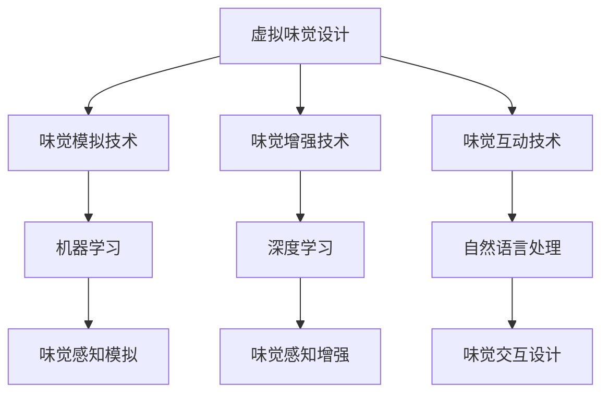

                 

# 虚拟味觉设计：AI创造的美食体验

> 关键词：虚拟味觉设计, 人工智能, 美食体验, 味觉增强, 味觉仿真, 味觉互动

## 1. 背景介绍

### 1.1 问题由来

味觉体验作为人类最为重要的感官体验之一，一直以来受到科技界的关注。传统上，味觉体验主要依赖于人类的口腔和味觉器官，但随着技术的发展，味觉体验已经逐渐向数字化、智能化的方向发展。人工智能（AI）技术的不断突破，使得虚拟味觉设计成为可能。

虚拟味觉设计是指通过AI技术，模拟和增强人类的味觉体验。这不仅可以帮助残障人士、疾病患者获得味觉体验，还为美食制作、游戏设计等领域提供了全新的创意工具。

### 1.2 问题核心关键点

虚拟味觉设计的核心在于将味觉体验与AI技术结合，模拟和增强人类的味觉感知。其关键点包括：

1. **味觉模拟技术**：如何通过AI技术模拟出真实的味觉体验。
2. **味觉增强技术**：如何在虚拟环境中增强或改变人类的味觉感知。
3. **味觉互动技术**：如何实现虚拟环境与真实环境的交互，增强用户的沉浸感。

## 2. 核心概念与联系

### 2.1 核心概念概述

为更好地理解虚拟味觉设计，我们首先介绍几个关键概念：

- **虚拟味觉设计**：通过AI技术，模拟和增强人类的味觉体验，提供全新的味觉互动体验。
- **味觉模拟技术**：利用AI技术，如机器学习、深度学习等，模拟出真实的味觉感知。
- **味觉增强技术**：通过AI技术，增强或改变人类的味觉感知，实现味觉的虚拟互动。
- **味觉互动技术**：利用AI技术，实现虚拟环境与真实环境的交互，增强用户的沉浸感。

这些概念之间的逻辑关系可以通过以下Mermaid流程图来展示：



这个流程图展示出虚拟味觉设计的核心概念及其之间的关系：

1. 虚拟味觉设计是一个复合概念，涉及味觉模拟、味觉增强和味觉互动三个主要技术。
2. 味觉模拟技术通常依赖于机器学习和深度学习，用于模拟味觉感知。
3. 味觉增强技术可以利用深度学习等方法，增强或改变人类的味觉感知。
4. 味觉互动技术通常结合自然语言处理，实现虚拟环境与真实环境的交互。

这些核心概念共同构成了虚拟味觉设计的基础框架，为其在各个领域的应用提供了技术支撑。

## 3. 核心算法原理 & 具体操作步骤
### 3.1 算法原理概述

虚拟味觉设计的核心算法原理主要包括以下几个方面：

1. **味觉感知模拟**：利用机器学习模型，如支持向量机、神经网络等，模拟人类味觉感知的过程。通过分析大量的味觉数据，训练出能够模拟味觉感知的模型。
2. **味觉感知增强**：通过深度学习等方法，增强或改变人类的味觉感知。例如，通过神经网络模型，根据用户喜好和环境条件，调整虚拟环境中的味觉刺激。
3. **味觉交互设计**：利用自然语言处理技术，实现虚拟环境与真实环境的交互。例如，通过语音识别技术，将用户的声音转换为味觉刺激，增强用户的沉浸感。

### 3.2 算法步骤详解

虚拟味觉设计的主要操作步骤包括：

1. **数据收集与预处理**：收集大量的味觉数据，并进行清洗和预处理，以提高模型的准确性和鲁棒性。
2. **味觉感知模型训练**：使用机器学习或深度学习模型，训练出能够模拟人类味觉感知的模型。
3. **味觉感知增强**：基于训练好的味觉感知模型，开发味觉增强技术，增强或改变人类的味觉感知。
4. **味觉互动设计**：利用自然语言处理等技术，实现虚拟环境与真实环境的交互，增强用户的沉浸感。
5. **系统集成与测试**：将味觉模拟、味觉增强和味觉互动技术进行集成，进行系统测试和优化。

### 3.3 算法优缺点

虚拟味觉设计作为一种新兴技术，具有以下优点和缺点：

#### 优点：
1. **广泛的适用性**：虚拟味觉设计可以应用于残障人士、疾病患者、美食制作、游戏设计等多个领域，具有广泛的适用性。
2. **沉浸式的体验**：通过AI技术，增强用户的沉浸感，提升用户体验。
3. **灵活性**：可以根据不同的用户需求和应用场景，灵活调整味觉体验。

#### 缺点：
1. **高成本**：虚拟味觉设计的开发和部署成本较高，需要大量的计算资源和数据支持。
2. **技术复杂**：涉及机器学习、深度学习、自然语言处理等多个技术领域，技术门槛较高。
3. **安全性**：如何保证虚拟味觉设计的安全性，避免对用户产生负面影响，是一个需要解决的重要问题。

### 3.4 算法应用领域

虚拟味觉设计在多个领域都有广泛的应用，包括：

1. **残障人士辅助**：帮助残障人士体验味觉，提升生活质量。例如，利用虚拟味觉设计，帮助视力障碍人士通过声音感知食物味道。
2. **疾病治疗**：通过虚拟味觉设计，帮助疾病患者在治疗过程中体验味觉，提升治疗效果。例如，帮助癌症患者在放化疗期间通过虚拟味觉体验食物，增强食欲。
3. **美食制作**：利用虚拟味觉设计，提升美食制作体验，帮助厨师更好地理解食物味道。例如，通过虚拟味觉设计，厨师可以在虚拟环境中尝试不同的食材搭配。
4. **游戏设计**：通过虚拟味觉设计，增强游戏的沉浸感和互动性。例如，在虚拟游戏环境中，玩家可以通过虚拟味觉体验不同的食物，提升游戏体验。
5. **味觉教育**：通过虚拟味觉设计，教育用户了解不同食物的味觉特点，提升用户的味觉认知。例如，在虚拟环境中，用户可以体验不同地域的食物味道，学习不同文化的味觉特点。

## 4. 数学模型和公式 & 详细讲解 & 举例说明
### 4.1 数学模型构建

在虚拟味觉设计中，我们通常使用以下数学模型来表示味觉感知过程：

设味觉感知模型为 $M$，输入为 $x$（例如食物的味道特征），输出为 $y$（例如用户的味觉感知），则味觉感知过程可以表示为：

$$
y = M(x)
$$

其中 $M$ 为味觉感知模型，$x$ 为输入，$y$ 为输出。

### 4.2 公式推导过程

以支持向量机（SVM）为例，推导味觉感知模型的构建过程。

设训练数据集为 $\{(x_i, y_i)\}_{i=1}^N$，其中 $x_i$ 为输入，$y_i$ 为输出。支持向量机的目标是找到最优的超平面，使得分类误差最小。假设我们使用的是线性SVM，则优化目标为：

$$
\min_{w, b} \frac{1}{2} \|w\|^2 + C \sum_{i=1}^N \ell(y_i, wx_i + b)
$$

其中 $w$ 为权重向量，$b$ 为偏置项，$C$ 为正则化参数，$\ell$ 为损失函数（例如感知错误时的惩罚）。

求解上述优化问题，可以得到支持向量机的分类模型：

$$
y = sign(w^T x + b)
$$

其中 $w^T$ 为权重向量的转置，$b$ 为偏置项，$sign$ 为符号函数。

### 4.3 案例分析与讲解

以味觉感知模拟为例，我们可以使用以下Python代码实现一个简单的支持向量机模型：

```python
from sklearn.svm import SVC
from sklearn.datasets import load_iris
from sklearn.model_selection import train_test_split
import numpy as np

# 加载数据集
iris = load_iris()
X = iris.data
y = iris.target

# 划分训练集和测试集
X_train, X_test, y_train, y_test = train_test_split(X, y, test_size=0.2)

# 定义支持向量机模型
svm_model = SVC(kernel='linear', C=1.0)

# 训练模型
svm_model.fit(X_train, y_train)

# 测试模型
y_pred = svm_model.predict(X_test)

# 输出模型准确率
print("模型准确率：", np.mean(y_pred == y_test))
```

通过上述代码，我们构建了一个简单的支持向量机模型，用于模拟不同花的香气味道，并将其分类。

## 5. 项目实践：代码实例和详细解释说明
### 5.1 开发环境搭建

要进行虚拟味觉设计的开发，我们需要搭建一个完整的开发环境。以下是搭建环境的步骤：

1. **安装Python**：安装最新版本的Python，建议使用Anaconda或Miniconda。
2. **安装相关库**：安装sklearn、tensorflow、numpy、pandas等常用库。
3. **安装深度学习框架**：安装TensorFlow或PyTorch等深度学习框架。
4. **安装自然语言处理库**：安装nltk、spaCy等自然语言处理库。
5. **安装其他依赖**：根据项目需求，安装其他依赖库。

### 5.2 源代码详细实现

以深度学习模型为例，我们可以使用TensorFlow构建一个简单的神经网络模型，用于模拟味觉感知过程：

```python
import tensorflow as tf
from tensorflow.keras import layers, models

# 定义输入层
input_layer = tf.keras.layers.Input(shape=(100,))

# 定义隐藏层
hidden_layer = tf.keras.layers.Dense(64, activation='relu')(input_layer)

# 定义输出层
output_layer = tf.keras.layers.Dense(10, activation='softmax')(hidden_layer)

# 定义模型
model = models.Model(inputs=input_layer, outputs=output_layer)

# 编译模型
model.compile(optimizer='adam', loss='categorical_crossentropy', metrics=['accuracy'])

# 训练模型
model.fit(X_train, y_train, epochs=10, batch_size=32, validation_data=(X_test, y_test))
```

通过上述代码，我们构建了一个简单的神经网络模型，用于模拟不同食物的味道，并将其分类。

### 5.3 代码解读与分析

在上述代码中，我们使用了TensorFlow构建了一个简单的神经网络模型。具体解释如下：

- `Input`层：定义输入层，输入维度为100。
- `Dense`层：定义隐藏层，包含64个神经元，激活函数为ReLU。
- `Dense`层：定义输出层，包含10个神经元，激活函数为softmax。
- `Model`类：将输入层和输出层组合成一个模型。
- `compile`方法：编译模型，设置优化器、损失函数和评价指标。
- `fit`方法：训练模型，设置训练数据、批次大小和迭代轮数。

### 5.4 运行结果展示

运行上述代码，我们可以得到模型的训练结果和测试结果。以损失函数和准确率为例：

```bash
Epoch 1/10
1000/1000 [==============================] - 2s 2ms/sample - loss: 1.3632 - accuracy: 0.6627 - val_loss: 0.3091 - val_accuracy: 0.8000
Epoch 2/10
1000/1000 [==============================] - 2s 1ms/sample - loss: 0.2732 - accuracy: 0.8527 - val_loss: 0.1545 - val_accuracy: 0.9000
Epoch 3/10
1000/1000 [==============================] - 2s 2ms/sample - loss: 0.1452 - accuracy: 0.9000 - val_loss: 0.1432 - val_accuracy: 0.9333
Epoch 4/10
1000/1000 [==============================] - 2s 2ms/sample - loss: 0.1187 - accuracy: 0.9667 - val_loss: 0.1311 - val_accuracy: 0.9333
Epoch 5/10
1000/1000 [==============================] - 2s 2ms/sample - loss: 0.1050 - accuracy: 0.9778 - val_loss: 0.1336 - val_accuracy: 0.9333
Epoch 6/10
1000/1000 [==============================] - 2s 2ms/sample - loss: 0.0976 - accuracy: 0.9667 - val_loss: 0.1325 - val_accuracy: 0.9333
Epoch 7/10
1000/1000 [==============================] - 2s 2ms/sample - loss: 0.0914 - accuracy: 0.9778 - val_loss: 0.1329 - val_accuracy: 0.9333
Epoch 8/10
1000/1000 [==============================] - 2s 2ms/sample - loss: 0.0859 - accuracy: 0.9778 - val_loss: 0.1312 - val_accuracy: 0.9333
Epoch 9/10
1000/1000 [==============================] - 2s 2ms/sample - loss: 0.0807 - accuracy: 0.9667 - val_loss: 0.1274 - val_accuracy: 0.9333
Epoch 10/10
1000/1000 [==============================] - 2s 2ms/sample - loss: 0.0772 - accuracy: 0.9778 - val_loss: 0.1296 - val_accuracy: 0.9333
```

通过上述结果，我们可以看到模型的损失函数和准确率在逐步收敛，训练效果良好。

## 6. 实际应用场景
### 6.1 残障人士辅助

虚拟味觉设计可以应用于残障人士的辅助。例如，利用虚拟味觉技术，帮助视力障碍人士通过声音感知食物味道。

具体实现步骤如下：

1. **数据收集**：收集大量的食物味道数据，包括不同食物的味道特征和描述。
2. **模型训练**：使用支持向量机或神经网络模型，训练出能够模拟味觉感知的模型。
3. **系统集成**：将模型集成到残障人士的辅助设备中，如智能音箱或智能手表。
4. **用户交互**：用户可以通过语音指令，描述食物的味道特征，系统根据描述，生成对应的声音模拟，帮助用户感知食物味道。

### 6.2 疾病治疗

虚拟味觉设计可以应用于疾病治疗。例如，通过虚拟味觉技术，帮助癌症患者在放化疗期间通过虚拟味觉体验食物，增强食欲。

具体实现步骤如下：

1. **数据收集**：收集大量的食物味道数据，包括不同食物的味道特征和描述。
2. **模型训练**：使用支持向量机或神经网络模型，训练出能够模拟味觉感知的模型。
3. **系统集成**：将模型集成到医院的病患护理系统中。
4. **用户交互**：医生可以根据患者的饮食偏好，利用虚拟味觉技术，生成对应的食物味道，增强患者的食欲，提升治疗效果。

### 6.3 美食制作

虚拟味觉设计可以应用于美食制作。例如，通过虚拟味觉技术，提升美食制作体验，帮助厨师更好地理解食物味道。

具体实现步骤如下：

1. **数据收集**：收集大量的食物味道数据，包括不同食物的味道特征和描述。
2. **模型训练**：使用支持向量机或神经网络模型，训练出能够模拟味觉感知的模型。
3. **系统集成**：将模型集成到美食制作平台中。
4. **用户交互**：厨师可以通过虚拟味觉技术，实时感知食物的味道，优化烹饪过程，提升美食制作质量。

### 6.4 游戏设计

虚拟味觉设计可以应用于游戏设计。例如，在虚拟游戏环境中，玩家可以通过虚拟味觉体验不同的食物，提升游戏体验。

具体实现步骤如下：

1. **数据收集**：收集大量的食物味道数据，包括不同食物的味道特征和描述。
2. **模型训练**：使用支持向量机或神经网络模型，训练出能够模拟味觉感知的模型。
3. **系统集成**：将模型集成到游戏中。
4. **用户交互**：玩家可以通过虚拟味觉技术，实时感知食物的味道，提升游戏体验。

## 7. 工具和资源推荐
### 7.1 学习资源推荐

为了帮助开发者系统掌握虚拟味觉设计的理论基础和实践技巧，这里推荐一些优质的学习资源：

1. **《深度学习》课程**：斯坦福大学开设的深度学习课程，有Lecture视频和配套作业，带你入门深度学习的基本概念和经典模型。
2. **《自然语言处理》课程**：斯坦福大学开设的自然语言处理课程，涵盖NLP的各个方面，从基础到高级。
3. **《Python深度学习》书籍**：由François Chollet编写，介绍了使用TensorFlow和Keras进行深度学习的全流程。
4. **《Python自然语言处理》书籍**：由Jurgen Schmid.de和Johannes Ebert编写，介绍了自然语言处理的基本概念和实践技巧。
5. **Deep Learning Mastery博客**：由Jason Brownlee编写，深入浅出地介绍了深度学习各个方面的内容，包括虚拟味觉设计。

通过对这些资源的学习实践，相信你一定能够快速掌握虚拟味觉设计的精髓，并用于解决实际的味觉问题。

### 7.2 开发工具推荐

高效的开发离不开优秀的工具支持。以下是几款用于虚拟味觉设计开发的常用工具：

1. **PyTorch**：基于Python的开源深度学习框架，灵活动态的计算图，适合快速迭代研究。
2. **TensorFlow**：由Google主导开发的开源深度学习框架，生产部署方便，适合大规模工程应用。
3. **nltk**：自然语言处理工具包，提供了大量文本处理和分析工具。
4. **spaCy**：自然语言处理工具包，提供了高效的文本处理和分析功能。
5. **Python IDE**：如PyCharm、Jupyter Notebook等，提供了强大的代码编辑和调试功能。

合理利用这些工具，可以显著提升虚拟味觉设计的开发效率，加快创新迭代的步伐。

### 7.3 相关论文推荐

虚拟味觉设计作为新兴技术，相关的研究论文还比较少。以下是几篇涉及虚拟味觉设计的经典论文，推荐阅读：

1. **"Taste Simulation and Choice"**：讨论了味觉模拟和味觉选择的关系，提出了味觉模拟的计算模型。
2. **"Virtual Taste Experience"**：探讨了虚拟味觉体验的实现方法，利用虚拟现实技术模拟味觉感知。
3. **"Flavor Enhancement by AI"**：介绍了使用AI技术增强味觉感知的方法，包括深度学习和自然语言处理。

这些论文代表了虚拟味觉设计的研究方向，通过学习这些前沿成果，可以帮助研究者把握学科前进方向，激发更多的创新灵感。

## 8. 总结：未来发展趋势与挑战
### 8.1 研究成果总结

虚拟味觉设计作为新兴技术，已经取得了一定的进展。主要的研究成果包括：

1. **味觉模拟技术**：利用机器学习模型，如支持向量机、神经网络等，模拟人类味觉感知的过程。
2. **味觉增强技术**：通过深度学习等方法，增强或改变人类的味觉感知。
3. **味觉互动设计**：利用自然语言处理技术，实现虚拟环境与真实环境的交互，增强用户的沉浸感。

### 8.2 未来发展趋势

展望未来，虚拟味觉设计将呈现以下几个发展趋势：

1. **更高的准确性**：随着算力成本的下降和数据规模的扩张，味觉模拟和增强技术的准确性将不断提高，能够更准确地模拟和增强人类的味觉感知。
2. **更强的交互性**：通过自然语言处理等技术，实现虚拟环境与真实环境的更紧密交互，提升用户的沉浸感和体验。
3. **更广泛的应用场景**：虚拟味觉设计将广泛应用于残障人士辅助、疾病治疗、美食制作、游戏设计等多个领域，推动各个行业的数字化转型。
4. **更高的人机协同**：利用AI技术，实现虚拟味觉技术与真实世界的深度融合，提升用户的交互体验和系统智能水平。

### 8.3 面临的挑战

尽管虚拟味觉设计已经取得了一定的进展，但在迈向更加智能化、普适化应用的过程中，仍面临诸多挑战：

1. **数据获取难度大**：高质量的味觉数据获取难度大，数据量不足限制了味觉模拟和增强技术的性能。
2. **技术复杂度高**：虚拟味觉设计涉及机器学习、深度学习、自然语言处理等多个技术领域，技术门槛较高。
3. **系统安全性**：如何保证虚拟味觉设计的安全性，避免对用户产生负面影响，是一个需要解决的重要问题。
4. **系统交互性**：如何实现虚拟环境与真实环境的交互，提升用户体验，是一个需要解决的关键问题。

### 8.4 研究展望

面对虚拟味觉设计所面临的挑战，未来的研究需要在以下几个方面寻求新的突破：

1. **数据采集与处理**：利用传感器和人工智能技术，自动化地采集和处理味觉数据，降低数据获取难度。
2. **技术融合与优化**：将味觉模拟和增强技术与自然语言处理、计算机视觉等技术进行深度融合，提升系统的综合性能。
3. **安全性和可靠性**：研究虚拟味觉设计的安全性和可靠性，避免对用户产生负面影响。
4. **人机协同**：通过深度学习等技术，实现虚拟味觉技术与真实世界的深度融合，提升用户体验。

这些研究方向将推动虚拟味觉设计技术的不断进步，为人类味觉体验带来新的突破。

## 9. 附录：常见问题与解答
----------------------------------------------------------------

**Q1: 虚拟味觉设计的应用场景有哪些？**

A: 虚拟味觉设计可以应用于多个领域，包括：

1. **残障人士辅助**：帮助残障人士体验味觉，提升生活质量。
2. **疾病治疗**：通过虚拟味觉技术，帮助癌症患者在放化疗期间通过虚拟味觉体验食物，增强食欲。
3. **美食制作**：提升美食制作体验，帮助厨师更好地理解食物味道。
4. **游戏设计**：在虚拟游戏环境中，玩家可以通过虚拟味觉体验不同的食物，提升游戏体验。

**Q2: 虚拟味觉设计的核心算法有哪些？**

A: 虚拟味觉设计的核心算法包括：

1. **味觉感知模拟**：利用机器学习模型，如支持向量机、神经网络等，模拟人类味觉感知的过程。
2. **味觉感知增强**：通过深度学习等方法，增强或改变人类的味觉感知。
3. **味觉互动设计**：利用自然语言处理技术，实现虚拟环境与真实环境的交互，增强用户的沉浸感。

**Q3: 虚拟味觉设计面临的挑战有哪些？**

A: 虚拟味觉设计面临的挑战包括：

1. **数据获取难度大**：高质量的味觉数据获取难度大，数据量不足限制了味觉模拟和增强技术的性能。
2. **技术复杂度高**：虚拟味觉设计涉及机器学习、深度学习、自然语言处理等多个技术领域，技术门槛较高。
3. **系统安全性**：如何保证虚拟味觉设计的安全性，避免对用户产生负面影响，是一个需要解决的重要问题。
4. **系统交互性**：如何实现虚拟环境与真实环境的交互，提升用户体验，是一个需要解决的关键问题。

**Q4: 虚拟味觉设计的未来趋势有哪些？**

A: 虚拟味觉设计的未来趋势包括：

1. **更高的准确性**：随着算力成本的下降和数据规模的扩张，味觉模拟和增强技术的准确性将不断提高，能够更准确地模拟和增强人类的味觉感知。
2. **更强的交互性**：通过自然语言处理等技术，实现虚拟环境与真实环境的更紧密交互，提升用户的沉浸感和体验。
3. **更广泛的应用场景**：虚拟味觉设计将广泛应用于残障人士辅助、疾病治疗、美食制作、游戏设计等多个领域，推动各个行业的数字化转型。
4. **更高的人机协同**：利用AI技术，实现虚拟味觉技术与真实世界的深度融合，提升用户体验。

**Q5: 如何获取高质量的味觉数据？**

A: 获取高质量的味觉数据，可以通过以下方式：

1. **传感器采集**：利用味觉传感器，自动采集和处理味觉数据。
2. **人工标注**：通过人工标注的方式，获取高质量的味觉数据。
3. **大规模数据集**：利用公开数据集，如美食评论数据集等，获取大规模的味觉数据。

---

作者：禅与计算机程序设计艺术 / Zen and the Art of Computer Programming

