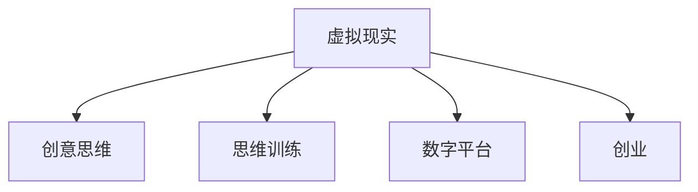

                 

# 虚拟现实创意思维训练创业：激发创新的数字平台

> 关键词：虚拟现实,创意思维,训练,创业,数字平台

## 1. 背景介绍

### 1.1 问题由来
随着技术的进步和社会的变迁，创新的重要性愈发凸显。在快速变化的市场环境中，企业需要不断推出创新产品以维持竞争力。然而，创新往往离不开创意思维的支撑。创意思维不仅是设计新产品、改进旧产品的关键，也是解决复杂问题的必要条件。因此，如何培养和训练创意思维，成为当前教育、企业和政府共同关注的焦点。

### 1.2 问题核心关键点
目前，尽管有许多方法可以帮助培养创意思维，但大多集中于传统的教育模式，如艺术课程、思维训练等，效果有限且成本较高。而随着虚拟现实（VR）技术的兴起，虚拟现实创意思维训练（Virtual Reality Creativity Training, VRCT）成为一种新兴且高效的解决方案。VRCT通过沉浸式虚拟环境，使受训者在模拟的真实场景中进行各种创新活动，从而有效激发创意思维。

## 2. 核心概念与联系

### 2.1 核心概念概述

为更好地理解VR创意思维训练的数字平台，本节将介绍几个密切相关的核心概念：

- 虚拟现实（Virtual Reality, VR）：通过计算机技术和头戴设备，创建逼真的三维虚拟环境，使使用者身临其境地进行体验。
- 创意思维（Creative Thinking）：一种灵活、独特、创新性的思维模式，通过各种创意活动培养和发展。
- 思维训练（Mind Training）：通过特定方法有目的地训练大脑，提升其分析、解决问题和创新能力。
- 数字平台（Digital Platform）：通过网络技术构建的虚拟空间，用户可以通过设备访问和使用，实现信息交互和功能服务。
- 创业（Entrepreneurship）：通过创新和创业精神，创造新的商业模式、产品和服务的过程。

这些核心概念之间的逻辑关系可以通过以下Mermaid流程图来展示：



这个流程图展示了大语言模型的核心概念及其之间的关系：

1. 虚拟现实技术提供沉浸式体验，帮助用户更深入地进行创意思维训练。
2. 创意思维训练通过虚拟环境中的创新活动，提升用户的思维灵活性和创新能力。
3. 数字平台作为实现VRCT的工具，提供丰富的交互式训练模块和任务。
4. 创业活动可以利用VRCT培养的创新能力，开发新产品和服务，推动商业创新。

这些概念共同构成了VR创意思维训练的数字平台的核心框架，为培养高水平创意思维提供了有力支持。

## 3. 核心算法原理 & 具体操作步骤
### 3.1 算法原理概述

VR创意思维训练的数字平台，主要通过虚拟现实技术模拟各种创新场景，并结合特定的思维训练算法，对用户的创意思维进行有针对性的培养。其核心思想是：

1. 利用虚拟现实技术的沉浸式体验，使受训者在虚拟环境中进行各种创新活动，从而激发其创意思维。
2. 通过算法设计的训练模块和任务，系统性地训练用户的创新思维能力，包括但不限于问题解决、逆向思维、侧向思维等。
3. 结合反馈机制，对用户的表现进行及时评估和调整，以优化训练效果。

具体来说，VR创意思维训练的算法原理可以分解为以下几个关键步骤：

1. 虚拟场景创建：根据不同的创新训练任务，设计并生成逼真的虚拟场景，使受训者能够沉浸其中进行创新活动。
2. 思维任务设计：设计多样化的创新任务，如设计新装置、解决复杂问题等，通过这些任务引导用户进行创意思维。
3. 思维训练算法：开发针对不同思维类型的训练算法，如问题解决算法、侧向思维算法等，帮助用户提升相应能力。
4. 反馈与评估：实时记录用户的表现，并通过算法对其进行评估，给出相应的反馈和建议，以指导后续训练。

### 3.2 算法步骤详解

以下是VR创意思维训练数字平台的核心算法步骤：

1. **虚拟场景创建**
   - 根据训练目标，设计虚拟场景的布局和元素，包括地形、物体、交互界面等。
   - 使用虚拟现实引擎（如Unity、Unreal Engine）和编程工具（如C#、C++）开发场景的交互逻辑。
   - 通过3D建模软件（如Blender、Maya）创建虚拟物体的三维模型，并进行材质、纹理等细节处理。
   - 将创建的虚拟场景导入VR平台，并进行性能优化，确保在设备上流畅运行。

2. **思维任务设计**
   - 确定思维训练的具体目标，如设计新装置、解决复杂问题等。
   - 设计创新的任务流程，包括任务起点、步骤、目标和评估标准。
   - 设计创新任务的界面和交互方式，使受训者能够自然地进行创新活动。
   - 确保任务难度适中，既不过于简单，又不至于无法完成，从而激发用户的创新潜能。

3. **思维训练算法**
   - 开发针对不同思维类型的训练算法，如问题解决算法、侧向思维算法、逆向思维算法等。
   - 结合心理学和认知科学的理论，设计具体的算法实现逻辑。
   - 通过用户行为数据和训练结果，不断调整和优化训练算法。
   - 开发适用于VR环境的训练算法，使其能够高效运行并在虚拟场景中进行操作。

4. **反馈与评估**
   - 实时记录用户在虚拟场景中的表现，包括操作、思考和创新结果。
   - 使用评估算法，对用户的创新结果进行量化评估，如新颖性、可行性、实用性等。
   - 根据评估结果，提供反馈和建议，帮助用户改进创新思路和行动。
   - 设计反馈机制，确保用户能够及时了解自己的表现和改进方向。

### 3.3 算法优缺点

VR创意思维训练的数字平台具有以下优点：

1. **沉浸式体验**：通过虚拟现实技术，提供高度沉浸式的训练环境，使受训者能够全身心地投入到创新活动中。
2. **多样化的任务**：设计多种类型的创新任务，能够全面培养用户的创意思维能力。
3. **高效性**：虚拟环境可以反复使用，节省训练成本和时间。
4. **可扩展性**：平台可以灵活扩展和更新，满足不同企业和用户的定制化需求。

同时，该方法也存在一定的局限性：

1. **设备成本高**：目前虚拟现实设备的购买和维护成本较高，可能会限制部分用户的参与。
2. **技术门槛高**：开发VR创意思维训练平台需要具备较强的技术实力，对开发人员的要求较高。
3. **虚拟环境的真实性问题**：虚拟环境虽然逼真，但可能缺乏真实场景中的复杂性和多样性。
4. **训练效果的长期性**：用户在虚拟环境中的表现可能与现实世界有所不同，训练效果需要进一步验证。

尽管存在这些局限性，但就目前而言，VR创意思维训练的数字平台仍是大规模培养创意思维的理想选择。未来相关研究的重点在于如何进一步降低技术门槛，提高设备的可负担性，优化虚拟环境的真实性，并验证训练效果的长期性。

### 3.4 算法应用领域

VR创意思维训练的数字平台，已在多个领域得到应用，主要包括：

1. **教育**：通过VR创意思维训练，帮助学生培养创新思维能力，提升学习效率和创新成果。
2. **企业培训**：为企业员工提供创新培训，培养团队创新能力，提升企业的创新力。
3. **政府创新**：为政府机构提供创新思维培训，激发公务员的创新能力，推动政府创新改革。
4. **创新创业**：通过VR创意思维训练，为创业者提供创新指导，提升创业成功率。
5. **军事训练**：为士兵和军事人员提供虚拟训练场景，提升其在复杂环境下的创新思维和决策能力。

除了上述这些常见应用领域外，VR创意思维训练的数字平台还在其他诸多领域展现出广泛的应用前景，如游戏开发、建筑设计、艺术创作等，为创新能力的培养提供了新的可能。

## 4. 数学模型和公式 & 详细讲解  
### 4.1 数学模型构建

本节将使用数学语言对VR创意思维训练的数字平台进行更加严格的刻画。

假设用户在进行创意思维训练时，在虚拟环境中的行为数据为 $x_i$，创新任务的目标评估为 $y_i$，其中 $i$ 表示第 $i$ 个任务。定义训练数据集 $D=\{(x_i, y_i)\}_{i=1}^N$，则VR创意思维训练的数学模型可以表示为：

$$
\min_{\theta} \sum_{i=1}^N L(x_i, y_i; \theta)
$$

其中，$L$ 为损失函数，用于衡量用户的行为数据 $x_i$ 和创新任务目标评估 $y_i$ 之间的差异。

### 4.2 公式推导过程

以下我们以设计新装置任务为例，推导VR创意思维训练的数学模型和损失函数。

假设用户的行为数据 $x_i$ 包括其在虚拟场景中的所有操作记录，如选取材料、进行设计、调试等。创新任务的目标评估 $y_i$ 包括创新装置的实用性、新颖性和可操作性等指标。则设计新装置任务的损失函数可以表示为：

$$
L(x_i, y_i; \theta) = \sum_{k=1}^K w_k L_k(x_i, y_i; \theta)
$$

其中 $K$ 表示创新装置设计任务的不同评估维度，$L_k$ 为第 $k$ 个维度的损失函数，$w_k$ 为第 $k$ 个维度的权重，$k=1,2,...,K$。

以创新装置的实用性为例，假设实用性评估指标包括设计成本、生产难度、操作便捷性等，则该维度的损失函数可以表示为：

$$
L_{cost}(x_i, y_i; \theta) = \sum_{j=1}^{M} \alpha_j ||x_i - y_i||
$$

其中 $M$ 表示设计成本的多个评估项，$\alpha_j$ 为第 $j$ 个评估项的权重，$x_i$ 和 $y_i$ 分别为用户的操作记录和创新装置设计任务的目标评估值。

将上述所有维度的损失函数累加，即可得到总损失函数 $L(x_i, y_i; \theta)$。

### 4.3 案例分析与讲解

以一个具体的VR创意思维训练项目为例：

项目目标：通过VR平台，培养用户的设计思维和创新能力，使其能够设计出具有创新性和实用性的新装置。

具体实现：

1. **虚拟场景创建**：设计一个工厂模拟环境，用户可以在虚拟工厂中选取材料、设计机械臂、进行装配调试等操作。
2. **思维任务设计**：用户需要设计一个新型的机械臂，使其能够在复杂环境中完成高精度装配任务。
3. **思维训练算法**：开发基于侧向思维的训练算法，引导用户从不同角度思考新装置的设计方案，提升创新能力。
4. **反馈与评估**：在虚拟工厂中实时记录用户的行为数据，评估其设计的新装置在实用性、新颖性等方面的表现，并提供改进建议。

## 5. 项目实践：代码实例和详细解释说明
### 5.1 开发环境搭建

在进行VR创意思维训练的数字平台开发前，我们需要准备好开发环境。以下是使用C#和Unity引擎开发环境的配置流程：

1. 安装Unity编辑器：从Unity官网下载并安装Unity编辑器，用于创建虚拟场景和交互逻辑。
2. 配置开发环境：在Visual Studio中新建Unity项目，配置C#开发环境，并导入所需的插件和库。
3. 准备VR设备：准备好VR头戴设备和控制器，用于体验虚拟场景和交互操作。

### 5.2 源代码详细实现

下面我们以设计新装置任务为例，给出使用Unity引擎和C#进行VR创意思维训练的数字平台开发实现。

首先，定义设计新装置任务的虚拟场景：

```csharp
using UnityEngine;
using UnityEngine.UI;

public class DesignTaskScene : MonoBehaviour
{
    public GameObject[] materials; // 用户选取的材料
    public GameObject[] tools; // 用户使用的工具
    public GameObject[] targets; // 用户设计的目标

    void Start()
    {
        // 初始化虚拟工厂场景
        InitializeFactory();
    }

    void Update()
    {
        // 记录用户的操作行为
        RecordBehavior();
    }

    void InitializeFactory()
    {
        // 初始化虚拟工厂
        // ...
    }

    void RecordBehavior()
    {
        // 记录用户的操作行为
        // ...
    }
}
```

然后，设计用户的行为数据记录和反馈系统：

```csharp
using UnityEngine;
using UnityEngine.UI;

public class BehaviorRecorder : MonoBehaviour
{
    public GameObject behaviorLog; // 用户行为记录日志

    void Update()
    {
        // 记录用户的操作行为
        RecordBehavior();
        // 生成用户行为记录日志
        GenerateBehaviorLog();
    }

    void RecordBehavior()
    {
        // 记录用户选取材料、使用工具、设计目标等操作
        // ...
    }

    void GenerateBehaviorLog()
    {
        // 生成用户行为记录日志
        // ...
    }
}
```

接着，设计虚拟装置的创新评估系统：

```csharp
using UnityEngine;
using UnityEngine.UI;

public class InnovationEvaluator : MonoBehaviour
{
    public GameObject innovationLog; // 用户创新评估日志

    void Update()
    {
        // 评估用户设计的创新装置
        EvaluateInnovation();
        // 生成用户创新评估日志
        GenerateInnovationLog();
    }

    void EvaluateInnovation()
    {
        // 评估用户设计的创新装置
        // ...
    }

    void GenerateInnovationLog()
    {
        // 生成用户创新评估日志
        // ...
    }
}
```

最后，启动训练流程并在虚拟工厂中评估：

```csharp
using UnityEngine;
using UnityEngine.UI;

public class TrainingManager : MonoBehaviour
{
    public GameObject factory; // 虚拟工厂场景

    void Start()
    {
        // 启动虚拟工厂场景
        factory.SetActive(true);
        // 启动用户行为记录系统
        behaviorRecorder.SetActive(true);
        // 启动用户创新评估系统
        innovationEvaluator.SetActive(true);
    }
}
```

以上就是使用Unity和C#进行VR创意思维训练数字平台开发的基本代码实现。可以看到，通过Unity引擎，开发者可以轻松实现各种虚拟场景和交互操作，并通过C#编写相应的行为记录和评估逻辑。

### 5.3 代码解读与分析

让我们再详细解读一下关键代码的实现细节：

**DesignTaskScene类**：
- `Start`方法：初始化虚拟工厂场景，准备用户进行设计。
- `Update`方法：记录用户的操作行为，并将其输出到日志文件中。

**BehaviorRecorder类**：
- `Start`方法：记录用户的操作行为。
- `Update`方法：生成用户的行为记录日志，记录每次设计操作的时间、操作类型等信息。

**InnovationEvaluator类**：
- `Start`方法：评估用户设计的创新装置，包括实用性、新颖性、可操作性等指标。
- `Update`方法：生成用户创新评估日志，记录每次设计的创新性得分。

**TrainingManager类**：
- `Start`方法：启动虚拟工厂场景、行为记录系统和创新评估系统，用户可以开始进行创新设计任务。

可以看到，通过Unity和C#的结合使用，开发者可以高效地构建VR创意思维训练的数字平台，为用户的创新活动提供支持。

当然，工业级的系统实现还需考虑更多因素，如用户的身份认证、行为数据的存储与分析、系统的安全性和稳定性等。但核心的VR创意思维训练逻辑基本与此类似。

## 6. 实际应用场景
### 6.1 教育培训

VR创意思维训练的数字平台，在教育培训领域具有广泛的应用前景。传统的教育模式以理论教学为主，忽视了对学生创新能力的培养。通过VR平台，可以提供沉浸式的学习体验，使学生能够在虚拟环境中进行各种创新活动，从而培养其创意思维。

具体而言，可以在学校设置VR创意思维训练室，让学生通过VR设备体验不同的创新任务，如设计新装置、解决复杂问题等。在虚拟环境中，学生可以更加自由地进行创新探索和实践，从而培养其创新能力和解决问题的能力。同时，通过VR平台的反馈系统，教师可以实时了解学生的表现，给予针对性的指导和建议，提升教学效果。

### 6.2 企业培训

VR创意思维训练的数字平台，同样适用于企业的创新培训。企业需要不断地推出新产品和服务，以保持竞争力。通过VR平台，员工可以在虚拟环境中进行各种创新活动，从而提升其创新能力和团队协作能力。

具体而言，企业可以提供虚拟工厂、虚拟办公室等场景，让员工通过VR设备体验不同的创新任务。在虚拟环境中，员工可以更加自由地进行创新探索和实践，从而培养其创新能力和解决问题的能力。同时，通过VR平台的反馈系统，企业可以实时了解员工的表现，给予针对性的指导和建议，提升培训效果。

### 6.3 政府创新

VR创意思维训练的数字平台，还可以应用于政府机构的创新培训。政府机构需要不断地推出新的政策和服务，以提高工作效率和公民满意度。通过VR平台，公务员可以在虚拟环境中进行各种创新活动，从而提升其创新能力和解决问题的能力。

具体而言，政府机构可以提供虚拟办公室、虚拟公共服务大厅等场景，让公务员通过VR设备体验不同的创新任务。在虚拟环境中，公务员可以更加自由地进行创新探索和实践，从而培养其创新能力和解决问题的能力。同时，通过VR平台的反馈系统，政府机构可以实时了解公务员的表现，给予针对性的指导和建议，提升培训效果。

### 6.4 未来应用展望

随着VR技术的不断进步和普及，VR创意思维训练的数字平台将在更多领域得到应用，为创新能力的培养提供新的可能。

在智慧医疗领域，可以通过VR平台进行医学知识的创新训练，提升医生的诊断能力和治疗创新能力，推动医疗技术的发展。

在智能制造领域，可以通过VR平台进行工业设备的创新设计，提升生产效率和产品质量，推动工业智能化的进程。

在航空航天领域，可以通过VR平台进行航天器设计和技术创新，提升航天器的性能和可靠性，推动航天科技的发展。

此外，在教育、娱乐、军事等领域，VR创意思维训练的数字平台也将展现出广泛的应用前景，为创新能力的培养提供新的手段。相信随着技术的不断进步和应用的深入，VR创意思维训练的数字平台将为人类社会的创新和发展带来深远的影响。

## 7. 工具和资源推荐
### 7.1 学习资源推荐

为了帮助开发者系统掌握VR创意思维训练的数字平台，这里推荐一些优质的学习资源：

1. Unity官方文档：Unity引擎的官方文档，提供了丰富的教程和示例，帮助开发者快速上手。
2. C#编程指南：C#语言的官方文档和教程，帮助开发者理解C#的基本语法和高级特性。
3. VR创意思维训练课程：Coursera、Udacity等在线教育平台提供的VR创意思维训练课程，帮助开发者学习相关理论和实践。
4. Unity Asset Store：Unity开发者社区，提供了丰富的VR创意思维训练插件和资源，方便开发者快速搭建平台。
5. VR创意思维训练论文：谷歌学术、arXiv等学术资源，提供了大量的VR创意思维训练论文，帮助开发者了解前沿研究。

通过对这些资源的学习实践，相信你一定能够快速掌握VR创意思维训练的数字平台，并用于解决实际的创新问题。

### 7.2 开发工具推荐

高效的开发离不开优秀的工具支持。以下是几款用于VR创意思维训练数字平台开发的常用工具：

1. Unity编辑器：由Unity公司开发，提供强大的3D游戏开发和VR应用开发能力，支持C#等脚本语言。
2. Blender：一款免费的3D建模软件，提供丰富的建模和渲染功能，支持多种3D格式输出。
3. Unreal Engine：由Epic Games开发，提供强大的游戏开发和VR应用开发能力，支持C++等脚本语言。
4. Maya：一款专业的3D建模软件，提供丰富的建模和动画功能，支持多种3D格式输出。
5. Substance Painter：一款专业的纹理绘制软件，提供丰富的纹理制作功能，支持多种材质类型。

合理利用这些工具，可以显著提升VR创意思维训练数字平台的开发效率，加快创新迭代的步伐。

### 7.3 相关论文推荐

VR创意思维训练的数字平台发展源于学界的持续研究。以下是几篇奠基性的相关论文，推荐阅读：

1. "Virtual Reality for Learning and Education: A Review"（虚拟现实在教育和培训中的应用综述）：分析了VR在教育和培训中的广泛应用，包括创意思维训练的潜力。
2. "The Future of VR in Education: A Survey"（VR在教育中的未来展望）：探讨了VR在教育中的最新发展和应用前景，包括创意思维训练的数字平台。
3. "Creating a Virtual Learning Environment for Creative Thinking"（构建虚拟学习环境以培养创意思维）：提出了一种基于VR的创意思维培养方法，并进行了实验验证。
4. "A Comparative Study of VR-Based Training for Creative Problem-Solving"（基于VR的创意思维训练比较研究）：比较了不同VR平台和训练方法的效果，为平台开发提供了参考。
5. "Virtual Reality for Innovation Training: A Review"（VR在创新培训中的应用综述）：分析了VR在企业创新培训中的应用，包括创意思维训练的潜力。

这些论文代表了大语言模型微调技术的发展脉络。通过学习这些前沿成果，可以帮助研究者把握学科前进方向，激发更多的创新灵感。

## 8. 总结：未来发展趋势与挑战
### 8.1 总结

本文对VR创意思维训练的数字平台进行了全面系统的介绍。首先阐述了VR创意思维训练的背景和意义，明确了VRCT在培养创新思维、提升创新能力方面的独特价值。其次，从原理到实践，详细讲解了VRCT的数字平台设计过程，给出了平台开发的完整代码实例。同时，本文还广泛探讨了VRCT平台在教育、企业培训、政府创新等多个领域的应用前景，展示了VRCT范式的广泛适用性。此外，本文精选了VRCT技术的各类学习资源，力求为开发者提供全方位的技术指引。

通过本文的系统梳理，可以看到，VR创意思维训练的数字平台正在成为创新教育的重要工具，显著提升了创意思维的培养效率和质量。未来，伴随VR技术的持续进步，VRCT平台将进一步拓展其在更多领域的应用，为人类社会的创新和发展提供新的手段。

### 8.2 未来发展趋势

展望未来，VR创意思维训练的数字平台将呈现以下几个发展趋势：

1. **沉浸式体验的提升**：随着VR技术的不断发展，虚拟环境的真实性和沉浸感将进一步提升，使用户能够更加自然地进行创新活动。
2. **个性化训练的实现**：通过数据分析和机器学习，对用户进行个性化训练，提升其创意思维能力。
3. **多领域应用的拓展**：VR创意思维训练的平台将拓展到更多领域，如医疗、制造、航天等，为各行业的创新能力培养提供支持。
4. **跨平台互通的实现**：通过标准化的数据和接口，实现不同平台之间的互通，提升系统的可扩展性和兼容性。
5. **混合现实技术的应用**：结合增强现实(AR)技术，实现虚拟环境与现实世界的融合，提升用户对真实场景的理解和感知。

以上趋势凸显了VR创意思维训练的数字平台的发展前景，为培养高水平创意思维提供了有力支持。这些方向的探索发展，必将进一步提升VR创意思维训练的效果，推动创新教育的普及和发展。

### 8.3 面临的挑战

尽管VR创意思维训练的数字平台已经取得了瞩目成就，但在迈向更加智能化、普适化应用的过程中，它仍面临着诸多挑战：

1. **技术门槛高**：开发VR创意思维训练平台需要具备较强的技术实力，对开发人员的要求较高。
2. **设备成本高**：目前VR设备的购买和维护成本较高，可能会限制部分用户的参与。
3. **虚拟环境的真实性问题**：虚拟环境虽然逼真，但可能缺乏真实场景中的复杂性和多样性。
4. **训练效果的长期性**：用户在虚拟环境中的表现可能与现实世界有所不同，训练效果需要进一步验证。
5. **数据隐私和安全**：用户在虚拟环境中的行为数据涉及隐私和安全问题，需要严格保护。

尽管存在这些挑战，但就目前而言，VR创意思维训练的数字平台仍是大规模培养创意思维的理想选择。未来相关研究的重点在于如何进一步降低技术门槛，提高设备的可负担性，优化虚拟环境的真实性，并验证训练效果的长期性。

### 8.4 研究展望

面对VR创意思维训练数字平台所面临的挑战，未来的研究需要在以下几个方面寻求新的突破：

1. **降低技术门槛**：开发易于使用的开发工具和平台，降低技术门槛，使更多开发者能够快速上手。
2. **提高设备的可负担性**：通过硬件升级和标准化，降低VR设备的成本，提高设备的可负担性。
3. **优化虚拟环境的真实性**：通过增强现实和混合现实技术，提升虚拟环境的真实性和多样性，使其更接近现实世界。
4. **验证训练效果的长期性**：通过长期跟踪和数据分析，验证VR创意思维训练的效果，并优化训练方法。
5. **保护用户数据隐私**：设计数据隐私保护机制，确保用户行为数据的安全和隐私。

这些研究方向的探索，必将引领VR创意思维训练数字平台迈向更高的台阶，为培养高水平创意思维提供新的手段。面向未来，VR创意思维训练数字平台还需要与其他人工智能技术进行更深入的融合，如知识表示、因果推理、强化学习等，多路径协同发力，共同推动创新教育的进步。只有勇于创新、敢于突破，才能不断拓展创新教育的内涵和外延，推动人类社会的创新和发展。

## 9. 附录：常见问题与解答

**Q1：VR创意思维训练是否适用于所有行业？**

A: VR创意思维训练的数字平台在大多数行业都有广泛的应用前景。特别是在需要频繁进行创新和创意活动的领域，如设计、研发、创意写作等，VR训练能够显著提升创意思维能力。但对于一些对实际物理环境依赖较强的行业，如建筑施工、医疗手术等，可能需要结合实际场景进行培训。

**Q2：如何选择合适的VR设备？**

A: 选择合适的VR设备需要考虑多个因素，包括设备类型、显示质量、舒适度、便携性等。目前主流的VR设备有HTC Vive、Oculus Rift、Sony PlayStation VR等。需要根据具体应用场景和预算选择合适的设备。

**Q3：VR创意思维训练的效果如何评估？**

A: 评估VR创意思维训练的效果可以从多个维度进行，包括创新性、实用性、可行性、新颖性等。通常可以通过用户行为数据、创新任务评分、专家评估等方式进行评估。同时，可以设计不同阶段的评估标准，进行长期跟踪和分析。

**Q4：VR创意思维训练的长期效果如何？**

A: 目前关于VR创意思维训练的长期效果研究较少。初步研究表明，通过系统的VR训练，用户的创意思维能力有所提升，但在实际应用中仍需进一步验证和优化。需要结合长期跟踪和数据分析，进一步验证VR创意思维训练的长期效果。

**Q5：如何保护用户在虚拟环境中的数据隐私？**

A: 保护用户在虚拟环境中的数据隐私是开发VR创意思维训练平台的重要问题。需要在平台设计和开发阶段，严格遵守数据隐私保护法规，如GDPR等。可以采用数据加密、匿名化处理、访问控制等技术手段，保护用户数据的安全和隐私。

这些问题的解答，帮助开发者更好地理解和应用VR创意思维训练的数字平台，为其在各行业中的推广提供了指导。随着VR技术的不断进步和应用的深入，VR创意思维训练的数字平台将在更多领域展现出广泛的应用前景，为培养高水平创意思维提供新的手段。

