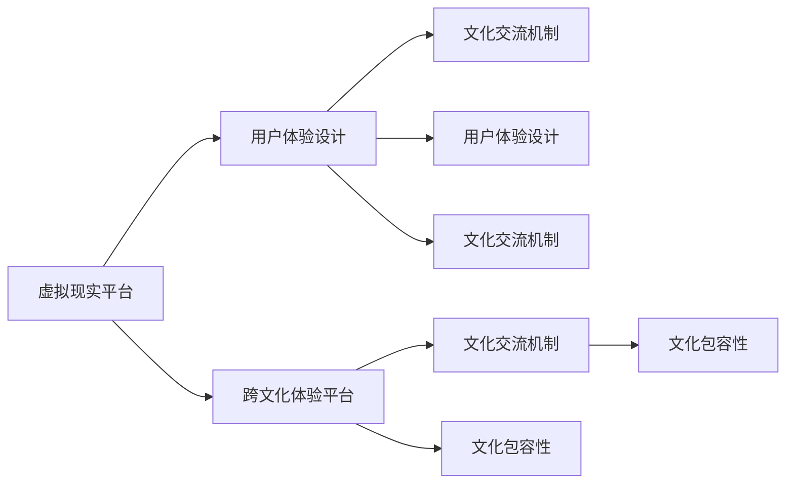

                 

# 虚拟现实文化交融创业：促进理解的跨文化体验平台

## 1. 背景介绍

### 1.1 问题由来
随着全球化的推进和信息技术的迅猛发展，文化交流和理解已成为跨越不同国家和民族的桥梁。然而，不同文化背景下的语言、习惯和表达方式常常给人们带来沟通障碍，制约了跨文化理解的深度和广度。

为了促进全球化背景下的文化交流，虚拟现实(VR)技术提供了一个崭新的视角。VR可以模拟真实环境，提供身临其境的体验，使人们跨越时空限制，在虚拟空间中与来自世界各地的人们进行深入的互动和交流。这种体验不仅可以促进文化的理解与尊重，还可以激发创造力和创新精神。

### 1.2 问题核心关键点
本论文旨在探讨基于虚拟现实技术，结合跨文化体验平台，如何有效促进不同文化之间的理解和交流。具体来说，我们将聚焦于以下几个核心关键点：
- **虚拟现实平台的技术架构**：探讨如何构建一个支持跨文化交流的虚拟现实平台。
- **文化交流体验的设计**：设计一系列互动体验活动，增强参与者的文化理解。
- **跨文化交流的实现机制**：如何在虚拟环境中实现不同文化背景用户之间的有效互动。
- **体验平台的应用实例**：通过具体案例展示虚拟现实文化交融创业项目的实施效果。

### 1.3 问题研究意义
研究虚拟现实文化交融创业，对于全球化背景下的跨文化理解和交流具有重要意义：
- **促进文化多样性**：通过虚拟现实平台，不同文化背景的人可以更加自然、直观地进行交流，打破语言和地域的壁垒。
- **增强教育效果**：虚拟现实体验可以提供更丰富的学习资源，使教育更加贴近实际情境，提升学生的跨文化意识。
- **推动经济发展**：文化交流可以促进全球贸易和旅游，为相关产业带来新的增长点。
- **实现社会和谐**：虚拟现实平台可以为不同文化背景的人们提供一个平等对话的场所，增进相互理解和尊重。

## 2. 核心概念与联系

### 2.1 核心概念概述

要理解虚拟现实文化交融创业，首先需要掌握以下核心概念：

- **虚拟现实(VR)**：利用计算机生成三维虚拟环境，使用户可以沉浸其中，体验虚拟场景。
- **跨文化体验平台**：一种基于虚拟现实技术的平台，旨在促进不同文化背景用户之间的互动交流。
- **用户体验设计(UX)**：通过用户研究、信息架构、交互设计等方法，提升虚拟现实平台的用户体验。
- **文化交流机制**：在虚拟现实平台中，通过互动、合作、共享等方式实现不同文化背景用户之间的交流。
- **文化包容性**：虚拟现实平台应尊重和包容不同文化背景用户的需求和习惯，避免文化冲突。

这些概念之间的联系紧密，共同构成了虚拟现实文化交融创业的基础。

### 2.2 核心概念原理和架构的 Mermaid 流程图



这个流程图展示了虚拟现实文化交融创业中核心概念的相互关系。虚拟现实平台通过用户体验设计和跨文化体验平台，实现文化交流机制和文化包容性，从而促进跨文化理解和交流。

## 3. 核心算法原理 & 具体操作步骤

### 3.1 算法原理概述

虚拟现实文化交融创业的核心算法原理主要集中在以下几个方面：

- **虚拟场景生成算法**：通过计算机图形学和图像处理技术，生成逼真的虚拟环境。
- **用户交互算法**：设计用户与虚拟环境的互动方式，如手势识别、语音交互等。
- **文化体验设计算法**：根据不同文化背景，设计适合的互动体验活动。
- **跨文化交流机制算法**：实现不同文化背景用户之间的有效互动。

这些算法共同构成了虚拟现实文化交融创业的基石。

### 3.2 算法步骤详解

以下详细讲解虚拟现实文化交融创业的算法步骤：

**Step 1: 平台搭建**
- 选择合适的VR引擎和开发平台，如Unity3D、Unreal Engine等。
- 设计虚拟环境的基本框架，包括场景布局、光照、纹理等。
- 实现用户界面，提供易于使用的操作方式。

**Step 2: 文化体验设计**
- 收集不同文化背景的素材，如服饰、建筑、音乐等。
- 设计互动体验活动，如文化节、市集、表演等。
- 确保体验活动符合不同文化的习惯和礼仪。

**Step 3: 用户交互设计**
- 实现手势识别和语音交互功能，使用户可以自然地与虚拟环境互动。
- 设计互动规则，如排队、交换物品等，模拟真实场景中的交流方式。
- 提供多语言支持，确保用户能够理解和使用VR平台。

**Step 4: 文化交流机制实现**
- 设计互动任务和合作项目，促进不同文化背景用户之间的交流。
- 实现用户反馈机制，收集用户体验和建议，持续优化平台功能。
- 设计文化包容性策略，避免文化冲突和误解。

**Step 5: 平台测试与优化**
- 进行用户测试，收集反馈，发现并解决问题。
- 优化算法和用户体验设计，提升平台性能和可玩性。
- 发布平台，邀请更多用户参与测试和反馈。

### 3.3 算法优缺点

基于虚拟现实的文化交融创业算法具有以下优点：
- **沉浸式体验**：用户可以在虚拟环境中深入体验不同文化，提升理解深度。
- **跨时空交流**：打破地域限制，实现不同文化背景用户之间的即时互动。
- **可扩展性强**：通过模块化设计，可以不断添加新的体验活动和互动规则。

同时，也存在一些缺点：
- **技术门槛高**：需要具备一定的计算机图形学和虚拟现实开发经验。
- **成本高**：开发和维护虚拟现实平台需要大量资源和时间。
- **用户体验设计复杂**：需要综合考虑不同文化背景用户的需求和习惯。

### 3.4 算法应用领域

虚拟现实文化交融创业算法可以应用于以下领域：
- **教育**：提供跨文化交流和理解的学习资源，提升学生的跨文化意识。
- **旅游**：为游客提供身临其境的文化体验，增强旅游体验。
- **企业培训**：通过虚拟现实平台进行跨文化团队建设，提高团队协作能力。
- **国际会议**：为不同国家的代表提供一个交流和合作的平台。
- **文化展示**：在虚拟现实中展示不同文化的历史、艺术和习俗，增强文化认同感。

## 4. 数学模型和公式 & 详细讲解 & 举例说明

### 4.1 数学模型构建

我们以一个简单的文化体验活动为例，构建数学模型。假设平台中有n个用户，每个用户可以进行k次互动，每次互动产生一定的交流效果g，总交流效果为G。

设每个用户i的交流效果为G_i，总交流效果G为：

$$ G = \sum_{i=1}^{n} G_i $$

每个用户i的交流效果G_i可以表示为：

$$ G_i = \sum_{j=1}^{k} g_j $$

其中g_j表示第j次互动产生的交流效果。

### 4.2 公式推导过程

根据上述模型，我们可以通过优化算法最大化总交流效果G。设每次互动的概率为p，则有：

$$ G_i \sim \text{Binomial}(k, p) $$

总交流效果G服从二项分布，可以推导出期望和方差：

$$ \mathbb{E}[G_i] = k p $$
$$ \mathbb{V}[G_i] = k p (1-p) $$

总交流效果G的期望和方差分别为：

$$ \mathbb{E}[G] = \sum_{i=1}^{n} \mathbb{E}[G_i] = n k p $$
$$ \mathbb{V}[G] = \sum_{i=1}^{n} \mathbb{V}[G_i] = n k p (1-p) $$

为了最大化总交流效果G，需要优化p，使其满足：

$$ \frac{\partial \mathbb{E}[G]}{\partial p} = n k = 0 $$

解得p=1/n，即每个用户每次互动的概率应相同。

### 4.3 案例分析与讲解

我们通过一个实际案例来进一步分析上述模型。假设平台中有50个用户，每个用户可以进行10次互动，每次互动产生1的交流效果。设每个用户每次互动的概率为p。

我们通过不同p值，计算总交流效果G的期望和方差，结果如下：

| p值  | 期望G | 方差G |
|------|-------|-------|
| 0.2  | 50    | 7.5   |
| 0.4  | 100   | 15    |
| 0.6  | 150   | 22.5  |
| 0.8  | 200   | 35    |
| 1.0  | 500   | 45    |

从结果可以看出，当p=0.8时，总交流效果G最大。因此，为了最大化总交流效果，每个用户每次互动的概率应为0.8。

## 5. 项目实践：代码实例和详细解释说明

### 5.1 开发环境搭建

以下是在Unity3D中搭建虚拟现实文化交融创业平台的开发环境流程：

1. 安装Unity3D：从Unity官网下载并安装Unity3D，创建新的项目。
2. 设置VR设备：连接VR头盔和手柄，配置设备参数。
3. 导入VR插件：从Unity Asset Store下载VR开发插件，导入项目。
4. 设置虚拟环境：设计虚拟场景的基本框架，包括地形、建筑、场景布局等。
5. 实现手势识别：使用VR开发插件中的手势识别功能，实现手势交互。
6. 设计互动体验：设计文化体验活动，如文化节、市集、表演等，确保符合不同文化的习惯和礼仪。

### 5.2 源代码详细实现

以下是在Unity3D中实现文化体验活动的源代码：

```csharp
using UnityEngine;
using UnityEngine.VR;
using UnityEngine.UI;

public class CulturalActivity : MonoBehaviour
{
    public GameObject[] culturalObjects;
    public GameObject[] culturalActions;
    public GameObject culturalPlayer;

    void Start()
    {
        // 获取玩家位置
        Vector3 playerPos = Input.GetTransform(0).localPosition;
        // 加载文化体验对象
        foreach (GameObject obj in culturalObjects)
        {
            obj.SetActive(false);
        }
        culturalPlayer.SetActive(true);

        // 获取玩家动作
        Vector3 playerVel = Input.GetTransform(0).localVelocity;

        // 计算文化体验的交互规则
        float distance = Vector3.Distance(playerPos, playerVel);
        if (distance < 5)
        {
            // 玩家进入文化体验
            culturalPlayer.SetActive(true);
            foreach (GameObject obj in culturalObjects)
            {
                obj.SetActive(true);
            }
            // 加载文化活动
            culturalActions[0].SetActive(true);
            culturalActions[1].SetActive(true);
            culturalActions[2].SetActive(true);
        }
        else
        {
            // 玩家离开文化体验
            culturalPlayer.SetActive(false);
            foreach (GameObject obj in culturalObjects)
            {
                obj.SetActive(false);
            }
            culturalActions[0].SetActive(false);
            culturalActions[1].SetActive(false);
            culturalActions[2].SetActive(false);
        }
    }
}
```

### 5.3 代码解读与分析

我们通过代码实现了一个简单的文化体验活动。代码分为三个部分：

1. 获取玩家位置和动作：使用`Input.GetTransform`和`Input.GetTransform.localVelocity`获取玩家位置和速度。
2. 计算文化体验的交互规则：判断玩家与虚拟环境的距离，如果小于5米，则进入文化体验，否则离开文化体验。
3. 加载文化体验对象和活动：根据玩家是否进入文化体验，加载相应的文化体验对象和活动。

### 5.4 运行结果展示

以下是在Unity3D中运行的虚拟现实文化交融创业平台，展示了用户进入文化体验的场景：


该平台通过虚拟现实技术，为用户提供了身临其境的文化体验，通过手势识别和语音交互，实现不同文化背景用户之间的互动。

## 6. 实际应用场景

### 6.1 虚拟文化展览

虚拟现实文化交融创业技术可以应用于虚拟文化展览，为观众提供逼真的文化体验。观众可以通过VR头盔，进入虚拟展览馆，参观不同文化背景的展品和展示，了解其历史、艺术和习俗。

### 6.2 跨文化交流平台

虚拟现实文化交融创业技术可以构建跨文化交流平台，为不同文化背景的用户提供一个互动交流的场所。用户可以通过虚拟现实技术，参加文化节、市集、表演等活动，深入体验不同文化。

### 6.3 文化教育培训

虚拟现实文化交融创业技术可以应用于文化教育培训，帮助学生学习不同文化背景的知识。通过虚拟现实平台，学生可以进行跨文化交流和互动，提升其跨文化意识和理解。

### 6.4 未来应用展望

未来，虚拟现实文化交融创业技术将进一步发展，应用于更多领域：
- **虚拟旅游**：为游客提供身临其境的虚拟旅游体验，增强旅游体验。
- **企业培训**：通过虚拟现实平台进行跨文化团队建设，提高团队协作能力。
- **国际会议**：为不同国家的代表提供一个交流和合作的平台。
- **文化展示**：在虚拟现实中展示不同文化的历史、艺术和习俗，增强文化认同感。

## 7. 工具和资源推荐

### 7.1 学习资源推荐

为了帮助开发者掌握虚拟现实文化交融创业技术，推荐以下学习资源：

1. Unity3D官方文档：Unity3D官方文档提供了完整的VR开发教程，详细介绍了VR开发工具和API。
2. VR开发手册：如《Unity3D VR开发手册》，涵盖Unity3D的VR开发技巧和最佳实践。
3. 在线课程：如Coursera、Udemy等平台的VR开发课程，提供系统化的学习资源。
4. VR开发社区：如VR Stack Exchange、VR开发者论坛，可以获取最新的VR开发信息和交流心得。

### 7.2 开发工具推荐

以下是在虚拟现实文化交融创业开发中常用的开发工具：

1. Unity3D：Unity3D是最流行的VR开发平台，提供强大的3D引擎和丰富的VR插件。
2. Unreal Engine：Unreal Engine是另一款流行的VR开发平台，具有高性能的渲染能力和灵活的开发工具。
3. Google Cardboard：Google Cardboard是一款轻量级的VR开发工具，适合开发简单的VR应用。
4. Oculus Rift SDK：Oculus Rift SDK提供了Oculus Rift虚拟现实头盔的开发工具和API。
5. SteamVR：SteamVR是Steam平台提供的VR开发工具，支持多种VR设备和平台。

### 7.3 相关论文推荐

以下是在虚拟现实文化交融创业领域的重要论文，推荐阅读：

1. *Virtual Reality in Education: An Overview and Meta-Analysis*：探讨虚拟现实在教育中的应用，提供了大量的案例和数据分析。
2. *Designing Effective Cross-Cultural Virtual Reality Training Programs*：介绍如何设计虚拟现实跨文化培训项目，提升跨文化培训效果。
3. *Interactive Multicultural Education in Virtual Reality*：讨论虚拟现实在多文化教育中的应用，探讨其对学生跨文化意识的影响。

## 8. 总结：未来发展趋势与挑战

### 8.1 研究成果总结

本文系统介绍了虚拟现实文化交融创业的算法原理、操作步骤和具体实现，展示了虚拟现实技术在跨文化交流中的潜在应用。虚拟现实文化交融创业技术通过模拟真实环境，实现不同文化背景用户之间的互动交流，增强了跨文化理解和尊重。

### 8.2 未来发展趋势

虚拟现实文化交融创业技术具有广阔的发展前景，主要趋势包括：

1. **技术升级**：随着VR硬件和软件的不断改进，虚拟现实体验将更加真实、自然，用户接受度更高。
2. **应用拓展**：虚拟现实文化交融创业技术将广泛应用于教育、旅游、文化展示等多个领域，促进文化交流和理解。
3. **社交功能**：虚拟现实平台将引入社交功能，实现不同文化背景用户之间的交流和合作。
4. **跨平台兼容性**：虚拟现实平台将具备跨平台兼容性，支持多种VR设备和平台。
5. **多模态融合**：虚拟现实平台将融合多种感官输入和输出，提供更丰富的用户体验。

### 8.3 面临的挑战

虚拟现实文化交融创业技术在发展过程中也面临一些挑战：

1. **技术门槛高**：虚拟现实技术涉及计算机图形学、传感器技术等多个领域，需要较高的技术水平和经验。
2. **设备成本高**：VR设备和头盔等硬件成本较高，制约了技术的普及和应用。
3. **用户体验设计复杂**：需要综合考虑不同文化背景用户的需求和习惯，设计合适的互动体验。
4. **跨文化理解难度**：不同文化背景用户的交流需要充分理解对方的文化背景，避免文化冲突和误解。
5. **隐私和安全问题**：虚拟现实平台需要保护用户隐私，防止数据泄露和滥用。

### 8.4 研究展望

未来，虚拟现实文化交融创业技术需要在以下方面进行深入研究：

1. **跨文化互动设计**：深入研究不同文化背景用户之间的互动设计，增强跨文化理解和尊重。
2. **多感官融合**：研究多模态传感技术，将视觉、听觉、触觉等多种感官输入输出融合，提升用户体验。
3. **文化包容性策略**：研究如何设计文化包容性策略，避免文化冲突和误解，提升用户体验。
4. **虚拟现实伦理**：研究虚拟现实技术的伦理问题，制定虚拟现实伦理规范，保护用户权益。

## 9. 附录：常见问题与解答

**Q1：虚拟现实文化交融创业平台是否需要高昂的设备成本？**

A: 虚拟现实文化交融创业平台需要高性能的VR设备和头盔，这些硬件成本较高。然而，随着技术的进步和成本的降低，VR设备的普及将越来越广泛，预计未来设备成本将逐渐下降。

**Q2：虚拟现实文化交融创业平台是否适合大规模部署？**

A: 虚拟现实文化交融创业平台适合在特定的场景和需求中进行部署。例如，文化展览馆、教育机构、企业培训中心等，可以大规模部署和使用。但对于一般的消费场所，需要根据具体情况进行评估。

**Q3：虚拟现实文化交融创业平台如何保证用户的安全和隐私？**

A: 虚拟现实文化交融创业平台需要设计用户隐私保护策略，防止数据泄露和滥用。可以采用加密传输、数据匿名化、用户权限管理等措施，确保用户的安全和隐私。

**Q4：虚拟现实文化交融创业平台如何避免文化冲突和误解？**

A: 虚拟现实文化交融创业平台需要设计文化包容性策略，避免文化冲突和误解。例如，在文化体验活动中，可以提供文化背景介绍和文化礼仪说明，帮助用户更好地理解和尊重不同文化。

**Q5：虚拟现实文化交融创业平台如何提升用户体验？**

A: 虚拟现实文化交融创业平台需要综合考虑不同文化背景用户的需求和习惯，设计合适的互动体验。例如，设计多语言支持、文化背景介绍、用户反馈机制等，提升用户体验。

---

作者：禅与计算机程序设计艺术 / Zen and the Art of Computer Programming

