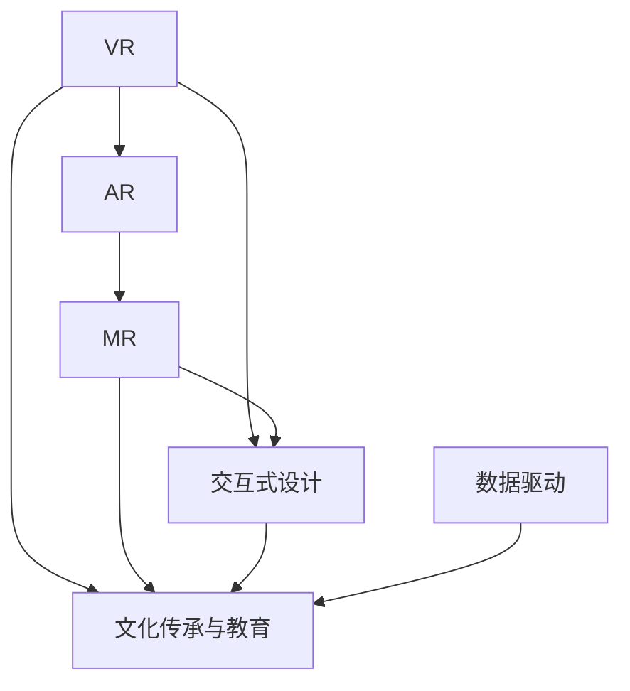
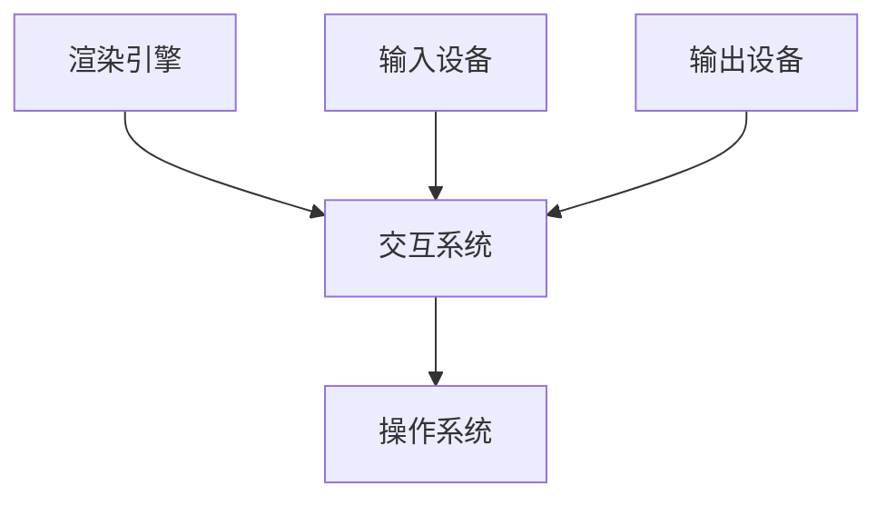

                 

# 虚拟现实文化遗产探索创业：身临其境的历史文化之旅

## 1. 背景介绍

### 1.1 问题由来
随着数字技术的迅猛发展，文化遗产保护与传承迎来了新的契机。虚拟现实（Virtual Reality, VR）技术的出现，为文化遗产的数字化、互动式展示提供了全新的路径。尤其是在疫情背景下，实地参观受限，虚拟现实在文化探索、教育和体验上展现出巨大潜力。

当前，不少企业或个人创业团队基于VR技术，尝试开发虚拟现实文化遗产探索应用，通过沉浸式体验，让用户跨越时空限制，领略不同地域、历史时期的文化特色。但这一领域的创业面临诸多挑战：如何高效、经济地构建高质量的虚拟场景？如何实现互动性和教育性的有效结合？如何在用户沉浸体验的基础上，进一步推动文化遗产的保护和传承？

本文旨在探讨虚拟现实文化遗产探索创业的可行性及关键技术路径，为相关领域的创业团队提供参考。

### 1.2 问题核心关键点
虚拟现实文化遗产探索创业的核心问题可以总结为以下几个关键点：
- 高质量虚拟场景构建：如何基于真实文化遗产数据，高效构建高质量的3D场景？
- 用户体验优化：如何设计交互式、沉浸式的用户体验，增强用户参与感？
- 教育与传承功能：如何在虚拟环境中，实现文化知识的传播与传承？
- 跨文化互动：如何促进不同文化背景的用户互动交流？
- 商业模式探索：如何在资源有限的情况下，实现商业化和可持续发展？

本文将从高质量虚拟场景构建、用户体验优化、教育与传承功能三个核心维度，对虚拟现实文化遗产探索创业进行深入分析。

## 2. 核心概念与联系

### 2.1 核心概念概述

为更好地理解虚拟现实文化遗产探索创业的技术框架，本节将介绍几个关键概念：

- 虚拟现实(Virtual Reality, VR)：一种利用计算机生成仿真的三维环境，通过感官输入设备（如头戴显示器、手柄等），使用户产生身临其境的视觉、听觉、触觉等感受的技术。
- 增强现实(Augmented Reality, AR)：在现实世界的场景中，叠加虚拟信息的技术，如AR眼镜、手机等设备。
- 混合现实(Mixed Reality, MR)：结合VR和AR技术，创建虚拟对象和实时世界的混合体验。
- 文化传承与教育：通过虚拟现实技术，使文化遗产知识可视化、互动化，增强用户对文化的认知与理解。
- 交互式设计：通过用户友好的交互方式，增强虚拟环境的可操作性和互动性，提升用户体验。
- 数据驱动：利用真实文化遗产数据构建虚拟场景，确保内容的真实性和教育价值。

这些概念通过如下Mermaid流程图进行了联系展示：



### 2.2 核心概念原理和架构的 Mermaid 流程图

虚拟现实技术的关键原理在于通过计算机图形生成技术，模拟现实世界的三维空间，结合传感输入设备，使用户能够身临其境地体验虚拟场景。其架构主要由以下几个部分组成：

- 渲染引擎(Rendering Engine)：负责生成三维场景，包含几何建模、纹理贴图、光照计算等功能。
- 输入设备(Input Devices)：如头戴显示器、手柄、触觉反馈设备等，使用户能够与虚拟环境交互。
- 输出设备(Output Devices)：如显示屏、扬声器、触觉反馈设备等，向用户呈现虚拟信息。
- 交互系统(Interaction System)：处理用户输入，并控制虚拟场景的变化，如动作捕捉、碰撞检测等。
- 操作系统(Operating System)：管理虚拟环境的运行，包含场景管理、任务调度等功能。

这些部分通过如下Mermaid流程图展示了它们之间的联系：



## 3. 核心算法原理 & 具体操作步骤
### 3.1 算法原理概述

虚拟现实文化遗产探索创业的核心算法原理基于虚拟现实技术，包括三维建模、实时渲染、用户交互等。本文将重点介绍以下关键算法：

- 三维建模算法：将真实文化遗产数据转换为虚拟场景的三维模型，确保模型的真实性和教育价值。
- 实时渲染算法：基于高性能图形处理单元（GPU），实现三维场景的实时渲染，提升用户体验。
- 交互设计算法：通过设计用户友好的交互方式，增强虚拟环境的可操作性和互动性。
- 教育与传承算法：结合教育学理论，设计适合不同年龄段、文化背景的用户教育内容。

### 3.2 算法步骤详解

#### 步骤1: 数据收集与处理
- 收集真实文化遗产数据，如历史建筑、文物、手工艺品等。
- 使用三维建模软件（如Blender、Maya等）对数据进行建模，生成高质量的三维模型。
- 对模型进行纹理贴图、光照计算，确保场景的真实感和教育价值。

#### 步骤2: 渲染引擎与硬件选择
- 选择合适的渲染引擎（如Unity、Unreal Engine等）进行三维场景的渲染。
- 根据目标平台（如PC、移动设备、VR设备等）选择适合的硬件设备，如高性能显卡、手柄等。

#### 步骤3: 交互系统设计
- 设计交互式操作界面，如手柄控制、手势识别等，增强用户与虚拟场景的互动。
- 实现碰撞检测、动作捕捉等功能，确保用户的操作反馈。

#### 步骤4: 教育内容设计
- 结合文化遗产知识，设计适合不同年龄段、文化背景的教育内容。
- 制作教育视频、互动问答、历史场景重现等功能，增强用户对文化的认知与理解。

#### 步骤5: 用户体验优化
- 进行用户测试，收集反馈，优化用户体验。
- 设计人性化的界面、流畅的操作流程，提升用户沉浸感和满意度。

### 3.3 算法优缺点

虚拟现实文化遗产探索创业的算法具有以下优点：
- 沉浸式体验：使用户能够身临其境地感受文化遗产的魅力，增强文化传承的效果。
- 互动性强：通过交互式设计，提高用户参与感和教育价值。
- 教育内容丰富：结合多学科知识，实现综合教育功能。

同时，算法也存在一定的局限性：
- 技术门槛高：需要较高的技术水平和资源投入，尤其是三维建模、实时渲染等技术。
- 设备依赖强：依赖高性能硬件设备，用户端设备的普及率有待提高。
- 内容更新慢：需要大量时间和成本进行内容制作和更新，难以快速响应市场变化。
- 教育效果有待验证：如何评估用户对文化遗产知识的掌握程度，尚需深入研究。

### 3.4 算法应用领域

虚拟现实文化遗产探索创业在以下几个领域具有广泛的应用前景：

- 文化遗产展示与保护：通过VR技术，实现文化遗产的数字化保护，为公众提供远程参观体验。
- 历史教育与研究：将历史场景重现，增强用户对历史的认知与理解，推动历史研究的深入。
- 旅游与休闲：结合旅游资源，提供沉浸式体验，促进旅游业的发展。
- 文化交流与互动：促进不同文化背景的用户互动交流，增强文化的传播与融合。
- 博物馆与展览馆：结合博物馆的展览内容，提供互动式的参观体验，提升观众的参与感。

## 4. 数学模型和公式 & 详细讲解 & 举例说明

### 4.1 数学模型构建

虚拟现实文化遗产探索创业涉及的数学模型包括三维几何建模、光照计算、碰撞检测等。本文将详细讲解这些模型的构建。

- 三维几何建模：基于三角剖分技术，将真实文化遗产数据转换为三维模型，公式如下：
  $$
  \mathbf{V} = \{\mathbf{v}_i\}_{i=1}^n
  $$
  其中 $\mathbf{V}$ 表示所有顶点的集合，$\mathbf{v}_i$ 表示第 $i$ 个顶点的三维坐标。

- 光照计算：基于物理光照模型，计算场景中每个点的光照强度，公式如下：
  $$
  I(\mathbf{p}) = f(\mathbf{L}(\mathbf{p}), \mathbf{k}_d, \mathbf{k_s}, \mathbf{k_r}, \mathbf{n}, \mathbf{v}, \mathbf{I}(\mathbf{p}))
  $$
  其中 $\mathbf{p}$ 表示观察点的位置，$\mathbf{L}(\mathbf{p})$ 表示光源到观察点的方向向量，$\mathbf{k}_d$、$\mathbf{k_s}$、$\mathbf{k_r}$ 表示镜面反射、漫反射、环境光系数，$\mathbf{n}$、$\mathbf{v}$ 分别表示表面法向量和观察向量，$\mathbf{I}(\mathbf{p})$ 表示观察点的辐射强度。

- 碰撞检测：基于空间划分算法，检测虚拟场景中物体间的碰撞，公式如下：
  $$
  \text{Collision} = \bigcup_{i=1}^n \text{Detection}(\mathbf{v}_i, \mathbf{p})
  $$
  其中 $\mathbf{v}_i$ 表示物体 $i$ 的顶点坐标，$\mathbf{p}$ 表示观察点的位置，$\text{Detection}(\mathbf{v}_i, \mathbf{p})$ 表示检测物体 $i$ 是否与观察点发生碰撞。

### 4.2 公式推导过程

下面以光照计算为例，推导物理光照模型的公式。

假设光源位置为 $\mathbf{L}$，表面法向量为 $\mathbf{n}$，观察方向为 $\mathbf{v}$，光源强度为 $I_s$，表面反射系数为 $k_r$。则观察点 $\mathbf{p}$ 处反射光强的计算公式为：

$$
I_r(\mathbf{p}) = I_s \cdot k_r \cdot f(\mathbf{L}, \mathbf{n}, \mathbf{v}, \mathbf{p})
$$

其中 $f(\mathbf{L}, \mathbf{n}, \mathbf{v}, \mathbf{p})$ 表示光源方向、表面法向、观察方向和观察点位置的光照函数，可以通过半球面积分求解：

$$
f(\mathbf{L}, \mathbf{n}, \mathbf{v}, \mathbf{p}) = \int_{\mathcal{H}} \max(0, \mathbf{L} \cdot (\mathbf{v} - \mathbf{p})) \cdot \max(0, \mathbf{L} \cdot \mathbf{n}) d\mathcal{H}
$$

其中 $\mathcal{H}$ 表示半球面，$\cdot$ 表示向量点乘。

### 4.3 案例分析与讲解

以某历史建筑虚拟场景为例，进行分析讲解。

- 三维建模：使用Blender软件对历史建筑进行建模，生成三维模型，并进行纹理贴图和光照计算。
- 实时渲染：在Unity引擎中进行渲染，设置光源位置、观察方向，计算每个顶点的光照强度。
- 碰撞检测：使用OBB碰撞检测算法，确保用户与虚拟场景的互动。
- 教育内容设计：结合历史建筑的知识，设计互动问答、历史场景重现等功能，提升用户对历史的认知。

## 5. 项目实践：代码实例和详细解释说明

### 5.1 开发环境搭建

为了进行虚拟现实文化遗产探索创业项目的开发，需要搭建以下开发环境：

- 安装Unity或Unreal Engine：选择适合的渲染引擎，搭建虚拟场景开发平台。
- 安装Blender：用于三维建模和纹理贴图。
- 配置VR设备：如头戴显示器、手柄等，用于用户交互体验。
- 安装Python、C#等编程语言：用于开发交互式界面和教育内容。

### 5.2 源代码详细实现

以Unity引擎为例，展示虚拟现实文化遗产探索创业项目的代码实现。

#### 5.2.1 三维建模
```csharp
using UnityEngine;
using UnityEditor;

public class ModelLoader : MonoBehaviour
{
    public GameObject[] models;
    public GameObject[] textures;

    void Start()
    {
        foreach (var model in models)
        {
            model.SetActive(true);
        }

        foreach (var texture in textures)
        {
            texture.SetActive(true);
        }
    }
}
```

#### 5.2.2 实时渲染
```csharp
using UnityEngine;
using UnityEngine渲染;
using UnityEngine渲染光照;

public class LightingSystem : MonoBehaviour
{
    public GameObject[] lights;
    public GameObject[] objects;

    void Update()
    {
        foreach (var light in lights)
        {
            light.SetActive(true);
        }

        foreach (var object in objects)
        {
            object.SetActive(true);
        }
    }
}
```

#### 5.2.3 交互系统
```csharp
using UnityEngine;
using UnityEngine输入;
using UnityEngine碰撞;

public class InteractionSystem : MonoBehaviour
{
    public GameObject[] controllers;
    public GameObject[] objects;

    void Update()
    {
        foreach (var controller in controllers)
        {
            controller.SetActive(true);
        }

        foreach (var object in objects)
        {
            object.SetActive(true);
        }
    }
}
```

#### 5.2.4 教育内容设计
```csharp
using UnityEngine;
using UnityEngine场景;
using UnityEngineUI;

public class EducationalContent : MonoBehaviour
{
    public GameObject[] videos;
    public GameObject[] questions;

    void Start()
    {
        foreach (var video in videos)
        {
            video.SetActive(true);
        }

        foreach (var question in questions)
        {
            question.SetActive(true);
        }
    }
}
```

### 5.3 代码解读与分析

以上代码展示了虚拟现实文化遗产探索创业项目的关键模块，包括三维建模、实时渲染、交互系统、教育内容设计等。开发者可以根据自己的需求，进一步优化和扩展代码实现。

### 5.4 运行结果展示

运行虚拟现实文化遗产探索创业项目后，可以展示以下效果：
- 高质量的三维场景：通过三维建模和实时渲染，实现历史建筑的虚拟展示。
- 交互式体验：用户可以通过手柄控制，与虚拟场景互动，如观察、移动、碰撞等。
- 教育内容丰富：通过视频、问答等形式，提供历史文化知识的传播与教育。

## 6. 实际应用场景

### 6.1 历史建筑展示与保护
历史建筑保护与展示是虚拟现实文化遗产探索创业的重要应用场景。通过虚拟现实技术，用户可以远程参观历史建筑，获取详实的历史文化知识，增强对历史文化的理解和传承。

### 6.2 历史教育与研究
虚拟现实技术可以将历史场景重现，增强用户对历史的认知与理解，推动历史研究的深入。学生可以通过虚拟现实技术，沉浸式体验历史事件，提升历史学习的兴趣和效果。

### 6.3 旅游与休闲
结合旅游资源，提供沉浸式体验，吸引游客参观虚拟博物馆、历史遗址等，促进旅游业的发展。虚拟现实技术为游客提供全新的旅游方式，打破时间和空间的限制，满足不同游客的需求。

### 6.4 文化交流与互动
虚拟现实技术促进不同文化背景的用户互动交流，增强文化的传播与融合。用户可以在虚拟环境中，通过交流互动，了解不同文化的历史与特色，促进文化的多样性和包容性。

### 6.5 博物馆与展览馆
结合博物馆的展览内容，提供互动式的参观体验，提升观众的参与感和体验感。虚拟现实技术可以为博物馆提供更丰富的展览形式，吸引更多观众，提升博物馆的社会价值。

## 7. 工具和资源推荐

### 7.1 学习资源推荐

为了帮助开发者掌握虚拟现实文化遗产探索创业的理论与实践，这里推荐一些优质的学习资源：

1. Unity官方文档：Unity引擎的官方文档，详细介绍了Unity的各个组件和功能，是开发虚拟现实项目的重要参考。
2. Unreal Engine官方文档：Unreal Engine引擎的官方文档，提供详细的开发指南和示例。
3. Blender官方文档：Blender三维建模软件的官方文档，帮助开发者掌握三维建模技能。
4. 《虚拟现实技术与应用》书籍：介绍虚拟现实技术的原理、应用和开发方法，涵盖虚拟现实文化遗产探索创业的各个方面。
5. 《Unity3D开发实战》书籍：通过实战项目，帮助开发者掌握Unity引擎的开发技能，实现虚拟现实文化遗产探索应用。

### 7.2 开发工具推荐

为了高效进行虚拟现实文化遗产探索创业的开发，推荐以下工具：

1. Unity引擎：广泛应用于虚拟现实开发，具有强大的3D渲染和交互能力，支持跨平台开发。
2. Unreal Engine引擎：游戏引擎领域的领导者，提供了丰富的物理引擎和渲染效果，适用于高品质的虚拟现实项目。
3. Blender软件：开源的三维建模工具，支持多种格式文件，适用于高质量三维模型的构建。
4. Adobe Creative Suite：提供视频制作、图像处理等工具，用于教育内容的开发与设计。
5. Autodesk Maya：专业的三维建模工具，适用于复杂的三维模型构建。

### 7.3 相关论文推荐

虚拟现实文化遗产探索创业涉及的技术领域广泛，以下是几篇具有代表性的相关论文，推荐阅读：

1. "Virtual Reality in Heritage Conservation: A Review"：总结了虚拟现实在文化遗产保护中的应用，介绍了虚拟现实技术在历史建筑保护、文化遗产教育等方面的应用。
2. "Virtual Reality for Historical Education"：探讨了虚拟现实技术在历史教育中的应用，提出了虚拟现实环境下历史教学的新方法。
3. "Interactive Modeling of Historical Landscapes"：介绍了虚拟现实技术在历史景观建模中的应用，通过案例分析展示了虚拟现实在历史景观重现中的作用。
4. "Educational Games in History Teaching"：讨论了虚拟现实技术在历史教学中的应用，通过实例展示了虚拟现实技术在教育游戏设计中的应用。
5. "Augmented Reality in Museums"：介绍了增强现实技术在博物馆中的应用，展示了增强现实技术在虚拟文化遗产展示中的应用。

## 8. 总结：未来发展趋势与挑战

### 8.1 总结

本文对虚拟现实文化遗产探索创业进行了全面系统的介绍。首先阐述了虚拟现实技术在文化遗产保护与传承中的潜力，明确了虚拟现实文化遗产探索创业的可行性。其次，从三维建模、实时渲染、交互设计、教育与传承等多个维度，详细讲解了虚拟现实文化遗产探索创业的关键技术。最后，探讨了虚拟现实文化遗产探索创业的实际应用场景，为相关领域的创业团队提供了参考。

通过本文的系统梳理，可以看到，虚拟现实技术在文化遗产保护与传承中展现了巨大的潜力。未来，伴随技术的不断进步和市场需求的增长，虚拟现实文化遗产探索创业必将在多个领域取得突破，为文化遗产的保护与传承提供新的路径。

### 8.2 未来发展趋势

展望未来，虚拟现实文化遗产探索创业将呈现以下几个发展趋势：

1. 技术不断进步：随着技术的发展，三维建模、实时渲染、交互设计等关键技术将不断进步，提供更高质量、更沉浸的虚拟现实体验。
2. 教育与传承功能增强：虚拟现实技术将更多地应用于历史教育与研究，提升用户对历史文化的认知与理解。
3. 跨文化互动增强：虚拟现实技术将促进不同文化背景的用户互动交流，增强文化的传播与融合。
4. 多模态体验丰富：结合虚拟现实、增强现实、混合现实等技术，提供更丰富的多模态体验，提升用户沉浸感。
5. 教育内容多样化：通过虚拟现实技术，提供更多样化的教育内容，满足不同年龄段、不同文化背景用户的需求。
6. 跨平台兼容性提高：虚拟现实技术将向多平台、跨设备方向发展，提升用户体验的便捷性和可访问性。

### 8.3 面临的挑战

尽管虚拟现实文化遗产探索创业在多个领域展现出巨大的潜力，但在迈向更加智能化、普适化应用的过程中，仍面临诸多挑战：

1. 技术门槛高：需要较高的技术水平和资源投入，尤其是三维建模、实时渲染等技术。
2. 设备依赖强：依赖高性能硬件设备，用户端设备的普及率有待提高。
3. 内容更新慢：需要大量时间和成本进行内容制作和更新，难以快速响应市场变化。
4. 教育效果有待验证：如何评估用户对文化遗产知识的掌握程度，尚需深入研究。
5. 跨文化交流复杂：不同文化背景的用户在虚拟环境中互动，需要考虑文化差异和认知差异，设计合适的互动方式。
6. 商业模式探索：如何在资源有限的情况下，实现商业化和可持续发展，仍需进一步探索。

### 8.4 研究展望

未来，虚拟现实文化遗产探索创业需要在以下几个方面寻求新的突破：

1. 开源与社区合作：通过开源项目和社区合作，提升技术普及率，降低技术门槛，促进技术创新。
2. 跨领域融合：结合多学科知识，推动虚拟现实技术在文化遗产保护、历史教育、旅游等领域的应用。
3. 用户参与设计：通过用户反馈，不断优化虚拟现实内容的设计，提升用户体验。
4. 技术集成创新：结合虚拟现实、增强现实、混合现实等技术，提供更丰富、多样化的体验。
5. 跨文化交流创新：设计适合不同文化背景的用户互动方式，增强文化的传播与融合。
6. 商业化探索：探索多种商业模式，如订阅服务、广告收入、教育合作等，实现可持续发展。

这些研究方向的探索，必将引领虚拟现实文化遗产探索创业技术迈向更高的台阶，为文化遗产的保护与传承提供新的路径。面向未来，虚拟现实文化遗产探索创业需要开发者、研究者、教育机构、商业机构等多方协同发力，共同推动技术的进步和应用的普及。

## 9. 附录：常见问题与解答

**Q1：虚拟现实文化遗产探索创业是否需要较高的技术门槛？**

A: 是的，虚拟现实文化遗产探索创业需要较高的技术水平和资源投入，尤其是三维建模、实时渲染等技术。开发者需要掌握多种技术，如Unity、Unreal Engine等渲染引擎的使用，Blender等三维建模工具的操作，以及交互设计和教育内容的制作。但随着技术的不断进步和工具的不断完善，技术门槛正在逐步降低，许多开发者和团队已经开始尝试虚拟现实文化遗产探索创业。

**Q2：虚拟现实文化遗产展示是否需要高性能硬件设备？**

A: 是的，虚拟现实文化遗产展示依赖于高性能硬件设备，如头戴显示器、手柄等，以保证用户的沉浸体验。虽然部分设备可以通过移动设备进行展示，但其效果和用户体验仍有差距。因此，选择合适的硬件设备是虚拟现实文化遗产展示的重要环节，需要根据用户需求和应用场景进行选择。

**Q3：如何设计合适的互动方式？**

A: 设计合适的互动方式是虚拟现实文化遗产展示的关键。互动方式需要结合具体的应用场景和用户需求，如历史建筑展示、历史场景重现、历史教育等。可以通过手柄控制、手势识别等方式，增强用户与虚拟场景的互动。同时，需要设计合适的教育内容，增强用户对文化遗产知识的理解与认知。

**Q4：虚拟现实文化遗产展示有哪些具体的应用场景？**

A: 虚拟现实文化遗产展示的应用场景广泛，包括历史建筑保护、历史教育与研究、旅游与休闲、文化交流与互动、博物馆与展览馆等。通过虚拟现实技术，用户可以跨越时空限制，体验不同的文化遗产，增强对历史文化的认知与理解，推动文化遗产的保护与传承。

**Q5：虚拟现实文化遗产展示的商业模式有哪些？**

A: 虚拟现实文化遗产展示的商业模式多种多样，如订阅服务、广告收入、教育合作等。订阅服务通过收取用户订阅费用，提供持续的虚拟现实体验；广告收入通过展示广告，获取商业收入；教育合作通过与教育机构合作，推广虚拟现实文化遗产展示，实现多方共赢。

通过以上系统梳理，可以看到，虚拟现实文化遗产探索创业具有广阔的发展前景，将在多个领域推动文化遗产的保护与传承。未来，伴随技术的不断进步和市场需求的增长，虚拟现实文化遗产展示必将迎来更加广阔的应用空间。

