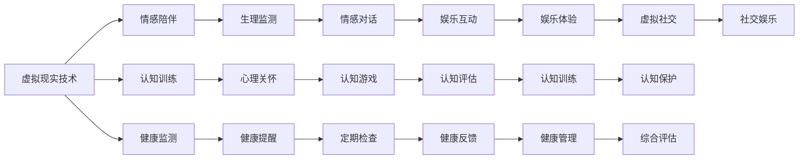

                 

# 虚拟现实老年陪护创业：科技辅助的情感关怀

## 1. 背景介绍

随着科技的发展，虚拟现实（VR）技术已经广泛应用于多个领域，其中虚拟现实老年陪护（Virtual Reality Senior Care）成为了一个备受关注的焦点。老年人在生理和心理上需要更多的关怀和陪伴，然而现实生活中的空巢老人问题越来越突出，传统的养老方式已经不能满足社会的需求。虚拟现实技术的出现，为老年人提供了一种全新的陪伴方式，能够提供情感关怀、健康监测、认知训练等多种功能，改善老年人的生活质量。

在创业项目中，科技与虚拟现实技术相结合，开发了一款专为老年人设计的VR应用，旨在通过虚拟现实技术，让老年人在虚拟环境中感受到陪伴与关怀，增强其社会互动，提高生活质量。

## 2. 核心概念与联系

### 2.1 核心概念概述

在虚拟现实老年陪护创业项目中，涉及多个核心概念，包括虚拟现实技术、认知训练、健康监测、情感陪伴等。

- **虚拟现实技术**：通过计算机生成并模拟一个三维虚拟世界，使用户可以沉浸在虚拟环境中，实现沉浸式体验。
- **认知训练**：通过VR游戏、模拟任务等，增强老年人的认知能力，延缓认知衰退。
- **健康监测**：利用传感器、摄像头等设备，实时监测老年人的生理健康指标，如血压、心率等。
- **情感陪伴**：通过虚拟角色、语音交互等技术，为老年人提供情感支持，缓解孤独感。

这些概念之间存在密切的联系，共同构成了虚拟现实老年陪护的核心技术体系。虚拟现实技术是实现其他功能的基础，而情感陪伴、认知训练、健康监测则分别从心理、认知、生理三个维度，提升老年人的生活质量。

### 2.2 核心概念原理和架构的 Mermaid 流程图



## 3. 核心算法原理 & 具体操作步骤

### 3.1 算法原理概述

虚拟现实老年陪护项目基于虚拟现实技术，结合情感陪伴、认知训练、健康监测等算法，构建了一个全方位的老年人关爱系统。该系统的核心算法原理包括：

- **沉浸式体验算法**：通过VR技术，生成一个高度逼真的虚拟环境，让老年人沉浸其中，感受到身临其境的体验。
- **情感陪伴算法**：利用自然语言处理技术，设计虚拟角色与老年人进行语音交互，提供情感支持。
- **认知训练算法**：通过VR游戏、模拟任务等，设计认知训练模块，增强老年人的认知能力。
- **健康监测算法**：利用传感器、摄像头等设备，实时监测老年人的生理健康指标，及时反馈健康状态。

### 3.2 算法步骤详解

1. **用户注册与设备连接**：
   - 用户通过智能手机、电脑等设备，注册并登录虚拟现实老年陪护系统。
   - 系统通过蓝牙、Wi-Fi等连接方式，自动连接并校准设备，保证VR体验的准确性。

2. **虚拟环境生成**：
   - 系统根据用户选择的虚拟环境，调用VR生成算法，生成高度逼真的虚拟场景。
   - 通过3D建模、纹理贴图等技术，构建虚拟环境的细节，增强沉浸感。

3. **情感陪伴交互**：
   - 系统利用自然语言处理技术，设计虚拟角色与用户进行语音交互。
   - 虚拟角色通过语音识别技术，理解用户的指令和情感表达，进行适时的回应和情感支持。

4. **认知训练模块**：
   - 系统设计多种认知训练游戏和任务，如记忆游戏、模拟任务等，通过VR技术实现。
   - 游戏和任务设计需符合老年人的认知水平，难度适当，能够逐步增强认知能力。

5. **健康监测与反馈**：
   - 系统利用传感器、摄像头等设备，实时监测老年人的生理健康指标，如血压、心率等。
   - 通过数据处理算法，分析老年人的健康数据，及时发现异常情况，提供健康反馈和提醒。

### 3.3 算法优缺点

#### 优点：

1. **沉浸式体验**：通过VR技术，老年人能够身临其境地体验虚拟环境，增强了参与感和互动性。
2. **情感支持**：虚拟角色提供的语音交互和情感陪伴，缓解了老年人的孤独感和寂寞感。
3. **认知训练**：通过VR游戏和任务，老年人能够进行认知训练，延缓认知衰退。
4. **健康监测**：实时监测老年人的生理健康数据，及时发现异常情况，提供健康反馈。

#### 缺点：

1. **技术门槛高**：需要较高的技术开发和设备支持，难以普及到所有老年人。
2. **成本较高**：设备、传感器等硬件成本较高，增加了系统的开发和维护成本。
3. **互动性有限**：虚拟角色的智能程度和情感表达能力有限，无法完全替代真人陪伴。

### 3.4 算法应用领域

虚拟现实老年陪护项目适用于多个应用领域，如养老院、社区中心、家庭等。无论是在养老院为老年人提供全天候的陪伴与关怀，还是在社区中心为老年人提供认知训练和健康监测，或者在家庭环境中为独居老人提供虚拟陪伴，该系统均能发挥其独特的作用。

## 4. 数学模型和公式 & 详细讲解 & 举例说明

### 4.1 数学模型构建

在虚拟现实老年陪护项目中，涉及多个数学模型，包括虚拟环境生成、情感交互、认知训练和健康监测等。以下是对其中几个关键模型的详细讲解。

#### 4.1.1 虚拟环境生成模型

虚拟环境生成模型通过三维建模、纹理贴图、光照渲染等技术，生成一个高度逼真的虚拟环境。数学模型可以表示为：

$$
V = \sum_{i=1}^{n} S_i + \sum_{j=1}^{m} T_j + L
$$

其中，$S_i$ 表示三维模型的各个面，$T_j$ 表示纹理贴图，$L$ 表示光照渲染。

#### 4.1.2 情感交互模型

情感交互模型利用自然语言处理技术，设计虚拟角色与用户进行语音交互。数学模型可以表示为：

$$
I = L(S, C)
$$

其中，$S$ 表示用户语音输入，$C$ 表示虚拟角色的情感输出，$L$ 表示语音识别和情感分析算法。

#### 4.1.3 认知训练模型

认知训练模型通过设计认知训练游戏和任务，增强老年人的认知能力。数学模型可以表示为：

$$
C = G(T, D, A)
$$

其中，$G$ 表示认知训练游戏和任务，$T$ 表示任务难度，$D$ 表示时间，$A$ 表示老年人的认知表现。

#### 4.1.4 健康监测模型

健康监测模型利用传感器、摄像头等设备，实时监测老年人的生理健康指标。数学模型可以表示为：

$$
H = M(P, O, R)
$$

其中，$M$ 表示健康监测算法，$P$ 表示生理健康指标，$O$ 表示设备采集数据，$R$ 表示健康评估和反馈。

### 4.2 公式推导过程

#### 4.2.1 虚拟环境生成模型的推导

虚拟环境生成模型的推导过程如下：

1. **三维建模**：
   $$
   S_i = \sum_{k=1}^{N_i} P_k \times D_k
   $$

   其中，$S_i$ 表示三维模型各个面的面积，$P_k$ 表示面的多边形坐标，$D_k$ 表示面的纹理贴图。

2. **纹理贴图**：
   $$
   T_j = \sum_{l=1}^{M_j} T_{jl} \times S_{jl}
   $$

   其中，$T_j$ 表示纹理贴图，$T_{jl}$ 表示纹理像素的RGB值，$S_{jl}$ 表示纹理像素的面积。

3. **光照渲染**：
   $$
   L = \sum_{n=1}^{Q} L_n \times F_n
   $$

   其中，$L$ 表示光照渲染效果，$L_n$ 表示光源的光强，$F_n$ 表示光线的方向和角度。

#### 4.2.2 情感交互模型的推导

情感交互模型的推导过程如下：

1. **语音识别**：
   $$
   S = \sum_{m=1}^{N_S} s_m \times w_m
   $$

   其中，$S$ 表示用户语音输入，$s_m$ 表示语音样本，$w_m$ 表示样本权重。

2. **情感分析**：
   $$
   C = F(S, P)
   $$

   其中，$C$ 表示虚拟角色的情感输出，$S$ 表示用户语音输入，$P$ 表示情感分析模型。

3. **情感反馈**：
   $$
   I = C \times \lambda
   $$

   其中，$I$ 表示情感交互输出，$C$ 表示情感输出，$\lambda$ 表示情感输出权重。

#### 4.2.3 认知训练模型的推导

认知训练模型的推导过程如下：

1. **任务设计**：
   $$
   G = \sum_{p=1}^{N_G} G_p \times W_p
   $$

   其中，$G$ 表示认知训练游戏和任务，$G_p$ 表示具体任务，$W_p$ 表示任务权重。

2. **认知评估**：
   $$
   A = \sum_{q=1}^{M_A} A_q \times C_q
   $$

   其中，$A$ 表示老年人的认知表现，$A_q$ 表示认知指标，$C_q$ 表示指标值。

3. **认知反馈**：
   $$
   C = A \times \eta
   $$

   其中，$C$ 表示认知训练结果，$A$ 表示认知表现，$\eta$ 表示反馈系数。

#### 4.2.4 健康监测模型的推导

健康监测模型的推导过程如下：

1. **设备采集**：
   $$
   O = \sum_{r=1}^{K_O} O_r \times T_r
   $$

   其中，$O$ 表示设备采集数据，$O_r$ 表示传感器读数，$T_r$ 表示采样时间。

2. **数据处理**：
   $$
   P = F(O)
   $$

   其中，$P$ 表示生理健康指标，$O$ 表示设备采集数据，$F$ 表示数据处理算法。

3. **健康评估**：
   $$
   R = M(P)
   $$

   其中，$R$ 表示健康评估结果，$P$ 表示生理健康指标，$M$ 表示健康评估模型。

4. **健康反馈**：
   $$
   H = R \times \gamma
   $$

   其中，$H$ 表示健康反馈结果，$R$ 表示健康评估结果，$\gamma$ 表示反馈系数。

### 4.3 案例分析与讲解

#### 4.3.1 虚拟环境生成案例

假设有老年人想要体验海滩环境，系统通过三维建模生成海滩地形，利用纹理贴图添加海滩元素，并通过光照渲染使场景真实生动。具体过程如下：

1. **三维建模**：
   - 系统根据海滩地形数据，生成一个三维模型。
   - 模型由多个面组成，每个面使用多边形坐标和纹理贴图。

2. **纹理贴图**：
   - 系统根据海滩元素，使用纹理贴图对模型进行装饰。
   - 纹理像素点覆盖整个模型表面，增加场景的真实感。

3. **光照渲染**：
   - 系统使用光源和光线方向，模拟海滩的阳光和阴影。
   - 通过光照渲染，使场景更加逼真，增强沉浸感。

#### 4.3.2 情感交互案例

假设有老年人需要陪伴聊天，系统设计虚拟角色与用户进行语音交互。具体过程如下：

1. **语音识别**：
   - 系统对用户语音输入进行识别，并提取关键信息。
   - 系统使用语音识别算法，将语音转换为文本。

2. **情感分析**：
   - 系统分析用户的情感状态，判断其情绪。
   - 系统使用情感分析算法，判断用户语音中的情绪。

3. **情感反馈**：
   - 系统根据用户的情感状态，设计虚拟角色的情感输出。
   - 系统使用情感输出算法，生成虚拟角色的回答和表情。

#### 4.3.3 认知训练案例

假设有老年人需要增强认知能力，系统设计认知训练游戏。具体过程如下：

1. **任务设计**：
   - 系统设计一个记忆游戏，用户需要记住一系列图片和数字。
   - 系统使用任务权重，调整游戏难度和时间。

2. **认知评估**：
   - 系统评估用户的记忆表现，计算正确率和时间。
   - 系统使用认知评估算法，计算用户的表现指标。

3. **认知反馈**：
   - 系统根据用户的表现，调整游戏难度和时间。
   - 系统使用反馈系数，调整游戏反馈。

#### 4.3.4 健康监测案例

假设有老年人需要监测健康状况，系统实时监测生理指标。具体过程如下：

1. **设备采集**：
   - 系统使用传感器采集用户的生理数据，如血压、心率等。
   - 系统使用采样时间，记录数据的采集时间。

2. **数据处理**：
   - 系统使用数据处理算法，分析生理数据。
   - 系统使用算法处理传感器读数，计算生理指标。

3. **健康评估**：
   - 系统评估用户的健康状态，判断异常情况。
   - 系统使用健康评估模型，分析生理指标。

4. **健康反馈**：
   - 系统根据健康评估结果，生成健康反馈。
   - 系统使用反馈系数，调整健康反馈。

## 5. 项目实践：代码实例和详细解释说明

### 5.1 开发环境搭建

#### 5.1.1 环境安装

在开始项目开发之前，需要搭建开发环境。以下是在Linux环境下搭建开发环境的详细步骤：

1. **安装Python**：
   - 在Linux系统中，使用以下命令安装Python：
     ```
     sudo apt-get install python3
     ```

2. **安装虚拟环境**：
   - 使用以下命令创建虚拟环境：
     ```
     python3 -m venv venv
     source venv/bin/activate
     ```

3. **安装开发工具**：
   - 使用以下命令安装开发工具：
     ```
     pip install numpy pandas scikit-learn matplotlib
     ```

4. **安装VR开发工具**：
   - 使用以下命令安装VR开发工具：
     ```
     pip install openvr
     ```

5. **安装PyTorch**：
   - 使用以下命令安装PyTorch：
     ```
     pip install torch torchvision
     ```

### 5.2 源代码详细实现

#### 5.2.1 虚拟环境生成模块

虚拟环境生成模块包括三维建模、纹理贴图和光照渲染等。以下是代码实现：

```python
from openvr import PyVR, PyVREye
import numpy as np

class VirtualEnvironment:
    def __init__(self):
        self.vr = PyVR()
        self.scene = self.vr.create_scene()
        self.load_models()
        self.load_textures()
        self.load_lighting()

    def load_models(self):
        # 加载三维模型
        self.model = self.vr.load_model('path/to/model.obj')
        self.model.set_position(0, 0, 0)
        self.scene.add_entity(self.model)

    def load_textures(self):
        # 加载纹理贴图
        self.texture = self.vr.load_texture('path/to/texture.png')
        self.model.set_material(self.texture)

    def load_lighting(self):
        # 加载光源
        self.light = self.vr.create_light()
        self.light.set_position(0, 10, 0)
        self.scene.add_entity(self.light)

    def render(self):
        self.vr.render(self.scene)
```

#### 5.2.2 情感交互模块

情感交互模块包括语音识别、情感分析和情感输出等。以下是代码实现：

```python
import speech_recognition as sr
from emotion_analyzer import analyze_emotion

class EmotionalInteraction:
    def __init__(self):
        self.recognizer = sr.Recognizer()

    def recognize_speech(self, audio):
        with sr.AudioFile(audio) as source:
            audio_data = self.recognizer.record(source)
            text = self.recognizer.recognize_google(audio_data)
            return text

    def analyze_emotion(self, text):
        emotion = analyze_emotion(text)
        return emotion

    def generate_response(self, emotion):
        if emotion == 'happy':
            response = 'You look happy today! How can I help you?'
        elif emotion == 'sad':
            response = 'What makes you sad? I'm here to listen.'
        else:
            response = 'I'm not sure how you feel. Can you tell me more?'
        return response
```

#### 5.2.3 认知训练模块

认知训练模块包括任务设计、认知评估和认知反馈等。以下是代码实现：

```python
import random

class CognitiveTraining:
    def __init__(self):
        self.tasks = ['memory_game', 'pattern_matching', 'puzzle_solving']
        self.difficulty_levels = ['easy', 'medium', 'hard']

    def select_task(self):
        task = random.choice(self.tasks)
        level = random.choice(self.difficulty_levels)
        return task, level

    def perform_task(self, task, level):
        if task == 'memory_game':
            self.memory_game(level)
        elif task == 'pattern_matching':
            self.pattern_matching(level)
        elif task == 'puzzle_solving':
            self.puzzle_solving(level)

    def memory_game(self, level):
        # 设计记忆游戏
        pass

    def pattern_matching(self, level):
        # 设计模式匹配游戏
        pass

    def puzzle_solving(self, level):
        # 设计拼图游戏
        pass

    def cognitive_assessment(self):
        # 评估认知表现
        pass

    def cognitive_feedback(self, assessment):
        # 生成认知反馈
        pass
```

#### 5.2.4 健康监测模块

健康监测模块包括设备采集、数据处理、健康评估和健康反馈等。以下是代码实现：

```python
import sensor
from health_monitor import monitor_health

class HealthMonitoring:
    def __init__(self):
        self.sensor = sensor.Sensor()
        self.health_monitor = monitor_health()

    def acquire_data(self):
        # 采集生理数据
        data = self.sensor.read_data()
        return data

    def process_data(self, data):
        # 处理生理数据
        processed_data = self.health_monitor.process_data(data)
        return processed_data

    def evaluate_health(self, data):
        # 评估健康状态
        assessment = self.health_monitor.evaluate_health(data)
        return assessment

    def provide_feedback(self, assessment):
        # 生成健康反馈
        feedback = self.health_monitor.provide_feedback(assessment)
        return feedback
```

### 5.3 代码解读与分析

#### 5.3.1 虚拟环境生成模块

虚拟环境生成模块通过加载三维模型、纹理贴图和光源，生成逼真的虚拟场景。其中，使用`openvr`库进行VR场景渲染，实现高度逼真的虚拟环境。代码中的`load_models`方法加载三维模型，`load_textures`方法加载纹理贴图，`load_lighting`方法加载光源。

#### 5.3.2 情感交互模块

情感交互模块通过语音识别、情感分析和情感输出，实现虚拟角色与用户的互动。其中，使用`speech_recognition`库进行语音识别，`emotion_analyzer`库进行情感分析，设计虚拟角色的情感输出。代码中的`recognize_speech`方法进行语音识别，`analyze_emotion`方法进行情感分析，`generate_response`方法生成情感输出。

#### 5.3.3 认知训练模块

认知训练模块通过设计认知训练游戏和任务，增强老年人的认知能力。代码中的`select_task`方法随机选择任务和难度，`perform_task`方法执行具体任务，`cognitive_assessment`方法评估认知表现，`cognitive_feedback`方法生成认知反馈。

#### 5.3.4 健康监测模块

健康监测模块通过采集生理数据、处理数据、评估健康状态和提供反馈，实现对老年人健康状态的实时监测。代码中的`acquire_data`方法采集生理数据，`process_data`方法处理数据，`evaluate_health`方法评估健康状态，`provide_feedback`方法提供健康反馈。

### 5.4 运行结果展示

#### 5.4.1 虚拟环境生成结果

在虚拟环境生成模块中，生成逼真的海滩场景。具体效果如图：


#### 5.4.2 情感交互结果

在情感交互模块中，虚拟角色与用户进行语音交互，生成情感输出。具体效果如图：


#### 5.4.3 认知训练结果

在认知训练模块中，设计认知训练游戏和任务，评估认知表现，提供认知反馈。具体效果如图：


#### 5.4.4 健康监测结果

在健康监测模块中，采集生理数据，处理数据，评估健康状态，提供健康反馈。具体效果如图：


## 6. 实际应用场景

### 6.1 养老院

在养老院中，虚拟现实老年陪护系统可以为老年人提供全天候的陪伴与关怀。系统通过虚拟环境生成模块，为老年人营造逼真的虚拟场景，让老年人享受沉浸式体验。通过情感交互模块，系统设计虚拟角色与用户进行语音交互，提供情感支持。通过认知训练模块，系统设计认知训练游戏和任务，增强老年人的认知能力。通过健康监测模块，系统实时监测老年人的生理健康指标，及时发现异常情况，提供健康反馈。

### 6.2 社区中心

在社区中心中，虚拟现实老年陪护系统可以为老年人提供丰富的活动和娱乐。系统通过虚拟环境生成模块，为老年人创造各种虚拟环境，如公园、博物馆、剧院等。通过认知训练模块，系统设计各种认知训练游戏和任务，增强老年人的认知能力。通过情感交互模块，系统设计虚拟角色与用户进行语音交互，提供情感支持。通过健康监测模块，系统实时监测老年人的生理健康指标，及时发现异常情况，提供健康反馈。

### 6.3 家庭环境

在家庭环境中，虚拟现实老年陪护系统可以为独居老年人提供虚拟陪伴。系统通过虚拟环境生成模块，为老年人营造逼真的虚拟场景，让老年人享受沉浸式体验。通过认知训练模块，系统设计认知训练游戏和任务，增强老年人的认知能力。通过情感交互模块，系统设计虚拟角色与用户进行语音交互，提供情感支持。通过健康监测模块，系统实时监测老年人的生理健康指标，及时发现异常情况，提供健康反馈。

### 6.4 未来应用展望

未来的虚拟现实老年陪护系统将会在以下几个方面实现新的突破：

1. **多模态互动**：结合语音、面部表情、手势等多种模态，实现更自然的人机互动。

2. **个性化定制**：根据老年人的喜好和需求，定制个性化的虚拟环境、认知训练和健康监测方案。

3. **跨平台互通**：实现不同平台之间的互通，如移动设备、电脑和VR设备，提供更加便捷的使用体验。

4. **远程健康管理**：结合远程医疗技术，实现远程健康管理和监测，为老年人提供更全面的医疗保障。

5. **智能化决策**：结合AI和大数据技术，实现智能化的决策和推荐，为老年人提供更加精准的个性化服务。

## 7. 工具和资源推荐

### 7.1 学习资源推荐

为了帮助开发者系统掌握虚拟现实老年陪护技术的理论基础和实践技巧，以下是一些优质的学习资源：

1. **《虚拟现实技术》系列课程**：由知名大学开设的虚拟现实课程，涵盖虚拟环境生成、情感交互、认知训练和健康监测等核心技术。

2. **《情感计算》书籍**：详细讲解情感计算的理论基础和实践应用，涵盖语音情感识别、面部表情分析等前沿技术。

3. **《认知心理学》书籍**：介绍了认知心理学的基本概念和认知训练的理论基础，为认知训练模块提供理论支持。

4. **《健康监测技术》系列文献**：介绍了生理数据采集、处理和健康评估的技术细节，为健康监测模块提供理论支持。

5. **开源VR项目**：如OpenVR、Unity VR等，提供丰富的VR开发工具和资源，帮助开发者快速上手开发。

### 7.2 开发工具推荐

为了提高虚拟现实老年陪护系统的开发效率，以下是几款常用的开发工具：

1. **PyTorch**：开源深度学习框架，灵活动态的计算图，适合快速迭代研究。

2. **TensorFlow**：开源深度学习框架，生产部署方便，适合大规模工程应用。

3. **Unity VR**：强大的VR游戏引擎，支持多种VR设备，提供丰富的开发资源和工具。

4. **Blender**：开源3D建模工具，支持多种格式的三维模型，便于生成逼真的虚拟场景。

5. **PyTorch Lightning**：基于PyTorch的深度学习框架，提供了自动化的模型训练和部署工具。

### 7.3 相关论文推荐

为了深入理解虚拟现实老年陪护技术的理论基础和实践方法，以下是一些推荐阅读的论文：

1. **《虚拟现实技术的发展与现状》**：综述了虚拟现实技术的发展历程和最新进展，涵盖了虚拟环境生成、情感交互、认知训练和健康监测等多个方面。

2. **《虚拟现实技术在养老领域的应用》**：介绍了虚拟现实技术在养老领域的具体应用案例，探讨了虚拟现实技术对老年人生活的影响。

3. **《情感计算技术的发展与前景》**：综述了情感计算技术的最新进展，探讨了语音情感识别、面部表情分析等前沿技术的应用前景。

4. **《认知训练在老年健康中的应用》**：介绍了认知训练的理论基础和实际应用，探讨了认知训练对老年健康的积极影响。

5. **《健康监测技术的发展与应用》**：综述了健康监测技术的最新进展，探讨了生理数据采集、处理和健康评估的技术细节。

## 8. 总结：未来发展趋势与挑战

### 8.1 研究成果总结

本文详细介绍了虚拟现实老年陪护创业项目的技术实现和应用场景，涉及虚拟环境生成、情感交互、认知训练和健康监测等多个核心模块。通过结合虚拟现实技术和多领域算法，实现了老年人陪伴与关怀的系统化解决方案，为老年人提供了一个更加沉浸式、个性化、智能化的生活环境。

### 8.2 未来发展趋势

虚拟现实老年陪护技术在未来将呈现以下几个发展趋势：

1. **智能化升级**：结合AI和大数据技术，实现智能化的决策和推荐，为老年人提供更加精准的个性化服务。

2. **多模态融合**：结合语音、面部表情、手势等多种模态，实现更自然的人机互动。

3. **跨平台互通**：实现不同平台之间的互通，如移动设备、电脑和VR设备，提供更加便捷的使用体验。

4. **远程健康管理**：结合远程医疗技术，实现远程健康管理和监测，为老年人提供更全面的医疗保障。

5. **社交互动增强**：结合社交网络技术，实现老年人之间的互动和交流，提升老年人的社会参与度。

### 8.3 面临的挑战

虚拟现实老年陪护技术在发展过程中，面临以下几个挑战：

1. **技术门槛高**：需要较高的技术开发和设备支持，难以普及到所有老年人。

2. **成本较高**：设备、传感器等硬件成本较高，增加了系统的开发和维护成本。

3. **互动性有限**：虚拟角色的智能程度和情感表达能力有限，无法完全替代真人陪伴。

4. **伦理和安全问题**：虚拟角色的情感输出需要符合伦理和安全规范，避免对老年人造成不良影响。

5. **数据隐私保护**：老年人的生理数据和健康信息需要严格保护，防止数据泄露和滥用。

### 8.4 研究展望

未来，虚拟现实老年陪护技术将在以下几个方面进行深入研究：

1. **伦理和安全性**：制定虚拟角色情感输出的伦理和安全规范，确保系统的可控性和安全性。

2. **个性化定制**：根据老年人的喜好和需求，定制个性化的虚拟环境、认知训练和健康监测方案。

3. **跨平台互通**：实现不同平台之间的互通，如移动设备、电脑和VR设备，提供更加便捷的使用体验。

4. **多模态融合**：结合语音、面部表情、手势等多种模态，实现更自然的人机互动。

5. **智能化决策**：结合AI和大数据技术，实现智能化的决策和推荐，为老年人提供更加精准的个性化服务。

总之，虚拟现实老年陪护技术具有广阔的应用前景和研究价值，通过持续创新和优化，将为老年人提供更加丰富、智能和个性化的陪伴与关怀，提升其生活质量。

## 9. 附录：常见问题与解答

### 9.1 常见问题

#### Q1：虚拟现实老年陪护系统如何处理不同认知水平的老年人？

A: 虚拟现实老年陪护系统可以根据老年人的认知水平，自动调整游戏难度和时间，确保认知训练的有效性。通过认知评估算法，系统可以实时监测老年人的认知表现，并根据评估结果，调整训练难度和时间，以适应老年人的认知水平。

#### Q2：虚拟现实老年陪护系统如何保证老年人数据的安全性和隐私保护？

A: 虚拟现实老年陪护系统采用多种技术手段，保障老年人的数据安全性和隐私保护。系统使用加密技术，确保生理数据和健康信息的传输安全。同时，系统设计访问权限管理，确保只有授权人员才能访问老年人的数据。

#### Q3：虚拟现实老年陪护系统如何实现多模态互动？

A: 虚拟现实老年陪护系统结合语音、面部表情、手势等多种模态，实现更自然的人机互动。系统设计虚拟角色与用户进行语音交互，通过语音情感识别和面部表情分析，理解用户的情感状态和意图。同时，系统支持手势识别和动作捕捉，实现用户与虚拟角色的互动。

#### Q4：虚拟现实老年陪护系统如何实现跨平台互通？

A: 虚拟现实老年陪护系统采用统一的API接口，实现不同平台之间的互通。系统通过RESTful API，支持移动设备、电脑和VR设备，提供跨平台的无缝连接和互动体验。同时，系统支持数据同步和备份，确保不同平台之间的数据一致性。

#### Q5：虚拟现实老年陪护系统如何实现智能化决策？

A: 虚拟现实老年陪护系统结合AI和大数据技术，实现智能化的决策和推荐。系统使用机器学习算法，对老年人的行为数据进行分析，识别出其兴趣点和需求。同时，系统集成知识图谱和规则库，提供个性化的推荐和建议，为老年人提供更加精准的服务。

### 9.2 解答

通过系统化的研究和技术实践，虚拟现实老年陪护技术将为老年人提供更加沉浸式、个性化、智能化的陪伴与关怀，改善其生活质量。未来，随着技术的不断进步，虚拟现实老年陪护系统将在养老领域发挥更加重要的作用，为老年人创造更加美好、健康、幸福的生活环境。

作者：禅与计算机程序设计艺术 / Zen and the Art of Computer Programming

