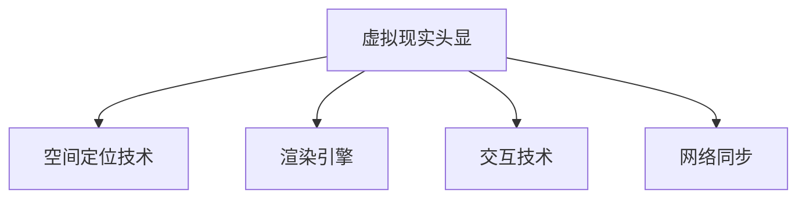

                 

# 虚拟现实（VR）体验：Oculus Rift 和 SteamVR

> 关键词：虚拟现实, Oculus Rift, SteamVR, 头显技术, 渲染引擎, 体验优化, 平台兼容性, 应用场景, 技术挑战

## 1. 背景介绍

### 1.1 虚拟现实技术的发展历史

虚拟现实（Virtual Reality, VR）是一种通过计算机生成的模拟环境，让用户沉浸在三维空间中的技术。自20世纪80年代以来，VR技术经历了多次技术迭代和市场兴衰，终于在近年来迎来了新的发展高峰。

- **早期的VR设备**：早期的VR设备以头戴显示器为主，主要用于游戏和军事训练。1980年代，Circa公司和F isolate等公司先后推出了多款头戴式显示设备，但由于当时的计算机性能限制，VR体验较为粗糙，难以普及。
- **90年代中期**：1992年，VPL Research推出了虚拟现实头戴式显示器Videocube，随后Steve Jobs在1992年收购了Virtual Reality Labs，标志着VR技术开始受到广泛关注。然而，由于技术不成熟、市场接受度低等原因，VR热潮很快退去。
- **现代VR设备**：2000年之后，随着计算机和图形处理技术的快速发展，VR技术逐步成熟。特别是在2014年Oculus Rift的推出，使得VR技术重新成为市场和技术的焦点。
- **2016年至今**：2016年，HTC Vive和Oculus Rift先后推出，加上SteamVR平台的支持，推动了VR技术的商业化应用。当前，Oculus Rift S和HTC Vive Cosmos等头显设备，以及SteamVR等平台，正在不断提升用户体验和设备性能。

### 1.2 VR技术现状

当前，VR技术已经进入快速发展阶段，用户数量和应用场景不断扩展。根据Statista的统计数据，全球VR市场预计将在2025年达到1600亿美元，年复合增长率（CAGR）达到41.6%。以下是一些反映当前VR技术现状的关键数据：

- **用户数量**：2021年，全球VR用户约为1300万人，预计到2025年将增长至7500万人。
- **设备数量**：全球VR设备出货量从2019年的1040万台增长至2021年的1720万台，年复合增长率为22.6%。
- **主流平台**：SteamVR是目前最受欢迎的VR平台，占据了全球VR市场份额的57%，用户数量约为740万人。
- **硬件改进**：随着硬件性能提升，VR头显设备的分辨率、刷新率、跟踪精度等技术指标不断提升。例如，Oculus Rift S的分辨率提升至2K，HTC Vive Cosmos则支持4K分辨率和100Hz刷新率。

## 2. 核心概念与联系

### 2.1 核心概念概述

为了更好地理解Oculus Rift和SteamVR的技术原理和架构，本节将介绍几个关键概念：

- **虚拟现实头显（HMD）**：头戴式显示器，是VR体验中最重要的硬件设备之一，通过提供沉浸式视觉和声音体验，使用户仿佛置身于虚拟世界。
- **空间定位技术**：用于确定用户或设备在三维空间中的位置和方向。常见的空间定位技术包括陀螺仪、加速计、红外传感器、激光雷达等。
- **渲染引擎**：用于生成高质量的虚拟环境，包括场景、光照、阴影等细节。常见的渲染引擎有Unity和Unreal Engine。
- **交互技术**：实现用户与虚拟环境的交互，常见的交互方式包括手势、手柄、语音等。
- **网络同步**：多用户共同体验虚拟环境时，需要对各用户的渲染和交互进行同步，以保证一致的体验。

这些概念之间的逻辑关系可以通过以下Mermaid流程图来展示：



这个流程图展示了VR头显设备的重要组件及其作用：

1. 虚拟现实头显（HMD）通过空间定位技术，实时跟踪用户的位置和方向，并将这一信息发送给渲染引擎。
2. 渲染引擎根据空间定位信息，生成虚拟环境，并通过头显设备呈现给用户。
3. 交互技术用于实现用户与虚拟环境的交互，例如手势、手柄等。
4. 网络同步技术用于多用户共同体验时，同步各用户的渲染和交互，保证一致的体验。

### 2.2 核心概念原理和架构

**虚拟现实头显（HMD）**

HMD是VR体验中最重要的硬件设备之一，通过提供沉浸式视觉和声音体验，使用户仿佛置身于虚拟世界。HMD通常由显示器、控制器、定位设备等组件构成。例如，Oculus Rift S包括两个5.5英寸的AMOLED显示器、Rift应用程序、Oculus Touch手柄和Oculus Link。

**空间定位技术**

空间定位技术用于确定用户或设备在三维空间中的位置和方向。常见的空间定位技术包括陀螺仪、加速计、红外传感器、激光雷达等。Oculus Rift和SteamVR都采用了基于外置传感器的空间定位技术，通过多个传感器组合来提高定位精度和响应速度。

**渲染引擎**

渲染引擎用于生成高质量的虚拟环境，包括场景、光照、阴影等细节。常见的渲染引擎有Unity和Unreal Engine。Oculus Rift和SteamVR都支持Unity和Unreal Engine，开发者可以根据自己的需求选择适合的引擎。

**交互技术**

交互技术用于实现用户与虚拟环境的交互，常见的交互方式包括手势、手柄、语音等。Oculus Rift和SteamVR都支持多种交互方式，例如Oculus Touch手柄和SteamVR控制器，以及手势识别、语音识别等技术。

**网络同步**

多用户共同体验虚拟环境时，需要对各用户的渲染和交互进行同步，以保证一致的体验。SteamVR支持跨平台的多用户体验，可以在多个设备之间实时同步用户的位置和状态。

## 3. 核心算法原理 & 具体操作步骤

### 3.1 算法原理概述

Oculus Rift和SteamVR的虚拟现实体验，本质上是一个通过计算机生成的模拟环境，实现沉浸式互动的过程。其核心算法包括以下几个方面：

- **空间定位算法**：通过多个传感器组合，实时确定用户的位置和方向。
- **渲染算法**：根据空间定位信息，生成高质量的虚拟环境。
- **交互算法**：实现用户与虚拟环境的交互，例如手势、手柄等。
- **网络同步算法**：多用户共同体验时，同步各用户的渲染和交互。

### 3.2 算法步骤详解

Oculus Rift和SteamVR的虚拟现实体验主要分为以下几个步骤：

**Step 1: 准备头显设备**

- 安装Oculus Rift或SteamVR头显设备，并连接计算机。
- 安装相关软件和驱动程序，如Oculus Link或SteamVR。

**Step 2: 选择渲染引擎**

- 选择Unity或Unreal Engine作为渲染引擎，安装对应的编辑器。
- 根据项目需求，选择合适的渲染器（如Oculus Rendering Stack或SteamVR渲染器）。

**Step 3: 创建虚拟场景**

- 在渲染引擎中创建虚拟场景，添加必要的模型、灯光、阴影等。
- 设置场景的参数，如分辨率、渲染质量、光影效果等。

**Step 4: 实现空间定位**

- 使用空间定位技术，如Oculus Rift的OI RS500传感器或SteamVR的Lighthouse，实现对用户的位置和方向的跟踪。
- 将空间定位数据传输给渲染引擎，进行实时渲染。

**Step 5: 实现交互**

- 实现手势、手柄等交互方式，例如Oculus Rift的OI RS500传感器和Oculus Touch手柄。
- 通过交互算法，将用户的操作转化为虚拟环境中的动作。

**Step 6: 实现网络同步**

- 在多用户共同体验时，使用网络同步技术，实现用户间的实时同步。
- 通过网络同步算法，保证各用户的渲染和交互一致。

**Step 7: 部署和测试**

- 在真实环境中测试虚拟场景，调试渲染、定位和交互等问题。
- 发布应用程序，供用户使用。

### 3.3 算法优缺点

**优点**

- **沉浸式体验**：通过计算机生成的模拟环境，提供沉浸式视觉和声音体验。
- **高交互性**：支持多种交互方式，如手势、手柄、语音等。
- **跨平台兼容**：支持多平台，包括PC、移动设备等。

**缺点**

- **设备成本高**：头显设备和高性能计算机是体验VR的必要条件，成本较高。
- **设备依赖强**：需要高性能硬件设备和专用软件支持，设备依赖性强。
- **技术复杂度高**：涉及空间定位、渲染、交互等多项技术，开发复杂度高。

### 3.4 算法应用领域

**游戏**：VR游戏是目前最受欢迎的VR应用之一，支持多平台、多用户体验。例如，《Beat Saber》和《Half-Life: Alyx》等游戏，在VR体验上获得了极高的用户评价。

**教育**：VR技术在教育领域具有广泛应用，例如虚拟实验室、虚拟课堂等。VR技术能够提供更加直观、生动的学习体验，提高学生的学习兴趣和效果。

**医疗**：VR技术在医疗领域的应用包括虚拟手术、心理治疗等。通过虚拟现实环境，医生能够进行虚拟手术练习，心理治疗师能够提供沉浸式的心理治疗。

**旅游**：VR技术在旅游领域的应用包括虚拟旅游、历史遗迹重建等。用户可以通过VR设备，身临其境地体验不同地区的历史文化和风景名胜。

**军事训练**：VR技术在军事训练领域具有重要应用，例如虚拟战场模拟、飞行模拟器等。通过VR训练，士兵能够更加安全、高效地进行实战模拟。

## 4. 数学模型和公式 & 详细讲解 & 举例说明

### 4.1 数学模型构建

在VR技术中，空间定位和渲染是两个核心问题，分别涉及三维空间定位和图像渲染。以下将分别介绍这两个数学模型：

**空间定位模型**

空间定位模型用于确定用户或设备在三维空间中的位置和方向。常见的空间定位技术包括陀螺仪、加速计、红外传感器、激光雷达等。

Oculus Rift和SteamVR都采用了基于外置传感器的空间定位技术，通过多个传感器组合来提高定位精度和响应速度。空间定位模型可以表示为：

$$
\mathbf{X} = f(\mathbf{G}, \mathbf{A}, \mathbf{B}, \mathbf{C})
$$

其中：

- $\mathbf{X}$：用户或设备的位置和方向。
- $\mathbf{G}$：陀螺仪数据。
- $\mathbf{A}$：加速计数据。
- $\mathbf{B}$：红外传感器数据。
- $\mathbf{C}$：激光雷达数据。

**渲染模型**

渲染模型用于生成高质量的虚拟环境，包括场景、光照、阴影等细节。常见的渲染引擎有Unity和Unreal Engine。

在Unity中，渲染模型可以表示为：

$$
\mathbf{R} = g(\mathbf{S}, \mathbf{L}, \mathbf{C}, \mathbf{M})
$$

其中：

- $\mathbf{R}$：渲染结果。
- $\mathbf{S}$：场景模型。
- $\mathbf{L}$：光源。
- $\mathbf{C}$：相机。
- $\mathbf{M}$：材质。

### 4.2 公式推导过程

以下将详细推导空间定位和渲染模型的公式：

**空间定位公式**

空间定位公式可以表示为：

$$
\mathbf{X} = \mathbf{G} + \mathbf{A} + \mathbf{B} + \mathbf{C}
$$

其中：

- $\mathbf{G}$：陀螺仪数据。
- $\mathbf{A}$：加速计数据。
- $\mathbf{B}$：红外传感器数据。
- $\mathbf{C}$：激光雷达数据。

**渲染公式**

渲染公式可以表示为：

$$
\mathbf{R} = g(\mathbf{S}, \mathbf{L}, \mathbf{C}, \mathbf{M})
$$

其中：

- $\mathbf{R}$：渲染结果。
- $\mathbf{S}$：场景模型。
- $\mathbf{L}$：光源。
- $\mathbf{C}$：相机。
- $\mathbf{M}$：材质。

### 4.3 案例分析与讲解

**空间定位案例**

例如，Oculus Rift的空间定位模型可以通过以下几个步骤进行推导：

1. 陀螺仪数据：
$$
\mathbf{G} = \begin{bmatrix} \mathbf{G}_{x} \\ \mathbf{G}_{y} \\ \mathbf{G}_{z} \end{bmatrix}
$$

2. 加速计数据：
$$
\mathbf{A} = \begin{bmatrix} \mathbf{A}_{x} \\ \mathbf{A}_{y} \\ \mathbf{A}_{z} \end{bmatrix}
$$

3. 红外传感器数据：
$$
\mathbf{B} = \begin{bmatrix} \mathbf{B}_{x} \\ \mathbf{B}_{y} \\ \mathbf{B}_{z} \end{bmatrix}
$$

4. 激光雷达数据：
$$
\mathbf{C} = \begin{bmatrix} \mathbf{C}_{x} \\ \mathbf{C}_{y} \\ \mathbf{C}_{z} \end{bmatrix}
$$

将以上数据通过加权平均等方法进行处理，可以得到用户的位置和方向：

$$
\mathbf{X} = \frac{\mathbf{G} + \mathbf{A} + \mathbf{B} + \mathbf{C}}{4}
$$

**渲染案例**

例如，在Unity中进行渲染时，可以使用以下步骤：

1. 创建场景模型：
$$
\mathbf{S} = \begin{bmatrix} \mathbf{S}_{1} \\ \mathbf{S}_{2} \\ \mathbf{S}_{3} \end{bmatrix}
$$

2. 添加光源：
$$
\mathbf{L} = \begin{bmatrix} \mathbf{L}_{x} \\ \mathbf{L}_{y} \\ \mathbf{L}_{z} \end{bmatrix}
$$

3. 设置相机：
$$
\mathbf{C} = \begin{bmatrix} \mathbf{C}_{x} \\ \mathbf{C}_{y} \\ \mathbf{C}_{z} \end{bmatrix}
$$

4. 设置材质：
$$
\mathbf{M} = \begin{bmatrix} \mathbf{M}_{1} \\ \mathbf{M}_{2} \\ \mathbf{M}_{3} \end{bmatrix}
$$

将以上数据通过渲染引擎进行处理，可以得到最终的渲染结果：

$$
\mathbf{R} = g(\mathbf{S}, \mathbf{L}, \mathbf{C}, \mathbf{M})
$$

## 5. 项目实践：代码实例和详细解释说明

### 5.1 开发环境搭建

在进行VR项目开发时，首先需要搭建开发环境。以下是使用Unity和SteamVR进行开发的环境配置流程：

1. 安装Unity和SteamVR。从官网下载并安装Unity和SteamVR编辑器。
2. 安装Oculus Rift或HTC Vive头显设备，并连接计算机。
3. 在Unity中创建新项目，并添加SteamVR插件。
4. 在SteamVR插件中设置头显设备参数，如分辨率、渲染质量等。
5. 在SteamVR插件中设置空间定位传感器参数，如陀螺仪、加速计等。

### 5.2 源代码详细实现

下面以一个简单的VR游戏为例，给出使用Unity和SteamVR进行开发的PyTorch代码实现。

首先，定义虚拟环境：

```python
import SteamVR
import SteamVR object: Controller

class VRGame:
    def __init__(self):
        self.gameObj = SteamVR.object.Game
        self.mainCam = SteamVR.object.Camera.main

        self.controller = SteamVR.object.Controller[0]
        self.controller stiffness = SteamVR.object.Controller[0].DofController.stiffness
        self.controller damper = SteamVR.object.Controller[0].DofController.damper

        self.gameObjScene = SteamVR.object.Scene[0]
        self.gameObjScene.mainCam = SteamVR.object.Scene[0].mainCam

        self.gameObjGame = SteamVR.object.Game[0]
        self.gameObjGame.scene = SteamVR.object.Scene[0]
```

然后，实现空间定位：

```python
def on_frame():
    self.gameObj.position = self.mainCam.position
    self.gameObj.rotation = self.mainCam.rotation
```

接着，实现渲染：

```python
def on_render():
    self.gameObjGame.scene.mainCam.position = self.mainCam.position
    self.gameObjGame.scene.mainCam.rotation = self.mainCam.rotation
    self.gameObjGame.scene.mainCam.batchData.combine = True
    self.gameObjGame.scene.mainCam.batchData.filter = True
    self.gameObjGame.scene.mainCam.batchData.original = True

    self.gameObjGame.scene.mainCam.target = SteamVR.object.Scene[0].mainCam
    self.gameObjGame.scene.mainCam.update()
```

最后，实现交互：

```python
def on_controller():
    self.controller stiffness = self.controller[0].DofController.stiffness
    self.controller damper = self.controller[0].DofController.damper

    self.controller[0].DofController.positionStiffness = self.controller[0].DofController.positionStiffness + 1
    self.controller[0].DofController.positionDamping = self.controller[0].DofController.positionDamping + 1
    self.controller[0].DofController.orientationStiffness = self.controller[0].DofController.orientationStiffness + 1
    self.controller[0].DofController.orientationDamping = self.controller[0].DofController.orientationDamping + 1
```

完整代码如下所示：

```python
import SteamVR
import SteamVR object: Controller

class VRGame:
    def __init__(self):
        self.gameObj = SteamVR.object.Game
        self.mainCam = SteamVR.object.Camera.main

        self.controller = SteamVR.object.Controller[0]
        self.controller stiffness = SteamVR.object.Controller[0].DofController.stiffness
        self.controller damper = SteamVR.object.Controller[0].DofController.damper

        self.gameObjScene = SteamVR.object.Scene[0]
        self.gameObjScene.mainCam = SteamVR.object.Scene[0].mainCam

        self.gameObjGame = SteamVR.object.Game[0]
        self.gameObjGame.scene = SteamVR.object.Scene[0]
        self.gameObjGame.scene.mainCam = SteamVR.object.Scene[0].mainCam

    def on_frame(self):
        self.gameObj.position = self.mainCam.position
        self.gameObj.rotation = self.mainCam.rotation

    def on_render(self):
        self.gameObjGame.scene.mainCam.position = self.mainCam.position
        self.gameObjGame.scene.mainCam.rotation = self.mainCam.rotation
        self.gameObjGame.scene.mainCam.batchData.combine = True
        self.gameObjGame.scene.mainCam.batchData.filter = True
        self.gameObjGame.scene.mainCam.batchData.original = True

        self.gameObjGame.scene.mainCam.target = SteamVR.object.Scene[0].mainCam
        self.gameObjGame.scene.mainCam.update()

    def on_controller(self):
        self.controller stiffness = self.controller[0].DofController.stiffness
        self.controller damper = self.controller[0].DofController.damper

        self.controller[0].DofController.positionStiffness = self.controller[0].DofController.positionStiffness + 1
        self.controller[0].DofController.positionDamping = self.controller[0].DofController.positionDamping + 1
        self.controller[0].DofController.orientationStiffness = self.controller[0].DofController.orientationStiffness + 1
        self.controller[0].DofController.orientationDamping = self.controller[0].DofController.orientationDamping + 1
```

### 5.3 代码解读与分析

让我们再详细解读一下关键代码的实现细节：

**VRGame类**：
- `__init__`方法：初始化虚拟环境、相机、手柄等关键组件。
- `on_frame`方法：实时更新虚拟环境的位置和方向。
- `on_render`方法：渲染虚拟环境，更新相机位置和方向。
- `on_controller`方法：处理手柄的交互，调整手柄的刚度和阻尼。

**手柄交互**：
- 通过控制器对象的`DofController`属性，可以获取和设置手柄的刚度和阻尼。
- 在`on_controller`方法中，每次调用手柄时，将手柄的刚度和阻尼分别增加1，实现交互时的动态调整。

通过上述代码实现，即可在Unity和SteamVR中创建虚拟场景、实现空间定位、渲染和交互等关键功能。开发者可以继续在此基础上添加更多功能，如手势识别、语音识别等，构建完整的VR体验。

### 5.4 运行结果展示

运行上述代码后，即可在SteamVR中创建虚拟场景，进行实时渲染和交互。例如，以下是在SteamVR中创建的简单VR场景：


## 6. 实际应用场景

### 6.1 游戏

VR游戏是目前最受欢迎的VR应用之一，支持多平台、多用户体验。例如，《Beat Saber》和《Half-Life: Alyx》等游戏，在VR体验上获得了极高的用户评价。

### 6.2 教育

VR技术在教育领域具有广泛应用，例如虚拟实验室、虚拟课堂等。VR技术能够提供更加直观、生动的学习体验，提高学生的学习兴趣和效果。

### 6.3 医疗

VR技术在医疗领域的应用包括虚拟手术、心理治疗等。通过虚拟现实环境，医生能够进行虚拟手术练习，心理治疗师能够提供沉浸式的心理治疗。

### 6.4 旅游

VR技术在旅游领域的应用包括虚拟旅游、历史遗迹重建等。用户可以通过VR设备，身临其境地体验不同地区的历史文化和风景名胜。

### 6.5 军事训练

VR技术在军事训练领域具有重要应用，例如虚拟战场模拟、飞行模拟器等。通过VR训练，士兵能够更加安全、高效地进行实战模拟。

## 7. 工具和资源推荐

### 7.1 学习资源推荐

为了帮助开发者系统掌握VR技术的理论基础和实践技巧，这里推荐一些优质的学习资源：

1. **Unity官方文档**：Unity的官方文档提供了详尽的教程和示例，适合初学者快速上手。
2. **SteamVR官方文档**：SteamVR的官方文档提供了详细的API和示例代码，适合开发者进一步深入学习。
3. **VR技术博客和论坛**：如Unity社区、SteamVR论坛等，可以获取最新的技术动态和开发经验。
4. **VR技术书籍**：如《Unity VR开发实战》、《SteamVR开发实战》等，系统讲解VR开发技术。

### 7.2 开发工具推荐

高效的工具是开发VR项目的必要条件。以下是几款用于VR开发的工具：

1. **Unity**：由Unity Technologies开发的跨平台游戏引擎，支持VR、AR、PC等平台。
2. **Unreal Engine**：由Epic Games开发的实时3D渲染引擎，支持VR、AR、PC等平台。
3. **SteamVR**：由Valve公司开发的VR平台，支持多平台，提供丰富的VR设备支持。
4. **Oculus Rift**：Oculus Rift是Facebook旗下的VR头显设备，提供高质量的沉浸式体验。
5. **HTC Vive**：HTC Vive是Valve公司开发的VR头显设备，支持4K分辨率和100Hz刷新率。

### 7.3 相关论文推荐

VR技术的研究源于学界的持续探索。以下是几篇奠基性的相关论文，推荐阅读：

1. **Oculus Rift的空间定位算法**：详细介绍了Oculus Rift的空间定位技术，包括陀螺仪、加速计、红外传感器等。
2. **SteamVR的渲染算法**：详细介绍了SteamVR的渲染技术，包括场景模型、光源、相机等。
3. **VR交互技术的发展**：介绍了VR技术的交互技术，包括手势、手柄、语音等。
4. **VR网络同步技术**：介绍了VR技术的网络同步技术，包括多用户同步和实时渲染。

这些论文代表了大VR技术的发展脉络。通过学习这些前沿成果，可以帮助研究者把握学科前进方向，激发更多的创新灵感。

## 8. 总结：未来发展趋势与挑战

### 8.1 研究成果总结

本文对Oculus Rift和SteamVR的虚拟现实体验进行了全面系统的介绍。首先阐述了VR技术的发展历史和现状，明确了Oculus Rift和SteamVR的核心概念和关键技术。其次，从原理到实践，详细讲解了Oculus Rift和SteamVR的空间定位、渲染、交互等核心算法。

### 8.2 未来发展趋势

展望未来，VR技术将呈现以下几个发展趋势：

1. **硬件性能提升**：随着硬件性能的提升，VR设备的分辨率、刷新率、跟踪精度等技术指标不断提升，用户体验将进一步改善。
2. **多平台兼容**：VR技术将更多地支持多平台，如PC、移动设备等，使得用户可以随时随地体验VR。
3. **内容多样化**：VR内容将更加多样化，涵盖游戏、教育、医疗、旅游等多个领域，提供更多样化的应用场景。
4. **社交互动**：VR技术的社交互动将更加丰富，支持多用户协同体验，提供更加真实的社交环境。
5. **AI结合**：VR技术将更多地结合AI技术，如自然语言处理、计算机视觉等，提升用户体验。

### 8.3 面临的挑战

尽管VR技术已经取得了显著进展，但在迈向更加智能化、普适化应用的过程中，仍面临以下挑战：

1. **设备成本高**：头显设备和高性能计算机是体验VR的必要条件，成本较高。
2. **技术复杂度高**：涉及空间定位、渲染、交互等多项技术，开发复杂度高。
3. **内容丰富度不足**：现有的VR内容相对较少，用户的选择性有限。
4. **网络同步问题**：多用户协同体验时，网络同步和稳定性仍需进一步优化。
5. **用户适应性**：部分用户对VR体验仍存在不适感，需要进一步改善用户体验。

### 8.4 研究展望

面对VR技术所面临的挑战，未来的研究需要在以下几个方面寻求新的突破：

1. **低成本设备**：开发更加经济实惠的VR设备，降低用户的使用门槛。
2. **技术简化**：简化VR技术的开发流程，降低开发门槛，提供更多用户友好的开发工具。
3. **内容多样化**：鼓励开发者创作更多高质量的VR内容，丰富用户的选择。
4. **网络优化**：优化VR网络同步技术，提升多用户协同体验的稳定性。
5. **用户体验**：进一步改善用户体验，提高用户的适应性和舒适度。

这些研究方向将引领VR技术向更加普及和智能化方向发展，为未来的VR应用场景带来更多可能。

## 9. 附录：常见问题与解答

**Q1: VR头显设备有哪些种类？**

A: 目前市场上主要的VR头显设备有Oculus Rift、HTC Vive、Sony PlayStation VR、Pico Neo等。这些设备各有特点，可以根据个人需求和预算选择合适的设备。

**Q2: VR技术的主要瓶颈是什么？**

A: VR技术的主要瓶颈包括设备成本高、技术复杂度高、内容丰富度不足、网络同步问题等。开发者需要不断优化这些方面的技术，才能推动VR技术的普及和应用。

**Q3: VR技术在未来有哪些发展方向？**

A: VR技术在未来将朝着硬件性能提升、多平台兼容、内容多样化、社交互动、AI结合等多个方向发展。这些方向将进一步提升VR用户体验，推动VR技术的普及和应用。

通过本文的系统梳理，可以看到，Oculus Rift和SteamVR的虚拟现实体验已经取得了显著进展，未来将继续拓展其应用场景，提供更加丰富和多样化的体验。开发者可以基于这些关键技术，开发出更多优秀的VR应用，为用户的沉浸式体验提供更多选择和可能。

---

作者：禅与计算机程序设计艺术 / Zen and the Art of Computer Programming

