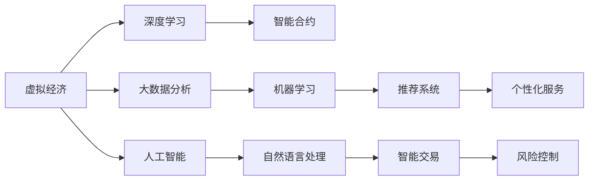

                 

# 虚拟经济：AI驱动的新型价值交换

## 1. 背景介绍

随着数字经济的发展，虚拟经济已逐渐成为世界经济的重要组成部分。虚拟经济依托于信息技术，通过数字资产的交换实现价值增值，其发展深度和广度逐渐超越传统实体经济。人工智能（AI）技术的进步，尤其是深度学习和大数据分析技术的突破，正在成为推动虚拟经济发展的关键力量。

### 1.1 虚拟经济的兴起

虚拟经济的兴起可以追溯到互联网的诞生。网络经济最初通过网络平台实现了信息交换，即人们在线上获取、处理、发布信息。随着电子商务、在线支付、社交网络、云计算等技术的迅速发展，虚拟经济得以快速成长。它包括数字货币、在线交易平台、虚拟商品、游戏经济等，涵盖金融、娱乐、社交等多个领域。

### 1.2 AI技术在虚拟经济中的角色

AI技术，特别是机器学习和深度学习，对虚拟经济的发展具有重要意义。AI能够处理海量数据，从数据中提取出有价值的模式和趋势，支持虚拟经济系统的智能决策。AI驱动的算法可以在虚拟经济中实现智能交易、个性化推荐、风险控制等功能，优化虚拟经济系统的运作效率。

## 2. 核心概念与联系

### 2.1 核心概念概述

为更好地理解AI在虚拟经济中的应用，我们首先概述几个关键概念：

- **虚拟经济**：指基于网络平台，通过数字资产交换实现价值增值的经济形态。虚拟经济覆盖范围广泛，包括数字货币、在线交易平台、虚拟商品等。
- **人工智能**：通过模拟人类智能行为，实现计算机对数据的高效处理和智能决策的技术体系。主要包括机器学习、深度学习、自然语言处理等子领域。
- **深度学习**：一种特殊的机器学习方法，通过多层次神经网络实现特征提取和模式识别。在虚拟经济中，深度学习可以用于智能交易、风险管理、推荐系统等。
- **大数据分析**：利用先进的数据处理技术，从海量数据中提取有用信息，支撑虚拟经济系统的决策和优化。
- **智能合约**：一种基于区块链技术的自动合约，当满足特定条件时，自动执行约定的操作。智能合约在虚拟经济中可以实现自动交易、清算等。

这些概念之间通过数据流、算法逻辑、经济活动等方式紧密联系，共同构成了虚拟经济和AI技术相互交织的生态系统。

### 2.2 核心概念原理和架构的 Mermaid 流程图



## 3. 核心算法原理 & 具体操作步骤

### 3.1 算法原理概述

AI在虚拟经济中的应用，主要通过以下几个算法原理实现：

- **深度学习算法**：通过多层神经网络从数据中提取特征，实现对虚拟资产的智能分类和预测。
- **机器学习算法**：利用算法对大量历史交易数据进行分析，预测价格走势和市场趋势。
- **自然语言处理算法**：对交易中的文本信息进行理解和处理，支持自动化的交易决策和风险评估。
- **大数据分析算法**：利用先进的数据处理技术，从海量交易数据中提取有用信息，实现市场趋势预测和智能决策。

### 3.2 算法步骤详解

AI在虚拟经济中的具体应用步骤如下：

1. **数据收集与预处理**：收集虚拟经济平台上的各类数据，包括交易记录、用户行为、市场价格等，并进行清洗、整理和标准化。

2. **特征提取与建模**：利用深度学习算法对数据进行特征提取，构建各种模型，如决策树、支持向量机等。

3. **模型训练与优化**：通过大量标注数据对模型进行训练，并进行超参数调整，以提高模型的预测准确率和泛化能力。

4. **智能决策与预测**：利用训练好的模型进行智能交易、风险控制和市场预测，实现虚拟经济系统的自动化和智能化。

5. **系统集成与部署**：将AI技术整合到虚拟经济系统中，实现自动化交易、清算、风险管理等功能，并进行系统部署和运行维护。

### 3.3 算法优缺点

AI在虚拟经济中的应用具有以下优点：

- **自动化决策**：通过AI算法实现自动化决策，提高交易效率和市场反应速度。
- **精准预测**：AI技术能够处理海量数据，实现对市场趋势的精准预测。
- **个性化服务**：利用AI算法提供个性化推荐和智能服务，提升用户体验。

同时，AI在虚拟经济中也存在一些缺点：

- **数据隐私问题**：AI算法依赖大量数据，可能存在数据隐私和安全问题。
- **模型黑箱**：AI算法的内部决策过程复杂，缺乏透明性和可解释性。
- **高门槛**：AI技术的实现需要专业知识和资源，存在一定的技术门槛。

### 3.4 算法应用领域

AI在虚拟经济中的应用领域非常广泛，涵盖以下几个方面：

1. **智能交易**：利用AI算法实现自动化的交易策略和决策，提高交易效率和盈利能力。
2. **风险管理**：通过AI算法实时监控市场动态，预测风险，实现风险预警和控制。
3. **个性化推荐**：利用AI算法分析用户行为和偏好，提供个性化的虚拟商品和服务。
4. **市场预测**：利用AI算法分析历史数据和市场趋势，预测虚拟资产的价格变化。
5. **虚拟资产定价**：利用AI算法对虚拟资产进行价值评估和定价，提供市场参考。

## 4. 数学模型和公式 & 详细讲解 & 举例说明

### 4.1 数学模型构建

AI在虚拟经济中的应用，涉及多种数学模型和算法。这里以智能交易为例，构建一个简单的数学模型。

### 4.2 公式推导过程

假设有一个虚拟交易平台，平台上的虚拟货币价格由供需关系决定，需求函数为 $D(p) = a - bp^2$，供给函数为 $S(p) = c + dp$，其中 $p$ 表示价格，$a$、$b$、$c$、$d$ 为模型参数。市场均衡时需求等于供给，即 $D(p) = S(p)$。通过求解方程 $a - bp^2 = c + dp$，可以得到均衡价格 $p_e$。

### 4.3 案例分析与讲解

以比特币为例，我们可以利用AI算法对历史价格数据进行分析，预测未来的价格走势。通过构建LSTM神经网络模型，对价格序列进行训练，利用模型预测未来价格。此外，还可以结合自然语言处理算法，分析比特币的交易信息，进一步优化预测模型。

## 5. 项目实践：代码实例和详细解释说明

### 5.1 开发环境搭建

为了实现AI在虚拟经济中的应用，需要搭建一个开发环境。以下是具体步骤：

1. 安装Python和相应的开发工具，如Jupyter Notebook、PyTorch等。
2. 安装虚拟经济相关的数据集和模型库，如TensorFlow、Keras、Pandas等。
3. 搭建虚拟经济系统的开发环境，如阿里云、AWS等。

### 5.2 源代码详细实现

以下是一个简单的AI驱动的虚拟经济系统代码实现，以比特币价格预测为例：

```python
import pandas as pd
import numpy as np
from sklearn.preprocessing import MinMaxScaler
from keras.models import Sequential
from keras.layers import Dense, LSTM

# 读取比特币价格数据
data = pd.read_csv('bitcoin.csv')
prices = data['price'].values.reshape(-1, 1)
prices = prices / prices[0]

# 标准化数据
scaler = MinMaxScaler(feature_range=(0, 1))
prices_scaled = scaler.fit_transform(prices)

# 划分训练集和测试集
train_size = int(len(prices_scaled) * 0.8)
test_size = len(prices_scaled) - train_size
train_prices = prices_scaled[0:train_size, :]
test_prices = prices_scaled[train_size:len(prices_scaled), :]

# 构造LSTM模型
model = Sequential()
model.add(LSTM(units=50, return_sequences=True, input_shape=(train_size, 1)))
model.add(LSTM(units=50))
model.add(Dense(units=1))

# 编译模型
model.compile(optimizer='adam', loss='mean_squared_error')

# 训练模型
model.fit(train_prices, train_prices[:, -1], epochs=100, batch_size=32)

# 预测未来价格
test_prices_scaled = scaler.transform(test_prices)
predicted_prices = model.predict(test_prices_scaled)

# 反标准化
predicted_prices = scaler.inverse_transform(predicted_prices)
actual_prices = scaler.inverse_transform(test_prices)
```

### 5.3 代码解读与分析

在上述代码中，我们使用了LSTM神经网络模型对比特币价格进行预测。具体步骤包括：

1. 读取比特币价格数据，并将其标准化处理。
2. 划分训练集和测试集，确保模型在未知数据上的泛化能力。
3. 构建LSTM模型，并进行编译和训练。
4. 利用训练好的模型预测未来价格，并进行反标准化处理。

## 6. 实际应用场景

### 6.1 智能交易

AI在虚拟经济中的智能交易应用非常广泛。例如，交易所可以通过AI算法对市场数据进行分析，实现自动化的交易策略和决策，提高交易效率和盈利能力。此外，AI还可以用于量化交易，利用算法分析市场数据，发现套利机会，从而实现高盈利的交易策略。

### 6.2 风险管理

AI在虚拟经济中还可以用于风险管理。通过AI算法实时监控市场动态，预测风险，实现风险预警和控制。例如，利用深度学习算法分析市场数据，预测价格波动和风险事件，从而帮助投资者及时调整投资策略，降低风险。

### 6.3 个性化推荐

AI在虚拟经济中还可以提供个性化推荐服务。例如，虚拟商品平台可以利用AI算法分析用户行为和偏好，推荐符合用户兴趣的商品，提升用户体验。此外，AI还可以用于智能客服，利用自然语言处理算法，实现对用户咨询的智能回答和处理。

### 6.4 未来应用展望

未来，AI在虚拟经济中的应用将更加广泛和深入。以下是几个可能的未来应用方向：

1. **跨领域融合**：将AI技术与区块链、物联网等技术结合，实现跨领域协同。例如，通过AI分析物联网数据，优化供应链管理，提升虚拟经济系统的整体效率。
2. **多模态交互**：结合图像、声音、文本等多种模态数据，实现更加自然、智能的交互体验。例如，通过图像识别技术，自动识别用户需求，提供个性化服务。
3. **智能合约**：结合AI技术，实现更加智能、灵活的智能合约。例如，通过AI算法分析合同条款，自动执行合同约定，提高交易效率和安全性。
4. **虚拟资产管理**：利用AI技术，实现虚拟资产的自动化管理。例如，通过AI算法分析资产价格和市场趋势，进行资产配置和风险控制。

## 7. 工具和资源推荐

### 7.1 学习资源推荐

为了学习AI在虚拟经济中的应用，以下推荐一些优质的学习资源：

1. **深度学习课程**：如Coursera的《深度学习专项课程》、Udacity的《深度学习基础》等，系统学习深度学习原理和应用。
2. **大数据分析课程**：如Coursera的《数据科学与机器学习》、edX的《大数据分析》等，掌握大数据分析技术。
3. **虚拟经济课程**：如Coursera的《金融技术（FinTech）》、edX的《虚拟经济与数字货币》等，了解虚拟经济的基本概念和应用。
4. **区块链课程**：如Coursera的《区块链技术及其应用》、Udemy的《以太坊开发》等，掌握区块链技术及其应用。

### 7.2 开发工具推荐

以下是一些常用的开发工具，用于AI在虚拟经济中的应用开发：

1. **PyTorch**：广泛使用的深度学习框架，具有灵活的动态计算图和丰富的预训练模型。
2. **TensorFlow**：由Google开发的深度学习框架，支持分布式训练和高效的模型优化。
3. **Keras**：基于Python的深度学习库，简单易用，适合初学者和快速原型开发。
4. **Jupyter Notebook**：用于数据探索、模型训练和实验记录的交互式开发环境。
5. **GitHub**：版本控制平台，支持代码托管和协作开发。

### 7.3 相关论文推荐

以下是一些关键的AI在虚拟经济应用的论文，推荐阅读：

1. **深度学习在金融市场的预测与应用**：探讨深度学习在金融市场预测中的应用，及其对市场价格和风险管理的潜在影响。
2. **基于自然语言处理的量化交易策略**：研究自然语言处理技术在量化交易中的应用，及其对交易策略的优化效果。
3. **区块链与人工智能的融合**：探讨区块链与人工智能的结合，及其对虚拟经济系统的安全性和智能化的提升。
4. **智能合约的设计与优化**：研究智能合约的设计和优化方法，及其对虚拟经济交易的自动化和效率提升。

## 8. 总结：未来发展趋势与挑战

### 8.1 研究成果总结

AI在虚拟经济中的应用，正在成为推动虚拟经济发展的关键力量。通过深度学习、大数据分析和智能合约等技术，虚拟经济系统可以实现更加智能、高效、安全的运作。AI技术的应用，不仅提高了虚拟经济系统的决策效率和市场响应速度，还增强了系统的风险控制和个性化服务能力。

### 8.2 未来发展趋势

未来，AI在虚拟经济中的应用将更加广泛和深入。以下是几个可能的未来发展趋势：

1. **技术融合**：AI技术与区块链、物联网、自然语言处理等技术的深度融合，将带来更加智能化、协同化的虚拟经济系统。
2. **模型优化**：AI模型的优化和改进，将提升虚拟经济系统的精度和泛化能力。例如，通过优化深度学习模型，提高价格预测的准确性和稳定性。
3. **系统集成**：AI技术在虚拟经济系统中的全面集成和部署，将实现自动化的交易、清算、风险控制和市场预测等功能的无缝结合。
4. **数据安全**：随着虚拟经济规模的扩大，数据安全问题将成为重要的研究方向。AI技术可以帮助识别和防范数据泄露和攻击，提升虚拟经济系统的安全性。

### 8.3 面临的挑战

AI在虚拟经济中的应用，仍面临一些挑战：

1. **数据隐私和安全**：AI算法依赖大量数据，可能存在数据隐私和安全问题。如何在保护用户隐私的前提下，实现高效的数据处理和分析，是一个重要的研究方向。
2. **模型透明性和可解释性**：AI算法的内部决策过程复杂，缺乏透明性和可解释性。如何提高模型的可解释性，增强用户对算法的信任，是一个重要的研究方向。
3. **技术门槛**：AI技术的实现需要专业知识和资源，存在一定的技术门槛。如何降低技术门槛，实现AI技术的普及应用，是一个重要的研究方向。
4. **系统复杂性**：AI技术在虚拟经济系统中的应用，可能导致系统的复杂性增加，带来管理和维护的挑战。如何简化系统设计和优化系统性能，是一个重要的研究方向。

### 8.4 研究展望

面对AI在虚拟经济应用中的挑战，未来的研究需要在以下几个方面寻求新的突破：

1. **隐私保护**：研究数据隐私保护技术，如差分隐私、联邦学习等，在保护用户隐私的前提下，实现高效的数据处理和分析。
2. **模型透明性**：研究模型透明性和可解释性技术，如可解释AI、知识图谱等，提高AI算法的透明性和可解释性。
3. **技术普及**：研究技术普及和自动化工具，如模型压缩、模型服务化等，降低AI技术的实现门槛，实现AI技术的普及应用。
4. **系统优化**：研究系统优化和自动化技术，如模型剪枝、动态资源调度等，简化系统设计和优化系统性能，实现高效、稳定的虚拟经济系统。

## 9. 附录：常见问题与解答

**Q1: AI在虚拟经济中的应用有哪些优点？**

A: AI在虚拟经济中的应用具有以下优点：

1. **自动化决策**：通过AI算法实现自动化决策，提高交易效率和市场反应速度。
2. **精准预测**：AI技术能够处理海量数据，实现对市场趋势的精准预测。
3. **个性化服务**：利用AI算法提供个性化推荐和智能服务，提升用户体验。

**Q2: AI在虚拟经济中的应用存在哪些挑战？**

A: AI在虚拟经济中的应用存在以下挑战：

1. **数据隐私问题**：AI算法依赖大量数据，可能存在数据隐私和安全问题。
2. **模型黑箱**：AI算法的内部决策过程复杂，缺乏透明性和可解释性。
3. **高门槛**：AI技术的实现需要专业知识和资源，存在一定的技术门槛。

**Q3: AI在虚拟经济中的应用未来有哪些发展方向？**

A: AI在虚拟经济中的应用未来有以下发展方向：

1. **跨领域融合**：将AI技术与区块链、物联网等技术结合，实现跨领域协同。
2. **多模态交互**：结合图像、声音、文本等多种模态数据，实现更加自然、智能的交互体验。
3. **智能合约**：结合AI技术，实现更加智能、灵活的智能合约。
4. **虚拟资产管理**：利用AI技术，实现虚拟资产的自动化管理。

**Q4: 如何保护AI在虚拟经济中的应用中的数据隐私？**

A: 保护AI在虚拟经济中的应用中的数据隐私，可以采取以下措施：

1. **差分隐私**：通过添加噪声，限制单个数据点的信息泄露。
2. **联邦学习**：在分布式环境中，利用本地数据进行模型训练，保护数据隐私。
3. **区块链技术**：利用区块链的不可篡改性和匿名性，保护数据隐私。

作者：禅与计算机程序设计艺术 / Zen and the Art of Computer Programming

