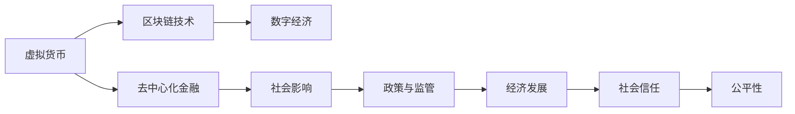

                 

# 虚拟货币与全球脑:去中心化金融体系的社会影响

> 关键词：虚拟货币,去中心化金融(DeFi),区块链技术,数字经济,社会影响

## 1. 背景介绍

### 1.1 问题由来
随着区块链技术的兴起，虚拟货币作为其核心应用之一，在过去十年间迅速发展。比特币的诞生，不仅引发了数字货币市场的狂热，也催生了去中心化金融(DeFi)这一新领域。DeFi通过区块链技术实现了金融服务的去中心化和自动化，为传统金融体系注入了新的活力。然而，这一新兴领域也带来了诸多新的挑战和机遇，对全球经济、社会乃至政治环境产生了深远影响。

### 1.2 问题核心关键点
DeFi技术的应用和影响广泛而深刻，以下是几个关键点：

1. **去中心化**：DeFi系统通过智能合约自动化执行金融交易，消除了中心化的信任中介，大幅降低了交易成本和风险。
2. **加密货币的普及**：比特币、以太坊等虚拟货币的广泛应用，使得加密货币成为全球数字经济的重要组成部分。
3. **金融服务创新**：DeFi提供了点对点的借贷、稳定币、去中心化交易所(DEX)等新型金融服务，重塑了金融生态。
4. **社会信任重建**：区块链技术的透明性和不可篡改性，增强了用户对数字经济的信任。
5. **政策与监管**：各国政府和监管机构对DeFi的监管态度不一，对其发展方向和风险防范带来了不确定性。

### 1.3 问题研究意义
DeFi技术的应用和影响，不仅对金融行业产生了深远影响，还对整个社会经济结构、信任机制乃至全球治理格局产生了重要影响。理解DeFi技术的内在逻辑和实际应用，有助于我们把握这一新兴领域的机遇与挑战，制定科学的政策和监管框架，推动数字经济的可持续发展。

## 2. 核心概念与联系

### 2.1 核心概念概述

为了更好地理解DeFi的社会影响，本节将介绍几个关键概念：

1. **虚拟货币(Virtual Currency)**：指基于区块链技术的数字资产，具有去中心化、不可篡改、透明公开等特点，如比特币、以太坊等。

2. **去中心化金融(DeFi)**：利用区块链技术构建的金融应用，旨在实现去中心化的金融服务，如借贷、交易、稳定币等。

3. **区块链技术(Blockchain Technology)**：一种分布式账本技术，通过去中心化网络维护交易记录，具有安全、透明、不可篡改等特性。

4. **数字经济(Digital Economy)**：以信息技术和数字技术为基础，通过数字资产、数字服务等方式进行的经济活动。

5. **社会影响(Societal Impact)**：DeFi技术对社会信任、公平性、经济结构等方面带来的影响和变化。

### 2.2 核心概念原理和架构的 Mermaid 流程图(Mermaid 流程节点中不要有括号、逗号等特殊字符)



这个流程图展示了虚拟货币、去中心化金融、区块链技术、数字经济与社会影响之间的联系：

1. 虚拟货币作为DeFi的基础，通过区块链技术在去中心化金融体系中应用。
2. 区块链技术的核心特性，为数字经济提供了安全、透明、不可篡改的交易环境。
3. DeFi提供了点对点的金融服务，重塑了金融生态。
4. 数字经济的发展，进一步推动了社会信任、公平性等价值观的变革。
5. 政策与监管对DeFi的规范和引导，促进了健康发展的数字经济。

## 3. 核心算法原理 & 具体操作步骤
### 3.1 算法原理概述

DeFi系统的核心算法原理在于利用智能合约自动化执行金融交易，实现金融服务的去中心化和自动化。以下是DeFi系统的关键算法步骤：

1. **智能合约(智能合约)**：一种自动执行、控制或文档化条款的合约，通常部署在区块链上。
2. **去中心化自治组织(DAO)**：由智能合约管理的自治组织，用于协调和治理DeFi系统。
3. **稳定币(Stablecoin)**：一种与法定货币或实物资产挂钩的加密货币，用于解决传统货币和区块链货币之间的桥梁问题。
4. **去中心化交易所(DEX)**：基于区块链技术的交易平台，无需中心化的中介机构即可进行交易。

### 3.2 算法步骤详解

DeFi系统的算法步骤主要包括以下几个关键环节：

**Step 1: 初始化智能合约**
- 定义智能合约的逻辑和规则，部署在区块链上。
- 设定智能合约的参数，如利率、借贷限额、抵押比例等。

**Step 2: 用户交互**
- 用户通过智能合约与区块链进行交互，发起借贷、交易等操作。
- 智能合约根据用户的操作，自动执行相应的金融逻辑。

**Step 3: 系统监控与审计**
- 智能合约部署后，需要定期进行监控和审计，确保系统安全性。
- 使用审计工具和测试框架，验证智能合约的正确性和安全性。

**Step 4: 风险管理**
- 设置智能合约的风险控制机制，如自动清算、自动续贷等。
- 定期进行系统健康检查，确保系统稳定运行。

**Step 5: 用户教育与普及**
- 提供用户教育材料，普及DeFi相关知识。
- 建立社区，鼓励用户参与DeFi系统的建设和管理。

### 3.3 算法优缺点

DeFi技术的应用带来了诸多优点：

1. **去中心化**：降低了信任成本，提高了系统的透明性和安全性。
2. **自动化**：提高了交易效率，减少了人为错误。
3. **低门槛**：任何人都可以参与DeFi系统，无需传统金融机构的介入。
4. **创新性**：提供了新的金融服务模式，拓展了金融生态。

然而，DeFi技术也存在一些缺点：

1. **复杂性**：智能合约的复杂性可能导致漏洞和安全隐患。
2. **技术门槛**：对区块链和智能合约的理解要求较高。
3. **监管挑战**：各国监管政策和法律框架尚未完善，对DeFi系统的规范和引导存在不确定性。
4. **市场波动性**：加密货币市场的波动性，可能带来更高的风险。

### 3.4 算法应用领域

DeFi技术的应用领域广泛，覆盖了多个金融和非金融场景：

- **金融借贷**：通过智能合约实现点对点的借贷服务，无需传统银行中介。
- **去中心化交易所**：无需中心化的交易所，即可进行加密货币的买卖交易。
- **稳定币**：通过与法定货币或实物资产挂钩，提供稳定、可用的加密货币。
- **保险**：利用智能合约实现自动理赔和赔付，提高保险服务的透明度和效率。
- **供应链金融**：利用区块链技术，实现供应链中的融资、清算和结算。
- **社会治理**：利用DAO进行社会资金管理和公共决策，提升公共服务的透明度和效率。

DeFi技术不仅改变了金融行业的运作模式，还在政府治理、供应链管理、数字身份认证等领域产生了重要影响。

## 4. 数学模型和公式 & 详细讲解 & 举例说明

### 4.1 数学模型构建

DeFi系统的数学模型主要涉及智能合约的逻辑设计、交易执行的算法实现等。

以一个简单的借贷智能合约为例，其数学模型可以表示为：

- 用户A向用户B借贷一定数量的货币，设定利率、期限等参数。
- 用户B接受借款，并通过智能合约将资金转入用户A的账户。
- 在规定期限内，用户A按约定利率支付利息，并偿还本金。
- 用户B在智能合约到期后，自动将资金返还至其账户。

### 4.2 公式推导过程

**Step 1: 设定初始参数**
- 设定初始本金 $L_0$，约定利率 $r$，期限 $T$。
- 设定利息计算周期 $n$，每日利率 $\frac{r}{n}$。

**Step 2: 计算每日利息**
- 每日利息 $I_{i+1} = L_i \times \frac{r}{n}$，其中 $L_i$ 为第 $i$ 日的本金。

**Step 3: 计算到期本金和利息**
- 到期本金 $L_T = L_0 \times (1 + \frac{r}{n})^{nT}$。
- 到期总利息 $I_T = L_T - L_0$。

**Step 4: 计算每日还款**
- 每日还款 $R_i = \frac{L_i \times \frac{r}{n}}{(1 + \frac{r}{n})^{n(i+1)}}$，其中 $L_i$ 为第 $i$ 日的本金。

### 4.3 案例分析与讲解

假设用户A向用户B借贷100美元，约定年利率为5%，期限为1年，每日利息计算。则每日利息计算公式为：

$$
I_{i+1} = 100 \times \frac{0.05}{365}
$$

初始本金为 $L_0 = 100$，每日利息为 $I_{i+1} = 0.0137$。每日还款为：

$$
R_i = \frac{100 \times 0.0137}{(1 + 0.0137)^{n(i+1)}} = \frac{100 \times 0.0137}{(1.0137)^i}
$$

在到期日，用户B的还款总额为 $L_T = 100 + 100 \times 0.0137 \times 365 = 103.83$。

### 5. 项目实践：代码实例和详细解释说明

### 5.1 开发环境搭建

要进行DeFi系统的开发实践，需要以下开发环境：

1. 安装Python 3.8及以上的版本。
2. 安装区块链开发框架，如Truffle、Hardhat等。
3. 安装智能合约开发工具，如Solidity IDE、Remix等。
4. 搭建本地或公有区块链网络，如Ganache、Rinkeby等。

### 5.2 源代码详细实现

以下是使用Solidity编写的一个简单的借贷智能合约的代码示例：

```solidity
// SPDX-License-Identifier: MIT
pragma solidity ^0.8.0;

contract Lending {
    address private lender;
    uint256 private amount;
    uint256 private rate;
    uint256 private period;
    uint256 public interest;
    uint256 public repay;
    
    mapping(uint256 => bool) public isPaid;
    
    event LoanAccepted(uint256 indexed _id, address indexed _lender, uint256 _amount, uint256 _rate, uint256 _period);
    event InterestPaid(uint256 indexed _id, address indexed _lender, uint256 _interest);
    event LoanRepaid(uint256 indexed _id, address indexed _lender);
    
    constructor(address _lender, uint256 _amount, uint256 _rate, uint256 _period) public {
        lender = _lender;
        amount = _amount;
        rate = _rate;
        period = _period;
        interest = calculateInterest();
        repay = calculateRepay();
    }
    
    function calculateInterest() public view returns (uint256) {
        return amount * rate / 365 * period;
    }
    
    function calculateRepay() public view returns (uint256) {
        return amount + interest;
    }
    
    function lend() public {
        uint256 now = block.timestamp;
        uint256 age = (now - transactionTime());
        uint256 remaining = (period * 365 - age);
        uint256 dailyInterest = rate / 365;
        uint256 dailyRepay = dailyInterest / (1 + dailyInterest);
        
        // 每日利息
        isPaid[now] = false;
        uint256 i = 0;
        while (remaining > 0) {
            uint256 nextInterest = amount * dailyInterest;
            interest += nextInterest;
            repay += nextInterest;
            dailyRepay = dailyRepay * (1 + dailyInterest);
            if (isPaid[now]) {
                break;
            }
            now = now + 1;
            remaining = remaining - 1;
            dailyRepay = dailyRepay / (1 + dailyInterest);
        }
        isPaid[now] = true;
        emit InterestPaid(now, address(lender), interest);
        emit LoanRepaid(now, address(lender));
    }
    
    function isPaid() public view returns (bool) {
        return isPaid[block.timestamp];
    }
    
    function repay() public {
        uint256 now = block.timestamp;
        if (isPaid[now]) {
            emit LoanRepaid(now, address(lender));
        } else {
            emit InterestPaid(now, address(lender), interest);
        }
    }
}
```

### 5.3 代码解读与分析

**借款合约**：
- 通过构造函数初始化借贷参数，如借款人地址、借款金额、利率和期限。
- 计算每日利息和到期总利息。
- 计算每日还款和到期本金。

**利息计算**：
- 每日利息计算基于利率和剩余天数，使用循环计算每日利息并累计。

**还款机制**：
- 还款合约使用每日利息和每日还款计算还款金额，同时记录还款状态，确保只能还款一次。

**验证**：
- 在还款前检查还款状态，确保只有未还款的情况下才能执行还款操作。

### 5.4 运行结果展示

部署智能合约后，可以通过以太坊客户端调用合约函数，进行借款和还款操作。

## 6. 实际应用场景

### 6.1 智能合约贷款

DeFi系统可以用于点对点的贷款，消除中心化金融机构的介入。用户通过智能合约申请贷款，设定借贷金额、利率和期限，智能合约自动执行还款和利息计算。

### 6.2 去中心化交易所

DeFi系统中的去中心化交易所(DEX)，实现了加密货币的买卖交易，无需中心化交易所的介入，提高了交易的透明性和安全性。

### 6.3 稳定币

稳定币通过与法定货币或实物资产挂钩，提供稳定、可用的加密货币。DeFi系统中的稳定币发行和兑换机制，使得用户可以方便地进行加密货币和法定货币之间的转换。

### 6.4 未来应用展望

随着DeFi技术的不断发展和完善，其应用场景将进一步扩展。未来，DeFi系统有望在以下几个领域发挥更大作用：

- **社会治理**：利用DAO进行公共资金管理和公共决策，提升政府治理的透明度和效率。
- **供应链金融**：利用区块链技术，实现供应链中的融资、清算和结算，降低交易成本和风险。
- **数字身份认证**：利用DeFi系统的智能合约，实现去中心化的身份认证和验证，保护用户隐私。
- **全球金融一体化**：通过DeFi系统，实现全球范围内的金融服务和资金流通，促进全球金融一体化。

## 7. 工具和资源推荐

### 7.1 学习资源推荐

为了帮助开发者系统掌握DeFi技术的理论和实践，这里推荐一些优质的学习资源：

1. 《Mastering DeFi: Decentralized Finance on Ethereum》书籍：全面介绍了DeFi技术的基本概念、核心算法和实践技巧。
2. DeFi Alliance网站：提供DeFi领域的最新动态、项目列表和教育资源，是DeFi领域的权威信息源。
3. Solidity官方文档：Solidity语言的基础教程和智能合约开发指南，是学习DeFi技术的必备资料。
4. CryptoZombies：通过互动式的学习游戏，帮助初学者理解智能合约和Solidity语言的基本概念。
5. Ethereum官方教程：Ethereum平台上的智能合约开发教程，包含大量实用示例和项目实战。

通过这些资源的学习实践，相信你一定能够快速掌握DeFi技术的精髓，并用于解决实际的金融问题。

### 7.2 开发工具推荐

高效的开发离不开优秀的工具支持。以下是几款用于DeFi开发常用的工具：

1. Truffle或Remix：区块链智能合约的开发环境，提供了IDE、编译器和测试框架，方便开发者进行智能合约的开发和调试。
2. Ganache或Rinkeby：本地区块链开发环境，支持智能合约的本地测试和调试。
3. Infura：提供以太坊主网、测试网和侧链的节点服务，方便开发者进行DeFi应用的原型开发和测试。
4. MetaMask：支持以太坊钱包和智能合约的交互，方便开发者进行DeFi应用的部署和测试。
5. OpenZeppelin：提供一系列智能合约的安全审计工具和模板，帮助开发者构建安全的DeFi应用。

合理利用这些工具，可以显著提升DeFi应用的开发效率，加速创新迭代的步伐。

### 7.3 相关论文推荐

DeFi技术的应用和影响，已经引起了学界的广泛关注。以下是几篇奠基性的相关论文，推荐阅读：

1. "Decentralized Finance on Blockchain: A Survey of the Research Landscape"：DeFi技术的综述性论文，总结了DeFi领域的主要研究方向和应用场景。
2. "Smart Contract Security: Identifying and Remedying Identical Predictions in Smart Contracts"：智能合约安全方面的重要论文，探讨了智能合约中的常见漏洞和安全机制。
3. "Blockchain-based DeFi Services for Businesses: An Exploratory Study"：DeFi技术在企业应用中的研究，探讨了DeFi系统对企业的潜在影响。
4. "The Ethical Implications of Decentralized Finance"：DeFi技术的伦理问题探讨，研究了DeFi系统对社会伦理的影响和挑战。
5. "Stablecoins and Decentralized Finance"：稳定币在DeFi系统中的应用研究，分析了稳定币在DeFi系统中的作用和影响。

这些论文代表了大规模语言模型微调技术的发展脉络。通过学习这些前沿成果，可以帮助研究者把握学科前进方向，激发更多的创新灵感。

## 8. 总结：未来发展趋势与挑战

### 8.1 研究成果总结

本文对DeFi技术的应用和影响进行了全面系统的介绍。首先阐述了DeFi技术的发展背景和应用前景，明确了DeFi在去中心化金融体系中的重要地位。其次，从原理到实践，详细讲解了DeFi系统的核心算法和操作步骤，给出了DeFi系统开发的完整代码实例。同时，本文还探讨了DeFi技术在社会治理、供应链金融、数字身份认证等多个领域的应用前景，展示了DeFi技术的巨大潜力。

通过本文的系统梳理，可以看到，DeFi技术正在改变金融行业的运作模式，重塑全球金融生态，带来深远的社会和经济影响。

### 8.2 未来发展趋势

展望未来，DeFi技术的发展将呈现以下几个趋势：

1. **去中心化自治组织(DAO)**：DAO将进一步普及，成为DeFi系统的核心治理机制，推动去中心化金融的自治和自治。
2. **跨链技术**：跨链技术的发展，将促进不同区块链平台之间的互联互通，拓展DeFi系统的应用边界。
3. **隐私保护**：隐私保护技术的发展，将提升DeFi系统的安全性，保护用户的隐私和数据安全。
4. **稳定币的多样化**：除了基于法定货币的稳定币，将出现更多基于资产支持的稳定币，提供多样化的金融服务。
5. **DeFi与传统金融的融合**：DeFi系统将与传统金融体系进行更深层次的融合，形成更加完善的金融生态。

### 8.3 面临的挑战

尽管DeFi技术的应用和影响已经引起了广泛关注，但在迈向更加智能化、普适化应用的过程中，它仍面临着诸多挑战：

1. **技术复杂性**：DeFi系统的智能合约设计复杂，容易出现漏洞和安全问题。
2. **监管不完善**：各国对DeFi的监管态度不一，缺乏统一的法律法规框架。
3. **用户教育**：DeFi技术的学习门槛较高，需要大量的用户教育和普及工作。
4. **市场波动性**：加密货币市场的波动性，可能带来更高的风险和不确定性。
5. **生态系统不成熟**：DeFi系统的生态系统尚不成熟，需要更多基础设施和应用场景的支持。

### 8.4 研究展望

面对DeFi技术所面临的挑战，未来的研究需要在以下几个方面寻求新的突破：

1. **智能合约的安全性**：开发更加安全、可靠的智能合约设计框架，提升DeFi系统的安全性。
2. **跨链互操作性**：研究跨链技术的标准和协议，促进不同区块链平台之间的互操作性。
3. **隐私保护技术**：研究隐私保护算法和技术，提升DeFi系统的隐私保护能力。
4. **稳定币的创新**：开发更多创新的稳定币方案，提供多样化的金融服务。
5. **用户教育与普及**：开展大规模的用户教育活动，普及DeFi技术的基本概念和应用场景。

这些研究方向的探索，必将引领DeFi技术的不断发展，为构建更加安全、普适的数字金融体系铺平道路。面向未来，DeFi技术还需要与其他人工智能技术进行更深入的融合，如区块链与AI的协同，进一步推动数字经济的发展。

## 9. 附录：常见问题与解答

**Q1：DeFi技术的发展前景如何？**

A: DeFi技术正在改变全球金融生态，具有广阔的发展前景。未来，DeFi系统有望在更多领域得到应用，带来更深远的影响。

**Q2：DeFi系统的安全性和监管挑战有哪些？**

A: DeFi系统的智能合约设计复杂，容易出现漏洞和安全问题。各国对DeFi的监管态度不一，缺乏统一的法律法规框架，是DeFi发展的主要挑战。

**Q3：如何降低DeFi系统的学习门槛？**

A: 通过普及教育和技术工具，降低DeFi系统的学习门槛。例如，提供用户教育材料、在线课程、开发工具等，帮助更多人理解和应用DeFi技术。

**Q4：DeFi系统在供应链金融中的应用如何？**

A: DeFi系统可以用于供应链金融，通过区块链技术实现融资、清算和结算，降低交易成本和风险，提升供应链的透明度和效率。

**Q5：DeFi技术在社会治理中的应用前景如何？**

A: DeFi技术可以用于社会治理，利用DAO进行公共资金管理和公共决策，提升政府治理的透明度和效率，增强社会信任。

---

作者：禅与计算机程序设计艺术 / Zen and the Art of Computer Programming

