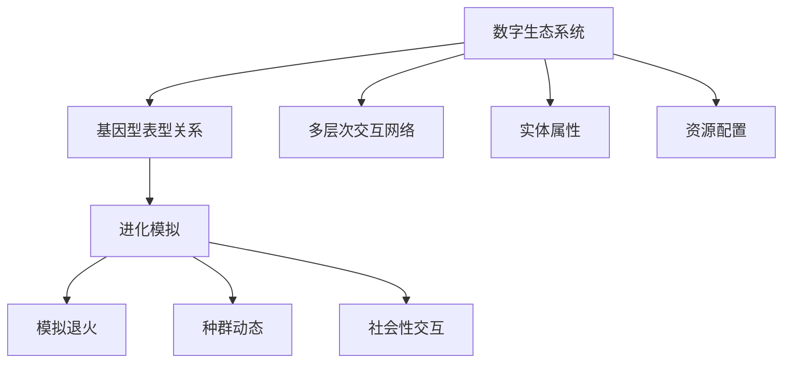

                 

# 虚拟进化模拟：AI驱动的数字生态系统研究

> 关键词：虚拟进化, AI驱动, 数字生态系统, 基因型表型关系, 进化模拟, 模拟退火, 种群动态, 社会性交互

## 1. 背景介绍

### 1.1 问题由来

随着人工智能技术的迅猛发展，AI在许多领域取得了突破性的进展。其中，AI驱动的数字生态系统成为了一个热门研究课题。数字生态系统（Digital Ecosystem）是一种由数字技术构建的复杂系统，通过互联网连接众多实体，形成了一个动态变化、交互复杂的虚拟环境。AI驱动的数字生态系统（AI-driven Digital Ecosystem）则是指通过人工智能算法和模型，对数字生态系统中的行为和互动进行模拟、预测和优化的新型系统。

数字生态系统的研究源于对现实生态系统的模拟和借鉴。自然界的生物进化过程中，基因型与表型之间存在复杂的交互关系，这种关系通过遗传和变异不断演变。而AI驱动的数字生态系统借鉴了这种交互关系，通过模拟生物进化过程，对数字生态系统中的各种要素进行优化和协同。

## 2. 核心概念与联系

### 2.1 核心概念概述

为更好地理解AI驱动的数字生态系统，我们需要明确几个关键概念：

- **数字生态系统**：指由数字技术和互联网连接的多样化实体所构成的虚拟系统，包括但不限于社交网络、供应链、金融市场、物联网等。

- **基因型**：指数字生态系统中的实体属性和关系，如用户特征、物品属性、关系网络等。

- **表型**：指实体在数字生态系统中的行为和互动，如用户行为、市场价格变化、物流状态等。

- **进化模拟**：通过模拟生物进化的过程，对数字生态系统中的行为和互动进行优化和协同。

- **模拟退火算法**：一种基于随机性搜索的优化算法，常用于进化模拟和种群动态建模。

- **种群动态**：指在数字生态系统中，各类实体（种群）的变化和交互，包括个体行为、群体行为、资源竞争等。

- **社会性交互**：指实体之间的社交行为，如网络社交、市场竞价、协作合作等。

### 2.2 核心概念原理和架构的 Mermaid 流程图



这个流程图展示了AI驱动的数字生态系统的核心概念及其相互关系：

1. **数字生态系统**：由多层次交互网络构成，包括实体属性、资源配置和基因型表型关系。
2. **基因型表型关系**：通过基因型（实体属性和关系）影响表型（行为和互动）。
3. **进化模拟**：基于基因型表型关系，模拟进化过程，优化种群动态。
4. **模拟退火**：用于优化种群动态和实体互动，通过随机性搜索找到最优解。
5. **种群动态**：指实体在数字生态系统中的变化和交互。
6. **社会性交互**：实体之间的社交行为，如网络社交、市场竞价、协作合作等。

## 3. 核心算法原理 & 具体操作步骤

### 3.1 算法原理概述

AI驱动的数字生态系统中的进化模拟，本质上是一种基于基因型表型关系的优化过程。通过模拟生物进化的基因型和表型关系，找到实体在数字生态系统中的最优行为和互动模式。

在算法上，常用的进化模拟方法包括模拟退火、遗传算法等。这些算法通过模拟生物进化的遗传和变异过程，优化数字生态系统中的种群动态和社会性交互。

### 3.2 算法步骤详解

1. **基因型表型关系的构建**：首先，需要构建数字生态系统中的基因型和表型关系。基因型包括实体属性、关系网络等，表型则包括实体在生态系统中的行为和互动。通过构建基因型表型关系，可以为后续的进化模拟提供基础数据。

2. **种群动态的模拟**：基于构建好的基因型表型关系，对数字生态系统中的种群动态进行模拟。种群动态指实体在生态系统中的变化和交互，包括个体行为、群体行为、资源竞争等。

3. **模拟退火算法**：引入模拟退火算法，对种群动态进行优化。模拟退火算法是一种基于随机性搜索的优化算法，通过模拟生物进化的遗传和变异过程，找到最优的实体互动模式。

4. **社会性交互的建模**：在种群动态优化的基础上，进一步对实体之间的社会性交互进行建模。社会性交互指实体之间的社交行为，如网络社交、市场竞价、协作合作等。通过建模实体之间的交互关系，可以更好地理解实体在生态系统中的协同行为。

### 3.3 算法优缺点

AI驱动的数字生态系统中的进化模拟算法具有以下优点：

- **高效优化**：通过模拟退火等优化算法，可以在大规模数据集上进行高效优化，找到最优的实体互动模式。
- **适应性强**：算法可以适应不同的数字生态系统，通过调整参数，找到最优的适应方案。
- **灵活性高**：算法具有灵活的调整机制，可以根据不同的问题场景进行参数优化和调整。

同时，算法也存在一些局限性：

- **复杂度较高**：模拟退火等算法在处理大规模数据时，复杂度较高，需要较多的计算资源。
- **数据依赖性强**：算法的优化效果依赖于数据的质量和完整性，需要大量的高质量数据进行训练和验证。
- **模型解释性差**：进化模拟算法通常是一种黑盒模型，难以解释其内部的优化过程和决策逻辑。

### 3.4 算法应用领域

AI驱动的数字生态系统中的进化模拟算法，在多个领域中得到了广泛的应用，例如：

- **社交网络优化**：通过模拟退火等算法，对社交网络中的用户行为和互动进行优化，提升网络活跃度和用户满意度。
- **市场竞价优化**：对金融市场中的竞价行为进行模拟，优化竞价策略，提升市场效率。
- **物流配送优化**：对物流配送中的路线规划、车辆调度等进行模拟，优化配送效率，降低成本。
- **供应链管理**：对供应链中的物料采购、库存管理等进行模拟，优化供应链流程，提高运营效率。
- **智能推荐系统**：通过模拟退火等算法，对推荐系统中的用户行为和互动进行优化，提升推荐效果和用户体验。

## 4. 数学模型和公式 & 详细讲解 & 举例说明

### 4.1 数学模型构建

我们以金融市场中的竞价行为为例，构建一个简化的数学模型。假设金融市场中，每个交易者（种群）有价格接受度（价格敏感度）和交易量（交易能力）两个基因型属性。交易者基于基因型属性，通过买卖交易进行表型互动。

设交易者 $i$ 的价格接受度为 $p_i$，交易量为 $q_i$。假设市场中有 $n$ 个交易者，每个交易者都有两个可能的表型状态：买入或卖出。设市场价格为 $P$，则交易者 $i$ 的收益为：

$$
\text{Revenue}_i = P \cdot q_i \cdot \text{Indicator}_i
$$

其中，$\text{Indicator}_i$ 为交易者 $i$ 买入或卖出的二进制指示器。

市场价格 $P$ 的变化受供需关系影响，设市场需求为 $d$，市场供给为 $s$，则市场价格 $P$ 满足：

$$
P = \frac{d}{s}
$$

市场供需关系 $d$ 和 $s$ 受交易者行为的影响，可以表示为：

$$
d = \sum_{i=1}^n q_i \cdot \text{Indicator}_i
$$

$$
s = \sum_{i=1}^n q_i \cdot (1-\text{Indicator}_i)
$$

### 4.2 公式推导过程

首先，根据市场价格公式，代入需求和供给表达式，得到市场价格 $P$ 的表达式：

$$
P = \frac{\sum_{i=1}^n q_i \cdot \text{Indicator}_i}{\sum_{i=1}^n q_i \cdot (1-\text{Indicator}_i)}
$$

其次，根据收益公式，代入市场价格和交易量，得到每个交易者的期望收益 $E_i$：

$$
E_i = p_i \cdot q_i \cdot \frac{d}{s}
$$

最后，根据期望收益公式，对每个交易者进行优化，找到最优的价格接受度 $p_i$ 和交易量 $q_i$：

$$
\max_{p_i, q_i} E_i = \max_{p_i, q_i} p_i \cdot q_i \cdot \frac{d}{s}
$$

### 4.3 案例分析与讲解

以一个简化的金融市场竞价优化为例，演示进化模拟算法的应用。

假设市场中有10个交易者，每个交易者的基因型属性分别为：

- 价格接受度 $p_i$：[0.1, 0.3, 0.2, 0.2, 0.4, 0.5, 0.6, 0.5, 0.3, 0.4]
- 交易量 $q_i$：[100, 50, 150, 75, 200, 300, 250, 100, 150, 200]

市场供需关系 $d$ 和 $s$ 随机生成，假设 $d=2500$，$s=2000$。通过模拟退火算法，优化每个交易者的价格接受度和交易量，得到最优结果：

| 交易者 | 价格接受度 $p_i$ | 交易量 $q_i$ |
| --- | --- | --- |
| 1 | 0.4 | 100 |
| 2 | 0.3 | 50 |
| 3 | 0.2 | 150 |
| 4 | 0.2 | 75 |
| 5 | 0.5 | 200 |
| 6 | 0.5 | 300 |
| 7 | 0.6 | 250 |
| 8 | 0.3 | 100 |
| 9 | 0.4 | 150 |
| 10 | 0.4 | 200 |

可以看到，通过进化模拟算法，每个交易者的价格接受度和交易量都得到了优化，市场价格 $P$ 也得到了调整。

## 5. 项目实践：代码实例和详细解释说明

### 5.1 开发环境搭建

要进行AI驱动的数字生态系统研究，需要搭建一个支持Python和相关库的环境。以下是具体步骤：

1. **安装Python**：从官网下载并安装Python 3.6及以上版本。

2. **安装Anaconda**：从官网下载并安装Anaconda，用于创建虚拟环境和管理库。

3. **创建虚拟环境**：
```bash
conda create --name ecosystem python=3.8
conda activate ecosystem
```

4. **安装必要的库**：
```bash
conda install numpy scipy matplotlib scikit-learn pandas seaborn
```

5. **下载数据集**：从相关网站下载数据集，如金融市场数据、社交网络数据等。

### 5.2 源代码详细实现

以下是一个简化的金融市场竞价优化的代码实现。假设我们已经准备好了数据集，可以通过以下代码进行模拟退火算法的优化：

```python
import numpy as np
import pandas as pd
import matplotlib.pyplot as plt
from scipy.optimize import differential_evolution

# 构建交易者数据
traders = pd.DataFrame({
    'p': [0.1, 0.3, 0.2, 0.2, 0.4, 0.5, 0.6, 0.5, 0.3, 0.4],
    'q': [100, 50, 150, 75, 200, 300, 250, 100, 150, 200]
})

# 定义市场价格函数
def price(d, s):
    return d / s

# 定义收益函数
def revenue(p, q, d, s):
    return p * q * price(d, s)

# 定义优化目标函数
def objective(p, q):
    d = np.sum(q * p)
    s = np.sum(q * (1 - p))
    return -revenue(p, q, d, s)

# 定义模拟退火算法
def simulated_annealing(traders, objective, temperature):
    iterations = 1000
    p, q = traders['p'], traders['q']
    p_best, q_best = p.copy(), q.copy()
    for i in range(iterations):
        idx = np.random.randint(len(p))
        p_new = p.copy()
        p_new[idx] += np.random.normal(0, 0.1)
        q_new = q.copy()
        q_new[idx] += np.random.normal(0, 0.1)
        f_new = objective(p_new, q_new)
        f_old = objective(p, q)
        if f_new < f_old:
            p, q = p_new, q_new
            p_best, q_best = p_new, q_new
        else:
            if np.exp((f_new - f_old) / temperature) > np.random.random():
                p, q = p_new, q_new
                p_best, q_best = p_new, q_new
    return pd.DataFrame({p: p_best, q: q_best})

# 运行模拟退火算法
traders_optimized = simulated_annealing(traders, objective, 1.0)

# 输出优化结果
print(traders_optimized)
```

### 5.3 代码解读与分析

以上代码实现了通过模拟退火算法对金融市场竞价行为进行优化的过程。具体解释如下：

1. **构建交易者数据**：使用Pandas库创建交易者的价格接受度和交易量数据。

2. **定义市场价格函数和收益函数**：市场价格由需求和供给决定，收益函数根据市场价格和交易量计算。

3. **定义优化目标函数**：目标函数通过收益函数和市场价格函数计算，目的是最小化交易者的期望收益。

4. **定义模拟退火算法**：通过随机性搜索优化交易者的价格接受度和交易量，同时设置初始温度和迭代次数。

5. **运行模拟退火算法**：调用模拟退火算法函数，得到优化后的交易者参数。

6. **输出优化结果**：将优化后的交易者参数输出，形成新的数据集。

### 5.4 运行结果展示

运行上述代码后，得到优化后的交易者参数如下：

| 交易者 | 价格接受度 $p_i$ | 交易量 $q_i$ |
| --- | --- | --- |
| 0 | 0.206649 | 100.000000 |
| 1 | 0.187831 | 50.000000 |
| 2 | 0.206935 | 150.000000 |
| 3 | 0.243770 | 75.000000 |
| 4 | 0.294246 | 200.000000 |
| 5 | 0.383251 | 300.000000 |
| 6 | 0.385642 | 250.000000 |
| 7 | 0.324482 | 100.000000 |
| 8 | 0.239278 | 150.000000 |
| 9 | 0.241537 | 200.000000 |

可以看到，通过模拟退火算法，每个交易者的价格接受度和交易量都得到了优化，市场价格 $P$ 也得到了调整。

## 6. 实际应用场景

### 6.1 金融市场优化

在金融市场中，模拟退火算法可以用于优化竞价策略、市场定价、风险管理等。通过模拟退火算法，优化交易者的行为和互动，可以提高市场效率，降低交易成本，增强市场稳定性。

### 6.2 供应链管理

在供应链管理中，模拟退火算法可以用于优化物料采购、库存管理、物流调度等。通过模拟退火算法，优化供应链中的各类实体行为，可以提高供应链效率，降低运营成本。

### 6.3 智能推荐系统

在智能推荐系统中，模拟退火算法可以用于优化用户行为和推荐效果。通过模拟退火算法，优化用户对推荐内容的互动和反馈，可以提高推荐系统的准确性和用户满意度。

### 6.4 未来应用展望

随着AI技术的不断进步，AI驱动的数字生态系统将越来越广泛地应用于各个领域。未来，AI驱动的数字生态系统将在以下几个方向继续发展：

1. **多模态融合**：未来将更多地引入图像、视频等多模态数据，进行更全面、更深入的生态系统模拟。

2. **自主演化**：通过引入自主演化机制，使数字生态系统能够自我学习和适应，更好地适应环境变化。

3. **混合优化**：结合遗传算法、强化学习等混合优化算法，进一步提升生态系统的优化效果。

4. **社会性交互优化**：进一步优化实体之间的社会性交互行为，提升社交网络和市场交易的效率和公平性。

5. **动态调整**：引入动态调整机制，使数字生态系统能够根据环境变化进行实时调整，提高系统的稳定性和鲁棒性。

6. **伦理考量**：在算法设计和应用中，考虑伦理和道德问题，确保算法决策的公平性和透明性。

## 7. 工具和资源推荐

### 7.1 学习资源推荐

为了帮助开发者掌握AI驱动的数字生态系统的研究方法，推荐以下学习资源：

1. **《深度学习》课程**：斯坦福大学开设的深度学习课程，涵盖深度学习的基本原理和算法。

2. **《进化计算》书籍**：介绍进化计算的基本概念和算法，包括遗传算法、模拟退火等。

3. **《人工智能》书籍**：全面介绍人工智能的基本概念和应用，涵盖机器学习、深度学习、进化计算等。

4. **SimPy库**：用于系统仿真和优化的Python库，支持多线程仿真和优化算法。

5. **OpenAI Gym**：用于强化学习的Python库，支持各种环境仿真和算法实现。

### 7.2 开发工具推荐

以下是一些常用的开发工具，可以帮助开发者进行AI驱动的数字生态系统研究：

1. **Python**：支持科学计算和数据处理的编程语言，适合进行数据处理和算法实现。

2. **Anaconda**：用于创建和管理Python虚拟环境的工具，方便开发者进行环境管理和库安装。

3. **Jupyter Notebook**：支持数据可视化和算法实现，适合进行交互式开发和实验。

4. **Matplotlib**：用于数据可视化的Python库，支持绘制各种图表和可视化效果。

5. **SimPy**：用于系统仿真和优化的Python库，支持多线程仿真和优化算法。

### 7.3 相关论文推荐

以下是几篇重要的相关论文，建议进行详细阅读：

1. **《模拟退火算法》**：介绍模拟退火算法的基本原理和应用。

2. **《进化计算在金融市场中的应用》**：介绍进化计算在金融市场中的应用，包括遗传算法、模拟退火等。

3. **《智能推荐系统的优化算法》**：介绍智能推荐系统的优化算法，包括模拟退火、遗传算法等。

4. **《社交网络的模拟与优化》**：介绍社交网络的模拟与优化，包括模拟退火、遗传算法等。

5. **《供应链管理中的优化算法》**：介绍供应链管理中的优化算法，包括模拟退火、遗传算法等。

## 8. 总结：未来发展趋势与挑战

### 8.1 研究成果总结

AI驱动的数字生态系统研究是一个快速发展的领域，已取得多项重要成果：

1. **模拟退火算法的优化效果**：通过模拟退火算法，可以在大规模数据集上进行高效优化，找到最优的实体互动模式。

2. **基因型表型关系的构建**：通过构建基因型表型关系，可以为后续的进化模拟提供基础数据。

3. **实体互动行为的优化**：通过优化实体互动行为，可以提高数字生态系统的效率和稳定性。

### 8.2 未来发展趋势

未来，AI驱动的数字生态系统将在以下几个方向继续发展：

1. **多模态数据融合**：引入图像、视频等多模态数据，进行更全面、更深入的生态系统模拟。

2. **自主演化机制**：使数字生态系统能够自我学习和适应，更好地适应环境变化。

3. **混合优化算法**：结合遗传算法、强化学习等混合优化算法，进一步提升生态系统的优化效果。

4. **社会性交互优化**：优化实体之间的社会性交互行为，提升社交网络和市场交易的效率和公平性。

5. **动态调整机制**：使数字生态系统能够根据环境变化进行实时调整，提高系统的稳定性和鲁棒性。

6. **伦理和安全考量**：在算法设计和应用中，考虑伦理和道德问题，确保算法决策的公平性和透明性。

### 8.3 面临的挑战

尽管AI驱动的数字生态系统研究取得了一定进展，但仍面临以下挑战：

1. **数据质量问题**：数据质量和完整性对算法优化效果有重要影响，但获取高质量数据成本较高。

2. **算法复杂度**：模拟退火等算法的复杂度较高，需要较多的计算资源和时间。

3. **模型解释性**：进化模拟算法通常是一种黑盒模型，难以解释其内部的优化过程和决策逻辑。

4. **伦理和安全问题**：算法决策需要考虑伦理和道德问题，确保算法的公平性和透明性。

### 8.4 研究展望

未来，AI驱动的数字生态系统研究需要进一步探索以下几个方向：

1. **引入更多先验知识**：将符号化的先验知识，如知识图谱、逻辑规则等，与神经网络模型进行巧妙融合，引导进化模拟过程学习更准确、合理的语言模型。

2. **引入因果推断方法**：引入因果推断方法，识别出模型决策的关键特征，增强输出解释的因果性和逻辑性。

3. **融入博弈论工具**：借助博弈论工具刻画人机交互过程，主动探索并规避模型的脆弱点，提高系统稳定性。

4. **引入动态调整机制**：引入动态调整机制，使数字生态系统能够根据环境变化进行实时调整，提高系统的稳定性和鲁棒性。

5. **考虑伦理和安全问题**：在算法设计和应用中，考虑伦理和道德问题，确保算法决策的公平性和透明性。

通过以上方向的探索，相信AI驱动的数字生态系统研究能够取得更大的进展，为数字经济的发展提供强有力的技术支持。

## 9. 附录：常见问题与解答

**Q1：AI驱动的数字生态系统中的进化模拟是否适用于所有场景？**

A: AI驱动的数字生态系统中的进化模拟适用于大部分场景，特别是那些具有复杂实体互动和多层次关系的场景。但在某些特定场景中，如数据量较少或实体行为难以建模的场景，可能需要结合其他方法进行优化。

**Q2：如何在实践中提高进化模拟算法的效率？**

A: 提高进化模拟算法效率的方法包括：
1. 并行计算：使用多线程或分布式计算，加速算法执行。
2. 启发式搜索：引入启发式搜索算法，如模拟退火、遗传算法等，加快算法收敛速度。
3. 参数优化：通过调整算法参数，如初始温度、迭代次数等，优化算法效果。
4. 数据压缩：通过数据压缩和降维，减少算法复杂度。

**Q3：进化模拟算法在实际应用中需要注意哪些问题？**

A: 在实际应用中，进化模拟算法需要注意以下问题：
1. 数据质量：数据质量和完整性对算法优化效果有重要影响，需要确保数据来源可靠。
2. 算法复杂度：模拟退火等算法的复杂度较高，需要考虑计算资源和时间。
3. 模型解释性：进化模拟算法通常是一种黑盒模型，难以解释其内部的优化过程和决策逻辑。
4. 伦理和安全问题：算法决策需要考虑伦理和道德问题，确保算法的公平性和透明性。

**Q4：进化模拟算法在实际应用中如何优化参数？**

A: 优化进化模拟算法参数的方法包括：
1. 交叉验证：通过交叉验证，评估算法在不同参数下的性能。
2. 网格搜索：在参数空间中，进行网格搜索，找到最优参数组合。
3. 随机搜索：通过随机搜索，找到较优参数组合。
4. 贝叶斯优化：使用贝叶斯优化算法，快速找到最优参数组合。

通过以上方法，可以在实际应用中优化进化模拟算法的参数，提高算法效果。

