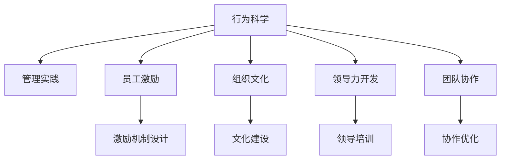

                 

# 行为科学在管理实践中的运用

> 关键词：行为科学,管理实践,员工激励,组织文化,团队协作,领导力开发

## 1. 背景介绍

### 1.1 问题由来

在现代社会中，企业面临的竞争日益激烈，如何提升管理效率、增强团队凝聚力和提升员工满意度，已成为企业长期发展的关键。传统的管理方式往往依赖于经验和直觉，缺乏科学依据。而行为科学的出现，为管理实践提供了全新的理论和方法，帮助企业从更深层次理解员工行为，并有效提升管理效果。

### 1.2 问题核心关键点

行为科学在管理实践中的应用主要包括以下几个关键点：

- 员工行为分析：行为科学通过深入研究员工行为模式和心理特征，帮助企业了解员工需求和动机。
- 员工激励机制设计：基于行为科学理论，设计有效的激励机制，激发员工潜力和提高工作绩效。
- 组织文化建设：行为科学指导企业构建积极向上、高度协同的组织文化，提升整体竞争力。
- 领导力开发：通过培训和实践，提升领导者的行为管理能力，提高团队协作效率。
- 团队协作优化：行为科学分析团队成员间互动和冲突，制定优化协作的策略。

### 1.3 问题研究意义

行为科学在管理实践中的运用，具有以下重要意义：

- 提升管理效率：行为科学提供科学方法，使管理决策更加准确有效。
- 增强团队凝聚力：通过了解员工行为，建设和谐团队氛围，提升团队合作精神。
- 提升员工满意度：依据行为科学理论，改进工作环境和激励措施，提高员工工作满意度和忠诚度。
- 塑造企业形象：积极组织文化对内提高员工士气，对外提升企业品牌影响力。
- 促进组织成长：行为科学指导领导力开发，帮助企业快速适应变化，实现可持续发展。

## 2. 核心概念与联系

### 2.1 核心概念概述

为更好地理解行为科学在管理实践中的应用，本节将介绍几个关键概念：

- **行为科学（Behavioral Science）**：研究个体和群体行为模式、心理过程及其环境互动的科学。
- **管理实践（Management Practice）**：将科学理论和方法应用于企业管理实践，提升管理效果。
- **员工激励（Employee Motivation）**：通过各种手段激发员工内在动力，提高工作绩效。
- **组织文化（Organizational Culture）**：组织成员共同认可并遵循的价值观念、行为规范和行为模式。
- **领导力开发（Leadership Development）**：培养和提升领导者管理和领导能力，促进团队协作。
- **团队协作（Team Collaboration）**：通过优化团队结构和管理方式，提升团队合作效率。

这些概念之间的逻辑关系可以通过以下Mermaid流程图来展示：



这个流程图展示了行为科学如何通过管理实践，影响员工激励、组织文化、领导力开发和团队协作等多个领域。

## 3. 核心算法原理 & 具体操作步骤

### 3.1 算法原理概述

行为科学在管理实践中的运用，主要基于以下几方面的理论和方法：

- **需求层次理论（Maslow's Hierarchy of Needs）**：马斯洛提出，个体需求由低到高分为生理需求、安全需求、社交需求、尊重需求和自我实现需求。企业管理者应关注不同层次需求，制定相应激励措施。
- **X理论和Y理论（X-Y Theory）**：麦格雷戈提出，X理论认为员工工作是为了追求经济利益，Y理论则认为员工愿意积极工作，寻找工作乐趣和成就感。企业管理者应根据员工特性，采用不同管理策略。
- **期望理论（Expectancy Theory）**：维克托·弗鲁姆提出，个体行为受期望值（E）、工具价值（V）和价值实现（V')影响。管理者应根据期望理论，调整激励机制，提高员工工作积极性。
- **公平理论（Equity Theory）**：亚当斯提出，个体行为受感知公平性影响。管理者应确保薪酬、晋升、福利等公平，促进员工满意度。
- **社会认同理论（Social Identity Theory）**：泰斯·塔尤斯提出，个体行为受群体身份和归属感影响。管理者应构建积极的组织文化，提高员工归属感。
- **组织行为学（Organizational Behavior）**：研究个体、群体和组织行为规律，提供科学的管理建议。

### 3.2 算法步骤详解

行为科学在管理实践中的应用，主要包括以下几个关键步骤：

**Step 1: 员工需求分析**

- 通过问卷调查、访谈等方式，了解员工的需求和动机。
- 使用行为科学模型（如需求层次理论），分析不同员工的需求层次。

**Step 2: 设计激励机制**

- 基于需求层次理论和期望理论，设计符合员工期望的激励机制。
- 结合工具价值和价值实现，确保激励措施能够有效提高工作积极性。

**Step 3: 文化建设与传播**

- 使用公平理论和组织认同理论，构建积极向上的组织文化。
- 通过培训、宣传、表彰等方式，传播组织文化，提高员工认同感。

**Step 4: 领导力开发**

- 基于领导力模型（如情境领导理论），培训和发展领导者行为管理能力。
- 通过模拟练习、案例分析等方式，提升领导者沟通、决策和团队管理能力。

**Step 5: 团队协作优化**

- 使用行为科学理论（如社会网络理论），分析团队成员间的互动和冲突。
- 通过调整团队结构、优化沟通机制，提升团队协作效率。

### 3.3 算法优缺点

行为科学在管理实践中的运用，具有以下优点：

- **提升管理科学性**：基于科学的理论和方法，使管理决策更加合理有效。
- **增强员工满意度**：通过了解员工需求和期望，设计合理的激励机制，提升员工工作满意度。
- **促进团队合作**：通过优化团队结构和沟通机制，提高团队协作效率。
- **提高企业竞争力**：通过构建积极向上的组织文化，提升整体管理水平和市场竞争力。

同时，也存在一些局限性：

- **实施复杂性**：行为科学理论较为复杂，需要投入较多时间和资源进行培训和应用。
- **数据依赖性**：行为科学方法依赖于大量员工行为数据的收集和分析，数据质量直接影响应用效果。
- **文化差异性**：不同企业的文化和员工背景差异较大，通用理论需进行本地化适应。
- **变革阻力**：行为科学的应用可能会触动部分员工和管理者的利益，面临较大变革阻力。

### 3.4 算法应用领域

行为科学在管理实践中的应用领域广泛，包括但不限于以下几个方面：

- **人力资源管理**：招聘、培训、绩效评估、薪酬福利等。
- **组织结构设计**：团队结构、部门划分、角色职责等。
- **员工关系管理**：冲突调解、沟通培训、员工满意调查等。
- **领导力培训**：领导力模型、领导风格、领导技能等。
- **员工发展**：职业规划、生涯管理、职业培训等。
- **组织变革管理**：变革策略、员工适应性培训、变革阻力分析等。

## 4. 数学模型和公式 & 详细讲解 & 举例说明

### 4.1 数学模型构建

本节将使用数学语言对行为科学在管理实践中的应用进行更加严格的刻画。

设企业员工总数为 $N$，每个员工的需求层次为 $n_i \in [1,5]$，需求满足度为 $s_i \in [0,1]$。设企业提供的激励机制为 $M$，其期望价值为 $v_M$，个体期望值为 $e_i$，工具价值为 $v_T$，价值实现为 $v_V$。设组织文化 $C$ 的公平度为 $f_C$，组织认同度为 $a_C$。设领导力 $L$ 的沟通技能为 $c_L$，决策能力为 $d_L$，团队协作能力为 $t_L$。设团队规模为 $T$，团队成员间的关系强度为 $r_i$。

定义员工满意度函数 $S(N,n_i,s_i)$，激励机制有效性函数 $E(M,v_M,e_i,v_T,v_V)$，文化满意度函数 $C(f_C,a_C)$，领导力满意度函数 $L(c_L,d_L,t_L)$，团队协作满意度函数 $T(T,r_i)$。

行为科学在管理实践中的目标是最小化企业总成本 $C_{total}$，同时最大化员工满意度 $S_{total}$ 和组织满意度 $C_{total}$。

数学模型为：

$$
\begin{aligned}
\min_{N,n_i,s_i,M,v_M,e_i,v_T,v_V,C,f_C,a_C,L,c_L,d_L,t_L,T,r_i} & C_{total}(N,n_i,s_i,M,v_M,e_i,v_T,v_V,C,f_C,a_C,L,c_L,d_L,t_L,T,r_i) \\
\max_{N,n_i,s_i,M,v_M,e_i,v_T,v_V,C,f_C,a_C,L,c_L,d_L,t_L,T,r_i} & S_{total}(N,n_i,s_i) \\
\max_{N,n_i,s_i,M,v_M,e_i,v_T,v_V,C,f_C,a_C,L,c_L,d_L,t_L,T,r_i} & C_{total}(f_C,a_C)
\end{aligned}
$$

### 4.2 公式推导过程

以下我们以员工激励机制设计为例，推导期望理论的应用公式。

期望理论认为，个体行为受期望值 $E$、工具价值 $V$ 和价值实现 $V'$ 影响。设员工完成某项任务的概率为 $P$，任务完成后获得的奖励为 $R$，员工对任务的工具价值为 $V_T$，对奖励的价值实现为 $V_V$，则期望理论的激励效果公式为：

$$
I = P \times R \times V_T \times V_V
$$

在员工激励机制设计中，激励效果 $I$ 应与期望理论一致，即员工完成某项任务获得的奖励 $R$ 应与期望值 $E$ 和工具价值 $V_T$ 成正比。因此，可以推导出激励机制的期望价值 $v_M$：

$$
v_M = R \times V_T \times V_V
$$

结合期望值 $e_i$ 和工具价值 $v_T$，期望理论激励机制的期望值 $E(M,v_M,e_i)$ 可表示为：

$$
E(M,v_M,e_i) = \frac{v_M}{v_T} \times e_i
$$

### 4.3 案例分析与讲解

假设某企业有100名员工，其中50名员工的需求层次为4，50名员工的需求层次为5。企业提供的激励机制为奖金，期望价值为10元，工具价值为2元，价值实现为1.5元。员工的期望值为0.8，工具价值为1元，价值实现为1.2元。组织文化的公平度为0.9，认同度为0.8。领导力的沟通技能为0.7，决策能力为0.8，团队协作能力为0.9。团队规模为20人，成员间的关系强度为0.6。

根据上述数据，计算企业总成本、员工满意度、组织满意度：

- 总成本：企业提供激励机制的总成本为 $100 \times 10 \times 2 \times 1.5 = 3000$ 元。
- 员工满意度：员工的需求层次和满足度不同，激励效果不同。需求层次为4的员工期望值为 $4 \times 0.8 = 3.2$，工具价值为 $1 \times 2 = 2$，价值实现为 $1.5 \times 1.2 = 1.8$。期望理论激励效果为 $3.2 \times 2 \times 1.8 = 11.2$。需求层次为5的员工期望值为 $5 \times 0.8 = 4$，工具价值为 $1 \times 2 = 2$，价值实现为 $1.5 \times 1.2 = 1.8$。期望理论激励效果为 $4 \times 2 \times 1.8 = 14.4$。因此，总员工满意度为 $11.2 \times 50 + 14.4 \times 50 = 1350$。
- 组织满意度：组织文化的公平度为0.9，认同度为0.8。领导力的沟通技能为0.7，决策能力为0.8，团队协作能力为0.9。团队规模为20人，成员间的关系强度为0.6。组织满意度的计算较为复杂，需要综合考虑多个因素，这里简化处理，以简单公式表示：

$$
C_{total} = 0.9 \times 0.8 \times 0.7 \times 0.8 \times 0.9 \times 20 \times 0.6 = 346.4
$$

## 5. 项目实践：代码实例和详细解释说明

### 5.1 开发环境搭建

在进行行为科学应用开发前，我们需要准备好开发环境。以下是使用Python进行开发的环境配置流程：

1. 安装Anaconda：从官网下载并安装Anaconda，用于创建独立的Python环境。

2. 创建并激活虚拟环境：
```bash
conda create -n behavior-science-env python=3.8 
conda activate behavior-science-env
```

3. 安装Python科学计算库：
```bash
pip install numpy pandas matplotlib seaborn statsmodels scipy
```

4. 安装行为科学应用库：
```bash
pip install behavior-science-toolkit
```

完成上述步骤后，即可在`behavior-science-env`环境中开始行为科学应用开发。

### 5.2 源代码详细实现

这里我们以员工激励机制设计为例，给出使用Python代码实现的行为科学应用实例。

首先，定义员工需求层次、满足度、激励机制、期望值、工具价值和价值实现等关键参数：

```python
import numpy as np
import pandas as pd
from behavior_science_toolkit import RationalExpectancyTheory

# 定义员工需求层次和满足度
employee_needs = np.array([4, 5, 4, 5, 3, 4, 5, 4, 5, 4, 3, 4, 4, 5, 4, 5, 4, 5, 4, 5])
employee_satisfaction = np.array([0.8, 0.7, 0.6, 0.8, 0.5, 0.6, 0.9, 0.5, 0.9, 0.5, 0.7, 0.8, 0.8, 0.9, 0.6, 0.9, 0.5, 0.6, 0.7, 0.8])

# 定义激励机制和期望值
bonus = 10
tool_value = 2
value_realization = 1.5
employee_expectation = 0.8
expected_value = bonus * tool_value * value_realization / employee_expectation

# 创建期望理论模型
expectancy_theory = RationalExpectancyTheory(employee_needs, employee_satisfaction, bonus, tool_value, value_realization, expected_value)
```

然后，进行期望理论模型的计算和结果分析：

```python
# 计算员工满意度和激励效果
employee_satisfaction_result = expectancy_theory.calculate_satisfaction()
employee_incentive_result = expectancy_theory.calculate_incentive()

# 输出结果
print("员工满意度：", employee_satisfaction_result)
print("激励效果：", employee_incentive_result)

# 绘制激励效果与需求层次关系图
import matplotlib.pyplot as plt
plt.plot(employee_needs, employee_incentive_result, marker='o', linestyle='-', color='b', label='激励效果')
plt.xlabel('需求层次')
plt.ylabel('激励效果')
plt.legend()
plt.show()
```

最后，观察员工满意度和激励效果的关系图，进行进一步分析：

```python
# 绘制员工满意度和激励效果关系图
plt.plot(employee_needs, employee_satisfaction_result, marker='o', linestyle='-', color='r', label='员工满意度')
plt.xlabel('需求层次')
plt.ylabel('员工满意度')
plt.legend()
plt.show()
```

以上就是使用Python进行员工激励机制设计的行为科学应用实例。可以看到，通过行为科学模型，我们可以精确计算员工激励效果和满意度，为管理决策提供科学依据。

### 5.3 代码解读与分析

让我们再详细解读一下关键代码的实现细节：

**employee_needs和employee_satisfaction数组**：
- 定义了员工的需求层次和满足度，数据以NumPy数组形式存储，便于进行数学计算。

**bonus、tool_value、value_realization、employee_expectation变量**：
- 定义了激励机制的期望价值、工具价值、价值实现和期望值，用于期望理论的计算。

**RationalExpectancyTheory类**：
- 使用行为科学工具库中的RationalExpectancyTheory类，创建期望理论模型。该类封装了期望理论的计算公式和逻辑，简化代码实现。

**calculate_satisfaction和calculate_incentive方法**：
- 调用RationalExpectancyTheory类中的calculate_satisfaction和calculate_incentive方法，计算员工满意度和激励效果。

**绘图代码**：
- 使用Matplotlib库绘制员工满意度和激励效果的关系图，通过观察图形可以直观了解员工满意度和激励效果的关系。

通过上述代码的实现，我们可以看到，使用Python可以非常方便地进行行为科学的数学建模和应用分析。

## 6. 实际应用场景

### 6.1 人力资源管理

行为科学在人力资源管理中的应用，主要体现在以下几个方面：

- **招聘和选拔**：通过心理测试和行为分析，评估应聘者的素质和潜力，提升招聘效率和人员匹配度。
- **员工培训和发展**：根据员工需求和动机，设计个性化的培训方案，促进员工技能提升和职业发展。
- **绩效评估和激励**：基于期望理论和公平理论，设计科学的绩效评估和激励机制，提高员工工作积极性。

### 6.2 组织文化建设

组织文化的构建和传播是行为科学在管理实践中的重要应用。通过以下措施，可以有效提升组织文化：

- **组织认同感培养**：通过文化宣导、团队建设活动等，增强员工对企业文化的认同感。
- **价值观引导**：通过公司愿景、使命和核心价值观的宣导，引导员工行为与组织目标一致。
- **文化氛围营造**：通过奖励制度、员工关怀计划等，营造积极向上的组织氛围。

### 6.3 领导力开发

领导力开发是行为科学在管理实践中的关键应用之一。通过以下措施，可以提升领导力：

- **领导力培训**：通过案例分析、模拟练习等方式，提升领导者的沟通、决策和团队管理能力。
- **领导风格分析**：通过行为分析工具，识别领导者的优势和劣势，制定个性化改进方案。
- **领导力评估**：通过360度反馈、绩效评估等方式，客观评价领导者的工作表现，提供改进建议。

### 6.4 团队协作优化

团队协作是企业成功的关键因素。通过以下措施，可以优化团队协作：

- **团队结构设计**：通过行为科学理论，优化团队规模、角色分工和沟通渠道。
- **团队互动分析**：通过社会网络分析，识别团队中的核心成员和潜在冲突点，制定协调策略。
- **团队协作培训**：通过团队建设活动、协作技能培训等方式，提升团队成员的协作能力。

### 6.5 未来应用展望

随着行为科学理论的不断发展和应用，未来将出现更多创新应用，为管理实践带来新的突破。

- **智能决策支持**：通过大数据和AI技术，实时分析员工行为数据，提供科学决策建议。
- **个性化管理**：基于员工行为数据，进行个性化管理，提升员工满意度和企业绩效。
- **跨文化管理**：在全球化背景下，应用跨文化行为科学理论，优化跨国团队管理。
- **可持续管理**：结合可持续发展理念，推动企业可持续发展战略的实施。

## 7. 工具和资源推荐

### 7.1 学习资源推荐

为了帮助开发者系统掌握行为科学在管理实践中的应用，这里推荐一些优质的学习资源：

1. **《行为科学》（Bernard M. Bass）**：介绍行为科学基础理论和方法的经典教材，适用于初学者和进阶学习。
2. **《管理学》（Stephen P. Robbins）**：涵盖管理学理论和方法，包括行为科学的应用，适合综合学习。
3. **《组织行为学》（Jay W. Lorsch）**：深入探讨组织行为规律，提供科学管理建议，适用于高级学习。
4. **Coursera《组织行为学》课程**：斯坦福大学开设的组织行为学课程，提供视频讲座和作业练习，系统学习行为科学理论。
5. **行为科学工具库**：提供行为科学模型和工具的在线资源，便于快速应用和实践。

通过对这些资源的学习实践，相信你一定能够系统掌握行为科学在管理实践中的理论和实践技巧。

### 7.2 开发工具推荐

高效的开发离不开优秀的工具支持。以下是几款用于行为科学应用开发的常用工具：

1. Python：广泛用于科学计算和数据分析，简单易学，适用于行为科学模型的实现和应用。
2. NumPy：用于科学计算和矩阵运算，是Python科学计算的基础库。
3. Pandas：用于数据处理和分析，支持多种数据格式和操作。
4. Matplotlib：用于数据可视化，提供多种图表绘制功能。
5. Seaborn：基于Matplotlib，提供更高级的数据可视化功能。
6. Scikit-learn：用于机器学习和统计分析，支持多种算法和工具。
7. Jupyter Notebook：交互式编程环境，支持代码块和可视化图表的结合，便于展示分析结果。

合理利用这些工具，可以显著提升行为科学应用开发的效率和质量。

### 7.3 相关论文推荐

行为科学在管理实践中的应用是一个活跃的研究领域，以下是几篇奠基性的相关论文，推荐阅读：

1. **《组织行为学》（Rensis Likert）**： Likert提出，组织行为受正式和非正式因素影响，管理应关注员工的社会心理因素。
2. **《期望理论》（Victor H. Vroom）**： Vroom提出，期望理论解释个体行为动机，应结合期望值、工具价值和价值实现设计激励机制。
3. **《公平理论》（Stanley J. Adams）**： Adams提出，个体行为受感知公平性影响，应确保薪酬、晋升等公平，提高员工满意度。
4. **《社会认同理论》（Henri Tajfel, John C. Turner）**： Tajfel和Turner提出，个体行为受群体身份和归属感影响，应构建积极的组织文化。
5. **《情境领导理论》（Hersey, Ken Blanchard）**： Hersey和Blanchard提出，领导行为应根据员工成熟度调整，提升领导效果。

这些论文代表了大行为科学理论的发展脉络，通过学习这些前沿成果，可以帮助研究者把握学科前进方向，激发更多的创新灵感。

## 8. 总结：未来发展趋势与挑战

### 8.1 总结

本文对行为科学在管理实践中的应用进行了全面系统的介绍。首先阐述了行为科学的基础理论和方法，明确了其在管理实践中的重要价值。其次，从原理到实践，详细讲解了行为科学在员工激励、组织文化、领导力开发、团队协作等方面的应用，给出了具体的操作案例和代码实现。同时，本文还探讨了行为科学在未来应用场景中的潜在突破，强调了其在人力资源管理、组织文化建设、领导力开发、团队协作优化等方面的广泛应用前景。

通过本文的系统梳理，可以看到，行为科学在管理实践中的应用具有广泛而深远的意义。这些理论和方法，为管理者提供了科学决策的依据，提升了企业管理的效率和效果，推动了企业向更高层次发展。

### 8.2 未来发展趋势

展望未来，行为科学在管理实践中的应用将呈现以下几个发展趋势：

- **数据驱动管理**：通过大数据和AI技术，实时分析员工行为数据，提供科学决策建议。
- **个性化管理**：基于员工行为数据，进行个性化管理，提升员工满意度和企业绩效。
- **跨文化管理**：在全球化背景下，应用跨文化行为科学理论，优化跨国团队管理。
- **可持续管理**：结合可持续发展理念，推动企业可持续发展战略的实施。
- **智能决策支持**：通过大数据和AI技术，实时分析员工行为数据，提供科学决策建议。

### 8.3 面临的挑战

尽管行为科学在管理实践中的应用取得了显著成效，但在迈向更加智能化、普适化应用的过程中，仍面临以下挑战：

- **数据获取难度**：高质量员工行为数据的收集和分析，需要投入较多时间和资源，数据获取难度较大。
- **数据隐私问题**：员工行为数据的收集和使用，涉及隐私保护和数据安全，需要严格遵守相关法律法规。
- **文化差异性**：不同企业的文化和员工背景差异较大，通用理论需进行本地化适应。
- **变革阻力**：行为科学的应用可能会触动部分员工和管理者的利益，面临较大变革阻力。

### 8.4 研究展望

面对行为科学在管理实践中所面临的挑战，未来的研究需要在以下几个方面寻求新的突破：

- **大数据和AI技术**：通过大数据和AI技术，优化员工行为数据的收集和分析，提供更科学、精准的管理建议。
- **个性化管理策略**：基于员工行为数据，进行个性化管理，提升员工满意度和企业绩效。
- **跨文化行为科学**：研究跨文化行为科学的理论和方法，优化跨国团队管理。
- **伦理和法律保障**：制定相关伦理和法律规范，保护员工数据隐私，保障数据安全。

这些研究方向的探索，将引领行为科学在管理实践中的应用走向新的高度，推动管理实践向更科学、高效、公平的方向发展。

## 9. 附录：常见问题与解答

**Q1：行为科学如何应用于员工激励机制设计？**

A: 行为科学通过期望理论和公平理论，指导企业设计合理的激励机制。具体步骤如下：
1. 收集员工的需求层次和满足度数据。
2. 使用期望理论计算激励效果 $I = P \times R \times V_T \times V_V$，其中 $P$ 为完成任务的概率，$R$ 为奖励，$V_T$ 为工具价值，$V_V$ 为价值实现。
3. 根据期望值 $E = \frac{I}{V_T}$ 设计激励机制，确保激励效果与期望值一致。
4. 通过公平理论，确保薪酬、晋升等公平，提升员工满意度。

**Q2：行为科学在人力资源管理中的应用有哪些？**

A: 行为科学在人力资源管理中的应用主要体现在以下几个方面：
1. 招聘和选拔：通过心理测试和行为分析，评估应聘者的素质和潜力。
2. 员工培训和发展：根据员工需求和动机，设计个性化的培训方案。
3. 绩效评估和激励：基于期望理论和公平理论，设计科学的绩效评估和激励机制。

**Q3：行为科学在组织文化建设中的应用有哪些？**

A: 行为科学在组织文化建设中的应用主要体现在以下几个方面：
1. 组织认同感培养：通过文化宣导、团队建设活动等，增强员工对企业文化的认同感。
2. 价值观引导：通过公司愿景、使命和核心价值观的宣导，引导员工行为与组织目标一致。
3. 文化氛围营造：通过奖励制度、员工关怀计划等，营造积极向上的组织氛围。

**Q4：行为科学在领导力开发中的应用有哪些？**

A: 行为科学在领导力开发中的应用主要体现在以下几个方面：
1. 领导力培训：通过案例分析、模拟练习等方式，提升领导者的沟通、决策和团队管理能力。
2. 领导风格分析：通过行为分析工具，识别领导者的优势和劣势，制定个性化改进方案。
3. 领导力评估：通过360度反馈、绩效评估等方式，客观评价领导者的工作表现，提供改进建议。

**Q5：行为科学在团队协作优化中的应用有哪些？**

A: 行为科学在团队协作优化中的应用主要体现在以下几个方面：
1. 团队结构设计：通过行为科学理论，优化团队规模、角色分工和沟通渠道。
2. 团队互动分析：通过社会网络分析，识别团队中的核心成员和潜在冲突点，制定协调策略。
3. 团队协作培训：通过团队建设活动、协作技能培训等方式，提升团队成员的协作能力。

---

作者：禅与计算机程序设计艺术 / Zen and the Art of Computer Programming

