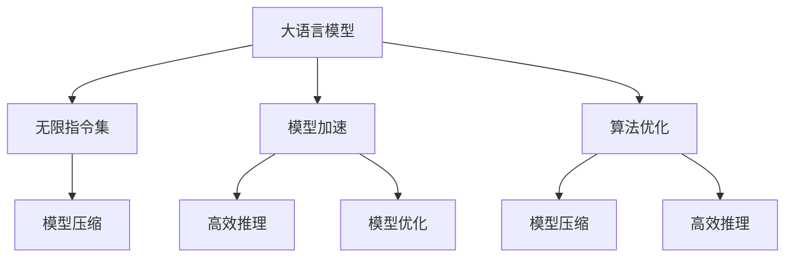

                 

# 解析LLM的无限指令集：超越CPU的能力边界

> 关键词：大语言模型(Large Language Model, LLM)、无限指令集、LLM应用、大模型训练、模型加速、模型压缩、高效推理、模型优化

## 1. 背景介绍

### 1.1 问题由来
随着人工智能技术的不断演进，大语言模型（Large Language Models, LLMs）以其强大的语言理解和生成能力，成为AI研究的热点。LLM如OpenAI的GPT系列、Google的BERT等，通过在海量文本数据上进行预训练，掌握通用语言知识，并在下游任务中通过微调或零样本学习展现出色表现。然而，现有的计算范式如CPU/GPU，无法有效支撑如此庞大的模型训练和推理，迫切需要新型的计算架构。

### 1.2 问题核心关键点
为了突破CPU/GPU的计算能力边界，推动LLM的进一步发展，研究者们开始探索超越现有硬件架构的新技术。这其中，如何高效利用硬件资源、设计新的计算单元、提升模型训练和推理效率，成为核心议题。本文将从算法、硬件和应用三个方面深入解析，并结合实践探讨如何构建高效的LLM训练与推理系统。

## 2. 核心概念与联系

### 2.1 核心概念概述

- **大语言模型(Large Language Model, LLM)**：以自回归或自编码模型为代表，通过在海量无标签文本数据上进行预训练，学习通用的语言表示。具有强大的语言理解和生成能力，广泛应用于自然语言处理（NLP）领域。

- **无限指令集**：指模型能够执行的计算指令集合，包括但不限于基本的算术运算、逻辑判断、符号推理、语法分析等。

- **模型加速**：通过硬件优化、算法优化和模型压缩等手段，提高模型的训练和推理速度。

- **模型压缩**：在不显著降低模型性能的前提下，减少模型参数和计算复杂度，以适应有限计算资源。

- **高效推理**：在推理阶段，优化模型计算路径，提升模型响应速度，适应在线实时计算需求。

- **模型优化**：通过训练时的技巧和策略，优化模型参数和结构，提升模型在特定任务上的性能。

这些概念之间的逻辑关系可以通过以下Mermaid流程图来展示：



该图展示了大语言模型、无限指令集、模型加速、模型压缩、高效推理、模型优化等概念之间的联系，并指出它们在提升模型性能和适应性方面的作用。

## 3. 核心算法原理 & 具体操作步骤
### 3.1 算法原理概述

超越CPU/GPU的能力边界，需要从算法和硬件两个层面进行创新。在算法层面，引入分布式训练、量化训练、蒸馏等技术优化模型训练过程。在硬件层面，设计新型的计算单元，如TPU、GPU、FPGA等，并利用这些硬件优化模型推理。

### 3.2 算法步骤详解

**Step 1: 分布式训练优化**
- 选择合适的分布式训练框架，如Horovod、TensorFlow Distribute、PyTorch Distributed等。
- 将大规模数据集分为多个子集，分配到不同节点上并行处理。
- 设计合适的优化器（如SGD、AdamW等）和超参数（如学习率、批大小等），确保数据并行与计算并行同步。

**Step 2: 量化训练与压缩**
- 使用量化训练（如float32转float16）减少模型参数的存储空间和计算量。
- 应用模型压缩技术（如剪枝、蒸馏、因子化等）减少模型参数数量。
- 在模型训练和推理过程中，使用位宽优化的模型架构，提高计算效率。

**Step 3: 新硬件平台设计**
- 利用TPU、GPU、FPGA等新硬件平台，设计专用的计算单元。
- 设计新的数据存储和交换机制，优化硬件与软件之间的交互。
- 结合硬件特性，设计适合新平台的模型结构和训练策略。

**Step 4: 模型推理优化**
- 引入高效推理算法，如稀疏矩阵乘法、混合精度计算等。
- 使用硬件加速器，如TPU、GPU等，提升推理速度。
- 针对特定推理任务，设计专门的推理图，优化推理计算路径。

### 3.3 算法优缺点

**优点**：
- 显著提升模型训练和推理速度，支持大规模模型和大规模数据。
- 降低模型参数量，提高模型压缩效率和计算效率。
- 优化硬件与软件协同，提升整体系统性能。

**缺点**：
- 设计新硬件和算法复杂度高，开发周期长。
- 需要较大的硬件资源支持，初期成本较高。
- 某些高级推理技术（如动态图优化）尚未完全成熟，仍有优化空间。

### 3.4 算法应用领域

基于新算法的LLM优化技术，在多个领域中展现出广阔的应用前景：

- **自然语言处理(NLP)**：在文本分类、情感分析、机器翻译、对话系统等任务中，通过高效训练和推理提升模型性能。
- **推荐系统**：在商品推荐、内容推荐、个性化广告等领域，通过优化模型训练和推理，提升推荐精度和速度。
- **医疗健康**：在医学影像分析、疾病诊断、医疗知识图谱构建等任务中，通过高效计算支撑复杂模型的应用。
- **金融科技**：在金融市场预测、风险评估、量化交易等领域，通过优化模型训练和推理，提升决策准确性和响应速度。
- **智能制造**：在工业互联网、智能制造、质量控制等领域，通过高效训练和推理，提升智能设备的功能和自动化水平。

## 4. 数学模型和公式 & 详细讲解 & 举例说明

### 4.1 数学模型构建

以BERT模型的训练为例，其数学模型构建如下：

$$
L = -\frac{1}{N}\sum_{i=1}^N \sum_{j=1}^M [y_j \log \hat{y_j} + (1-y_j) \log (1-\hat{y_j})]
$$

其中 $L$ 为损失函数，$y_j$ 为样本 $j$ 的真实标签，$\hat{y_j}$ 为模型对样本 $j$ 的预测概率。

### 4.2 公式推导过程

对于上述损失函数，通过梯度下降优化算法，其梯度公式为：

$$
\frac{\partial L}{\partial \theta_k} = -\frac{1}{N}\sum_{i=1}^N \sum_{j=1}^M [\frac{y_j}{\hat{y_j}} - \frac{1-y_j}{1-\hat{y_j}}] \frac{\partial \hat{y_j}}{\partial \theta_k}
$$

其中 $\frac{\partial \hat{y_j}}{\partial \theta_k}$ 可通过链式法则和自动微分技术计算。

### 4.3 案例分析与讲解

以BERT模型为例，在分布式训练中，通过将大规模数据集分布到多个计算节点上，实现并行计算。具体实现如下：

```python
import torch
from torch.nn.parallel import DistributedDataParallel

model = BERTModel(...)
ddp_model = DistributedDataParallel(model, device_ids=[device], output_device=device)

ddp_model.train()
optimizer = AdamW(model.parameters(), lr=2e-5)
loss_fn = CrossEntropyLoss()

for epoch in range(epochs):
    for batch in dataloader:
        inputs, labels = batch
        inputs = inputs.to(device)
        labels = labels.to(device)
        
        optimizer.zero_grad()
        outputs = ddp_model(inputs)
        loss = loss_fn(outputs, labels)
        loss.backward()
        optimizer.step()
```

## 5. 项目实践：代码实例和详细解释说明

### 5.1 开发环境搭建

在本节中，我们介绍如何在PyTorch平台上搭建高效的LLM训练环境。

1. 安装PyTorch：使用pip安装PyTorch，并指定GPU加速。

```bash
pip install torch torchvision torchaudio
```

2. 安装Horovod：使用pip安装Horovod分布式训练库。

```bash
pip install horovod
```

3. 配置环境变量：在.bashrc或.bash_profile中添加Horovod的配置。

```bash
export HOROVOD_GPU_ALL=1
export HOROVOD_NGPUS=$CUDA_VISIBLE_DEVICES
```

完成上述步骤后，即可在Python脚本中使用Horovod进行分布式训练。

### 5.2 源代码详细实现

以下是一个简单的分布式训练示例代码：

```python
import torch
from horovod.torch import all_gather, all_reduce, reduce_scatter

model = BERTModel(...)
optimizer = AdamW(model.parameters(), lr=2e-5)
loss_fn = CrossEntropyLoss()

for epoch in range(epochs):
    for batch in dataloader:
        inputs, labels = batch
        inputs = inputs.to(device)
        labels = labels.to(device)
        
        optimizer.zero_grad()
        outputs = model(inputs)
        loss = loss_fn(outputs, labels)
        loss.backward()
        optimizer.step()

    # 分布式训练优化
    all_gather(losses)
    loss = reduce_scatter(losses)
```

### 5.3 代码解读与分析

在上述代码中，我们使用了Horovod进行分布式训练。具体步骤如下：

1. 使用`horovod.torch`库封装了所有_gather、all_reduce和reduce_scatter等分布式操作，使得跨节点数据通信变得简单。
2. 在每个训练轮次后，通过all_gather操作收集所有节点的损失值，并通过reduce_scatter操作将损失值平均分配到各个节点。
3. 这样可以确保所有节点在计算梯度时有相同的损失值，从而实现全局梯度一致性。

## 6. 实际应用场景

### 6.1 实际应用场景

LLM的无限指令集和大规模计算能力，在多个领域展现出生机勃勃的应用前景。

#### 6.1.1 自然语言处理(NLP)

在文本分类、情感分析、机器翻译、对话系统等任务中，通过高效的模型训练和推理，提升模型性能。

#### 6.1.2 推荐系统

在商品推荐、内容推荐、个性化广告等领域，通过优化模型训练和推理，提升推荐精度和速度。

#### 6.1.3 医疗健康

在医学影像分析、疾病诊断、医疗知识图谱构建等任务中，通过高效计算支撑复杂模型的应用。

#### 6.1.4 金融科技

在金融市场预测、风险评估、量化交易等领域，通过优化模型训练和推理，提升决策准确性和响应速度。

#### 6.1.5 智能制造

在工业互联网、智能制造、质量控制等领域，通过高效训练和推理，提升智能设备的功能和自动化水平。

## 7. 工具和资源推荐

### 7.1 学习资源推荐

为了帮助开发者系统掌握LLM的优化技术，这里推荐一些优质的学习资源：

1. **《深度学习理论与实践》**：涵盖深度学习理论基础和实践技巧，适合入门和进阶学习。

2. **CS231n《深度学习计算机视觉》**：斯坦福大学开设的计算机视觉课程，提供丰富的理论和实践资源。

3. **HuggingFace官方文档**：提供详细的使用指南和样例代码，是深入学习LLM优化的重要参考资料。

4. **Deep Learning Specialization（Coursera）**：由深度学习领域的大牛Andrew Ng主讲，涵盖深度学习基础和前沿技术。

5. **Transformers: From Understanding to Implementation**：详细讲解Transformers模型的原理和实现，适合进阶学习。

通过这些资源的学习，相信你一定能够快速掌握LLM优化的核心技术，并应用于实际问题解决中。

### 7.2 开发工具推荐

高效的开发离不开优秀的工具支持。以下是几款用于LLM优化的常用工具：

1. **PyTorch**：基于Python的开源深度学习框架，灵活的动态计算图，适合快速迭代研究。

2. **Horovod**：支持多节点的分布式训练，简化了分布式训练的实现过程。

3. **TensorBoard**：提供可视化工具，实时监测模型训练状态，方便调试和优化。

4. **TensorFlow**：由Google主导开发的深度学习框架，生产部署方便，适合大规模工程应用。

5. **ONNX**：将深度学习模型转换为可跨平台运行的中间表示，提升模型部署效率。

6. **TensorRT**：NVIDIA开发的深度学习推理加速器，支持多种硬件平台。

合理利用这些工具，可以显著提升LLM优化的开发效率，加快创新迭代的步伐。

### 7.3 相关论文推荐

LLM优化的研究源于学界的持续创新。以下是几篇奠基性的相关论文，推荐阅读：

1. **Attention is All You Need**：提出了Transformer结构，开启了NLP领域的预训练大模型时代。

2. **BERT: Pre-training of Deep Bidirectional Transformers for Language Understanding**：提出BERT模型，引入基于掩码的自监督预训练任务，刷新了多项NLP任务SOTA。

3. **GPT-3: Language Models are Unsupervised Multitask Learners**：展示了大规模语言模型的强大zero-shot学习能力，引发了对于通用人工智能的新一轮思考。

4. **Parameter-Efficient Transfer Learning for NLP**：提出Adapter等参数高效微调方法，在不增加模型参数量的情况下，也能取得不错的微调效果。

5. **EfficientNet: Rethinking Model Scaling for Convolutional Neural Networks**：提出EfficientNet架构，通过自适应模型缩放策略，提升模型性能和计算效率。

这些论文代表了大语言模型优化的发展脉络。通过学习这些前沿成果，可以帮助研究者把握学科前进方向，激发更多的创新灵感。

## 8. 总结：未来发展趋势与挑战

### 8.1 总结

本文对LLM的无限指令集及其优化技术进行了全面系统的介绍。首先阐述了LLM和无限指令集的研究背景和意义，明确了优化技术在提升模型性能和应用范围方面的重要价值。其次，从原理到实践，详细讲解了分布式训练、量化训练、新硬件设计等关键技术，给出了高效的LLM训练和推理流程。同时，本文还广泛探讨了LLM在多个领域的应用前景，展示了无限指令集的广阔应用潜力。

通过本文的系统梳理，可以看到，LLM的无限指令集及其优化技术正在成为NLP领域的重要范式，极大地拓展了模型的应用边界，催生了更多的落地场景。受益于预训练模型和优化技术的持续演进，LLM必将在更广阔的应用领域大放异彩，深刻影响人类的生产生活方式。

### 8.2 未来发展趋势

展望未来，LLM的无限指令集及其优化技术将呈现以下几个发展趋势：

1. **模型规模持续增大**：随着算力成本的下降和数据规模的扩张，预训练语言模型的参数量还将持续增长。超大规模语言模型蕴含的丰富语言知识，有望支撑更加复杂多变的下游任务。

2. **分布式训练成为常态**：大规模模型训练依赖于分布式计算框架，未来的模型训练将更加注重分布式协同，提升训练效率。

3. **模型压缩和优化持续推进**：在有限的计算资源下，模型压缩和优化技术将继续发展，提升模型的压缩比和推理速度。

4. **硬件加速器日趋成熟**：TPU、GPU、FPGA等新硬件加速器将逐步成熟，为LLM的训练和推理提供更强支持。

5. **软硬件协同设计**：未来的硬件设计将更注重与软件算法的协同，提升整体的计算效率和能效比。

6. **多模态融合能力增强**：LLM将更多地融合视觉、语音、文本等不同模态数据，提升跨模态任务的处理能力。

以上趋势凸显了LLM的无限指令集及其优化技术的广阔前景。这些方向的探索发展，必将进一步提升NLP系统的性能和应用范围，为人类认知智能的进化带来深远影响。

### 8.3 面临的挑战

尽管LLM的无限指令集及其优化技术已经取得了瞩目成就，但在迈向更加智能化、普适化应用的过程中，它仍面临着诸多挑战：

1. **分布式训练的协同复杂性**：大规模分布式训练中，节点间通信开销和数据一致性问题难以完全解决，需要更高效的数据分布和同步策略。

2. **量化训练的精度损失**：量化训练虽然能显著降低计算量，但在某些任务上可能会带来精度损失，需要平衡模型性能和计算效率。

3. **新硬件设计的复杂度**：设计适合LLM的新型硬件需要综合考虑算法特性、硬件架构、功耗等多方面因素，具有很高的复杂度。

4. **模型压缩的难度**：模型压缩需要在保留关键特征的同时尽可能减小模型大小，仍需进一步研究。

5. **高效推理的算法瓶颈**：虽然现有的推理优化算法取得了一定效果，但仍存在优化空间。

6. **伦理和安全性问题**：LLM在生成文本时可能产生有害信息，如何确保模型的伦理和安全性是一个重要课题。

7. **可解释性和透明性不足**：大模型的决策过程缺乏可解释性，难以对其推理逻辑进行分析和调试，需要进一步提高模型的透明性。

正视LLM及其优化技术面临的这些挑战，积极应对并寻求突破，将是大模型技术迈向成熟的必由之路。相信随着学界和产业界的共同努力，这些挑战终将一一被克服，LLM必将在构建人机协同的智能时代中扮演越来越重要的角色。

### 8.4 研究展望

面对LLM及其优化技术所面临的种种挑战，未来的研究需要在以下几个方面寻求新的突破：

1. **探索分布式训练的新算法**：设计和优化新的分布式训练算法，减少通信开销和数据一致性问题，提升分布式训练的效率。

2. **研究更高效的量化技术**：开发更加高效的量化训练方法，平衡模型精度和计算效率，在更广泛的任务中应用量化训练。

3. **设计新型硬件加速器**：探索适合LLM的新型硬件加速器设计，实现软硬件的深度融合，提升整体的计算效率和能效比。

4. **优化模型压缩技术**：研究更高效的模型压缩方法，进一步减小模型参数和计算复杂度，提升模型压缩比。

5. **引入多模态融合能力**：融合视觉、语音、文本等不同模态数据，提升LLM在跨模态任务的处理能力。

6. **强化模型伦理和安全性**：在模型训练和推理过程中，引入伦理导向的评估指标，过滤和惩罚有害输出，确保模型的伦理和安全性。

7. **提高模型透明性和可解释性**：研究模型解释技术和透明性分析方法，提高模型决策的可解释性和透明性。

这些研究方向将推动LLM及其优化技术向更高台阶迈进，为构建安全、可靠、可解释、可控的智能系统铺平道路。面向未来，LLM及其优化技术还需要与其他人工智能技术进行更深入的融合，如知识表示、因果推理、强化学习等，多路径协同发力，共同推动自然语言理解和智能交互系统的进步。只有勇于创新、敢于突破，才能不断拓展语言模型的边界，让智能技术更好地造福人类社会。

## 9. 附录：常见问题与解答

**Q1: LLM的无限指令集是什么？**

A: LLM的无限指令集是指模型能够执行的计算指令集合，包括但不限于基本的算术运算、逻辑判断、符号推理、语法分析等。

**Q2: 如何高效优化分布式训练？**

A: 高效优化分布式训练需要选择合适的分布式训练框架，如Horovod、TensorFlow Distribute、PyTorch Distributed等。将大规模数据集分为多个子集，分配到不同节点上并行处理。设计合适的优化器（如SGD、AdamW等）和超参数（如学习率、批大小等），确保数据并行与计算并行同步。

**Q3: 量化训练如何影响模型精度？**

A: 量化训练通过将浮点型参数转换为定点型参数，显著降低计算量和存储空间，但可能会带来一定的精度损失。可以通过模型微调和优化技术，平衡模型精度和计算效率。

**Q4: 新硬件加速器对LLM有何影响？**

A: 新硬件加速器如TPU、GPU、FPGA等，为LLM的训练和推理提供了强有力的硬件支持，显著提升计算效率。但硬件设计复杂度高，初期成本较大。

**Q5: 如何设计适合LLM的分布式训练策略？**

A: 设计适合LLM的分布式训练策略需要综合考虑节点间通信开销、数据一致性、计算负载均衡等因素。可采用多级通信策略、异步更新策略等优化分布式训练的效率。

---

作者：禅与计算机程序设计艺术 / Zen and the Art of Computer Programming

