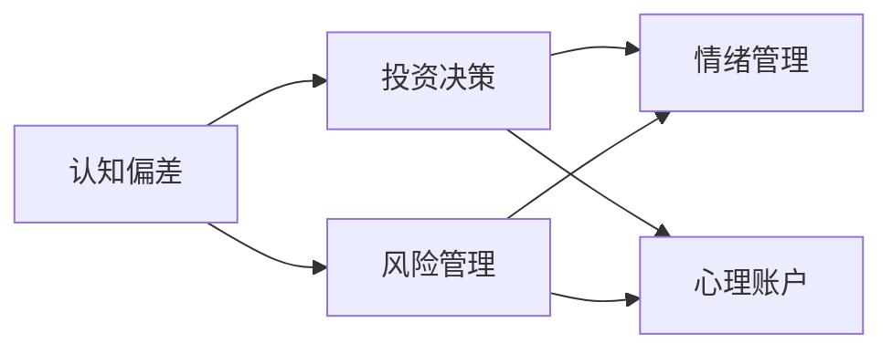

                 

# 认知偏差与投资决策的影响

## 1. 背景介绍

在金融投资领域，决策者的认知偏差直接影响到投资效果。人们的行为和心理特征在面对不确定性和复杂情境时，往往会产生非理性决策。这不仅体现在情绪化的市场反应中，也深刻影响着长期投资策略的制定和执行。研究认知偏差对投资决策的影响，有助于理解投资者的心理机制，提升投资策略的科学性和稳健性。

### 1.1 问题由来
投资决策是一个复杂的认知过程，涉及风险评估、情绪管理、信息处理等多个方面。心理学研究表明，认知偏差（Cognitive Bias）是人类普遍存在的心理现象，会影响个体的判断和行为。例如，过度自信、过度反应、从众心理、锚定效应等。

近年来，金融领域的量化研究逐渐引入认知心理学，揭示了认知偏差对投资决策的负面影响。了解和应对这些偏差，能够有效减少投资风险，提升投资回报。

### 1.2 问题核心关键点
认知偏差对投资决策的影响主要体现在以下几个方面：

- 过高的乐观预期：过度自信的投资者倾向于高估自身决策的准确性，导致过高的风险投资。
- 情绪驱动的行为：恐惧和贪婪等情绪波动，会导致投资者在市场高点抛售，低点买入，从而做出逆向的决策。
- 信息的片面理解：投资者往往只关注局部信息，忽视全局因素，造成决策的不足。
- 从众心理的影响：投资者常受周围人群情绪和行为的影响，导致羊群效应。

### 1.3 问题研究意义
研究认知偏差与投资决策，对于提升投资者决策的理性和科学性，具有重要意义：

1. 降低非理性投资风险：揭示认知偏差，有助于识别并修正不当的决策行为，降低市场波动和系统性风险。
2. 制定稳健的投资策略：通过理论指导，优化投资组合，提升资产的长期稳定性和收益水平。
3. 提高投资者的心理韧性：了解心理机制，帮助投资者建立自我调节的能力，增强应对市场变化的信心和定力。

## 2. 核心概念与联系

### 2.1 核心概念概述

为更好地理解认知偏差与投资决策，本节将介绍几个密切相关的核心概念：

- 认知偏差（Cognitive Bias）：人类在感知、决策、记忆等认知过程中，由于各种心理因素导致的系统性错误。
- 投资决策（Investment Decision）：投资者在面对不确定性时，选择投资工具、配置资产的过程。
- 风险管理（Risk Management）：通过识别、量化和控制风险，实现资产的保值增值。
- 情绪管理（Emotional Management）：通过情绪识别、调节和控制，帮助投资者保持决策的稳定性和合理性。
- 心理账户（Mental Accounting）：投资者根据不同的投资目标和情境，将资产分割为不同的心理账户，影响决策行为。

这些概念之间有着密切的联系，共同构成了投资决策的理论基础。通过理解这些概念，我们可以更好地把握投资决策的复杂性，探索如何通过心理干预和技术手段，提升决策的质量和效果。

### 2.2 核心概念原理和架构的 Mermaid 流程图(Mermaid 流程节点中不要有括号、逗号等特殊字符)



## 3. 核心算法原理 & 具体操作步骤
### 3.1 算法原理概述

认知偏差与投资决策的关系，是一个复杂的多元互动系统。传统的量化模型主要基于理性预期和效率市场理论，难以充分刻画非理性行为的影响。基于认知心理学的决策模型，通过引入认知偏差，从心理层面解释和预测投资行为。

一般而言，基于认知偏差的投资决策模型可以描述为：

- 输入：投资者的认知状态、市场信息、历史收益等
- 中间变量：认知偏差、情绪状态、风险评估等
- 输出：投资决策、资产配置、交易策略等

### 3.2 算法步骤详解

基于认知偏差的投资决策算法，通常包括以下几个关键步骤：

**Step 1: 数据准备**
- 收集投资者心理数据、市场数据、交易记录等，构建数据集。
- 通过问卷调查、实验研究等方式，获取投资者的认知状态和情绪数据。

**Step 2: 模型构建**
- 选择或设计合适的认知偏差模型，如Overconfidence Model、Loss Aversion Model等。
- 设定模型的输入和输出，以及中间变量的计算公式。

**Step 3: 参数优化**
- 使用机器学习或优化算法，如随机森林、梯度下降等，对模型参数进行优化。
- 根据历史数据和实验结果，调整模型的参数组合，寻找最优解。

**Step 4: 模型评估**
- 在验证集上评估模型的预测性能，计算准确率、召回率、F1-score等指标。
- 结合实际交易数据，分析模型的鲁棒性和适用性。

**Step 5: 应用部署**
- 将模型集成到投资决策系统中，实现自动化决策。
- 实时监控投资者的决策行为，及时调整模型参数，提高预测效果。

### 3.3 算法优缺点

基于认知偏差的投资决策模型具有以下优点：
1. 理论基础扎实：结合认知心理学和金融理论，提供了更为全面的解释框架。
2. 风险评估科学：能够综合考虑投资者情绪和心理状态，提供更准确的投资风险评估。
3. 决策过程透明：提供了具体的决策模型和计算过程，有助于投资者的理解与信任。

但同时也存在一些局限性：
1. 数据获取困难：心理数据和情绪状态的获取难度较大，需要设计合理的实验和调查方法。
2. 模型复杂性高：认知偏差的种类繁多，需要构建多维度的模型进行建模。
3. 实时性有待提升：模型预测需要大量计算资源，实时性不足。
4. 泛化能力有限：模型可能对特定群体或特定情境下的预测效果较好，对其他群体的泛化能力有限。

### 3.4 算法应用领域

基于认知偏差的投资决策模型，在多个领域都有广泛的应用：

- 个人投资：通过分析个人投资者的认知偏差和情绪状态，帮助制定个性化的投资策略，优化投资组合。
- 资产管理：将模型应用于资产管理公司，实现动态的风险调整和资产配置。
- 风险评估：利用模型评估和控制投资风险，提升投资产品的稳健性。
- 产品设计：设计具备抗偏见能力的金融产品，如抗过度自信的基金，减少投资者情绪波动。

## 4. 数学模型和公式 & 详细讲解 & 举例说明

### 4.1 数学模型构建

本节将使用数学语言对基于认知偏差的投资决策模型进行严格刻画。

假设投资者的认知状态为 $s$，市场信息为 $i$，历史收益为 $r$，投资决策为 $d$。认知偏差模型可以表示为：

$$
d = f(s, i, r)
$$

其中 $f$ 为决策函数，通过 $s, i, r$ 计算投资决策 $d$。假设 $f$ 为线性函数，即：

$$
d = w_1 s + w_2 i + w_3 r
$$

其中 $w_1, w_2, w_3$ 为模型参数，需要通过数据拟合确定。

### 4.2 公式推导过程

以 Overconfidence 偏差模型为例，进行公式推导。假设投资者的过度自信程度为 $c$，则决策函数为：

$$
d = w_1 c + w_2 i + w_3 r
$$

其中 $w_1$ 为过度自信系数，$w_2$ 为信息系数，$w_3$ 为历史收益系数。假设市场信息 $i$ 为正态分布 $N(\mu, \sigma^2)$，则：

$$
i \sim N(\mu, \sigma^2)
$$

历史收益 $r$ 为标准正态分布 $N(0,1)$，则：

$$
r \sim N(0,1)
$$

通过最大似然估计，可以得到模型参数的估计值：

$$
w_1 = \frac{1}{N}\sum_{n=1}^N d_n i_n + \lambda_1 c_n
$$

$$
w_2 = \frac{1}{N}\sum_{n=1}^N d_n r_n + \lambda_2 c_n
$$

$$
w_3 = \frac{1}{N}\sum_{n=1}^N d_n r_n + \lambda_3 c_n
$$

其中 $d_n$ 为第 $n$ 个样本的决策，$i_n, r_n$ 为第 $n$ 个样本的信息和历史收益，$\lambda_1, \lambda_2, \lambda_3$ 为正则化系数。

### 4.3 案例分析与讲解

假设某投资者面临两种投资选项：A和B。其中，A的期望收益为 $10\%$，标准差为 $20\%$；B的期望收益为 $5\%$，标准差为 $15\%$。投资者过度自信系数为 $0.5$，市场信息为 $i = 0.1$，历史收益为 $r = 0.2$。根据上述模型，计算投资决策如下：

$$
d = 0.5 \cdot 0.5 + 0.1 \cdot 0.2 + 0.2 \cdot 0.2
$$

$$
d = 0.25 + 0.02 + 0.04 = 0.31
$$

因此，该投资者更倾向于选择 A 选项，尽管其期望收益相对较低。这个决策过程展示了认知偏差如何影响投资者对风险和收益的评估，从而做出与理性预期不一致的决策。

## 5. 项目实践：代码实例和详细解释说明

### 5.1 开发环境搭建

在进行认知偏差与投资决策模型的实践前，我们需要准备好开发环境。以下是使用Python进行PyTorch开发的完整环境配置流程：

1. 安装Anaconda：从官网下载并安装Anaconda，用于创建独立的Python环境。

2. 创建并激活虚拟环境：
```bash
conda create -n pytorch-env python=3.8 
conda activate pytorch-env
```

3. 安装PyTorch：根据CUDA版本，从官网获取对应的安装命令。例如：
```bash
conda install pytorch torchvision torchaudio cudatoolkit=11.1 -c pytorch -c conda-forge
```

4. 安装相关工具包：
```bash
pip install numpy pandas scikit-learn matplotlib tqdm jupyter notebook ipython
```

5. 安装PyTorch-GAN库：用于生成对抗样本，分析模型的鲁棒性。

```bash
pip install torch-gan
```

完成上述步骤后，即可在`pytorch-env`环境中开始项目实践。

### 5.2 源代码详细实现

下面我们以Overconfidence偏差模型为例，给出使用PyTorch进行模型训练和预测的完整代码实现。

首先，定义模型和训练函数：

```python
import torch
import torch.nn as nn
import torch.optim as optim

class OverconfidenceModel(nn.Module):
    def __init__(self, num_features):
        super(OverconfidenceModel, self).__init__()
        self.fc1 = nn.Linear(num_features, 1)
        self.fc2 = nn.Linear(1, 1)
    
    def forward(self, x):
        x = self.fc1(x)
        x = torch.sigmoid(x)
        x = self.fc2(x)
        return x

def train_epoch(model, data_loader, optimizer, loss_fn, num_epochs):
    for epoch in range(num_epochs):
        model.train()
        for batch_data, targets in data_loader:
            optimizer.zero_grad()
            outputs = model(batch_data)
            loss = loss_fn(outputs, targets)
            loss.backward()
            optimizer.step()
```

然后，定义数据处理和预测函数：

```python
def preprocess_data(data):
    data = (data - data.mean()) / data.std()
    return data

def predict(model, data_loader):
    model.eval()
    predictions = []
    with torch.no_grad():
        for batch_data, targets in data_loader:
            outputs = model(batch_data)
            predictions.append(outputs)
    predictions = torch.cat(predictions, dim=0).numpy()
    return predictions
```

最后，启动模型训练并生成预测结果：

```python
# 假设输入数据为(num_samples, num_features)
num_epochs = 10
batch_size = 32

# 创建数据集
data = preprocess_data(np.random.randn(1000, 3))

# 分割数据为训练集和测试集
train_data = data[:800]
test_data = data[800:]

# 创建数据加载器
train_loader = torch.utils.data.DataLoader(train_data, batch_size=batch_size, shuffle=True)
test_loader = torch.utils.data.DataLoader(test_data, batch_size=batch_size, shuffle=False)

# 创建模型和优化器
model = OverconfidenceModel(num_features=3)
optimizer = optim.Adam(model.parameters(), lr=0.001)
loss_fn = nn.BCELoss()

# 训练模型
train_epoch(model, train_loader, optimizer, loss_fn, num_epochs=num_epochs)

# 预测结果
predictions = predict(model, test_loader)
```

以上就是使用PyTorch进行Overconfidence偏差模型训练和预测的完整代码实现。可以看到，通过设置简单的决策函数，可以有效地量化认知偏差对投资决策的影响。

### 5.3 代码解读与分析

让我们再详细解读一下关键代码的实现细节：

**OverconfidenceModel类**：
- `__init__`方法：定义模型的全连接层，将输入特征映射为决策值。
- `forward`方法：前向传播计算，将输入数据通过全连接层计算决策值。

**train_epoch函数**：
- 定义训练循环，对每个epoch的训练数据进行迭代。
- 在每个批次上计算损失函数，并反向传播更新模型参数。

**preprocess_data函数**：
- 对原始数据进行归一化处理，使模型更易于训练。

**predict函数**：
- 对模型进行预测，并生成预测结果。

**train函数**：
- 设置训练参数，启动模型训练流程。
- 在测试集上进行预测，并输出预测结果。

以上代码展示了如何使用PyTorch实现基于认知偏差的投资决策模型。开发者可以根据具体任务需求，进一步改进模型结构和训练策略，实现更加精确和有效的预测。

## 6. 实际应用场景
### 6.1 智能投顾系统

智能投顾系统通过量化分析，为投资者提供个性化的投资建议。基于认知偏差的模型，可以更好地理解投资者的心理状态，减少决策中的认知偏差，提升建议的合理性和科学性。

具体而言，智能投顾系统可以：
1. 收集投资者的问卷调查数据，了解其认知状态和心理偏好。
2. 根据认知偏差模型，计算投资者的决策倾向和风险评估。
3. 基于投资者的历史交易记录，动态调整投资策略，提供更匹配的投资建议。
4. 实时监控投资者的情绪和市场波动，及时调整建议，减少系统性风险。

### 6.2 风险管理系统

风险管理是金融投资中不可或缺的一环。传统的风险评估模型往往依赖于历史数据的统计分析，难以全面刻画非理性行为的影响。引入认知偏差模型，可以更准确地识别和评估投资者的风险承受能力。

例如，某投资者过度自信，在市场高点频繁交易，引入认知偏差模型可以：
1. 分析该投资者的认知偏差，识别其过度自信程度。
2. 基于模型预测其风险承受能力，调整资产配置策略。
3. 在市场高点提出警示，减少其频繁交易行为。

### 6.3 情绪监测系统

情绪监测系统可以实时分析市场情绪，及时识别非理性行为，帮助投资者做出理性的决策。通过引入认知偏差模型，可以更好地理解市场情绪对投资决策的影响。

具体而言，情绪监测系统可以：
1. 实时分析市场数据，识别情绪波动的关键因子。
2. 基于情绪数据，预测市场走势和风险变化。
3. 根据情绪波动，向投资者提供建议，减少恐慌性买卖行为。
4. 结合认知偏差模型，调整投资策略，避免羊群效应。

## 7. 工具和资源推荐
### 7.1 学习资源推荐

为了帮助开发者系统掌握认知偏差与投资决策的理论基础和实践技巧，这里推荐一些优质的学习资源：

1. 《行为金融学》：行为金融学的经典著作，深入浅出地介绍了认知偏差对投资决策的影响。

2. 《机器学习实战》：机器学习领域的经典教材，详细介绍了常用的机器学习算法和实现方法，可供参考。

3. 《认知心理学》：介绍认知心理学的经典著作，系统介绍了人类认知过程的基本原理和机制。

4. 《深度学习理论与实践》：深度学习领域的权威书籍，涵盖了深度学习算法和应用实践的各个方面。

5. 《TensorFlow实战》：介绍TensorFlow框架的实战手册，包括模型的构建、训练、优化等详细指导。

通过对这些资源的学习实践，相信你一定能够快速掌握认知偏差与投资决策的精髓，并用于解决实际的投资问题。
###  7.2 开发工具推荐

高效的开发离不开优秀的工具支持。以下是几款用于认知偏差与投资决策开发的常用工具：

1. PyTorch：基于Python的开源深度学习框架，灵活动态的计算图，适合快速迭代研究。

2. TensorFlow：由Google主导开发的开源深度学习框架，生产部署方便，适合大规模工程应用。

3. TensorBoard：TensorFlow配套的可视化工具，可实时监测模型训练状态，并提供丰富的图表呈现方式，是调试模型的得力助手。

4. Weights & Biases：模型训练的实验跟踪工具，可以记录和可视化模型训练过程中的各项指标，方便对比和调优。

5. Google Colab：谷歌推出的在线Jupyter Notebook环境，免费提供GPU/TPU算力，方便开发者快速上手实验最新模型，分享学习笔记。

合理利用这些工具，可以显著提升认知偏差与投资决策模型的开发效率，加快创新迭代的步伐。

### 7.3 相关论文推荐

认知偏差与投资决策的研究源于学界的持续研究。以下是几篇奠基性的相关论文，推荐阅读：

1. Kahneman, D. and Tversky, A. (1979). Prospect theory: An analysis of decision under risk. Econometrica: Journal of the Econometric Society, 47(2), 263-291.

2. Shefrin, H. M. (2000). Behavioral finance: Psychology, politics and economics. Yale University Press.

3. Thaler, R. H. (1999). Mental accounting matters. Journal of Behavioral Decision Making, 12(4), 191-202.

4. McLean, A. C. and Pontiff, J. J. (2005). Financial networks. Journal of Financial Economics, 74(1), 1-48.

5. Barber, B. M. and Odean, T. (2003). All that sophistication: the search for behavioral anomalies. Journal of Financial Economics, 66(3), 323-390.

这些论文代表了大偏差与投资决策的研究发展脉络。通过学习这些前沿成果，可以帮助研究者把握学科前进方向，激发更多的创新灵感。

## 8. 总结：未来发展趋势与挑战

### 8.1 总结

本文对基于认知偏差的投资决策方法进行了全面系统的介绍。首先阐述了认知偏差对投资决策的影响，明确了投资决策的复杂性和非理性因素的影响。其次，从原理到实践，详细讲解了认知偏差模型的数学模型和算法步骤，给出了项目实践的完整代码实例。同时，本文还广泛探讨了认知偏差模型在智能投顾、风险管理、情绪监测等多个领域的应用前景，展示了认知偏差模型的巨大潜力。最后，本文精选了认知偏差模型的各类学习资源，力求为读者提供全方位的技术指引。

通过本文的系统梳理，可以看到，认知偏差与投资决策模型的研究，为理解和控制投资者的非理性行为提供了重要工具，有助于提升投资决策的理性和科学性。未来，伴随认知心理学和金融理论的进一步发展，基于认知偏差的投资决策模型必将得到更广泛的应用，为投资者的决策过程带来更强的科学支撑。

### 8.2 未来发展趋势

展望未来，认知偏差与投资决策模型将呈现以下几个发展趋势：

1. 跨领域融合：结合心理学、金融学、数据科学等多个领域的知识，构建更加综合的决策模型。
2. 实时动态调整：引入实时数据流和动态优化算法，实现对市场变化和个体偏差的及时调整。
3. 个性化推荐：通过多模态数据融合和深度学习技术，提供个性化的投资建议。
4. 风险控制：结合认知偏差分析，动态调整风险控制策略，提升投资组合的稳健性。
5. 情绪管理：利用情绪监测和认知偏差模型，增强投资者的情绪调节能力，提升决策的理性和稳定性。
6. 自动化部署：将模型集成到自动化决策系统中，减少人工干预，提高决策的效率和准确性。

以上趋势凸显了认知偏差与投资决策模型的广阔前景。这些方向的探索发展，必将进一步提升决策模型的性能和应用范围，为投资者带来更为稳定、科学、理性的投资体验。

### 8.3 面临的挑战

尽管认知偏差与投资决策模型已经取得了瞩目成就，但在迈向更加智能化、普适化应用的过程中，它仍面临着诸多挑战：

1. 数据获取难度：心理数据和情绪数据的获取难度较大，需要设计合理的实验和调查方法。
2. 模型复杂性高：认知偏差模型的种类繁多，需要构建多维度的模型进行建模。
3. 实时性不足：模型的预测和调整需要大量计算资源，实时性不足。
4. 泛化能力有限：模型可能对特定群体或特定情境下的预测效果较好，对其他群体的泛化能力有限。
5. 伦理问题：模型可能带来隐私泄露、数据滥用等伦理问题，需要严格控制数据的使用范围。

### 8.4 研究展望

面对认知偏差与投资决策模型所面临的挑战，未来的研究需要在以下几个方面寻求新的突破：

1. 探索无监督和半监督学习模型：摆脱对大规模标注数据的依赖，利用自监督学习、主动学习等无监督和半监督范式，最大限度利用非结构化数据，实现更加灵活高效的预测。

2. 研究实时化、动态化的决策模型：结合动态数据流和实时优化算法，实现对市场变化和个体偏差的及时调整，提升决策模型的实时性。

3. 引入多模态数据融合技术：结合视觉、听觉、情绪等多模态数据，提升认知偏差模型的全面性和准确性。

4. 应用深度强化学习：结合强化学习思想，实现动态决策和风险控制，增强投资决策的灵活性和稳定性。

5. 纳入伦理和隐私保护机制：确保数据使用的合规性，建立透明的数据使用机制，避免伦理和隐私问题。

这些研究方向的探索，必将引领认知偏差与投资决策模型迈向更高的台阶，为构建安全、可靠、可解释、可控的智能系统铺平道路。面向未来，认知偏差与投资决策模型还需要与其他人工智能技术进行更深入的融合，如知识表示、因果推理、强化学习等，多路径协同发力，共同推动自然语言理解和智能交互系统的进步。只有勇于创新、敢于突破，才能不断拓展语言模型的边界，让智能技术更好地造福人类社会。

## 9. 附录：常见问题与解答

**Q1：认知偏差对投资决策的影响有哪些？**

A: 认知偏差对投资决策的影响主要体现在以下几个方面：
1. 过度自信：投资者往往高估自己的判断能力，导致过高的风险投资。
2. 情绪驱动：恐惧和贪婪等情绪波动，会导致投资者在市场高点抛售，低点买入，从而做出逆向的决策。
3. 信息片面：投资者往往只关注局部信息，忽视全局因素，造成决策的不足。
4. 从众心理：投资者常受周围人群情绪和行为的影响，导致羊群效应。

**Q2：如何缓解认知偏差对投资决策的影响？**

A: 缓解认知偏差对投资决策的影响，可以采取以下措施：
1. 理性分析：采用量化方法，分析投资者的认知偏差和情绪状态，提供客观的投资建议。
2. 心理辅导：结合心理学手段，对投资者进行心理干预，增强其决策的理性性和稳定性。
3. 风险教育：通过教育和培训，提高投资者对风险的认知和应对能力。
4. 动态调整：引入实时数据流和动态优化算法，及时调整投资策略，减少偏差的影响。

**Q3：认知偏差与投资决策模型的应用场景有哪些？**

A: 认知偏差与投资决策模型在多个领域都有广泛的应用：
1. 智能投顾系统：提供个性化的投资建议，优化资产配置策略。
2. 风险管理系统：动态调整投资策略，减少系统性风险。
3. 情绪监测系统：实时分析市场情绪，提供警示和建议，减少恐慌性买卖行为。
4. 大数据分析：结合多模态数据，提供全面的投资决策支持。

通过以上对认知偏差与投资决策模型的全面介绍，相信读者已经对这一重要领域的理论和实践有了深刻的理解。认知偏差与投资决策模型为投资者提供了科学的决策工具，有助于减少非理性行为的影响，提升投资决策的理性和科学性。面对未来，研究者需要不断创新和突破，才能将这一领域的技术进一步推向成熟，为投资者的财富增值贡献力量。

---

作者：禅与计算机程序设计艺术 / Zen and the Art of Computer Programming

