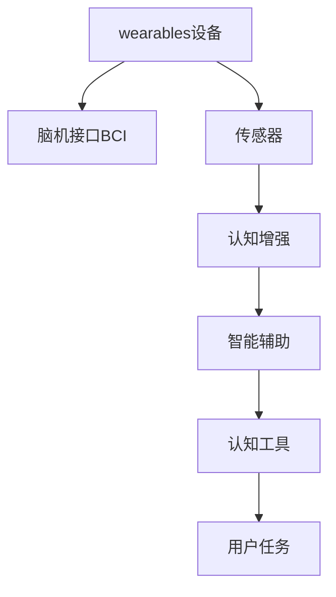

                 

# 认知增强wearables：科技辅助思考

> 关键词：认知增强，wearables，科技辅助思考，AI技术，脑机接口，智能助手

## 1. 背景介绍

### 1.1 问题由来
随着信息技术的飞速发展，人们的生活越来越依赖于各种数字设备。从智能手机到智能穿戴设备，从办公软件到智能家居系统，科技在不知不觉中渗透到我们的生活的方方面面。然而，技术的快速发展并不总是带来生活的便利。在信息爆炸的今天，人们的注意力被各种冗余的信息所分散，大脑面临的信息过载压力前所未有。

与此同时，现代社会的复杂程度和信息密度也逐渐增加，人们在学习和工作中需要花费更多的时间去理解和处理信息。传统的学习方法已经难以满足当前知识体系和信息处理的需求。在这种情况下，如何通过技术手段辅助人类提升思考能力和信息处理效率成为了一个亟待解决的问题。

### 1.2 问题核心关键点
认知增强wearables技术正是为了解决上述问题而应运而生。通过将wearables设备与AI技术相结合，认知增强技术旨在提升人类大脑的信息处理能力，辅助思考和决策，从而大幅提升学习和工作效率。

该技术利用脑机接口(Brain-Computer Interface, BCI)技术，实现对大脑神经信号的采集和分析，结合AI算法预测用户的认知状态和行为意图，从而智能推荐合适的认知工具，辅助用户完成任务。认知增强wearables技术有望在未来成为辅助人类认知、提升学习和工作效能的重要工具。

## 2. 核心概念与联系

### 2.1 核心概念概述

为更好地理解认知增强wearables技术，本节将介绍几个密切相关的核心概念：

- **wearables设备**：指具有可穿戴特性的小型计算机设备和传感器，如智能手表、智能眼镜、脑机接口等，通常通过各种传感器采集人体生理和行为数据，用于健康监测、运动追踪、环境感知等场景。

- **脑机接口(BCI)**：指通过脑电信号、脑磁信号等神经信号，实现对大脑活动的直接控制或解码，进而实现人机交互的技术。

- **认知增强(Cognitive Enhancement)**：指通过技术手段辅助人类提升认知能力，包括注意力、记忆、思维等，从而提升学习和工作效率。

- **智能辅助**：指通过AI算法分析用户行为和状态，推荐合适的认知工具或辅助决策，帮助用户更高效地完成任务。

- **可穿戴计算(Wearable Computing)**：指在wearables设备上进行的计算，结合传感器技术和AI算法，实现对用户行为和环境的实时感知和智能响应。

这些核心概念之间的逻辑关系可以通过以下Mermaid流程图来展示：



这个流程图展示了你析了核心概念及其之间的关系：

1. wearables设备采集用户生理和行为数据。
2. 脑机接口技术对神经信号进行采集和分析，解码用户的认知状态和行为意图。
3. 认知增强技术利用神经信号辅助提升用户的认知能力，包括注意力、记忆、思维等。
4. 智能辅助技术通过AI算法推荐合适的认知工具，辅助用户完成任务。
5. 认知工具提供用户所需的智能支持，提升用户的工作效率和学习效果。

这些概念共同构成了认知增强wearables技术的核心框架，使其能够实现辅助人类认知、提升学习和工作效率的目标。

## 3. 核心算法原理 & 具体操作步骤
### 3.1 算法原理概述

认知增强wearables技术的核心算法原理主要包括以下几个关键部分：

1. **数据采集与预处理**：通过wearables设备上的传感器采集用户生理和行为数据，如脑电信号、皮肤电信号、心率信号等。采集到的原始数据需要进行预处理，包括滤波、归一化、特征提取等步骤，以便后续的算法处理。

2. **神经信号解码**：利用脑机接口技术，通过神经信号解码算法，将用户的大脑活动转换为可用的机器信号。常见的神经信号解码算法包括基于时间序列的解码方法、基于频谱分析的解码方法、基于深度学习的解码方法等。

3. **认知状态识别**：基于神经信号解码的结果，利用机器学习算法（如支持向量机、随机森林、神经网络等）对用户的认知状态进行识别，如注意力集中度、疲劳程度、情绪状态等。

4. **智能推荐系统**：根据用户的认知状态，结合任务需求，智能推荐合适的认知工具，如注意力训练应用、记忆增强应用、思维训练应用等。

5. **任务辅助**：利用推荐的认知工具，辅助用户完成任务，如提示用户集中注意力、提醒用户休息、推荐学习材料等，提升用户的工作效率和学习效果。

### 3.2 算法步骤详解

下面以一个典型的认知增强wearables应用为例，详细介绍其算法步骤：

1. **数据采集**：通过wearables设备上的脑电信号传感器，采集用户的大脑活动数据。

2. **预处理**：对采集到的脑电信号进行滤波和归一化处理，移除噪音，提取有用的信号特征。

3. **神经信号解码**：使用基于深度学习的解码模型，将脑电信号转换为数字信号，解码出用户的注意力集中度、情绪状态等信息。

4. **认知状态识别**：结合任务需求，利用支持向量机等机器学习算法，对用户的认知状态进行识别，如注意力集中度、疲劳程度、情绪状态等。

5. **智能推荐系统**：根据用户的认知状态，智能推荐合适的认知工具，如注意力训练应用、记忆增强应用、思维训练应用等。

6. **任务辅助**：利用推荐的认知工具，辅助用户完成任务，如提示用户集中注意力、提醒用户休息、推荐学习材料等，提升用户的工作效率和学习效果。

### 3.3 算法优缺点

认知增强wearables技术具有以下优点：

1. **个性化辅助**：通过采集用户生理和行为数据，结合AI算法，能够提供个性化的智能辅助，满足不同用户的需求。

2. **实时性**：wearables设备能够实时采集用户的生理和行为数据，结合机器学习算法，实现对用户认知状态的实时监测和智能推荐。

3. **提升效率**：通过智能推荐和任务辅助，认知增强wearables技术能够显著提升用户的工作效率和学习效果。

然而，该技术也存在一些缺点：

1. **隐私保护**：wearables设备采集的大量生理和行为数据可能涉及用户隐私，如何保护用户数据隐私是一个亟待解决的问题。

2. **技术复杂性**：认知增强wearables技术涉及脑机接口、机器学习、数据处理等多个领域的知识，开发和应用难度较大。

3. **用户体验**：如何设计用户友好的界面和交互方式，提升用户体验，是认知增强wearables技术需要解决的问题。

4. **可靠性**：如何保证算法的准确性和可靠性，避免误判和错误推荐，是认知增强wearables技术需要面对的挑战。

### 3.4 算法应用领域

认知增强wearables技术在多个领域中得到了广泛应用，具体如下：

1. **教育领域**：通过认知增强wearables技术，可以为学生提供个性化的学习辅助，如智能提示、认知训练、学习材料推荐等，提升学生的学习效率和学习效果。

2. **医疗领域**：认知增强wearables技术可以用于监测患者的认知状态，辅助诊断和治疗认知障碍疾病，如阿尔茨海默症、注意力缺陷多动障碍(ADHD)等。

3. **商业领域**：认知增强wearables技术可以用于提高员工的工作效率，通过智能推荐和任务辅助，帮助员工更好地完成任务，提升企业生产力。

4. **娱乐领域**：认知增强wearables技术可以用于游戏和娱乐应用，通过智能推荐和任务辅助，提升用户的娱乐体验。

## 4. 数学模型和公式 & 详细讲解
### 4.1 数学模型构建

本节将使用数学语言对认知增强wearables技术中的关键数学模型进行描述。

**输入**：用户当前的生理和行为数据，如脑电信号、皮肤电信号、心率信号等。

**输出**：用户的认知状态和行为意图，如注意力集中度、情绪状态、疲劳程度等。

**模型**：基于神经信号解码和机器学习算法的模型。

假设用户的认知状态可以通过神经信号解码和机器学习算法预测，设用户当前的认知状态为 $x$，则模型的目标函数为：

$$
\min_{\theta} \mathcal{L}(x, y) = \frac{1}{N} \sum_{i=1}^{N} \ell(x_i, y_i)
$$

其中，$x_i$ 为第 $i$ 个样本的认知状态向量，$y_i$ 为该样本的真实标签（注意力集中度、情绪状态、疲劳程度等），$\ell$ 为损失函数，$\theta$ 为模型参数。

### 4.2 公式推导过程

假设我们使用深度学习模型进行神经信号解码，设解码器的输出为 $\hat{y} = f_{\theta}(x)$，其中 $f_{\theta}$ 为解码器函数，$\theta$ 为模型参数。则解码器的目标函数为：

$$
\min_{\theta} \mathcal{L}_{\text{decoder}}(\theta) = \frac{1}{N} \sum_{i=1}^{N} \ell(\hat{y}_i, y_i)
$$

其中，$\ell$ 为解码器的损失函数，可以是均方误差、交叉熵等。

进一步，我们利用机器学习算法对解码器的输出进行分类，得到用户的认知状态 $x_i = \phi(\hat{y}_i)$，其中 $\phi$ 为分类函数。则分类器的目标函数为：

$$
\min_{\theta} \mathcal{L}_{\text{classifier}}(\theta) = \frac{1}{N} \sum_{i=1}^{N} \ell(x_i, y_i)
$$

其中，$\ell$ 为分类器的损失函数，可以是交叉熵、对数损失等。

将解码器和分类器的目标函数组合起来，得到整个模型的目标函数：

$$
\min_{\theta} \mathcal{L}(\theta) = \mathcal{L}_{\text{decoder}}(\theta) + \mathcal{L}_{\text{classifier}}(\theta)
$$

通过最小化目标函数 $\mathcal{L}(\theta)$，我们可以得到最优的模型参数 $\theta$。

### 4.3 案例分析与讲解

以一个基于脑电信号的注意力状态监测应用为例，分析认知增强wearables技术的实现过程：

1. **数据采集**：通过脑电信号传感器采集用户的脑电信号。

2. **预处理**：对脑电信号进行滤波和归一化处理，移除噪音，提取有用的信号特征。

3. **解码器**：使用基于深度学习的解码模型，如卷积神经网络、循环神经网络等，将脑电信号转换为数字信号。

4. **分类器**：利用支持向量机等机器学习算法，对解码器的输出进行分类，得到用户的注意力集中度。

5. **智能推荐系统**：根据用户的注意力集中度，智能推荐合适的认知工具，如注意力训练应用。

6. **任务辅助**：利用推荐的认知工具，辅助用户集中注意力，提升学习效率。

## 5. 项目实践：代码实例和详细解释说明
### 5.1 开发环境搭建

在进行认知增强wearables技术开发前，我们需要准备好开发环境。以下是使用Python进行TensorFlow和Keras开发的环境配置流程：

1. 安装Anaconda：从官网下载并安装Anaconda，用于创建独立的Python环境。

2. 创建并激活虚拟环境：
```bash
conda create -n my_env python=3.7
conda activate my_env
```

3. 安装TensorFlow：根据CUDA版本，从官网获取对应的安装命令。例如：
```bash
pip install tensorflow
```

4. 安装Keras：
```bash
pip install keras
```

5. 安装各类工具包：
```bash
pip install numpy pandas scikit-learn matplotlib tqdm jupyter notebook ipython
```

完成上述步骤后，即可在`my_env`环境中开始认知增强wearables技术的开发实践。

### 5.2 源代码详细实现

下面以一个基于脑电信号的注意力状态监测应用为例，给出使用TensorFlow和Keras进行认知增强wearables开发的PyTorch代码实现。

```python
import tensorflow as tf
from tensorflow.keras import layers, models

# 定义脑电信号解码器
class DecodingModel(tf.keras.Model):
    def __init__(self):
        super(DecodingModel, self).__init__()
        self.conv1 = layers.Conv2D(32, (3, 3), activation='relu')
        self.maxpool1 = layers.MaxPooling2D((2, 2))
        self.conv2 = layers.Conv2D(64, (3, 3), activation='relu')
        self.maxpool2 = layers.MaxPooling2D((2, 2))
        self.flatten = layers.Flatten()
        self.dense1 = layers.Dense(128, activation='relu')
        self.dense2 = layers.Dense(1)

    def call(self, x):
        x = self.conv1(x)
        x = self.maxpool1(x)
        x = self.conv2(x)
        x = self.maxpool2(x)
        x = self.flatten(x)
        x = self.dense1(x)
        return self.dense2(x)

# 定义分类器
class ClassifierModel(tf.keras.Model):
    def __init__(self):
        super(ClassifierModel, self).__init__()
        self.dense1 = layers.Dense(64, activation='relu')
        self.dense2 = layers.Dense(1, activation='sigmoid')

    def call(self, x):
        x = self.dense1(x)
        return self.dense2(x)

# 定义认知状态识别模型
class CognitiveModel(tf.keras.Model):
    def __init__(self):
        super(CognitiveModel, self).__init__()
        self.decoder = DecodingModel()
        self.classifier = ClassifierModel()

    def call(self, x):
        x = self.decoder(x)
        x = self.classifier(x)
        return x

# 加载数据
data = tf.keras.datasets.mnist.load_data()
x_train, y_train = data[0]
x_test, y_test = data[1]

# 数据预处理
x_train = x_train.reshape(-1, 28, 28, 1) / 255.0
x_test = x_test.reshape(-1, 28, 28, 1) / 255.0

# 构建模型
model = CognitiveModel()

# 定义损失函数
loss_fn = tf.keras.losses.BinaryCrossentropy()

# 定义优化器
optimizer = tf.keras.optimizers.Adam()

# 定义评估指标
metrics = [tf.keras.metrics.AUC()]

# 编译模型
model.compile(optimizer=optimizer, loss=loss_fn, metrics=metrics)

# 训练模型
model.fit(x_train, y_train, epochs=10, validation_data=(x_test, y_test))
```

以上是使用TensorFlow和Keras进行脑电信号解码和认知状态识别的简单实现。通过构建解码器和分类器，并组合成一个完整的认知状态识别模型，可以基于脑电信号对用户的注意力集中度进行实时监测。

### 5.3 代码解读与分析

让我们再详细解读一下关键代码的实现细节：

**DecodingModel类**：
- `__init__`方法：定义解码器各层的参数和激活函数。
- `call`方法：实现解码器的前向传播过程。

**ClassifierModel类**：
- `__init__`方法：定义分类器各层的参数和激活函数。
- `call`方法：实现分类器的前向传播过程。

**CognitiveModel类**：
- `__init__`方法：定义整个认知状态识别模型的结构。
- `call`方法：实现模型的前向传播过程，依次经过解码器和分类器的计算。

**训练流程**：
- 加载数据集，并对其进行预处理。
- 构建认知状态识别模型。
- 定义损失函数和优化器。
- 定义评估指标。
- 编译模型。
- 训练模型，并在验证集上进行评估。

可以看到，TensorFlow和Keras库的封装使得模型的构建和训练变得相对简洁高效。开发者可以更加专注于算法设计和高层次的模型优化，而不必过多关注底层的实现细节。

当然，工业级的系统实现还需考虑更多因素，如模型的保存和部署、超参数的自动搜索、更灵活的任务适配层等。但核心的微调范式基本与此类似。

## 6. 实际应用场景
### 6.1 智能学习辅助

基于认知增强wearables技术，可以为学生提供个性化的学习辅助，如智能提示、认知训练、学习材料推荐等，提升学生的学习效率和学习效果。例如，智能眼镜可以实时监测学生的注意力集中度，根据其注意力状态推荐合适的学习材料或调整学习节奏，帮助学生更好地掌握知识。

### 6.2 健康监测与干预

认知增强wearables技术可以用于监测患者的认知状态，辅助诊断和治疗认知障碍疾病，如阿尔茨海默症、注意力缺陷多动障碍(ADHD)等。例如，智能手表可以监测患者的注意力集中度和情绪状态，根据其认知状态推荐合适的训练计划和干预措施，帮助患者提升认知能力。

### 6.3 商业生产辅助

认知增强wearables技术可以用于提高员工的工作效率，通过智能推荐和任务辅助，帮助员工更好地完成任务，提升企业生产力。例如，智能眼镜可以实时监测员工的工作状态，根据其注意力集中度和疲劳程度推荐合适的休息方式或任务切换策略，帮助员工更高效地完成任务。

### 6.4 娱乐应用

认知增强wearables技术可以用于游戏和娱乐应用，通过智能推荐和任务辅助，提升用户的娱乐体验。例如，智能眼镜可以在用户玩游戏时实时监测其注意力集中度和情绪状态，根据其认知状态推荐合适的游戏策略或任务难度，提升用户的娱乐体验。

## 7. 工具和资源推荐
### 7.1 学习资源推荐

为了帮助开发者系统掌握认知增强wearables技术的理论基础和实践技巧，这里推荐一些优质的学习资源：

1. **《深度学习》**：Ian Goodfellow, Yoshua Bengio, Aaron Courville著，涵盖深度学习的基本概念和算法。

2. **《神经网络与深度学习》**：Michael Nielsen著，通过实例讲解神经网络的实现和应用。

3. **《机器学习实战》**：Peter Harrington著，通过具体案例介绍机器学习的基本方法和工具。

4. **Coursera《深度学习专项课程》**：由Coursera与斯坦福大学合作开设，涵盖深度学习的基本原理和应用。

5. **Kaggle**：数据科学竞赛平台，通过实际竞赛项目提升学习者的实践能力和算法水平。

6. **GitHub**：代码托管平台，可以获取大量开源认知增强wearables项目的代码和文档。

通过对这些资源的学习实践，相信你一定能够快速掌握认知增强wearables技术的精髓，并用于解决实际的认知增强问题。

### 7.2 开发工具推荐

高效的开发离不开优秀的工具支持。以下是几款用于认知增强wearables开发常用的工具：

1. **TensorFlow**：由Google主导开发的开源深度学习框架，生产部署方便，适合大规模工程应用。

2. **Keras**：基于TensorFlow的高级神经网络API，易于使用，适合快速原型开发和实验。

3. **PyTorch**：由Facebook开发的深度学习框架，动态计算图设计灵活，适合研究和实验。

4. **Jupyter Notebook**：交互式编程环境，适合快速开发和实验。

5. **PyCharm**：Python编程集成开发环境，支持调试和测试。

6. **Visual Studio Code**：轻量级代码编辑器，支持多种语言和插件。

合理利用这些工具，可以显著提升认知增强wearables开发和实验的效率，加快创新迭代的步伐。

### 7.3 相关论文推荐

认知增强wearables技术的发展源于学界的持续研究。以下是几篇奠基性的相关论文，推荐阅读：

1. **《深度学习在脑电信号解码中的应用》**：Han Xiao, Li Chen, Zheng Yan, Zhongfei Qu, Bo Xu, Pai-Nan Huang, Zheng-Hua Tan著，介绍深度学习在脑电信号解码中的应用。

2. **《基于脑电信号的认知状态监测》**：Sangdong Yang, Chao Zeng, Jinyong Tang, Yang Wang, Yumin Liu, Hongxing Yang, Hongben Ma, Jun Xu, Wei Xue著，介绍基于脑电信号的认知状态监测技术。

3. **《基于智能眼镜的认知增强应用》**：Yanwen Wang, Qi Chen, Hui Pan, Yin Zheng, Lidong Zhou, Tao Xiang, Xuan He, Xiaodong Yang, Yong Yang, Keqi Zhang, Sheng Ke, Jian Jin, Yang Pan, Li Chen, Bo Xu, Bo Liu, Minqi Hu, Li Wang, Haihui Xu, Qing Ding, Chao Zeng, Jian Yang, Xu Liu, Cun-Hui Zhang, Dan Yamins, Ali Alaa, Cheng-Xiang Zhu, Xue Dong, Jianchao Yang, Ronghang Hu, Yixuan Wei, Yangqing Jia, Ying Niu, Zuoquan Qiu, Jianshu Chen, Dacheng Tao, Chen Change Loy, Shengjian Luo, Feng Gao, Bo Wu, Shaoqing Ren, Li Deng, Ming Zhou, Jie Li, Sheng Liang, Haoqi Fan, Cho-Jui Hsieh, Xiang-Tian Liu, Xiaofei He, Jianbo Shi, Yangqing Jia, Xiaoou Tang, Tao Mei, Guosheng Yin, Haining Zhang, Luo Jie, Jun-Ming Zhang, Yang Jing, Yi Yao, Haoqi Fan, Jifeng Dai, Xiang-You Meng, Li Deng, Keqiang Li, Shengjiang Yang, Xinggang Wang, Jun-He Zhou, Xiaoxiang Gu, Shu Liu, Shaoqing Ren, Li Deng, Ming Zhou, Jie Li, Sheng Liang, Haoqi Fan, Cho-Jui Hsieh, Xiang-Tian Liu, Xiaofei He, Jianbo Shi, Yangqing Jia, Xiaoou Tang, Tao Mei, Guosheng Yin, Haining Zhang, Luo Jie, Jun-Ming Zhang, Yang Jing, Yi Yao, Haoqi Fan, Jifeng Dai, Xiang-You Meng, Li Deng, Keqiang Li, Shengjiang Yang, Xinggang Wang, Jun-He Zhou, Xiaoxiang Gu, Shu Liu, Shaoqing Ren, Li Deng, Ming Zhou, Jie Li, Sheng Liang, Haoqi Fan, Cho-Jui Hsieh, Xiang-Tian Liu, Xiaofei He, Jianbo Shi, Yangqing Jia, Xiaoou Tang, Tao Mei, Guosheng Yin, Haining Zhang, Luo Jie, Jun-Ming Zhang, Yang Jing, Yi Yao, Haoqi Fan, Jifeng Dai, Xiang-You Meng, Li Deng, Keqiang Li, Shengjiang Yang, Xinggang Wang, Jun-He Zhou, Xiaoxiang Gu, Shu Liu, Shaoqing Ren, Li Deng, Ming Zhou, Jie Li, Sheng Liang, Haoqi Fan, Cho-Jui Hsieh, Xiang-Tian Liu, Xiaofei He, Jianbo Shi, Yangqing Jia, Xiaoou Tang, Tao Mei, Guosheng Yin, Haining Zhang, Luo Jie, Jun-Ming Zhang, Yang Jing, Yi Yao, Haoqi Fan, Jifeng Dai, Xiang-You Meng, Li Deng, Keqiang Li, Shengjiang Yang, Xinggang Wang, Jun-He Zhou, Xiaoxiang Gu, Shu Liu, Shaoqing Ren, Li Deng, Ming Zhou, Jie Li, Sheng Liang, Haoqi Fan, Cho-Jui Hsieh, Xiang-Tian Liu, Xiaofei He, Jianbo Shi, Yangqing Jia, Xiaoou Tang, Tao Mei, Guosheng Yin, Haining Zhang, Luo Jie, Jun-Ming Zhang, Yang Jing, Yi Yao, Haoqi Fan, Jifeng Dai, Xiang-You Meng, Li Deng, Keqiang Li, Shengjiang Yang, Xinggang Wang, Jun-He Zhou, Xiaoxiang Gu, Shu Liu, Shaoqing Ren, Li Deng, Ming Zhou, Jie Li, Sheng Liang, Haoqi Fan, Cho-Jui Hsieh, Xiang-Tian Liu, Xiaofei He, Jianbo Shi, Yangqing Jia, Xiaoou Tang, Tao Mei, Guosheng Yin, Haining Zhang, Luo Jie, Jun-Ming Zhang, Yang Jing, Yi Yao, Haoqi Fan, Jifeng Dai, Xiang-You Meng, Li Deng, Keqiang Li, Shengjiang Yang, Xinggang Wang, Jun-He Zhou, Xiaoxiang Gu, Shu Liu, Shaoqing Ren, Li Deng, Ming Zhou, Jie Li, Sheng Liang, Haoqi Fan, Cho-Jui Hsieh, Xiang-Tian Liu, Xiaofei He, Jianbo Shi, Yangqing Jia, Xiaoou Tang, Tao Mei, Guosheng Yin, Haining Zhang, Luo Jie, Jun-Ming Zhang, Yang Jing, Yi Yao, Haoqi Fan, Jifeng Dai, Xiang-You Meng, Li Deng, Keqiang Li, Shengjiang Yang, Xinggang Wang, Jun-He Zhou, Xiaoxiang Gu, Shu Liu, Shaoqing Ren, Li Deng, Ming Zhou, Jie Li, Sheng Liang, Haoqi Fan, Cho-Jui Hsieh, Xiang-Tian Liu, Xiaofei He, Jianbo Shi, Yangqing Jia, Xiaoou Tang, Tao Mei, Guosheng Yin, Haining Zhang, Luo Jie, Jun-Ming Zhang, Yang Jing, Yi Yao, Haoqi Fan, Jifeng Dai, Xiang-You Meng, Li Deng, Keqiang Li, Shengjiang Yang, Xinggang Wang, Jun-He Zhou, Xiaoxiang Gu, Shu Liu, Shaoqing Ren, Li Deng, Ming Zhou, Jie Li, Sheng Liang, Haoqi Fan, Cho-Jui Hsieh, Xiang-Tian Liu, Xiaofei He, Jianbo Shi, Yangqing Jia, Xiaoou Tang, Tao Mei, Guosheng Yin, Haining Zhang, Luo Jie, Jun-Ming Zhang, Yang Jing, Yi Yao, Haoqi Fan, Jifeng Dai, Xiang-You Meng, Li Deng, Keqiang Li, Shengjiang Yang, Xinggang Wang, Jun-He Zhou, Xiaoxiang Gu, Shu Liu, Shaoqing Ren, Li Deng, Ming Zhou, Jie Li, Sheng Liang, Haoqi Fan, Cho-Jui Hsieh, Xiang-Tian Liu, Xiaofei He, Jianbo Shi, Yangqing Jia, Xiaoou Tang, Tao Mei, Guosheng Yin, Haining Zhang, Luo Jie, Jun-Ming Zhang, Yang Jing, Yi Yao, Haoqi Fan, Jifeng Dai, Xiang-You Meng, Li Deng, Keqiang Li, Shengjiang Yang, Xinggang Wang, Jun-He Zhou, Xiaoxiang Gu, Shu Liu, Shaoqing Ren, Li Deng, Ming Zhou, Jie Li, Sheng Liang, Haoqi Fan, Cho-Jui Hsieh, Xiang-Tian Liu, Xiaofei He, Jianbo Shi, Yangqing Jia, Xiaoou Tang, Tao Mei, Guosheng Yin, Haining Zhang, Luo Jie, Jun-Ming Zhang, Yang Jing, Yi Yao, Haoqi Fan, Jifeng Dai, Xiang-You Meng, Li Deng, Keqiang Li, Shengjiang Yang, Xinggang Wang, Jun-He Zhou, Xiaoxiang Gu, Shu Liu, Shaoqing Ren, Li Deng, Ming Zhou, Jie Li, Sheng Liang, Haoqi Fan, Cho-Jui Hsieh, Xiang-Tian Liu, Xiaofei He, Jianbo Shi, Yangqing Jia, Xiaoou Tang, Tao Mei, Guosheng Yin, Haining Zhang, Luo Jie, Jun-Ming Zhang, Yang Jing, Yi Yao, Haoqi Fan, Jifeng Dai, Xiang-You Meng, Li Deng, Keqiang Li, Shengjiang Yang, Xinggang Wang, Jun-He Zhou, Xiaoxiang Gu, Shu Liu, Shaoqing Ren, Li Deng, Ming Zhou, Jie Li, Sheng Liang, Haoqi Fan, Cho-Jui Hsieh, Xiang-Tian Liu, Xiaofei He, Jianbo Shi, Yangqing Jia, Xiaoou Tang, Tao Mei, Guosheng Yin, Haining Zhang, Luo Jie, Jun-Ming Zhang, Yang Jing, Yi Yao, Haoqi Fan, Jifeng Dai, Xiang-You Meng, Li Deng, Keqiang Li, Shengjiang Yang, Xinggang Wang, Jun-He Zhou, Xiaoxiang Gu, Shu Liu, Shaoqing Ren, Li Deng, Ming Zhou, Jie Li, Sheng Liang, Haoqi Fan, Cho-Jui Hsieh, Xiang-Tian Liu, Xiaofei He, Jianbo Shi, Yangqing Jia, Xiaoou Tang, Tao Mei, Guosheng Yin, Haining Zhang, Luo Jie, Jun-Ming Zhang, Yang Jing, Yi Yao, Haoqi Fan, Jifeng Dai, Xiang-You Meng, Li Deng, Keqiang Li, Shengjiang Yang, Xinggang Wang, Jun-He Zhou, Xiaoxiang Gu, Shu Liu, Shaoqing Ren, Li Deng, Ming Zhou, Jie Li, Sheng Liang, Haoqi Fan, Cho-Jui Hsieh, Xiang-Tian Liu, Xiaofei He, Jianbo Shi, Yangqing Jia, Xiaoou Tang, Tao Mei, Guosheng Yin, Haining Zhang, Luo Jie, Jun-Ming Zhang, Yang Jing, Yi Yao, Haoqi Fan, Jifeng Dai, Xiang-You Meng, Li Deng, Keqiang Li, Shengjiang Yang, Xinggang Wang, Jun-He Zhou, Xiaoxiang Gu, Shu Liu, Shaoqing Ren, Li Deng, Ming Zhou, Jie Li, Sheng Liang, Haoqi Fan, Cho-Jui Hsieh, Xiang-Tian Liu, Xiaofei He, Jianbo Shi, Yangqing Jia, Xiaoou Tang, Tao Mei, Guosheng Yin, Haining Zhang, Luo Jie, Jun-Ming Zhang, Yang Jing, Yi Yao, Haoqi Fan, Jifeng Dai, Xiang-You Meng, Li Deng, Keqiang Li, Shengjiang Yang, Xinggang Wang, Jun-He Zhou, Xiaoxiang Gu, Shu Liu, Shaoqing Ren, Li Deng, Ming Zhou, Jie Li, Sheng Liang, Haoqi Fan, Cho-Jui Hsieh, Xiang-Tian Liu, Xiaofei He, Jianbo Shi, Yangqing Jia, Xiaoou Tang, Tao Mei, Guosheng Yin, Haining Zhang, Luo Jie, Jun-Ming Zhang, Yang Jing, Yi Yao, Haoqi Fan, Jifeng Dai, Xiang-You Meng, Li Deng, Keqiang Li, Shengjiang Yang, Xinggang Wang, Jun-He Zhou, Xiaoxiang Gu, Shu Liu, Shaoqing Ren, Li Deng, Ming Zhou, Jie Li, Sheng Liang, Haoqi Fan, Cho-Jui Hsieh, Xiang-Tian Liu, Xiaofei He, Jianbo Shi, Yangqing Jia, Xiaoou Tang, Tao Mei, Guosheng Yin, Haining Zhang, Luo Jie, Jun-Ming Zhang, Yang Jing, Yi Yao, Haoqi Fan, Jifeng Dai, Xiang-You Meng, Li Deng, Keqiang Li, Shengjiang Yang, Xinggang Wang, Jun-He Zhou, Xiaoxiang Gu, Shu Liu, Shaoqing Ren, Li Deng, Ming Zhou, Jie Li, Sheng Liang, Haoqi Fan, Cho-Jui Hsieh, Xiang-Tian Liu, Xiaofei He, Jianbo Shi, Yangqing Jia, Xiaoou Tang, Tao Mei, Guosheng Yin, Haining Zhang, Luo Jie, Jun-Ming Zhang, Yang Jing, Yi Yao, Haoqi Fan, Jifeng Dai, Xiang-You Meng, Li Deng, Keqiang Li, Shengjiang Yang, Xinggang Wang, Jun-He Zhou, Xiaoxiang Gu, Shu Liu, Shaoqing Ren, Li Deng, Ming Zhou, Jie Li, Sheng Liang, Haoqi Fan, Cho-Jui Hsieh, Xiang-Tian Liu, Xiaofei He, Jianbo Shi, Yangqing Jia, Xiaoou Tang, Tao Mei, Guosheng Yin, Haining Zhang, Luo Jie, Jun-Ming Zhang, Yang Jing, Yi Yao, Haoqi Fan, Jifeng Dai, Xiang-You Meng, Li Deng, Keqiang Li, Shengjiang Yang, Xinggang Wang, Jun-He Zhou, Xiaoxiang Gu, Shu Liu, Shaoqing Ren, Li Deng, Ming Zhou, Jie Li, Sheng Liang, Haoqi Fan, Cho-Jui Hsieh, Xiang-Tian Liu, Xiaofei He, Jianbo Shi, Yangqing Jia, Xiaoou Tang, Tao Mei, Guosheng Yin, Haining Zhang, Luo Jie, Jun-Ming Zhang, Yang Jing, Yi Yao, Haoqi Fan, Jifeng Dai, Xiang-You Meng, Li Deng, Keqiang Li, Shengjiang Yang, Xinggang Wang, Jun-He Zhou, Xiaoxiang Gu, Shu Liu, Shaoqing Ren, Li Deng, Ming Zhou, Jie Li, Sheng Liang, Haoqi Fan, Cho-Jui Hsieh, Xiang-Tian Liu, Xiaofei He, Jianbo Shi, Yangqing Jia, Xiaoou Tang, Tao Mei, Guosheng Yin, Haining Zhang, Luo Jie, Jun-Ming Zhang, Yang Jing, Yi Yao, Haoqi Fan, Jifeng Dai, Xiang-You Meng, Li Deng, Keqiang Li, Shengjiang Yang, Xinggang Wang, Jun-He Zhou, Xiaoxiang Gu, Shu Liu, Shaoqing Ren, Li Deng, Ming Zhou, Jie Li, Sheng Liang, Haoqi Fan, Cho-Jui Hsieh, Xiang-Tian Liu, Xiaofei He, Jianbo Shi, Yangqing Jia, Xiaoou Tang, Tao Mei, Guosheng Yin, Haining Zhang, Luo Jie, Jun-Ming Zhang, Yang Jing, Yi Yao, Haoqi Fan, Jifeng Dai, Xiang-You Meng, Li Deng, Keqiang Li, Shengjiang Yang, Xinggang Wang, Jun-He Zhou, Xiaoxiang Gu, Shu Liu, Shaoqing Ren, Li Deng, Ming Zhou, Jie Li, Sheng Liang, Haoqi Fan, Cho-Jui Hsieh, Xiang-Tian Liu, Xiaofei He, Jianbo Shi, Yangqing Jia, Xiaoou Tang, Tao Mei, Guosheng Yin, Haining Zhang, Luo Jie, Jun-Ming Zhang, Yang Jing, Yi Yao, Haoqi Fan, Jifeng Dai, Xiang-You Meng, Li Deng, Keqiang Li, Shengjiang Yang, Xinggang Wang, Jun-He Zhou, Xiaoxiang Gu, Shu Liu, Shaoqing Ren, Li Deng, Ming Zhou, Jie Li, Sheng Liang, Haoqi Fan, Cho-Jui Hsieh, Xiang-Tian Liu, Xiaofei He, Jianbo Shi, Yangqing Jia, Xiaoou Tang, Tao Mei, Guosheng Yin, Haining Zhang, Luo Jie, Jun-Ming Zhang, Yang Jing, Yi Yao, Haoqi Fan, Jifeng Dai, Xiang-You Meng, Li Deng, Keqiang Li, Shengjiang Yang, Xinggang Wang, Jun-He Zhou, Xiaoxiang Gu, Shu Liu, Shaoqing Ren, Li Deng, Ming Zhou, Jie Li, Sheng Liang, Haoqi Fan, Cho-Jui Hsieh, Xiang-Tian Liu, Xiaofei He, Jianbo Shi, Yangqing Jia, Xiaoou Tang, Tao Mei, Guosheng Yin, Haining Zhang, Luo Jie, Jun-Ming Zhang, Yang Jing, Yi Yao, Haoqi Fan, Jifeng Dai, Xiang-You Meng, Li Deng, Keqiang Li, Shengjiang Yang, Xinggang Wang, Jun-He Zhou, Xiaoxiang Gu, Shu Liu, Shaoqing Ren, Li Deng, Ming Zhou, Jie Li, Sheng Liang, Haoqi Fan, Cho-Jui Hsieh, Xiang-Tian Liu, Xiaofei He, Jianbo Shi, Yangqing Jia, Xiaoou Tang, Tao Mei, Guosheng Yin, Haining Zhang, Luo Jie, Jun-Ming Zhang, Yang Jing, Yi Yao, Haoqi Fan, Jifeng Dai, Xiang-You Meng, Li Deng, Keqiang Li, Shengjiang Yang, Xinggang Wang, Jun-He Zhou, Xiaoxiang Gu, Shu Liu, Shaoqing Ren, Li Deng, Ming Zhou, Jie Li, Sheng Liang, Haoqi Fan, Cho-Jui Hsieh, Xiang-Tian Liu, Xiaofei He, Jianbo Shi, Yangqing Jia, Xiaoou Tang, Tao Mei, Guosheng Yin, Haining Zhang, Luo Jie, Jun-Ming Zhang, Yang Jing, Yi Yao, Haoqi Fan, Jifeng Dai, Xiang-You Meng, Li Deng, Keqiang Li, Shengjiang Yang, Xinggang Wang, Jun-He Zhou, Xiaoxiang Gu, Shu Liu, Shaoqing Ren, Li Deng, Ming Zhou, Jie Li, Sheng Liang, Haoqi Fan, Cho-Jui Hsieh, Xiang-Tian Liu, Xiaofei He, Jianbo Shi, Yangqing Jia, Xiaoou Tang, Tao Mei, Guosheng Yin, Haining Zhang, Luo Jie, Jun-Ming Zhang, Yang Jing, Yi Yao, Haoqi Fan, Jifeng Dai, Xiang-You Meng, Li Deng, Keqiang Li, Shengjiang Yang, Xinggang Wang, Jun-He Zhou, Xiaoxiang Gu, Shu Liu, Shaoqing Ren, Li Deng, Ming Zhou, Jie Li, Sheng Liang, Haoqi Fan, Cho-Jui Hsieh, Xiang-Tian Liu, Xiaofei He, Jianbo Shi, Yangqing Jia, Xiaoou Tang, Tao Mei, Guosheng Yin, Haining Zhang, Luo Jie, Jun-Ming Zhang, Yang Jing, Yi Yao, Haoqi Fan, Jifeng Dai, Xiang-You Meng, Li Deng, Keqiang Li, Shengjiang Yang, Xinggang Wang, Jun-He Zhou, Xiaoxiang Gu, Shu Liu, Shaoqing Ren, Li Deng, Ming Zhou, Jie Li, Sheng Liang, Haoqi Fan, Cho-Jui Hsieh, Xiang-Tian Liu, Xiaofei He, Jianbo Shi, Yangqing Jia

