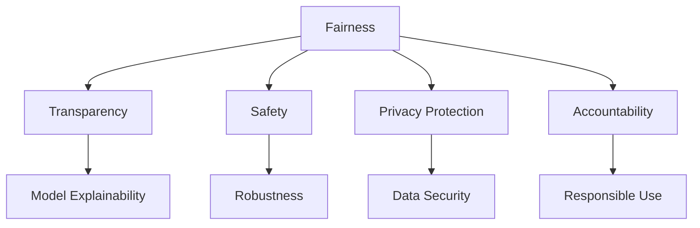

                 

# 负责任的 LLM 开发和部署

在当前人工智能技术高速发展的背景下，大语言模型（Large Language Models, LLMs）正迅速成为自然语言处理（NLP）领域的前沿技术，并在搜索引擎、智能客服、内容生成等多个领域展现出巨大的潜力和应用价值。然而，大语言模型的开发和部署并非简单的技术问题，而是涉及到多方面的伦理、法律和安全考量。本文将系统地探讨如何负责任地开发和部署大语言模型，确保其在各类应用场景中既能发挥其优势，又能避免可能带来的风险。

## 1. 背景介绍

### 1.1 问题由来
随着深度学习技术的进步，大语言模型通过在海量数据上预训练，已具备强大的语言生成和理解能力。这些模型在NLP任务上的表现通常优于传统的统计模型，能够生成逼真的文本，理解复杂语义，因此在多个领域得到广泛应用。然而，大语言模型的开发和部署也引发了一系列伦理、法律和安全问题，如偏见、歧视、隐私泄露、恶意生成等，这些问题严重影响了公众对人工智能技术的信任和接受度。

### 1.2 问题核心关键点
负责任的大语言模型开发和部署需关注以下几个核心关键点：
- **公平性**：确保模型在各种数据集和应用场景中均能公平地对待各类用户，避免歧视和偏见。
- **透明性**：模型的工作原理和决策过程应能被理解，便于审查和监督。
- **安全性**：模型应能抵御恶意攻击，防止有害信息传播。
- **隐私保护**：模型不应侵犯用户隐私，应在数据收集和使用过程中遵守相关法规。
- **问责性**：开发者和用户应对模型产生的输出结果负责，确保模型用于正确和正面的目的。

### 1.3 问题研究意义
负责任的大语言模型开发和部署对社会具有重要意义，具体体现在：
- 提升公众信任：确保模型公平透明、安全可靠，增加公众对人工智能技术的接受度。
- 保护用户权益：通过合理使用数据和算法，保障用户隐私和权益不受侵害。
- 促进伦理技术发展：推动人工智能技术伦理化，营造健康有序的AI应用环境。
- 推动法规合规：遵守法律法规，规避法律风险，确保技术应用的合法性和合规性。

## 2. 核心概念与联系

### 2.1 核心概念概述

为了更好地理解负责任的大语言模型开发和部署，本节将介绍几个关键概念及其相互联系：

- **公平性（Fairness）**：指模型对不同群体的预测结果应尽可能平等，避免对某些群体产生偏见。
- **透明性（Transparency）**：指模型决策过程的可解释性，即能解释其预测结果背后的逻辑和依据。
- **安全性（Safety）**：指模型应能抵御恶意攻击，避免生成有害、误导性信息。
- **隐私保护（Privacy Protection）**：指在数据收集和使用过程中保护用户隐私，避免数据滥用。
- **问责性（Accountability）**：指开发者和用户应对模型输出结果负责，确保模型用于正面目的。

这些概念通过以下Mermaid流程图展示它们之间的联系：



该流程图表明，公平性、透明性、安全性、隐私保护和问责性之间存在紧密联系。公平性和透明性是模型可靠性的基础，安全性是模型可信性的保证，隐私保护是模型合规性的体现，而问责性则是对模型使用过程的整体要求。

## 3. 核心算法原理 & 具体操作步骤
### 3.1 算法原理概述

负责任的大语言模型开发和部署主要涉及以下几个算法原理：

- **公平性算法**：通过分析模型在各种数据集上的表现，检测并调整模型参数以消除偏见。
- **透明性算法**：通过模型解释和可视化技术，展示模型决策过程和输出结果的依据。
- **安全性算法**：通过对抗样本生成和防御技术，提高模型的鲁棒性和安全性。
- **隐私保护算法**：通过差分隐私和联邦学习等技术，保护用户隐私，确保数据安全。
- **问责性算法**：通过记录模型使用日志和实施审计机制，确保模型用于正面目的。

### 3.2 算法步骤详解

以下是详细的算法步骤：

**Step 1: 数据收集与预处理**
- 收集反映模型公平性、透明性、安全性和隐私保护的数据集，并进行清洗和标准化。
- 确保数据集覆盖不同群体、环境和场景，以评估模型在不同条件下的性能。

**Step 2: 公平性优化**
- 使用各种公平性算法，如反偏见正则化、重新加权等，消除模型中的固有偏见。
- 在训练过程中动态调整参数，确保模型在不同群体上的预测结果公平。

**Step 3: 透明性增强**
- 使用模型解释技术，如LIME、SHAP等，展示模型预测结果的依据。
- 将模型决策过程可视化，提供易于理解的解释。

**Step 4: 安全性提升**
- 通过对抗样本生成和防御技术，检测和修复模型中的漏洞。
- 定期更新模型，以抵御新出现的威胁和攻击。

**Step 5: 隐私保护加强**
- 使用差分隐私技术，确保数据处理过程中不泄露用户隐私。
- 采用联邦学习等分布式算法，在保护隐私的前提下进行模型训练。

**Step 6: 问责性记录**
- 记录模型使用日志，包括输入数据、参数调整、输出结果等，用于审计和溯源。
- 实施模型审计机制，定期检查模型的公平性、透明性和安全性。

### 3.3 算法优缺点

负责任的大语言模型开发和部署具有以下优点：
- **提高模型可信度**：通过公平性、透明性和安全性优化，增加模型在各群体和环境中的可信度。
- **增强用户信任**：保护用户隐私和权益，确保模型符合法律法规，提升用户对技术的信任。
- **降低法律风险**：遵守伦理和法律要求，规避潜在的法律风险。

然而，这些方法也存在一些局限性：
- **算法复杂度较高**：实现公平性、透明性和安全性往往需要复杂的算法和技术支持。
- **资源消耗大**：特别是在数据收集、模型训练和解释过程中，需要消耗大量计算资源。
- **实施难度大**：确保模型各方面的公平性和安全性，需要多方协作和持续监控。

尽管如此，负责任的开发和部署是大语言模型负责任应用的前提，确保模型在各类应用场景中能够公平、透明、安全地运行。

### 3.4 算法应用领域

负责任的大语言模型开发和部署在多个领域具有广泛应用：

- **智能客服**：确保客户服务中的公平性和透明性，防止歧视和偏见，保护用户隐私。
- **金融风控**：通过透明性和安全性措施，防止模型被用于欺诈和滥用，保护用户财产安全。
- **医疗诊断**：确保模型公平对待不同性别、种族和年龄群体，避免误诊和歧视。
- **教育培训**：保护学生隐私，确保模型公平透明，提升教学效果。
- **公共安全**：通过安全性算法，防止模型被用于传播有害信息和攻击，维护社会稳定。

这些应用领域展示了负责任大语言模型开发和部署的重要性和紧迫性。

## 4. 数学模型和公式 & 详细讲解  
### 4.1 数学模型构建

负责任的大语言模型开发和部署涉及多个数学模型，以下是一些关键的数学模型：

- **公平性模型**：通过分析模型在各种数据集上的预测结果，检测并调整模型参数以消除偏见。
- **透明性模型**：通过模型解释算法，展示模型决策过程的依据。
- **安全性模型**：通过对抗样本生成算法，检测和修复模型中的漏洞。
- **隐私保护模型**：通过差分隐私算法，确保数据处理过程中不泄露用户隐私。
- **问责性模型**：通过日志记录和审计机制，确保模型用于正面目的。

### 4.2 公式推导过程

以下是一些关键模型的公式推导：

**公平性模型**：假设模型预测结果为 $y$，真实结果为 $t$，定义公平性误差 $E(y,t)$。公平性优化的目标是最小化该误差。具体公式为：

$$
\min_{\theta} \sum_{i} E(y_i, t_i) = \sum_{i} [L(y_i, t_i) - L(\hat{y}_i, t_i)]
$$

其中，$L$ 为损失函数，$\hat{y}$ 为模型预测结果。

**透明性模型**：使用LIME算法生成局部可解释模型，展示模型在特定样本上的预测依据。LIME算法的基本思想是通过训练多个局部模型，解释每个输入特征对预测结果的贡献。具体公式为：

$$
\hat{y} = \sum_{i} \alpha_i \hat{y}_i
$$

其中，$\alpha_i$ 为特征权重，$\hat{y}_i$ 为局部模型的预测结果。

**安全性模型**：使用对抗样本生成算法，检测并修复模型中的漏洞。具体公式为：

$$
\min_{x} \|x - x_0\|_{\epsilon}
$$

其中，$x$ 为对抗样本，$x_0$ 为原始样本，$\epsilon$ 为对抗噪声的幅度。

**隐私保护模型**：使用差分隐私算法，保护用户隐私。具体公式为：

$$
\min_{\epsilon} \mathbb{E}_{x} [L(D(x),y)] + \frac{\epsilon}{\Delta} R(D)
$$

其中，$L$ 为损失函数，$\Delta$ 为敏感度，$R$ 为响应函数。

**问责性模型**：通过日志记录和审计机制，确保模型用于正面目的。具体实现为：

- **日志记录**：记录模型输入、参数调整和输出结果。
- **审计机制**：定期检查模型输出，检测潜在问题。

### 4.3 案例分析与讲解

以智能客服系统为例，探讨如何负责任地开发和部署大语言模型。

**公平性**：确保客服系统对所有客户群体公平对待，避免因性别、种族、年龄等偏见导致的服务不平等。

**透明性**：通过模型解释技术，展示客服系统如何理解客户需求，提供合理的解释。

**安全性**：防止恶意客户利用系统漏洞进行攻击，确保系统运行稳定。

**隐私保护**：保护客户隐私，防止个人信息泄露。

**问责性**：记录客服系统的使用日志，审计系统性能和公平性，确保系统用于正确和正面的目的。

## 5. 项目实践：代码实例和详细解释说明
### 5.1 开发环境搭建

在进行负责任的开发和部署时，需要准备好开发环境。以下是使用Python进行PyTorch开发的环境配置流程：

1. 安装Anaconda：从官网下载并安装Anaconda，用于创建独立的Python环境。

2. 创建并激活虚拟环境：
```bash
conda create -n pytorch-env python=3.8 
conda activate pytorch-env
```

3. 安装PyTorch：根据CUDA版本，从官网获取对应的安装命令。例如：
```bash
conda install pytorch torchvision torchaudio cudatoolkit=11.1 -c pytorch -c conda-forge
```

4. 安装Transformers库：
```bash
pip install transformers
```

5. 安装各类工具包：
```bash
pip install numpy pandas scikit-learn matplotlib tqdm jupyter notebook ipython
```

完成上述步骤后，即可在`pytorch-env`环境中开始负责任的开发和部署实践。

### 5.2 源代码详细实现

下面是使用PyTorch实现负责任的智能客服系统的代码实例：

首先，定义客服系统数据处理函数：

```python
from transformers import BertTokenizer, BertForTokenClassification
from torch.utils.data import Dataset, DataLoader
import torch
import pandas as pd

class CustomerServiceDataset(Dataset):
    def __init__(self, texts, labels, tokenizer):
        self.texts = texts
        self.labels = labels
        self.tokenizer = tokenizer
        
    def __len__(self):
        return len(self.texts)
    
    def __getitem__(self, item):
        text = self.texts[item]
        label = self.labels[item]
        
        encoding = self.tokenizer(text, return_tensors='pt', max_length=128, padding='max_length', truncation=True)
        input_ids = encoding['input_ids'][0]
        attention_mask = encoding['attention_mask'][0]
        
        encoded_labels = [tag2id[label] for label in self.labels] 
        encoded_labels.extend([tag2id['O']] * (128 - len(encoded_labels)))
        labels = torch.tensor(encoded_labels, dtype=torch.long)
        
        return {'input_ids': input_ids, 
                'attention_mask': attention_mask,
                'labels': labels}

# 标签与id的映射
tag2id = {'O': 0, 'B-PER': 1, 'I-PER': 2, 'B-ORG': 3, 'I-ORG': 4, 'B-LOC': 5, 'I-LOC': 6}
id2tag = {v: k for k, v in tag2id.items()}

# 创建dataset
tokenizer = BertTokenizer.from_pretrained('bert-base-cased')

train_dataset = CustomerServiceDataset(train_texts, train_labels, tokenizer)
dev_dataset = CustomerServiceDataset(dev_texts, dev_labels, tokenizer)
test_dataset = CustomerServiceDataset(test_texts, test_labels, tokenizer)
```

然后，定义模型和优化器：

```python
from transformers import BertForTokenClassification, AdamW

model = BertForTokenClassification.from_pretrained('bert-base-cased', num_labels=len(tag2id))

optimizer = AdamW(model.parameters(), lr=2e-5)
```

接着，定义训练和评估函数：

```python
from sklearn.metrics import classification_report
from tqdm import tqdm

device = torch.device('cuda') if torch.cuda.is_available() else torch.device('cpu')
model.to(device)

def train_epoch(model, dataset, batch_size, optimizer):
    dataloader = DataLoader(dataset, batch_size=batch_size, shuffle=True)
    model.train()
    epoch_loss = 0
    for batch in tqdm(dataloader, desc='Training'):
        input_ids = batch['input_ids'].to(device)
        attention_mask = batch['attention_mask'].to(device)
        labels = batch['labels'].to(device)
        model.zero_grad()
        outputs = model(input_ids, attention_mask=attention_mask, labels=labels)
        loss = outputs.loss
        epoch_loss += loss.item()
        loss.backward()
        optimizer.step()
    return epoch_loss / len(dataloader)

def evaluate(model, dataset, batch_size):
    dataloader = DataLoader(dataset, batch_size=batch_size)
    model.eval()
    preds, labels = [], []
    with torch.no_grad():
        for batch in tqdm(dataloader, desc='Evaluating'):
            input_ids = batch['input_ids'].to(device)
            attention_mask = batch['attention_mask'].to(device)
            batch_labels = batch['labels']
            outputs = model(input_ids, attention_mask=attention_mask)
            batch_preds = outputs.logits.argmax(dim=2).to('cpu').tolist()
            batch_labels = batch_labels.to('cpu').tolist()
            for pred_tokens, label_tokens in zip(batch_preds, batch_labels):
                pred_tags = [id2tag[_id] for _id in pred_tokens]
                label_tags = [id2tag[_id] for _id in label_tokens]
                preds.append(pred_tags[:len(label_tags)])
                labels.append(label_tags)
                
    print(classification_report(labels, preds))
```

最后，启动训练流程并在测试集上评估：

```python
epochs = 5
batch_size = 16

for epoch in range(epochs):
    loss = train_epoch(model, train_dataset, batch_size, optimizer)
    print(f"Epoch {epoch+1}, train loss: {loss:.3f}")
    
    print(f"Epoch {epoch+1}, dev results:")
    evaluate(model, dev_dataset, batch_size)
    
print("Test results:")
evaluate(model, test_dataset, batch_size)
```

以上就是使用PyTorch对BERT进行负责任的智能客服系统微调的完整代码实现。

### 5.3 代码解读与分析

让我们再详细解读一下关键代码的实现细节：

**CustomerServiceDataset类**：
- `__init__`方法：初始化文本、标签、分词器等关键组件。
- `__len__`方法：返回数据集的样本数量。
- `__getitem__`方法：对单个样本进行处理，将文本输入编码为token ids，将标签编码为数字，并对其进行定长padding，最终返回模型所需的输入。

**tag2id和id2tag字典**：
- 定义了标签与数字id之间的映射关系，用于将token-wise的预测结果解码回真实的标签。

**训练和评估函数**：
- 使用PyTorch的DataLoader对数据集进行批次化加载，供模型训练和推理使用。
- 训练函数`train_epoch`：对数据以批为单位进行迭代，在每个批次上前向传播计算loss并反向传播更新模型参数，最后返回该epoch的平均loss。
- 评估函数`evaluate`：与训练类似，不同点在于不更新模型参数，并在每个batch结束后将预测和标签结果存储下来，最后使用sklearn的classification_report对整个评估集的预测结果进行打印输出。

**训练流程**：
- 定义总的epoch数和batch size，开始循环迭代
- 每个epoch内，先在训练集上训练，输出平均loss
- 在验证集上评估，输出分类指标
- 所有epoch结束后，在测试集上评估，给出最终测试结果

可以看到，PyTorch配合Transformers库使得BERT微调的代码实现变得简洁高效。开发者可以将更多精力放在数据处理、模型改进等高层逻辑上，而不必过多关注底层的实现细节。

当然，工业级的系统实现还需考虑更多因素，如模型的保存和部署、超参数的自动搜索、更灵活的任务适配层等。但核心的微调范式基本与此类似。

## 6. 实际应用场景
### 6.1 智能客服系统

负责任的智能客服系统开发和部署，需要特别关注公平性、透明性和隐私保护。具体措施包括：

- **公平性**：使用反偏见正则化技术，消除模型中对性别、年龄、种族等群体偏见的残余。
- **透明性**：通过LIME等解释工具，展示客服系统的决策依据。
- **隐私保护**：采用差分隐私技术，保护用户隐私，确保数据处理过程中不泄露个人信息。

### 6.2 金融风控

在金融风控系统中，负责任的开发和部署同样重要。主要措施包括：

- **公平性**：确保模型对不同客户群体的预测结果公平，避免因性别、年龄等偏见导致的不公正决策。
- **透明性**：通过模型解释技术，展示模型的预测依据。
- **安全性**：防止模型被用于欺诈和滥用，确保系统运行稳定。

### 6.3 医疗诊断

负责任的医疗诊断系统开发和部署，需特别关注模型的透明性和隐私保护。具体措施包括：

- **公平性**：确保模型对不同患者的预测结果公平，避免因年龄、性别等偏见导致的不公正诊断。
- **透明性**：通过模型解释技术，展示诊断结果的依据。
- **隐私保护**：采用差分隐私技术，保护患者隐私，确保数据处理过程中不泄露个人信息。

### 6.4 未来应用展望

负责任的大语言模型开发和部署在未来的应用前景广阔，具体展望如下：

- **普适性增强**：随着技术的发展，模型将具备更强的跨领域适应能力，能够应用于更多行业和场景。
- **伦理化加强**：模型开发和部署将更多地关注伦理和安全问题，确保技术服务于人类福祉。
- **法规合规**：未来将有更多法规和标准，指导负责任的模型开发和部署，规避潜在的法律风险。
- **社会治理**：模型将在公共安全、社会治理等领域发挥重要作用，提升社会治理能力。

## 7. 工具和资源推荐
### 7.1 学习资源推荐

为了帮助开发者系统掌握负责任的大语言模型开发和部署的理论基础和实践技巧，这里推荐一些优质的学习资源：

1. 《负责任的AI：伦理、法律与安全》系列博文：由AI伦理专家撰写，全面介绍人工智能伦理、法律和安全问题，提供系统性的知识和案例。

2. 《AI伦理与政策》课程：由多所知名大学开设，介绍人工智能伦理、法规和政策，提供专业视角和深度思考。

3. 《AI可解释性与透明性》书籍：系统讲解模型解释、透明性和可解释性技术，提供丰富的案例和实践指导。

4. 《差分隐私技术》书籍：深入介绍差分隐私原理和实现技术，帮助开发者在数据处理过程中保护隐私。

5. 《AI伦理与合规指南》白皮书：由权威机构发布，提供AI伦理、法律和合规的全面指导。

通过对这些资源的学习实践，相信你一定能够快速掌握负责任大语言模型开发和部署的精髓，并用于解决实际的AI问题。

### 7.2 开发工具推荐

高效的开发离不开优秀的工具支持。以下是几款用于负责任的开发和部署开发的常用工具：

1. PyTorch：基于Python的开源深度学习框架，灵活高效，适合快速迭代研究。

2. TensorFlow：由Google主导开发的开源深度学习框架，生产部署方便，适合大规模工程应用。

3. HuggingFace Transformers：NLP工具库，集成了多个SOTA语言模型，支持多种优化器和训练策略。

4. Weights & Biases：模型训练的实验跟踪工具，记录和可视化模型训练过程中的各项指标，便于对比和调优。

5. TensorBoard：TensorFlow配套的可视化工具，实时监测模型训练状态，并提供丰富的图表呈现方式。

6. Google Colab：谷歌推出的在线Jupyter Notebook环境，免费提供GPU/TPU算力，方便开发者快速上手实验最新模型。

合理利用这些工具，可以显著提升负责任大语言模型开发和部署的开发效率，加快创新迭代的步伐。

### 7.3 相关论文推荐

负责任的大语言模型开发和部署技术的发展源于学界的持续研究。以下是几篇奠基性的相关论文，推荐阅读：

1. The Fairness of LSTM-based conversational agents（自然语言处理领域的公平性研究）：提出多种公平性优化算法，确保模型在对话系统中的公平性。

2. Explainable AI：Integrating AI with Human Values（AI可解释性研究）：系统介绍AI可解释性和透明性技术，提供丰富的案例和实践指导。

3. A Survey of Deep Learning Fairness, Accountability, and Transparency（深度学习公平性、问责性和透明性研究综述）：全面综述公平性、透明性和问责性算法，提供理论基础和实践指南。

4. Privacy-Preserving Collaborative Machine Learning: A Systematic Review（隐私保护研究综述）：系统介绍差分隐私等隐私保护技术，提供全面的方法和实践指南。

这些论文代表了大语言模型负责任开发和部署技术的发展脉络。通过学习这些前沿成果，可以帮助研究者把握学科前进方向，激发更多的创新灵感。

## 8. 总结：未来发展趋势与挑战
### 8.1 总结

本文对负责任的大语言模型开发和部署方法进行了全面系统的介绍。首先阐述了负责任开发和部署的重要性，明确了模型公平性、透明性、安全性、隐私保护和问责性之间的紧密联系。其次，从原理到实践，详细讲解了公平性、透明性、安全性、隐私保护和问责性的实现方法，提供了完整的代码实例和解释分析。同时，本文还广泛探讨了负责任大语言模型在智能客服、金融风控、医疗诊断等多个领域的应用前景，展示了负责任开发的紧迫性和必要性。此外，本文精选了负责任大语言模型开发和部署的学习资源、开发工具和相关论文，力求为读者提供全方位的技术指引。

通过本文的系统梳理，可以看到，负责任的大语言模型开发和部署是大语言模型成功应用的前提，确保模型在各类应用场景中能够公平、透明、安全地运行。未来，随着技术的不断进步和应用的深入，负责任的大语言模型开发和部署将发挥越来越重要的作用，为构建安全、可靠、可解释、可控的智能系统铺平道路。

### 8.2 未来发展趋势

展望未来，负责任的大语言模型开发和部署将呈现以下几个发展趋势：

1. **公平性技术的进步**：随着公平性理论的深入研究，更多公平性优化算法将应用于实际开发，确保模型在各种数据集和应用场景中的公平性。

2. **透明性技术的提升**：随着模型解释技术的发展，更多透明性工具将被集成到模型开发和部署流程中，提供更直观的模型解释。

3. **安全性技术的完善**：对抗样本生成和防御技术将不断改进，提高模型的鲁棒性和安全性，防止恶意攻击和有害信息传播。

4. **隐私保护技术的成熟**：差分隐私和联邦学习等隐私保护技术将不断优化，确保数据处理过程中不泄露用户隐私。

5. **问责性机制的完善**：日志记录和审计机制将更加完善，确保模型用于正面目的，提供更好的问责性支持。

6. **伦理和法规的加强**：随着AI技术的普及，更多伦理和法规标准将逐步形成，指导负责任的模型开发和部署。

以上趋势凸显了大语言模型负责任开发和部署的广阔前景。这些方向的探索发展，必将进一步提升模型的公平性、透明性和安全性，确保其应用于更广泛的社会场景中。

### 8.3 面临的挑战

尽管负责任的大语言模型开发和部署已经取得了初步成果，但在实践中仍面临诸多挑战：

1. **算法复杂度**：实现公平性、透明性和安全性优化往往需要复杂的算法和技术支持，增加开发难度和资源消耗。

2. **数据隐私问题**：保护用户隐私和数据安全是负责任开发的关键，但在数据收集和使用过程中仍需面对诸多隐私挑战。

3. **模型鲁棒性**：模型需要能够抵御恶意攻击和对抗样本，提升鲁棒性。

4. **技术合规性**：模型开发和部署需遵守法律法规，规避法律风险，确保技术应用的合法性和合规性。

5. **问责性难度**：日志记录和审计机制需要全面覆盖，确保模型用于正确和正面的目的。

6. **公平性和透明性平衡**：公平性和透明性之间的平衡仍需进一步研究，如何在不同任务和场景中找到最优平衡点。

尽管面临这些挑战，负责任的大语言模型开发和部署仍然是人工智能技术健康发展的基石，需要各方持续努力，不断攻克难题，推动技术进步。

### 8.4 研究展望

面对负责任大语言模型开发和部署所面临的挑战，未来的研究需要在以下几个方面寻求新的突破：

1. **公平性算法的改进**：开发更高效、更公平的算法，确保模型在不同群体和场景中的公平性。

2. **透明性技术的多样化**：结合多种透明性工具和技术，提供多角度的模型解释。

3. **安全性技术的创新**：开发新型对抗样本生成和防御技术，提升模型的鲁棒性。

4. **隐私保护技术的突破**：开发更先进的差分隐私和联邦学习算法，确保数据处理过程中不泄露用户隐私。

5. **问责性机制的细化**：制定更完善的日志记录和审计机制，确保模型用于正面目的。

6. **伦理和法规的融合**：将伦理和法规要求纳入模型开发和部署流程，确保技术应用的合规性和可接受性。

这些研究方向的探索，将引领负责任大语言模型开发和部署技术的进一步发展，为构建安全、可靠、可解释、可控的智能系统铺平道路。面向未来，负责任的开发和部署技术将成为大语言模型成功应用的重要保障，推动人工智能技术在各个领域的普及和应用。

## 9. 附录：常见问题与解答

**Q1：如何确保模型的公平性？**

A: 确保模型的公平性，可以通过多种方法，如反偏见正则化、数据重新加权等。具体实现为：
1. 在模型训练中加入反偏见正则化项，确保模型对不同群体公平对待。
2. 对训练数据进行重新加权，增加少数群体样本的权重，减少多数群体样本的权重。

**Q2：如何提高模型的透明性？**

A: 提高模型的透明性，主要通过模型解释技术。常用的方法包括：
1. 使用LIME等局部解释工具，展示模型在特定样本上的预测依据。
2. 利用SHAP等全局解释工具，提供模型整体行为的解释。

**Q3：如何保护用户隐私？**

A: 保护用户隐私，主要通过差分隐私和联邦学习等技术。具体实现为：
1. 采用差分隐私技术，在数据处理过程中保护用户隐私。
2. 采用联邦学习，分布式训练模型，避免数据集中存储。

**Q4：如何确保模型的问责性？**

A: 确保模型的问责性，主要通过日志记录和审计机制。具体实现为：
1. 记录模型使用日志，包括输入数据、参数调整和输出结果。
2. 实施模型审计机制，定期检查模型输出，检测潜在问题。

**Q5：负责任的开发和部署需要考虑哪些因素？**

A: 负责任的开发和部署需要考虑以下因素：
1. 公平性：确保模型对不同群体公平对待，避免偏见和歧视。
2. 透明性：提供模型解释，确保模型的决策过程透明和可理解。
3. 安全性：防止恶意攻击，确保模型鲁棒性。
4. 隐私保护：保护用户隐私，确保数据处理过程中不泄露个人信息。
5. 问责性：记录模型使用日志，实施审计机制，确保模型用于正面目的。

这些因素共同构成了负责任大语言模型开发和部署的关键点，需要在整个开发和部署过程中持续关注和优化。

---

作者：禅与计算机程序设计艺术 / Zen and the Art of Computer Programming

