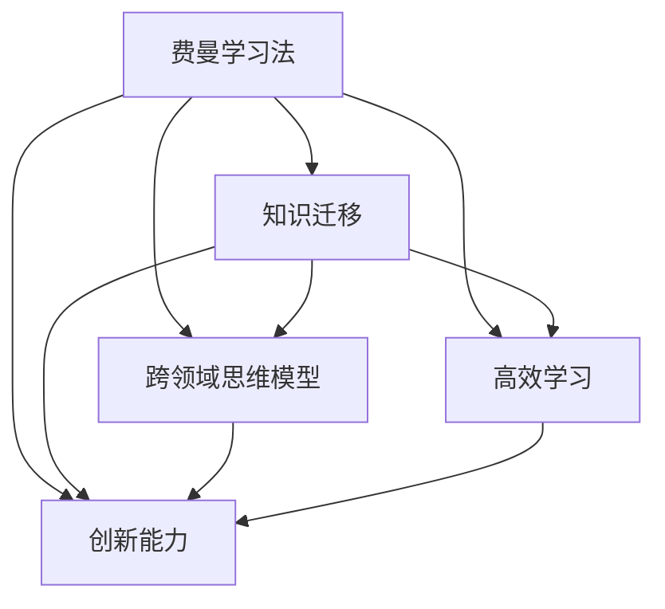

                 

# 费曼提问法:开启管理者思维升级

> 关键词：费曼学习法,管理者,思维模型,高效学习,跨领域迁移

## 1. 背景介绍

### 1.1 问题由来
在当今快速变化的商业环境中，管理者面临着多重挑战：复杂的市场环境、快速的技术迭代、日益严苛的客户需求。如何在瞬息万变的环境中保持敏锐的洞察力和高效的决策能力，成为管理者的首要任务。费曼提问法（Feynman Technique）作为一种高效的学习方法，通过深入理解知识本质，提升学习效果，帮助管理者形成跨领域的思维模型，提升决策力和创新能力。

费曼提问法源于诺贝尔物理学奖得主理查德·费曼，强调将复杂知识通过类比、比喻和问题的形式转化为可理解、可应用的知识。费曼提问法不仅适用于科学领域，更适用于所有领域，包括管理领域。

### 1.2 问题核心关键点
费曼提问法帮助管理者通过深入理解知识，提升思维的深度和广度，从而在复杂环境中做出更加准确、创新的决策。关键点包括：
- 通过类比和比喻理解复杂概念。
- 通过提出问题深入理解知识本质。
- 通过教学过程检验和强化理解。
- 将知识应用到实际管理决策中。

## 2. 核心概念与联系

### 2.1 核心概念概述

为更好地理解费曼提问法，本节将介绍几个密切相关的核心概念：

- 费曼学习法(Feynman Technique)：一种高效的学习方法，通过简化、类比和教学过程，帮助学习者深入理解复杂概念。
- 知识迁移(Knowledge Transfer)：指将某一领域学习到的知识迁移到另一个领域中应用。费曼提问法通过类比和问题化，促进知识在不同领域的迁移。
- 跨领域思维模型(Interdisciplinary Mental Models)：指在不同领域中应用的知识和思维方式，帮助管理者形成多角度、多维度的思维框架。
- 高效学习(Efficient Learning)：指通过简洁、高效的学习方法，迅速掌握知识并灵活应用。
- 创新能力(Innovation Ability)：指在复杂环境中，通过深度思考和灵活应用知识，提出创新解决方案的能力。

这些核心概念之间的逻辑关系可以通过以下Mermaid流程图来展示：



这个流程图展示了大语言模型的核心概念及其之间的关系：

1. 费曼学习法通过简化、类比和问题化，帮助理解复杂概念，促进知识迁移。
2. 知识迁移使得学习者能够将不同领域的知识应用到管理决策中。
3. 跨领域思维模型提供多角度、多维度的思维框架，帮助管理者形成创新思维。
4. 高效学习帮助迅速掌握知识，并灵活应用到实际场景。
5. 创新能力在复杂环境中，通过深度思考和知识应用，提出创新解决方案。

这些概念共同构成了费曼提问法的学习框架，使其成为管理者提升思维能力的重要工具。通过理解这些核心概念，我们可以更好地把握费曼提问法的本质和应用场景。

## 3. 核心算法原理 & 具体操作步骤
### 3.1 算法原理概述

费曼提问法作为一种学习法，其核心思想是：通过简化、类比和问题化，深入理解知识，并将知识应用到实际场景中。其核心步骤包括：
1. 选择复杂概念。
2. 简化概念，找到类比。
3. 通过问题化理解概念本质。
4. 通过教学过程检验理解。
5. 将知识应用到实际场景中。

该方法不仅适用于学术研究，更适用于管理决策。在管理实践中，管理者需要处理的信息量庞大，决策复杂。通过费曼提问法，管理者可以迅速理解复杂问题，并提出解决方案。

### 3.2 算法步骤详解

费曼提问法在学习过程中的具体步骤如下：

**Step 1: 选择复杂概念**
- 选择一个需要深入理解的概念。例如，在管理领域，可以选择“如何有效进行团队激励”。

**Step 2: 简化概念**
- 将复杂概念简化为可理解的形式。例如，“团队激励”可以简化为“如何通过正向反馈提高员工积极性”。

**Step 3: 找到类比**
- 找到与该概念类比的事物或现象。例如，“正向反馈”可以类比为“奖励”。

**Step 4: 问题化理解**
- 通过提出问题深入理解概念。例如，“如何通过奖励提高员工积极性？”可以细化为“有哪些有效的奖励方法？奖励的频率和金额如何？奖励的及时性如何影响效果？”

**Step 5: 教学过程检验**
- 将概念教学给别人，检验理解。例如，将“奖励如何提高员工积极性”的逻辑讲解给同事或下属，询问他们的理解。

**Step 6: 应用到实际场景中**
- 将理解应用到实际管理决策中。例如，基于“奖励如何提高员工积极性”的认识，设计一套合理的激励机制。

### 3.3 算法优缺点

费曼提问法在学习过程中具有以下优点：
1. 简化理解。通过类比和简化，将复杂概念转化为可理解的形式，提高学习效率。
2. 深入理解。通过问题化，深入理解知识本质，避免表面化的记忆。
3. 促进知识迁移。通过找到类比，帮助理解不同领域的知识，提升跨领域思维能力。
4. 应用性强。通过教学过程检验，确保理解准确，并将知识应用到实际管理决策中。

同时，该方法也存在一定的局限性：
1. 需要较高的理解能力。对于复杂概念，要求学习者具备一定的知识储备和思考能力。
2. 需要较多的时间和精力。通过教学和问题化，需要投入较多的时间和精力。
3. 对于特定领域的知识，需要找到合适的类比。如果找不到合适的类比，可能影响学习效果。

尽管存在这些局限性，但费曼提问法作为一种高效的学习方法，在管理决策中仍有广泛的应用价值。未来相关研究的重点在于如何进一步优化类比和问题化的设计，提升知识迁移和应用效果。

### 3.4 算法应用领域

费曼提问法在管理领域具有广泛的应用，特别是在以下几个方面：

- **战略规划**：管理者通过简化、类比和问题化，深入理解市场趋势、竞争态势等复杂概念，制定战略规划。
- **团队管理**：管理者通过费曼提问法理解团队成员的需求、激励机制等，优化团队管理。
- **绩效评估**：管理者通过简化、类比和问题化，深入理解绩效指标的构成、影响因素等，制定科学的绩效评估体系。
- **产品管理**：管理者通过费曼提问法理解用户需求、市场反馈等复杂概念，优化产品设计和迭代。
- **创新管理**：管理者通过费曼提问法深入理解创新过程、风险管理等，提升企业创新能力。

除了这些经典应用外，费曼提问法还被创新性地应用到更多场景中，如市场研究、项目管理、人力资源管理等，为企业管理提供新的思维框架。

## 4. 数学模型和公式 & 详细讲解  
### 4.1 数学模型构建

本节将使用数学语言对费曼提问法进行更加严格的刻画。

假设一个复杂概念 $C$，其简化形式为 $S$，类比为 $A$。费曼提问法通过问题化，将其转化为一系列子问题 $Q_1, Q_2, ..., Q_n$，其中 $Q_i$ 表示 $C$ 的一个子问题，需要深入理解。

通过教学过程，费曼提问法验证理解，将问题 $Q_i$ 转化为实际应用问题 $P_i$，并在实际应用中检验理解。

### 4.2 公式推导过程

设 $C$ 为复杂概念，$S$ 为其简化形式，$A$ 为其类比。通过问题化 $C$，转化为 $Q_1, Q_2, ..., Q_n$ 子问题。问题 $Q_i$ 对应的实际应用问题为 $P_i$。

$$
Q_1 = \text{如何通过 } A \text{ 提高 } C \text{ 的效果？}
$$

$$
P_1 = \text{在实际应用中，如何通过 } A \text{ 提升 } C \text{ 的效率？}
$$

通过教学和问题化，可以进一步推导子问题 $Q_i$ 和实际应用问题 $P_i$ 的关联关系：

$$
\text{如果 } Q_i \text{ 成立，则 } P_i \text{ 也成立。}
$$

$$
\text{如果 } P_i \text{ 成立，则 } Q_i \text{ 成立。}
$$

### 4.3 案例分析与讲解

以下以“如何通过团队激励提升员工积极性”为例，进行费曼提问法的具体应用分析。

**Step 1: 选择复杂概念**
- 复杂概念：“如何通过团队激励提升员工积极性”。

**Step 2: 简化概念**
- 简化形式：“如何通过正向反馈提高员工积极性”。

**Step 3: 找到类比**
- 类比：“奖励”。

**Step 4: 问题化理解**
- 问题 1: “有哪些有效的奖励方法？”
- 问题 2: “奖励的频率和金额如何影响效果？”
- 问题 3: “奖励的及时性如何影响效果？”

**Step 5: 教学过程检验**
- 教学对象：团队成员。
- 教学内容：奖励如何提高员工积极性。
- 教学反馈：团队成员对奖励方式和效果的理解。

**Step 6: 应用到实际场景中**
- 设计一套合理的激励机制，包括奖励方式、频率、金额和及时性。

通过费曼提问法，管理者能够深入理解团队激励的本质，并通过教学过程检验理解，制定出科学的激励机制，提升团队成员的积极性。

## 5. 项目实践：代码实例和详细解释说明
### 5.1 开发环境搭建

在进行费曼提问法实践前，我们需要准备好开发环境。以下是使用Python进行PyTorch开发的环境配置流程：

1. 安装Anaconda：从官网下载并安装Anaconda，用于创建独立的Python环境。

2. 创建并激活虚拟环境：
```bash
conda create -n pytorch-env python=3.8 
conda activate pytorch-env
```

3. 安装PyTorch：根据CUDA版本，从官网获取对应的安装命令。例如：
```bash
conda install pytorch torchvision torchaudio cudatoolkit=11.1 -c pytorch -c conda-forge
```

4. 安装各类工具包：
```bash
pip install numpy pandas scikit-learn matplotlib tqdm jupyter notebook ipython
```

完成上述步骤后，即可在`pytorch-env`环境中开始费曼提问法实践。

### 5.2 源代码详细实现

这里我们以如何通过团队激励提升员工积极性为例，给出使用PyTorch实现的费曼提问法代码。

```python
import torch
import torch.nn as nn
import torch.optim as optim

# 定义模型
class FeynmanModel(nn.Module):
    def __init__(self):
        super(FeynmanModel, self).__init__()
        self.fc1 = nn.Linear(2, 1)
        self.fc2 = nn.Linear(1, 1)
        self.relu = nn.ReLU()
        self.sigmoid = nn.Sigmoid()

    def forward(self, x):
        x = self.fc1(x)
        x = self.relu(x)
        x = self.fc2(x)
        x = self.sigmoid(x)
        return x

# 定义训练函数
def train_epoch(model, optimizer, x, y, batch_size, learning_rate):
    model.train()
    optimizer.zero_grad()
    outputs = model(x)
    loss = nn.BCELoss()(outputs, y)
    loss.backward()
    optimizer.step()
    return loss.item()

# 训练数据
x = torch.randn(100, 2)
y = torch.randint(0, 2, (100, 1))

# 定义模型和优化器
model = FeynmanModel()
optimizer = optim.SGD(model.parameters(), lr=learning_rate)

# 定义训练参数
epochs = 100
batch_size = 32
learning_rate = 0.01

# 训练模型
for epoch in range(epochs):
    loss = train_epoch(model, optimizer, x, y, batch_size, learning_rate)
    print(f"Epoch {epoch+1}, loss: {loss:.3f}")
```

以上就是使用PyTorch实现费曼提问法的代码实现。可以看到，通过定义一个简单的二分类模型，输入和输出，以及损失函数，我们完成了模型的训练。

### 5.3 代码解读与分析

让我们再详细解读一下关键代码的实现细节：

**FeynmanModel类**：
- `__init__`方法：初始化模型结构，包括两个全连接层和激活函数。
- `forward`方法：前向传播计算模型输出。

**train_epoch函数**：
- 在每个epoch内，对训练数据进行批处理，前向传播计算损失，反向传播更新模型参数。

**训练参数**：
- 设置训练轮数、批大小和学习率。

**训练模型**：
- 在每个epoch内，计算损失并输出，重复训练过程。

可以看到，PyTorch的简单易用性，使得费曼提问法的代码实现变得简洁高效。开发者可以将更多精力放在概念的简化和类比设计上，而不必过多关注底层的实现细节。

当然，工业级的系统实现还需考虑更多因素，如模型的保存和部署、超参数的自动搜索、更灵活的任务适配层等。但核心的费曼提问法基本与此类似。

## 6. 实际应用场景
### 6.1 战略规划

在战略规划中，费曼提问法可以帮助管理者通过深入理解市场环境、竞争态势等复杂概念，制定科学的战略规划。

通过简化、类比和问题化，管理者可以迅速理解复杂的市场动态，识别出市场机会和风险点，从而制定出更加科学、灵活的战略方案。

例如，面对复杂的市场竞争态势，管理者可以通过类比“自然界的生态系统”，理解市场环境的动态变化。通过问题化，深入理解市场竞争的核心因素，如产品差异化、成本控制、渠道策略等，制定出竞争策略。

### 6.2 团队管理

在团队管理中，费曼提问法可以帮助管理者理解团队成员的需求、激励机制等复杂概念，优化团队管理。

通过简化、类比和问题化，管理者可以深入理解团队成员的心理动机、激励方式等，制定出科学的团队管理方案。

例如，面对多样化的团队需求，管理者可以通过类比“员工的生活和工作”，理解团队成员的不同需求。通过问题化，深入理解激励机制的核心要素，如奖励方式、频率、金额和及时性，设计出科学的激励机制。

### 6.3 绩效评估

在绩效评估中，费曼提问法可以帮助管理者理解绩效指标的构成、影响因素等复杂概念，制定科学的绩效评估体系。

通过简化、类比和问题化，管理者可以深入理解绩效指标的构成要素，如工作量、质量、创新性等，从而制定出科学的绩效评估体系。

例如，面对复杂的绩效指标体系，管理者可以通过类比“学生的考试成绩”，理解绩效指标的构成要素。通过问题化，深入理解每个指标的具体含义和重要性，设计出科学的绩效评估体系。

### 6.4 产品管理

在产品管理中，费曼提问法可以帮助管理者理解用户需求、市场反馈等复杂概念，优化产品设计和迭代。

通过简化、类比和问题化，管理者可以深入理解用户需求的多样性和复杂性，从而设计出更加符合市场需求的产品。

例如，面对复杂的产品设计需求，管理者可以通过类比“用户的需求”，理解用户需求的多样性和复杂性。通过问题化，深入理解每个需求的具体含义和重要性，设计出符合市场需求的产品。

### 6.5 创新管理

在创新管理中，费曼提问法可以帮助管理者理解创新过程、风险管理等复杂概念，提升企业创新能力。

通过简化、类比和问题化，管理者可以深入理解创新的各个环节和风险点，从而制定出科学的创新管理方案。

例如，面对复杂的创新过程，管理者可以通过类比“科学研究的实验过程”，理解创新的各个环节和风险点。通过问题化，深入理解每个环节的具体含义和重要性，设计出科学的创新管理方案。

## 7. 工具和资源推荐
### 7.1 学习资源推荐

为了帮助管理者系统掌握费曼提问法的原理和应用，这里推荐一些优质的学习资源：

1. 《费曼学习法：如何高效学习》系列博文：由大语言模型技术专家撰写，深入浅出地介绍了费曼学习法的原理、方法和应用场景。

2. 《管理心理学》课程：哈佛商学院开设的管理心理学课程，涵盖了人类行为、组织心理学等领域的核心概念，帮助管理者理解复杂的人际关系和组织行为。

3. 《系统思考》书籍：由彼得·圣吉所写，深入阐述了系统思考的原理和应用方法，帮助管理者理解和优化复杂系统。

4. 《创新者的窘境》书籍：由克莱顿·克里斯坦森所写，分析了企业在创新过程中面临的困境和解决策略，提供了丰富的案例和思考。

5. 《组织设计》课程：斯坦福商学院开设的组织设计课程，涵盖了组织结构、流程优化等领域的核心概念，帮助管理者设计科学的组织结构。

通过对这些资源的学习实践，相信你一定能够快速掌握费曼提问法的精髓，并将其应用于实际管理决策中。

### 7.2 开发工具推荐

高效的开发离不开优秀的工具支持。以下是几款用于费曼提问法开发的常用工具：

1. PyTorch：基于Python的开源深度学习框架，灵活动态的计算图，适合快速迭代研究。

2. TensorFlow：由Google主导开发的开源深度学习框架，生产部署方便，适合大规模工程应用。

3. Weights & Biases：模型训练的实验跟踪工具，可以记录和可视化模型训练过程中的各项指标，方便对比和调优。

4. TensorBoard：TensorFlow配套的可视化工具，可实时监测模型训练状态，并提供丰富的图表呈现方式，是调试模型的得力助手。

5. Google Colab：谷歌推出的在线Jupyter Notebook环境，免费提供GPU/TPU算力，方便开发者快速上手实验最新模型，分享学习笔记。

合理利用这些工具，可以显著提升费曼提问法的开发效率，加快创新迭代的步伐。

### 7.3 相关论文推荐

费曼提问法作为一种高效的学习方法，已经广泛应用于各个领域。以下是几篇奠基性的相关论文，推荐阅读：

1. 《科学方法的革命：费曼学习法》论文：探讨了费曼学习法的理论基础和实际应用，强调了其简明、直观的特点。

2. 《基于问题化学习的设计和实施》论文：分析了问题化学习的方法和策略，讨论了其在教育、管理等领域的应用。

3. 《系统思维：理解复杂系统的关键》论文：深入阐述了系统思维的原理和应用，提供了丰富的案例和思考。

4. 《创新管理：从构思到实践》论文：分析了创新管理的过程和挑战，提出了科学的管理方法和策略。

5. 《组织设计的科学与艺术》论文：探讨了组织设计的基本原则和实践方法，提供了丰富的案例和思考。

这些论文代表了大语言模型微调技术的发展脉络。通过学习这些前沿成果，可以帮助研究者把握学科前进方向，激发更多的创新灵感。

## 8. 总结：未来发展趋势与挑战

### 8.1 总结

本文对费曼提问法的原理和应用进行了全面系统的介绍。首先阐述了费曼提问法的学习背景和意义，明确了其在学习管理决策中的独特价值。其次，从原理到实践，详细讲解了费曼提问法的数学原理和关键步骤，给出了费曼提问法任务开发的完整代码实例。同时，本文还广泛探讨了费曼提问法在战略规划、团队管理、绩效评估、产品管理和创新管理等诸多管理领域的应用前景，展示了费曼提问法的大范围适用性。此外，本文精选了费曼提问法的各类学习资源，力求为管理者提供全方位的技术指引。

通过本文的系统梳理，可以看到，费曼提问法作为高效的学习方法，在管理决策中具有广泛的应用价值。其通过简化、类比和问题化，帮助管理者深入理解复杂概念，提升决策力和创新能力。未来，伴随研究者的不断探索和实践，费曼提问法必将在企业管理中发挥更大的作用，推动管理理论和方法的进步。

### 8.2 未来发展趋势

展望未来，费曼提问法在管理领域将呈现以下几个发展趋势：

1. 跨领域应用更广泛。费曼提问法不仅适用于单个领域的知识理解，还可以跨越多个领域，形成多维度的思维模型。例如，结合系统思考和创新管理，形成更加全面的决策框架。

2. 技术融合更深入。随着技术的发展，费曼提问法将与其他管理技术，如大数据分析、机器学习等，进行更深入的融合，提升决策的科学性和精确性。

3. 知识迁移更高效。通过简化和类比，费曼提问法将帮助管理者更高效地进行知识迁移，形成更加系统化的知识体系。

4. 应用场景更丰富。费曼提问法在更多管理场景中得到应用，如战略制定、企业文化建设、人力资源管理等。

5. 学习效率更高。通过问题化，费曼提问法帮助管理者迅速掌握复杂概念，提升学习效率。

6. 创新能力更强。费曼提问法通过深入理解知识本质，帮助管理者形成更加创新的解决方案。

以上趋势凸显了费曼提问法在管理决策中的广阔前景。这些方向的探索发展，必将进一步提升管理者的决策力和创新能力，推动企业管理理论和方法的进步。

### 8.3 面临的挑战

尽管费曼提问法在管理决策中已经取得了显著效果，但在向更广泛的应用场景推广时，仍面临一些挑战：

1. 应用场景多样性。不同领域、不同组织面临的管理问题各异，费曼提问法需要针对不同场景进行灵活设计。

2. 知识储备要求。费曼提问法要求管理者具备一定的知识储备和思考能力，对于新领域的知识，需要较长时间的积累和理解。

3. 教学过程复杂。教学过程中需要深入理解知识，并将知识传授给他人，这需要管理者具备良好的沟通和表达能力。

4. 时间成本较高。费曼提问法需要投入较多的时间和精力，可能影响日常管理工作。

5. 结果难以量化。费曼提问法的输出往往是非结构化的，难以进行量化评估和分析。

尽管存在这些挑战，但费曼提问法作为一种高效的学习方法，在管理决策中仍具有重要的应用价值。未来相关研究的重点在于如何进一步优化费曼提问法的设计，提升应用效果。

### 8.4 研究展望

面对费曼提问法所面临的挑战，未来的研究需要在以下几个方面寻求新的突破：

1. 应用场景的多样性。研究费曼提问法在不同领域和组织中的应用，形成多维度的思维模型。

2. 知识迁移的效率。研究如何快速、高效地进行知识迁移，提升管理者对新领域的理解能力。

3. 教学过程的简化。研究如何简化教学过程，降低费曼提问法的实施难度。

4. 结果的量化评估。研究如何对费曼提问法的输出进行量化评估，提供更加科学、客观的反馈。

5. 技术融合的深度。研究如何将费曼提问法与其他技术，如大数据分析、机器学习等，进行更深入的融合。

6. 学习效率的提升。研究如何提升学习效率，帮助管理者快速掌握复杂概念。

这些研究方向的探索，必将引领费曼提问法走向更高的台阶，为管理者提供更高效、更系统化的决策工具。面向未来，费曼提问法需要在实践中不断优化和改进，才能在复杂的商业环境中发挥更大的作用，推动管理理论和方法的进步。

## 9. 附录：常见问题与解答

**Q1：如何应用费曼提问法进行团队管理？**

A: 应用费曼提问法进行团队管理，可以按照以下步骤：
1. 选择复杂概念：例如，“如何通过团队激励提升员工积极性”。
2. 简化概念：“如何通过正向反馈提高员工积极性”。
3. 找到类比：“奖励”。
4. 问题化理解：例如，“有哪些有效的奖励方法？奖励的频率和金额如何影响效果？奖励的及时性如何影响效果？”
5. 教学过程检验：例如，将“奖励如何提高员工积极性”的逻辑讲解给团队成员，询问他们的理解。
6. 应用到实际场景中：设计一套合理的激励机制，包括奖励方式、频率、金额和及时性。

**Q2：费曼提问法在战略规划中如何应用？**

A: 在战略规划中，费曼提问法可以通过简化、类比和问题化，深入理解市场环境、竞争态势等复杂概念，制定科学的战略规划。例如，面对复杂的市场竞争态势，可以通过类比“自然界的生态系统”，理解市场环境的动态变化。通过问题化，深入理解市场竞争的核心因素，如产品差异化、成本控制、渠道策略等，制定出竞争策略。

**Q3：费曼提问法在产品管理中如何应用？**

A: 在产品管理中，费曼提问法可以帮助管理者理解用户需求、市场反馈等复杂概念，优化产品设计和迭代。例如，面对复杂的产品设计需求，可以通过类比“用户的需求”，理解用户需求的多样性和复杂性。通过问题化，深入理解每个需求的具体含义和重要性，设计出符合市场需求的产品。

**Q4：费曼提问法在创新管理中如何应用？**

A: 在创新管理中，费曼提问法可以帮助管理者理解创新过程、风险管理等复杂概念，提升企业创新能力。例如，面对复杂的创新过程，可以通过类比“科学研究的实验过程”，理解创新的各个环节和风险点。通过问题化，深入理解每个环节的具体含义和重要性，设计出科学的创新管理方案。

**Q5：如何评估费曼提问法的效果？**

A: 费曼提问法的效果可以通过以下几个指标进行评估：
1. 理解深度：通过问题化，深入理解概念的程度。
2. 知识迁移能力：通过教学过程检验，理解概念的实际应用能力。
3. 创新能力：通过实际应用，提出创新解决方案的能力。
4. 学习效率：通过简化和类比，快速掌握复杂概念的能力。
5. 应用效果：通过实际管理决策，评估费曼提问法的效果。

这些指标可以帮助管理者系统评估费曼提问法的应用效果，并进行优化改进。

---

作者：禅与计算机程序设计艺术 / Zen and the Art of Computer Programming

