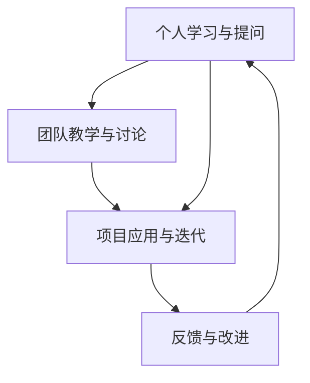

                 

# 费曼提问法促进团队学习与成长

## 1. 背景介绍

费曼学习法（Feynman Learning Method）是一种以科学方法为基础，强调理解而非记忆的学习策略。它由诺贝尔物理学奖得主理查德·费曼（Richard Feynman）提出，旨在帮助学习者深入理解复杂概念，通过深入的自我提问和解释来促进知识的吸收和巩固。在技术领域，费曼学习法同样具有广泛的应用价值。本文将深入探讨如何运用费曼提问法来促进团队学习和成长，助力企业技术团队的持续进步。

## 2. 核心概念与联系

### 2.1 核心概念概述

费曼学习法基于以下三个核心步骤：
1. **理解与简化**：学习者首先彻底理解一个概念，并将其简化为最基本的形式。
2. **教学与反馈**：尝试向别人（可以是假想听众）解释这个概念，并根据反馈进行调整。
3. **回顾与应用**：通过复习和实践，巩固对概念的理解，并将其应用到新的情境中。

在团队学习中，费曼学习法的这三个步骤可以进一步扩展为：
1. **个人学习与提问**：每个团队成员针对一个技术问题，进行深入的个人学习和自我提问。
2. **团队教学与讨论**：团队成员在小组内分享自己的学习成果和疑问，促进知识的交叉融合。
3. **项目应用与迭代**：将学到的知识应用到实际项目中，并通过不断迭代和反馈，提升团队整体的技术能力。

### 2.2 核心概念原理和架构的 Mermaid 流程图



这个流程图展示了费曼学习法在团队学习中的实践流程，即个人学习和提问、团队教学与讨论、项目应用与迭代和反馈与改进的循环过程。

## 3. 核心算法原理 & 具体操作步骤

### 3.1 算法原理概述

费曼学习法通过一系列的提问和解释，帮助学习者深入理解复杂技术概念。在团队学习中，这种提问和解释的过程可以极大地促进知识共享和技能提升。费曼学习法强调通过教学来检验学习效果，从而在不断的反馈中优化学习过程。

### 3.2 算法步骤详解

#### 3.2.1 个人学习与提问

1. **选择学习主题**：团队成员选择一个重要的技术问题或难题。
2. **深入学习**：通过阅读文档、观看视频、参考代码等方式，深入理解问题的核心。
3. **自我提问**：针对问题，提出一系列自问自答的问题，如“这个问题的背景是什么？”，“现有的解决方案有哪些？”，“这些方案的优缺点是什么？”等。

#### 3.2.2 团队教学与讨论

1. **准备教学材料**：将个人的学习成果和自我提问整理成文档或PPT，准备向团队讲解。
2. **组织讨论会**：团队成员轮流分享自己的学习成果，并接受其他成员的提问和反馈。
3. **调整与优化**：根据团队反馈，调整和优化自己的理解和解释，确保每个人都能够充分理解和吸收。

#### 3.2.3 项目应用与迭代

1. **应用到项目中**：将学到的知识应用到实际项目中，尝试解决具体问题。
2. **反馈与迭代**：在项目实施过程中，团队成员持续收集反馈，优化解决方案，并不断迭代改进。

### 3.3 算法优缺点

#### 3.3.1 优点

1. **深度理解**：通过深入的自我提问和解释，促进对复杂技术概念的深度理解。
2. **知识共享**：通过团队教学和讨论，实现知识的交叉融合和共享。
3. **实践检验**：将学到的知识应用到实际项目中，通过反馈不断优化解决方案。

#### 3.3.2 缺点

1. **时间成本高**：深度学习和讨论可能需要较长的时间，不适合短期任务。
2. **需求较高**：要求团队成员具备较强的自学能力和表达能力。
3. **易受干扰**：讨论过程中可能受到外界干扰，影响效率。

### 3.4 算法应用领域

费曼学习法在技术团队的学习与成长中有着广泛的应用：

- **技术培训**：适用于团队成员的技术培训和职业发展。
- **项目开发**：在项目开发过程中，用于解决技术难题和提升团队技能。
- **技术分享**：促进团队内部知识共享和经验交流。
- **技术创新**：通过不断提问和探索，激发技术创新和改进。

## 4. 数学模型和公式 & 详细讲解 & 举例说明

### 4.1 数学模型构建

在费曼学习法中，数学模型通常用于辅助解释复杂技术概念。例如，对于分布式系统的学习，可以使用以下数学模型：

1. **系统状态模型**：描述系统中各组件的状态和交互关系。
2. **负载均衡模型**：用于分析和优化系统的负载分配。
3. **故障转移模型**：模拟和测试系统的故障转移机制。

### 4.2 公式推导过程

以分布式系统的负载均衡模型为例，我们假设系统中有$N$个任务，每个任务需要处理$T$个请求。系统的负载均衡算法可以将请求平均分配到$K$个节点上，每个节点的负载为$W$。负载均衡的目标是使系统总负载最小，即：

$$
\min_{W} \sum_{i=1}^K W_i = \sum_{i=1}^K \frac{N}{K} T
$$

其中$W_i$表示第$i$个节点的负载。

通过数学推导，我们可以得到最优的负载分配方案，即每个节点的负载应该相等，即$W_i = \frac{N}{K} T$。

### 4.3 案例分析与讲解

假设一个电商平台的订单处理系统，需要处理大量并发订单，每个订单需要处理10个请求。系统由10个节点组成，每个节点的处理能力为10000个请求/秒。

1. **问题定义**：订单系统如何优化负载均衡，以提高处理效率？
2. **模型建立**：建立负载均衡模型，将订单请求平均分配到10个节点上。
3. **问题求解**：求解最优负载分配方案，使每个节点的负载相等。
4. **解决方案**：根据负载均衡模型，每个节点的负载为$\frac{N}{K} T = \frac{10000}{10} \times 10 = 1000$个请求/秒。

通过数学模型的分析和求解，团队成员可以深入理解负载均衡算法，并将其应用到实际的订单处理系统中，实现性能提升。

## 5. 项目实践：代码实例和详细解释说明

### 5.1 开发环境搭建

为了实践费曼学习法，我们需要搭建一个基于代码共享和讨论的开发环境。以下是具体的搭建步骤：

1. **选择工具**：选择Git作为版本控制工具，Jira或Trello作为任务管理和进度跟踪工具。
2. **搭建环境**：使用Docker容器技术搭建开发环境，确保所有成员能够共享一致的环境配置。
3. **配置开发流程**：定义代码审查和测试流程，确保代码质量和稳定性。

### 5.2 源代码详细实现

以下是一个简单的Java程序示例，演示如何使用费曼学习法进行问题分析和解决：

```java
public class LoadBalancer {
    public static void main(String[] args) {
        int tasks = 10000; // 任务数
        int requestsPerTask = 10; // 每个任务需要处理的请求数
        int nodes = 10; // 节点数
        int requestsPerNode = tasks / nodes; // 每个节点的请求数

        System.out.println("每个节点的负载为：" + requestsPerNode);
    }
}
```

### 5.3 代码解读与分析

上述代码简洁地实现了负载均衡的计算，通过数学模型的推导，可以得出每个节点的负载为1000个请求/秒。这为团队成员提供了一个直观的解释，帮助他们理解负载均衡算法的基本原理。

### 5.4 运行结果展示

运行上述代码，输出结果为：

```
每个节点的负载为：1000
```

这个结果验证了我们的数学模型和计算方法是正确的，团队成员可以通过这个例子，进一步探讨和优化负载均衡算法的具体实现。

## 6. 实际应用场景

### 6.1 智能运维

在智能运维领域，费曼学习法可以帮助团队深入理解系统的架构和原理，提高故障排查和问题解决的能力。例如，在处理性能瓶颈时，团队可以通过费曼学习法，深入分析系统架构，寻找可能的优化点。

### 6.2 产品开发

在产品开发过程中，费曼学习法可以用于解决技术难题，提升团队的技术能力。例如，在开发新功能时，团队可以通过费曼学习法，深入理解需求和现有技术，探索最佳解决方案。

### 6.3 客户支持

在客户支持中，费曼学习法可以帮助团队快速理解客户问题，提供高质量的技术支持。例如，在处理复杂技术问题时，团队可以通过费曼学习法，深入理解问题的背景和解决方法，为客户提供准确的解决方案。

## 7. 工具和资源推荐

### 7.1 学习资源推荐

为了帮助团队成员系统掌握费曼学习法，以下是一些推荐的学习资源：

1. **费曼学习法相关书籍**：《The Art of Learning》《How to Become a Straight-A Student》等书籍，深入浅出地介绍了费曼学习法的原理和应用。
2. **在线课程和讲座**：Coursera、edX等平台上有许多关于费曼学习法的课程和讲座，适合不同层次的学习者。
3. **博客和文章**：Medium、TechCrunch等平台上有许多关于费曼学习法的博客和文章，可以帮助团队成员了解最新的应用案例和最佳实践。

### 7.2 开发工具推荐

以下是一些常用的开发工具，可以帮助团队成员实践费曼学习法：

1. **代码共享工具**：GitHub、GitLab等平台，方便团队成员共享代码和进行协作。
2. **任务管理工具**：Jira、Trello等工具，帮助团队规划和管理任务进度。
3. **文档协作工具**：Confluence、Notion等工具，方便团队成员共享和学习技术文档。

### 7.3 相关论文推荐

以下是一些关于费曼学习法的经典论文，推荐阅读：

1. **《The Feynman Technique: A Model for Independent Study and A Guided Tour》**：介绍费曼学习法的核心思想和具体应用。
2. **《A Framework for the Interactive Application of the Feynman Technique in Problem-based Learning》**：探讨费曼学习法在问题导向学习中的具体应用。
3. **《Teaching the Feynman Technique to Future Engineers》**：分析费曼学习法在工程教育中的应用效果。

## 8. 总结：未来发展趋势与挑战

### 8.1 研究成果总结

费曼学习法作为一项有效的学习策略，已经在许多领域得到了广泛应用，帮助学习者深入理解复杂概念，促进知识共享和技能提升。在技术团队中，费曼学习法同样具有重要的实践价值。

### 8.2 未来发展趋势

随着技术的不断进步，费曼学习法也将不断发展，具体趋势如下：

1. **技术化**：未来将有更多的技术工具和平台，支持费曼学习法的应用。例如，基于AI的自动问题生成和解答工具，可以辅助团队成员进行深入学习。
2. **智能化**：通过数据分析和机器学习，可以根据学习者的个性化需求，推荐最合适的学习内容和路径。
3. **协作化**：未来的学习平台将更注重协作和互动，支持团队成员之间的实时交流和讨论。

### 8.3 面临的挑战

尽管费曼学习法具有诸多优点，但在实际应用中，也面临一些挑战：

1. **时间成本高**：深入学习和讨论需要大量时间，影响团队的日常工作。
2. **需求较高**：需要团队成员具备较强的自学能力和表达能力。
3. **易受干扰**：讨论过程中可能受到外界干扰，影响效率。

### 8.4 研究展望

未来的研究可以从以下几个方面进行：

1. **技术工具的开发**：开发更多的技术工具和平台，支持费曼学习法的应用。
2. **学习路径的优化**：通过数据分析和机器学习，优化学习路径，提升学习效率。
3. **跨领域的应用**：将费曼学习法应用于更多领域，如教育、医疗等，探索其在其他领域的适用性和效果。

## 9. 附录：常见问题与解答

**Q1：如何组织有效的费曼学习法讨论会？**

A: 有效的费曼学习法讨论会应遵循以下几个步骤：
1. **准备阶段**：提前确定讨论主题，并准备相关的资料和问题。
2. **讨论阶段**：轮流分享自己的学习成果和疑问，并接受其他成员的提问和反馈。
3. **总结阶段**：回顾讨论内容，整理出问题的解决方案和下一步学习计划。

**Q2：费曼学习法是否适用于所有团队成员？**

A: 费曼学习法适用于任何愿意深入学习和分享知识的团队成员。但需要考虑到团队成员的认知水平和学习习惯，确保讨论会能够达到预期效果。

**Q3：如何平衡日常工作和费曼学习法？**

A: 可以在日常工作中，将费曼学习法融入到具体的技术问题中。例如，在处理某个技术难题时，可以将其作为学习主题，安排固定的讨论时间。

**Q4：费曼学习法的适用场景有哪些？**

A: 费曼学习法适用于任何需要深入理解复杂技术概念和知识共享的场景，如技术培训、项目开发、技术支持等。

**Q5：如何评估费曼学习法的效果？**

A: 评估费曼学习法的效果可以从以下几个方面进行：
1. **知识掌握**：评估团队成员对学习内容的理解和掌握程度。
2. **问题解决**：评估团队成员在实际项目中解决问题的能力。
3. **团队协作**：评估团队成员之间的协作和沟通效果。

通过系统地评估和反馈，可以不断优化费曼学习法的应用效果，促进团队的学习和成长。

---

作者：禅与计算机程序设计艺术 / Zen and the Art of Computer Programming

