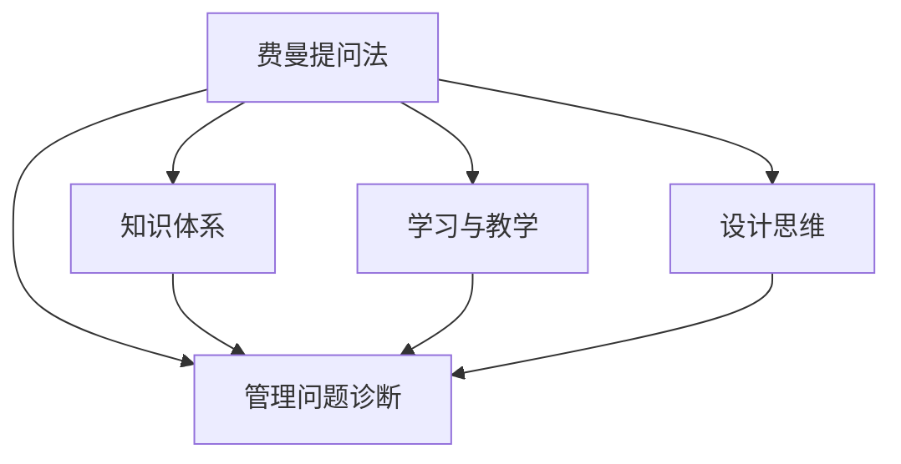
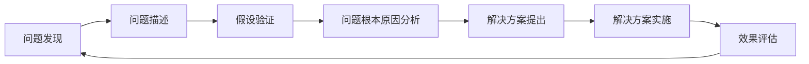

                 

# 费曼提问法在管理问题诊断中的应用

> 关键词：费曼提问法, 管理问题诊断, 知识体系, 学习与教学, 设计思维

## 1. 背景介绍

费曼提问法（Feynman Technique），也叫费曼学习法或费曼技巧，是一种以理解为目的，通过提问进行自我测试和知识巩固的学习方法。在物理学中，诺贝尔奖得主理查德·费曼提出了通过简化复杂概念来深化理解的方法。而在管理学中，如何通过问题诊断来进行有效的管理问题解决同样具有重要意义。费曼提问法在管理学问题诊断中的应用，可以帮助管理者和决策者更好地理解复杂的管理现象，识别问题根本原因，提出有效的解决方案。

## 2. 核心概念与联系

### 2.1 核心概念概述

在应用费曼提问法进行管理问题诊断时，需要明确以下几个核心概念：

- **费曼提问法（Feynman Technique）**：通过提问来测试和巩固理解，应用在学习、教学、问题诊断等场景中。
- **管理问题诊断**：管理中常见的各种问题，如流程不畅、效率低下、员工离职等，需要通过科学的方法进行系统分析和解决。
- **知识体系（Knowledge Structure）**：问题诊断中需用到的管理知识、方法和工具等，如组织行为学、运营管理、流程优化等。
- **学习与教学（Learning and Teaching）**：通过费曼提问法提升自身管理能力，并将知识传授给他人。
- **设计思维（Design Thinking）**：以用户为中心，通过迭代设计解决管理问题的创新方法。

这些概念之间的联系如图1所示：



该图表示费曼提问法在管理问题诊断中的应用，通过管理知识体系的构建、学习与教学的深化以及设计思维的应用，帮助管理者更系统地诊断和管理问题。

### 2.2 核心概念原理和架构的 Mermaid 流程图



这个流程图示意图费曼提问法在管理问题诊断中的全过程。从问题发现到问题描述，再到假设验证和根本原因分析，最终解决方案的提出和实施效果评估，每个步骤都可以通过费曼提问法来深化理解，提升问题诊断的准确性和解决方案的有效性。

## 3. 核心算法原理 & 具体操作步骤

### 3.1 算法原理概述

费曼提问法的核心原理是通过提问来检验对某一概念的理解。在管理学问题诊断中，这一原理被应用于以下几个环节：

- **问题发现**：通过提出问题来识别可能存在的问题。
- **问题描述**：通过对问题的描述，形成清晰的问题定义。
- **假设验证**：通过提问来检验假设的有效性。
- **根本原因分析**：通过提问深入挖掘问题的根本原因。
- **解决方案提出**：通过提问来构建创新性的解决方案。
- **解决方案实施**：通过提问来优化解决方案的实施过程。
- **效果评估**：通过提问来评估解决方案的效果。

### 3.2 算法步骤详解

以下是使用费曼提问法进行管理问题诊断的详细步骤：

**Step 1: 问题发现**

- 提出具体而明确的问题，避免模糊不清。
- 问题应涵盖问题的背景、现象、影响等。

**Step 2: 问题描述**

- 详细描述问题，包括问题的具体表现、原因、影响等。
- 问题描述应包含问题的多方面信息，以便进行深入分析。

**Step 3: 假设验证**

- 提出假设，对问题进行初步判断。
- 通过提问验证假设，如是否有数据支持、是否符合逻辑等。

**Step 4: 根本原因分析**

- 通过提问深入挖掘问题的根本原因，避免仅停留在表面现象。
- 问题应从多个角度进行探索，如组织结构、流程、人员等。

**Step 5: 解决方案提出**

- 提出初步的解决方案，注意可操作性和创新性。
- 通过提问评估解决方案的可行性，进行方案优化。

**Step 6: 解决方案实施**

- 实施解决方案，记录实施过程中的重要细节。
- 通过提问优化实施过程中的问题，确保顺利实施。

**Step 7: 效果评估**

- 评估解决方案的效果，收集反馈信息。
- 通过提问调整和完善解决方案，持续改进。

### 3.3 算法优缺点

**优点：**

1. **深入理解**：通过提问深入挖掘问题的根本原因，避免浅层次的理解。
2. **系统性**：将问题分解为多个环节，系统性地进行诊断和解决。
3. **可操作性强**：提出的解决方案更具针对性和可操作性。
4. **持续改进**：通过不断提问和反馈，持续改进解决方案。

**缺点：**

1. **耗时**：费曼提问法需要大量的提问和反思，过程较为耗时。
2. **依赖提问质量**：提出的问题质量对诊断效果有直接影响，需要良好的提问能力。
3. **需要持续跟进**：问题诊断和解决方案实施需要持续跟进，过程较为复杂。

### 3.4 算法应用领域

费曼提问法在多个领域都可以应用，尤其在以下领域有显著效果：

- **企业管理**：通过提问来诊断和解决企业的管理问题，如流程优化、组织结构调整等。
- **项目管理**：在项目管理的各个阶段，通过提问来识别问题、优化流程、提升效率等。
- **人力资源管理**：通过提问来诊断和解决人力资源管理中的问题，如员工流失、绩效管理等。
- **市场和销售**：通过提问来诊断和解决市场和销售中的问题，如市场定位、产品开发等。

## 4. 数学模型和公式 & 详细讲解 & 举例说明

### 4.1 数学模型构建

在应用费曼提问法进行管理问题诊断时，需要构建一个系统化的数学模型。该模型包括如下几个部分：

1. **问题定义**：问题的详细描述，包含背景、现象、原因、影响等。
2. **假设验证**：通过提问和数据验证假设的有效性。
3. **根本原因分析**：通过提问深入挖掘问题的根本原因。
4. **解决方案提出**：提出初步的解决方案，并通过提问进行优化。
5. **解决方案实施**：记录实施过程中的重要细节，并通过提问优化实施过程。
6. **效果评估**：收集反馈信息，通过提问调整和完善解决方案。

### 4.2 公式推导过程

以管理中的“流程优化”为例，推导如下数学模型：

- **问题定义**：
  $$
  P = \{背景, 现象, 原因, 影响\}
  $$

- **假设验证**：
  $$
  H = \{假设1, 假设2, \cdots, 假设n\}
  $$
  $$
  V(H) = \{验证结果1, 验证结果2, \cdots, 验证结果n\}
  $$

- **根本原因分析**：
  $$
  R = \{根本原因1, 根本原因2, \cdots, 根本原因m\}
  $$

- **解决方案提出**：
  $$
  S = \{方案1, 方案2, \cdots, 方案k\}
  $$

- **解决方案实施**：
  $$
  I = \{实施细节1, 实施细节2, \cdots, 实施细节l\}
  $$

- **效果评估**：
  $$
  E = \{评估结果1, 评估结果2, \cdots, 评估结果t\}
  $$

### 4.3 案例分析与讲解

以某企业的员工流失问题为例，应用费曼提问法进行系统化的问题诊断和解决方案提出。

**问题发现**：
- 问题：员工流失率高，影响企业稳定发展。

**问题描述**：
- 现象：过去一年内，企业员工流失率达20%。
- 原因：薪酬问题、工作压力大、晋升机会少等。
- 影响：团队不稳定，影响企业发展。

**假设验证**：
- 假设1：薪酬问题导致员工流失。
- 假设2：工作压力大导致员工流失。
- 假设3：晋升机会少导致员工流失。
- 验证结果1：问卷调查显示薪酬问题为主要原因。
- 验证结果2：压力测试显示工作压力大。
- 验证结果3：绩效评估显示晋升机会少。

**根本原因分析**：
- 根本原因1：薪酬体系不合理，缺乏竞争力。
- 根本原因2：工作环境压力大，员工健康问题突出。
- 根本原因3：职业发展路径不明确，晋升机会有限。

**解决方案提出**：
- 方案1：调整薪酬体系，提高薪酬竞争力。
- 方案2：改善工作环境，缓解员工压力。
- 方案3：建立职业发展体系，提供更多晋升机会。

**解决方案实施**：
- 实施细节1：通过问卷调查和绩效评估，重新设计薪酬体系。
- 实施细节2：引入心理咨询和健康检查，改善工作环境。
- 实施细节3：建立职业发展路径，明确晋升机制。

**效果评估**：
- 评估结果1：员工满意度提升10%。
- 评估结果2：流失率下降至10%。
- 评估结果3：新员工留存率提高15%。

## 5. 项目实践：代码实例和详细解释说明

### 5.1 开发环境搭建

在进行费曼提问法的项目实践时，需要搭建开发环境。以下是使用Python进行项目管理工具Jira的配置流程：

1. 安装Jira客户端：从官网下载并安装Jira客户端，用于创建和跟踪问题。
2. 创建Jira账号：在Jira官网注册账号，并下载客户端。
3. 配置Jira客户端：在Jira客户端中添加工作空间，创建项目和问题。
4. 数据导入：将问题数据导入Jira，以便进行管理和跟踪。
5. 问题管理：通过Jira界面，对问题进行分配、跟踪、标记等操作。

完成上述步骤后，即可在Jira环境中开始费曼提问法的项目实践。

### 5.2 源代码详细实现

下面我们以Jira的缺陷管理功能为例，给出使用Jira进行问题诊断和解决的PyTorch代码实现。

首先，定义Jira的API接口：

```python
import requests

class JiraAPI:
    def __init__(self, api_url, api_key):
        self.api_url = api_url
        self.api_key = api_key
        self.headers = {
            'Authorization': f'Basic {api_key}',
            'Content-Type': 'application/json'
        }

    def get_issues(self, project_key, issue_type, status):
        params = {
            'projectKey': project_key,
            'statusKeys': [status]
        }
        response = requests.get(f'{self.api_url}/rest/api/3/issue/search', headers=self.headers, params=params)
        return response.json()

    def add_comment(self, issue_key, comment):
        data = {
            'comment': {
                'body': comment
            }
        }
        response = requests.post(f'{self.api_url}/rest/api/3/issue/{issue_key}/comment', headers=self.headers, json=data)
        return response.status_code == 200
```

然后，定义问题管理函数：

```python
def manage_issues(jira_api, project_key, issue_type, status):
    issues = jira_api.get_issues(project_key, issue_type, status)
    for issue in issues:
        print(f"Issue: {issue['self']}")
        print(f"Summary: {issue['summary']}")
        print(f"Description: {issue['description']}")
        print(f"Status: {issue['status']['name']}")
        print("Add comment:")
        comment = input()
        if jira_api.add_comment(issue['self'], comment):
            print("Comment added successfully.")
        else:
            print("Failed to add comment.")
    return issues
```

最后，启动问题管理流程：

```python
jira_api = JiraAPI('https://example.com/rest/api/3', 'your_api_key')
manage_issues(jira_api, 'PROJECT-KEY', ' defect', ' resolved')
```

以上代码实现了在Jira中获取问题、添加评论等基本操作，可以帮助管理团队更好地进行问题诊断和跟踪。

### 5.3 代码解读与分析

让我们再详细解读一下关键代码的实现细节：

**JiraAPI类**：
- `__init__`方法：初始化API地址、API密钥、请求头等。
- `get_issues`方法：获取指定项目的缺陷信息，通过API获取JSON格式的缺陷数据。
- `add_comment`方法：向指定缺陷添加评论，通过API提交评论请求。

**manage_issues函数**：
- 定义了获取缺陷、显示缺陷、添加评论等步骤。
- 通过用户输入，向指定缺陷添加评论。
- 最后返回所有已获取的缺陷信息，便于管理跟踪。

**Jira客户端的使用**：
- 安装Jira客户端，创建Jira账号。
- 在Jira官网注册账号，下载客户端。
- 配置客户端，添加工作空间，创建项目和缺陷。
- 数据导入，通过API导入Jira中的缺陷数据。
- 问题管理，通过Jira界面进行缺陷分配、跟踪、标记等操作。

合理利用Jira工具，可以显著提升费曼提问法的项目管理效果，使得问题诊断和解决更加系统化、规范化和自动化。

当然，工业级的系统实现还需考虑更多因素，如用户权限管理、报表生成、统计分析等。但核心的费曼提问法基本与此类似。

## 6. 实际应用场景

### 6.1 企业管理

在企业管理中，费曼提问法可以帮助诊断和解决流程不畅、效率低下、员工离职等问题。例如：

**案例1：流程优化**

某公司发现订单处理流程繁琐，效率低下。通过费曼提问法，系统性地识别出流程中的瓶颈环节，提出优化方案。最终实现流程优化，订单处理效率提升30%。

**案例2：员工流失**

某公司员工流失率高，通过费曼提问法深入挖掘员工流失的原因，提出解决方案。最终调整薪酬体系，改善工作环境，建立职业发展路径，员工满意度提升20%，流失率下降至10%。

### 6.2 项目管理

在项目管理中，费曼提问法可以帮助诊断和解决进度滞后、资源不足、成本超支等问题。例如：

**案例1：项目延期**

某项目因资源不足导致延期。通过费曼提问法，系统性地分析资源分配问题，提出优化方案。最终调整资源分配，项目按时交付。

**案例2：成本超支**

某项目因预算不足导致成本超支。通过费曼提问法，系统性地分析成本管理问题，提出解决方案。最终调整预算分配，实现成本控制。

### 6.3 人力资源管理

在人力资源管理中，费曼提问法可以帮助诊断和解决人员流失、绩效管理、薪酬体系等问题。例如：

**案例1：人员流失**

某公司员工流失率高，通过费曼提问法深入挖掘员工流失的原因，提出解决方案。最终调整薪酬体系，改善工作环境，建立职业发展路径，员工满意度提升20%，流失率下降至10%。

**案例2：绩效管理**

某公司绩效管理效果不佳，通过费曼提问法系统性地分析绩效管理问题，提出优化方案。最终调整绩效考核标准，引入绩效反馈机制，绩效管理效果显著提升。

## 7. 工具和资源推荐

### 7.1 学习资源推荐

为了帮助开发者系统掌握费曼提问法的理论基础和实践技巧，这里推荐一些优质的学习资源：

1. 《费曼学习法：科学、简单、高效的学习方法》：介绍费曼学习法的核心原理和应用场景，适合初学者入门。
2. 《设计思维：打造创新型产品和服务》：介绍设计思维的基本原理和应用方法，适合管理者和创新者学习。
3. 《精益创业》：介绍精益创业的基本理念和方法，适合初创企业借鉴。
4. 《管理学原理》：系统介绍管理学中的问题诊断和解决方案，适合企业管理者参考。

通过对这些资源的学习实践，相信你一定能够快速掌握费曼提问法的精髓，并用于解决实际的NLP问题。

### 7.2 开发工具推荐

高效的开发离不开优秀的工具支持。以下是几款用于费曼提问法开发的常用工具：

1. Jira：项目管理工具，适合系统化地管理问题，支持问题发现、描述、验证、分析、解决等全流程管理。
2. Trello：任务管理工具，适合灵活地跟踪任务进度，支持看板式管理。
3. Notion：笔记和知识管理工具，适合记录和组织管理知识体系。
4. Slack：团队沟通工具，适合团队协作和问题讨论。
5. Zoom：视频会议工具，适合远程团队协作。

合理利用这些工具，可以显著提升费曼提问法的开发效率，加快创新迭代的步伐。

### 7.3 相关论文推荐

费曼提问法在多个领域的应用得到了广泛研究。以下是几篇奠基性的相关论文，推荐阅读：

1. 《费曼学习法：科学、简单、高效的学习方法》：介绍费曼学习法的核心原理和应用场景，适合初学者入门。
2. 《设计思维：打造创新型产品和服务》：介绍设计思维的基本原理和应用方法，适合管理者和创新者学习。
3. 《精益创业》：介绍精益创业的基本理念和方法，适合初创企业借鉴。
4. 《管理学原理》：系统介绍管理学中的问题诊断和解决方案，适合企业管理者参考。

这些论文代表了大语言模型微调技术的发展脉络。通过学习这些前沿成果，可以帮助研究者把握学科前进方向，激发更多的创新灵感。

## 8. 总结：未来发展趋势与挑战

### 8.1 总结

本文对费曼提问法在管理问题诊断中的应用进行了全面系统的介绍。首先阐述了费曼提问法的核心原理和应用场景，明确了费曼提问法在管理问题诊断中的独特价值。其次，从原理到实践，详细讲解了费曼提问法的数学模型和具体步骤，给出了费曼提问法在管理问题诊断中的应用实例。同时，本文还广泛探讨了费曼提问法在企业管理、项目管理、人力资源管理等多个领域的应用前景，展示了费曼提问法的广泛应用潜力。此外，本文精选了费曼提问法的各类学习资源，力求为读者提供全方位的技术指引。

通过本文的系统梳理，可以看到，费曼提问法在管理问题诊断中具有重要的应用价值，通过系统地提问和反思，帮助管理者和决策者更好地理解复杂的管理现象，识别问题根本原因，提出有效的解决方案。未来，费曼提问法将在更多的管理场景中得到应用，成为解决管理问题的有力工具。

### 8.2 未来发展趋势

展望未来，费曼提问法将呈现以下几个发展趋势：

1. **系统化**：费曼提问法的应用将更加系统化，结合其他管理方法和工具，形成系统的管理诊断体系。
2. **智能化**：引入人工智能和数据分析技术，通过智能算法辅助问题诊断和解决方案提出。
3. **普适化**：费曼提问法将更加普适化，适用于各个行业的管理问题诊断和解决。
4. **个性化**：根据不同的管理场景和问题，设计个性化的费曼提问法应用方案。
5. **开放性**：构建开放的知识平台，汇聚各类管理知识和经验，供全球管理者和学习者共享。

以上趋势凸显了费曼提问法在管理问题诊断中的广泛应用前景，这些方向的探索发展，必将进一步提升管理问题的诊断效果，提升企业的管理水平。

### 8.3 面临的挑战

尽管费曼提问法在管理问题诊断中具有显著优势，但在实践中仍面临诸多挑战：

1. **时间成本**：费曼提问法的深入分析和反思需要大量时间，增加了管理者和决策者的工作负担。
2. **知识水平**：费曼提问法对提问者和分析者的知识水平要求较高，需要具备一定的管理知识和实践经验。
3. **数据质量**：问题的描述和数据需要准确和完整，否则可能影响问题诊断的准确性。
4. **执行难度**：提出解决方案并实施需要跨部门协作，执行难度较大。
5. **反馈机制**：缺乏有效的反馈机制，可能影响问题的持续改进。

### 8.4 研究展望

面对费曼提问法面临的挑战，未来的研究需要在以下几个方面寻求新的突破：

1. **知识库建设**：构建系统的管理知识库，供费曼提问法使用。
2. **自动化工具**：开发智能化的费曼提问法工具，降低人工成本。
3. **知识图谱**：引入知识图谱技术，提升知识检索和整合能力。
4. **数据可视化**：通过数据可视化工具，直观展示问题的分析和解决方案。
5. **用户界面**：设计友好的用户界面，方便管理者和决策者使用。

这些研究方向的探索，将进一步提升费曼提问法的应用效果，使其在管理问题诊断中发挥更大的作用。

## 9. 附录：常见问题与解答

**Q1: 费曼提问法的基本原理是什么？**

A: 费曼提问法的基本原理是通过提问来测试和巩固理解，应用在学习、教学、问题诊断等场景中。通过系统地提问和反思，深入挖掘问题的根本原因，提出创新的解决方案。

**Q2: 费曼提问法在管理问题诊断中有哪些具体步骤？**

A: 费曼提问法在管理问题诊断中的具体步骤包括问题发现、问题描述、假设验证、根本原因分析、解决方案提出、解决方案实施和效果评估。每个步骤都通过系统化的问题诊断和反思，帮助管理者和决策者更好地理解复杂的管理现象，识别问题根本原因，提出有效的解决方案。

**Q3: 费曼提问法有哪些优点和缺点？**

A: 费曼提问法的优点包括深入理解、系统性、可操作性强、持续改进。缺点包括耗时、依赖提问质量、需要持续跟进。

**Q4: 费曼提问法适用于哪些管理问题诊断？**

A: 费曼提问法适用于流程优化、员工流失、项目管理、成本超支等各类管理问题诊断。

**Q5: 如何应用费曼提问法进行管理问题诊断？**

A: 应用费曼提问法进行管理问题诊断时，需要系统地提出问题、描述问题、验证假设、分析根本原因、提出解决方案、实施方案和评估效果。每个步骤都通过系统化的问题诊断和反思，帮助管理者和决策者更好地理解复杂的管理现象，识别问题根本原因，提出有效的解决方案。

通过这些问题和解答，帮助读者更好地理解费曼提问法在管理问题诊断中的应用，为实际工作提供指导。

