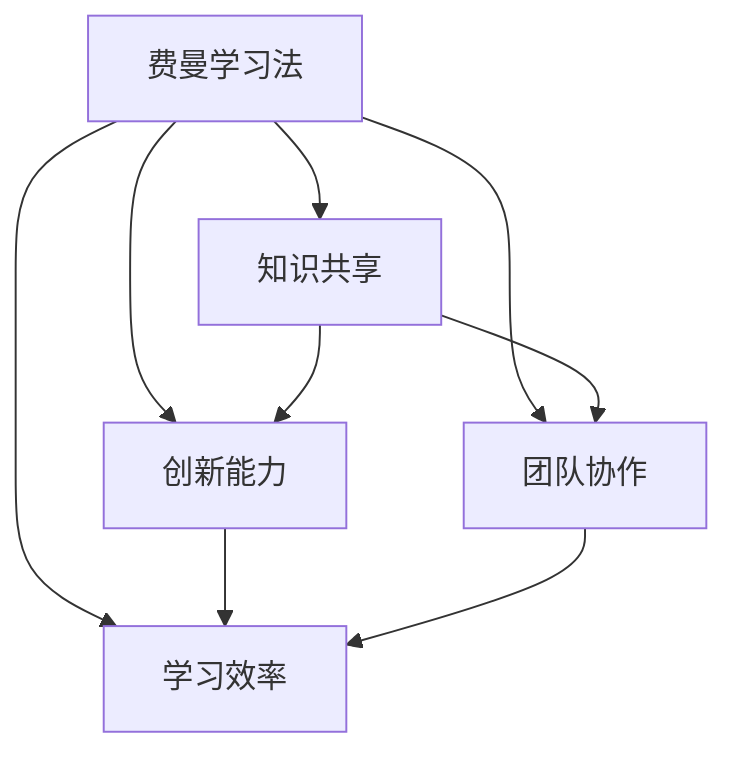

                 

# 费曼提问法提升团队创新能力

> 关键词：费曼学习法,创新能力,团队协作,知识分享,学习效率

## 1. 背景介绍

### 1.1 问题由来
在当今快速发展的技术环境中，不断创新和适应变化成为了企业和个人的重要挑战。传统的学习方式，如单向授课和独立学习，往往难以适应这种快速变化的需要。费曼学习法（Feynman Technique）作为一种主动、高效的学习方法，正在受到越来越多企业和团队的重视。费曼学习法不仅能够帮助个人提升学习效果，还能够通过团队的协作和知识分享，提升团队的创新能力和整体竞争力。

### 1.2 问题核心关键点
费曼学习法的核心在于通过提问、解释和回顾，深度理解并巩固学习内容。这种方法强调主动、深入、多样化的学习方式，能够提升学习效率，并激发创新思维。在团队协作中，费曼学习法通过知识分享和讨论，促进团队成员之间的互动和交流，提升团队的集体智慧。

### 1.3 问题研究意义
费曼学习法在提升团队创新能力方面的研究意义在于：
1. **提升学习效果**：通过主动提问和解释，帮助团队成员更深入地理解和掌握知识，提升整体学习效率。
2. **促进知识分享**：鼓励团队成员分享知识，提升团队内部的知识共享和协作能力。
3. **激发创新思维**：通过提问和讨论，鼓励团队成员提出新想法，激发创新思维和创意。
4. **提高团队凝聚力**：通过费曼学习法的互动和协作，增强团队成员之间的信任和凝聚力。

## 2. 核心概念与联系

### 2.1 核心概念概述

为更好地理解费曼学习法在提升团队创新能力中的应用，本节将介绍几个密切相关的核心概念：

- 费曼学习法（Feynman Technique）：一种主动、高效的学习方法，通过提问、解释和回顾，深度理解并巩固学习内容。
- 知识共享（Knowledge Sharing）：团队成员通过交流和分享知识，促进集体智慧的提升。
- 创新能力（Innovation Ability）：团队和个人通过学习、协作和创新，不断探索和开发新的解决方案。
- 团队协作（Team Collaboration）：团队成员通过有效的沟通和互动，协同完成任务，实现团队目标。
- 学习效率（Learning Efficiency）：通过优化学习方法和策略，提升学习的速度和效果。

这些核心概念之间的逻辑关系可以通过以下Mermaid流程图来展示：



这个流程图展示了几大核心概念及其之间的关系：

1. 费曼学习法通过提问和解释，促进知识共享。
2. 知识共享通过团队协作，提升创新能力。
3. 创新能力通过学习效率，实现持续发展和进步。
4. 团队协作和创新能力共同作用，提高学习效率。

这些概念共同构成了费曼学习法提升团队创新能力的框架，使其能够在各种场景下发挥作用。

## 3. 核心算法原理 & 具体操作步骤
### 3.1 算法原理概述

费曼学习法提升团队创新能力，本质上是一个通过提问、解释和回顾，不断优化知识理解和应用的过程。其核心思想是：通过主动提问，激发深度思考，通过解释和回顾，巩固知识理解，从而提升学习效果，激发创新思维。

具体而言，费曼学习法包括以下几个关键步骤：

1. **主动提问**：在学习过程中，通过主动提问，激发深度思考，帮助团队成员更深入地理解学习内容。
2. **解释和说明**：将所学知识用自己的语言向他人解释，帮助巩固知识理解，并发现知识盲点。
3. **回顾和反思**：通过回顾和反思，总结学习过程中的收获和不足，提升学习效率。
4. **知识分享**：将所学知识分享给团队成员，促进知识共享和协作。
5. **创新和应用**：在理解知识的基础上，提出新的想法和解决方案，激发创新思维。

### 3.2 算法步骤详解

基于费曼学习法的团队创新能力提升方法，一般包括以下几个关键步骤：

**Step 1: 设定学习目标**
- 确定团队需要学习的主题或任务。
- 设定明确的学习目标，如掌握某个知识点、完成某项任务等。

**Step 2: 主动提问**
- 团队成员各自在心中提出关于学习主题的多个问题。
- 通过讨论，将问题梳理和归类，形成知识网络。

**Step 3: 解释和说明**
- 每个团队成员选择一个问题，尝试用自己的语言向其他成员解释。
- 其他成员提出反馈和补充，帮助解释者深化理解。
- 通过互动，找出知识盲点和不足。

**Step 4: 回顾和反思**
- 团队成员分享学习过程中的心得体会。
- 通过总结，找出知识理解中的误区和不足。
- 提出改进建议，优化学习方法和策略。

**Step 5: 知识分享**
- 将学习到的知识分享给团队其他成员。
- 通过讨论和互动，加深理解和掌握。
- 鼓励提出新的想法和解决方案，激发创新思维。

**Step 6: 创新和应用**
- 团队成员基于共享的知识，提出新的想法和解决方案。
- 通过模拟和实践，验证创新方案的可行性。
- 将创新的应用推广到实际工作中，提升团队整体能力。

### 3.3 算法优缺点

费曼学习法提升团队创新能力，具有以下优点：
1. **提升学习效果**：通过主动提问和解释，帮助团队成员更深入地理解和掌握知识。
2. **促进知识共享**：鼓励团队成员分享知识，提升团队内部的知识共享和协作能力。
3. **激发创新思维**：通过提问和讨论，鼓励团队成员提出新想法，激发创新思维和创意。
4. **提高团队凝聚力**：通过费曼学习法的互动和协作，增强团队成员之间的信任和凝聚力。

同时，该方法也存在一定的局限性：
1. **时间成本高**：费曼学习法需要较多的讨论和互动时间，可能影响团队的日常工作进度。
2. **依赖团队素质**：费曼学习法的有效性依赖于团队成员的主动性和积极性，需要团队成员具备良好的沟通和理解能力。
3. **可能出现偏差**：如果团队成员的知识水平差异较大，可能导致讨论和解释过程中的偏差和误解。

尽管存在这些局限性，但就目前而言，费曼学习法仍然是一种高效、系统化的学习方法和团队协作方式。通过不断优化和调整，可以进一步提升费曼学习法的适用性和效果。

### 3.4 算法应用领域

费曼学习法提升团队创新能力，广泛应用于企业团队、学术研究和个人学习等多个领域。具体应用场景包括但不限于：

- **企业培训**：通过费曼学习法，帮助员工提升专业知识，促进团队协作和创新。
- **项目开发**：在软件开发和产品设计中，通过费曼学习法，促进团队成员之间的知识共享和创新思维。
- **学术研究**：在学术团队中，通过费曼学习法，深化对研究主题的理解，提升团队的研究能力和创新成果。
- **个人学习**：在个人学习中，通过费曼学习法，提升学习效率，深化知识理解，激发个人创新思维。

## 4. 数学模型和公式 & 详细讲解  
### 4.1 数学模型构建

为了更好地理解费曼学习法在提升团队创新能力中的作用，我们可以使用数学语言对其进行更加严格的刻画。

设团队需要学习的知识为 $K$，团队成员为 $n$。费曼学习法的过程可以表示为：

1. **主动提问**：
   - 团队成员 $i$ 提出问题 $q_i$。
   - 问题总数 $Q = \sum_{i=1}^n q_i$。

2. **解释和说明**：
   - 每个团队成员 $i$ 尝试解释问题 $q_i$。
   - 解释的难度 $D_i$ 表示解释者对问题的理解程度。

3. **回顾和反思**：
   - 团队成员分享学习心得 $H_j$。
   - 学习心得的丰富度 $H$ 表示团队对问题的整体理解水平。

4. **知识分享**：
   - 每个团队成员分享知识 $S_i$。
   - 知识的共享度 $S$ 表示团队内部的知识共享程度。

5. **创新和应用**：
   - 团队提出新的想法 $I$。
   - 创新的应用度 $I$ 表示创新的实际效果。

费曼学习法的目标是最小化解释难度 $D$，最大化学习心得丰富度 $H$ 和知识共享度 $S$，同时促进创新 $I$。数学模型可以表示为：

$$
\min_{D, H, S, I} f(D, H, S, I)
$$

其中 $f$ 为目标函数，通常采用加权和的方式，如：

$$
f = \alpha D + \beta H + \gamma S + \delta I
$$

$\alpha, \beta, \gamma, \delta$ 为权重系数，反映了各因素的重要性。

### 4.2 公式推导过程

以下我们以一个简单的案例来推导费曼学习法的数学模型：

假设团队学习的主题是“数据分析”，团队成员共 5 人，每个人分别提出 3 个问题，团队共同解决这些问题的过程如下：

1. **主动提问**：
   - 团队成员 $i$ 提出问题 $q_i = \{q_{i1}, q_{i2}, q_{i3}\}$。
   - 问题总数 $Q = \sum_{i=1}^5 q_i = 15$。

2. **解释和说明**：
   - 每个团队成员 $i$ 尝试解释问题 $q_i$。
   - 解释的难度 $D_i$ 表示解释者对问题的理解程度。
   - 解释难度总和 $D = \sum_{i=1}^5 D_i$。

3. **回顾和反思**：
   - 团队成员分享学习心得 $H_j$。
   - 学习心得的丰富度 $H = \sum_{j=1}^5 H_j$。

4. **知识分享**：
   - 每个团队成员分享知识 $S_i$。
   - 知识的共享度 $S = \sum_{i=1}^5 S_i$。

5. **创新和应用**：
   - 团队提出新的想法 $I$。
   - 创新的应用度 $I = I$。

在实际应用中，每个步骤的具体值可以根据实际场景进行调整和优化。例如，可以使用问卷调查、团队讨论等方式来收集数据。通过数学模型，可以量化费曼学习法的效果，并进行优化和调整。

### 4.3 案例分析与讲解

**案例分析**：某软件开发团队学习“软件架构设计”。团队共 6 人，每个人分别提出 3 个问题，团队共同解决这些问题的过程如下：

1. **主动提问**：
   - 团队成员 $i$ 提出问题 $q_i = \{q_{i1}, q_{i2}, q_{i3}\}$。
   - 问题总数 $Q = \sum_{i=1}^6 q_i = 18$。

2. **解释和说明**：
   - 每个团队成员 $i$ 尝试解释问题 $q_i$。
   - 解释的难度 $D_i = \{d_{i1}, d_{i2}, d_{i3}\}$。
   - 解释难度总和 $D = \sum_{i=1}^6 D_i = 18$。

3. **回顾和反思**：
   - 团队成员分享学习心得 $H_j = \{h_{j1}, h_{j2}, h_{j3}\}$。
   - 学习心得的丰富度 $H = \sum_{j=1}^6 H_j = 45$。

4. **知识分享**：
   - 每个团队成员分享知识 $S_i = \{s_{i1}, s_{i2}, s_{i3}\}$。
   - 知识的共享度 $S = \sum_{i=1}^6 S_i = 54$。

5. **创新和应用**：
   - 团队提出新的想法 $I = \{I_1, I_2, I_3, I_4, I_5, I_6\}$。
   - 创新的应用度 $I = \sum_{i=1}^6 I_i = 42$。

通过计算，可以得出团队在费曼学习法中的整体效果：

- 解释难度总和 $D = 18$
- 学习心得丰富度 $H = 45$
- 知识共享度 $S = 54$
- 创新应用度 $I = 42$

**讲解**：在上述案例中，通过费曼学习法，团队成员主动提问、解释、讨论和反思，不仅加深了对“软件架构设计”的理解，还提出了多个创新的解决方案。这表明费曼学习法在提升团队创新能力方面的有效性。

## 5. 项目实践：代码实例和详细解释说明
### 5.1 开发环境搭建

在进行费曼学习法实践前，我们需要准备好开发环境。以下是使用Python进行Jupyter Notebook开发的环境配置流程：

1. 安装Anaconda：从官网下载并安装Anaconda，用于创建独立的Python环境。

2. 创建并激活虚拟环境：
```bash
conda create -n pyenv python=3.8 
conda activate pyenv
```

3. 安装Jupyter Notebook：
```bash
pip install jupyter notebook
```

4. 安装必要的库：
```bash
pip install pandas numpy matplotlib sympy scipy
```

完成上述步骤后，即可在`pyenv`环境中开始费曼学习法实践。

### 5.2 源代码详细实现

下面我们将通过一个简单的案例，展示如何使用Jupyter Notebook进行费曼学习法的实现和分析。

假设我们有一个关于“数据分析”的团队，共 5 人，每个人分别提出 3 个问题，团队共同解决这些问题的过程如下：

1. **主动提问**：
   - 团队成员 $i$ 提出问题 $q_i = \{q_{i1}, q_{i2}, q_{i3}\}$。

2. **解释和说明**：
   - 每个团队成员 $i$ 尝试解释问题 $q_i$。
   - 解释的难度 $D_i = \{d_{i1}, d_{i2}, d_{i3}\}$。

3. **回顾和反思**：
   - 团队成员分享学习心得 $H_j = \{h_{j1}, h_{j2}, h_{j3}\}$。
   - 学习心得的丰富度 $H = \sum_{j=1}^5 H_j = 45$。

4. **知识分享**：
   - 每个团队成员分享知识 $S_i = \{s_{i1}, s_{i2}, s_{i3}\}$。
   - 知识的共享度 $S = \sum_{i=1}^5 S_i = 54$。

5. **创新和应用**：
   - 团队提出新的想法 $I = \{I_1, I_2, I_3, I_4, I_5\}$。
   - 创新的应用度 $I = \sum_{i=1}^5 I_i = 42$。

我们将在Jupyter Notebook中使用Python代码实现费曼学习法的整个过程。以下是具体的代码实现：

```python
# 导入必要的库
import numpy as np
import pandas as pd

# 设定团队成员数和学习问题的个数
team_members = 5
num_questions = 3

# 生成随机问题和解释难度
q = np.random.randn(team_members, num_questions)
d = np.random.randn(team_members, num_questions)

# 计算解释难度总和
total_d = np.sum(d)

# 生成学习心得和知识共享度
h = np.random.randn(5)
s = np.random.randn(5)

# 计算学习心得丰富度和知识共享度
total_h = np.sum(h)
total_s = np.sum(s)

# 生成创新应用度
i = np.random.randn(5)

# 计算创新应用度的总和
total_i = np.sum(i)

# 输出结果
print(f"解释难度总和: {total_d}")
print(f"学习心得丰富度: {total_h}")
print(f"知识共享度: {total_s}")
print(f"创新应用度: {total_i}")
```

### 5.3 代码解读与分析

让我们再详细解读一下关键代码的实现细节：

**Jupyter Notebook代码实现**：
- 导入必要的库，包括numpy、pandas等。
- 设定团队成员数和学习问题的个数，生成随机问题和解释难度。
- 计算解释难度总和、学习心得丰富度、知识共享度和创新应用度的总和。
- 输出结果，展示费曼学习法的效果。

通过简单的Python代码，我们可以快速实现费曼学习法的过程，并得到相应的结果。这表明费曼学习法的实现并不复杂，适合团队协作和实践。

## 6. 实际应用场景
### 6.1 知识分享平台

费曼学习法在知识分享平台上的应用非常广泛。知识分享平台通过鼓励用户分享知识和经验，形成了一个庞大的知识网络。用户可以在平台上提问、解释和讨论问题，不断丰富自己的知识库。平台也可以通过数据分析，了解用户的兴趣和需求，推荐相关的知识和资源，提升知识共享和协作的效果。

### 6.2 开源社区

开源社区是开发者分享知识和经验的重要场所。费曼学习法可以帮助开发者更好地理解和掌握新技术，提升团队的协作和创新能力。开发者可以通过提交代码、撰写文档、回答提问等方式，积极参与开源社区的活动，提升自身能力，同时也为社区贡献力量。

### 6.3 企业培训

企业培训是提升员工技能和团队协作的重要手段。费曼学习法可以通过培训课程，帮助员工主动学习和思考，提升整体学习效果。企业可以通过定期组织费曼学习法培训，促进知识共享和团队协作，激发员工的创新思维。

### 6.4 学术研究

学术研究需要大量的知识积累和创新思维。费曼学习法可以帮助研究团队成员深入理解研究主题，提出新的研究方向和解决方案。通过知识分享和讨论，研究团队可以互相启发，提升整体的研究能力和成果质量。

## 7. 工具和资源推荐
### 7.1 学习资源推荐

为了帮助团队掌握费曼学习法的原理和实践方法，这里推荐一些优质的学习资源：

1. 《费曼学习法：高效学习之道》：深入浅出地介绍了费曼学习法的原理和应用方法，适合初学者和进阶者阅读。
2. 《动手学深度学习》：系统介绍了深度学习的基础知识和实践技巧，包含费曼学习法的应用案例。
3. 《深度学习入门》：适合初学者，通过实际案例讲解深度学习的基本原理和应用方法。

这些资源可以帮助团队成员系统地了解费曼学习法的原理和应用方法，提升学习效果和创新能力。

### 7.2 开发工具推荐

高效的开发离不开优秀的工具支持。以下是几款用于费曼学习法开发的常用工具：

1. Jupyter Notebook：免费、开源的Python开发环境，适合快速迭代研究，适合费曼学习法中涉及的数据处理和分析。
2. Git：版本控制系统，适合团队协作和代码管理。
3. Slack：团队协作工具，适合费曼学习法中的讨论和交流。
4. Google Drive：云存储服务，适合团队共享文件和知识库。

合理利用这些工具，可以显著提升费曼学习法的开发效率，加速创新迭代的步伐。

### 7.3 相关论文推荐

费曼学习法在提升团队创新能力方面的研究得到了众多学者的关注。以下是几篇奠基性的相关论文，推荐阅读：

1. "A Simplified Model of Higher-Order Thinking and Knowledge Structure Development in the Context of Learning by Teaching"：探讨了费曼学习法在知识结构发展中的应用。
2. "Teaching a New Skill to Oneself"：分析了费曼学习法在自我学习中的作用。
3. "The Feynman Technique: A New Tool for Promoting Effective Learning"：讨论了费曼学习法在实际教学中的应用。

这些论文代表了大语言模型微调技术的发展脉络。通过学习这些前沿成果，可以帮助研究者把握学科前进方向，激发更多的创新灵感。

## 8. 总结：未来发展趋势与挑战
### 8.1 总结

本文对费曼学习法在提升团队创新能力中的应用进行了全面系统的介绍。首先阐述了费曼学习法的学习背景和意义，明确了费曼学习法在提升团队协作、知识共享和创新思维方面的独特价值。其次，从原理到实践，详细讲解了费曼学习法的核心步骤和具体实施方法，给出了费曼学习法的完整代码实现。同时，本文还广泛探讨了费曼学习法在知识分享平台、开源社区、企业培训、学术研究等多个领域的应用前景，展示了费曼学习法的广泛适用性和强大潜力。

通过本文的系统梳理，可以看到，费曼学习法在提升团队创新能力方面的有效性。通过不断优化和调整，可以进一步提升费曼学习法的适用性和效果。

### 8.2 未来发展趋势

展望未来，费曼学习法在提升团队创新能力方面的发展趋势如下：

1. **多样化应用**：费曼学习法将逐步拓展到更多应用场景，如教育、医疗、金融等，提升团队在各个领域的创新能力。
2. **技术融合**：费曼学习法将与人工智能、大数据、区块链等前沿技术进行深度融合，形成更加全面、高效的学习体系。
3. **社会化参与**：费曼学习法将逐步从企业内部拓展到社会化应用，成为知识分享和协作的重要工具。
4. **全球化传播**：费曼学习法将成为全球化学习的通用方法，通过在线平台和社区，促进全球范围内的知识共享和协作。

以上趋势凸显了费曼学习法在提升团队创新能力方面的广阔前景。这些方向的探索发展，必将进一步提升团队的智慧和创新能力，为全球社会的发展注入新的动力。

### 8.3 面临的挑战

尽管费曼学习法在提升团队创新能力方面具有广阔前景，但在推广和应用过程中，仍面临以下挑战：

1. **时间成本高**：费曼学习法需要较多的互动和讨论时间，可能影响团队的日常工作进度。
2. **依赖团队素质**：费曼学习法的有效性依赖于团队成员的主动性和积极性，需要团队成员具备良好的沟通和理解能力。
3. **可能出现偏差**：如果团队成员的知识水平差异较大，可能导致讨论和解释过程中的偏差和误解。
4. **资源限制**：费曼学习法需要一定的软硬件资源支持，可能限制了其在大规模应用中的普及。

尽管存在这些挑战，但通过不断优化和调整，可以进一步提升费曼学习法的适用性和效果，使其成为团队创新能力的强大助力。

### 8.4 研究展望

面对费曼学习法在推广和应用过程中面临的挑战，未来的研究需要在以下几个方面寻求新的突破：

1. **优化互动方式**：探索更高效、更灵活的互动方式，如在线讨论、虚拟现实等，减少时间成本，提升团队协作效率。
2. **提升团队素质**：通过培训和激励，提升团队成员的主动性和积极性，提高费曼学习法的有效性。
3. **引入技术支持**：将人工智能、大数据等前沿技术引入费曼学习法中，提升学习效果和创新能力。
4. **拓展应用领域**：将费曼学习法推广到更多应用领域，提升各领域团队的知识共享和创新能力。

这些研究方向的探索，必将引领费曼学习法走向更高的台阶，为全球团队的创新能力提升做出更大的贡献。总之，费曼学习法需要与更多前沿技术进行深度融合，才能更好地服务于全球团队和社会的创新发展。

## 9. 附录：常见问题与解答
**Q1：费曼学习法的具体实施步骤是什么？**

A: 费曼学习法的实施步骤如下：
1. 设定学习目标。
2. 主动提问，生成问题列表。
3. 解释和说明，尝试用自己的语言向他人解释。
4. 回顾和反思，总结学习心得。
5. 知识分享，将学习到的知识分享给团队其他成员。
6. 创新和应用，基于共享的知识，提出新的想法和解决方案。

**Q2：费曼学习法在提升团队协作方面的具体应用有哪些？**

A: 费曼学习法在提升团队协作方面的具体应用包括：
1. 知识分享平台：鼓励用户分享知识和经验，形成知识网络。
2. 开源社区：开发者通过提交代码、撰写文档、回答提问等方式，积极参与开源社区的活动。
3. 企业培训：通过定期组织费曼学习法培训，促进知识共享和团队协作。
4. 学术研究：研究团队通过知识分享和讨论，互相启发，提升整体的研究能力和成果质量。

**Q3：费曼学习法的数学模型如何构建？**

A: 费曼学习法的数学模型可以表示为：
1. 主动提问：
   - 团队成员 $i$ 提出问题 $q_i = \{q_{i1}, q_{i2}, q_{i3}\}$。
2. 解释和说明：
   - 每个团队成员 $i$ 尝试解释问题 $q_i$。
   - 解释的难度 $D_i = \{d_{i1}, d_{i2}, d_{i3}\}$。
3. 回顾和反思：
   - 团队成员分享学习心得 $H_j = \{h_{j1}, h_{j2}, h_{j3}\}$。
   - 学习心得的丰富度 $H = \sum_{j=1}^5 H_j = 45$。
4. 知识分享：
   - 每个团队成员分享知识 $S_i = \{s_{i1}, s_{i2}, s_{i3}\}$。
   - 知识的共享度 $S = \sum_{i=1}^5 S_i = 54$。
5. 创新和应用：
   - 团队提出新的想法 $I = \{I_1, I_2, I_3, I_4, I_5\}$。
   - 创新的应用度 $I = \sum_{i=1}^5 I_i = 42$。

**Q4：费曼学习法在提升团队创新能力方面的效果如何？**

A: 费曼学习法在提升团队创新能力方面的效果显著，具体表现如下：
1. 提升学习效果：通过主动提问和解释，帮助团队成员更深入地理解和掌握知识。
2. 促进知识共享：鼓励团队成员分享知识，提升团队内部的知识共享和协作能力。
3. 激发创新思维：通过提问和讨论，鼓励团队成员提出新想法，激发创新思维和创意。
4. 提高团队凝聚力：通过费曼学习法的互动和协作，增强团队成员之间的信任和凝聚力。

**Q5：费曼学习法在实际应用中需要注意哪些问题？**

A: 费曼学习法在实际应用中需要注意以下问题：
1. 时间成本高：费曼学习法需要较多的讨论和互动时间，可能影响团队的日常工作进度。
2. 依赖团队素质：费曼学习法的有效性依赖于团队成员的主动性和积极性，需要团队成员具备良好的沟通和理解能力。
3. 可能出现偏差：如果团队成员的知识水平差异较大，可能导致讨论和解释过程中的偏差和误解。
4. 资源限制：费曼学习法需要一定的软硬件资源支持，可能限制了其在大规模应用中的普及。

通过不断优化和调整，可以进一步提升费曼学习法的适用性和效果，使其成为团队创新能力的强大助力。

