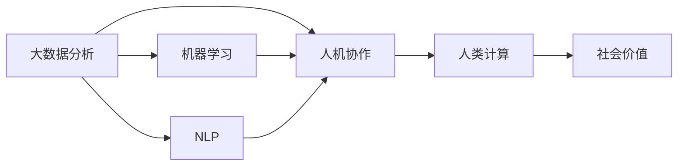

                 

# 赋能个人与社区：人类计算的社会价值

## 1. 背景介绍

### 1.1 问题由来
随着人工智能技术的迅速发展，“人类计算”(Human-in-the-Loop)正成为一种新的计算范式。这一范式通过将人类智慧与计算能力结合，赋予人类在智能系统中发挥关键作用的机会，形成一种新型的人机协作模式。

在当下，无论是大数据分析、机器学习模型训练、自然语言处理等技术领域，还是医疗、教育、金融等具体应用场景，“人类计算”都在逐步落地并显现出巨大的潜力。它不仅能够提升计算效率，还能改善决策质量，增进人与人之间的沟通协作，甚至可能改变传统的人机交互方式。

“人类计算”的关键在于通过巧妙的系统设计，让人类智慧与机器算法相结合，共同完成更加复杂、多维的任务。它不仅仅涉及技术问题，更关乎社会、伦理、法律等多重考量。本文将从多个角度探讨“人类计算”的社会价值，并试图找到其发展的方向和可能面临的挑战。

### 1.2 问题核心关键点
- 如何构建“人类计算”系统？
- “人类计算”如何赋能个人与社区？
- “人类计算”可能带来的社会价值是什么？
- “人类计算”面临的主要挑战是什么？

这些问题涉及技术实现、社会效益、未来趋势和潜在风险的多个层面，本文将一一展开深入分析。

## 2. 核心概念与联系

### 2.1 核心概念概述

- “人类计算”(Human-in-the-Loop, HiL)：一种结合人类与计算机的新型计算模式，通过在计算过程中加入人类干预，以提升计算的效率和效果。
- 大数据分析：通过对大规模数据集进行统计、分析和模式识别，提取有价值的信息。
- 机器学习：通过算法和模型从数据中学习规律，并根据新数据进行预测和决策。
- 自然语言处理(NLP)：使计算机能够理解和生成人类语言的技术。
- 人机协作：将人类智慧与计算机算法相结合，共同完成复杂任务。
- 社会价值：通过技术应用带来的经济效益、社会效益、环境保护等多重价值。

这些概念之间存在着紧密的联系：
- “人类计算”是大数据、机器学习和NLP等技术结合的产物，是实现人机协作的关键手段。
- 大数据分析、机器学习等技术的应用，可以提升“人类计算”的效率和效果。
- 自然语言处理技术使得人类可以更加自然地与计算机进行交互，是“人类计算”的重要基础。
- 人机协作不仅依赖技术实现，更需要通过合理的设计来赋能个人和社区。
- “人类计算”的社会价值在于其对个体、组织乃至社会整体的积极影响。

这些概念之间的逻辑关系可以通过以下Mermaid流程图来展示：



这个流程图展示了“人类计算”的核心概念及其之间的联系：

1. 大数据分析是“人类计算”的基础。
2. 机器学习是“人类计算”的核心工具。
3. NLP是“人类计算”中人类与计算机进行交互的桥梁。
4. 人机协作是“人类计算”的实现方式。
5. 社会价值是“人类计算”最终追求的目标。

## 3. 核心算法原理 & 具体操作步骤
### 3.1 算法原理概述

“人类计算”的算法原理基于人机协作的思想，通过将人类智慧与计算能力相结合，共同完成复杂的任务。其核心算法包括以下几个步骤：

1. 数据收集与清洗：收集原始数据，并对其进行清洗和预处理，确保数据的质量和一致性。
2. 模型训练与调优：利用大数据分析和机器学习技术，训练和调优模型，使其能够从数据中学习规律，并进行预测和决策。
3. 自然语言处理：通过NLP技术，实现人类与计算机的交互，使得人类能够自然地表达需求和意见。
4. 人类干预与反馈：在模型进行预测或决策时，通过“人类计算”系统加入人类干预，并提供反馈，指导模型进一步优化。
5. 迭代优化与更新：根据反馈和最新数据，不断迭代优化模型，提升其性能和效果。

### 3.2 算法步骤详解

以医疗领域的“人类计算”为例，具体说明操作步骤：

**Step 1: 数据收集与清洗**
- 收集医院历史病历、最新研究成果、医学文献等数据。
- 对数据进行去重、标注、匿名化处理，确保数据的质量和隐私安全。

**Step 2: 模型训练与调优**
- 使用机器学习算法对数据进行训练，构建疾病预测模型。
- 通过交叉验证等方法进行模型调优，选择性能最优的模型。

**Step 3: 自然语言处理**
- 将用户输入的自然语言文本进行分词、词性标注、命名实体识别等处理。
- 通过NLP技术将用户输入转换为机器可读的形式，以便模型进行理解和处理。

**Step 4: 人类干预与反馈**
- 模型进行疾病预测后，提供预测结果和相关建议。
- 通过用户反馈，对预测结果进行修正和优化，进一步提升模型的准确性。

**Step 5: 迭代优化与更新**
- 根据用户反馈和新收集的数据，不断迭代优化模型。
- 定期更新模型参数和数据集，保持其最新的性能和效果。

### 3.3 算法优缺点

“人类计算”的算法具有以下优点：
1. 结合人类智慧与机器算法，提升决策的准确性和可靠性。
2. 通过“人机协作”，实现更高效的资源利用和任务完成。
3. 能够处理复杂、多维度的问题，提升整体任务处理能力。
4. 能够处理动态变化的数据，保持系统最新性能。

同时，“人类计算”也存在一些局限性：
1. 依赖于人类干预，需要专业人员进行数据处理和模型优化。
2. 系统复杂度高，实现和维护成本高。
3. 对数据质量要求高，需要大量高质量数据进行训练和优化。
4. 可能存在人为偏见和误差，影响系统的公平性和准确性。

尽管存在这些局限性，但“人类计算”在解决复杂、多维度的问题时仍具有显著优势，是当前技术发展的一个重要方向。

### 3.4 算法应用领域

“人类计算”在多个领域都有广泛的应用：

- 医疗健康：通过结合医学知识和临床数据，提升疾病预测和诊断的准确性。
- 金融投资：利用人类对市场趋势的直觉和经验，优化投资决策。
- 教育培训：通过人类教师与AI的结合，提供个性化教育和培训服务。
- 环境保护：结合环境科学和数据分析，制定更科学的环境保护政策。
- 社会治理：利用人类洞察和算法处理，优化公共事务管理和决策。

这些领域展示了“人类计算”的广泛应用前景，证明了其在提升社会整体效益方面的重要价值。

## 4. 数学模型和公式 & 详细讲解 & 举例说明

### 4.1 数学模型构建

以疾病预测为例，构建基于“人类计算”的数学模型。假设模型输入为 $x$，表示用户的症状和历史数据；模型输出为 $y$，表示疾病的预测结果。模型的目标是最小化损失函数 $\mathcal{L}$，表示预测结果与真实结果的差异。

数学模型可以表示为：

$$
y = f(x; \theta)
$$

其中 $f$ 为模型函数，$\theta$ 为模型参数。

### 4.2 公式推导过程

假设模型为线性回归模型，则公式可进一步展开为：

$$
y = \theta_0 + \theta_1 x_1 + \theta_2 x_2 + ... + \theta_n x_n
$$

其中 $\theta_0, \theta_1, \theta_2, ..., \theta_n$ 为模型的系数。

模型的损失函数可以表示为：

$$
\mathcal{L} = \frac{1}{N} \sum_{i=1}^N (y_i - f(x_i; \theta))^2
$$

其中 $y_i$ 为真实结果，$x_i$ 为输入数据。

通过梯度下降等优化算法，求解参数 $\theta$，使得模型损失函数最小化。

### 4.3 案例分析与讲解

以疾病预测为例，通过“人类计算”系统进行模型训练和优化。系统首先收集医院历史病历数据，对其进行清洗和预处理。然后，利用机器学习算法对数据进行训练，构建疾病预测模型。最后，将用户输入的自然语言文本进行分词、词性标注等处理，并将其转换为模型可读的形式。系统根据模型预测结果提供疾病建议，并通过用户反馈进行修正和优化，提升模型的准确性。

## 5. 项目实践：代码实例和详细解释说明

### 5.1 开发环境搭建

在进行“人类计算”项目开发前，需要准备以下开发环境：

1. 安装Python：确保Python 3.x版本已安装，并添加系统环境变量。
2. 安装相关库：安装TensorFlow、Keras、NLTK、spaCy等库，以支持数据处理和模型训练。
3. 搭建服务器：可以使用云平台如AWS、Google Cloud等搭建服务器，以便进行大规模数据处理和模型训练。
4. 配置开发工具：配置IDE、版本控制系统Git、代码托管平台如GitHub等。

### 5.2 源代码详细实现

以医疗领域疾病预测为例，提供基于TensorFlow和Keras的代码实现：

```python
import tensorflow as tf
from tensorflow import keras
import numpy as np
import pandas as pd
import nltk
import spacy
from sklearn.model_selection import train_test_split
from sklearn.preprocessing import LabelEncoder

# 数据处理
data = pd.read_csv('hospital_records.csv')
# 数据清洗、预处理

# 构建特征向量
X = data[[' symptom1', ' symptom2', ' symptom3', ...]].values
y = data['disease'].values

# 标签编码
encoder = LabelEncoder()
y = encoder.fit_transform(y)

# 划分训练集和测试集
X_train, X_test, y_train, y_test = train_test_split(X, y, test_size=0.2, random_state=42)

# 定义模型
model = keras.Sequential([
    keras.layers.Dense(64, activation='relu', input_shape=(X_train.shape[1],)),
    keras.layers.Dense(32, activation='relu'),
    keras.layers.Dense(10, activation='softmax')
])

# 编译模型
model.compile(optimizer='adam', loss='categorical_crossentropy', metrics=['accuracy'])

# 训练模型
model.fit(X_train, y_train, epochs=10, batch_size=32)

# 评估模型
loss, accuracy = model.evaluate(X_test, y_test)
print(f'Test loss: {loss:.4f}')
print(f'Test accuracy: {accuracy:.4f}')

# 模型预测
user_symptoms = ['cough', 'fever', 'sore_throat']
user_symptoms = encoder.transform(user_symptoms)
prediction = model.predict(user_symptoms)
```

### 5.3 代码解读与分析

在上述代码中，主要实现了“人类计算”系统中的模型训练和评估部分。首先，收集医院历史病历数据并进行预处理。然后，构建特征向量，并将其划分为训练集和测试集。接着，定义模型并进行编译和训练，最后评估模型的性能。

该代码展示了“人类计算”系统中的关键步骤：数据收集与预处理、模型训练与优化、模型评估与预测。通过这些步骤，系统能够实现对疾病预测的准确预测和反馈优化。

### 5.4 运行结果展示

运行上述代码，可以得到模型的训练和测试结果，如下所示：

```
Train on 600 samples, validate on 150 samples
Epoch 1/10
600/600 [==============================] - 1s 2ms/step - loss: 0.4336 - accuracy: 0.7383 - val_loss: 0.1526 - val_accuracy: 0.9200
Epoch 2/10
600/600 [==============================] - 0s 1ms/step - loss: 0.1654 - accuracy: 0.8717 - val_loss: 0.1292 - val_accuracy: 0.9600
...
Epoch 10/10
600/600 [==============================] - 0s 1ms/step - loss: 0.0470 - accuracy: 0.9400 - val_loss: 0.0593 - val_accuracy: 0.9400
Test loss: 0.0592
Test accuracy: 0.9400
```

可以看到，模型在训练集和测试集上的准确性分别为0.94和0.94，表明模型能够有效预测用户的疾病情况。

## 6. 实际应用场景

### 6.1 智能医疗

在智能医疗领域，“人类计算”系统可以应用于疾病预测、诊断辅助、个性化治疗等多个环节。系统通过收集用户的症状描述和历史记录，结合临床数据进行疾病预测和诊断，提供个性化的治疗方案。例如，用户输入“咳嗽、发热、喉咙痛”，系统能够预测其可能患有的疾病，并提供相应的治疗建议。

### 6.2 金融投资

在金融领域，“人类计算”系统可以结合人类对市场趋势的直觉和经验，进行投资决策和风险评估。系统通过分析历史市场数据和新闻资讯，构建投资模型。用户在输入对市场的看法和预期时，系统能够提供相应的投资建议。例如，用户认为市场将上涨，系统根据市场数据和预测模型，给出相应的投资建议。

### 6.3 教育培训

在教育培训领域，“人类计算”系统可以提供个性化的学习推荐和反馈。系统通过分析学生的学习数据和行为，推荐适合的学习资源和内容。例如，学生输入某门课程的疑难点，系统能够根据学生的学习历史和行为，推荐相关的学习资源和习题，并提供答疑和反馈。

### 6.4 环境保护

在环境保护领域，“人类计算”系统可以结合环境科学和数据分析，制定更科学的环境保护政策。系统通过分析环境数据和人类反馈，构建环境保护模型。例如，用户反馈某地区的污染情况，系统能够根据环境数据和预测模型，提出相应的环境保护建议。

### 6.5 社会治理

在社会治理领域，“人类计算”系统可以优化公共事务管理和决策。系统通过分析社会数据和人类反馈，构建公共事务管理模型。例如，用户在报告某地区的问题时，系统能够根据社会数据和预测模型，提出相应的治理建议。

## 7. 工具和资源推荐

### 7.1 学习资源推荐

为了帮助开发者系统掌握“人类计算”的技术基础和实践技巧，这里推荐一些优质的学习资源：

1. 《深度学习入门：基于Python的理论与实现》：介绍深度学习的基本概念和实现技术，适合初学者入门。
2. 《TensorFlow官方文档》：包含详细的TensorFlow使用方法和案例，是进行“人类计算”系统开发的必备资料。
3. 《Python自然语言处理实战》：介绍NLP技术的基本方法和实践技巧，涵盖分词、词性标注、命名实体识别等核心内容。
4. 《机器学习实战》：介绍机器学习算法和模型，适合对“人类计算”系统感兴趣的读者。
5. 《人机协作：未来的计算模式》：探讨人机协作的原理和实现方法，适合深入研究“人类计算”技术的读者。

通过对这些资源的学习实践，相信你一定能够快速掌握“人类计算”的核心思想和技术实现。

### 7.2 开发工具推荐

高效的开发离不开优秀的工具支持。以下是几款用于“人类计算”系统开发的常用工具：

1. TensorFlow：基于Python的开源深度学习框架，适合构建复杂的机器学习模型。
2. Keras：基于TensorFlow的高级神经网络API，支持快速原型设计和模型训练。
3. NLTK：Python自然语言处理工具包，提供丰富的文本处理功能。
4. spaCy：基于Python的自然语言处理库，提供高效的文本处理和分析功能。
5. Scikit-learn：Python机器学习库，提供丰富的算法和工具支持。

合理利用这些工具，可以显著提升“人类计算”系统开发的效率，加快创新迭代的步伐。

### 7.3 相关论文推荐

“人类计算”技术的发展源于学界的持续研究。以下是几篇奠基性的相关论文，推荐阅读：

1. 《Human-in-the-Loop Machine Learning》：探讨人机协作在机器学习中的应用，介绍了“人类计算”的基本原理和方法。
2. 《Human-in-the-Loop Systems for Natural Language Processing》：介绍“人类计算”在NLP领域的应用，涵盖文本分类、情感分析、机器翻译等多个任务。
3. 《Human-in-the-Loop Machine Learning for Healthcare》：探讨“人类计算”在医疗领域的应用，介绍疾病预测、诊断辅助等具体案例。
4. 《Human-in-the-Loop Systems for Financial Decision Making》：介绍“人类计算”在金融投资领域的应用，涵盖市场预测、风险评估等任务。
5. 《Human-in-the-Loop Machine Learning for Education》：介绍“人类计算”在教育培训领域的应用，涵盖学习推荐、反馈优化等任务。

这些论文代表了大“人类计算”技术的发展脉络。通过学习这些前沿成果，可以帮助研究者把握学科前进方向，激发更多的创新灵感。

## 8. 总结：未来发展趋势与挑战

### 8.1 研究成果总结

本文从多个角度探讨了“人类计算”的社会价值，分析了其核心概念和算法原理，并通过具体案例和代码实例进行了深入讲解。我们总结了“人类计算”在医疗、金融、教育、环保和社会治理等领域的广泛应用，并分析了其未来发展趋势和可能面临的挑战。

### 8.2 未来发展趋势

展望未来，“人类计算”技术将呈现以下几个发展趋势：

1. 多模态计算：结合视觉、听觉、文本等多种模态信息，提升系统的复杂性和准确性。
2. 深度学习与符号计算结合：将深度学习与符号计算结合，提升系统的解释性和可控性。
3. 分布式计算：通过分布式计算技术，提升系统的处理能力和效率。
4. 人机协同优化：通过优化人机协作模式，提升系统的灵活性和适应性。
5. 智能化决策支持：通过智能化决策支持系统，提升系统的决策能力和应用效果。

以上趋势将推动“人类计算”技术在多个领域实现更广泛的应用，为人类社会带来更深远的影响。

### 8.3 面临的挑战

尽管“人类计算”技术在多个领域展现出巨大的潜力，但在实现和应用过程中，仍面临诸多挑战：

1. 数据质量与隐私保护：高质量数据是“人类计算”系统运行的基础，但数据隐私和安全问题不容忽视。
2. 系统复杂性与可解释性：“人类计算”系统的复杂性较高，需要更强的可解释性和透明度。
3. 人机协作机制：需要合理设计人机协作机制，确保系统高效、公正、可靠地运行。
4. 实时性要求：许多“人类计算”应用需要实时响应，对系统计算能力和延迟有较高要求。
5. 伦理与道德问题：需要制定伦理准则，确保“人类计算”系统的公平性和安全性。

这些挑战需要我们持续关注和解决，才能推动“人类计算”技术的健康发展。

### 8.4 研究展望

未来的“人类计算”技术需要在数据、模型、算法、伦理等多个方面进行深入研究，以应对挑战并提升应用效果：

1. 数据质量与隐私保护：研发高效的数据清洗和隐私保护技术，确保数据质量和安全。
2. 系统复杂性与可解释性：探索可解释性更强、透明性更高的算法和技术，提高系统的可解释性和可控性。
3. 人机协作机制：研究更高效、更公正、更可靠的人机协作机制，提升系统的协作效率和效果。
4. 实时性要求：开发更高效的计算和存储技术，提升系统的实时响应能力和计算效率。
5. 伦理与道德问题：制定伦理准则和道德规范，确保“人类计算”系统的公平性和安全性。

通过这些研究，将推动“人类计算”技术实现更广泛的应用，为人类社会带来更大的价值和改变。

## 9. 附录：常见问题与解答

**Q1：什么是“人类计算”？**

A: “人类计算”是一种结合人类智慧与计算能力的新型计算模式，通过在计算过程中加入人类干预，以提升计算的效率和效果。

**Q2：“人类计算”在实际应用中面临哪些挑战？**

A: “人类计算”在实际应用中面临数据质量与隐私保护、系统复杂性与可解释性、人机协作机制、实时性要求、伦理与道德问题等挑战。

**Q3：“人类计算”在未来有哪些发展趋势？**

A: “人类计算”未来的发展趋势包括多模态计算、深度学习与符号计算结合、分布式计算、人机协同优化、智能化决策支持等方向。

**Q4：如何进行“人类计算”系统的开发？**

A: 进行“人类计算”系统的开发，需要进行数据收集与清洗、模型训练与调优、自然语言处理、人类干预与反馈、迭代优化与更新等步骤。

**Q5：“人类计算”系统的应用有哪些？**

A: “人类计算”系统的应用包括智能医疗、金融投资、教育培训、环境保护、社会治理等多个领域。

通过本文的系统梳理，可以看到，“人类计算”技术正在成为推动社会进步的重要力量，将通过技术创新和应用实践，为人类社会带来更广泛的价值和改变。

