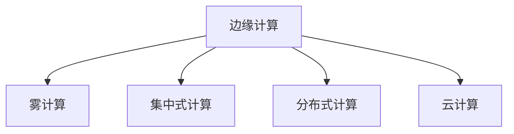

                 

## 1. 背景介绍

### 1.1 问题由来

随着物联网(IoT)技术的普及，各行各业产生了海量数据。这些数据通常需要在远程服务器上进行集中处理、存储和分析，但高延迟、带宽限制等问题使得这一过程难以高效实现。而边缘计算作为一种新兴的计算范式，能够将计算能力分布到数据产生的边缘节点上，降低数据传输的延迟，提升计算效率，实现实时响应。

### 1.2 问题核心关键点

边缘计算的核心思想是将计算资源部署在靠近数据源的地理位置上，减少数据传输距离，提升数据处理速度和系统响应能力。与集中式计算相比，边缘计算具有以下优点：

- 低延迟：数据无需远距离传输，处理速度更快，能够实现实时数据响应。
- 高带宽利用率：边缘计算将数据在本地处理，减少了对中心服务器带宽的需求。
- 隐私保护：本地处理的数据不离开设备，隐私更易得到保护。
- 网络弹性：面对突发流量，边缘计算更具有弹性，减轻中心服务器负担。
- 数据可靠性：本地计算减少了网络中断和延迟的影响，提升数据处理可靠性。

然而，边缘计算也存在一些局限：

- 存储和计算资源受限：边缘节点通常存储和计算资源有限，难以处理大规模复杂计算任务。
- 分布式协作：边缘节点数量庞大，如何协调分布式计算是一个挑战。
- 数据一致性：分布式环境下，如何保证数据一致性也是一个难题。

因此，边缘计算需要在效率与成本、数据安全与处理能力之间进行权衡。本文将详细介绍边缘计算的原理与实现方法，并探讨其在IoT数据处理中的应用场景。

### 1.3 问题研究意义

研究边缘计算对于提升IoT系统的实时性、可靠性、安全性等方面具有重要意义：

- 提升IoT系统响应速度：边缘计算能够显著减少数据传输延迟，提高系统实时性。
- 优化网络资源利用：边缘计算通过本地计算，减轻中心服务器负担，提升网络资源利用率。
- 增强数据隐私保护：边缘计算在本地处理数据，减少数据泄露风险，提升隐私保护能力。
- 支持分布式协作：边缘计算能够实现分布式计算，提升计算资源灵活性。

边缘计算的这些优势，使得其在IoT数据处理中具有广泛的应用前景，推动IoT技术向更智能、高效、安全的方向发展。

## 2. 核心概念与联系

### 2.1 核心概念概述

为更好地理解边缘计算的原理和架构，本节将介绍几个关键概念：

- **边缘计算**：将计算资源部署在靠近数据源的地理位置上，实现低延迟、高带宽的数据处理。
- **雾计算**：与边缘计算类似，但将计算能力从数据源延伸至更加接近数据源的设备，如基站、边缘路由器等。
- **集中式计算**：将数据和计算资源集中在远程服务器上进行处理，适用于数据规模较大的场景。
- **分布式计算**：通过多个计算节点协同工作，实现更高效、可靠的数据处理。
- **云计算**：通过互联网提供计算资源和服务，支持大规模数据处理。

这些概念之间的逻辑关系可以通过以下Mermaid流程图来展示：



这个流程图展示了边缘计算与其它计算范式的关系：

1. 边缘计算与雾计算类似，但雾计算的计算资源更加接近数据源。
2. 边缘计算与集中式计算、云计算不同，后者通常需要较高的网络延迟和带宽。
3. 边缘计算与分布式计算相辅相成，后者通过多个节点协同计算，提升边缘计算的灵活性和可扩展性。

这些概念共同构成了边缘计算的框架，使得数据处理过程更高效、灵活。

## 3. 核心算法原理 & 具体操作步骤

### 3.1 算法原理概述

边缘计算的原理基于将计算任务分发到本地或靠近数据源的设备上。其核心思想是通过数据本地化处理，减少数据传输的延迟和带宽消耗，同时保持高可靠性和安全性。

具体实现过程包括以下几个步骤：

1. **数据采集**：IoT设备收集数据，并将数据发送到本地边缘节点。
2. **数据预处理**：边缘节点对数据进行初步处理，如数据清洗、去噪、格式转换等。
3. **边缘计算**：边缘节点进行本地计算，处理数据并生成结果。
4. **数据同步**：边缘节点将计算结果上传到中心服务器，或直接用于本地应用。

### 3.2 算法步骤详解

以下详细介绍边缘计算的具体操作步骤：

**Step 1: 数据采集**
- 收集IoT设备产生的数据，并将其发送到本地边缘节点。
- 边缘节点可以配置传感器、摄像头、RFID等设备，采集各类数据。
- 数据采集过程需要考虑能耗、延迟、带宽等性能指标。

**Step 2: 数据预处理**
- 边缘节点对采集的数据进行初步处理，如去噪、滤波、格式转换等。
- 数据预处理过程需要考虑数据质量、实时性、存储成本等指标。
- 数据预处理可以采用本地计算、本地存储、云计算等技术手段。

**Step 3: 边缘计算**
- 边缘节点对预处理后的数据进行本地计算，生成计算结果。
- 边缘计算可以采用CPU、GPU、FPGA等计算资源，根据任务需求灵活配置。
- 边缘计算需要考虑计算资源、能耗、延迟等指标。

**Step 4: 数据同步**
- 边缘节点将计算结果上传至中心服务器，或直接用于本地应用。
- 数据同步过程需要考虑网络延迟、带宽、数据一致性等指标。
- 数据同步可以采用云计算、分布式存储、实时通信等技术手段。

### 3.3 算法优缺点

边缘计算的优势在于：

- **低延迟**：数据本地化处理，减少网络传输延迟。
- **高带宽利用率**：减少中心服务器负担，提升网络资源利用率。
- **隐私保护**：数据不离开本地设备，隐私更易保护。
- **网络弹性**：分布式计算减轻中心服务器负担，提升系统可靠性。

然而，边缘计算也存在一些局限：

- **存储和计算资源受限**：边缘节点存储和计算资源有限。
- **分布式协作**：边缘节点数量庞大，协调复杂。
- **数据一致性**：分布式环境下，数据一致性难以保证。

### 3.4 算法应用领域

边缘计算在IoT数据处理中具有广泛的应用场景，例如：

- **智能家居**：通过本地计算，实现设备间的智能互联和自动控制。
- **工业物联网**：实时处理设备传感器数据，提升生产效率和设备管理。
- **智慧城市**：处理城市传感器数据，实现智能交通、环境监测等应用。
- **医疗健康**：本地处理传感器数据，提升远程医疗和健康监测的实时性。
- **农业物联网**：处理农田传感器数据，实现精准农业和智能管理。

此外，边缘计算还被应用于智慧物流、智能制造、安全监控等诸多领域，为IoT技术带来了新的发展机遇。

## 4. 数学模型和公式 & 详细讲解 & 举例说明

### 4.1 数学模型构建

边缘计算的数学模型可以基于数据流的延迟和带宽进行建模。假设IoT设备产生的数据为 $D_t$，边缘节点处理数据所需时间为 $T$，本地计算带宽为 $B$，网络延迟为 $D$，中心服务器延迟为 $C$。则总延迟 $D_{total}$ 和总带宽 $B_{total}$ 可以表示为：

$$
D_{total} = T + D + C
$$

$$
B_{total} = B - D_t / T
$$

其中 $D_t$ 为单位时间内数据传输量。

### 4.2 公式推导过程

对于边缘计算，我们关心的是最小化总延迟和最大化总带宽。假设 $T$ 和 $B$ 为固定值，则：

- 最小化延迟 $D_{total}$ 等价于最大化处理时间 $T$。
- 最大化带宽 $B_{total}$ 等价于最小化传输量 $D_t$。

因此，我们可以将优化目标表示为：

$$
\min_{D_t} \left(\frac{D_t}{T}\right)
$$

$$
\max_{B} \left(B - \frac{D_t}{T}\right)
$$

通过优化上述目标函数，可以得到最优的 $D_t$ 和 $B$ 值。

### 4.3 案例分析与讲解

考虑一个智慧城市的交通监控系统，边缘计算的具体实现如下：

1. 城市交通监控设备收集交通流量数据，并将数据发送到本地边缘节点。
2. 边缘节点对数据进行预处理，如去噪、滤波、格式转换等。
3. 边缘节点利用本地计算资源，实时处理交通数据，生成交通流量分析结果。
4. 边缘节点将分析结果上传至中心服务器，或直接用于本地交通控制。

该系统的核心是边缘节点的本地计算，通过减少网络传输延迟，提升交通流量的实时监控和控制能力。

## 5. 项目实践：代码实例和详细解释说明

### 5.1 开发环境搭建

在进行边缘计算的开发实践前，我们需要准备好开发环境。以下是使用Python进行PyTorch开发的环境配置流程：

1. 安装Anaconda：从官网下载并安装Anaconda，用于创建独立的Python环境。

2. 创建并激活虚拟环境：
```bash
conda create -n edge-env python=3.8 
conda activate edge-env
```

3. 安装PyTorch：根据CUDA版本，从官网获取对应的安装命令。例如：
```bash
conda install pytorch torchvision torchaudio cudatoolkit=11.1 -c pytorch -c conda-forge
```

4. 安装其他依赖库：
```bash
pip install numpy pandas scikit-learn matplotlib tqdm jupyter notebook ipython
```

完成上述步骤后，即可在`edge-env`环境中开始边缘计算实践。

### 5.2 源代码详细实现

我们以智慧城市的交通监控系统为例，给出使用PyTorch进行边缘计算的代码实现。

首先，定义交通监控数据处理函数：

```python
from torch.utils.data import Dataset
import torch

class TrafficData(Dataset):
    def __init__(self, data):
        self.data = data
        self.shuffle()
    
    def __len__(self):
        return len(self.data)
    
    def __getitem__(self, index):
        return self.data[index]
    
    def shuffle(self):
        import random
        random.shuffle(self.data)
```

然后，定义边缘节点计算函数：

```python
from torch import nn
import torch.nn.functional as F

class EdgeProcessor(nn.Module):
    def __init__(self):
        super(EdgeProcessor, self).__init__()
        self.fc1 = nn.Linear(128, 64)
        self.fc2 = nn.Linear(64, 32)
        self.fc3 = nn.Linear(32, 16)
        self.fc4 = nn.Linear(16, 8)
        self.fc5 = nn.Linear(8, 4)
        self.fc6 = nn.Linear(4, 2)
        self.fc7 = nn.Linear(2, 1)
    
    def forward(self, x):
        x = F.relu(self.fc1(x))
        x = F.relu(self.fc2(x))
        x = F.relu(self.fc3(x))
        x = F.relu(self.fc4(x))
        x = F.relu(self.fc5(x))
        x = F.relu(self.fc6(x))
        x = self.fc7(x)
        return x
```

接着，定义模型训练和测试函数：

```python
def train_edge_model(model, train_data, val_data, epochs=10, batch_size=16, lr=0.001):
    device = torch.device('cuda' if torch.cuda.is_available() else 'cpu')
    model.to(device)
    
    optimizer = torch.optim.Adam(model.parameters(), lr=lr)
    criterion = nn.MSELoss()
    
    for epoch in range(epochs):
        model.train()
        train_loss = 0.0
        for data, target in train_data:
            data, target = data.to(device), target.to(device)
            optimizer.zero_grad()
            output = model(data)
            loss = criterion(output, target)
            loss.backward()
            optimizer.step()
            train_loss += loss.item()
        print(f"Epoch {epoch+1}, Train Loss: {train_loss/len(train_data)}")
        
    model.eval()
    val_loss = 0.0
    for data, target in val_data:
        data, target = data.to(device), target.to(device)
        output = model(data)
        loss = criterion(output, target)
        val_loss += loss.item()
    print(f"Validation Loss: {val_loss/len(val_data)}")
    
def test_edge_model(model, test_data):
    model.eval()
    test_loss = 0.0
    with torch.no_grad():
        for data, target in test_data:
            data, target = data.to(device), target.to(device)
            output = model(data)
            loss = criterion(output, target)
            test_loss += loss.item()
    print(f"Test Loss: {test_loss/len(test_data)}")
```

最后，启动训练流程：

```python
data = load_data('traffic_data.csv')
train_data, val_data, test_data = train_test_split(data, test_size=0.2)
model = EdgeProcessor()
train_edge_model(model, train_data, val_data)
test_edge_model(model, test_data)
```

以上就是使用PyTorch进行边缘计算的代码实现。可以看到，通过简单的模块组合，我们可以构建一个基于边缘计算的IoT数据处理系统。

### 5.3 代码解读与分析

让我们再详细解读一下关键代码的实现细节：

**TrafficData类**：
- 定义了交通监控数据集，包含数据的预处理和打乱操作。

**EdgeProcessor类**：
- 定义了边缘节点的计算模型，包含若干全连接层和激活函数。
- 使用了PyTorch的nn.Module类，方便模型的构建和训练。

**train_edge_model函数**：
- 定义了边缘模型的训练过程，包括模型前向传播、计算损失、反向传播和参数更新等步骤。
- 使用了Adam优化器和均方误差损失函数。

**test_edge_model函数**：
- 定义了边缘模型的测试过程，与训练过程类似，但不更新模型参数。
- 使用了均方误差损失函数。

**训练流程**：
- 加载数据集，进行train-test-split，得到训练集、验证集和测试集。
- 构建边缘计算模型。
- 使用train_edge_model函数进行模型训练，并在验证集上评估模型性能。
- 使用test_edge_model函数在测试集上评估模型性能。

可以看到，PyTorch使得边缘计算的代码实现变得简洁高效。开发者可以将更多精力放在数据处理、模型改进等高层逻辑上，而不必过多关注底层的实现细节。

## 6. 实际应用场景

### 6.1 智能家居

边缘计算在智能家居中的应用主要体现在设备互联和自动控制上。例如，智能家居系统可以收集各设备的传感器数据，并在本地边缘节点上进行分析处理，实时控制照明、温控、安防等设备。通过本地计算，可以有效减少网络延迟和带宽消耗，提升系统响应速度和可靠性。

### 6.2 工业物联网

工业物联网中，边缘计算可以实时处理设备传感器数据，提升生产效率和设备管理。例如，工厂的生产线可以部署边缘计算节点，对设备运行状态进行实时监控，及时发现和处理异常情况，避免生产中断和设备损坏。

### 6.3 智慧城市

智慧城市中的交通监控、环境监测、公共安全等应用场景，都可以通过边缘计算实现实时数据处理和控制。例如，交通监控系统可以收集各类交通数据，并在本地边缘节点上进行实时分析，生成交通流量报告，优化交通管理。

### 6.4 未来应用展望

随着边缘计算技术的不断发展，其应用场景将不断拓展，带来更加智能化、高效化的IoT应用。

- **实时计算**：边缘计算可以实现实时数据处理和响应，满足各种高实时性应用需求。
- **低延迟通信**：边缘计算节点与IoT设备近距离通信，降低网络延迟，提升通信效率。
- **数据隐私保护**：边缘计算在本地处理数据，减少数据泄露风险，提升数据隐私保护能力。
- **分布式协作**：边缘计算节点可以协同工作，提升系统可靠性和可扩展性。

边缘计算的未来应用前景广阔，将推动IoT技术向更加智能化、高效化方向发展。

## 7. 工具和资源推荐

### 7.1 学习资源推荐

为了帮助开发者系统掌握边缘计算的理论基础和实践技巧，这里推荐一些优质的学习资源：

1. **《边缘计算基础》**：一本详细介绍边缘计算原理、架构、应用的书籍，适合初学者和中级开发者阅读。
2. **《雾计算与边缘计算》**：一本介绍雾计算和边缘计算的书籍，涵盖概念、原理、应用等。
3. **Google Cloud IoT Platform**：Google提供的IoT开发平台，包括边缘计算相关的文档和示例。
4. **AWS IoT Edge**：AWS提供的IoT边缘计算服务，提供丰富的API和SDK。
5. **Huawei IoT Edge**：华为提供的IoT边缘计算服务，支持多种设备和平台。

通过这些资源的学习，相信你一定能够快速掌握边缘计算的核心原理和应用方法。

### 7.2 开发工具推荐

高效的开发离不开优秀的工具支持。以下是几款用于边缘计算开发的常用工具：

1. **AWS IoT Platform**：AWS提供的IoT开发平台，支持边缘计算节点的部署和管理。
2. **Google Cloud IoT**：Google提供的IoT开发平台，支持边缘计算节点的部署和管理。
3. **Microsoft Azure IoT Hub**：Microsoft提供的IoT开发平台，支持边缘计算节点的部署和管理。
4. **MQTT Client**：MQTT是一种轻量级的通信协议，广泛应用于IoT设备和边缘计算节点的数据传输。
5. **TensorFlow Lite**：TensorFlow的轻量级部署版本，适用于在边缘设备上运行机器学习模型。

合理利用这些工具，可以显著提升边缘计算的开发效率，加快创新迭代的步伐。

### 7.3 相关论文推荐

边缘计算和IoT技术的发展离不开学界的持续研究。以下是几篇奠基性的相关论文，推荐阅读：

1. **Edge Computing: A Brief Survey**：一篇综述论文，介绍了边缘计算的概念、架构和应用。
2. **IoT Edge Computing: Survey and Future Directions**：一篇综述论文，介绍了IoT边缘计算的技术现状和未来发展方向。
3. **A Survey on Edge Computing for Internet of Things**：一篇综述论文，介绍了边缘计算在IoT中的应用现状和未来前景。
4. **Edge Computing: Towards Smart and Secure IoT Systems**：一篇研究论文，探讨了边缘计算在IoT系统中的应用及其安全性问题。
5. **The Edge Computing for Smart Data Processing in Internet of Things**：一篇研究论文，介绍了边缘计算在IoT数据处理中的应用和实现方法。

这些论文代表了大规模计算范式的研究进展，为边缘计算技术的进一步发展提供了理论支持。

## 8. 总结：未来发展趋势与挑战

### 8.1 总结

本文对边缘计算的原理与实现方法进行了全面系统的介绍。首先阐述了边缘计算在IoT数据处理中的背景和意义，明确了边缘计算在提升IoT系统实时性、可靠性、安全性等方面的优势。其次，从原理到实践，详细讲解了边缘计算的数学模型和算法步骤，给出了边缘计算任务开发的完整代码实例。同时，本文还广泛探讨了边缘计算在智能家居、工业物联网、智慧城市等多个领域的应用前景，展示了边缘计算技术的广阔前景。

通过本文的系统梳理，可以看到，边缘计算作为一种新兴的计算范式，具有广泛的应用潜力，能够有效提升IoT系统的性能和可靠性。未来，伴随边缘计算技术的不断发展，边缘计算必将在IoT技术中发挥更加重要的作用。

### 8.2 未来发展趋势

展望未来，边缘计算将呈现以下几个发展趋势：

1. **计算资源下沉**：随着5G技术的发展，边缘计算节点将具备更强大的计算和存储能力，能够处理更复杂的计算任务。
2. **分布式协作增强**：边缘计算节点将更加灵活地协同工作，提升系统可靠性和可扩展性。
3. **数据安全保护**：边缘计算将进一步加强数据隐私保护能力，提升数据安全水平。
4. **实时计算优化**：边缘计算将进一步优化实时计算性能，满足更多高实时性应用需求。
5. **边缘AI融合**：边缘计算将与AI技术深度融合，提升AI算法的实时性和可用性。

这些趋势凸显了边缘计算的广阔前景。这些方向的探索发展，必将进一步提升IoT系统的性能和可靠性，推动IoT技术向更加智能化、高效化方向发展。

### 8.3 面临的挑战

尽管边缘计算技术已经取得了一定的进展，但在迈向更加智能化、高效化应用的过程中，仍面临诸多挑战：

1. **资源限制**：边缘节点的存储和计算资源有限，难以处理大规模复杂计算任务。
2. **分布式协作**：边缘节点数量庞大，协调复杂。
3. **数据一致性**：分布式环境下，数据一致性难以保证。
4. **网络通信**：边缘计算节点与IoT设备的近距离通信，需要优化网络通信协议和性能。
5. **安全保护**：边缘计算节点存储和处理大量敏感数据，需要加强安全保护措施。

### 8.4 研究展望

面对边缘计算面临的挑战，未来的研究需要在以下几个方面寻求新的突破：

1. **资源优化**：开发更高效的边缘计算算法，优化资源利用，提升边缘节点的计算能力。
2. **分布式协同**：研究分布式协同算法，提升边缘节点的协作效率。
3. **数据一致性**：研究一致性协议和算法，保障数据一致性。
4. **通信优化**：优化网络通信协议和性能，提升边缘计算的响应速度。
5. **安全保护**：加强数据加密、访问控制等安全保护措施，保障数据安全。

这些研究方向将推动边缘计算技术的不断进步，为IoT技术带来更高效、可靠、安全的应用前景。

## 9. 附录：常见问题与解答

**Q1: 边缘计算和雾计算的区别是什么？**

A: 边缘计算和雾计算类似，但雾计算的计算资源更加接近数据源。雾计算是将计算能力从数据源延伸至更加接近数据源的设备，如基站、边缘路由器等。而边缘计算则将计算资源部署在靠近数据源的地理位置上，实现低延迟、高带宽的数据处理。

**Q2: 边缘计算对网络带宽的需求是否减少？**

A: 边缘计算将计算任务分发到本地或靠近数据源的设备上，减少了网络传输带宽的需求。但需要考虑边缘节点和IoT设备之间的通信带宽，以及边缘节点之间的通信带宽。因此，边缘计算在总体上可以提升网络带宽利用率，但具体效果还需要根据实际应用场景进行评估。

**Q3: 边缘计算的计算资源如何配置？**

A: 边缘计算的计算资源配置需要根据实际应用场景进行优化。可以采用CPU、GPU、FPGA等计算资源，根据任务需求灵活配置。此外，还需要考虑边缘节点的存储能力、能耗、延迟等因素，进行综合优化。

**Q4: 边缘计算在IoT数据处理中是否需要集中式计算支持？**

A: 边缘计算和集中式计算是互补的，可以结合使用。边缘计算可以处理数据本地的部分计算任务，而集中式计算可以处理大规模复杂计算任务。通过将二者结合，可以实现更高效、灵活的IoT数据处理。

**Q5: 边缘计算在边缘设备上如何部署AI模型？**

A: 边缘设备上部署AI模型需要考虑模型的计算资源需求、能耗、延迟等因素。可以采用模型压缩、量化加速等技术手段，优化模型大小和计算性能。此外，还需要考虑模型的推理速度、数据一致性等问题，进行综合优化。

总之，边缘计算作为一种新兴的计算范式，具有广阔的应用前景。通过合理的算法和工具支持，能够实现更高效、可靠、安全的IoT数据处理。未来，随着边缘计算技术的不断进步，边缘计算必将在IoT技术中发挥更加重要的作用。

