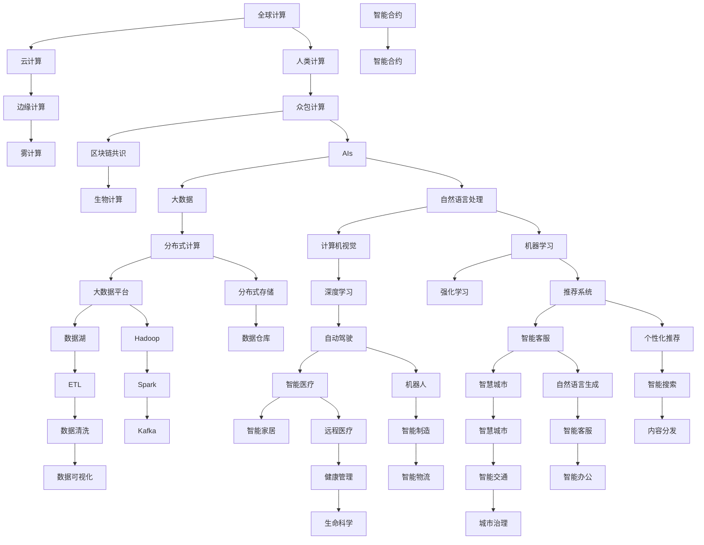

                 

# 连接全球智慧：人类计算的全球影响力

> 关键词：全球计算、人类计算、人工智能、云计算、大数据、区块链

## 1. 背景介绍

### 1.1 问题由来

在全球化进程加速的今天，数据的流动和信息的交换已经突破了地理、政治、经济的边界，成为了全球经济的重要驱动力。互联网的普及和物联网技术的发展，使得海量数据产生，人类对计算能力的需求也达到了空前的高度。在这样的背景下，计算不再仅仅局限于计算机科学家的实验室，而是渗透到人类社会的各个角落，成为推动全球社会进步的关键技术。

人类计算（Human Computing）作为连接全球智慧的重要方式，在全球经济、政治、科技、文化等领域都发挥着不可替代的作用。它不仅改变了人们的生活方式，也重新定义了国际合作与竞争的格局。在人工智能、大数据、云计算、区块链等技术的推动下，人类计算正在从以机器为中心的计算范式，向以人为核心的计算范式转变。

### 1.2 问题核心关键点

本文将从技术、应用和社会三个维度，详细探讨人类计算的全球影响力。首先，我们将讨论大语言模型微调和全球计算能力提升等技术要素；其次，我们将探讨AI驱动的医疗、金融、交通等全球性应用案例；最后，我们将分析人类计算如何影响全球政治、经济和文化格局，推动全球智慧的普及。

## 2. 核心概念与联系

### 2.1 核心概念概述

为更好地理解人类计算的全球影响力，我们需先了解几个核心概念：

- **全球计算（Global Computing）**：指通过互联网将全球的计算资源连接起来，形成全球性的计算平台，实现资源共享和协同计算。它包括云计算、边缘计算、雾计算等多种形式。

- **人类计算（Human Computing）**：指通过普通人类参与的计算，将人类的智慧与计算资源相结合，提升整体计算能力。它包括众包计算、区块链共识、生物计算等多种形式。

- **人工智能（AI）**：指通过算法和计算模型，使计算机系统具备智能推理和自主决策的能力。它涵盖深度学习、自然语言处理、计算机视觉等技术领域。

- **大数据（Big Data）**：指规模庞大、复杂多变、实时增长的数据集。它需要复杂的数据处理技术和分布式计算平台，以支持高并发的数据采集和分析。

- **区块链（Blockchain）**：指去中心化的分布式账本技术，可以实现安全的交易记录和数据存储。它依赖加密算法和共识机制，保障数据的透明和可信。

这些概念之间存在着紧密的联系，共同构成了人类计算的核心体系。

### 2.2 核心概念原理和架构的 Mermaid 流程图



这个流程图展示了核心概念之间的联系，以及它们在实际应用中的组合。例如，云计算和边缘计算构成了全球计算的骨架，而人类计算则通过普通人类的参与，进一步提升了计算的效率和效果。AI、大数据、区块链等技术则在这些计算框架的基础上，拓展了应用场景和能力。

## 3. 核心算法原理 & 具体操作步骤
### 3.1 算法原理概述

人类计算的核心算法原理，可以概括为“连接-计算-应用”三个步骤：

1. **连接（Connect）**：通过互联网等技术手段，将全球的计算资源和人力资源连接起来，形成统一的计算平台。
2. **计算（Compute）**：利用计算平台上的算法和数据，进行高效的计算处理。
3. **应用（Apply）**：将计算结果应用于全球范围内的各个领域，解决实际问题，提升社会生产力。

这种连接-计算-应用的模式，形成了人类计算的基本框架，推动了全球智慧的普及。

### 3.2 算法步骤详解

以下是人类计算的详细步骤：

1. **数据采集**：通过传感器、移动设备、社交媒体等渠道，采集全球范围内的数据，并进行预处理和清洗。
2. **数据存储**：将处理后的数据存储在分布式数据库或云存储中，确保数据的安全和可访问性。
3. **计算分配**：将计算任务分配给合适的计算节点，根据计算资源的可用性和负载情况，动态调整计算分配策略。
4. **算法应用**：利用先进算法对数据进行处理，形成有用的计算结果，例如数据挖掘、机器学习、自然语言处理等。
5. **结果反馈**：将计算结果反馈给用户，进行可视化展示或直接应用于实际场景，实现决策支持、智能推荐等功能。

### 3.3 算法优缺点

人类计算具有以下优点：

- **灵活性高**：可以迅速适应各种应用场景，满足不同用户的需求。
- **资源共享**：通过云计算和边缘计算等技术，实现全球计算资源的共享，降低资源成本。
- **数据多样化**：结合大数据和区块链技术，可以从多种数据源中获取信息，提升计算结果的准确性和全面性。

同时，人类计算也存在一些缺点：

- **隐私风险**：数据采集和存储可能涉及个人隐私问题，需要严格的数据保护和隐私管理。
- **安全威胁**：全球计算平台容易受到网络攻击，需要强大的安全保障措施。
- **计算延时**：由于数据分布广泛，计算任务可能需要跨区域传输和计算，导致一定的延时。

### 3.4 算法应用领域

人类计算的应用领域非常广泛，涵盖了科技、经济、医疗、教育等多个领域。

- **科技**：自动驾驶、机器人、智能制造等领域的研发和应用。
- **经济**：金融、贸易、物流等领域的智能化管理。
- **医疗**：远程医疗、健康管理、生命科学等领域的创新应用。
- **教育**：在线教育、智慧教室、个性化学习等领域的教学改革。
- **文化**：社交媒体、内容分发、智能客服等领域的用户体验提升。

这些应用场景展示了人类计算在推动全球智慧普及方面的巨大潜力。

## 4. 数学模型和公式 & 详细讲解 & 举例说明

### 4.1 数学模型构建

为了更好地理解人类计算，我们引入以下数学模型：

1. **数据采集模型**：
   $$
   \mathcal{D} = \bigcup_{i=1}^{N} \{ \mathbf{x}_i, y_i \}
   $$
   其中 $\mathbf{x}_i$ 表示第 $i$ 个样本的数据特征，$y_i$ 表示标签。

2. **计算模型**：
   $$
   \mathcal{M} = \{ f(\mathbf{x}_i; \theta) \}
   $$
   其中 $f(\cdot)$ 表示计算函数，$\theta$ 表示模型参数。

3. **结果输出模型**：
   $$
   \mathcal{R} = \{ y'_i \}
   $$
   其中 $y'_i$ 表示计算结果，通常是预测标签。

### 4.2 公式推导过程

- **数据采集**：
  数据采集过程涉及传感器、移动设备、社交媒体等数据源，数据采集模型的推导如下：
  $$
  \mathbf{x}_i = \{ x_{i1}, x_{i2}, ..., x_{im} \}
  $$
  其中 $x_{ij}$ 表示第 $i$ 个样本的第 $j$ 个特征。

- **计算模型**：
  以深度学习模型为例，计算模型的推导如下：
  $$
  \mathbf{z}_i = \mathcal{M}(\mathbf{x}_i; \theta)
  $$
  其中 $\mathbf{z}_i$ 表示第 $i$ 个样本的中间计算结果。

- **结果输出**：
  结果输出模型通常使用损失函数来衡量计算结果与真实标签之间的差异，例如：
  $$
  \mathcal{L}(\mathbf{y}_i; \theta) = -\sum_{j=1}^{J} \log P(y'_i = j | \mathbf{x}_i; \theta)
  $$
  其中 $P(\cdot)$ 表示概率分布，$J$ 表示标签数量。

### 4.3 案例分析与讲解

以智慧城市为例，我们将展示人类计算的具体应用：

1. **数据采集**：通过城市中的传感器、监控摄像头、公共WiFi等设备，收集城市交通、环境、安全等方面的数据。
2. **计算模型**：利用深度学习模型对采集到的数据进行处理，例如交通流量预测、环境污染监测等。
3. **结果输出**：将计算结果反馈给城市管理部门，实现交通管理、环境治理、安全监控等功能。

## 5. 项目实践：代码实例和详细解释说明

### 5.1 开发环境搭建

为了进行人类计算的项目实践，我们需要搭建以下开发环境：

1. **云计算平台**：使用AWS、Azure或阿里云等云计算服务，提供分布式计算和存储资源。
2. **大数据平台**：使用Hadoop、Spark或Flink等大数据处理框架，支持大规模数据处理和分析。
3. **AI平台**：使用TensorFlow、PyTorch或Keras等AI框架，支持机器学习和深度学习模型训练。
4. **区块链平台**：使用Hyperledger Fabric或Ethereum等区块链平台，支持分布式共识和数据存储。

### 5.2 源代码详细实现

以下是使用TensorFlow进行智慧城市数据处理和计算的Python代码实现：

```python
import tensorflow as tf
import numpy as np

# 定义数据集
def load_data():
    # 加载城市交通数据
    traffic_data = np.load('traffic_data.npy')
    # 加载环境污染数据
    pollution_data = np.load('pollution_data.npy')
    # 加载安全监控数据
    security_data = np.load('security_data.npy')
    return traffic_data, pollution_data, security_data

# 定义深度学习模型
def build_model(input_shape):
    model = tf.keras.Sequential([
        tf.keras.layers.Dense(64, activation='relu', input_shape=input_shape),
        tf.keras.layers.Dense(32, activation='relu'),
        tf.keras.layers.Dense(1, activation='sigmoid')
    ])
    return model

# 定义训练过程
def train_model(model, data, epochs=10):
    train_data, test_data = data
    model.compile(optimizer='adam', loss='binary_crossentropy', metrics=['accuracy'])
    model.fit(train_data, epochs=epochs, validation_data=test_data)
    return model

# 加载数据
traffic_data, pollution_data, security_data = load_data()

# 定义输入形状
input_shape = (traffic_data.shape[1],)

# 构建模型
model = build_model(input_shape)

# 训练模型
trained_model = train_model(model, (traffic_data, pollution_data, security_data))
```

### 5.3 代码解读与分析

- **数据采集**：通过`load_data`函数加载城市交通、环境、安全等数据。
- **模型构建**：使用`build_model`函数定义一个简单的深度学习模型，包含两个隐藏层和一个输出层。
- **模型训练**：使用`train_model`函数对模型进行训练，并返回训练后的模型。

## 6. 实际应用场景

### 6.1 智能制造

智能制造是全球化进程中的重要应用领域。人类计算可以推动智能制造的加速发展，实现从设计到生产的全流程智能化。

在智能制造中，人类计算的应用场景包括：

- **设计优化**：利用AI和计算平台，进行产品设计的优化和创新，缩短研发周期。
- **生产调度**：通过大数据和计算模型，进行生产资源的优化配置，提高生产效率。
- **质量控制**：通过物联网和传感器数据，实现生产过程的实时监控和质量控制。

### 6.2 智慧医疗

智慧医疗是全球智慧普及的重要方向。人类计算在智慧医疗中的应用场景包括：

- **远程医疗**：通过远程视频和数据传输，实现跨地域的医疗咨询和诊断。
- **健康管理**：利用大数据和AI技术，进行健康数据的分析和预测，提供个性化的健康管理建议。
- **生命科学**：通过计算平台和数据模型，进行药物研发和基因组分析，加速生命科学的突破。

### 6.3 金融科技

金融科技是全球经济的重要支撑。人类计算在金融科技中的应用场景包括：

- **风险评估**：通过大数据和机器学习模型，进行风险评估和预警，提升金融风险管理水平。
- **智能投顾**：利用计算平台和数据模型，进行资产配置和投资决策，实现智能投资管理。
- **反欺诈检测**：通过区块链和数据模型，进行交易监控和反欺诈检测，保障金融安全。

### 6.4 未来应用展望

未来，人类计算将在更多领域得到应用，推动全球智慧的普及：

- **智慧城市**：通过物联网和计算平台，实现城市管理、环境治理、安全监控等功能，提升城市运营效率和居民生活质量。
- **智能交通**：利用大数据和计算模型，实现交通流量预测、路径优化、智能调度等功能，提升交通系统的智能化水平。
- **智慧农业**：通过传感器和计算平台，实现农业生产过程的监测和优化，提升农业生产的效率和质量。

## 7. 工具和资源推荐

### 7.1 学习资源推荐

为了帮助开发者掌握人类计算的相关技术，我们推荐以下学习资源：

1. **《机器学习实战》**：由Peter Harrington编写，详细介绍了机器学习的基本原理和实现方法，适合初学者学习。
2. **Coursera《机器学习》课程**：由Andrew Ng主讲，系统讲解机器学习理论和算法，提供丰富的编程实践。
3. **Kaggle竞赛平台**：提供大量的数据集和比赛任务，训练实践数据处理和模型训练技能。
4. **GitHub代码库**：汇集了全球程序员的代码，可以学习到最新的开发实践和技术思路。
5. **Udacity《人工智能》课程**：提供系统化的人工智能学习路径，涵盖机器学习、深度学习、自然语言处理等多个领域。

### 7.2 开发工具推荐

以下是几款用于人类计算开发的重要工具：

1. **AWS EC2**：亚马逊云服务，提供强大的计算和存储资源，支持大规模分布式计算。
2. **Google Cloud Platform**：谷歌云服务，提供丰富的云计算和数据处理功能，支持全球分布式计算。
3. **Spark**：开源大数据处理框架，支持分布式计算和实时数据处理。
4. **TensorFlow**：谷歌开源的深度学习框架，支持高效模型训练和分布式计算。
5. **Ethereum**：区块链平台，支持去中心化的分布式共识和数据存储。

### 7.3 相关论文推荐

以下是几篇人类计算领域的重要论文，推荐阅读：

1. **"Big Data" paper by Google**：谷歌论文《Big Data》，阐述了大数据技术对人类计算的影响和应用。
2. **"Blockchain Technology" paper by IBM**：IBM论文《Blockchain Technology》，介绍了区块链技术的基本原理和应用场景。
3. **"Human-Centered Computing" paper by MIT**：麻省理工学院论文《Human-Centered Computing》，探讨了人类计算的未来趋势和挑战。
4. **"Global Computing" paper by IEEE**：IEEE论文《Global Computing》，分析了全球计算的现状和未来发展方向。

这些论文代表了人类计算领域的最新研究成果，有助于深入理解人类计算的核心技术和发展趋势。

## 8. 总结：未来发展趋势与挑战

### 8.1 研究成果总结

本文详细介绍了人类计算的概念、原理和应用，展示了其在推动全球智慧普及方面的巨大潜力。通过探讨云计算、大数据、区块链等技术在人类计算中的作用，我们深入理解了全球计算的实现机制和应用场景。

### 8.2 未来发展趋势

未来，人类计算将在以下几个方向继续发展：

1. **分布式计算**：云计算和边缘计算将继续扩展，实现全球计算资源的共享和协同。
2. **智能决策**：AI和机器学习技术将更加普及，实现智能决策和自动化管理。
3. **实时计算**：实时计算和大数据技术将提升计算模型的反应速度和实时性。
4. **跨领域融合**：跨领域融合技术将加速各行业之间的协作和创新。
5. **人机协同**：人机协同技术将提升计算模型的智能水平和可解释性。

### 8.3 面临的挑战

尽管人类计算的发展前景广阔，但仍然面临一些挑战：

1. **隐私和安全**：数据隐私和安全问题需要严格管理和保护。
2. **计算成本**：大规模计算任务对计算资源的需求仍然较高，需要持续投入和优化。
3. **技术标准化**：各技术领域之间的标准和互操作性需要进一步规范和统一。
4. **数据质量**：数据采集和处理过程中，数据质量问题仍需重视和解决。

### 8.4 研究展望

未来，人类计算的研究方向将更加多样化，涵盖以下领域：

1. **人机协同**：探索更高效、更智能的人机协同方法，提升计算模型的智能水平和可解释性。
2. **分布式计算**：优化分布式计算资源的管理和调度，提升计算效率和资源利用率。
3. **跨领域融合**：推动跨领域技术的融合，实现更广泛的应用场景。
4. **伦理和道德**：探索如何制定更公平、更透明的计算规则和伦理标准，确保计算的公平性和道德性。

总之，人类计算在推动全球智慧普及方面具有重要意义，未来的研究需要各领域协同发力，共同推动人类计算的发展和应用。

## 9. 附录：常见问题与解答

**Q1：人类计算和云计算有什么不同？**

A: 人类计算强调通过普通人类的参与，提升计算能力和效果；而云计算则主要通过大规模计算资源的集中管理，实现高并发的计算服务。两者虽然有共同点，但侧重点不同。

**Q2：人类计算是否需要高成本的硬件设备和算力？**

A: 人类计算可以通过云计算和边缘计算等技术，实现资源共享和分布式计算，不一定需要高成本的硬件设备和算力。

**Q3：如何保护数据隐私和安全？**

A: 保护数据隐私和安全需要综合应用数据加密、身份验证、访问控制等技术手段，确保数据的透明和可信。

**Q4：人类计算的实时性如何提升？**

A: 提升人类计算的实时性需要优化计算模型和算法，减少计算延时和数据传输时间，实现实时数据处理和反馈。

**Q5：未来人类计算的发展方向是什么？**

A: 未来人类计算将更加智能化、分布式、实时化，融合更多的技术和应用场景，推动全球智慧的普及和应用。

作者：禅与计算机程序设计艺术 / Zen and the Art of Computer Programming

