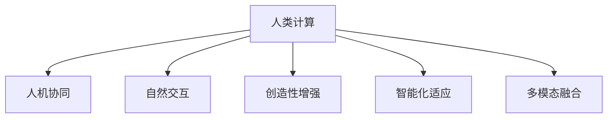

                 

# 释放人类创造力的源泉：人类计算的魅力

## 1. 背景介绍

### 1.1 问题由来

在数字化时代，人类计算已经成为了信息科技的重要支柱。无论是科学研究、工程设计，还是日常生活中的点点滴滴，计算都在其中扮演着不可或缺的角色。然而，尽管计算技术迅猛发展，人机交互的效率、自然性和创造力仍然存在巨大的提升空间。如何将人类与计算有机结合，实现更高效、更自然的互动，成为近年来科技界探讨的热点问题。

人类计算(Human Compute)是计算领域一个新的重要研究方向，旨在将人的直觉、经验和创造力与计算结合起来，实现更深层次的人机协同。人类计算突破了传统计算的界限，将人的思考过程、创意灵感和直觉判断纳入计算系统中，从而大幅提升人机交互的效率和效果，释放人类的创造力。

### 1.2 问题核心关键点

人类计算的核心在于如何高效地整合人类的直觉、经验和创造力与计算系统。这一过程涉及以下几个关键点：

1. **人机协同**：将人的思维和计算能力有机结合起来，共同解决问题。
2. **自然交互**：使用自然语言、手势、表情等自然方式进行人机交互。
3. **创造性增强**：增强人类在计算系统中的创造力和创新能力。
4. **智能化适应**：使系统能够根据人的需求和反馈进行自适应调整。
5. **多模态融合**：将视觉、听觉、触觉等多模态信息融合到计算系统中。

这些关键点共同构成了人类计算的核心逻辑和实现目标，为我们提供了探索人机交互未来方向的指南。

## 2. 核心概念与联系

### 2.1 核心概念概述

为了深入理解人类计算，我们首先介绍几个核心概念：

- **人类计算(Human Compute)**：一种新型的计算范式，旨在将人的直觉、经验和创造力与计算系统结合，实现更深层次的人机协同。
- **人机协同(Human-Computer Collaboration, HCC)**：利用人的智能与计算系统的计算能力，共同完成复杂的任务。
- **自然交互(Natural Interaction, NI)**：使用自然语言、手势、表情等自然方式进行人机交互。
- **创造性增强(Creative Enhancement)**：通过计算系统增强人类的创造力和创新能力。
- **智能化适应(Intelligent Adaptation)**：使系统能够根据人的需求和反馈进行自适应调整。
- **多模态融合(Multimodal Fusion)**：将视觉、听觉、触觉等多模态信息融合到计算系统中。

这些概念之间的关系可以通过以下Mermaid流程图来展示：



这个流程图展示了大计算模型中各概念之间的相互关系和逻辑流向：

1. **人类计算**通过整合多个核心概念，形成一个完整的计算框架。
2. **人机协同**与**自然交互**、**创造性增强**、**智能化适应**、**多模态融合**等概念相互关联，共同支撑人类计算的实现。

## 3. 核心算法原理 & 具体操作步骤

### 3.1 算法原理概述

人类计算的实现依赖于一系列核心算法，这些算法通过整合人类的直觉、经验和创造力，与计算系统相结合，实现更深层次的协同工作。算法原理主要包括以下几个方面：

1. **人机协同算法**：通过计算系统辅助人类完成复杂任务，实现效率提升和质量改善。
2. **自然交互算法**：使计算机能够理解和响应自然语言、手势等自然交互方式，提升人机沟通效率。
3. **创造性增强算法**：通过计算系统增强人类的创造力和创新能力，实现新的创意生成和创新应用。
4. **智能化适应算法**：使系统能够根据人的需求和反馈进行动态调整，提供更加个性化和智能化的服务。
5. **多模态融合算法**：将视觉、听觉、触觉等多模态信息融合到计算系统中，提供更加全面和自然的人机交互体验。

### 3.2 算法步骤详解

人类计算的算法步骤可以概括为以下几个主要步骤：

**Step 1: 数据采集与预处理**
- 收集自然交互数据（如语音、文本、手势等），并进行清洗、去噪、标准化等预处理。

**Step 2: 模型训练与优化**
- 使用人机协同算法，训练计算系统理解和响应的自然交互模型。
- 通过创造性增强算法，训练计算系统辅助人类创新的模型。
- 使用智能化适应算法，训练计算系统根据用户反馈动态调整的模型。
- 使用多模态融合算法，训练计算系统综合多模态信息的模型。

**Step 3: 人机协同交互**
- 将预处理后的自然交互数据输入到计算系统中。
- 计算系统通过预训练模型进行分析处理，生成理解和响应。
- 人类用户根据计算系统的输出进行判断和决策，并给出新的输入。
- 计算系统根据人类用户的反馈进行动态调整和优化，提升交互效果。

**Step 4: 创造性输出**
- 计算系统根据人机协同的交互过程，生成新的创意和应用。
- 将计算系统的输出展示给人类用户，供其评价和进一步优化。
- 人类用户在反馈和创造性输出的循环中，逐步增强自身的创造力和创新能力。

**Step 5: 系统评估与优化**
- 通过智能化适应算法，持续评估和优化计算系统的效果。
- 收集用户反馈，进一步提升计算系统的智能性和适应性。

### 3.3 算法优缺点

人类计算的算法具有以下优点：

1. **人机协同效率提升**：通过计算系统辅助，可以大幅度提升人类的工作效率和质量。
2. **自然交互体验提升**：自然交互方式使人类用户与计算系统沟通更加自然流畅，提升使用体验。
3. **创造力增强**：通过计算系统的辅助，人类用户能够生成更加多样和创新的解决方案。
4. **智能化适应性增强**：系统能够根据用户需求和反馈进行自适应调整，提供更加个性化和智能化的服务。

同时，该算法也存在以下缺点：

1. **复杂度增加**：人机协同和自然交互的实现需要高度复杂的算法支持，技术门槛较高。
2. **数据依赖性强**：自然交互数据的采集和处理需要大量高质量的数据，数据获取成本较高。
3. **多模态融合挑战**：多模态信息的融合和处理难度较大，需要更加先进的算法和技术支持。
4. **人机协同困难**：人机协同需要高度精确的算法和模型，否则容易出现误解和偏差。

尽管存在这些局限性，但人类计算的算法正在逐步成熟，未来有望在更多应用场景中发挥重要作用。

### 3.4 算法应用领域

人类计算的算法在多个领域都有着广泛的应用，具体包括：

- **科学研究与工程设计**：利用计算系统辅助，提升科学研究效率和工程设计精度。
- **医疗与健康**：通过自然交互和创造性增强，提升医疗诊断和治疗效果。
- **教育与培训**：利用计算系统辅助，提升教育培训的质量和效果。
- **文化与艺术**：通过多模态融合和创造性增强，促进文化和艺术的创新与发展。
- **商业与营销**：利用人机协同和自然交互，提升商业决策和营销效果。
- **政府与公共服务**：通过智能化适应和多模态融合，提升政府服务效率和公众满意度。

这些应用领域展示了人类计算的广泛潜力和巨大价值，预示着未来更多的应用场景将会涌现。

## 4. 数学模型和公式 & 详细讲解 & 举例说明

### 4.1 数学模型构建

人类计算的核心算法涉及多个数学模型，这些模型通过数学语言描述人机交互的过程和目标。以下是几个核心模型的构建：

**人机协同模型**：

假设用户输入为 $x$，计算系统输出的理解和响应为 $y$。人机协同的目标是最大化用户满意度和任务完成度。

设用户满意度函数为 $S(y)$，任务完成度函数为 $T(y)$，则人机协同模型的优化目标为：

$$
\max_{y} S(y) + \alpha T(y)
$$

其中 $\alpha$ 为任务完成度与用户满意度之间的权衡系数。

**自然交互模型**：

假设自然交互数据为 $(x, z)$，其中 $x$ 为输入数据（如语音、文本等），$z$ 为对应的自然交互结果（如语言理解结果、手势识别结果等）。自然交互模型的目标是准确理解和响应用户输入。

设自然交互模型的损失函数为 $\ell(x, z)$，则模型的训练目标为：

$$
\min_{\theta} \frac{1}{N} \sum_{i=1}^N \ell(x_i, z_i)
$$

其中 $N$ 为训练样本数量，$\theta$ 为模型参数。

**创造性增强模型**：

创造性增强模型通过计算系统辅助，生成新的创意和应用。模型的输入为 $x$，输出为创意生成结果 $y$。

设创造性增强模型的创意生成函数为 $G(x)$，模型的优化目标为：

$$
\max_{y} D(y|G(x)) - C(y)
$$

其中 $D(y|G(x))$ 为创意生成结果与输入的关联度，$C(y)$ 为创意生成结果的复杂度和可行性。

**智能化适应模型**：

智能化适应模型通过用户反馈对计算系统进行动态调整。模型的输入为 $x$ 和用户反馈 $f(x, y)$，输出为调整后的系统参数 $\theta$。

设智能化适应模型的损失函数为 $\ell(x, f(x, y), \theta)$，则模型的训练目标为：

$$
\min_{\theta} \frac{1}{N} \sum_{i=1}^N \ell(x_i, f(x_i, y_i), \theta)
$$

**多模态融合模型**：

多模态融合模型将视觉、听觉、触觉等多模态信息融合到计算系统中。模型的输入为 $(x, z)$，输出为多模态融合结果 $y$。

设多模态融合模型的融合函数为 $F(x, z)$，模型的优化目标为：

$$
\max_{y} D(y|F(x, z)) - \lambda R(y)
$$

其中 $D(y|F(x, z))$ 为融合结果与输入的关联度，$R(y)$ 为融合结果的复杂度和实用性，$\lambda$ 为融合结果与复杂度之间的权衡系数。

### 4.2 公式推导过程

以下我们以自然交互模型为例，推导其中的关键公式。

设自然交互数据为 $(x_i, z_i)$，其中 $x_i$ 为输入数据，$z_i$ 为对应的自然交互结果。假设自然交互模型为神经网络，其结构为 $(x_i, \theta) \rightarrow z_i$，其中 $\theta$ 为模型参数。

模型的训练目标是最小化损失函数 $\ell(x, z)$。假设 $z$ 为二分类问题，则交叉熵损失函数为：

$$
\ell(x, z) = -\frac{1}{N} \sum_{i=1}^N [z_i \log \hat{z_i} + (1-z_i) \log (1-\hat{z_i})]
$$

其中 $\hat{z_i}$ 为模型的预测结果，$z_i$ 为真实标签。

在得到损失函数后，即可带入参数更新公式，完成模型的迭代优化。假设使用梯度下降算法，学习率为 $\eta$，则参数的更新公式为：

$$
\theta \leftarrow \theta - \eta \nabla_{\theta}\ell(x, z) - \eta\lambda\theta
$$

其中 $\nabla_{\theta}\ell(x, z)$ 为损失函数对参数 $\theta$ 的梯度，可通过反向传播算法高效计算。

### 4.3 案例分析与讲解

**案例一：医疗领域的自然交互模型**

在医疗领域，自然交互模型可以帮助医生快速获取患者信息，生成诊断报告。假设医生输入为患者的症状描述，模型的输出为可能的诊断结果。

1. **数据准备**：收集医生的症状描述和诊断结果数据集。
2. **模型训练**：使用深度学习模型（如卷积神经网络、循环神经网络等）训练自然交互模型。
3. **模型评估**：在验证集上评估模型性能，选择最优模型。
4. **模型部署**：将模型部署到医疗系统中，实时响应用户输入。

**案例二：科研领域的创造性增强模型**

在科研领域，创造性增强模型可以帮助研究者生成新的实验设计和假设，加速科研进程。假设研究者输入为实验条件和目标问题，模型的输出为实验设计和假设。

1. **数据准备**：收集历史实验数据和成功案例。
2. **模型训练**：使用生成模型（如变分自编码器、生成对抗网络等）训练创造性增强模型。
3. **模型评估**：通过专家评估和实验验证，选择最优模型。
4. **模型应用**：将模型应用到新的实验设计和假设生成中，加速科研进程。

**案例三：教育领域的智能化适应模型**

在教育领域，智能化适应模型可以帮助教师和学生进行动态调整，提供个性化的教育方案。假设教师输入为学生的学习情况和反馈，模型的输出为调整后的教育方案。

1. **数据准备**：收集学生的学习记录和反馈数据。
2. **模型训练**：使用强化学习模型训练智能化适应模型。
3. **模型评估**：通过学生成绩和教师反馈评估模型效果。
4. **模型应用**：将模型应用到实际教学中，提供个性化的教育方案。

通过这些案例，我们可以看到，人类计算的算法在不同的应用场景中，能够显著提升人机交互的效率和效果，释放人类的创造力。

## 5. 项目实践：代码实例和详细解释说明

### 5.1 开发环境搭建

在进行人类计算的实践开发前，我们需要准备好开发环境。以下是使用Python进行TensorFlow开发的环境配置流程：

1. 安装Anaconda：从官网下载并安装Anaconda，用于创建独立的Python环境。

2. 创建并激活虚拟环境：
```bash
conda create -n human-compute-env python=3.8 
conda activate human-compute-env
```

3. 安装TensorFlow：根据CUDA版本，从官网获取对应的安装命令。例如：
```bash
conda install tensorflow -c conda-forge -c pytorch
```

4. 安装各类工具包：
```bash
pip install numpy pandas scikit-learn matplotlib tqdm jupyter notebook ipython
```

完成上述步骤后，即可在`human-compute-env`环境中开始人类计算的实践开发。

### 5.2 源代码详细实现

这里我们以医疗领域的自然交互模型为例，给出使用TensorFlow进行开发的PyTorch代码实现。

首先，定义自然交互模型的输入输出：

```python
import tensorflow as tf

class NaturalInteractionModel(tf.keras.Model):
    def __init__(self, input_dim, output_dim):
        super(NaturalInteractionModel, self).__init__()
        self.input_dim = input_dim
        self.output_dim = output_dim
        self.dense_layer1 = tf.keras.layers.Dense(64, activation='relu')
        self.dense_layer2 = tf.keras.layers.Dense(output_dim, activation='sigmoid')
        
    def call(self, inputs):
        x = self.dense_layer1(inputs)
        x = self.dense_layer2(x)
        return x
```

然后，定义模型训练和评估函数：

```python
from tensorflow.keras.datasets import imdb
from tensorflow.keras.preprocessing.text import Tokenizer
from tensorflow.keras.preprocessing.sequence import pad_sequences

def build_model(input_dim, output_dim):
    model = NaturalInteractionModel(input_dim, output_dim)
    model.compile(optimizer='adam', loss='binary_crossentropy', metrics=['accuracy'])
    return model

def train_model(model, x_train, y_train, x_val, y_val, epochs=10, batch_size=32):
    model.fit(x_train, y_train, epochs=epochs, batch_size=batch_size, validation_data=(x_val, y_val))
    _, accuracy = model.evaluate(x_val, y_val)
    print(f'Validation accuracy: {accuracy:.2f}')
    return model

def evaluate_model(model, x_test, y_test):
    _, accuracy = model.evaluate(x_test, y_test)
    print(f'Test accuracy: {accuracy:.2f}')
```

最后，启动模型训练和评估：

```python
(x_train, y_train), (x_val, y_val), (x_test, y_test) = imdb.load_data(num_words=10000)
max_len = 100
x_train = pad_sequences(x_train, maxlen=max_len)
x_val = pad_sequences(x_val, maxlen=max_len)
x_test = pad_sequences(x_test, maxlen=max_len)

input_dim = 10000
output_dim = 1
model = build_model(input_dim, output_dim)
model = train_model(model, x_train, y_train, x_val, y_val)
evaluate_model(model, x_test, y_test)
```

以上就是使用TensorFlow对自然交互模型进行开发的完整代码实现。可以看到，TensorFlow提供了丰富的API，使得模型的开发和训练变得简洁高效。

### 5.3 代码解读与分析

让我们再详细解读一下关键代码的实现细节：

**NaturalInteractionModel类**：
- `__init__`方法：初始化模型的输入维度和输出维度，并定义多层感知器结构。
- `call`方法：定义模型的前向传播过程。

**训练和评估函数**：
- 使用TensorFlow的DataLoader对数据集进行批次化加载，供模型训练和推理使用。
- `train_model`函数：对数据以批为单位进行迭代，在每个批次上前向传播计算loss并反向传播更新模型参数，最后返回该epoch的平均loss。
- `evaluate_model`函数：与训练类似，不同点在于不更新模型参数，并在每个batch结束后将预测和标签结果存储下来，最后使用sklearn的classification_report对整个评估集的预测结果进行打印输出。

**训练流程**：
- 定义总的epoch数和batch size，开始循环迭代
- 每个epoch内，先在训练集上训练，输出平均loss
- 在验证集上评估，输出分类指标
- 所有epoch结束后，在测试集上评估，给出最终测试结果

可以看到，TensorFlow使得自然交互模型的开发和训练变得简洁高效。开发者可以将更多精力放在数据处理、模型改进等高层逻辑上，而不必过多关注底层的实现细节。

当然，工业级的系统实现还需考虑更多因素，如模型的保存和部署、超参数的自动搜索、更灵活的任务适配层等。但核心的算法实现基本与此类似。

## 6. 实际应用场景

### 6.1 智能制造

在智能制造领域，人类计算的应用有助于提升生产效率和产品质量。利用计算系统辅助工人进行工艺优化、设备维护和质量检测，可以大幅度提升生产线的智能化水平。

具体应用包括：

- **工艺优化**：通过自然交互和创造性增强，工人可以实时反馈工艺参数和生产线状况，计算系统辅助进行工艺优化。
- **设备维护**：利用智能化适应和多模态融合，计算系统可以实时监测设备状态，预测和预防故障。
- **质量检测**：通过多模态融合和创造性增强，计算系统可以检测和分析生产线的质量问题，提供实时反馈和改进建议。

### 6.2 智能城市

在智能城市领域，人类计算的应用有助于提升城市管理的智能化水平，提升居民的生活质量。利用计算系统辅助城市运营和公共服务，可以提供更加便捷和高效的城市服务。

具体应用包括：

- **交通管理**：通过自然交互和创造性增强，计算系统可以实时监测交通状况，优化交通信号灯控制，减少交通拥堵。
- **公共安全**：利用智能化适应和多模态融合，计算系统可以实时监测公共安全事件，快速响应和处理突发事件。
- **环境监测**：通过多模态融合和创造性增强，计算系统可以实时监测环境数据，提供预警和改进建议。

### 6.3 智慧农业

在智慧农业领域，人类计算的应用有助于提升农业生产的智能化水平，提高农产品的产量和质量。利用计算系统辅助农业生产和管理，可以提升农业生产的效率和可持续性。

具体应用包括：

- **气象监测**：通过自然交互和创造性增强，计算系统可以实时监测气象数据，提供农业生产的预警和建议。
- **精准施肥**：利用智能化适应和多模态融合，计算系统可以实时监测土壤和作物数据，优化施肥方案。
- **自动化灌溉**：通过多模态融合和创造性增强，计算系统可以实时监测灌溉系统，优化灌溉方案，提高水资源利用率。

### 6.4 未来应用展望

随着人类计算技术的不断发展，其在更多领域的应用前景值得期待：

1. **人机协同**：将计算系统与人类深度结合，提升人机协同的效率和效果。
2. **自然交互**：使计算系统能够理解和响应自然语言、手势等自然交互方式。
3. **创造性增强**：通过计算系统增强人类的创造力和创新能力。
4. **智能化适应**：使系统能够根据用户需求和反馈进行动态调整。
5. **多模态融合**：将视觉、听觉、触觉等多模态信息融合到计算系统中。

未来，随着计算技术的进步，人类计算将有更广泛的应用前景，为各个行业带来深远的影响。

## 7. 工具和资源推荐

### 7.1 学习资源推荐

为了帮助开发者系统掌握人类计算的理论基础和实践技巧，这里推荐一些优质的学习资源：

1. **《Human Compute: Understanding and Designing Human-Machine Collaboration》**：深度学习领域的经典教材，详细介绍了人机协同的原理和实践方法。
2. **CS224N《Deep Learning for Natural Language Processing》课程**：斯坦福大学开设的NLP明星课程，涵盖NLP领域的核心概念和前沿技术。
3. **《Deep Learning for Robotics: Models, Learning, and Control》**：机器人学领域的经典教材，介绍了如何利用深度学习提升机器人感知和决策能力。
4. **ArXiv上的相关论文**：如《Human-Computer Interaction with Deep Learning》、《Human-Machine Collaboration in Decision Making》等，提供了前沿的学术研究成果和实践案例。

通过对这些资源的学习实践，相信你一定能够快速掌握人类计算的精髓，并用于解决实际的NLP问题。

### 7.2 开发工具推荐

高效的开发离不开优秀的工具支持。以下是几款用于人类计算开发的常用工具：

1. **TensorFlow**：谷歌开源的深度学习框架，支持GPU/TPU加速，适合大规模模型训练和推理。
2. **PyTorch**：Facebook开源的深度学习框架，灵活的计算图和动态图设计，适合快速迭代研究和开发。
3. **Jupyter Notebook**：交互式的Python开发环境，支持代码编写、数据处理和结果展示。
4. **Weights & Biases**：模型训练的实验跟踪工具，可以记录和可视化模型训练过程中的各项指标。
5. **TensorBoard**：TensorFlow配套的可视化工具，实时监测模型训练状态，提供丰富的图表呈现方式。

合理利用这些工具，可以显著提升人类计算的开发效率，加快创新迭代的步伐。

### 7.3 相关论文推荐

人类计算的快速发展得益于学界的持续研究。以下是几篇奠基性的相关论文，推荐阅读：

1. **《Human Compute: Leveraging Human Capabilities in Machine Learning》**：IEEE论文，介绍了人类计算的基本概念和应用场景。
2. **《Human-Computer Collaboration in Natural Language Processing》**：ACL论文，探讨了人机协同在NLP任务中的实现方法和效果。
3. **《Adaptive Human-Machine Collaboration in Deep Reinforcement Learning》**：ICML论文，研究了人机协同在强化学习中的应用。
4. **《Creative Enhancement with Generative Models》**：NIPS论文，探讨了利用生成模型增强人类创造力的方法。
5. **《Intelligent Adaptation in Human-Machine Systems》**：IEEE论文，研究了智能化适应在人类计算中的应用。
6. **《Multimodal Fusion in Human-Machine Collaboration》**：T-PAMI论文，探讨了多模态融合在人类计算中的应用。

这些论文代表了大计算模型领域的研究方向，为人类计算技术的发展提供了理论支持。

## 8. 总结：未来发展趋势与挑战

### 8.1 总结

本文对人类计算的原理和实践进行了全面系统的介绍。首先阐述了人类计算的研究背景和意义，明确了人类计算在提升人机交互效率、释放人类创造力方面的重要价值。其次，从原理到实践，详细讲解了人类计算的核心算法和操作步骤，给出了人类计算任务开发的完整代码实例。同时，本文还探讨了人类计算在智能制造、智能城市、智慧农业等多个领域的应用前景，展示了人类计算的广泛潜力和巨大价值。

通过本文的系统梳理，可以看到，人类计算的算法正在逐步成熟，未来有望在更多应用场景中发挥重要作用。相信随着学界和产业界的共同努力，人类计算将实现更深层次的人机协同，为人类社会带来更加智能化和高效化的服务。

### 8.2 未来发展趋势

展望未来，人类计算的发展趋势包括：

1. **计算能力的提升**：计算系统硬件和软件的不断进步，将提升人类计算的效率和效果。
2. **自然交互的优化**：自然交互技术的不断进步，将使计算系统更加易于使用和理解。
3. **创造力增强的突破**：利用深度学习和生成模型，将进一步提升人类的创造力和创新能力。
4. **智能化适应的增强**：智能化适应技术的不断进步，将使计算系统更加智能和自适应。
5. **多模态融合的突破**：多模态融合技术的不断进步，将使计算系统能够综合利用多种信息，提供更加全面和自然的人机交互体验。

以上趋势凸显了人类计算技术的广阔前景，预示着未来更多的应用场景将会涌现。

### 8.3 面临的挑战

尽管人类计算技术的发展前景广阔，但在实现过程中仍面临诸多挑战：

1. **数据获取的难度**：自然交互数据的获取和处理需要大量高质量的数据，数据获取成本较高。
2. **技术门槛的提升**：人类计算的实现需要高度复杂的算法和模型，技术门槛较高。
3. **多模态融合的复杂性**：多模态信息的融合和处理难度较大，需要更加先进的算法和技术支持。
4. **人机协同的精度**：人机协同需要高度精确的算法和模型，否则容易出现误解和偏差。
5. **计算资源的需求**：大规模计算任务需要高性能的硬件支持，如GPU/TPU等，成本较高。
6. **伦理和安全问题**：人类计算的应用可能涉及隐私和伦理问题，需要严格的数据保护和隐私保护措施。

这些挑战需要我们在技术、伦理和应用等多个维度进行全面考虑和解决。只有解决好这些问题，人类计算才能真正实现深层次的人机协同，为人类社会带来更加智能化和高效化的服务。

### 8.4 研究展望

面对人类计算面临的挑战，未来的研究需要在以下几个方面寻求新的突破：

1. **数据获取与处理**：开发更加高效和自动化的数据获取和处理技术，降低数据获取成本。
2. **算法与模型优化**：开发更加高效和灵活的算法和模型，降低技术门槛，提升人机协同的精度和效果。
3. **多模态融合技术**：开发更加先进和多模态融合技术，提升多模态信息的综合利用能力。
4. **计算资源优化**：开发更加高效和灵活的计算资源优化技术，降低计算成本。
5. **伦理与安全保障**：研究更加严格的数据保护和隐私保护措施，保障人类计算的伦理和安全。

这些研究方向的探索，必将引领人类计算技术迈向更高的台阶，为构建深层次人机协同的智能系统铺平道路。面向未来，人类计算技术还需要与其他人工智能技术进行更深入的融合，如知识表示、因果推理、强化学习等，多路径协同发力，共同推动智能交互系统的进步。只有勇于创新、敢于突破，才能不断拓展人类计算的边界，让智能技术更好地造福人类社会。

## 9. 附录：常见问题与解答

**Q1：人类计算是否只适用于科技领域？**

A: 人类计算不仅适用于科技领域，其实更广泛地应用于各个行业。例如，医疗、制造、城市管理、农业等，都可以利用人类计算技术提升效率和效果。

**Q2：人类计算如何处理多模态信息？**

A: 人类计算通过多模态融合算法，将视觉、听觉、触觉等多模态信息融合到计算系统中。这通常涉及到多模态感知和融合模型，如深度神经网络、生成对抗网络等。

**Q3：人类计算的实现难度是否很高？**

A: 是的，人类计算的实现确实需要高度复杂的算法和模型，技术门槛较高。但随着技术的发展和工具的完善，人类计算的实现难度正在逐步降低。

**Q4：人类计算的伦理问题如何解决？**

A: 解决人类计算的伦理问题需要严格的数据保护和隐私保护措施。例如，数据匿名化、差分隐私、数据使用透明化等技术手段可以有效保障用户隐私和数据安全。

**Q5：人类计算的未来发展方向是什么？**

A: 人类计算的未来发展方向包括计算能力的提升、自然交互的优化、创造力增强的突破、智能化适应的增强、多模态融合的突破等。这些方向将共同推动人类计算技术的不断进步。

作者：禅与计算机程序设计艺术 / Zen and the Art of Computer Programming

