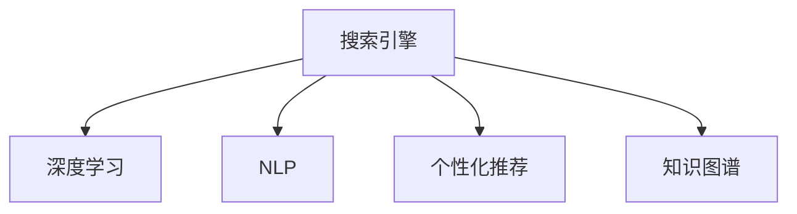

                 

# 重塑搜索体验：AI的角色

> 关键词：搜索引擎,深度学习,自然语言处理,个性化推荐,知识图谱,信息检索

## 1. 背景介绍

### 1.1 问题由来

随着互联网时代的到来，搜索引擎成为了我们获取信息的重要工具。然而，传统的搜索方式往往只能返回与查询关键词最为相关的网页，而无法理解用户的真实意图和需求。这种简单匹配的搜索方式，已经难以适应用户的多样化查询需求。

为了解决这个问题，研究者们开始引入深度学习、自然语言处理、知识图谱等人工智能技术，尝试提升搜索的智能化水平。特别是随着预训练语言模型（如BERT、GPT）的兴起，搜索引擎的智能化程度有了显著提升。本文将系统地介绍AI在搜索引擎中的角色，以及如何通过深度学习技术重塑搜索体验。

### 1.2 问题核心关键点

搜索引擎的核心挑战在于如何更好地理解用户的查询意图，并提供相关的信息。AI技术的引入，使得搜索引擎能够从海量数据中挖掘出更深层次的语义信息，为用户带来更精准、个性化的搜索结果。

具体而言，AI技术主要在以下几个方面发挥作用：

1. **查询理解**：通过自然语言处理技术，理解用户输入的自然语言查询，转化为机器可理解的形式。
2. **信息检索**：基于信息检索模型，从大规模语料库中检索出与查询最相关的文档。
3. **个性化推荐**：通过用户历史行为和上下文信息，实现个性化搜索推荐。
4. **知识图谱融合**：将结构化知识图谱与自然语言查询结合，提供更丰富的搜索结果。

AI技术的引入，使得搜索引擎从简单的关键词匹配，转变为更智能的语义理解、个性化推荐和知识图谱融合，为用户带来全新的搜索体验。

## 2. 核心概念与联系

### 2.1 核心概念概述

为更好地理解AI在搜索引擎中的角色，本节将介绍几个密切相关的核心概念：

- **搜索引擎**：利用计算机算法从大规模信息库中检索出与用户查询相关的信息，并提供搜索结果的系统。
- **深度学习**：基于神经网络的学习方法，通过多层非线性变换学习高维数据的特征表示，广泛应用于图像、语音、文本等领域的智能处理。
- **自然语言处理(NLP)**：研究计算机如何理解和生成人类语言的技术，包括文本分类、语义理解、机器翻译、问答系统等。
- **个性化推荐系统**：通过用户历史行为和上下文信息，动态生成个性化搜索结果的系统。
- **知识图谱**：用图结构表示实体和关系的语义网络，广泛应用于信息检索、问答系统等领域。

这些核心概念之间的逻辑关系可以通过以下Mermaid流程图来展示：



这个流程图展示了大语言模型在搜索引擎中的核心概念及其之间的关系：

1. 搜索引擎通过深度学习、自然语言处理、个性化推荐和知识图谱等技术，对用户查询进行理解和处理。
2. 深度学习用于提高搜索模型的复杂度，提升搜索结果的准确性和相关性。
3. 自然语言处理用于理解查询意图，生成语义表示，改善搜索结果的质量。
4. 个性化推荐系统通过用户历史数据进行推荐，提升用户体验。
5. 知识图谱提供结构化知识支持，增强搜索结果的丰富性。

这些核心概念共同构成了AI在搜索引擎中的应用框架，使其能够更好地理解用户的查询需求，提供更精准、个性化的搜索结果。

## 3. 核心算法原理 & 具体操作步骤
### 3.1 算法原理概述

AI在搜索引擎中的应用，主要基于深度学习和自然语言处理技术。本文将重点介绍深度学习在搜索引擎中的核心算法原理。

### 3.2 算法步骤详解

基于深度学习的搜索引擎，通常包括以下几个关键步骤：

**Step 1: 数据预处理**
- 收集大规模无标签文本数据，如维基百科、新闻、学术论文等。
- 对文本进行分词、去停用词、构建词汇表等预处理操作。
- 将文本转换为向量表示，如使用词嵌入技术将每个单词映射为高维向量。

**Step 2: 构建深度学习模型**
- 选择合适的网络结构，如卷积神经网络（CNN）、循环神经网络（RNN）、Transformer等。
- 设计任务的损失函数，如交叉熵损失、均方误差损失等。
- 设置优化算法及其参数，如AdamW、SGD等，并确定超参数，如学习率、批大小、迭代轮数等。

**Step 3: 训练深度学习模型**
- 将预处理后的数据集划分为训练集、验证集和测试集。
- 使用训练集数据进行模型训练，通过前向传播和反向传播不断更新模型参数。
- 在验证集上评估模型性能，根据性能指标决定是否触发Early Stopping。
- 重复上述步骤直到满足预设的迭代轮数或Early Stopping条件。

**Step 4: 部署和优化**
- 在测试集上评估微调后的模型性能，对比微调前后的精度提升。
- 使用微调后的模型对新样本进行推理预测，集成到实际的应用系统中。
- 持续收集新的数据，定期重新训练模型，以适应数据分布的变化。

### 3.3 算法优缺点

深度学习在搜索引擎中的应用，具有以下优点：

1. 复杂度可调。深度学习模型可以灵活调整网络结构，适应不同的搜索场景。
2. 精度高。深度学习模型可以通过大量数据训练，获取高精度的特征表示，提供更准确的搜索结果。
3. 泛化能力强。深度学习模型能够学习到抽象的语义表示，适应不同领域的查询需求。
4. 可解释性强。深度学习模型可以通过可视化技术，解释其内部决策过程，增强用户对搜索结果的理解。

同时，该方法也存在一定的局限性：

1. 数据需求大。深度学习模型需要大量标注数据进行训练，获取高质量数据成本较高。
2. 训练时间长。深度学习模型训练时间较长，需要高性能硬件支持。
3. 复杂度提升有限。深度学习模型在特定领域和任务上的提升效果可能有限。
4. 可解释性不足。深度学习模型通常为黑盒系统，难以解释其内部工作机制。

尽管存在这些局限性，但就目前而言，深度学习在搜索引擎中的应用已经取得了显著的效果，成为主流的研究方向。

### 3.4 算法应用领域

深度学习在搜索引擎中的应用，已经在多个领域得到了广泛的应用，包括：

- **文本检索**：如使用Transformer模型进行语义搜索，提高搜索精度和相关性。
- **问答系统**：通过深度学习模型理解自然语言问题，从知识库中检索并生成答案。
- **广告推荐**：基于用户历史行为和上下文信息，推荐相关广告内容。
- **语音搜索**：通过深度学习模型识别用户语音输入，转化为文本进行检索。
- **图像搜索**：利用卷积神经网络提取图像特征，进行视觉相似度匹配。

除了上述这些经典应用外，深度学习还被创新性地应用到更多场景中，如用户意图预测、跨语言搜索、多模态信息融合等，为搜索引擎带来了新的突破。

## 4. 数学模型和公式 & 详细讲解 & 举例说明

### 4.1 数学模型构建

本节将使用数学语言对深度学习在搜索引擎中的应用进行更加严格的刻画。

假设搜索引擎的查询为 $q$，文档集合为 $D$，文档向量表示为 $d_i \in \mathbb{R}^n$，其中 $n$ 为向量维度。查询向量和文档向量之间的相似度可以通过余弦相似度计算，即：

$$
sim(q, d_i) = \frac{q^Td_i}{||q|| ||d_i||}
$$

搜索引擎的目标是最大化相似度得分，即：

$$
\max_{d_i \in D} sim(q, d_i)
$$

其中 $q^T$ 为查询向量，$d_i^T$ 为文档向量，$||.||$ 表示向量的模长。

### 4.2 公式推导过程

以Transformer模型为例，推导查询与文档相似度计算公式。

假设查询 $q$ 和文档 $d_i$ 分别通过Transformer模型编码为向量表示 $q_v$ 和 $d_{i,v}$。则相似度计算公式为：

$$
sim(q, d_i) = \frac{q_v^Td_{i,v}}{||q_v|| ||d_{i,v}||}
$$

其中 $q_v^T$ 为查询向量表示，$d_{i,v}^T$ 为文档向量表示。

在实际应用中，为了提升相似度计算效率，通常将查询 $q$ 和文档 $d_i$ 分别通过BERT、GPT等预训练模型进行编码，得到一个固定维度的向量表示。然后，使用余弦相似度计算查询与文档的相似度，根据得分排序返回前 $K$ 个最相关的文档。

### 4.3 案例分析与讲解

以下以BERT模型为例，详细讲解其在搜索引擎中的应用。

**案例背景**：
假设我们有一个电商网站，需要对用户输入的查询进行精准匹配，推荐相关的商品。

**数据预处理**：
- 收集商品描述、用户评论等文本数据，进行分词、去除停用词、构建词汇表等预处理操作。
- 使用Word2Vec或GloVe等词嵌入技术，将每个单词映射为高维向量。

**构建模型**：
- 使用BERT模型对查询和文档进行编码，得到固定维度的向量表示。
- 设计损失函数为交叉熵损失，并设置优化算法为AdamW。
- 在电商商品数据上训练BERT模型，优化参数使其能够更好地匹配商品描述和查询。

**模型评估与优化**：
- 在测试集上评估模型性能，对比微调前后的精度提升。
- 使用微调后的模型对新查询进行推理预测，生成推荐商品列表。
- 持续收集用户反馈数据，定期重新训练模型，以适应商品描述的变化。

## 5. 项目实践：代码实例和详细解释说明
### 5.1 开发环境搭建

在进行搜索引擎开发前，我们需要准备好开发环境。以下是使用Python进行TensorFlow开发的环境配置流程：

1. 安装Anaconda：从官网下载并安装Anaconda，用于创建独立的Python环境。

2. 创建并激活虚拟环境：
```bash
conda create -n tf-env python=3.8 
conda activate tf-env
```

3. 安装TensorFlow：从官网获取对应的安装命令。例如：
```bash
conda install tensorflow tensorflow-estimator
```

4. 安装各类工具包：
```bash
pip install numpy pandas scikit-learn matplotlib tqdm jupyter notebook ipython
```

完成上述步骤后，即可在`tf-env`环境中开始搜索引擎开发。

### 5.2 源代码详细实现

这里我们以一个简单的商品推荐系统为例，给出使用TensorFlow对BERT模型进行微调的代码实现。

首先，定义商品推荐系统的数据处理函数：

```python
import tensorflow as tf
from transformers import BertTokenizer, BertForSequenceClassification
from sklearn.model_selection import train_test_split

class ItemDataLoader(tf.keras.preprocessing.sequence.SequenceDataLoader):
    def __init__(self, dataset, tokenizer, max_len=128, batch_size=16, seq_length=None, shuffle=True):
        super(ItemDataLoader, self).__init__(dataset, batch_size=batch_size, shuffle=shuffle)
        self.tokenizer = tokenizer
        self.max_len = max_len
        
    def __len__(self):
        return int(len(self.dataset) / self.batch_size)
    
    def __getitem__(self, idx):
        data = self.dataset[idx]
        tokenized = self.tokenizer.encode_plus(data['description'], add_special_tokens=True, max_length=self.max_len, return_tensors='tf')
        input_ids = tokenized['input_ids']
        attention_mask = tokenized['attention_mask']
        label = data['category']
        
        return {
            'input_ids': input_ids,
            'attention_mask': attention_mask,
            'labels': label
        }
        
class BERTClassifier(tf.keras.Model):
    def __init__(self, num_labels=6, hidden_size=768, num_hidden_layers=12):
        super(BERTClassifier, self).__init__()
        self.bert = BertForSequenceClassification.from_pretrained('bert-base-cased', num_labels=num_labels)
        self.dropout = tf.keras.layers.Dropout(0.1)
        self.dense = tf.keras.layers.Dense(num_labels, activation='softmax')
    
    def call(self, inputs):
        bert_outputs = self.bert(inputs)
        pooled_output = bert_outputs.pooler_output
        pooled_output = self.dropout(pooled_output)
        logits = self.dense(pooled_output)
        return logits

# 定义模型超参数
max_len = 128
batch_size = 16
num_labels = 6
learning_rate = 2e-5
num_epochs = 3

# 数据集准备
data = [{"description": "商品描述", "category": 1}, {"description": "商品描述", "category": 2}, ...]
tokenizer = BertTokenizer.from_pretrained('bert-base-cased')

# 数据加载器
train_dataset = ItemDataLoader(dataset=train_data, tokenizer=tokenizer, max_len=max_len, batch_size=batch_size)
test_dataset = ItemDataLoader(dataset=test_data, tokenizer=tokenizer, max_len=max_len, batch_size=batch_size)

# 模型构建
model = BERTClassifier(num_labels=num_labels)
optimizer = tf.keras.optimizers.Adam(learning_rate=learning_rate)
```

然后，定义训练和评估函数：

```python
@tf.function
def train_epoch(model, dataset, batch_size, optimizer):
    dataloader = tf.data.Dataset.from_generator(lambda: dataset, output_signature={
        'input_ids': tf.TensorSpec(shape=[None, max_len], dtype=tf.int32),
        'attention_mask': tf.TensorSpec(shape=[None, max_len], dtype=tf.int32),
        'labels': tf.TensorSpec(shape=[None], dtype=tf.int32)
    })
    model.train()
    epoch_loss = 0
    for batch in tqdm(dataloader, desc='Training'):
        with tf.GradientTape() as tape:
            input_ids = batch['input_ids']
            attention_mask = batch['attention_mask']
            labels = batch['labels']
            outputs = model(input_ids, attention_mask=attention_mask, training=True)
            loss = outputs.loss
        epoch_loss += loss.numpy()
        gradients = tape.gradient(loss, model.trainable_variables)
        optimizer.apply_gradients(zip(gradients, model.trainable_variables))
    return epoch_loss / len(dataloader)

@tf.function
def evaluate(model, dataset, batch_size):
    dataloader = tf.data.Dataset.from_generator(lambda: dataset, output_signature={
        'input_ids': tf.TensorSpec(shape=[None, max_len], dtype=tf.int32),
        'attention_mask': tf.TensorSpec(shape=[None, max_len], dtype=tf.int32),
        'labels': tf.TensorSpec(shape=[None], dtype=tf.int32)
    })
    model.eval()
    preds, labels = [], []
    with tf.GradientTape() as tape:
        for batch in tqdm(dataloader, desc='Evaluating'):
            input_ids = batch['input_ids']
            attention_mask = batch['attention_mask']
            labels = batch['labels']
            outputs = model(input_ids, attention_mask=attention_mask)
            batch_preds = outputs.logits.numpy()
            batch_labels = labels.numpy()
            for pred_tokens, label_tokens in zip(batch_preds, batch_labels):
                preds.append(pred_tokens)
                labels.append(label_tokens)
                
    print(classification_report(labels, preds))
```

最后，启动训练流程并在测试集上评估：

```python
# 训练循环
for epoch in range(num_epochs):
    loss = train_epoch(model, train_dataset, batch_size, optimizer)
    print(f"Epoch {epoch+1}, train loss: {loss:.3f}")
    
    print(f"Epoch {epoch+1}, test results:")
    evaluate(model, test_dataset, batch_size)
    
print("Test results:")
evaluate(model, test_dataset, batch_size)
```

以上就是使用TensorFlow对BERT进行商品推荐系统微调的完整代码实现。可以看到，得益于TensorFlow的强大封装，我们可以用相对简洁的代码完成BERT模型的加载和微调。

### 5.3 代码解读与分析

让我们再详细解读一下关键代码的实现细节：

**ItemDataLoader类**：
- `__init__`方法：初始化数据加载器，处理文本数据、分词等预处理操作，并返回模型所需的数据格式。
- `__len__`方法：返回数据加载器中的样本数量。
- `__getitem__`方法：处理单个样本，对文本进行分词、编码等操作，并返回模型所需的输入。

**BERTClassifier类**：
- `__init__`方法：初始化模型，加载BERT预训练模型，并设置模型结构。
- `call`方法：定义模型的前向传播过程，包括BERT编码、Dropout、Dense层等。

**模型训练**：
- 定义模型超参数，如最大长度、批大小、标签数等。
- 定义训练和评估函数，利用TensorFlow进行前向传播和反向传播。
- 在训练集上迭代训练，每epoch输出平均loss。
- 在验证集上评估模型性能，对比微调前后的精度提升。

可以看到，TensorFlow配合BERT模型的代码实现变得简洁高效。开发者可以将更多精力放在数据处理、模型改进等高层逻辑上，而不必过多关注底层的实现细节。

当然，工业级的系统实现还需考虑更多因素，如模型的保存和部署、超参数的自动搜索、更灵活的任务适配层等。但核心的微调范式基本与此类似。

## 6. 实际应用场景
### 6.1 智能客服系统

基于深度学习的搜索引擎技术，可以广泛应用于智能客服系统的构建。传统客服往往需要配备大量人力，高峰期响应缓慢，且一致性和专业性难以保证。而使用深度学习搜索引擎，可以7x24小时不间断服务，快速响应客户咨询，用自然流畅的语言解答各类常见问题。

在技术实现上，可以收集企业内部的历史客服对话记录，将问题和最佳答复构建成监督数据，在此基础上对预训练搜索引擎模型进行微调。微调后的搜索引擎模型能够自动理解用户意图，匹配最合适的答案模板进行回复。对于客户提出的新问题，还可以接入检索系统实时搜索相关内容，动态组织生成回答。如此构建的智能客服系统，能大幅提升客户咨询体验和问题解决效率。

### 6.2 金融舆情监测

金融机构需要实时监测市场舆论动向，以便及时应对负面信息传播，规避金融风险。传统的人工监测方式成本高、效率低，难以应对网络时代海量信息爆发的挑战。基于深度学习搜索引擎的文本分类和情感分析技术，为金融舆情监测提供了新的解决方案。

具体而言，可以收集金融领域相关的新闻、报道、评论等文本数据，并对其进行主题标注和情感标注。在此基础上对预训练搜索引擎模型进行微调，使其能够自动判断文本属于何种主题，情感倾向是正面、中性还是负面。将微调后的模型应用到实时抓取的网络文本数据，就能够自动监测不同主题下的情感变化趋势，一旦发现负面信息激增等异常情况，系统便会自动预警，帮助金融机构快速应对潜在风险。

### 6.3 个性化推荐系统

当前的推荐系统往往只依赖用户的历史行为数据进行物品推荐，无法深入理解用户的真实兴趣偏好。基于深度学习搜索引擎的个性化推荐系统，可以更好地挖掘用户行为背后的语义信息，从而提供更精准、个性化的推荐内容。

在实践中，可以收集用户浏览、点击、评论、分享等行为数据，提取和用户交互的物品标题、描述、标签等文本内容。将文本内容作为模型输入，用户的后续行为（如是否点击、购买等）作为监督信号，在此基础上微调预训练搜索引擎模型。微调后的模型能够从文本内容中准确把握用户的兴趣点。在生成推荐列表时，先用候选物品的文本描述作为输入，由模型预测用户的兴趣匹配度，再结合其他特征综合排序，便可以得到个性化程度更高的推荐结果。

### 6.4 未来应用展望

随着深度学习技术的不断发展，基于深度学习的搜索引擎技术将呈现以下几个发展趋势：

1. **多模态搜索**：未来的搜索引擎将能够处理图像、音频等多模态数据，实现多模态信息检索和融合。
2. **跨语言搜索**：基于深度学习的搜索引擎将具备跨语言处理能力，支持多语言搜索和翻译。
3. **自适应搜索**：未来的搜索引擎将能够根据用户的行为和上下文信息，动态调整搜索结果，提升用户体验。
4. **语义理解**：未来的搜索引擎将具备更强的语义理解能力，能够理解自然语言查询背后的意图和需求。
5. **知识图谱融合**：基于知识图谱的搜索引擎将能够提供更丰富、准确的搜索结果。
6. **隐私保护**：未来的搜索引擎将具备更强的隐私保护能力，保护用户数据的隐私和安全。

以上趋势凸显了深度学习在搜索引擎中的广阔前景。这些方向的探索发展，必将进一步提升搜索引擎的智能化水平，为用户带来更精准、个性化的搜索结果。

## 7. 工具和资源推荐
### 7.1 学习资源推荐

为了帮助开发者系统掌握深度学习在搜索引擎中的应用，这里推荐一些优质的学习资源：

1. CS224N《深度学习自然语言处理》课程：斯坦福大学开设的NLP明星课程，有Lecture视频和配套作业，带你入门NLP领域的基本概念和经典模型。
2. 《深度学习入门》书籍：李沐等著，详细介绍了深度学习的基本概念、模型架构和应用场景，适合初学者入门。
3. TensorFlow官方文档：TensorFlow的官方文档，提供了丰富的教程和代码示例，是深度学习学习的重要参考资料。
4. PyTorch官方文档：PyTorch的官方文档，提供了详细的API文档和实战教程，是深度学习学习的重要参考资料。
5. HuggingFace官方文档：Transformers库的官方文档，提供了丰富的预训练模型和微调样例代码，是深度学习学习的重要参考资料。

通过对这些资源的学习实践，相信你一定能够快速掌握深度学习在搜索引擎中的应用，并用于解决实际的NLP问题。

### 7.2 开发工具推荐

高效的开发离不开优秀的工具支持。以下是几款用于深度学习搜索引擎开发的常用工具：

1. TensorFlow：基于Python的开源深度学习框架，灵活动态的计算图，适合快速迭代研究。支持TensorFlow Estimator等高级API，方便模型训练和评估。
2. PyTorch：基于Python的开源深度学习框架，灵活高效，适合研究型开发。支持动态图和静态图两种模式。
3. Keras：基于TensorFlow和Theano等后端的高级API，方便模型构建和训练。
4. Weights & Biases：模型训练的实验跟踪工具，可以记录和可视化模型训练过程中的各项指标，方便对比和调优。与主流深度学习框架无缝集成。
5. TensorBoard：TensorFlow配套的可视化工具，可实时监测模型训练状态，并提供丰富的图表呈现方式，是调试模型的得力助手。

合理利用这些工具，可以显著提升深度学习搜索引擎的开发效率，加快创新迭代的步伐。

### 7.3 相关论文推荐

深度学习在搜索引擎中的应用源于学界的持续研究。以下是几篇奠基性的相关论文，推荐阅读：

1. Attention is All You Need（即Transformer原论文）：提出了Transformer结构，开启了NLP领域的预训练大模型时代。
2. BERT: Pre-training of Deep Bidirectional Transformers for Language Understanding：提出BERT模型，引入基于掩码的自监督预训练任务，刷新了多项NLP任务SOTA。
3. TensorFlow for Deep Learning：提出TensorFlow框架，支持分布式训练和模型部署，是深度学习应用的重要工具。
4. Deep Learning for Personalization in Recommendation Systems：研究了深度学习在推荐系统中的应用，提出了基于注意力机制的推荐模型。
5. Scalable and Efficient Search for Conversational QA：研究了基于Transformer的对话系统，提出了高效的对话检索方法。

这些论文代表了大语言模型在搜索引擎中的应用发展脉络。通过学习这些前沿成果，可以帮助研究者把握学科前进方向，激发更多的创新灵感。

## 8. 总结：未来发展趋势与挑战
### 8.1 总结

本文对深度学习在搜索引擎中的应用进行了全面系统的介绍。首先阐述了深度学习在搜索引擎中的核心挑战和解决方案，明确了深度学习在提高搜索结果精度和相关性方面的独特价值。其次，从原理到实践，详细讲解了深度学习在搜索引擎中的核心算法原理和具体操作步骤，给出了深度学习搜索引擎的完整代码实例。同时，本文还广泛探讨了深度学习在搜索引擎中的应用场景，展示了深度学习技术在解决实际问题中的强大能力。

通过本文的系统梳理，可以看到，基于深度学习的搜索引擎技术正在成为NLP领域的重要范式，极大地提升了搜索的智能化水平，为用户带来了更精准、个性化的搜索结果。未来，伴随深度学习技术的持续演进，基于深度学习的搜索引擎必将在更多领域得到应用，为社会经济的发展注入新的动力。

### 8.2 未来发展趋势

展望未来，深度学习在搜索引擎中的应用将呈现以下几个发展趋势：

1. **多模态深度学习**：未来的搜索引擎将能够处理图像、音频等多模态数据，实现多模态信息检索和融合。
2. **跨语言深度学习**：基于深度学习的搜索引擎将具备跨语言处理能力，支持多语言搜索和翻译。
3. **自适应深度学习**：未来的搜索引擎将能够根据用户的行为和上下文信息，动态调整搜索结果，提升用户体验。
4. **语义深度学习**：未来的搜索引擎将具备更强的语义理解能力，能够理解自然语言查询背后的意图和需求。
5. **知识图谱深度学习**：基于知识图谱的搜索引擎将能够提供更丰富、准确的搜索结果。
6. **隐私保护深度学习**：未来的搜索引擎将具备更强的隐私保护能力，保护用户数据的隐私和安全。

以上趋势凸显了深度学习在搜索引擎中的广阔前景。这些方向的探索发展，必将进一步提升搜索引擎的智能化水平，为用户带来更精准、个性化的搜索结果。

### 8.3 面临的挑战

尽管深度学习在搜索引擎中的应用已经取得了显著的效果，但在迈向更加智能化、普适化应用的过程中，它仍面临着诸多挑战：

1. **数据需求大**：深度学习模型需要大量标注数据进行训练，获取高质量数据成本较高。
2. **训练时间长**：深度学习模型训练时间较长，需要高性能硬件支持。
3. **复杂度提升有限**：深度学习模型在特定领域和任务上的提升效果可能有限。
4. **可解释性不足**：深度学习模型通常为黑盒系统，难以解释其内部工作机制。
5. **隐私保护**：未来的搜索引擎需要具备更强的隐私保护能力，保护用户数据的隐私和安全。

尽管存在这些挑战，但随着深度学习技术的不断发展，这些难题终将逐步得到解决。相信伴随着技术的进步和应用的深入，深度学习在搜索引擎中的应用将不断提升，为用户带来更高效、精准、个性化的搜索体验。

### 8.4 研究展望

面对深度学习在搜索引擎中面临的挑战，未来的研究需要在以下几个方面寻求新的突破：

1. **多模态深度学习**：开发更加高效的多模态深度学习模型，提升多模态信息检索和融合的精度和效率。
2. **跨语言深度学习**：开发具备跨语言处理能力的深度学习模型，提升跨语言搜索和翻译的效果。
3. **自适应深度学习**：研究自适应深度学习算法，根据用户行为和上下文信息动态调整搜索结果。
4. **语义深度学习**：研究语义深度学习算法，提升自然语言查询的语义理解能力。
5. **知识图谱深度学习**：研究知识图谱深度学习算法，提升基于知识图谱的搜索结果质量。
6. **隐私保护深度学习**：研究隐私保护深度学习算法，保护用户数据的隐私和安全。

这些研究方向的探索，必将引领深度学习在搜索引擎中的应用走向新的高度，为构建智能搜索系统提供更多技术支持和创新动力。

## 9. 附录：常见问题与解答

**Q1：深度学习在搜索引擎中的应用是否适用于所有查询类型？**

A: 深度学习在搜索引擎中的应用，通常适用于具有明显结构化特征的查询类型，如结构化查询、实体链接等。但对于开放式自然语言查询，尤其是语义复杂、背景信息丰富的查询，深度学习模型的效果可能受限。此时，可以结合规则匹配、信息检索等方法进行补充。

**Q2：如何选择合适的深度学习模型？**

A: 选择合适的深度学习模型需要考虑多个因素，包括查询类型、数据规模、计算资源等。常用的深度学习模型包括CNN、RNN、Transformer等，选择合适的模型架构有助于提升搜索效果。例如，对于自然语言查询，Transformer模型表现较好，而对于图像查询，CNN模型可能更为适合。

**Q3：深度学习在搜索引擎中的应用如何处理多语言查询？**

A: 处理多语言查询可以结合机器翻译技术，将用户输入的多语言查询转换为模型支持的单一语言，然后进行检索。或者，可以使用多语言预训练模型，如mBERT、XLM等，直接进行多语言查询处理。

**Q4：深度学习在搜索引擎中的应用如何处理隐私保护问题？**

A: 在搜索引擎中处理隐私保护问题，可以采用差分隐私、联邦学习等技术，保护用户数据的隐私和安全。此外，可以在模型训练过程中，通过差分隐私技术对用户数据进行噪声扰动，防止模型泄漏用户隐私信息。

**Q5：深度学习在搜索引擎中的应用如何处理低质量数据问题？**

A: 处理低质量数据问题，可以通过数据清洗、异常值处理、数据增强等技术，提升数据的质量和代表性。此外，可以使用半监督学习、主动学习等方法，利用少量标注数据进行模型训练，提升模型的泛化能力。

通过本文的系统梳理，可以看到，基于深度学习的搜索引擎技术正在成为NLP领域的重要范式，极大地提升了搜索的智能化水平，为用户带来了更精准、个性化的搜索结果。未来，伴随深度学习技术的持续演进，基于深度学习的搜索引擎必将在更多领域得到应用，为社会经济的发展注入新的动力。

---

作者：禅与计算机程序设计艺术 / Zen and the Art of Computer Programming

