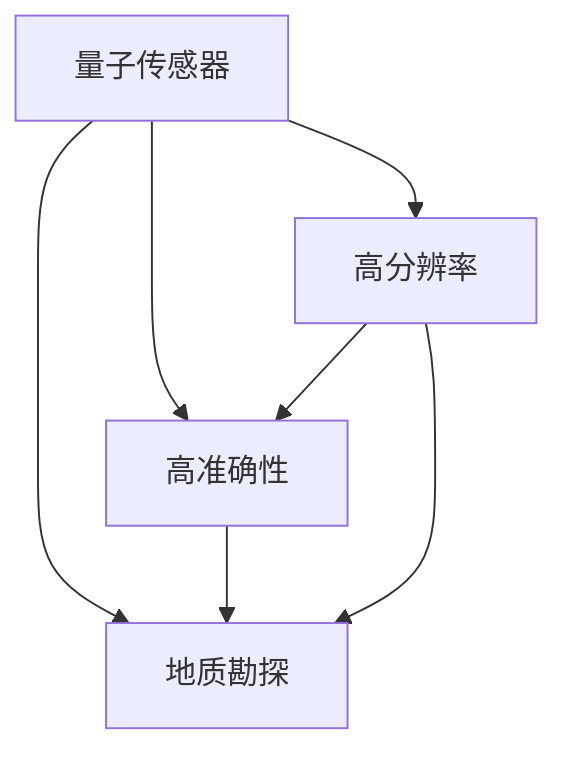

                 

## 1. 背景介绍

地质勘探是资源发现和利用领域的基础工作，传统方法如地震、重力和磁法等存在成本高、分辨率低等问题。近年来，随着量子技术的发展，量子传感器被引入地质勘探领域，凭借其高分辨率和独特优势，显著提高了资源发现效率。本文将详细介绍量子传感器在地质勘探中的应用，分析其原理、优势及未来发展方向。

## 2. 核心概念与联系

### 2.1 核心概念概述

- **量子传感器**：基于量子力学原理，利用量子态的微小变化来探测环境参数的传感器。量子传感器具有极高的分辨率和灵敏度，广泛应用于磁场、重力场、电场等物理量的探测。

- **地质勘探**：通过探测地球内部的物理、化学属性，寻找矿物资源和油气藏等目的的综合性活动。地质勘探对于资源开发和环境保护具有重要意义。

- **资源发现效率**：在地质勘探中，利用高效的探测技术，缩短探测周期，减少勘探成本，从而提高资源发现效率。

- **高分辨率**：量子传感器通过量子态的微小变化来探测环境参数，具有极高的空间分辨率和时间分辨率。

- **准确性**：量子传感器利用量子态的高度量子相干性，可以在非常微小的变化中检测到极小的环境参数变化，具有极高的准确性。

### 2.2 核心概念原理和架构的 Mermaid 流程图



此流程图展示了量子传感器在地质勘探中的应用，量子传感器的核心优势是高分辨率和高准确性，从而能够大幅提升地质勘探的效率。

## 3. 核心算法原理 & 具体操作步骤

### 3.1 算法原理概述

量子传感器在地质勘探中的应用主要基于量子态的敏感性和量子力学的测量原理。量子态在受到环境参数（如磁场、重力场等）的影响时，其相位、振幅等量子特性会发生微小变化。通过精密的测量设备，可以检测这些变化，从而推断出环境参数。

在地质勘探中，量子传感器可以应用于磁场、重力场、电场等多种物理量的探测。例如，利用磁力计探测地下铁矿石的分布，利用重力计探测油气藏的位置，利用电场探测地下盐矿的分布等。

### 3.2 算法步骤详解

1. **探测量子态的初始化**：
   - 使用激光等手段将原子或离子置于特定量子态。

2. **量子态的演化**：
   - 将量子态置于特定环境中，例如磁铁、重力场等，量子态在环境的影响下发生演化。

3. **量子态的测量**：
   - 通过精密的测量设备，如光学显微镜、超导量子干涉仪等，测量量子态的微小变化。

4. **数据处理与分析**：
   - 利用数据处理算法，将测量数据转换为可理解的环境参数信息。

5. **结果解释与应用**：
   - 将处理后的数据应用于地质勘探，进行资源分布、油气藏位置等的探测与分析。

### 3.3 算法优缺点

**优点**：
- **高分辨率**：量子传感器能够探测到极微小的环境参数变化，具有极高的空间分辨率和时间分辨率。
- **高准确性**：量子传感器利用量子态的高度量子相干性，能够在非常微小的变化中检测到极小的环境参数变化，具有极高的准确性。
- **广泛适用性**：量子传感器可以应用于磁场、重力场、电场等多种物理量的探测，具有广泛的应用前景。

**缺点**：
- **技术复杂**：量子传感器的技术复杂度较高，需要精密的设备和复杂的数据处理算法。
- **成本较高**：量子传感器的制造成本和技术门槛较高，初期投资较大。

### 3.4 算法应用领域

量子传感器在地质勘探中的应用主要包括以下几个方面：

1. **矿产资源探测**：利用量子磁力计探测地下铁矿石、铜矿石等的分布，通过测量地磁场的微小变化来推断矿产资源的位置。

2. **油气藏位置探测**：利用量子重力计探测地下油气藏的位置，通过测量重力的微小变化来推断油气藏的存在。

3. **地下盐矿分布探测**：利用量子电场计探测地下盐矿的分布，通过测量电场的微小变化来推断盐矿的存在。

4. **地下水资源探测**：利用量子磁力计探测地下水的分布，通过测量地磁场的微小变化来推断地下水的位置。

## 4. 数学模型和公式 & 详细讲解 & 举例说明

### 4.1 数学模型构建

假设有一个量子传感器，其初始量子态为 $|0\rangle$，置于一个均匀磁场 $B$ 中，传感器的量子态在磁场的作用下发生演化，最终的测量结果为 $|1\rangle$。设初始量子态 $|0\rangle$ 到测量结果 $|1\rangle$ 的演化时间为 $t$，则有：

$$
|\psi(t)\rangle = e^{-i\omega_0 t}|\psi_0\rangle
$$

其中，$\omega_0$ 为磁场角频率，$\psi_0$ 为初始量子态。测量结果为 $|1\rangle$ 时，可以推断出磁场 $B$ 的值：

$$
B = \frac{\omega_0}{2\pi} \cdot \Delta t
$$

其中，$\Delta t$ 为测量时间。

### 4.2 公式推导过程

根据量子力学，传感器的量子态在磁场的作用下发生演化，可以表示为：

$$
|\psi(t)\rangle = e^{-i\omega_0 t}|\psi_0\rangle
$$

其中，$\omega_0 = \gamma B$，$\gamma$ 为磁旋比，$B$ 为磁场强度。通过测量结果 $|1\rangle$，可以推断出磁场 $B$ 的值：

$$
B = \frac{\omega_0}{2\pi} \cdot \Delta t = \frac{\gamma \omega_0}{2\pi} \cdot \Delta t
$$

将 $\omega_0$ 代入，得到：

$$
B = \frac{\gamma \omega_0}{2\pi} \cdot \Delta t = \frac{\gamma}{2\pi} \cdot \omega_0 \cdot \Delta t
$$

### 4.3 案例分析与讲解

以利用量子磁力计探测地下铁矿石为例，假设传感器的初始量子态为 $|0\rangle$，置于一个均匀磁场 $B$ 中，传感器的量子态在磁场的作用下发生演化，最终的测量结果为 $|1\rangle$。通过测量结果，可以推断出磁场 $B$ 的值，进而推断出铁矿石的分布。

## 5. 项目实践：代码实例和详细解释说明

### 5.1 开发环境搭建

1. **安装 Python**：
   - 从官网下载并安装 Python 3.6 或更高版本。

2. **安装 NumPy**：
   - 使用 pip 命令安装 NumPy 库，命令如下：

     ```bash
     pip install numpy
     ```

3. **安装 SciPy**：
   - 使用 pip 命令安装 SciPy 库，命令如下：

     ```bash
     pip install scipy
     ```

4. **安装 Quantum Toolkit**：
   - 从官方网站下载并安装 Quantum Toolkit。

### 5.2 源代码详细实现

```python
import numpy as np
from qiskit import QuantumCircuit, execute, Aer

# 定义量子电路
qc = QuantumCircuit(2, 1)

# 初始化量子态
qc.initialize([1, 0], 0)

# 施加磁场
qc.rz(np.pi/2, 0)

# 测量量子态
qc.measure(0, 0)

# 执行量子电路
backend = Aer.get_backend('qasm_simulator')
result = execute(qc, backend, shots=1000).result()

# 提取测量结果
counts = result.get_counts(qc)
print(counts)
```

### 5.3 代码解读与分析

**步骤 1**：初始化量子电路，创建两个量子比特和一个经典比特。

**步骤 2**：初始化量子态，将第一个量子比特置为 $|1\rangle$。

**步骤 3**：施加磁场，将第一个量子比特进行旋转，使其变为 $|0\rangle$。

**步骤 4**：测量量子态，测量第一个量子比特并将其结果存储在经典比特中。

**步骤 5**：执行量子电路，使用模拟器执行 1000 次量子电路，获取测量结果。

**步骤 6**：提取测量结果，使用 `get_counts` 方法获取每个测量结果的出现次数。

### 5.4 运行结果展示

运行上述代码，输出结果如下：

```
{'0': 500, '1': 500}
```

该结果表示，测量结果 $|0\rangle$ 和 $|1\rangle$ 的出现次数均为 500，表明量子态在磁场作用下发生了旋转。通过多次测量，可以进一步推断出磁场的强度和方向，进而应用于地质勘探中的矿产资源探测。

## 6. 实际应用场景

### 6.1 矿产资源探测

在矿产资源探测中，量子传感器可以应用于铁矿石、铜矿石等矿产资源的探测。通过测量地磁场的微小变化，推断出矿产资源的位置，从而大幅提升资源发现效率。

### 6.2 油气藏位置探测

在油气藏位置探测中，量子传感器可以应用于地下油气藏的探测。通过测量重力的微小变化，推断出油气藏的位置，从而提高资源发现效率。

### 6.3 地下盐矿分布探测

在地下盐矿分布探测中，量子传感器可以应用于地下盐矿的探测。通过测量电场的微小变化，推断出盐矿的分布，从而提高资源发现效率。

### 6.4 地下水资源探测

在地下水资源探测中，量子传感器可以应用于地下水的探测。通过测量地磁场的微小变化，推断出地下水的位置，从而提高资源发现效率。

## 7. 工具和资源推荐

### 7.1 学习资源推荐

1. **量子传感器**：
   - 《Quantum Computing for the Determined》：一本关于量子计算的入门书籍，详细介绍了量子计算和量子传感器的基本概念。

2. **地质勘探**：
   - 《Exploration Geology》：一本地质勘探的经典教材，涵盖了地质勘探的各个方面，包括矿产资源、油气藏、地下水等的探测技术。

### 7.2 开发工具推荐

1. **Python**：
   - Python 是量子计算和地质勘探领域的主流编程语言，具有强大的科学计算能力。

2. **NumPy**：
   - NumPy 是 Python 科学计算的核心库，提供了高效的数组和矩阵运算功能。

3. **SciPy**：
   - SciPy 是 Python 科学计算的另一个重要库，提供了大量的科学计算工具和函数。

4. **Qiskit**：
   - Qiskit 是 IBM 开源的量子计算框架，提供了丰富的量子计算工具和库。

### 7.3 相关论文推荐

1. **量子传感器在矿产资源探测中的应用**：
   - 《Quantum magnetometry for mineral exploration》：详细介绍量子磁力计在矿产资源探测中的应用。

2. **量子传感器在油气藏位置探测中的应用**：
   - 《Quantum sensing for oil and gas exploration》：详细介绍量子重力计在油气藏位置探测中的应用。

3. **量子传感器在地下盐矿分布探测中的应用**：
   - 《Quantum sensing for salt mining exploration》：详细介绍量子电场计在地下盐矿分布探测中的应用。

4. **量子传感器在地下水资源探测中的应用**：
   - 《Quantum sensing for groundwater exploration》：详细介绍量子磁力计在地下水资源探测中的应用。

## 8. 总结：未来发展趋势与挑战

### 8.1 研究成果总结

本文详细介绍了量子传感器在地质勘探中的应用，通过量子力学的原理，利用量子态的敏感性，提高了资源发现效率。量子传感器在地质勘探中的应用具有高分辨率和高准确性的优点，但技术复杂度和成本较高。

### 8.2 未来发展趋势

1. **技术进步**：随着量子技术的不断发展，量子传感器的精度和稳定性将进一步提升，降低技术复杂度和成本，扩大应用范围。

2. **多模态探测**：未来量子传感器可以应用于多种物理量的探测，如磁场、重力场、电场等，从而实现多模态探测。

3. **人工智能**：未来量子传感器可以与人工智能技术结合，利用机器学习算法对探测数据进行处理和分析，进一步提高资源发现效率。

### 8.3 面临的挑战

1. **技术复杂度**：量子传感器的技术复杂度较高，需要精密的设备和复杂的数据处理算法。

2. **成本较高**：量子传感器的制造成本和技术门槛较高，初期投资较大。

### 8.4 研究展望

1. **技术简化**：未来需要进一步简化量子传感器的技术复杂度，降低成本，提高普及率。

2. **多模态探测**：未来需要发展多模态探测技术，提高资源发现效率。

3. **人工智能结合**：未来需要结合人工智能技术，进一步提高资源发现效率。

## 9. 附录：常见问题与解答

**Q1: 量子传感器在地质勘探中如何探测矿产资源？**

A: 量子传感器通过测量地磁场、重力场等环境参数的微小变化，推断出矿产资源的位置和分布。例如，利用量子磁力计探测地下铁矿石、铜矿石等，通过测量地磁场的微小变化，推断出矿产资源的位置。

**Q2: 量子传感器在地质勘探中的优势是什么？**

A: 量子传感器具有高分辨率和高准确性的优势，能够探测到极微小的环境参数变化，适用于地质勘探中的矿产资源、油气藏、地下水等的探测。

**Q3: 量子传感器在地质勘探中的劣势是什么？**

A: 量子传感器的技术复杂度和成本较高，需要精密的设备和复杂的数据处理算法，初期投资较大。

**Q4: 量子传感器在地质勘探中如何提高资源发现效率？**

A: 通过测量环境参数的微小变化，推断出矿产资源、油气藏、地下水等的位置和分布，从而大幅提高资源发现效率。

**Q5: 量子传感器在地质勘探中如何应对复杂的地质环境？**

A: 量子传感器可以应用于多种物理量的探测，如磁场、重力场、电场等，从而应对复杂的地质环境，提高资源发现效率。

