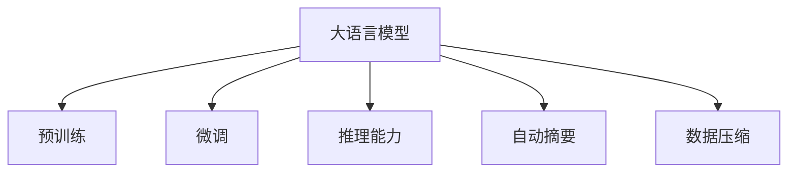

                 

# 长文档推荐: 大模型的总结与推理能力

> 关键词：大模型总结，推理能力，自动摘要，数据压缩，自然语言处理(NLP)，深度学习，Transformer，BERT，GPT

## 1. 背景介绍

### 1.1 问题由来

大语言模型（Large Language Models, LLMs）的崛起极大地推动了自然语言处理（Natural Language Processing, NLP）领域的发展。这些模型通过在庞大的无标签数据集上进行自监督预训练，学习到了丰富的语言知识和模式，具备了强大的语言理解和生成能力。然而，大语言模型本身并不适合直接应用于所有下游任务，因此，微调和推理能力的提升成为当前研究的关键课题。

### 1.2 问题核心关键点

在微调过程中，大模型能够从少量有标签数据中学习到特定任务的知识，从而提升在特定任务上的性能。这为NLP任务如问答、翻译、文本摘要等提供了高效的解决方案。然而，微调仍然面临诸多挑战，如过拟合、参数更新策略、模型压缩等。与此同时，推理能力作为模型对外界输入的响应和理解能力，是大模型能否有效应用于实际场景的关键。

## 2. 核心概念与联系

### 2.1 核心概念概述

为了更好地理解大模型总结与推理能力的核心概念，本节将详细介绍几个关键概念：

- **大语言模型（LLMs）**：如GPT、BERT等模型，通过大规模数据预训练，具备强大的语言理解与生成能力。
- **微调（Fine-Tuning）**：在预训练模型的基础上，使用特定任务的数据进行有监督训练，以提升模型在特定任务上的性能。
- **推理能力**：模型对新输入的解释、理解和生成能力，是大模型应用的关键。
- **自动摘要**：从长篇文本中自动提取出核心信息，提高文本处理的效率和效果。
- **数据压缩**：通过对数据进行编码，减少数据存储和传输的需求，提高系统性能。

这些概念之间的关系可以通过以下Mermaid流程图来展示：



这个流程图展示了各个概念之间的逻辑关系：

1. 大语言模型通过预训练获得基础能力。
2. 微调是对预训练模型进行任务特定的优化，提升特定任务性能。
3. 推理能力是模型对新输入的处理能力，是微调效果的直接体现。
4. 自动摘要和数据压缩是对大模型应用场景的进一步优化，提升系统效率。

### 2.2 核心概念原理和架构

大语言模型通常基于Transformer架构，其核心由编码器和解码器组成。编码器负责将输入序列转换为语义表示，解码器则将语义表示转换为输出序列。这种架构使得模型能够处理长距离依赖，具有卓越的并行计算性能和泛化能力。

Transformer模型的原理基于自注意力机制，可以并行计算每个位置与所有其他位置的关联，显著提升了模型计算效率。其计算过程包括多头注意力和位置编码两个步骤。

## 3. 核心算法原理 & 具体操作步骤

### 3.1 算法原理概述

基于微调的推理能力提升，主要通过以下两个步骤实现：

1. **微调**：在特定任务的数据集上进行训练，优化模型参数以提升在特定任务上的性能。
2. **推理**：使用训练好的模型，对新输入数据进行推理和理解，生成响应。

在微调过程中，通常使用交叉熵损失函数来度量模型预测与真实标签之间的差异。模型的优化目标是使损失函数最小化。常见的优化算法包括AdamW、SGD等，设置合适的学习率、批大小、迭代轮数等超参数。

### 3.2 算法步骤详解

1. **准备数据集**：选择预训练模型和下游任务的标注数据集，进行划分和预处理。
2. **设计任务适配层**：根据任务类型，设计适合的输出层和损失函数。
3. **设置微调超参数**：选择合适的优化算法及其参数，包括学习率、批大小、迭代轮数等。
4. **执行微调训练**：在训练集上执行梯度下降，更新模型参数。
5. **测试和评估**：在验证集和测试集上评估微调后的模型性能。

### 3.3 算法优缺点

**优点**：
- 简单高效：微调可以在少量标注数据上快速提升模型性能。
- 泛化能力强：预训练模型学到的知识可以迁移到不同任务。
- 可扩展性强：可应用于各种NLP任务。

**缺点**：
- 依赖标注数据：微调效果受标注数据质量和数量影响。
- 过拟合风险：模型可能过拟合训练数据。
- 参数更新策略：如何选择更新策略影响微调效果。

### 3.4 算法应用领域

基于微调的推理能力提升方法广泛应用于各种NLP任务中，例如：

- **问答系统**：通过微调，模型能够理解自然语言问题，并生成准确的回答。
- **翻译系统**：将源语言文本翻译为目标语言，通过微调优化翻译质量。
- **文本摘要**：从长篇文本中提取出关键信息，生成简洁摘要。
- **情感分析**：分析文本情感倾向，进行情感分类或评分。
- **命名实体识别**：识别文本中的人名、地名、机构名等实体。

## 4. 数学模型和公式 & 详细讲解 & 举例说明

### 4.1 数学模型构建

假设预训练模型为 $M_{\theta}$，其中 $\theta$ 为预训练得到的模型参数。下游任务的标注数据集为 $D=\{(x_i, y_i)\}_{i=1}^N$，其中 $x_i$ 为输入文本，$y_i$ 为标签。

定义损失函数为：

$$
\mathcal{L}(M_{\theta},D) = -\frac{1}{N} \sum_{i=1}^N \ell(M_{\theta}(x_i),y_i)
$$

其中 $\ell$ 为特定任务的定义的损失函数，如交叉熵损失函数。

### 4.2 公式推导过程

对于二分类任务，假设模型的输出为 $\hat{y}=M_{\theta}(x)$，真实标签为 $y \in \{0,1\}$，则交叉熵损失函数为：

$$
\ell(y,\hat{y}) = -(y\log \hat{y} + (1-y)\log (1-\hat{y}))
$$

将损失函数应用到训练集上，得到经验风险：

$$
\mathcal{L}(\theta) = -\frac{1}{N} \sum_{i=1}^N [y_i\log M_{\theta}(x_i)+(1-y_i)\log(1-M_{\theta}(x_i))]
$$

通过梯度下降等优化算法，模型参数 $\theta$ 不断更新，最小化经验风险。

### 4.3 案例分析与讲解

以文本分类任务为例，微调过程如下：

1. **数据准备**：收集标注好的文本数据集，划分为训练集和验证集。
2. **模型初始化**：使用预训练模型 $M_{\theta}$ 作为初始化参数。
3. **任务适配层设计**：添加线性分类器和交叉熵损失函数。
4. **超参数设置**：选择优化算法（如AdamW），设置学习率、批大小等。
5. **模型训练**：在训练集上执行梯度下降，更新模型参数。
6. **模型评估**：在验证集上评估模型性能，防止过拟合。
7. **模型测试**：在测试集上测试模型，评估效果。

## 5. 项目实践：代码实例和详细解释说明

### 5.1 开发环境搭建

为了进行大模型的微调和推理，我们需要安装和配置以下环境：

1. Python环境：安装Anaconda，创建虚拟环境，安装必要的依赖库。
2. 深度学习框架：安装PyTorch或TensorFlow。
3. 自然语言处理库：安装Transformers、NLTK等。
4. 模型和数据：下载预训练模型和标注数据集。

### 5.2 源代码详细实现

以下是一个使用BERT模型进行文本分类的示例代码：

```python
from transformers import BertForSequenceClassification, BertTokenizer, AdamW
import torch
import torch.nn as nn

# 初始化模型和tokenizer
model = BertForSequenceClassification.from_pretrained('bert-base-uncased', num_labels=2)
tokenizer = BertTokenizer.from_pretrained('bert-base-uncased')

# 准备数据
train_data = ...
val_data = ...
test_data = ...

# 定义损失函数和优化器
criterion = nn.CrossEntropyLoss()
optimizer = AdamW(model.parameters(), lr=2e-5)

# 训练模型
for epoch in range(epochs):
    for batch in train_loader:
        input_ids = batch['input_ids'].to(device)
        attention_mask = batch['attention_mask'].to(device)
        labels = batch['labels'].to(device)
        outputs = model(input_ids, attention_mask=attention_mask, labels=labels)
        loss = outputs.loss
        optimizer.zero_grad()
        loss.backward()
        optimizer.step()

    # 评估模型性能
    for batch in val_loader:
        input_ids = batch['input_ids'].to(device)
        attention_mask = batch['attention_mask'].to(device)
        labels = batch['labels'].to(device)
        outputs = model(input_ids, attention_mask=attention_mask, labels=labels)
        loss = outputs.loss
        metrics.update(outputs.logits.argmax(dim=1), labels)

# 测试模型
for batch in test_loader:
    input_ids = batch['input_ids'].to(device)
    attention_mask = batch['attention_mask'].to(device)
    labels = batch['labels'].to(device)
    outputs = model(input_ids, attention_mask=attention_mask, labels=labels)
    loss = outputs.loss
    predictions = outputs.logits.argmax(dim=1)
```

### 5.3 代码解读与分析

**模型初始化**：使用预训练的BERT模型作为初始参数。

**数据准备**：使用BertTokenizer将文本转换为token ids，并进行padding和truncation处理。

**模型定义**：在BERT模型的顶层添加线性分类器和交叉熵损失函数。

**训练过程**：使用AdamW优化器，在训练集上进行梯度下降。

**评估过程**：在验证集上计算准确率、F1分数等指标。

**测试过程**：在测试集上计算模型性能指标。

### 5.4 运行结果展示

运行上述代码，即可得到模型在特定任务上的性能指标。具体结果取决于数据集的质量和模型超参数的设置。

## 6. 实际应用场景

### 6.1 智能客服系统

智能客服系统通过微调大模型，可以处理大量的客户咨询，提供快速、准确的回答。预训练模型能够理解自然语言，识别客户意图，生成合适的回答，从而提升客户满意度和服务效率。

### 6.2 金融舆情监测

金融舆情监测系统通过微调大模型，可以实时分析网络舆情，预测市场趋势。模型能够处理大量的新闻、评论、社交媒体数据，提取关键信息，评估市场情绪，辅助决策。

### 6.3 个性化推荐系统

个性化推荐系统通过微调大模型，可以理解用户的兴趣和偏好，推荐个性化内容。模型能够分析用户行为，生成推荐列表，优化推荐算法。

## 7. 工具和资源推荐

### 7.1 学习资源推荐

为了更好地掌握大模型的微调和推理能力，以下是一些推荐的学习资源：

1. 《Transformer》系列书籍：深入介绍Transformer架构和自注意力机制。
2. CS224N《自然语言处理与深度学习》课程：斯坦福大学的经典课程，涵盖NLP的基础知识和前沿技术。
3. HuggingFace官方文档：提供了丰富的预训练模型和微调样例代码。
4. 论文推荐：BERT、GPT等模型的原始论文及其后续改进。

### 7.2 开发工具推荐

以下是一些常用的开发工具，可以帮助你高效地进行大模型的微调和推理：

1. PyTorch：灵活的深度学习框架，支持动态计算图，适合研究性工作。
2. TensorFlow：功能全面的深度学习框架，适合生产部署。
3. Transformers库：提供了多种预训练模型，支持微调和推理。
4. Weights & Biases：实验跟踪工具，记录和可视化模型训练和评估过程。
5. TensorBoard：可视化工具，监测模型训练状态，提供图表。

### 7.3 相关论文推荐

以下是一些推荐的相关论文，深入研究了大模型的微调和推理能力：

1. Attention is All You Need：介绍Transformer模型，自注意力机制的开创性论文。
2. BERT: Pre-training of Deep Bidirectional Transformers for Language Understanding：BERT模型的原始论文，提出预训练和微调的方法。
3. GPT-3: Language Models are Unsupervised Multitask Learners：GPT-3模型的论文，展示了无监督学习的强大能力。
4. Parameter-Efficient Transfer Learning for NLP：介绍参数高效微调方法，减少模型参数更新量。
5. Exploring the Limits of Transfer Learning with a Unified Text-to-Text Transformer：研究多种预训练任务对模型性能的影响。

## 8. 总结：未来发展趋势与挑战

### 8.1 研究成果总结

大模型的微调和推理能力研究取得了显著进展，显著提升了NLP任务的性能和效率。主要贡献包括：

1. 微调方法的有效性：在少量标注数据上，微调模型能够显著提升特定任务的表现。
2. 推理能力的提升：通过优化模型结构，提高了大模型的推理速度和准确性。
3. 自动摘要和数据压缩：通过微调，实现了高效的数据处理和摘要生成。

### 8.2 未来发展趋势

未来，大模型的微调和推理能力研究将呈现以下趋势：

1. 模型规模的扩大：随着计算资源的增加，大模型的参数量将不断增加，提升模型的表现能力。
2. 模型的多模态融合：结合视觉、语音等多种模态数据，提升模型的理解能力和应用范围。
3. 推理能力的增强：通过优化模型结构和算法，提升推理速度和准确性。
4. 参数高效微调：通过参数压缩和剪枝技术，减少模型的计算和存储需求。
5. 模型的自适应性：通过增量学习和在线更新，提升模型对新数据的适应能力。

### 8.3 面临的挑战

尽管取得了诸多进展，大模型的微调和推理能力研究仍面临以下挑战：

1. 数据标注成本高：微调需要大量标注数据，标注成本高。
2. 过拟合问题：模型可能过拟合训练数据，泛化能力不足。
3. 推理速度慢：大模型的推理速度较慢，影响实际应用。
4. 模型压缩困难：大模型压缩和剪枝技术有限，存储和计算需求大。
5. 推理结果不可解释：大模型推理结果缺乏可解释性，难以理解和调试。

### 8.4 研究展望

未来，大模型的微调和推理能力研究需要从以下几个方向进行突破：

1. 降低数据标注成本：探索无监督学习和半监督学习的方法，减少标注需求。
2. 提高模型的泛化能力：研究模型增量和在线学习的策略，提升模型的适应性。
3. 提升推理速度：通过优化模型结构和算法，提升推理效率。
4. 增强模型可解释性：研究模型的推理过程，提高可解释性。
5. 结合多模态数据：结合视觉、语音等多种模态数据，提升模型的理解能力和应用范围。

## 9. 附录：常见问题与解答

**Q1：如何降低数据标注成本？**

A: 通过无监督学习和半监督学习的方法，减少标注需求。例如，使用自监督预训练任务，从大规模无标签数据中学习知识。

**Q2：如何缓解模型的过拟合问题？**

A: 通过数据增强、正则化、早停等方法，缓解过拟合问题。数据增强可以增加训练数据的多样性，正则化和早停可以防止过拟合。

**Q3：如何提升推理速度？**

A: 通过优化模型结构和算法，提升推理效率。例如，使用梯度裁剪、模型压缩、剪枝等技术，减少计算和存储需求。

**Q4：如何增强模型可解释性？**

A: 研究模型的推理过程，提高可解释性。例如，使用注意力机制可视化、模型可解释性技术，如LIME、SHAP等，解释模型的推理结果。

**Q5：如何结合多模态数据？**

A: 通过多模态融合技术，结合视觉、语音等多种模态数据，提升模型的理解能力和应用范围。例如，使用多模态自注意力机制，融合多种模态数据。

总之，大模型的微调和推理能力研究仍处于不断发展的阶段，未来的研究需要不断探索新的方法和技术，推动模型的性能和应用范围不断提升。

---

作者：禅与计算机程序设计艺术 / Zen and the Art of Computer Programming

