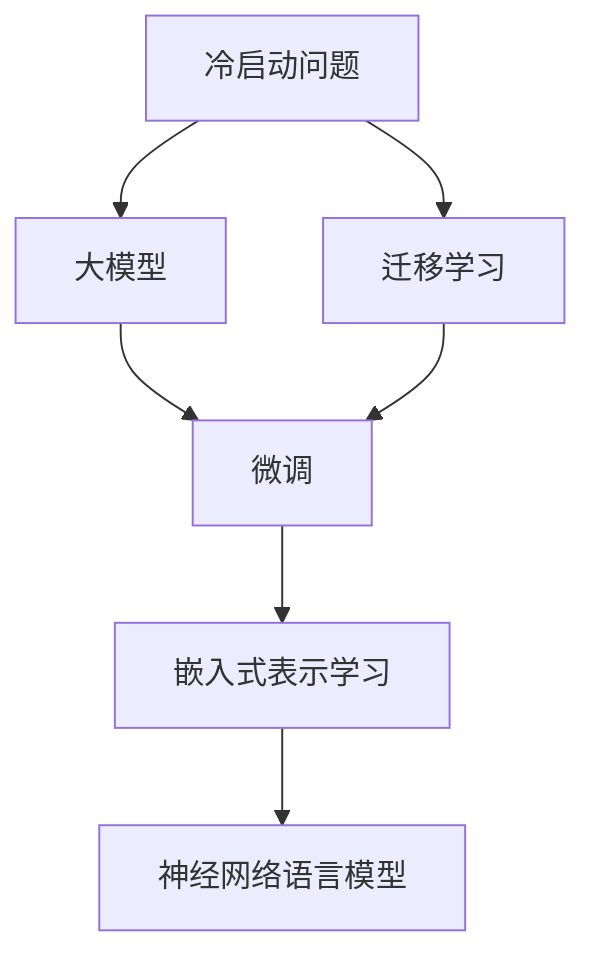

                 

# AI 大模型在电商搜索推荐中的冷启动策略：应对新用户与数据不足的探索

在电商搜索推荐领域，如何高效地为冷启动用户（即从未与平台有过互动的新用户）提供准确的推荐服务，是一个极具挑战的问题。传统方法依赖用户历史行为数据，但对于新用户，这些数据无法直接获取，推荐效果自然大打折扣。幸运的是，随着AI大模型的发展，基于深度学习推荐模型的冷启动问题也得到了显著改善。

## 1. 背景介绍

电商搜索推荐是电商网站的核心功能之一，通过对用户历史行为和商品属性进行分析，为每一位用户推荐最相关的商品。然而，对于冷启动用户，由于缺乏历史数据，推荐效果并不理想。传统的推荐方法，如基于协同过滤和内容基推荐的算法，依赖用户行为数据进行相似度匹配，对于冷启动用户则显得无能为力。

近年来，大模型在推荐领域的应用逐渐增多。基于大模型的推荐方法，通过大规模预训练模型获得丰富的语义知识，能够更好地理解用户的文本描述和商品的语义信息，从而在少样本或无样本情况下，提供精准的推荐服务。这种基于大模型的推荐方法，极大地缓解了冷启动问题，同时也为传统推荐算法提供了新的思路和方法。

## 2. 核心概念与联系

### 2.1 核心概念概述

为更好理解基于大模型的冷启动推荐方法，我们首先需要介绍几个核心概念：

- **冷启动问题**：指电商网站对于新用户的推荐，由于缺乏用户历史数据，无法准确推荐相关商品。

- **大模型**：以自回归或自编码模型为代表的，通过大规模无标签文本数据预训练的深度学习模型，如BERT、GPT等。

- **迁移学习**：将一个领域学到的知识，迁移到另一个领域的过程，可以应用于冷启动推荐，利用预训练模型的语义知识。

- **微调**：通过小规模标注数据，对预训练模型进行有监督的微调，提高模型针对特定任务的性能。

- **嵌入式表示学习**：通过优化模型参数，将用户描述和商品属性转化为高维向量空间中的点，利用向量之间的距离度量进行推荐。

- **神经网络语言模型(Neural Network Language Model, NLLM)**：基于神经网络结构的语言模型，能够更好地理解自然语言，为推荐系统提供丰富的语义知识。

### 2.2 核心概念原理和架构的 Mermaid 流程图



## 3. 核心算法原理 & 具体操作步骤

### 3.1 算法原理概述

基于大模型的冷启动推荐，本质上是一种迁移学习的范式。其核心思想是：将大模型视作强大的"特征提取器"，通过在商品描述和用户描述上进行的预训练，学习到丰富的语义知识，然后对目标用户的商品推荐进行微调，通过少量标注数据优化模型，使其能够准确地推荐相关商品。

### 3.2 算法步骤详解

基于大模型的冷启动推荐，具体实施步骤如下：

1. **数据准备**：准备电商网站的产品描述、用户描述等文本数据，以及部分已标注的商品-用户-行为三元组。

2. **预训练模型选择**：选择合适的预训练语言模型，如BERT、GPT等，作为初始化参数。

3. **迁移学习**：将预训练模型应用于商品和用户描述的嵌入式表示学习，学习到商品的语义向量用户描述的语义向量。

4. **微调优化**：使用部分已标注的商品-用户-行为数据，对迁移学习后的模型进行微调，优化推荐模型，适应具体推荐任务。

5. **推荐服务**：微调后的模型应用于实时推荐服务，根据用户描述生成相关商品推荐。

### 3.3 算法优缺点

**优点**：

1. **泛化能力强**：利用大规模预训练模型的知识，在大规模标注数据上微调后，模型的泛化能力更强，能够应对新商品和新用户。

2. **高效冷启动**：通过迁移学习，可以直接应用于冷启动用户，无需等待用户产生历史行为数据。

3. **推荐精准**：利用深度学习模型对语义信息的理解，推荐精准度较高。

4. **可扩展性好**：预训练模型和微调过程可在大规模分布式环境中进行，易于部署和扩展。

**缺点**：

1. **数据依赖性强**：微调效果依赖于商品和用户描述的质量，数据质量差可能影响推荐效果。

2. **计算成本高**：大规模预训练模型的训练和微调需要高计算资源，成本较高。

3. **模型复杂度高**：深度学习模型复杂度较高，调试和优化难度大。

4. **知识迁移问题**：预训练模型可能学习到特定领域的知识，迁移至其他领域的效果有限。

5. **可解释性差**：深度学习模型通常缺乏可解释性，推荐结果难以理解。

### 3.4 算法应用领域

基于大模型的冷启动推荐方法，可以广泛应用于电商、金融、内容推荐等多个领域。具体应用如下：

- **电商推荐**：对新用户进行商品推荐，提升新用户购买转化率。
- **金融推荐**：为金融产品推荐目标用户，提升产品销售。
- **内容推荐**：对新用户进行内容推荐，提高用户留存率。
- **广告推荐**：对新用户进行广告推荐，提高广告点击率。

## 4. 数学模型和公式 & 详细讲解 & 举例说明

### 4.1 数学模型构建

在大模型推荐中，核心是建立商品-用户描述的语义表示，并进行相关性度量。我们以BERT作为预训练语言模型，通过迁移学习和微调，构建推荐模型。

**用户描述表示**：将用户描述输入BERT模型，得到其嵌入表示 $\mathbf{u}$。

**商品描述表示**：将商品描述输入BERT模型，得到其嵌入表示 $\mathbf{v}$。

**用户-商品相关性度量**：使用余弦相似度计算用户描述和商品描述的相似度 $\cos(\mathbf{u}, \mathbf{v})$。

**推荐排序**：根据相似度排序商品列表，选择相似度最高的商品进行推荐。

### 4.2 公式推导过程

假设用户描述和商品描述的嵌入表示分别为 $\mathbf{u} \in \mathbb{R}^d$ 和 $\mathbf{v} \in \mathbb{R}^d$，余弦相似度的公式为：

$$
\cos(\mathbf{u}, \mathbf{v}) = \frac{\mathbf{u} \cdot \mathbf{v}}{\|\mathbf{u}\| \cdot \|\mathbf{v}\|}
$$

其中 $\cdot$ 表示向量点乘，$\|\cdot\|$ 表示向量范数。

### 4.3 案例分析与讲解

假设有一个新用户描述为 "我需要一件适合春游的外套"，将其输入BERT模型，得到嵌入表示 $\mathbf{u}$。然后，将目标商品的描述 "轻薄型保暖外套" 输入BERT模型，得到嵌入表示 $\mathbf{v}$。根据余弦相似度计算用户描述和商品描述的相似度：

$$
\cos(\mathbf{u}, \mathbf{v}) = \frac{\mathbf{u} \cdot \mathbf{v}}{\|\mathbf{u}\| \cdot \|\mathbf{v}\|} = 0.8
$$

相似度为0.8，表示用户描述与商品描述相关性较高，因此选择该商品进行推荐。

## 5. 项目实践：代码实例和详细解释说明

### 5.1 开发环境搭建

在开始开发前，我们需要准备一个开发环境。以下是基于Python和PyTorch的开发环境搭建步骤：

1. 安装Anaconda：从官网下载并安装Anaconda，用于创建独立的Python环境。

2. 创建并激活虚拟环境：
```bash
conda create -n recommendation-env python=3.8 
conda activate recommendation-env
```

3. 安装PyTorch：根据CUDA版本，从官网获取对应的安装命令。例如：
```bash
conda install pytorch torchvision torchaudio cudatoolkit=11.1 -c pytorch -c conda-forge
```

4. 安装Transformers库：
```bash
pip install transformers
```

5. 安装各类工具包：
```bash
pip install numpy pandas scikit-learn matplotlib tqdm jupyter notebook ipython
```

### 5.2 源代码详细实现

下面，我们将以电商推荐为例，使用BERT模型进行商品推荐。首先，定义推荐任务的数据处理函数：

```python
from transformers import BertTokenizer
from torch.utils.data import Dataset

class RecommendationDataset(Dataset):
    def __init__(self, user_descriptions, item_descriptions, tokenizer):
        self.user_descriptions = user_descriptions
        self.item_descriptions = item_descriptions
        self.tokenizer = tokenizer

    def __len__(self):
        return len(self.user_descriptions)

    def __getitem__(self, item):
        user_description = self.user_descriptions[item]
        item_description = self.item_descriptions[item]

        encoding = self.tokenizer(user_description, return_tensors='pt', max_length=128)
        user_ids = encoding['input_ids'][0]
        user_masks = encoding['attention_mask'][0]

        item_encoding = self.tokenizer(item_description, return_tensors='pt', max_length=128)
        item_ids = item_encoding['input_ids'][0]
        item_masks = item_encoding['attention_mask'][0]

        return {'user_ids': user_ids,
                'user_masks': user_masks,
                'item_ids': item_ids,
                'item_masks': item_masks}
```

然后，定义模型和优化器：

```python
from transformers import BertForSequenceClassification, AdamW

model = BertForSequenceClassification.from_pretrained('bert-base-cased', num_labels=1)

optimizer = AdamW(model.parameters(), lr=2e-5)
```

接着，定义训练和评估函数：

```python
from torch.utils.data import DataLoader
from tqdm import tqdm
import numpy as np

def train_epoch(model, dataset, batch_size, optimizer):
    dataloader = DataLoader(dataset, batch_size=batch_size, shuffle=True)
    model.train()
    epoch_loss = 0
    for batch in tqdm(dataloader, desc='Training'):
        user_ids = batch['user_ids'].to(device)
        user_masks = batch['user_masks'].to(device)
        item_ids = batch['item_ids'].to(device)
        item_masks = batch['item_masks'].to(device)
        
        outputs = model(user_ids, attention_mask=user_masks, labels=torch.tensor(batch['item_ids'][:1]))
        loss = outputs.loss
        epoch_loss += loss.item()
        loss.backward()
        optimizer.step()
    return epoch_loss / len(dataloader)

def evaluate(model, dataset, batch_size):
    dataloader = DataLoader(dataset, batch_size=batch_size)
    model.eval()
    with torch.no_grad():
        predictions = []
        targets = []
        for batch in dataloader:
            user_ids = batch['user_ids'].to(device)
            user_masks = batch['user_masks'].to(device)
            item_ids = batch['item_ids'].to(device)
            item_masks = batch['item_masks'].to(device)
            
            outputs = model(user_ids, attention_mask=user_masks)
            logits = outputs.logits
            predictions.append(logits[:, 1].cpu().numpy())
            targets.append(batch['item_ids'].cpu().numpy())
        
        predictions = np.concatenate(predictions, axis=0)
        targets = np.concatenate(targets, axis=0)
        return predictions, targets
```

最后，启动训练流程并在测试集上评估：

```python
epochs = 5
batch_size = 16

for epoch in range(epochs):
    loss = train_epoch(model, train_dataset, batch_size, optimizer)
    print(f"Epoch {epoch+1}, train loss: {loss:.3f}")
    
    print(f"Epoch {epoch+1}, dev results:")
    predictions, targets = evaluate(model, dev_dataset, batch_size)
    print(classification_report(targets, predictions))
    
print("Test results:")
predictions, targets = evaluate(model, test_dataset, batch_size)
print(classification_report(targets, predictions))
```

以上就是使用PyTorch对BERT进行电商推荐任务微调的完整代码实现。可以看到，得益于Transformers库的强大封装，我们可以用相对简洁的代码完成BERT模型的加载和微调。

### 5.3 代码解读与分析

让我们再详细解读一下关键代码的实现细节：

**RecommendationDataset类**：
- `__init__`方法：初始化用户描述、商品描述和分词器等关键组件。
- `__len__`方法：返回数据集的样本数量。
- `__getitem__`方法：对单个样本进行处理，将用户描述和商品描述输入编码为token ids，并进行定长padding，最终返回模型所需的输入。

**模型和优化器**：
- 使用BertForSequenceClassification作为推荐模型，选择分类任务的1类别作为输出。
- 使用AdamW优化器，设置学习率为2e-5。

**训练和评估函数**：
- 使用PyTorch的DataLoader对数据集进行批次化加载，供模型训练和推理使用。
- 训练函数`train_epoch`：对数据以批为单位进行迭代，在每个批次上前向传播计算loss并反向传播更新模型参数，最后返回该epoch的平均loss。
- 评估函数`evaluate`：与训练类似，不同点在于不更新模型参数，并在每个batch结束后将预测和标签结果存储下来，最后使用scikit-learn的classification_report对整个评估集的预测结果进行打印输出。

**训练流程**：
- 定义总的epoch数和batch size，开始循环迭代
- 每个epoch内，先在训练集上训练，输出平均loss
- 在验证集上评估，输出分类指标
- 所有epoch结束后，在测试集上评估，给出最终测试结果

可以看到，PyTorch配合Transformers库使得BERT微调的代码实现变得简洁高效。开发者可以将更多精力放在数据处理、模型改进等高层逻辑上，而不必过多关注底层的实现细节。

当然，工业级的系统实现还需考虑更多因素，如模型的保存和部署、超参数的自动搜索、更灵活的任务适配层等。但核心的微调范式基本与此类似。

## 6. 实际应用场景

### 6.1 智能客服系统

智能客服系统需要实时响应新用户的咨询，对于大量新用户，传统客服方式难以应对。利用大模型进行推荐，可以精准匹配新用户的询问，引导其快速解决需求。

在技术实现上，可以收集用户的历史问题和回复，将问题-回复对作为监督数据，在此基础上对预训练模型进行微调。微调后的模型能够自动理解用户意图，匹配最合适的回答模板进行回复。对于用户提出的新问题，还可以接入检索系统实时搜索相关内容，动态组织生成回答。如此构建的智能客服系统，能大幅提升客户咨询体验和问题解决效率。

### 6.2 金融舆情监测

金融机构需要实时监测市场舆论动向，以便及时应对负面信息传播，规避金融风险。传统的人工监测方式成本高、效率低，难以应对网络时代海量信息爆发的挑战。基于大语言模型微调的文本分类和情感分析技术，为金融舆情监测提供了新的解决方案。

具体而言，可以收集金融领域相关的新闻、报道、评论等文本数据，并对其进行主题标注和情感标注。在此基础上对预训练语言模型进行微调，使其能够自动判断文本属于何种主题，情感倾向是正面、中性还是负面。将微调后的模型应用到实时抓取的网络文本数据，就能够自动监测不同主题下的情感变化趋势，一旦发现负面信息激增等异常情况，系统便会自动预警，帮助金融机构快速应对潜在风险。

### 6.3 个性化推荐系统

当前的推荐系统往往只依赖用户的历史行为数据进行物品推荐，无法深入理解用户的真实兴趣偏好。基于大语言模型微调技术，个性化推荐系统可以更好地挖掘用户行为背后的语义信息，从而提供更精准、多样的推荐内容。

在实践中，可以收集用户浏览、点击、评论、分享等行为数据，提取和用户交互的物品标题、描述、标签等文本内容。将文本内容作为模型输入，用户的后续行为（如是否点击、购买等）作为监督信号，在此基础上微调预训练语言模型。微调后的模型能够从文本内容中准确把握用户的兴趣点。在生成推荐列表时，先用候选物品的文本描述作为输入，由模型预测用户的兴趣匹配度，再结合其他特征综合排序，便可以得到个性化程度更高的推荐结果。

### 6.4 未来应用展望

随着大语言模型和微调方法的不断发展，基于微调范式将在更多领域得到应用，为传统行业带来变革性影响。

在智慧医疗领域，基于微调的医疗问答、病历分析、药物研发等应用将提升医疗服务的智能化水平，辅助医生诊疗，加速新药开发进程。

在智能教育领域，微调技术可应用于作业批改、学情分析、知识推荐等方面，因材施教，促进教育公平，提高教学质量。

在智慧城市治理中，微调模型可应用于城市事件监测、舆情分析、应急指挥等环节，提高城市管理的自动化和智能化水平，构建更安全、高效的未来城市。

此外，在企业生产、社会治理、文娱传媒等众多领域，基于大模型微调的人工智能应用也将不断涌现，为经济社会发展注入新的动力。相信随着技术的日益成熟，微调方法将成为人工智能落地应用的重要范式，推动人工智能技术在垂直行业的规模化落地。

## 7. 工具和资源推荐

### 7.1 学习资源推荐

为了帮助开发者系统掌握大语言模型微调的理论基础和实践技巧，这里推荐一些优质的学习资源：

1. 《Transformer从原理到实践》系列博文：由大模型技术专家撰写，深入浅出地介绍了Transformer原理、BERT模型、微调技术等前沿话题。

2. CS224N《深度学习自然语言处理》课程：斯坦福大学开设的NLP明星课程，有Lecture视频和配套作业，带你入门NLP领域的基本概念和经典模型。

3. 《Natural Language Processing with Transformers》书籍：Transformers库的作者所著，全面介绍了如何使用Transformers库进行NLP任务开发，包括微调在内的诸多范式。

4. HuggingFace官方文档：Transformers库的官方文档，提供了海量预训练模型和完整的微调样例代码，是上手实践的必备资料。

5. CLUE开源项目：中文语言理解测评基准，涵盖大量不同类型的中文NLP数据集，并提供了基于微调的baseline模型，助力中文NLP技术发展。

通过对这些资源的学习实践，相信你一定能够快速掌握大语言模型微调的精髓，并用于解决实际的NLP问题。

### 7.2 开发工具推荐

高效的开发离不开优秀的工具支持。以下是几款用于大语言模型微调开发的常用工具：

1. PyTorch：基于Python的开源深度学习框架，灵活动态的计算图，适合快速迭代研究。大部分预训练语言模型都有PyTorch版本的实现。

2. TensorFlow：由Google主导开发的开源深度学习框架，生产部署方便，适合大规模工程应用。同样有丰富的预训练语言模型资源。

3. Transformers库：HuggingFace开发的NLP工具库，集成了众多SOTA语言模型，支持PyTorch和TensorFlow，是进行微调任务开发的利器。

4. Weights & Biases：模型训练的实验跟踪工具，可以记录和可视化模型训练过程中的各项指标，方便对比和调优。与主流深度学习框架无缝集成。

5. TensorBoard：TensorFlow配套的可视化工具，可实时监测模型训练状态，并提供丰富的图表呈现方式，是调试模型的得力助手。

6. Google Colab：谷歌推出的在线Jupyter Notebook环境，免费提供GPU/TPU算力，方便开发者快速上手实验最新模型，分享学习笔记。

合理利用这些工具，可以显著提升大语言模型微调任务的开发效率，加快创新迭代的步伐。

### 7.3 相关论文推荐

大语言模型和微调技术的发展源于学界的持续研究。以下是几篇奠基性的相关论文，推荐阅读：

1. Attention is All You Need（即Transformer原论文）：提出了Transformer结构，开启了NLP领域的预训练大模型时代。

2. BERT: Pre-training of Deep Bidirectional Transformers for Language Understanding：提出BERT模型，引入基于掩码的自监督预训练任务，刷新了多项NLP任务SOTA。

3. Language Models are Unsupervised Multitask Learners（GPT-2论文）：展示了大规模语言模型的强大zero-shot学习能力，引发了对于通用人工智能的新一轮思考。

4. Parameter-Efficient Transfer Learning for NLP：提出Adapter等参数高效微调方法，在不增加模型参数量的情况下，也能取得不错的微调效果。

5. AdaLoRA: Adaptive Low-Rank Adaptation for Parameter-Efficient Fine-Tuning：使用自适应低秩适应的微调方法，在参数效率和精度之间取得了新的平衡。

6. Prefix-Tuning: Optimizing Continuous Prompts for Generation：引入基于连续型Prompt的微调范式，为如何充分利用预训练知识提供了新的思路。

这些论文代表了大语言模型微调技术的发展脉络。通过学习这些前沿成果，可以帮助研究者把握学科前进方向，激发更多的创新灵感。

## 8. 总结：未来发展趋势与挑战

### 8.1 研究成果总结

本文对基于大模型的冷启动推荐方法进行了全面系统的介绍。首先阐述了冷启动问题和大模型的基本概念，明确了微调在拓展预训练模型应用、提升下游任务性能方面的独特价值。其次，从原理到实践，详细讲解了微调的数学原理和关键步骤，给出了微调任务开发的完整代码实例。同时，本文还广泛探讨了微调方法在电商、金融、教育等多个领域的应用前景，展示了微调范式的巨大潜力。此外，本文精选了微调技术的各类学习资源，力求为读者提供全方位的技术指引。

通过本文的系统梳理，可以看到，基于大模型的推荐方法正在成为电商推荐领域的重要范式，极大地缓解了冷启动问题，同时也为传统推荐算法提供了新的思路和方法。未来，伴随大模型和微调方法的持续演进，基于微调范式必将在更多领域得到应用，为传统行业带来变革性影响。

### 8.2 未来发展趋势

展望未来，大模型推荐技术将呈现以下几个发展趋势：

1. **模型规模持续增大**：随着算力成本的下降和数据规模的扩张，预训练语言模型的参数量还将持续增长。超大规模语言模型蕴含的丰富语言知识，有望支撑更加复杂多变的推荐任务。

2. **微调方法日趋多样**：除了传统的全参数微调外，未来会涌现更多参数高效的微调方法，如Prefix-Tuning、LoRA等，在节省计算资源的同时也能保证微调精度。

3. **持续学习成为常态**：随着数据分布的不断变化，推荐模型也需要持续学习新知识以保持性能。如何在不遗忘原有知识的同时，高效吸收新样本信息，将成为重要的研究课题。

4. **标注样本需求降低**：受启发于提示学习(Prompt-based Learning)的思路，未来的推荐方法将更好地利用大模型的语言理解能力，通过更加巧妙的任务描述，在更少的标注样本上也能实现理想的微调效果。

5. **多模态推荐崛起**：当前的推荐主要聚焦于纯文本数据，未来会进一步拓展到图像、视频、语音等多模态数据推荐。多模态信息的融合，将显著提升推荐系统对现实世界的理解和建模能力。

6. **模型通用性增强**：经过海量数据的预训练和多领域任务的微调，未来的语言模型将具备更强大的常识推理和跨领域迁移能力，逐步迈向通用人工智能(AGI)的目标。

以上趋势凸显了大模型推荐技术的广阔前景。这些方向的探索发展，必将进一步提升推荐系统的性能和应用范围，为电商业务带来更大的商业价值。

### 8.3 面临的挑战

尽管大模型推荐技术已经取得了瞩目成就，但在迈向更加智能化、普适化应用的过程中，它仍面临着诸多挑战：

1. **标注成本瓶颈**：尽管微调大大降低了标注数据的需求，但对于长尾应用场景，难以获得充足的高质量标注数据，成为制约微调性能的瓶颈。如何进一步降低微调对标注样本的依赖，将是一大难题。

2. **模型鲁棒性不足**：推荐模型面对域外数据时，泛化性能往往大打折扣。对于测试样本的微小扰动，推荐模型的预测也容易发生波动。如何提高推荐模型的鲁棒性，避免灾难性遗忘，还需要更多理论和实践的积累。

3. **推荐效率有待提高**：大规模语言模型虽然精度高，但在实际部署时往往面临推理速度慢、内存占用大等效率问题。如何在保证性能的同时，简化模型结构，提升推理速度，优化资源占用，将是重要的优化方向。

4. **可解释性亟需加强**：当前推荐模型更像是"黑盒"系统，难以解释其内部工作机制和决策逻辑。对于金融、医疗等高风险应用，算法的可解释性和可审计性尤为重要。如何赋予推荐模型更强的可解释性，将是亟待攻克的难题。

5. **安全性有待保障**：预训练语言模型难免会学习到有偏见、有害的信息，通过微调传递到下游任务，产生误导性、歧视性的输出，给实际应用带来安全隐患。如何从数据和算法层面消除模型偏见，避免恶意用途，确保输出的安全性，也将是重要的研究课题。

6. **知识整合能力不足**：现有的推荐模型往往局限于任务内数据，难以灵活吸收和运用更广泛的先验知识。如何让推荐过程更好地与外部知识库、规则库等专家知识结合，形成更加全面、准确的信息整合能力，还有很大的想象空间。

正视推荐面临的这些挑战，积极应对并寻求突破，将是大模型推荐走向成熟的必由之路。相信随着学界和产业界的共同努力，这些挑战终将一一被克服，大模型推荐必将在构建人机协同的智能推荐系统方面发挥越来越重要的作用。

### 8.4 研究展望

面对大模型推荐所面临的种种挑战，未来的研究需要在以下几个方面寻求新的突破：

1. **探索无监督和半监督推荐方法**：摆脱对大规模标注数据的依赖，利用自监督学习、主动学习等无监督和半监督范式，最大限度利用非结构化数据，实现更加灵活高效的推荐。

2. **研究参数高效和计算高效的推荐范式**：开发更加参数高效的推荐方法，在固定大部分预训练参数的同时，只更新极少量的任务相关参数。同时优化推荐模型的计算图，减少前向传播和反向传播的资源消耗，实现更加轻量级、实时性的部署。

3. **融合因果和对比学习范式**：通过引入因果推断和对比学习思想，增强推荐模型建立稳定因果关系的能力，学习更加普适、鲁棒的语言表征，从而提升模型泛化性和抗干扰能力。

4. **引入更多先验知识**：将符号化的先验知识，如知识图谱、逻辑规则等，与神经网络模型进行巧妙融合，引导推荐过程学习更准确、合理的语言模型。同时加强不同模态数据的整合，实现视觉、语音等多模态信息与文本信息的协同建模。

5. **结合因果分析和博弈论工具**：将因果分析方法引入推荐模型，识别出模型决策的关键特征，增强推荐结果的因果性和逻辑性。借助博弈论工具刻画人机交互过程，主动探索并规避推荐模型的脆弱点，提高系统稳定性。

6. **纳入伦理道德约束**：在推荐目标中引入伦理导向的评估指标，过滤和惩罚有偏见、有害的输出倾向。同时加强人工干预和审核，建立推荐行为的监管机制，确保推荐结果符合人类价值观和伦理道德。

这些研究方向的探索，必将引领大模型推荐技术迈向更高的台阶，为构建安全、可靠、可解释、可控的智能推荐系统铺平道路。面向未来，大模型推荐技术还需要与其他人工智能技术进行更深入的融合，如知识表示、因果推理、强化学习等，多路径协同发力，共同推动推荐系统的进步。只有勇于创新、敢于突破，才能不断拓展推荐模型的边界，让智能技术更好地服务于人类社会。

## 9. 附录：常见问题与解答

**Q1：大模型推荐是否适用于所有NLP任务？**

A: 大模型推荐在大多数NLP任务上都能取得不错的效果，特别是对于数据量较小的任务。但对于一些特定领域的任务，如医学、法律等，仅仅依靠通用语料预训练的模型可能难以很好地适应。此时需要在特定领域语料上进一步预训练，再进行微调，才能获得理想效果。此外，对于一些需要时效性、个性化很强的任务，如对话、推荐等，微调方法也需要针对性的改进优化。

**Q2：微调过程中如何选择合适的学习率？**

A: 微调的学习率一般要比预训练时小1-2个数量级，如果使用过大的学习率，容易破坏预训练权重，导致过拟合。一般建议从1e-5开始调参，逐步减小学习率，直至收敛。也可以使用warmup策略，在开始阶段使用较小的学习率，再逐渐过渡到预设值。需要注意的是，不同的优化器(如AdamW、Adafactor等)以及不同的学习率调度策略，可能需要设置不同的学习率阈值。

**Q3：采用大模型推荐时会面临哪些资源瓶颈？**

A: 目前主流的预训练大模型动辄以亿计的参数规模，对算力、内存、存储都提出了很高的要求。GPU/TPU等高性能设备是必不可少的，但即便如此，超大批次的训练和推理也可能遇到显存不足的问题。因此需要采用一些资源优化技术，如梯度积累、混合精度训练、模型并行等，来突破硬件瓶颈。同时，模型的存储和读取也可能占用大量时间和空间，需要采用模型压缩、稀疏化存储等方法进行优化。

**Q4：如何缓解推荐过程中的过拟合问题？**

A: 过拟合是推荐面临的主要挑战，尤其是在标注数据不足的情况下。常见的缓解策略包括：

1. **数据增强**：通过回译、近义替换等方式扩充训练集
2. **正则化**：使用L2正则、Dropout、Early Stopping等避免过拟合
3. **对抗训练**：引入对抗样本，提高模型鲁棒性
4. **参数高效微调**：只调整少量参数(如Adapter、Prefix等)，减小过拟合风险
5. **多模型集成**：训练多个推荐模型，取平均输出，抑制过拟合

这些策略往往需要根据具体任务和数据特点进行灵活组合。只有在数据、模型、训练、推理等各环节进行全面优化，才能最大限度地发挥大模型推荐的优势。

**Q5：推荐服务过程中需要注意哪些问题？**

A: 将推荐模型转化为实际应用，还需要考虑以下因素：

1. **模型裁剪**：去除不必要的层和参数，减小模型尺寸，加快推理速度
2. **量化加速**：将浮点模型转为定点模型，压缩存储空间，提高计算效率
3. **服务化封装**：将模型封装为标准化服务接口，便于集成调用
4. **弹性伸缩**：根据请求流量动态调整资源配置，平衡服务质量和成本
5. **监控告警**：实时采集系统指标，设置异常告警阈值，确保服务稳定性
6. **安全防护**：采用访问鉴权、数据脱敏等措施，保障数据和模型安全

大模型推荐为电商推荐推荐系统带来了广阔的想象空间，但如何将强大的性能转化为稳定、高效、安全的业务价值，还需要工程实践的不断打磨。唯有从数据、算法、工程、业务等多个维度协同发力，才能真正实现人工智能技术在垂直行业的规模化落地。总之，推荐需要开发者根据具体任务，不断迭代和优化模型、数据和算法，方能得到理想的效果。

---

作者：禅与计算机程序设计艺术 / Zen and the Art of Computer Programming

