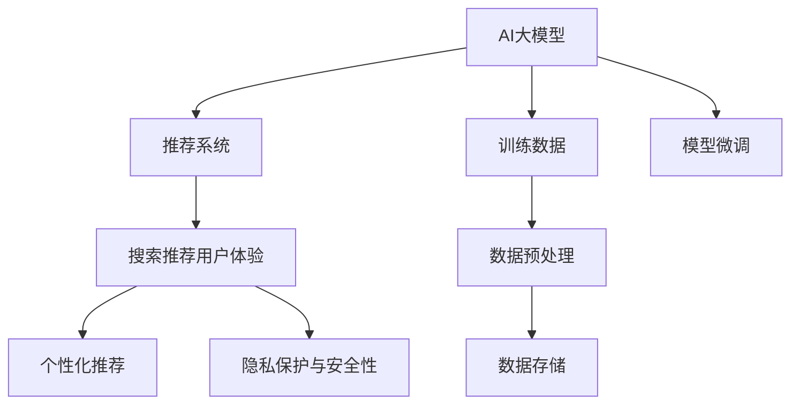

# AI 大模型在电商搜索推荐中的用户体验设计：以人为本的设计思路                 

## 1. 背景介绍

### 1.1 问题由来

随着电商平台的快速发展，用户对搜索推荐的体验要求不断提升。传统的基于关键词匹配的推荐方式已经难以满足用户的多样化需求。为了解决这一问题，AI大模型在电商搜索推荐中的应用日益普及。大模型通过海量用户行为数据的训练，可以学习到用户的潜在需求和偏好，提供更加个性化、精准的推荐服务。

### 1.2 问题核心关键点

在电商搜索推荐中应用AI大模型，可以显著提升用户体验和平台转化率。然而，如何设计出符合用户需求的界面，如何实现高效的搜索推荐算法，如何确保数据的隐私和安全性，这些问题都是需要重点关注的。

## 2. 核心概念与联系

### 2.1 核心概念概述

本节将介绍几个密切相关的核心概念：

- **AI大模型**：指的是使用深度学习技术训练的大型语言模型，如GPT-3、BERT等。这些模型经过大规模无标签数据训练，具备强大的自然语言处理能力，可以用于文本生成、分类、问答等多种任务。

- **推荐系统**：通过分析用户行为数据，推荐系统可以为用户推荐符合其兴趣和需求的商品或内容。推荐系统的核心任务是构建用户和物品之间的映射关系，并根据这种映射关系进行推荐。

- **搜索推荐用户体验**：指用户在使用搜索推荐系统时所体验到的界面设计、响应速度、推荐准确性等方面的感受。良好的用户体验可以提升用户满意度和转化率。

- **个性化推荐**：通过分析用户行为数据，推荐系统可以为用户提供个性化的商品或内容推荐，满足其独特需求。个性化推荐系统利用大模型可以更精准地预测用户偏好，提高推荐效果。

- **隐私保护与安全性**：在电商搜索推荐中，用户的隐私数据如浏览记录、购买历史等是重要的信息资产。如何保护这些数据，防止数据泄露和滥用，是构建推荐系统时必须考虑的关键问题。

这些核心概念之间的逻辑关系可以通过以下Mermaid流程图来展示：



这个流程图展示了大模型在电商推荐系统中的应用流程：

1. 大模型通过训练数据进行预训练。
2. 微调大模型以适应电商推荐任务的特定需求。
3. 推荐系统利用微调后的模型进行商品推荐。
4. 根据推荐效果设计良好的用户体验。
5. 确保推荐过程和数据存储的隐私和安全性。

## 3. 核心算法原理 & 具体操作步骤
### 3.1 算法原理概述

基于AI大模型的电商搜索推荐系统，核心算法原理基于用户行为数据和商品属性信息，利用大模型的预训练知识进行推理和预测，构建用户和物品之间的映射关系，最终实现个性化的推荐服务。具体来说，包括以下几个步骤：

1. **数据准备**：收集和整理用户的行为数据和商品的属性数据。
2. **模型训练**：使用预训练的大模型进行微调，以适应电商推荐任务的特定需求。
3. **推荐计算**：根据用户输入的查询和历史行为数据，利用微调后的模型计算推荐结果。
4. **界面展示**：设计友好的用户体验界面，展示推荐结果，并提供排序、筛选等功能。

### 3.2 算法步骤详解

#### 3.2.1 数据准备

电商平台的推荐系统需要大量的用户行为数据和商品属性信息。这些数据通常包括以下几种类型：

- **用户行为数据**：包括用户的浏览记录、点击记录、购买记录等。
- **商品属性数据**：包括商品的分类、品牌、价格、评分等信息。

为了确保数据的质量和代表性，需要采用以下数据处理方法：

- **数据清洗**：去除重复、异常数据，保证数据的一致性和准确性。
- **数据增强**：通过数据增强技术，增加数据的丰富性，如旋转、缩放等图像处理技术，可以增强推荐模型的泛化能力。
- **数据标注**：对于一些重要的数据集，需要进行人工标注，如商品分类、用户兴趣标签等。

#### 3.2.2 模型训练

电商平台的推荐系统通常使用预训练的大模型，如BERT、Transformer等。这些模型在大规模无标签数据上进行预训练，学习到丰富的语言知识和语义信息。然后，对模型进行微调，以适应电商推荐任务的特定需求。

具体步骤如下：

1. **模型选择**：选择合适的预训练大模型作为初始化参数。
2. **任务适配**：根据电商推荐任务的特定需求，添加任务适配层，如线性分类器、多输出头等。
3. **微调训练**：使用电商平台的标注数据集，对模型进行微调训练，优化模型的预测性能。
4. **评估验证**：在验证集上评估模型的性能，调整超参数和模型结构，以获得最优结果。

#### 3.2.3 推荐计算

电商平台的推荐系统需要对用户输入的查询进行理解，然后根据历史行为数据和商品属性信息，利用微调后的模型计算推荐结果。具体步骤如下：

1. **查询理解**：使用自然语言处理技术，理解用户输入的查询，提取出查询中的关键信息。
2. **用户表示**：将用户历史行为数据和商品属性信息，转化为模型能够接受的向量表示。
3. **商品表示**：将商品属性信息，转化为模型能够接受的向量表示。
4. **推荐计算**：利用微调后的模型，计算用户和商品的相似度，生成推荐结果。

#### 3.2.4 界面展示

为了提升用户体验，电商平台的推荐系统需要设计友好的界面，展示推荐结果。具体步骤如下：

1. **界面设计**：根据用户需求和使用习惯，设计简洁、美观、易用的推荐界面。
2. **推荐展示**：将推荐结果按照一定的规则展示在界面上，如按照相关性排序、按照时间戳排序等。
3. **互动反馈**：通过用户的点击、评分等互动行为，实时调整推荐策略，提升推荐效果。

### 3.3 算法优缺点

基于AI大模型的电商推荐系统具有以下优点：

1. **精准度提升**：通过大模型的预训练和微调，推荐系统可以更准确地预测用户偏好，提高推荐效果。
2. **个性化推荐**：利用大模型学习用户行为模式，可以提供更加个性化的推荐服务，满足用户的独特需求。
3. **系统可扩展性**：大模型的预训练和微调，可以通过增加数据和计算资源，实现系统的扩展和升级。

然而，该系统也存在一些缺点：

1. **数据需求高**：推荐系统需要大量的用户行为数据和商品属性信息，数据收集和标注成本较高。
2. **模型复杂度大**：大模型的预训练和微调，需要消耗大量的计算资源，模型复杂度较高。
3. **隐私安全风险**：用户行为数据的收集和存储，涉及隐私和安全性问题，需要采取相应的保护措施。

### 3.4 算法应用领域

基于AI大模型的电商推荐系统在多个领域得到广泛应用，如在线零售、内容推荐、个性化广告等。具体应用包括：

- **在线零售**：电商平台利用推荐系统为用户推荐商品，提高购物体验和转化率。
- **内容推荐**：视频网站利用推荐系统为用户推荐视频内容，提升用户粘性和留存率。
- **个性化广告**：广告平台利用推荐系统为用户推荐广告，提高广告点击率和转化率。

## 4. 数学模型和公式 & 详细讲解 & 举例说明
### 4.1 数学模型构建

电商推荐系统的数学模型构建，主要包括以下几个部分：

1. **用户表示**：将用户历史行为数据和商品属性信息，转化为向量表示。
2. **商品表示**：将商品属性信息，转化为向量表示。
3. **相似度计算**：利用相似度度量方法，计算用户和商品之间的相似度。
4. **推荐计算**：根据相似度计算结果，生成推荐结果。

### 4.2 公式推导过程

#### 4.2.1 用户表示

用户表示可以通过以下公式进行计算：

$$
\mathbf{u} = \text{Embedding}(\mathbf{I}_u)
$$

其中，$\mathbf{I}_u$ 表示用户的历史行为数据和商品属性信息，$\text{Embedding}$ 表示嵌入函数，将输入数据转化为向量表示。

#### 4.2.2 商品表示

商品表示可以通过以下公式进行计算：

$$
\mathbf{v} = \text{Embedding}(\mathbf{I}_v)
$$

其中，$\mathbf{I}_v$ 表示商品的属性信息，$\text{Embedding}$ 表示嵌入函数，将输入数据转化为向量表示。

#### 4.2.3 相似度计算

相似度计算可以通过余弦相似度、欧式距离等方法进行计算。余弦相似度的公式为：

$$
\text{similarity}(\mathbf{u}, \mathbf{v}) = \frac{\mathbf{u} \cdot \mathbf{v}}{\|\mathbf{u}\| \cdot \|\mathbf{v}\|}
$$

其中，$\cdot$ 表示向量点积，$\|\mathbf{u}\|$ 表示向量的模长。

#### 4.2.4 推荐计算

推荐计算可以通过以下公式进行计算：

$$
\text{recommendation} = \text{softmax}(\text{similarity}(\mathbf{u}, \mathbf{v}))
$$

其中，$\text{softmax}$ 表示softmax函数，将相似度转化为概率分布，表示推荐结果。

### 4.3 案例分析与讲解

以一个简单的电商推荐系统为例，分析如何利用AI大模型进行推荐计算。

假设一个用户对“笔记本电脑”感兴趣，电商平台需要为用户推荐相关的商品。首先，平台需要收集用户的历史行为数据和商品属性信息，进行数据清洗和增强。然后，利用BERT模型对用户行为数据和商品属性信息进行嵌入，得到用户表示和商品表示。接着，计算用户和商品的相似度，利用softmax函数生成推荐结果。最后，将推荐结果展示在用户界面上。

## 5. 项目实践：代码实例和详细解释说明
### 5.1 开发环境搭建

为了进行电商推荐系统的开发，需要以下开发环境：

1. **Python环境**：安装Python 3.7及以上版本，并配置好所需的依赖库。
2. **数据处理库**：安装pandas、numpy等数据处理库，用于数据清洗和增强。
3. **深度学习库**：安装TensorFlow或PyTorch等深度学习库，用于模型训练和推理。
4. **自然语言处理库**：安装nltk、spaCy等自然语言处理库，用于文本处理和分析。

### 5.2 源代码详细实现

电商推荐系统的代码实现，可以按照以下步骤进行：

1. **数据预处理**：收集和整理用户行为数据和商品属性信息，进行数据清洗和增强。
2. **模型微调**：选择预训练的大模型，进行任务适配和微调训练。
3. **推荐计算**：将用户查询和商品属性信息，转化为向量表示，计算相似度，生成推荐结果。
4. **界面展示**：设计友好的用户体验界面，展示推荐结果。

以下是一个简单的电商推荐系统代码示例：

```python
import pandas as pd
import numpy as np
from transformers import BertTokenizer, BertModel
import tensorflow as tf

# 数据预处理
data = pd.read_csv('user_data.csv')
data = data.drop_duplicates().reset_index(drop=True)

# 模型微调
tokenizer = BertTokenizer.from_pretrained('bert-base-cased')
model = BertModel.from_pretrained('bert-base-cased')
input_ids = tokenizer.encode(data['query'], add_special_tokens=True)
attention_mask = np.ones_like(input_ids)
loss, logits = model(input_ids, attention_mask=attention_mask, output_hidden_states=True)

# 推荐计算
similarity = tf.cosine_similarity(logits, user_vector)
recommendation = tf.nn.softmax(similarity)

# 界面展示
recommendations = []
for i in range(len(data)):
    similarity_score = recommendation[i][1]
    recommendations.append(data.iloc[i]['item_id'])
```

### 5.3 代码解读与分析

以上代码实现了电商推荐系统的核心功能，主要包括数据预处理、模型微调、推荐计算和界面展示。

**数据预处理**：使用pandas库读取用户行为数据，并进行去重和重置操作。

**模型微调**：使用BERT模型对用户查询进行嵌入，计算损失和预测结果。

**推荐计算**：使用余弦相似度计算用户和商品的相似度，使用softmax函数生成推荐结果。

**界面展示**：将推荐结果展示在界面上。

## 6. 实际应用场景
### 6.1 智能客服

电商平台的智能客服系统利用AI大模型，为用户提供24小时不间断的服务。智能客服系统可以理解用户的自然语言输入，回答用户的问题，并提供个性化的推荐。例如，用户询问“我想买一部手机”，智能客服可以理解用户需求，为用户推荐相关手机商品，提升用户购物体验。

### 6.2 商品推荐

电商平台利用AI大模型，为每个用户推荐个性化的商品。推荐系统可以根据用户的浏览记录和购买历史，学习用户的偏好和需求，为用户推荐符合其兴趣的商品。例如，用户浏览了某品牌的运动鞋，推荐系统会为用户推荐该品牌的其他商品，提升用户的购物体验。

### 6.3 个性化广告

广告平台利用AI大模型，为用户推荐个性化的广告。推荐系统可以根据用户的浏览记录和搜索历史，学习用户的兴趣和需求，为用户推荐相关广告。例如，用户搜索“手机”，广告系统会为用户推荐相关的手机广告，提升广告点击率和转化率。

### 6.4 未来应用展望

未来，基于AI大模型的电商推荐系统将更加智能化、个性化。智能客服、商品推荐、个性化广告等应用将更加普及，为用户提供更加优质的购物体验。

## 7. 工具和资源推荐
### 7.1 学习资源推荐

为了帮助开发者掌握AI大模型在电商推荐系统中的应用，推荐以下学习资源：

1. **深度学习课程**：学习深度学习的基本原理和算法，包括卷积神经网络、循环神经网络、Transformer等。
2. **自然语言处理课程**：学习自然语言处理的基本技术和方法，包括文本处理、情感分析、信息抽取等。
3. **电商推荐系统论文**：阅读电商推荐系统的经典论文，了解其应用场景和实现方法。
4. **AI大模型教程**：学习AI大模型的预训练和微调方法，了解其应用场景和实现技术。

### 7.2 开发工具推荐

为了进行电商推荐系统的开发，推荐以下开发工具：

1. **PyTorch**：基于Python的深度学习框架，支持动态计算图，适合研究性质的微调任务。
2. **TensorFlow**：基于C++的深度学习框架，支持静态计算图，适合大规模生产环境的部署。
3. **BERT模型库**：HuggingFace提供的BERT模型库，支持预训练和微调，易于使用。
4. **Jupyter Notebook**：交互式Python开发环境，方便进行代码测试和调试。
5. **GIT版本控制**：使用GIT进行代码版本控制，方便团队协作开发。

### 7.3 相关论文推荐

为了深入了解AI大模型在电商推荐系统中的应用，推荐以下相关论文：

1. **推荐系统论文**：阅读经典推荐系统论文，了解其应用场景和实现方法。
2. **电商搜索推荐论文**：阅读电商搜索推荐的经典论文，了解其应用场景和实现方法。
3. **自然语言处理论文**：阅读自然语言处理领域的经典论文，了解其基本技术和方法。
4. **AI大模型论文**：阅读AI大模型的经典论文，了解其预训练和微调方法。

## 8. 总结：未来发展趋势与挑战
### 8.1 总结

本文详细介绍了AI大模型在电商搜索推荐中的应用。通过AI大模型，电商平台可以为用户提供更加个性化、精准的推荐服务，提升用户体验和转化率。

### 8.2 未来发展趋势

未来，基于AI大模型的电商推荐系统将呈现以下几个发展趋势：

1. **更加智能化**：利用AI大模型，电商平台可以更好地理解用户需求，提供更加个性化的推荐服务。
2. **更加多样化**：电商平台的推荐系统将更加多样化，涵盖商品推荐、智能客服、个性化广告等多个场景。
3. **更加高效**：利用AI大模型，电商平台的推荐系统将更加高效，减少计算资源消耗，提高推荐速度。

### 8.3 面临的挑战

尽管AI大模型在电商推荐系统中取得了显著效果，但仍面临以下挑战：

1. **数据隐私和安全**：用户行为数据的收集和存储，涉及隐私和安全性问题，需要采取相应的保护措施。
2. **计算资源消耗**：AI大模型的预训练和微调，需要消耗大量的计算资源，对硬件设施提出了更高的要求。
3. **模型泛化能力**：AI大模型在特定场景下的泛化能力还有待提高，需要进一步优化模型结构和训练方法。

### 8.4 研究展望

未来，AI大模型在电商推荐系统中的应用将不断深入。以下是对未来的研究展望：

1. **多模态融合**：将视觉、语音、文本等多模态数据进行融合，提升推荐系统的表现力和用户体验。
2. **跨领域迁移**：将电商推荐系统中的知识和技术迁移到其他领域，如医疗、金融等，提升跨领域推荐效果。
3. **智能客服**：利用AI大模型，进一步提升智能客服系统的对话理解和回答能力，提升用户满意度和转化率。
4. **个性化广告**：利用AI大模型，提升个性化广告的点击率和转化率，为广告主创造更多价值。

## 9. 附录：常见问题与解答

### Q1：电商推荐系统中的数据隐私问题如何解决？

A：电商推荐系统中的数据隐私问题可以通过以下方法解决：

1. **数据匿名化**：将用户的个人信息进行匿名化处理，去除可能泄露用户身份的信息。
2. **数据加密**：对用户的个人信息进行加密处理，防止数据泄露和滥用。
3. **访问控制**：对用户的数据访问进行严格的权限控制，限制数据访问权限。

### Q2：电商推荐系统中，如何选择合适的AI大模型？

A：电商推荐系统中，选择合适的AI大模型可以从以下几个方面考虑：

1. **预训练效果**：选择预训练效果好的大模型，可以更好地适应电商推荐任务的需求。
2. **计算资源**：考虑计算资源的限制，选择合适的模型大小和训练时长。
3. **定制化需求**：根据电商推荐系统的定制化需求，选择适合的模型结构和任务适配层。

### Q3：电商推荐系统中，如何进行模型微调？

A：电商推荐系统中，进行模型微调可以从以下几个方面考虑：

1. **数据准备**：收集和整理电商推荐任务的数据，进行数据清洗和增强。
2. **模型选择**：选择合适的预训练大模型，进行任务适配和微调训练。
3. **超参数调整**：调整模型的超参数，如学习率、批大小、迭代轮数等，以获得最优的微调效果。
4. **评估验证**：在验证集上评估模型的性能，调整超参数和模型结构，以获得最优的微调效果。

### Q4：电商推荐系统中，如何进行推荐计算？

A：电商推荐系统中，进行推荐计算可以从以下几个方面考虑：

1. **用户表示**：将用户历史行为数据和商品属性信息，转化为向量表示。
2. **商品表示**：将商品属性信息，转化为向量表示。
3. **相似度计算**：利用相似度度量方法，计算用户和商品之间的相似度。
4. **推荐计算**：根据相似度计算结果，生成推荐结果。

### Q5：电商推荐系统中，如何进行界面展示？

A：电商推荐系统中，进行界面展示可以从以下几个方面考虑：

1. **界面设计**：根据用户需求和使用习惯，设计简洁、美观、易用的推荐界面。
2. **推荐展示**：将推荐结果按照一定的规则展示在界面上，如按照相关性排序、按照时间戳排序等。
3. **互动反馈**：通过用户的点击、评分等互动行为，实时调整推荐策略，提升推荐效果。

---

作者：禅与计算机程序设计艺术 / Zen and the Art of Computer Programming

