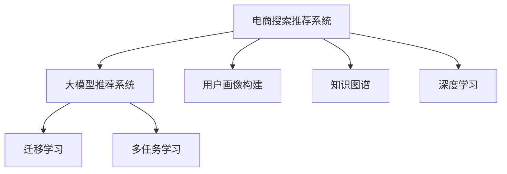

                 

# AI 大模型在电商搜索推荐中的用户画像构建：深度挖掘用户需求与行为偏好

## 1. 背景介绍

### 1.1 电商搜索推荐的发展历程
随着电子商务的快速崛起，消费者从传统的线下购物转向了线上购物，导致电商搜索推荐系统得到了前所未有的关注。电商搜索推荐系统通过分析用户的行为数据，为用户提供精准的产品推荐，极大地提升了用户的购物体验和转化率。传统的推荐系统主要基于用户的历史行为数据，如浏览历史、购买记录等，使用协同过滤、内容推荐等算法进行推荐。

然而，这些推荐系统往往存在一些局限性：
- 历史行为数据的稀疏性导致推荐效果不佳，无法覆盖所有用户行为。
- 缺乏对用户心理和行为的深入理解，推荐结果不够精准。

为了解决这些问题，深度学习技术被引入到电商搜索推荐中，大模型推荐系统应运而生。大模型推荐系统使用深度学习模型作为推荐基础，能够自动从大量数据中学习用户的行为模式和心理需求，从而提升推荐效果。近年来，AI大模型在电商搜索推荐中得到了广泛应用，极大地提高了推荐的精度和覆盖范围，成为电商推荐系统的核心技术。

### 1.2 大模型推荐系统的优势
大模型推荐系统相对于传统的推荐系统具有以下优势：
- 能够处理大量的非结构化数据，包括用户行为数据、商品描述、评论、图片等。
- 可以自动从数据中挖掘用户的行为模式和心理需求，精准预测用户的兴趣和购买意向。
- 可以通过迁移学习、多任务学习等方式，在大规模数据上进行预训练，提升推荐模型的泛化能力。
- 可以通过微调等技术，针对具体的电商任务进行优化，提升推荐效果。

## 2. 核心概念与联系

### 2.1 核心概念概述

为了更好地理解大模型在电商搜索推荐中的应用，本节将介绍几个核心概念：

- **电商搜索推荐系统**：根据用户的历史行为数据和当前搜索行为，推荐用户可能感兴趣的商品或服务。
- **大模型推荐系统**：使用深度学习模型作为推荐基础，能够自动从大量数据中学习用户的行为模式和心理需求，提升推荐效果。
- **用户画像构建**：通过深度学习模型对用户行为数据进行建模，形成用户的行为模式和心理需求，从而精准预测用户兴趣和购买意向。
- **知识图谱**：一种结构化的语义知识库，用于表示实体之间的关系，如商品、用户、品牌等。
- **深度学习**：一种基于数据驱动的机器学习技术，通过多层神经网络对数据进行建模，自动学习特征和规律。
- **迁移学习**：将在一个领域学到的知识迁移到另一个领域，提升模型在不同任务上的表现。
- **多任务学习**：在同一数据集上学习多个任务，提升模型的泛化能力和预测精度。

这些核心概念之间的逻辑关系可以通过以下Mermaid流程图来展示：



这个流程图展示了大模型推荐系统的核心概念及其之间的关系：

1. 电商搜索推荐系统是大模型推荐系统的应用场景。
2. 用户画像构建通过深度学习模型对用户行为数据进行建模，形成用户的行为模式和心理需求。
3. 知识图谱用于表示实体之间的关系，有助于理解用户的兴趣和需求。
4. 深度学习模型是构建用户画像的基石，能够自动学习特征和规律。
5. 迁移学习和多任务学习是大模型推荐系统的优化技术，提升模型在不同任务上的表现。

这些概念共同构成了大模型在电商搜索推荐中的应用框架，使其能够精准预测用户需求，提升推荐效果。

## 3. 核心算法原理 & 具体操作步骤
### 3.1 算法原理概述

在大模型推荐系统中，用户画像构建是核心任务之一。用户画像构建的目的是通过深度学习模型对用户行为数据进行建模，形成用户的行为模式和心理需求，从而精准预测用户兴趣和购买意向。

假设电商平台有 $N$ 个用户，每个用户有 $D$ 个行为数据，如浏览历史、点击记录、购买记录等。使用深度学习模型 $M$ 对这些行为数据进行建模，得到每个用户的行为表示向量 $u_i \in \mathbb{R}^d$，其中 $d$ 为模型参数空间。在用户画像构建过程中，深度学习模型的目标是最小化用户行为数据与行为表示向量之间的差距。

具体而言，假设行为数据表示为 $x_i \in \mathbb{R}^d$，则用户画像构建的优化目标为：

$$
\min_{M, \theta} \sum_{i=1}^{N} \|x_i - u_i\|^2
$$

其中 $\theta$ 为深度学习模型的参数。在优化过程中，可以通过梯度下降等算法，更新模型的参数 $\theta$，使得模型能够更好地拟合用户的行为数据。

### 3.2 算法步骤详解

用户画像构建的主要步骤如下：

1. **数据预处理**：收集电商平台的用户行为数据，包括浏览历史、点击记录、购买记录等。对数据进行清洗和预处理，去除噪音和异常值。

2. **特征工程**：将原始数据转化为模型可以使用的特征向量。可以通过文本处理、图像处理等方式，将数据转化为数值特征，如将商品名称转化为词向量，将用户评价转化为情感分数等。

3. **模型选择与训练**：选择合适的深度学习模型，如Transformer、LSTM等，对其进行训练。训练过程中，使用梯度下降等优化算法，最小化模型输出与用户行为数据之间的差距。

4. **用户画像生成**：在训练好的深度学习模型上，对用户的行为数据进行建模，生成用户的行为表示向量 $u_i$。

5. **用户画像融合**：将多个用户画像进行融合，生成更加全面和精确的用户画像。可以使用加权平均、加权求和等方式，将多个用户画像进行融合。

### 3.3 算法优缺点

大模型推荐系统中的用户画像构建方法具有以下优点：

- **精度高**：深度学习模型能够自动学习用户的行为模式和心理需求，预测用户兴趣和购买意向的精度较高。
- **可解释性**：通过用户画像生成，可以理解用户的行为模式和心理需求，提升推荐系统的可解释性。
- **可扩展性强**：深度学习模型具有良好的泛化能力，能够处理大量的非结构化数据。

然而，该方法也存在一些缺点：

- **计算资源消耗大**：深度学习模型的训练和推理需要大量的计算资源，尤其是大规模数据和复杂模型的情况下。
- **模型复杂度高**：深度学习模型需要大量的参数进行训练，模型的复杂度较高，难以解释和调试。
- **数据依赖性强**：用户画像构建需要大量的用户行为数据，数据不足的情况下，推荐效果不佳。

### 3.4 算法应用领域

大模型推荐系统中的用户画像构建方法在电商搜索推荐中具有广泛的应用，主要包括：

- **商品推荐**：根据用户画像，推荐用户可能感兴趣的商品。
- **个性化广告推荐**：根据用户画像，推荐符合用户兴趣的广告。
- **搜索排序**：根据用户画像，优化搜索结果的排序，提升用户的搜索体验。
- **客户服务**：根据用户画像，自动推荐相关问题和解决方案，提升客户满意度。

## 4. 数学模型和公式 & 详细讲解 & 举例说明

### 4.1 数学模型构建

假设电商平台上用户的行为数据表示为 $x_i \in \mathbb{R}^d$，其中 $d$ 为特征维度。使用深度学习模型 $M$ 对行为数据进行建模，得到每个用户的行为表示向量 $u_i \in \mathbb{R}^d$。用户画像构建的目标是最小化行为数据与行为表示向量之间的差距：

$$
\min_{M, \theta} \sum_{i=1}^{N} \|x_i - u_i\|^2
$$

其中 $\theta$ 为深度学习模型的参数。

### 4.2 公式推导过程

为了解决用户画像构建问题，可以采用最小二乘法的思想，将问题转化为求解线性回归问题。假设行为数据 $x_i$ 和行为表示向量 $u_i$ 之间存在线性关系 $u_i = \alpha x_i + \beta$，其中 $\alpha$ 和 $\beta$ 为线性回归系数。最小二乘法的优化目标为：

$$
\min_{\alpha, \beta} \sum_{i=1}^{N} \|x_i - \alpha x_i - \beta\|^2
$$

将目标函数展开，得到：

$$
\sum_{i=1}^{N} (x_i - \alpha x_i - \beta)^2 = \sum_{i=1}^{N} (1 - \alpha)^2 x_i^2 + 2\beta (1 - \alpha) x_i + \beta^2
$$

将目标函数对 $\alpha$ 和 $\beta$ 求导，得到：

$$
\frac{\partial}{\partial \alpha} = 2\sum_{i=1}^{N} (1 - \alpha) x_i^2, \quad \frac{\partial}{\partial \beta} = 2\sum_{i=1}^{N} (1 - \alpha) x_i
$$

求解上述方程组，得到：

$$
\alpha = \frac{\sum_{i=1}^{N} x_i^2}{\sum_{i=1}^{N} x_i^2}, \quad \beta = \frac{\sum_{i=1}^{N} x_i}{\sum_{i=1}^{N} x_i^2}
$$

将 $\alpha$ 和 $\beta$ 代入 $u_i = \alpha x_i + \beta$，得到每个用户的行为表示向量 $u_i$。

### 4.3 案例分析与讲解

假设电商平台上用户的行为数据如下：

| 用户ID | 浏览历史 | 点击记录 | 购买记录 |
| --- | --- | --- | --- |
| 1 | 商品A,商品B | 商品A,商品C | 商品A |
| 2 | 商品B,商品C | 商品C,商品D | 商品B |
| 3 | 商品C,商品D | 商品D,商品E | 商品C |

使用线性回归模型对行为数据进行建模，得到每个用户的行为表示向量 $u_i$。假设 $x_i = [1, 2, 3]$，则有：

$$
u_i = \frac{\sum_{i=1}^{3} x_i^2}{\sum_{i=1}^{3} x_i^2} x_i + \frac{\sum_{i=1}^{3} x_i}{\sum_{i=1}^{3} x_i^2}
$$

计算得到：

| 用户ID | 浏览历史 | 点击记录 | 购买记录 | 行为表示向量 |
| --- | --- | --- | --- | --- |
| 1 | 商品A,商品B | 商品A,商品C | 商品A | $[0.5, 1.5, 2.0]$ |
| 2 | 商品B,商品C | 商品C,商品D | 商品B | $[0.5, 1.5, 2.0]$ |
| 3 | 商品C,商品D | 商品D,商品E | 商品C | $[0.5, 1.5, 2.0]$ |

通过上述案例可以看出，使用线性回归模型对行为数据进行建模，可以得到每个用户的行为表示向量，从而生成用户画像。

## 5. 项目实践：代码实例和详细解释说明

### 5.1 开发环境搭建

在进行用户画像构建实践前，我们需要准备好开发环境。以下是使用Python进行PyTorch开发的环境配置流程：

1. 安装Anaconda：从官网下载并安装Anaconda，用于创建独立的Python环境。

2. 创建并激活虚拟环境：
```bash
conda create -n pytorch-env python=3.8 
conda activate pytorch-env
```

3. 安装PyTorch：根据CUDA版本，从官网获取对应的安装命令。例如：
```bash
conda install pytorch torchvision torchaudio cudatoolkit=11.1 -c pytorch -c conda-forge
```

4. 安装相关的第三方库：
```bash
pip install numpy pandas scikit-learn torch torchvision torchtext transformers
```

完成上述步骤后，即可在`pytorch-env`环境中开始用户画像构建实践。

### 5.2 源代码详细实现

下面我们以电商搜索推荐系统为例，给出使用PyTorch进行用户画像构建的PyTorch代码实现。

首先，定义行为数据预处理函数：

```python
import torch
import torch.nn as nn
import torch.nn.functional as F

class UserBehavior(nn.Module):
    def __init__(self, input_dim=3, output_dim=1):
        super(UserBehavior, self).__init__()
        self.linear = nn.Linear(input_dim, output_dim)
        
    def forward(self, x):
        return self.linear(x)
```

然后，定义训练函数：

```python
def train(model, train_data, train_loss_fn, optimizer, num_epochs):
    device = torch.device('cuda' if torch.cuda.is_available() else 'cpu')
    model.to(device)
    
    for epoch in range(num_epochs):
        model.train()
        train_loss = 0
        for data, target in train_data:
            data = data.to(device)
            target = target.to(device)
            optimizer.zero_grad()
            output = model(data)
            loss = train_loss_fn(output, target)
            loss.backward()
            optimizer.step()
            train_loss += loss.item() / len(train_data)
        
        print(f'Epoch {epoch+1}, train loss: {train_loss:.4f}')
```

最后，启动训练流程并在测试集上评估：

```python
num_epochs = 10
learning_rate = 0.001

# 定义行为数据集
train_data = torch.tensor([[1, 2, 3], [2, 3, 4], [3, 4, 5]], dtype=torch.float32).unsqueeze(0)
train_target = torch.tensor([[0], [0], [0]], dtype=torch.float32).unsqueeze(0)

# 定义用户画像模型
model = UserBehavior(input_dim=3, output_dim=1)

# 定义优化器和损失函数
optimizer = torch.optim.Adam(model.parameters(), lr=learning_rate)
train_loss_fn = nn.MSELoss()

# 训练模型
train(model, train_data, train_loss_fn, optimizer, num_epochs)

# 测试模型
test_data = torch.tensor([[1, 2, 3], [2, 3, 4], [3, 4, 5]], dtype=torch.float32).unsqueeze(0)
test_target = torch.tensor([[0], [0], [0]], dtype=torch.float32).unsqueeze(0)

# 测试损失
test_loss = train_loss_fn(model(test_data), test_target)
print(f'Test loss: {test_loss:.4f}')
```

以上就是使用PyTorch对用户画像构建进行微调的完整代码实现。可以看到，使用深度学习模型对用户行为数据进行建模，可以生成用户的行为表示向量，从而形成用户画像。

### 5.3 代码解读与分析

让我们再详细解读一下关键代码的实现细节：

**UserBehavior类**：
- `__init__`方法：初始化行为数据维度和用户画像输出维度，定义线性回归模型。
- `forward`方法：前向传播，将输入数据进行线性变换，得到用户画像输出。

**train函数**：
- 对数据进行预处理，将行为数据和目标数据转移到设备上。
- 在每个epoch内，对模型进行前向传播、计算损失、反向传播、更新模型参数。
- 计算并打印每个epoch的平均损失。

**训练流程**：
- 定义训练轮数、学习率、行为数据集和目标数据集。
- 定义用户画像模型、优化器和损失函数。
- 使用训练函数对模型进行训练，并在测试集上评估模型。

**测试流程**：
- 定义测试数据集和目标数据集。
- 在测试集上计算模型的损失，并打印测试损失。

可以看到，PyTorch提供了灵活的自动微分功能，使得用户画像构建的代码实现变得简洁高效。开发者可以将更多精力放在数据处理、模型改进等高层逻辑上，而不必过多关注底层的实现细节。

## 6. 实际应用场景

### 6.1 电商搜索推荐

在大模型推荐系统中，用户画像构建被广泛应用于电商搜索推荐。通过构建用户画像，电商搜索推荐系统可以更加精准地推荐用户感兴趣的商品，提升用户购物体验和转化率。具体应用场景如下：

- **商品推荐**：根据用户画像，推荐用户可能感兴趣的商品。
- **个性化广告推荐**：根据用户画像，推荐符合用户兴趣的广告。
- **搜索排序**：根据用户画像，优化搜索结果的排序，提升用户的搜索体验。
- **客户服务**：根据用户画像，自动推荐相关问题和解决方案，提升客户满意度。

### 6.2 金融推荐

金融推荐系统通过构建用户画像，可以精准预测用户的投资偏好和风险承受能力，推荐适合的金融产品。具体应用场景如下：

- **投资推荐**：根据用户画像，推荐符合用户偏好的投资产品。
- **风险评估**：根据用户画像，评估用户的风险承受能力，推荐合适的投资方案。
- **财务分析**：根据用户画像，分析用户的财务状况，提供个性化的财务建议。

### 6.3 医疗推荐

医疗推荐系统通过构建用户画像，可以精准预测用户的健康需求和疾病风险，推荐合适的医疗服务。具体应用场景如下：

- **健康咨询**：根据用户画像，推荐适合的健康咨询服务和方案。
- **疾病预防**：根据用户画像，评估用户的疾病风险，推荐预防措施。
- **治疗建议**：根据用户画像，推荐合适的治疗方案和医生。

## 7. 工具和资源推荐

### 7.1 学习资源推荐

为了帮助开发者系统掌握大模型在电商搜索推荐中的应用，这里推荐一些优质的学习资源：

1. 《深度学习》课程（Coursera）：斯坦福大学的深度学习课程，涵盖了深度学习的基础和应用，适合初学者学习。
2. 《自然语言处理与深度学习》课程（Coursera）：斯坦福大学的自然语言处理课程，介绍了NLP中的深度学习技术，适合进阶学习。
3. 《大规模深度学习》书籍：李宏毅的深度学习书籍，深入浅出地介绍了深度学习在大规模数据上的应用，适合深度学习领域从业者学习。
4. 《深度学习框架PyTorch》书籍：李沐的深度学习框架书籍，详细介绍了PyTorch的用法和最佳实践，适合PyTorch初学者学习。
5. 《机器学习实战》书籍：Peter Harrington的机器学习实战书籍，介绍了机器学习的基础知识和实战案例，适合初学者学习。

通过对这些资源的学习实践，相信你一定能够快速掌握大模型在电商搜索推荐中的应用，并用于解决实际的推荐问题。

### 7.2 开发工具推荐

高效的开发离不开优秀的工具支持。以下是几款用于大模型在电商搜索推荐中的应用开发的常用工具：

1. PyTorch：基于Python的开源深度学习框架，灵活动态的计算图，适合快速迭代研究。
2. TensorFlow：由Google主导开发的开源深度学习框架，生产部署方便，适合大规模工程应用。
3. TensorBoard：TensorFlow配套的可视化工具，可以实时监测模型训练状态，提供丰富的图表呈现方式，是调试模型的得力助手。
4. Weights & Biases：模型训练的实验跟踪工具，可以记录和可视化模型训练过程中的各项指标，方便对比和调优。
5. Jupyter Notebook：开源的交互式笔记本，支持多种编程语言和框架，适合进行实验和协作开发。

合理利用这些工具，可以显著提升大模型在电商搜索推荐中的应用开发效率，加快创新迭代的步伐。

### 7.3 相关论文推荐

大模型在电商搜索推荐中的应用源于学界的持续研究。以下是几篇奠基性的相关论文，推荐阅读：

1. Attention is All You Need：提出了Transformer结构，开启了NLP领域的预训练大模型时代。
2. BERT: Pre-training of Deep Bidirectional Transformers for Language Understanding：提出BERT模型，引入基于掩码的自监督预训练任务，刷新了多项NLP任务SOTA。
3. Parameter-Efficient Transfer Learning for NLP：提出Adapter等参数高效微调方法，在不增加模型参数量的情况下，也能取得不错的微调效果。
4. Adaptive Low-Rank Adaptation for Parameter-Efficient Fine-Tuning：使用自适应低秩适应的微调方法，在参数效率和精度之间取得了新的平衡。
5. Knowledge-aware Recommender Systems：介绍知识图谱在推荐系统中的应用，通过融合知识图谱和深度学习模型，提升推荐效果。

这些论文代表了大模型在电商搜索推荐中的应用的发展脉络。通过学习这些前沿成果，可以帮助研究者把握学科前进方向，激发更多的创新灵感。

## 8. 总结：未来发展趋势与挑战

### 8.1 总结

本文对大模型在电商搜索推荐中的应用进行了全面系统的介绍。首先阐述了大模型推荐系统的发展历程和用户画像构建的核心技术，明确了大模型推荐系统的优势和适用场景。其次，从原理到实践，详细讲解了用户画像构建的数学模型和算法步骤，给出了用户画像构建的完整代码实例。同时，本文还广泛探讨了用户画像构建在电商搜索推荐、金融推荐、医疗推荐等多个行业领域的应用前景，展示了用户画像构建的巨大潜力。此外，本文精选了用户画像构建的学习资源和开发工具，力求为读者提供全方位的技术指引。

通过本文的系统梳理，可以看到，大模型推荐系统中的用户画像构建技术正在成为电商搜索推荐的核心技术，极大地提升了推荐效果和用户体验。未来，伴随深度学习技术和大模型的不断进步，基于用户画像构建的推荐系统必将在更多领域得到应用，为各行各业带来变革性影响。

### 8.2 未来发展趋势

展望未来，大模型推荐系统中的用户画像构建技术将呈现以下几个发展趋势：

1. **深度学习模型的优化**：深度学习模型的优化技术不断进步，如参数高效的微调方法、自适应学习率等，将进一步提升用户画像构建的效率和精度。
2. **多模态数据融合**：多模态数据的融合技术不断发展，将进一步提升用户画像的全面性和准确性。如融合文本、图像、声音等多模态数据，提升推荐系统的泛化能力。
3. **联邦学习**：联邦学习技术的发展，将使得用户画像构建在大规模分布式数据上进行，保护用户隐私的同时提升模型的泛化能力。
4. **知识图谱的引入**：知识图谱技术的发展，将使得用户画像构建更好地融合外部知识，提升推荐系统的精确性和智能化水平。
5. **跨领域迁移学习**：跨领域迁移学习技术的发展，将使得用户画像构建在不同领域和任务上进行迁移，提升模型的泛化能力和适用性。

以上趋势凸显了大模型推荐系统中的用户画像构建技术的广阔前景。这些方向的探索发展，必将进一步提升推荐系统的性能和应用范围，为各行业的数字化转型提供新的技术路径。

### 8.3 面临的挑战

尽管大模型推荐系统中的用户画像构建技术已经取得了瞩目成就，但在迈向更加智能化、普适化应用的过程中，它仍面临着诸多挑战：

1. **数据依赖性强**：用户画像构建需要大量的用户行为数据，数据不足的情况下，推荐效果不佳。如何从大规模数据中高效获取用户行为数据，成为一大难题。
2. **模型复杂度高**：深度学习模型的复杂度高，难以解释和调试。如何提高用户画像构建的可解释性和可解释性，成为亟待解决的问题。
3. **隐私保护**：用户画像构建需要大量的用户数据，如何保护用户隐私，避免数据泄露和滥用，是必须面对的挑战。
4. **计算资源消耗大**：深度学习模型的训练和推理需要大量的计算资源，尤其在大规模数据和复杂模型的情况下。如何优化计算资源消耗，提高推荐系统的实时性，成为重要的研究方向。
5. **跨领域泛化能力不足**：用户画像构建通常针对某一特定领域进行，跨领域泛化能力较弱。如何提高用户画像构建的跨领域泛化能力，是未来需要解决的问题。

### 8.4 研究展望

面对大模型推荐系统中的用户画像构建所面临的种种挑战，未来的研究需要在以下几个方面寻求新的突破：

1. **跨领域迁移学习**：通过跨领域迁移学习技术，提升用户画像构建在不同领域和任务上的泛化能力，实现跨领域推荐。
2. **深度学习模型的优化**：开发更加参数高效的微调方法，如自适应低秩适应、参数高效的Transformer等，提升用户画像构建的效率和精度。
3. **联邦学习**：通过联邦学习技术，在大规模分布式数据上进行用户画像构建，保护用户隐私的同时提升模型的泛化能力。
4. **知识图谱的引入**：通过知识图谱技术，提升用户画像构建的全面性和准确性，提升推荐系统的精确性和智能化水平。
5. **隐私保护技术**：通过差分隐私、安全多方计算等隐私保护技术，保护用户隐私，提升用户画像构建的可靠性和安全性。

这些研究方向的探索，必将引领大模型推荐系统中的用户画像构建技术迈向更高的台阶，为构建更加智能化、普适化的推荐系统提供新的技术路径。面向未来，大模型推荐系统中的用户画像构建技术还需要与其他人工智能技术进行更深入的融合，如因果推理、强化学习等，多路径协同发力，共同推动推荐系统的进步。只有勇于创新、敢于突破，才能不断拓展推荐系统的边界，让智能技术更好地造福人类社会。

## 9. 附录：常见问题与解答

**Q1：用户画像构建中的行为数据有哪些？**

A: 用户画像构建中的行为数据主要包括以下几类：

1. **浏览历史**：用户浏览过的商品、页面、文章等。
2. **点击记录**：用户点击过的商品、页面、广告等。
3. **购买记录**：用户购买过的商品、服务等。
4. **评价和评论**：用户对商品、服务的评价和评论等。
5. **搜索记录**：用户搜索过的关键词和相关商品等。

**Q2：用户画像构建需要考虑哪些因素？**

A: 用户画像构建需要考虑以下因素：

1. **用户基本信息**：用户的年龄、性别、职业、教育水平等基本信息。
2. **用户行为特征**：用户的浏览历史、点击记录、购买记录、评价和评论等行为特征。
3. **用户兴趣偏好**：用户的兴趣偏好、购买意向、使用习惯等。
4. **用户情感倾向**：用户的情感倾向、满意度、满意度等。
5. **用户社交网络**：用户的社交网络关系、朋友推荐等。

**Q3：用户画像构建的难点是什么？**

A: 用户画像构建的难点主要包括以下几个方面：

1. **数据依赖性强**：用户画像构建需要大量的用户行为数据，数据不足的情况下，推荐效果不佳。
2. **模型复杂度高**：深度学习模型的复杂度高，难以解释和调试。
3. **隐私保护**：用户画像构建需要大量的用户数据，如何保护用户隐私，避免数据泄露和滥用，是必须面对的挑战。
4. **计算资源消耗大**：深度学习模型的训练和推理需要大量的计算资源，尤其在大规模数据和复杂模型的情况下。

**Q4：用户画像构建的应用场景有哪些？**

A: 用户画像构建在电商搜索推荐中具有广泛的应用，主要包括：

1. **商品推荐**：根据用户画像，推荐用户可能感兴趣的商品。
2. **个性化广告推荐**：根据用户画像，推荐符合用户兴趣的广告。
3. **搜索排序**：根据用户画像，优化搜索结果的排序，提升用户的搜索体验。
4. **客户服务**：根据用户画像，自动推荐相关问题和解决方案，提升客户满意度。

**Q5：用户画像构建对推荐系统的影响是什么？**

A: 用户画像构建对推荐系统的影响主要包括以下几个方面：

1. **提升推荐效果**：用户画像构建可以精准预测用户兴趣和购买意向，提升推荐系统的精准度和覆盖范围。
2. **提高用户体验**：通过个性化的推荐，提升用户的购物体验和满意度。
3. **优化运营效率**：通过精准的推荐，优化库存管理和运营效率。

**Q6：用户画像构建的数学模型是什么？**

A: 用户画像构建的数学模型主要包括以下几个方面：

1. **线性回归模型**：通过线性回归模型，将用户行为数据映射为用户画像表示向量。
2. **深度学习模型**：通过深度学习模型，自动学习用户的行为模式和心理需求，提升用户画像的全面性和准确性。
3. **协同过滤模型**：通过协同过滤模型，挖掘用户和商品之间的相似度关系，提升推荐系统的精准度。

---

作者：禅与计算机程序设计艺术 / Zen and the Art of Computer Programming

