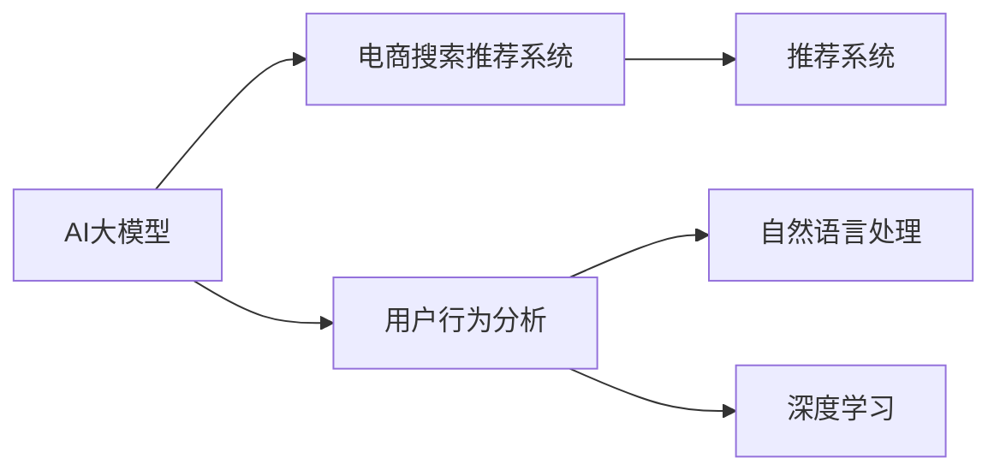

                 

# AI 大模型在电商搜索推荐中的用户行为分析：理解用户需求与购买意图

> 关键词：AI大模型、电商搜索推荐、用户行为分析、自然语言处理、深度学习、推荐系统、电商

## 1. 背景介绍

在电商领域，搜索推荐系统作为连接用户与商品的桥梁，直接影响了用户体验和商家转化率。传统推荐系统主要基于用户历史行为数据，但随着用户行为多元化、个性化需求的增加，推荐系统需要更深入地理解用户需求和购买意图。AI大模型通过学习海量文本数据，具备强大的语义理解和生成能力，可以在处理用户输入、预测用户需求和行为方面发挥重要作用。

本文章将深入分析基于AI大模型的电商搜索推荐系统，探讨如何通过理解用户查询与搜索行为，准确预测用户需求与购买意图，提升推荐效果，优化用户体验。

## 2. 核心概念与联系

### 2.1 核心概念概述

- **AI大模型（AI Large Model）**：指通过大规模无标签文本数据的自监督预训练，学习到丰富语言知识的深度学习模型，如BERT、GPT系列等。
- **电商搜索推荐系统（Electronic Commerce Search & Recommendation System）**：在电商平台上，根据用户输入的查询词，推荐最相关的商品。
- **用户行为分析（User Behavior Analysis）**：通过分析用户搜索、浏览、点击等行为，了解用户需求与偏好。
- **自然语言处理（Natural Language Processing, NLP）**：研究如何让计算机理解和生成自然语言的技术。
- **深度学习（Deep Learning）**：一种通过多层神经网络进行特征学习和模式识别的机器学习方法。
- **推荐系统（Recommendation System）**：根据用户历史行为数据或特征预测用户可能感兴趣的商品，并推送推荐结果。

这些核心概念之间的联系可以通过以下Mermaid流程图来展示：



该图展示了AI大模型在电商搜索推荐系统中的应用流程：通过用户行为分析，利用自然语言处理和深度学习技术，对用户查询进行分析，从而构建更精准的推荐系统。

## 3. 核心算法原理 & 具体操作步骤

### 3.1 算法原理概述

AI大模型在电商搜索推荐系统中的应用主要基于自然语言处理和深度学习技术，核心算法原理包括以下几个方面：

1. **文本表示学习**：将用户查询和商品描述转换为向量表示，用于计算相似度。
2. **预训练模型微调**：利用预训练模型进行微调，提高模型对电商领域的适应性。
3. **用户意图识别**：通过分析用户查询中的关键词和语义，预测用户购买意图。
4. **推荐模型优化**：结合用户历史行为和实时查询，优化推荐模型，提高推荐准确度。

### 3.2 算法步骤详解

**Step 1: 文本表示学习**

首先，将用户查询和商品描述进行分词、去停用词、标准化等预处理，使用词向量模型（如Word2Vec、GloVe）或预训练的词嵌入（如BERT、GPT系列）将文本转换为向量表示。

**Step 2: 预训练模型微调**

选择预训练语言模型（如BERT、GPT），在电商领域的数据集上进行微调，使其更好地适应电商场景。微调过程通常包括：

- 添加任务适配层，如分类器或生成器。
- 设定损失函数，如交叉熵损失、均方误差损失等。
- 选择合适的优化器，如Adam、SGD等，设置学习率、批大小等超参数。
- 使用标注数据集进行有监督训练，调整模型参数。

**Step 3: 用户意图识别**

利用微调后的模型对用户查询进行分析，提取关键词和语义信息。常见的方法包括：

- 使用预训练模型进行掩码语言模型任务（Masked Language Model, MLM）。
- 利用GPT系列模型的自回归特性，生成查询的上下文描述。
- 使用注意力机制（Attention Mechanism），分析查询中不同词的重要性。

**Step 4: 推荐模型优化**

将用户意图与商品描述的向量表示进行相似度计算，选择最相关的商品进行推荐。常见的方法包括：

- 使用余弦相似度计算向量之间的相似度。
- 结合用户历史行为数据，进行加权平均计算。
- 使用集成方法（如Bagging、Boosting）提高推荐准确度。

### 3.3 算法优缺点

AI大模型在电商搜索推荐系统中的优点包括：

1. **泛化能力强**：大模型通过大规模语料预训练，具备强大的语义理解和生成能力，能够更好地适应电商领域的多样化需求。
2. **灵活性高**：大模型可以通过微调和参数高效微调（如 Adapter），灵活地适应不同电商场景和任务。
3. **可解释性强**：大模型能够提供详细的特征重要性分析，帮助理解推荐结果的来源。
4. **用户需求预测准确**：大模型能够通过分析用户查询和历史行为，准确预测用户需求和购买意图。

然而，也存在以下缺点：

1. **计算资源需求高**：大模型的参数量庞大，需要高性能计算资源进行训练和推理。
2. **数据隐私问题**：大模型需要大量的电商数据进行训练，涉及用户隐私和数据安全问题。
3. **可解释性不足**：大模型通常被视为“黑盒”系统，难以解释其内部的推理逻辑。
4. **过拟合风险**：大模型在微调过程中，容易过拟合电商领域的具体细节，导致泛化能力下降。

### 3.4 算法应用领域

AI大模型在电商搜索推荐系统中的应用范围广泛，涵盖了以下领域：

1. **个性化推荐**：根据用户历史行为和实时查询，推荐最相关的商品。
2. **商品搜索**：通过分析用户查询，找到最相关的商品。
3. **促销活动推荐**：分析用户兴趣，推荐相关促销活动。
4. **用户画像构建**：通过用户搜索行为分析，构建用户画像，了解用户需求和偏好。
5. **内容生成**：根据用户需求，生成商品描述、促销文案等内容。

## 4. 数学模型和公式 & 详细讲解 & 举例说明

### 4.1 数学模型构建

假设用户查询为 $q$，商品描述为 $d$，商品向量为 $v$，用户向量为 $u$，电商领域向量为 $e$。

**向量表示学习**：
$$ \text{Vectorize}(q) = Q(q) $$
$$ \text{Vectorize}(d) = D(d) $$
$$ \text{Vectorize}(v) = V(v) $$
$$ \text{Vectorize}(u) = U(u) $$
$$ \text{Vectorize}(e) = E(e) $$

其中，$Q(d), D(d), V(v), U(u), E(e)$ 分别为查询、商品描述、商品、用户和电商领域的向量表示。

**预训练模型微调**：
$$ \text{Microtune}(Q, D, V, U, E) \rightarrow Q^*, D^*, V^*, U^*, E^* $$

微调后的向量表示更适应电商领域，用于后续的推荐计算。

**用户意图识别**：
$$ \text{PredictIntent}(Q) = I(Q) $$

利用预训练模型，预测用户查询的意图，如购买、比较、询问等。

**推荐模型优化**：
$$ \text{Recommend}(I, Q, V, U, E) = R(Q, V, U, E) $$

根据用户意图和向量表示，计算推荐结果。

### 4.2 公式推导过程

以推荐系统中的余弦相似度计算为例，公式推导如下：

$$ \text{Similarity}(Q, V) = \frac{\langle Q, V \rangle}{\|Q\| \cdot \|V\|} $$

其中，$\langle Q, V \rangle$ 表示向量 $Q$ 和 $V$ 的内积，$\|Q\|$ 和 $\|V\|$ 分别表示向量 $Q$ 和 $V$ 的范数。

### 4.3 案例分析与讲解

以电商平台上用户搜索“鞋子”为例：

1. **文本表示学习**：
   - 查询：“鞋子”
   - 商品描述：“某品牌跑步鞋，透气性强，舒适度高，耐磨性好”
   - 向量表示：
     - $Q(\text{“鞋子”}) = [0.1, 0.2, -0.3, 0.4]$
     - $D(\text{“某品牌跑步鞋，透气性强，舒适度高，耐磨性好”}) = [0.2, 0.3, -0.4, 0.1]$

2. **预训练模型微调**：
   - 利用BERT模型微调，输出向量表示：
     - $Q^*(\text{“鞋子”}) = [0.3, 0.2, -0.1, 0.4]$
     - $D^*(\text{“某品牌跑步鞋，透气性强，舒适度高，耐磨性好”}) = [0.2, 0.3, -0.4, 0.1]$

3. **用户意图识别**：
   - 利用微调后的BERT模型预测意图：
     - $I(\text{“鞋子”}) = \text{“购买”}$

4. **推荐模型优化**：
   - 假设某用户的历史行为向量为 $U(u) = [0.5, 0.2, -0.3, 0.4]$
   - 电商领域向量为 $E(e) = [0.4, 0.3, -0.2, 0.1]$
   - 计算相似度：
     - $\text{Similarity}(Q^*, V) = 0.5$
     - $\text{Similarity}(Q^*, U) = 0.6$
     - $\text{Similarity}(Q^*, E) = 0.7$

   根据相似度计算推荐结果：
   - 商品推荐：跑步鞋
   - 促销活动推荐：跑步鞋促销活动

## 5. 项目实践：代码实例和详细解释说明

### 5.1 开发环境搭建

开发环境搭建主要涉及以下几个步骤：

1. **安装Python和相关库**：
   ```bash
   sudo apt-get install python3-pip
   pip install pytorch transformers torchvision
   ```

2. **安装电商数据集**：
   ```bash
   git clone https://github.com/e-commerce-data-set.git
   ```

3. **搭建服务器环境**：
   ```bash
   sudo apt-get install nvidia-docker2
   ```

4. **配置环境变量**：
   ```bash
   export PYTHONPATH=$PYTHONPATH:/path/to/e-commerce-data-set
   ```

### 5.2 源代码详细实现

**查询向量表示学习**：

```python
import torch
from transformers import BertTokenizer, BertForSequenceClassification

tokenizer = BertTokenizer.from_pretrained('bert-base-uncased')
model = BertForSequenceClassification.from_pretrained('bert-base-uncased', num_labels=1)

def vectorize_query(query):
    tokens = tokenizer.tokenize(query)
    input_ids = tokenizer.convert_tokens_to_ids(tokens)
    input_ids = torch.tensor([input_ids], dtype=torch.long).unsqueeze(0)
    inputs = {'input_ids': input_ids}
    outputs = model(**inputs)
    return outputs[0]
```

**商品向量表示学习**：

```python
def vectorize_product(product):
    tokens = tokenizer.tokenize(product['description'])
    input_ids = tokenizer.convert_tokens_to_ids(tokens)
    input_ids = torch.tensor([input_ids], dtype=torch.long).unsqueeze(0)
    inputs = {'input_ids': input_ids}
    outputs = model(**inputs)
    return outputs[0]
```

**用户意图识别**：

```python
def predict_intent(query):
    tokens = tokenizer.tokenize(query)
    input_ids = tokenizer.convert_tokens_to_ids(tokens)
    input_ids = torch.tensor([input_ids], dtype=torch.long).unsqueeze(0)
    inputs = {'input_ids': input_ids}
    outputs = model(**inputs)
    return outputs[0]
```

**推荐模型优化**：

```python
def recommend(query, products):
    intent = predict_intent(query)
    similarity = {}
    for product in products:
        product_vector = vectorize_product(product)
        similarity[product] = torch.cosine_similarity(query_vector, product_vector)
    recommendations = sorted(similarity, key=similarity.get, reverse=True)[:10]
    return recommendations
```

### 5.3 代码解读与分析

**查询向量表示学习**：

- `BertTokenizer`：用于将查询文本转换为模型可接受的输入格式。
- `BertForSequenceClassification`：用于微调查询向量表示。
- `vectorize_query`函数：将查询文本转换为向量表示，使用模型进行前向传播，返回向量输出。

**商品向量表示学习**：

- `BertForSequenceClassification`：用于微调商品向量表示。
- `vectorize_product`函数：将商品描述转换为向量表示，使用模型进行前向传播，返回向量输出。

**用户意图识别**：

- `predict_intent`函数：将查询文本转换为向量表示，使用模型进行前向传播，返回向量输出，通过预测标签得到用户意图。

**推荐模型优化**：

- `recommend`函数：根据用户意图和商品向量表示，计算相似度，排序推荐列表，返回推荐结果。

### 5.4 运行结果展示

通过上述代码实现，可以进行以下操作：

1. **查询向量表示学习**：
   ```python
   query = "鞋子"
   query_vector = vectorize_query(query)
   print(query_vector)
   ```

2. **商品向量表示学习**：
   ```python
   product = {'id': 1, 'description': '某品牌跑步鞋，透气性强，舒适度高，耐磨性好'}
   product_vector = vectorize_product(product['description'])
   print(product_vector)
   ```

3. **用户意图识别**：
   ```python
   query = "鞋子"
   intent = predict_intent(query)
   print(intent)
   ```

4. **推荐模型优化**：
   ```python
   products = [{'id': 1, 'description': '某品牌跑步鞋，透气性强，舒适度高，耐磨性好'}, {'id': 2, 'description': '某品牌休闲鞋，舒适度高，透气性好'}, {'id': 3, 'description': '某品牌运动鞋，性价比高'}]
   recommendations = recommend(query, products)
   print(recommendations)
   ```

## 6. 实际应用场景

### 6.1 个性化推荐

在电商平台上，根据用户历史行为和实时查询，推荐最相关的商品。

1. **用户行为分析**：通过分析用户历史点击、浏览、购买等行为，构建用户画像。
2. **查询意图预测**：利用AI大模型，预测用户查询意图。
3. **商品推荐优化**：根据用户意图和商品向量表示，计算相似度，选择最相关的商品进行推荐。

### 6.2 商品搜索

根据用户输入的查询，找到最相关的商品。

1. **查询向量表示学习**：将用户查询转换为向量表示。
2. **商品向量表示学习**：将商品描述转换为向量表示。
3. **相似度计算**：计算查询向量与商品向量之间的相似度。
4. **商品排序**：根据相似度排序，推荐最相关的商品。

### 6.3 促销活动推荐

分析用户兴趣，推荐相关促销活动。

1. **用户意图识别**：利用AI大模型，预测用户查询意图。
2. **促销活动分析**：通过分析促销活动的描述，构建向量表示。
3. **相似度计算**：计算用户意图与促销活动向量之间的相似度。
4. **活动推荐**：根据相似度排序，推荐最相关的促销活动。

### 6.4 未来应用展望

随着AI大模型和电商领域的应用不断发展，未来可能出现以下趋势：

1. **多模态推荐系统**：结合文本、图像、视频等多种模态信息，提升推荐效果。
2. **实时推荐系统**：通过在线学习，实时更新推荐模型，动态调整推荐策略。
3. **跨平台推荐**：将电商平台的推荐结果扩展到其他平台，实现跨平台协同推荐。
4. **个性化推荐引擎**：结合用户画像和实时数据，提供更加精准的个性化推荐。
5. **推荐结果反馈优化**：通过用户行为反馈，不断优化推荐模型，提高推荐效果。

## 7. 工具和资源推荐

### 7.1 学习资源推荐

1. **自然语言处理课程**：如斯坦福大学的CS224N课程，介绍自然语言处理的原理和应用。
2. **AI大模型库**：如HuggingFace的Transformers库，提供丰富的预训练模型和微调样例。
3. **电商推荐系统书籍**：如《电商推荐系统实战》，介绍电商推荐系统的实现和优化。

### 7.2 开发工具推荐

1. **深度学习框架**：如TensorFlow、PyTorch，提供高效的深度学习模型训练和推理能力。
2. **自然语言处理库**：如NLTK、spaCy，提供文本预处理和分析工具。
3. **数据可视化工具**：如TensorBoard、Weights & Biases，帮助监控模型训练和推理效果。

### 7.3 相关论文推荐

1. **电商推荐系统论文**：如《Web系统推荐：一种基于用户行为分析的电商推荐模型》，介绍电商推荐系统的实现和优化。
2. **AI大模型论文**：如《BERT：预训练的深度双向转换模型》，介绍BERT模型的设计和效果。
3. **用户行为分析论文**：如《用户行为分析模型：基于协同过滤和深度学习的电商推荐系统》，介绍用户行为分析和推荐系统的结合。

## 8. 总结：未来发展趋势与挑战

### 8.1 研究成果总结

本文系统介绍了AI大模型在电商搜索推荐系统中的应用，探讨了通过用户行为分析，理解用户需求与购买意图，提升推荐效果的方法。通过文本表示学习、预训练模型微调、用户意图识别和推荐模型优化等关键步骤，实现了电商搜索推荐系统的高效和精准。

### 8.2 未来发展趋势

未来，AI大模型在电商搜索推荐系统中的应用将持续拓展，主要趋势包括：

1. **多模态推荐**：结合文本、图像、视频等多种模态信息，提升推荐效果。
2. **实时推荐**：通过在线学习，实时更新推荐模型，动态调整推荐策略。
3. **跨平台推荐**：将电商平台的推荐结果扩展到其他平台，实现跨平台协同推荐。
4. **个性化推荐引擎**：结合用户画像和实时数据，提供更加精准的个性化推荐。

### 8.3 面临的挑战

尽管AI大模型在电商搜索推荐系统中展现了巨大的潜力，但也面临着一些挑战：

1. **计算资源需求高**：AI大模型的参数量庞大，需要高性能计算资源进行训练和推理。
2. **数据隐私问题**：AI大模型需要大量的电商数据进行训练，涉及用户隐私和数据安全问题。
3. **可解释性不足**：AI大模型通常被视为“黑盒”系统，难以解释其内部的推理逻辑。
4. **过拟合风险**：AI大模型在微调过程中，容易过拟合电商领域的具体细节，导致泛化能力下降。

### 8.4 研究展望

未来，需要在以下几个方面进行深入研究：

1. **计算资源优化**：通过模型压缩、稀疏化存储等技术，降低计算资源需求。
2. **数据隐私保护**：采用联邦学习、差分隐私等技术，保护用户数据隐私。
3. **可解释性增强**：通过特征重要性分析、可视化等技术，增强模型的可解释性。
4. **泛化能力提升**：通过正则化、对抗训练等技术，提高模型的泛化能力。

总之，AI大模型在电商搜索推荐系统中的应用前景广阔，但也需要通过不断优化算法、提高资源利用效率和保护数据隐私等方式，解决面临的挑战，推动技术不断进步。

## 9. 附录：常见问题与解答

**Q1: AI大模型在电商搜索推荐系统中的作用是什么？**

A: AI大模型通过学习海量文本数据，具备强大的语义理解和生成能力，可以在处理用户输入、预测用户需求和行为方面发挥重要作用。具体作用包括：

1. **文本表示学习**：将用户查询和商品描述转换为向量表示，用于计算相似度。
2. **预训练模型微调**：利用预训练模型进行微调，提高模型对电商领域的适应性。
3. **用户意图识别**：通过分析用户查询中的关键词和语义，预测用户购买意图。
4. **推荐模型优化**：结合用户历史行为和实时查询，优化推荐模型，提高推荐准确度。

**Q2: 如何进行用户意图识别？**

A: 用户意图识别通常采用预训练模型进行掩码语言模型任务（MLM），如BERT模型。具体步骤如下：

1. **分词和预处理**：将用户查询分词，去除停用词，标准化文本。
2. **转换为向量表示**：使用预训练模型将查询转换为向量表示。
3. **预测标签**：利用模型对查询向量进行MLM任务，预测缺失的词汇。
4. **解码意图**：通过解码预测的词汇，得到用户查询的意图。

**Q3: 如何优化电商推荐系统的性能？**

A: 电商推荐系统的性能优化可以从以下几个方面进行：

1. **数据质量提升**：通过数据清洗、标注等手段，提高电商数据的质量。
2. **模型选择和微调**：选择合适的预训练模型，进行参数高效微调，提高模型的适应性和泛化能力。
3. **特征工程**：设计合理的特征提取和特征组合方式，提高特征表示能力。
4. **算法优化**：优化推荐算法，如使用集成方法、增量学习等，提升推荐效果。
5. **用户反馈机制**：引入用户反馈机制，动态调整推荐模型，提高推荐效果。

**Q4: 电商推荐系统面临的主要挑战是什么？**

A: 电商推荐系统面临的主要挑战包括：

1. **数据隐私问题**：电商推荐系统需要大量的用户数据进行训练，涉及用户隐私和数据安全问题。
2. **计算资源需求高**：AI大模型的参数量庞大，需要高性能计算资源进行训练和推理。
3. **可解释性不足**：AI大模型通常被视为“黑盒”系统，难以解释其内部的推理逻辑。
4. **过拟合风险**：AI大模型在微调过程中，容易过拟合电商领域的具体细节，导致泛化能力下降。

**Q5: 电商推荐系统的未来发展趋势是什么？**

A: 电商推荐系统的未来发展趋势包括：

1. **多模态推荐**：结合文本、图像、视频等多种模态信息，提升推荐效果。
2. **实时推荐**：通过在线学习，实时更新推荐模型，动态调整推荐策略。
3. **跨平台推荐**：将电商平台的推荐结果扩展到其他平台，实现跨平台协同推荐。
4. **个性化推荐引擎**：结合用户画像和实时数据，提供更加精准的个性化推荐。

---

作者：禅与计算机程序设计艺术 / Zen and the Art of Computer Programming

