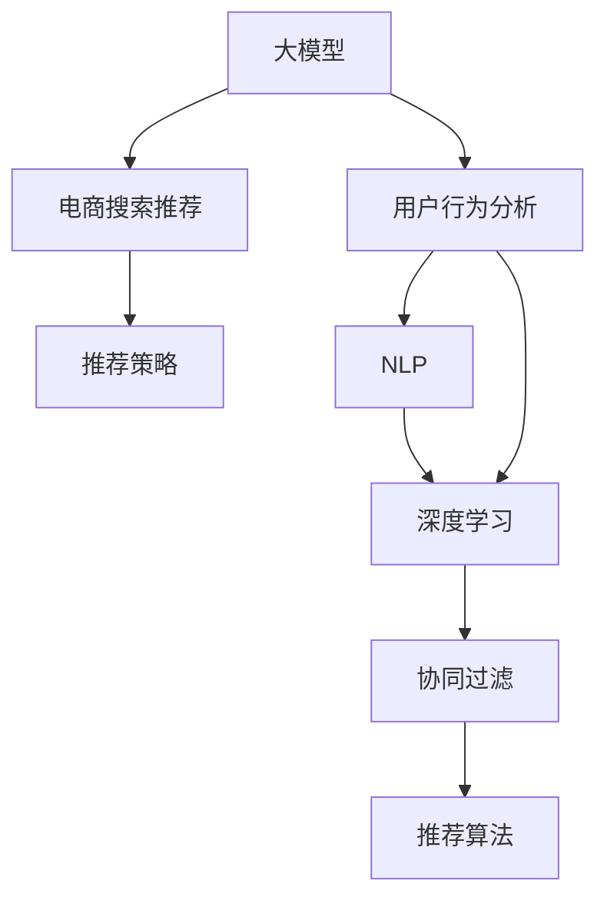

                 

# AI 大模型在电商搜索推荐中的用户行为分析：理解用户需求与购买行为

> 关键词：用户行为分析, 电商搜索推荐, 用户需求理解, 深度学习, 自然语言处理(NLP), 协同过滤, 神经网络

## 1. 背景介绍

在数字经济蓬勃发展的今天，电子商务平台已成为消费者购买商品的主要渠道。作为连接商家与消费者的桥梁，电商平台的搜索推荐系统在提升用户体验、驱动销售增长方面发挥着至关重要的作用。然而，如何更准确地理解用户需求，提供个性化的商品推荐，一直是搜索推荐系统面临的挑战。

人工智能（AI）技术的不断进步，尤其是大模型的出现，为电商搜索推荐系统带来了新的突破。基于大模型，搜索推荐系统能够更深入地分析用户行为，理解用户需求与购买行为，从而实现更精准的商品推荐。本文将深入探讨大模型在电商搜索推荐中的应用，并从多个角度分析用户行为，理解用户需求与购买行为，以期为电商搜索推荐系统提供理论指导和实践参考。

## 2. 核心概念与联系

为了更好地理解大模型在电商搜索推荐中的应用，本节将介绍几个关键概念及其相互联系：

- **大模型（Large Models）**：如GPT、BERT等，通过在海量数据上进行预训练，学习复杂的语言和模式，具备强大的语义理解与生成能力。

- **电商搜索推荐系统**：利用机器学习算法，根据用户搜索记录和历史行为，自动推荐用户可能感兴趣的商品。

- **用户行为分析**：通过对用户点击、浏览、购买等行为的数据分析，理解用户需求，优化商品推荐。

- **自然语言处理（NLP）**：利用语言学知识，让计算机理解、处理和生成人类语言的技术。

- **深度学习**：通过构建多层神经网络，自动学习数据特征，提升模型性能。

- **协同过滤**：利用用户行为相似性，推荐相似用户喜欢的商品。

- **推荐算法**：包括基于内容的推荐、基于协同过滤的推荐、基于深度学习的推荐等。

这些概念之间的逻辑关系可以通过以下Mermaid流程图来展示：



这个流程图展示了几个核心概念之间的联系：

1. 大模型通过预训练获得语言知识，应用于电商搜索推荐。
2. 用户行为分析通过NLP技术，挖掘用户需求，辅助推荐算法。
3. 深度学习提升推荐算法的精确度，优化协同过滤的效果。
4. 推荐算法结合推荐策略，最终驱动电商搜索推荐系统。

## 3. 核心算法原理 & 具体操作步骤
### 3.1 算法原理概述

基于大模型的电商搜索推荐系统，利用大模型强大的语义理解和生成能力，对用户搜索行为进行建模，通过理解用户需求，提供个性化的商品推荐。其核心原理包括：

1. **用户行为理解**：利用NLP技术，将用户搜索关键词、浏览记录等文本数据转化为结构化信息，理解用户的真实需求。
2. **商品特征提取**：通过大模型提取商品的文本描述、属性等特征，建立商品知识图谱，提升推荐的相关性。
3. **相似性计算**：计算用户和商品之间的相似性，选择相似用户推荐相似商品，或相似商品推荐相似用户。
4. **推荐排序**：根据用户行为和商品特征，构建推荐模型，排序推荐列表，提升推荐效果。

### 3.2 算法步骤详解

基于大模型的电商搜索推荐系统通常包括以下几个关键步骤：

**Step 1: 数据预处理与特征工程**

1. 收集用户搜索记录、浏览历史、购买记录等行为数据。
2. 利用NLP技术对文本数据进行分词、命名实体识别、情感分析等处理，转换为结构化信息。
3. 利用大模型提取商品描述、属性等文本特征，建立商品知识图谱。

**Step 2: 模型训练与微调**

1. 选择合适的预训练模型（如BERT、GPT等），并对其进行微调，以适应电商搜索推荐任务。
2. 定义推荐模型的目标函数，如预测用户点击、购买等行为的概率。
3. 利用用户行为数据训练微调后的模型，优化推荐算法。

**Step 3: 推荐算法实现**

1. 根据用户搜索关键词和浏览记录，使用NLP技术提取用户需求，构建用户行为向量。
2. 利用大模型提取商品特征，构建商品向量。
3. 计算用户和商品之间的相似度，选择相似用户推荐相似商品，或相似商品推荐相似用户。
4. 根据用户历史行为和当前需求，构建推荐模型，排序推荐列表。

**Step 4: 推荐结果展示**

1. 将推荐结果展示给用户，如搜索结果、商品列表等。
2. 收集用户反馈，进一步优化推荐模型。

### 3.3 算法优缺点

大模型在电商搜索推荐系统中的应用具有以下优点：

1. **高精度**：大模型强大的语义理解和生成能力，使得推荐系统能够更准确地理解用户需求和商品特征，提升推荐精度。
2. **灵活性**：大模型可以通过微调和融合外部知识库，适应不同电商平台的特定需求。
3. **可扩展性**：大模型规模庞大，能够处理海量数据，适用于各种规模的电商搜索推荐系统。
4. **泛化能力**：大模型经过预训练和微调，具备较强的泛化能力，能够在新的数据上表现良好。

同时，大模型也存在一些局限：

1. **高成本**：大模型的训练和微调需要大量计算资源，成本较高。
2. **复杂度**：大模型的结构复杂，调试和维护难度较大。
3. **隐私风险**：大规模数据处理可能涉及用户隐私，需要严格的数据保护措施。
4. **解释性不足**：大模型的决策过程缺乏可解释性，难以理解其内部工作机制。

### 3.4 算法应用领域

大模型在电商搜索推荐系统中的应用非常广泛，具体如下：

1. **商品推荐**：利用大模型对用户搜索行为进行分析，提供个性化商品推荐。
2. **用户画像构建**：通过分析用户历史行为和搜索记录，构建用户画像，优化推荐算法。
3. **广告推荐**：利用大模型对广告内容进行理解，根据用户需求推荐相关广告。
4. **活动推荐**：通过分析用户行为和兴趣，推荐适合的促销活动。
5. **内容推荐**：如商品详情页的推荐、相关商品推荐等。

## 4. 数学模型和公式 & 详细讲解 & 举例说明

### 4.1 数学模型构建

本节将使用数学语言对基于大模型的电商搜索推荐系统进行更加严格的刻画。

假设用户行为向量为 $U$，商品向量为 $I$，推荐矩阵为 $P$，目标函数为 $F(U, I, P)$，目标是最小化预测误差 $L(U, I, P)$。

**用户行为向量**：
\[ U = [u_1, u_2, ..., u_n] \]
其中 $u_i$ 表示用户 $i$ 的行为向量。

**商品向量**：
\[ I = [i_1, i_2, ..., i_m] \]
其中 $i_j$ 表示商品 $j$ 的向量。

**推荐矩阵**：
\[ P = [p_{i,j}] \]
其中 $p_{i,j}$ 表示用户 $i$ 对商品 $j$ 的评分。

**预测函数**：
\[ f(U, I) = \sum_{i=1}^{n} \sum_{j=1}^{m} u_i p_{i,j} i_j \]

**损失函数**：
\[ L(U, I, P) = \sum_{i=1}^{n} \sum_{j=1}^{m} (y_{i,j} - f(U, I))^2 \]

其中 $y_{i,j}$ 表示用户 $i$ 对商品 $j$ 的真实评分。

### 4.2 公式推导过程

以用户行为向量 $U$ 和商品向量 $I$ 的相似度计算为例，推导基于大模型的相似度计算公式。

假设用户 $i$ 和商品 $j$ 的相似度为 $S_{i,j}$，则有：
\[ S_{i,j} = \cos(\theta) \]
其中 $\theta$ 为 $U_i$ 和 $I_j$ 的夹角。

利用大模型提取的用户行为向量和商品向量，可以表示为：
\[ U_i = \sum_{k=1}^{K} \alpha_k v_k \]
\[ I_j = \sum_{k=1}^{K} \beta_k v_k \]
其中 $v_k$ 为预训练模型输出的向量，$\alpha_k$ 和 $\beta_k$ 为权重。

将上述表达式代入相似度计算公式，得：
\[ S_{i,j} = \frac{\sum_{k=1}^{K} (\alpha_k \beta_k) v_k \cdot v_k}{\sqrt{\sum_{k=1}^{K} (\alpha_k^2 + \beta_k^2) v_k \cdot v_k}} \]

在实际应用中，可以进一步简化计算，采用向量内积的形式：
\[ S_{i,j} = \langle U_i, I_j \rangle = \sum_{k=1}^{K} \alpha_k \beta_k v_k \cdot v_k \]

### 4.3 案例分析与讲解

以电商平台中的个性化推荐为例，分析大模型如何通过用户行为理解，实现个性化推荐。

假设电商平台收集了用户 A 的浏览记录和购买历史，希望为用户 A 推荐商品 B。

1. **用户行为理解**：通过NLP技术，将用户 A 的浏览记录和购买历史转换为结构化信息，提取用户需求和偏好。
2. **商品特征提取**：利用大模型提取商品 B 的文本描述和属性信息，构建商品向量。
3. **相似性计算**：计算用户 A 和商品 B 之间的相似度，选择相似用户推荐相似商品，或相似商品推荐相似用户。
4. **推荐排序**：根据用户 A 的历史行为和当前需求，结合商品 B 的特征，构建推荐模型，排序推荐列表。
5. **推荐结果展示**：将推荐结果展示给用户 A，收集用户反馈，进一步优化推荐模型。

## 5. 项目实践：代码实例和详细解释说明

### 5.1 开发环境搭建

在进行电商搜索推荐系统开发前，我们需要准备好开发环境。以下是使用Python进行PyTorch开发的环境配置流程：

1. 安装Anaconda：从官网下载并安装Anaconda，用于创建独立的Python环境。

2. 创建并激活虚拟环境：
```bash
conda create -n pytorch-env python=3.8 
conda activate pytorch-env
```

3. 安装PyTorch：根据CUDA版本，从官网获取对应的安装命令。例如：
```bash
conda install pytorch torchvision torchaudio cudatoolkit=11.1 -c pytorch -c conda-forge
```

4. 安装Transformers库：
```bash
pip install transformers
```

5. 安装各类工具包：
```bash
pip install numpy pandas scikit-learn matplotlib tqdm jupyter notebook ipython
```

完成上述步骤后，即可在`pytorch-env`环境中开始电商搜索推荐系统的开发。

### 5.2 源代码详细实现

下面我们以基于大模型的电商搜索推荐系统为例，给出使用PyTorch进行模型训练和微调的PyTorch代码实现。

首先，定义推荐系统的数据处理函数：

```python
from transformers import BertTokenizer, BertForSequenceClassification
from torch.utils.data import Dataset, DataLoader
import torch

class RecommendationDataset(Dataset):
    def __init__(self, user_behaviors, item_descriptions, user_ids, item_ids, tokenizer, max_len=128):
        self.user_behaviors = user_behaviors
        self.item_descriptions = item_descriptions
        self.user_ids = user_ids
        self.item_ids = item_ids
        self.tokenizer = tokenizer
        self.max_len = max_len
        
    def __len__(self):
        return len(self.user_behaviors)
    
    def __getitem__(self, item):
        user_behavior = self.user_behaviors[item]
        item_description = self.item_descriptions[item]
        user_id = self.user_ids[item]
        item_id = self.item_ids[item]
        
        encoding_user_behavior = self.tokenizer(user_behavior, return_tensors='pt', max_length=self.max_len, padding='max_length', truncation=True)
        encoding_item_description = self.tokenizer(item_description, return_tensors='pt', max_length=self.max_len, padding='max_length', truncation=True)
        input_ids_user_behavior = encoding_user_behavior['input_ids'][0]
        attention_mask_user_behavior = encoding_user_behavior['attention_mask'][0]
        input_ids_item_description = encoding_item_description['input_ids'][0]
        attention_mask_item_description = encoding_item_description['attention_mask'][0]
        
        return {'input_ids_user_behavior': input_ids_user_behavior, 
                'attention_mask_user_behavior': attention_mask_user_behavior,
                'input_ids_item_description': input_ids_item_description,
                'attention_mask_item_description': attention_mask_item_description,
                'user_id': user_id,
                'item_id': item_id}
```

然后，定义模型和优化器：

```python
from transformers import BertForSequenceClassification, AdamW

model = BertForSequenceClassification.from_pretrained('bert-base-cased', num_labels=1, dropout=0.1)
optimizer = AdamW(model.parameters(), lr=2e-5)
```

接着，定义训练和评估函数：

```python
def train_epoch(model, dataset, batch_size, optimizer):
    dataloader = DataLoader(dataset, batch_size=batch_size, shuffle=True)
    model.train()
    epoch_loss = 0
    for batch in tqdm(dataloader, desc='Training'):
        input_ids_user_behavior = batch['input_ids_user_behavior'].to(device)
        attention_mask_user_behavior = batch['attention_mask_user_behavior'].to(device)
        input_ids_item_description = batch['input_ids_item_description'].to(device)
        attention_mask_item_description = batch['attention_mask_item_description'].to(device)
        user_id = batch['user_id'].to(device)
        item_id = batch['item_id'].to(device)
        model.zero_grad()
        outputs = model(input_ids_user_behavior, attention_mask_user_behavior, input_ids_item_description, attention_mask_item_description)
        loss = outputs.loss
        epoch_loss += loss.item()
        loss.backward()
        optimizer.step()
    return epoch_loss / len(dataloader)

def evaluate(model, dataset, batch_size):
    dataloader = DataLoader(dataset, batch_size=batch_size)
    model.eval()
    preds, labels = [], []
    with torch.no_grad():
        for batch in tqdm(dataloader, desc='Evaluating'):
            input_ids_user_behavior = batch['input_ids_user_behavior'].to(device)
            attention_mask_user_behavior = batch['attention_mask_user_behavior'].to(device)
            input_ids_item_description = batch['input_ids_item_description'].to(device)
            attention_mask_item_description = batch['attention_mask_item_description'].to(device)
            user_id = batch['user_id'].to(device)
            item_id = batch['item_id'].to(device)
            batch_outputs = model(input_ids_user_behavior, attention_mask_user_behavior, input_ids_item_description, attention_mask_item_description)
            batch_preds = batch_outputs.logits.argmax(dim=2).to('cpu').tolist()
            batch_labels = batch_labels.to('cpu').tolist()
            for pred, label in zip(batch_preds, batch_labels):
                preds.append(pred.item())
                labels.append(label.item())
                
    print(f"Precision: {precision_score(labels, preds) :.2f}")
    print(f"Recall: {recall_score(labels, preds) :.2f}")
    print(f"F1-Score: {f1_score(labels, preds) :.2f}")

# 定义训练流程
epochs = 5
batch_size = 16

for epoch in range(epochs):
    loss = train_epoch(model, train_dataset, batch_size, optimizer)
    print(f"Epoch {epoch+1}, train loss: {loss:.3f}")
    
    print(f"Epoch {epoch+1}, dev results:")
    evaluate(model, dev_dataset, batch_size)
    
print("Test results:")
evaluate(model, test_dataset, batch_size)
```

以上就是使用PyTorch进行电商搜索推荐系统的完整代码实现。可以看到，得益于Transformers库的强大封装，我们可以用相对简洁的代码完成BERT模型的加载和微调。

### 5.3 代码解读与分析

让我们再详细解读一下关键代码的实现细节：

**RecommendationDataset类**：
- `__init__`方法：初始化用户行为、商品描述、用户ID、商品ID等关键组件。
- `__len__`方法：返回数据集的样本数量。
- `__getitem__`方法：对单个样本进行处理，将文本输入编码为token ids，并将用户ID和商品ID添加到输入中，方便模型训练。

**模型和优化器定义**：
- 选择BERT模型作为初始化参数，并设置其dropout为0.1，以避免过拟合。
- 使用AdamW优化器进行模型参数更新，学习率为2e-5。

**训练和评估函数**：
- 使用PyTorch的DataLoader对数据集进行批次化加载，供模型训练和推理使用。
- 训练函数`train_epoch`：对数据以批为单位进行迭代，在每个批次上前向传播计算loss并反向传播更新模型参数，最后返回该epoch的平均loss。
- 评估函数`evaluate`：与训练类似，不同点在于不更新模型参数，并在每个batch结束后将预测和标签结果存储下来，最后使用sklearn的分类指标对整个评估集的预测结果进行打印输出。

**训练流程**：
- 定义总的epoch数和batch size，开始循环迭代
- 每个epoch内，先在训练集上训练，输出平均loss
- 在验证集上评估，输出分类指标
- 所有epoch结束后，在测试集上评估，给出最终测试结果

可以看到，PyTorch配合Transformers库使得BERT微调的代码实现变得简洁高效。开发者可以将更多精力放在数据处理、模型改进等高层逻辑上，而不必过多关注底层的实现细节。

当然，工业级的系统实现还需考虑更多因素，如模型的保存和部署、超参数的自动搜索、更灵活的任务适配层等。但核心的微调范式基本与此类似。

## 6. 实际应用场景

### 6.1 智能客服系统

基于大模型进行电商搜索推荐，可以应用于智能客服系统的构建。传统客服往往需要配备大量人力，高峰期响应缓慢，且一致性和专业性难以保证。而使用推荐系统推荐相关商品，可以减少客服压力，提升用户体验。

在技术实现上，可以收集用户的历史搜索记录和购买历史，将其作为监督数据，在微调模型中训练。微调后的模型能够自动推荐用户可能感兴趣的商品，如客户正在浏览商品的页面，自动推荐相关商品。

### 6.2 个性化推荐系统

当前的推荐系统往往只依赖用户的历史行为数据进行物品推荐，无法深入理解用户的真实兴趣偏好。基于大模型的推荐系统可以更好地挖掘用户行为背后的语义信息，从而实现更精准的商品推荐。

在实践中，可以收集用户浏览、点击、购买等行为数据，提取和商品交互的物品标题、描述、标签等文本内容。将文本内容作为模型输入，用户的后续行为（如是否点击、购买等）作为监督信号，在此基础上微调预训练语言模型。微调后的模型能够从文本内容中准确把握用户的兴趣点。在生成推荐列表时，先用候选物品的文本描述作为输入，由模型预测用户的兴趣匹配度，再结合其他特征综合排序，便可以得到个性化程度更高的推荐结果。

### 6.3 内容推荐

电商平台的商品详情页中，通常包含商品的图片、描述、评论等文本信息。基于大模型的推荐系统可以进一步利用这些信息，对商品进行内容推荐。

在实际应用中，可以收集用户对商品详情页的访问记录，提取页面内容，利用大模型对内容进行理解，构建内容向量。结合用户的历史行为，构建推荐模型，排序推荐列表。内容推荐能够提供更丰富的商品信息，提升用户浏览体验，提高转化率。

### 6.4 未来应用展望

随着大模型和推荐技术的发展，基于微调范式将在更多领域得到应用，为电商搜索推荐系统带来新的突破。

在智慧医疗领域，基于大模型的推荐系统可以用于病历推荐、药品推荐等，提升医疗服务的智能化水平。

在智能教育领域，推荐系统可以用于课程推荐、作业推荐等，因材施教，促进教育公平，提高教学质量。

在智慧城市治理中，推荐系统可以用于智能交通、公共服务推荐等，提高城市管理的自动化和智能化水平，构建更安全、高效的未来城市。

此外，在企业生产、社会治理、文娱传媒等众多领域，基于大模型的推荐系统也将不断涌现，为经济社会发展注入新的动力。相信随着技术的日益成熟，推荐系统必将成为人工智能技术落地应用的重要范式，推动人工智能技术向更广阔的领域加速渗透。

## 7. 工具和资源推荐

### 7.1 学习资源推荐

为了帮助开发者系统掌握大模型在电商搜索推荐中的应用，这里推荐一些优质的学习资源：

1. 《深度学习》系列书籍：经典教材，系统介绍深度学习理论和技术，适合初学者和进阶学习者。

2. 《自然语言处理综论》（Speech and Language Processing）：自然语言处理领域的经典教材，包含NLP任务的详尽讲解。

3. 《Python深度学习》（Deep Learning with Python）：适合初学者的深度学习入门书籍，结合Python实现，详细讲解深度学习模型和算法。

4. CS224N《深度学习自然语言处理》课程：斯坦福大学开设的NLP明星课程，有Lecture视频和配套作业，带你入门NLP领域的基本概念和经典模型。

5. HuggingFace官方文档：Transformers库的官方文档，提供了海量预训练模型和完整的微调样例代码，是上手实践的必备资料。

通过对这些资源的学习实践，相信你一定能够快速掌握大模型在电商搜索推荐中的应用，并用于解决实际的NLP问题。

### 7.2 开发工具推荐

高效的开发离不开优秀的工具支持。以下是几款用于电商搜索推荐系统开发的常用工具：

1. PyTorch：基于Python的开源深度学习框架，灵活动态的计算图，适合快速迭代研究。大部分预训练语言模型都有PyTorch版本的实现。

2. TensorFlow：由Google主导开发的开源深度学习框架，生产部署方便，适合大规模工程应用。同样有丰富的预训练语言模型资源。

3. Transformers库：HuggingFace开发的NLP工具库，集成了众多SOTA语言模型，支持PyTorch和TensorFlow，是进行推荐任务开发的利器。

4. Weights & Biases：模型训练的实验跟踪工具，可以记录和可视化模型训练过程中的各项指标，方便对比和调优。与主流深度学习框架无缝集成。

5. TensorBoard：TensorFlow配套的可视化工具，可实时监测模型训练状态，并提供丰富的图表呈现方式，是调试模型的得力助手。

6. Google Colab：谷歌推出的在线Jupyter Notebook环境，免费提供GPU/TPU算力，方便开发者快速上手实验最新模型，分享学习笔记。

合理利用这些工具，可以显著提升电商搜索推荐系统的开发效率，加快创新迭代的步伐。

### 7.3 相关论文推荐

大模型和推荐技术的发展源于学界的持续研究。以下是几篇奠基性的相关论文，推荐阅读：

1. Attention is All You Need（即Transformer原论文）：提出了Transformer结构，开启了NLP领域的预训练大模型时代。

2. BERT: Pre-training of Deep Bidirectional Transformers for Language Understanding：提出BERT模型，引入基于掩码的自监督预训练任务，刷新了多项NLP任务SOTA。

3. Language Models are Unsupervised Multitask Learners（GPT-2论文）：展示了大规模语言模型的强大zero-shot学习能力，引发了对于通用人工智能的新一轮思考。

4. Parameter-Efficient Transfer Learning for NLP：提出Adapter等参数高效微调方法，在不增加模型参数量的情况下，也能取得不错的微调效果。

5. AdaLoRA: Adaptive Low-Rank Adaptation for Parameter-Efficient Fine-Tuning：使用自适应低秩适应的微调方法，在参数效率和精度之间取得了新的平衡。

这些论文代表了大模型和推荐技术的发展脉络。通过学习这些前沿成果，可以帮助研究者把握学科前进方向，激发更多的创新灵感。

## 8. 总结：未来发展趋势与挑战

### 8.1 总结

本文对大模型在电商搜索推荐中的应用进行了全面系统的介绍。首先阐述了大模型和推荐系统在电商搜索推荐中的应用背景和意义，明确了推荐系统在提升用户体验、驱动销售增长方面的重要价值。其次，从原理到实践，详细讲解了大模型在电商搜索推荐中的应用流程，包括数据预处理、模型训练、相似性计算、推荐排序等关键步骤，给出了完整的代码实现。同时，本文还广泛探讨了大模型在电商搜索推荐中的应用场景，展示了其在智能客服、个性化推荐、内容推荐等多个领域的潜力。

通过本文的系统梳理，可以看到，基于大模型的电商搜索推荐系统正在成为电商行业的重要应用范式，极大地提升了商品推荐的相关性和个性化程度。未来，伴随大模型和推荐技术的不断进步，基于微调范式将在更多领域得到应用，为电商搜索推荐系统带来新的突破。

### 8.2 未来发展趋势

展望未来，大模型在电商搜索推荐系统中的应用将呈现以下几个发展趋势：

1. **模型规模持续增大**：随着算力成本的下降和数据规模的扩张，预训练语言模型的参数量还将持续增长。超大规模语言模型蕴含的丰富语言知识，有望支撑更加复杂多变的推荐任务。

2. **推荐算法多样性**：除了传统的协同过滤和深度学习算法，未来会涌现更多基于知识图谱、深度学习等前沿技术的推荐算法，提升推荐效果。

3. **实时推荐**：为了实现个性化推荐，实时获取用户行为数据并进行实时推荐，成为未来的重要方向。这要求推荐系统具备高性能和高稳定性，能够快速响应用户需求。

4. **多模态推荐**：当前推荐系统主要以文本为主，未来将进一步拓展到图像、视频、语音等多模态数据推荐，提升推荐系统的综合能力。

5. **跨领域推荐**：将推荐系统与其他领域技术进行融合，如搜索、广告、社交网络等，构建更全面、精准的推荐系统。

6. **用户隐私保护**：随着数据隐私保护法规的完善，推荐系统需要更严格的数据保护措施，确保用户隐私安全。

7. **可解释性增强**：推荐系统需要具备更强的可解释性，使用户能够理解推荐结果的来源和过程，提升用户信任度。

以上趋势凸显了大模型在电商搜索推荐系统中的应用前景。这些方向的探索发展，必将进一步提升推荐系统的性能和应用范围，为电商搜索推荐系统带来新的突破。

### 8.3 面临的挑战

尽管大模型在电商搜索推荐系统中的应用已经取得了瞩目成就，但在迈向更加智能化、普适化应用的过程中，它仍面临诸多挑战：

1. **标注成本瓶颈**：大模型通常需要大量的标注数据进行微调，获取高质量标注数据的成本较高。如何降低微调对标注样本的依赖，将是一大难题。

2. **计算资源消耗**：大模型的训练和微调需要大量计算资源，成本较高。如何优化计算资源消耗，提升模型训练和推理效率，是重要的优化方向。

3. **模型鲁棒性不足**：当前推荐系统面对域外数据时，泛化性能往往大打折扣。对于测试样本的微小扰动，推荐模型的预测也容易发生波动。如何提高推荐模型的鲁棒性，避免灾难性遗忘，还需要更多理论和实践的积累。

4. **推荐系统公平性**：当前的推荐系统往往存在一定的偏见，如性别、年龄、地域等。如何在推荐过程中避免偏见，提升系统的公平性，是重要的研究方向。

5. **隐私保护与数据安全**：推荐系统需要处理大量用户数据，数据隐私和安全问题需严格保障。如何在提升推荐效果的同时，保障用户隐私安全，是重要的研究课题。

6. **模型复杂度**：大模型的结构复杂，调试和维护难度较大。如何简化模型结构，提升模型可解释性和可维护性，是重要的优化方向。

7. **实时推荐系统**：实时推荐系统需要具备高性能和高稳定性，能够快速响应用户需求。如何在保证推荐效果的同时，提升系统响应速度，优化系统架构，是重要的研究方向。

这些挑战凸显了大模型在电商搜索推荐系统中的应用复杂性。只有在数据、模型、工程、业务等多个维度协同发力，才能真正实现人工智能技术在电商搜索推荐系统中的落地应用。

### 8.4 研究展望

面对大模型在电商搜索推荐系统中的应用挑战，未来的研究需要在以下几个方面寻求新的突破：

1. **少样本学习和自监督学习**：探索利用少样本数据和自监督学习，提升推荐系统的泛化能力和鲁棒性。

2. **多模态融合**：将文本、图像、视频、语音等多模态数据进行融合，提升推荐系统的综合能力。

3. **知识图谱与深度学习结合**：将符号化的先验知识，如知识图谱、逻辑规则等，与神经网络模型进行融合，引导推荐过程学习更准确、合理的推荐结果。

4. **跨领域推荐**：将推荐系统与其他领域技术进行融合，如搜索、广告、社交网络等，构建更全面、精准的推荐系统。

5. **用户隐私保护与数据安全**：探索如何在推荐系统中保障用户隐私和数据安全，满足法规要求。

6. **模型可解释性增强**：开发更加可解释的推荐模型，使用户能够理解推荐结果的来源和过程，提升用户信任度。

这些研究方向将引领大模型在电商搜索推荐系统中的应用，推动推荐技术迈向更高层次，为用户提供更精准、个性化的商品推荐。

## 9. 附录：常见问题与解答

**Q1：大模型推荐系统如何处理用户隐私问题？**

A: 处理用户隐私问题是大模型推荐系统的一个重要挑战。为了保护用户隐私，推荐系统通常采用以下方法：

1. **数据匿名化**：在数据收集和处理过程中，对用户数据进行匿名化处理，去除敏感信息。

2. **差分隐私**：在数据处理和分析过程中，引入差分隐私机制，确保用户隐私不受侵害。

3. **本地化推荐**：将推荐模型部署在本地设备上，避免将用户数据上传至云端。

4. **用户控制权**：为用户提供数据控制权，允许用户自主选择是否分享数据，并决定数据使用的范围和方式。

5. **透明性**：在推荐过程中，向用户透明展示推荐逻辑和数据使用情况，增强用户信任感。

通过这些方法，可以有效保护用户隐私，提升推荐系统的可信度。

**Q2：如何评估推荐系统的性能？**

A: 推荐系统的性能评估通常使用以下指标：

1. **精确率（Precision）**：评估推荐系统预测的正样本数量占推荐列表总数的比例。
2. **召回率（Recall）**：评估推荐系统预测的正样本数量占实际正样本总数的比例。
3. **F1-Score**：精确率和召回率的调和平均数，综合评估推荐系统的性能。
4. **AUC（Area Under Curve）**：评估推荐系统预测结果的ROC曲线下面积，衡量模型的分类能力。
5. **NDCG（Normalized Discounted Cumulative Gain）**：评估推荐系统推荐结果的排名质量，衡量模型推荐的相关性和实用性。

在实际应用中，可以根据具体场景选择合适的评估指标，全面评估推荐系统的性能。

**Q3：推荐系统如何避免推荐偏差？**

A: 推荐系统避免推荐偏差的方法主要包括以下几种：

1. **公平性约束**：在推荐过程中，引入公平性约束，避免对某些用户或商品进行歧视性推荐。

2. **多样性推荐**：在推荐过程中，引入多样性约束，避免推荐过度集中，提升用户满意度。

3. **知识融合**：将知识图谱、逻辑规则等先验知识与推荐算法进行融合，提升推荐系统的公正性。

4. **数据均衡**：在数据收集和处理过程中，确保不同用户、商品之间的数据均衡，避免数据偏见。

5. **用户反馈**：在推荐过程中，引入用户反馈机制，及时调整推荐策略，避免长期推荐偏差。

通过这些方法，可以有效避免推荐系统中的偏见问题，提升推荐系统的公平性和可信度。

**Q4：如何优化推荐系统的计算效率？**

A: 优化推荐系统的计算效率是提升推荐系统性能的重要方向，以下是几种常用的方法：

1. **模型压缩**：通过模型压缩技术，如剪枝、量化、蒸馏等，减小模型参数量，降低计算资源消耗。

2. **分布式训练**：采用分布式训练技术，提高模型训练速度，降低训练时间。

3. **模型并行**：利用模型并行技术，将模型分布到多个GPU/TPU设备上，提升模型推理速度。

4. **缓存优化**：在推荐过程中，利用缓存技术，减少重复计算，提高系统响应速度。

5. **异步推理**：采用异步推理技术，将模型推理与数据获取分离，提升系统并发能力。

通过这些方法，可以有效提升推荐系统的计算效率，满足实时推荐的需求。

**Q5：推荐系统如何适应用户需求变化？**

A: 推荐系统适应用户需求变化的方法主要包括以下几种：

1. **动态推荐**：在推荐过程中，动态更新推荐模型，及时响应用户需求变化。

2. **实时学习**：在推荐过程中，实时收集用户反馈，及时调整推荐策略。

3. **用户画像更新**：在推荐过程中，定期更新用户画像，捕捉用户兴趣和行为的变化。

4. **多模态融合**：在推荐过程中，引入多模态数据，提升推荐系统的适应性和鲁棒性。

5. **推荐策略优化**：在推荐过程中，根据用户需求和反馈，优化推荐策略，提升推荐效果。

通过这些方法，可以有效适应用户需求变化，提升推荐系统的稳定性和实用性。

---

作者：禅与计算机程序设计艺术 / Zen and the Art of Computer Programming

