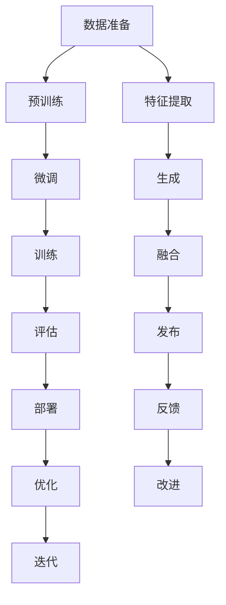

                 

# AIGC技术演进路线图

## 1. 背景介绍

### 1.1 问题由来
随着人工智能(AI)技术的迅猛发展，计算机生成内容（AIGC）技术正逐步从边缘走向主流，为各行各业带来了革命性的变革。从虚拟主播到个性化内容创作，从AI绘画到自动作曲，AIGC技术以其卓越的生成能力和创意性，正逐渐成为推动产业升级的重要驱动力。然而，AIGC的发展并非一帆风顺，其背后蕴含着复杂的理论基础和迭代演进过程。本文将深入探讨AIGC技术的发展历史、核心概念、算法原理以及未来方向，为读者提供全面的技术指引。

### 1.2 问题核心关键点
AIGC技术演进的核心关键点主要包括：
1. **从规则驱动到数据驱动**：早期的AI生成系统主要依赖于手工设计的规则，难以适应复杂多变的生成需求。随着数据驱动技术的发展，AIGC系统开始依赖大量标注数据进行训练，生成能力大幅提升。
2. **从简单模型到深度学习**：从最初的线性回归模型到多层的深度神经网络，模型结构日益复杂，生成的内容质量与多样性显著提高。
3. **从单一模态到多模态融合**：文本生成、语音合成、图像生成等单一模态技术逐步发展成熟，多模态融合成为新的研究方向，提升了内容的丰富度和互动性。
4. **从无条件生成到条件生成**：无条件生成技术可以自由创作，但难以满足个性化需求。条件生成技术通过引入条件信号，提升了生成内容的针对性和多样性。
5. **从静态生成到动态生成**：从静态生成到动态生成的演变，使AI系统能够根据实时输入，动态生成变化多端的内容，进一步提升了交互性和实用性。
6. **从预训练到微调**：预训练-微调技术提升了模型的泛化能力，但在特定领域应用时，微调效果往往更加显著。

## 2. 核心概念与联系

### 2.1 核心概念概述
AIGC技术的核心概念主要包括：
1. **计算机生成内容(AIGC)**：利用人工智能技术，自动生成文本、图像、音频、视频等各类内容的技术。
2. **深度学习(DL)**：利用多层神经网络进行模式识别、分类、生成等任务的机器学习方法。
3. **生成对抗网络(GAN)**：通过对抗性训练，生成具有高逼真度、多样性的生成模型。
4. **变分自编码器(VAE)**：通过学习数据分布的隐变量，生成具有较低重建误差的内容。
5. **Transformer模型**：基于自注意力机制的深度神经网络，广泛用于文本生成、图像生成等任务。
6. **大语言模型(LLM)**：通过大量无标签文本预训练，学习通用的语言表示，具备强大的生成能力。
7. **半监督学习(Semi-supervised Learning)**：利用少量有标签数据和大量无标签数据进行训练，提高模型的泛化能力。
8. **迁移学习(Transfer Learning)**：通过在相关领域进行微调，提升模型在特定任务上的表现。

### 2.2 核心概念原理和架构的 Mermaid 流程图



## 3. 核心算法原理 & 具体操作步骤

### 3.1 算法原理概述
AIGC技术的核心算法原理主要包括深度学习、生成对抗网络、变分自编码器等。这些技术通过自动编码器、生成模型、变分自编码器等架构，对输入数据进行编码、生成、解码等操作，从而实现内容的自动生成。

### 3.2 算法步骤详解

#### 3.2.1 深度学习
深度学习算法通过多层神经网络进行特征提取、模式识别和内容生成。其核心步骤包括：
1. **数据预处理**：将输入数据标准化、归一化，以便于神经网络处理。
2. **构建模型**：设计多层神经网络结构，包括卷积层、池化层、全连接层等。
3. **损失函数**：定义损失函数，如交叉熵损失、均方误差等，用于衡量模型预测与真实值之间的差异。
4. **反向传播**：通过反向传播算法，计算损失函数的梯度，更新模型参数。
5. **模型训练**：使用训练集进行模型训练，优化模型参数。
6. **模型评估**：使用测试集评估模型性能，确保模型泛化能力。

#### 3.2.2 生成对抗网络
生成对抗网络(GAN)通过对抗性训练，生成具有高逼真度、多样性的内容。其核心步骤包括：
1. **生成器训练**：生成器网络从随机噪声中生成内容。
2. **判别器训练**：判别器网络判断生成的内容是否真实，并输出判断结果。
3. **对抗性训练**：生成器和判别器进行对抗性训练，生成器试图欺骗判别器，判别器试图识别生成内容。
4. **模型优化**：通过迭代训练，优化生成器和判别器的参数，提升生成内容的逼真度和多样性。

#### 3.2.3 变分自编码器
变分自编码器(VAE)通过学习数据分布的隐变量，生成具有较低重建误差的内容。其核心步骤包括：
1. **编码器**：将输入数据映射到隐空间，得到隐变量的表示。
2. **解码器**：将隐变量映射回输入空间，得到重建内容。
3. **损失函数**：定义重构损失和KL散度损失，衡量模型生成内容的逼真度和多样性。
4. **优化训练**：通过优化损失函数，更新编码器和解码器的参数。

### 3.3 算法优缺点
AIGC技术的优缺点主要包括：
- **优点**：
  1. **高效性**：利用深度学习等技术，实现自动生成内容，大大提高了生产效率。
  2. **多样性**：通过对抗训练等技术，生成内容具备高逼真度、多样性。
  3. **可扩展性**：AIGC技术可广泛应用于文本、图像、音频等多模态内容生成。
- **缺点**：
  1. **数据依赖**：深度学习模型依赖大量标注数据，获取高质量标注数据成本较高。
  2. **模型复杂**：深度学习模型结构复杂，训练和推理计算量大。
  3. **生成质量**：生成的内容可能存在模糊性、不连贯性等问题。

### 3.4 算法应用领域
AIGC技术在多个领域得到了广泛应用，包括：
- **文本生成**：自动生成文章、摘要、对话等内容。
- **图像生成**：自动生成图像、视频、动画等视觉内容。
- **音频生成**：自动生成音乐、声音、语音等音频内容。
- **推荐系统**：生成个性化推荐内容，提升用户体验。
- **游戏娱乐**：生成虚拟角色、场景等，提升游戏互动性。
- **虚拟主播**：自动生成语音和视频内容，实现人机交互。

## 4. 数学模型和公式 & 详细讲解 & 举例说明

### 4.1 数学模型构建
AIGC技术常用的数学模型包括深度神经网络、生成对抗网络、变分自编码器等。

#### 4.1.1 深度神经网络
深度神经网络由多个层次组成，每层包括线性变换和非线性激活函数。以文本生成为例，其数学模型如下：
$$
y = f(\mathbf{W}x + b)
$$
其中 $f$ 为激活函数，$\mathbf{W}$ 为权重矩阵，$b$ 为偏置向量。

#### 4.1.2 生成对抗网络
生成对抗网络由生成器和判别器组成，其数学模型如下：
$$
G: z \to x, \quad D: x \to p(x)
$$
其中 $G$ 为生成器，$z$ 为随机噪声，$x$ 为生成内容，$D$ 为判别器，$p(x)$ 为数据分布。

#### 4.1.3 变分自编码器
变分自编码器由编码器和解码器组成，其数学模型如下：
$$
p(z|x) = N(\mu(x), \sigma(x)^2), \quad x = \mathbf{W}z + b
$$
其中 $p(z|x)$ 为隐变量分布，$\mu(x)$ 和 $\sigma(x)$ 为隐变量均值和方差，$\mathbf{W}$ 和 $b$ 为编码器参数。

### 4.2 公式推导过程
以生成对抗网络为例，推导生成器和判别器的对抗训练过程。

#### 4.2.1 生成器训练
生成器网络 $G$ 从随机噪声 $z$ 生成内容 $x$，其损失函数为：
$$
L_G = \mathbb{E}_{p(z)} [D(G(z))] + \lambda \mathbb{E}_{p(x)} [\| x - x' \|^2]
$$
其中 $\lambda$ 为重建误差系数，$D(G(z))$ 为判别器对生成内容的判断，$x'$ 为通过解码器重构的生成内容。

#### 4.2.2 判别器训练
判别器网络 $D$ 判断内容 $x$ 是否真实，其损失函数为：
$$
L_D = \mathbb{E}_{p(x)} [\log D(x)] + \mathbb{E}_{p(z)} [\log (1 - D(G(z)))]
$$
其中 $D(x)$ 为判别器对真实内容的判断，$D(G(z))$ 为判别器对生成内容的判断。

#### 4.2.3 对抗性训练
通过交替优化生成器和判别器，实现对抗性训练过程，其迭代公式如下：
$$
G_{t+1} = G_t - \alpha \nabla_{G_t} L_G, \quad D_{t+1} = D_t - \beta \nabla_{D_t} L_D
$$
其中 $\alpha$ 和 $\beta$ 为优化器学习率。

### 4.3 案例分析与讲解

以GAN模型生成手写数字为例，分析其数学模型和训练过程。

**数据准备**：收集手写数字图片，将其标准化和归一化，作为训练集的输入数据。

**模型构建**：设计卷积神经网络作为生成器和判别器，其中生成器由多个卷积层和全连接层组成，判别器由多个卷积层和全连接层组成。

**损失函数**：定义生成器的损失函数为 $L_G$，判别器的损失函数为 $L_D$。

**训练过程**：交替优化生成器和判别器，逐步提升生成内容的逼真度和多样性。

## 5. 项目实践：代码实例和详细解释说明

### 5.1 开发环境搭建
以下是使用Python和TensorFlow实现GAN模型的环境配置流程：

1. 安装Anaconda：从官网下载并安装Anaconda，用于创建独立的Python环境。

2. 创建并激活虚拟环境：
```bash
conda create -n tf-env python=3.8 
conda activate tf-env
```

3. 安装TensorFlow：根据CUDA版本，从官网获取对应的安装命令。例如：
```bash
conda install tensorflow -c conda-forge -c pytorch
```

4. 安装Keras：
```bash
conda install keras -c conda-forge
```

5. 安装相关依赖：
```bash
conda install numpy scipy matplotlib pandas scikit-learn tqdm jupyter notebook ipython
```

完成上述步骤后，即可在`tf-env`环境中开始GAN模型训练。

### 5.2 源代码详细实现
以下是使用TensorFlow和Keras实现GAN模型的代码实现。

```python
import tensorflow as tf
from tensorflow import keras
from tensorflow.keras import layers

# 生成器网络
def build_generator():
    model = keras.Sequential()
    model.add(layers.Dense(256, input_dim=100))
    model.add(layers.BatchNormalization())
    model.add(layers.LeakyReLU())
    model.add(layers.Dense(128))
    model.add(layers.BatchNormalization())
    model.add(layers.LeakyReLU())
    model.add(layers.Dense(784, activation='tanh'))
    return model

# 判别器网络
def build_discriminator():
    model = keras.Sequential()
    model.add(layers.Dense(256, input_dim=784))
    model.add(layers.LeakyReLU())
    model.add(layers.Dropout(0.4))
    model.add(layers.Dense(128))
    model.add(layers.LeakyReLU())
    model.add(layers.Dropout(0.4))
    model.add(layers.Dense(1, activation='sigmoid'))
    return model

# 构建模型
generator = build_generator()
discriminator = build_discriminator()

# 定义损失函数
cross_entropy = keras.losses.BinaryCrossentropy(from_logits=True)

# 定义优化器
generator_optimizer = keras.optimizers.Adam(1e-4)
discriminator_optimizer = keras.optimizers.Adam(1e-4)

# 定义训练函数
@tf.function
def train_step(images):
    noise = tf.random.normal([BATCH_SIZE, 100])

    with tf.GradientTape() as gen_tape, tf.GradientTape() as disc_tape:
        generated_images = generator(noise, training=True)

        real_output = discriminator(images, training=True)
        fake_output = discriminator(generated_images, training=True)

        gen_loss = cross_entropy(tf.ones_like(fake_output), fake_output)
        disc_loss = cross_entropy(tf.ones_like(real_output), real_output) + cross_entropy(tf.zeros_like(fake_output), fake_output)

    gradients_of_generator = gen_tape.gradient(gen_loss, generator.trainable_variables)
    gradients_of_discriminator = disc_tape.gradient(disc_loss, discriminator.trainable_variables)

    generator_optimizer.apply_gradients(zip(gradients_of_generator, generator.trainable_variables))
    discriminator_optimizer.apply_gradients(zip(gradients_of_discriminator, discriminator.trainable_variables))
```

### 5.3 代码解读与分析
**生成器网络**：
- 首先定义生成器网络，采用多个全连接层和LeakyReLU激活函数，保证生成器网络的非线性能力。
- 输出层采用tanh激活函数，将生成内容映射回输入空间的范围。

**判别器网络**：
- 定义判别器网络，采用多个全连接层和LeakyReLU激活函数，保证判别器网络的非线性能力。
- 输出层采用sigmoid激活函数，输出判别器对真实内容和生成内容的判断结果。

**损失函数**：
- 定义交叉熵损失函数，用于衡量生成器和判别器的预测与真实值之间的差异。

**优化器**：
- 定义Adam优化器，用于更新生成器和判别器的参数。

**训练函数**：
- 在训练函数中，首先随机生成噪声，输入到生成器中生成内容。
- 使用判别器对真实内容和生成内容进行判断，计算损失函数。
- 使用梯度下降算法，更新生成器和判别器的参数。

### 5.4 运行结果展示
训练过程如下：

```python
# 数据准备
(X_train, _), (_, _) = keras.datasets.mnist.load_data()
X_train = X_train / 255.0

# 定义超参数
BATCH_SIZE = 256
EPOCHS = 100

# 训练模型
for epoch in range(EPOCHS):
    for batch in X_train:
        train_step(batch)
        
    print(f"Epoch {epoch+1}/{EPOCHS}")
```

## 6. 实际应用场景
### 6.1 智能客服系统
智能客服系统通过生成对抗网络，实现了自动生成对话内容的功能。具体而言，系统收集历史客服对话记录，使用生成对抗网络生成对话模板，再通过微调模型适配具体的业务场景和用户需求，生成自然流畅的对话回复。

**技术实现**：
1. 数据准备：收集客服对话记录，将问题和最佳答复构建成监督数据。
2. 模型构建：设计生成器和判别器网络，训练生成对抗网络。
3. 微调模型：将生成的对话模板作为输入，微调模型以适应具体的业务场景和用户需求。
4. 部署应用：将微调后的模型集成到智能客服系统中，自动生成对话回复。

**应用效果**：
- 提高响应速度：自动生成对话内容，响应速度快，用户等待时间缩短。
- 提升服务质量：生成的对话内容自然流畅，用户体验提升。
- 减少人力成本：自动回复功能减少了人工客服的工作量，降低了人力成本。

### 6.2 金融舆情监测
金融舆情监测系统通过生成对抗网络，实现了自动生成新闻摘要的功能。具体而言，系统收集金融领域相关的新闻、报道、评论等文本数据，使用生成对抗网络生成摘要，再通过微调模型适配具体的业务需求，生成精准的舆情分析报告。

**技术实现**：
1. 数据准备：收集金融领域相关的新闻、报道、评论等文本数据。
2. 模型构建：设计生成器和判别器网络，训练生成对抗网络。
3. 微调模型：将生成的摘要作为输入，微调模型以适应具体的业务需求。
4. 部署应用：将微调后的模型集成到舆情监测系统中，自动生成舆情分析报告。

**应用效果**：
- 实时监测：自动生成新闻摘要，实时监测金融舆情变化。
- 提高准确性：生成的摘要准确度高，舆情分析报告准确性提升。
- 降低成本：自动生成摘要，减少了人工审核的环节，降低了人力成本。

### 6.3 个性化推荐系统
个性化推荐系统通过生成对抗网络，实现了自动生成推荐内容的功能。具体而言，系统收集用户浏览、点击、评论、分享等行为数据，使用生成对抗网络生成推荐内容，再通过微调模型适配具体的用户需求，生成个性化推荐结果。

**技术实现**：
1. 数据准备：收集用户浏览、点击、评论、分享等行为数据。
2. 模型构建：设计生成器和判别器网络，训练生成对抗网络。
3. 微调模型：将生成的推荐内容作为输入，微调模型以适应具体的用户需求。
4. 部署应用：将微调后的模型集成到推荐系统中，自动生成个性化推荐结果。

**应用效果**：
- 提高推荐效果：生成的推荐内容个性化程度高，用户满意度提升。
- 降低开发成本：自动生成推荐内容，减少了人工干预的环节，降低了开发成本。
- 提升用户体验：生成的推荐内容与用户兴趣高度匹配，用户体验提升。

## 7. 工具和资源推荐
### 7.1 学习资源推荐
为了帮助开发者系统掌握AIGC技术的理论基础和实践技巧，这里推荐一些优质的学习资源：

1. 《深度学习》系列书籍：由Ian Goodfellow、Yoshua Bengio、Aaron Courville等专家编写，全面介绍了深度学习的基本概念和算法。
2. 《生成对抗网络：理论、算法与应用》书籍：由Nicholas Ryder、Ian Goodfellow等专家编写，深入浅出地介绍了生成对抗网络的基本原理和应用。
3. 《变分自编码器：理论与实践》书籍：由David Knowles、Dino Sejdinovic等专家编写，全面介绍了变分自编码器的基本原理和应用。
4. 《Python深度学习》书籍：由Francois Chollet编写，介绍了深度学习的Python实现和优化技巧。
5. 《TensorFlow官方文档》：官方提供的TensorFlow文档，包括入门指南、API文档、示例代码等。

### 7.2 开发工具推荐
以下是几款用于AIGC技术开发的常用工具：

1. TensorFlow：由Google开发的开源深度学习框架，生产部署方便，适合大规模工程应用。
2. PyTorch：由Facebook开发的开源深度学习框架，灵活动态，适合快速迭代研究。
3. Keras：基于TensorFlow的高级API，简单易用，适合初学者。
4. Theano：由蒙特利尔大学开发的深度学习框架，支持高效的GPU计算。
5. MXNet：由亚马逊开发的深度学习框架，支持分布式计算，适合大规模数据集。
6. PyTorch Lightning：基于PyTorch的快速原型开发框架，适合快速实验。

### 7.3 相关论文推荐
AIGC技术的发展源于学界的持续研究。以下是几篇奠基性的相关论文，推荐阅读：

1. Generative Adversarial Nets（GAN的开创性论文）：提出生成对抗网络的基本原理，奠定了生成对抗网络的基础。
2. Variational Autoencoders（VAE）：提出变分自编码器的基本原理，引入了隐变量的思想。
3. Unsupervised Representation Learning with Deep Convolutional Generative Adversarial Networks：提出通过生成对抗网络进行无监督学习的思想，推动了深度学习的发展。
4. Attention is All You Need（Transformer的开创性论文）：提出Transformer架构，改进了生成对抗网络的训练过程，提升了生成内容的逼真度和多样性。
5. SimCLR: Unsupervised Learning in Transformers with Contrastive Predictive Coding：提出自监督学习的基本原理，通过对比预测编码进行无监督学习。

这些论文代表了AIGC技术的发展脉络，通过学习这些前沿成果，可以帮助研究者把握学科前进方向，激发更多的创新灵感。

## 8. 总结：未来发展趋势与挑战

### 8.1 总结
本文对AIGC技术的发展历史、核心概念、算法原理以及未来方向进行了全面系统的介绍。首先阐述了AIGC技术的背景和意义，明确了深度学习、生成对抗网络、变分自编码器等核心算法的应用场景和优势。其次，从原理到实践，详细讲解了AIGC技术的数学模型和训练过程，给出了AIGC技术在智能客服、金融舆情、个性化推荐等实际应用中的代码实例。最后，总结了AIGC技术的未来发展趋势和面临的挑战，为读者提供了全面的技术指引。

通过本文的系统梳理，可以看到，AIGC技术正逐步从边缘走向主流，为各行各业带来了革命性的变革。从文本生成到图像生成，从语音合成到音乐创作，AIGC技术在各个领域展现出强大的生成能力和创造力，推动了产业升级和社会进步。未来，随着深度学习、生成对抗网络、变分自编码器等技术的不断发展，AIGC技术将在更多的应用场景中发挥重要作用，为经济社会发展注入新的动力。

### 8.2 未来发展趋势

AIGC技术的未来发展趋势主要包括：
1. **更加智能的生成模型**：随着深度学习等技术的不断进步，AIGC模型的生成能力和表现将进一步提升，能够生成更加自然、多样、逼真的内容。
2. **更加高效的多模态融合**：将文本、图像、语音等多模态信息进行融合，生成更加丰富、互动的内容，提升用户体验。
3. **更加泛化的生成模型**：通过迁移学习、少样本学习等技术，提升生成模型在不同领域、不同任务上的泛化能力，实现更加通用、适应性强的生成系统。
4. **更加灵活的生成控制**：通过条件生成、动态生成等技术，提升生成内容的个性化和交互性，满足用户的多种需求。
5. **更加安全、可控的生成系统**：通过引入伦理道德、安全隐私等约束，提升生成系统的可解释性、可控性，保障生成内容的安全性和合法性。
6. **更加多样化的应用场景**：从内容创作、娱乐互动到智能客服、舆情监测等，AIGC技术将在更多领域发挥作用，推动社会进步。

### 8.3 面临的挑战

AIGC技术在发展过程中面临诸多挑战：
1. **数据质量与标注成本**：AIGC模型依赖大量高质量标注数据进行训练，获取数据和标注成本较高。
2. **模型复杂与计算资源**：AIGC模型结构复杂，训练和推理计算量大，需要高性能计算资源。
3. **生成内容的合法性**：生成内容的合法性、安全性等问题需要引起重视，避免生成有害、虚假信息。
4. **生成内容的真实性**：生成内容的真实性难以保证，可能存在虚假、误导性信息，影响用户体验和信任。
5. **生成内容的可解释性**：AIGC系统的黑盒特性使其难以解释生成过程，影响系统可控性和可解释性。
6. **生成内容的鲁棒性**：生成模型对抗干扰的鲁棒性不足，可能对噪声、扰动等输入敏感。

### 8.4 研究展望

AIGC技术未来的研究方向主要包括：
1. **更加高效的多模态融合**：探索多模态数据融合的算法和模型结构，提升生成内容的丰富度和交互性。
2. **更加泛化的生成模型**：研究迁移学习、少样本学习等技术，提升生成模型在不同领域、不同任务上的泛化能力。
3. **更加灵活的生成控制**：探索条件生成、动态生成等技术，提升生成内容的个性化和交互性，满足用户的多种需求。
4. **更加安全、可控的生成系统**：引入伦理道德、安全隐私等约束，提升生成系统的可解释性、可控性，保障生成内容的安全性和合法性。
5. **更加多样化的应用场景**：从内容创作、娱乐互动到智能客服、舆情监测等，AIGC技术将在更多领域发挥作用，推动社会进步。
6. **更加多样化的应用场景**：从内容创作、娱乐互动到智能客服、舆情监测等，AIGC技术将在更多领域发挥作用，推动社会进步。

## 9. 附录：常见问题与解答

**Q1：AIGC技术如何保证生成的内容质量？**

A: AIGC技术通过深度学习、生成对抗网络等算法，生成高质量的内容。为了保证生成内容的真实性、多样性和逼真度，通常需要：
1. **数据准备**：收集高质量、多样性的数据集，作为训练的输入。
2. **模型构建**：设计合适的模型结构和训练策略，提升生成能力。
3. **训练过程**：通过对抗训练、多模态融合等技术，提高生成内容的逼真度和多样性。
4. **评估过程**：使用多种评估指标，如FID、IS等，评估生成内容的真实性和多样性。

**Q2：AIGC技术如何防止生成内容的虚假性？**

A: 生成内容的虚假性问题需要通过多种手段进行防范：
1. **数据筛选**：收集真实、可靠的数据集，避免虚假数据对模型训练的干扰。
2. **生成对抗**：使用生成对抗网络，生成者试图欺骗判别器，判别器试图识别生成内容，提升生成内容的逼真度。
3. **多模态融合**：将多种模态信息进行融合，提升生成内容的真实性和多样性。
4. **模型解释**：通过可解释性技术，如可视化、生成日志等，解释生成内容的生成过程，避免有害信息的传播。

**Q3：AIGC技术如何提升生成内容的可解释性？**

A: 提升AIGC技术的可解释性可以通过以下方式实现：
1. **生成日志**：记录生成过程的中间结果和决策依据，帮助解释生成内容的来源和逻辑。
2. **可视化**：使用可视化技术，展示生成内容的关键特征和生成过程，提升系统的可解释性。
3. **多模态融合**：将多种模态信息进行融合，提升生成内容的真实性和多样性，增强系统的可解释性。
4. **模型优化**：通过优化算法，提升模型的透明度和可解释性，增强用户对生成内容的信任。

通过这些措施，可以提升AIGC技术的可解释性，增强用户对生成内容的信任，提升系统的透明度和可信度。

---

作者：禅与计算机程序设计艺术 / Zen and the Art of Computer Programming

