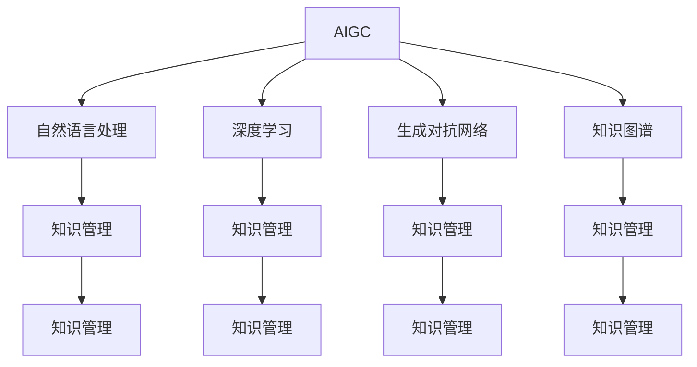

                 

# AIGC重新定义知识管理

## 1. 背景介绍

### 1.1 问题由来

随着人工智能（AI）技术的快速发展，人工智能生成内容（AIGC）在各行各业的应用日益广泛。无论是内容创作、媒体制作、还是教育、医疗等领域，AIGC 都以高效、高质量的内容生成能力，显著提升了行业生产力。然而，对于知识管理这一古老而重要的领域，传统的知识管理方式仍较为原始和静态，难以适应数字化时代的动态变化和复杂性。

### 1.2 问题核心关键点

在数字化的浪潮中，知识的动态生成、快速传播、实时更新成为常态。传统知识管理方式如文档归档、文本搜索、目录分类等，已无法满足这种动态和多样化的需求。如何利用AIGC技术重新定义知识管理，使其具备更强的动态性、互动性和适应性，成为当前的迫切需求。

### 1.3 问题研究意义

重新定义知识管理，不仅能够有效应对数字时代知识的快速生成和传播，还能提高知识获取、应用和创新的效率。这对于提升各行业整体竞争力，推动知识经济的发展具有重要意义。

## 2. 核心概念与联系

### 2.1 核心概念概述

为更好地理解AIGC在知识管理中的应用，本节将介绍几个关键概念：

- 人工智能生成内容（AIGC）：通过机器学习和自然语言处理等技术，自动生成高质量、高度可定制的内容。包括文本生成、图像生成、音频生成、视频生成等多种形式。
- 知识管理（Knowledge Management）：通过系统化的策略和技术，捕获、组织、分享、应用知识，以支持决策、创新和业务流程的优化。
- 自然语言处理（NLP）：使计算机能够理解、解释和生成人类语言的技术，是AIGC的核心技术之一。
- 深度学习（Deep Learning）：通过构建多层神经网络模型，自动学习数据的高级特征，是AIGC中常用的机器学习技术。
- 生成对抗网络（GANs）：由生成器和判别器两部分组成的生成模型，用于生成逼真的内容。
- 知识图谱（Knowledge Graph）：通过节点和边描述实体间关系的数据结构，是知识管理的重要工具。

这些核心概念之间的逻辑关系可以通过以下Mermaid流程图来展示：



这个流程图展示了大语言模型与知识管理之间的核心联系：

1. AIGC通过自然语言处理技术生成高质量文本，参与到知识管理中。
2. 深度学习技术用于构建知识图谱，挖掘数据间的关系。
3. 生成对抗网络技术用于生成虚拟知识，丰富知识管理的内容。
4. 知识图谱技术用于组织、分析和应用知识，支持知识管理的需求。

## 3. 核心算法原理 & 具体操作步骤
### 3.1 算法原理概述

AIGC在知识管理中的应用，本质上是利用机器学习技术，将结构化和非结构化的知识数据进行自动分析和生成。通过构建知识图谱、生成文本、图像等多种形式的知识，支持知识管理系统的动态更新和智能化决策。

具体来说，可以采取以下步骤：

1. **数据收集与清洗**：收集相关的文本、图像、音频等数据，并进行去重、去噪、规范化等预处理工作，形成高质量的数据集。
2. **知识图谱构建**：使用深度学习技术，通过图神经网络等方法，自动学习数据间的关系，构建知识图谱。
3. **内容生成**：利用自然语言处理技术，构建生成模型，自动生成高质量的文本、图像、音频等内容。
4. **知识融合**：将生成的知识与已有知识图谱进行融合，构建更加全面、丰富的知识体系。
5. **知识应用**：将生成的知识应用到实际业务场景中，如智能推荐、问答系统、内容生成等。

### 3.2 算法步骤详解

以下详细介绍AIGC在知识管理中的应用步骤：

#### 3.2.1 数据收集与清洗

数据收集与清洗是知识管理的第一步。具体步骤如下：

1. **数据来源**：从书籍、文档、论文、网页、社交媒体等渠道收集相关数据。
2. **数据预处理**：使用数据清洗技术，如去重、去噪、规范化等，形成高质量的数据集。
3. **数据标注**：对于文本、图像等非结构化数据，进行标签标注和实体抽取，以便后续的知识管理。

#### 3.2.2 知识图谱构建

知识图谱是知识管理的重要工具，用于描述实体间的关系。具体步骤如下：

1. **图神经网络训练**：使用图神经网络（如GraphSAGE、GAT等）训练知识图谱模型，学习实体和关系之间的映射。
2. **知识融合**：将多源数据融合到知识图谱中，形成更全面、准确的知识体系。
3. **实体关系抽取**：使用NLP技术，自动提取实体间的关系，丰富知识图谱的内容。

#### 3.2.3 内容生成

内容生成是AIGC在知识管理中的重要应用。具体步骤如下：

1. **生成模型构建**：使用Transformer、GPT等深度学习模型构建生成模型，自动生成文本、图像等内容。
2. **内容优化**：通过自监督学习、对抗训练等技术，优化生成的内容质量。
3. **内容检索**：利用自然语言处理技术，构建索引和搜索系统，支持内容检索和查询。

#### 3.2.4 知识融合

知识融合是将生成的知识与已有知识图谱进行融合，形成更全面、丰富的知识体系。具体步骤如下：

1. **知识对齐**：通过实体对齐、关系对齐等技术，将生成的知识与现有知识图谱对齐。
2. **知识融合**：使用图神经网络等技术，将生成的知识融合到现有知识图谱中。
3. **知识迭代**：不断迭代和优化知识图谱，使其更加准确和全面。

#### 3.2.5 知识应用

知识应用是将生成的知识应用到实际业务场景中，支持知识管理系统的智能化决策。具体步骤如下：

1. **智能推荐**：利用知识图谱和生成内容，构建智能推荐系统，提升用户体验和满意度。
2. **问答系统**：使用生成模型和知识图谱，构建问答系统，提供高质量的问答服务。
3. **内容生成**：利用自然语言处理技术，自动生成文本、图像、音频等内容，支持内容管理。

### 3.3 算法优缺点

AIGC在知识管理中的应用具有以下优点：

1. **高效性**：AIGC可以快速生成高质量的内容，支持知识的动态更新和传播。
2. **全面性**：AIGC可以生成文本、图像、音频等多种形式的知识，丰富知识管理的内容。
3. **互动性**：AIGC可以构建智能推荐和问答系统，提升用户互动体验。
4. **可扩展性**：AIGC技术具有很强的可扩展性，可以应用于多个业务场景。

同时，AIGC在知识管理中也存在一些缺点：

1. **数据依赖性**：AIGC依赖于高质量的数据，数据质量和来源的可靠性直接影响知识管理的效果。
2. **技术复杂性**：AIGC涉及深度学习、自然语言处理等复杂技术，需要较高的技术门槛和资源投入。
3. **质量控制**：生成的内容质量依赖于模型和数据，需要定期进行质量控制和优化。
4. **伦理风险**：生成的内容可能存在偏见、误导等信息，需要特别注意伦理风险。

### 3.4 算法应用领域

AIGC在知识管理中的应用覆盖了多个领域，包括但不限于：

- **教育**：通过自动生成教材、试卷、答题指导等内容，提升教育质量和教学效率。
- **医疗**：自动生成医疗报告、诊断书、患者咨询等内容，提升医疗服务的质量和可及性。
- **金融**：自动生成金融报告、投资分析、市场预测等内容，提升金融决策的准确性和效率。
- **媒体**：自动生成新闻报道、文章、广告等内容，提升媒体制作和传播的速度和质量。
- **法律**：自动生成法律文书的草稿、合同、案例分析等内容，提升法律服务的质量和效率。
- **科技**：自动生成技术文档、论文、代码示例等内容，提升科技研发和知识传播的效率。
- **政务**：自动生成政务公告、服务指南、统计报告等内容，提升政务服务的效果和可及性。

## 4. 数学模型和公式 & 详细讲解 & 举例说明

### 4.1 数学模型构建

AIGC在知识管理中的应用，可以通过以下几个数学模型进行构建：

1. **知识图谱模型**：使用图神经网络等模型，构建知识图谱。
2. **内容生成模型**：使用Transformer、GPT等模型，生成文本、图像等内容。
3. **智能推荐模型**：使用协同过滤、深度学习等模型，构建智能推荐系统。

### 4.2 公式推导过程

以下详细介绍这些数学模型的公式推导过程：

#### 4.2.1 知识图谱模型

知识图谱模型用于描述实体间的关系，可以使用图神经网络（Graph Neural Network, GNN）进行构建。

1. **图卷积神经网络（GCN）**：
$$
H^{l+1} = \sigma(\tilde{D}^{-\frac{1}{2}}\tilde{A}\tilde{D}^{-\frac{1}{2}}H^{l}W_l + b_l)
$$

其中，$H^{l+1}$为第$l+1$层的表示，$\tilde{D}^{-\frac{1}{2}}$为归一化矩阵，$\tilde{A}$为邻接矩阵，$W_l$为可训练的权重矩阵，$b_l$为偏置项，$\sigma$为激活函数。

2. **GraphSAGE**：
$$
h_i^{(l+1)} = \frac{1}{k}\sum_{j \in \mathcal{N}(i)}h_j^{(l)}W_l
$$

其中，$h_i^{(l+1)}$为节点$i$在下一层的表示，$\mathcal{N}(i)$为节点$i$的邻居节点集合，$W_l$为可训练的权重矩阵，$k$为采样次数。

#### 4.2.2 内容生成模型

内容生成模型用于自动生成文本、图像等内容，可以使用Transformer、GPT等模型进行构建。

1. **Transformer模型**：
$$
h_t = \text{Attention}(Q_t, K_t, V_t)W_t + b_t
$$

其中，$h_t$为第$t$个位置的表示，$Q_t, K_t, V_t$分别为查询、键、值向量，$W_t$为可训练的权重矩阵，$b_t$为偏置项，$\text{Attention}$为注意力机制。

2. **GPT模型**：
$$
h_t = \text{Attention}(Q_t, K_t, V_t)W_t + b_t + \text{LayerNorm}(h_{t-1}) + \text{FFN}(h_{t-1})
$$

其中，$h_t$为第$t$个位置的表示，$Q_t, K_t, V_t$分别为查询、键、值向量，$W_t$为可训练的权重矩阵，$b_t$为偏置项，$\text{Attention}$为注意力机制，$\text{FFN}$为前馈神经网络。

#### 4.2.3 智能推荐模型

智能推荐模型用于构建智能推荐系统，可以使用协同过滤、深度学习等模型进行构建。

1. **协同过滤模型**：
$$
\hat{y}_{u,i} = \alpha_1u_k^T\hat{X}_i + \alpha_2i_k^T\hat{X}_u + \beta
$$

其中，$\hat{y}_{u,i}$为用户$u$对商品$i$的评分预测值，$u_k$为用户的隐向量，$i_k$为商品的隐向量，$\hat{X}$为数据矩阵，$\alpha_1, \alpha_2$为权重，$\beta$为偏置项。

2. **深度学习模型**：
$$
\hat{y}_{u,i} = \sigma(z_uW_i + b_i)
$$

其中，$\hat{y}_{u,i}$为用户$u$对商品$i$的评分预测值，$z_u$为用户$u$的向量表示，$W_i$为商品$i$的权重矩阵，$b_i$为偏置项，$\sigma$为激活函数。

### 4.3 案例分析与讲解

以医疗知识管理为例，介绍AIGC在知识管理中的应用：

1. **数据收集与清洗**：收集医疗文献、病历、临床报告等数据，进行去重、去噪、规范化等预处理工作，形成高质量的数据集。
2. **知识图谱构建**：使用图神经网络（如GraphSAGE）训练知识图谱模型，学习实体和关系之间的映射。
3. **内容生成**：使用GPT模型自动生成医疗报告、诊断书、患者咨询等内容。
4. **知识融合**：将生成的内容与现有医疗知识图谱进行融合，形成更全面、准确的知识体系。
5. **知识应用**：构建智能推荐系统，根据病人的症状和历史数据，推荐合适的治疗方案和药物。

## 5. 项目实践：代码实例和详细解释说明

### 5.1 开发环境搭建

在进行AIGC项目实践前，我们需要准备好开发环境。以下是使用Python进行PyTorch开发的环境配置流程：

1. 安装Anaconda：从官网下载并安装Anaconda，用于创建独立的Python环境。

2. 创建并激活虚拟环境：
```bash
conda create -n pytorch-env python=3.8 
conda activate pytorch-env
```

3. 安装PyTorch：根据CUDA版本，从官网获取对应的安装命令。例如：
```bash
conda install pytorch torchvision torchaudio cudatoolkit=11.1 -c pytorch -c conda-forge
```

4. 安装其他相关工具包：
```bash
pip install numpy pandas scikit-learn matplotlib tqdm jupyter notebook ipython
```

完成上述步骤后，即可在`pytorch-env`环境中开始AIGC项目实践。

### 5.2 源代码详细实现

以下以医疗知识管理为例，给出使用PyTorch进行知识图谱构建和内容生成的PyTorch代码实现。

首先，定义知识图谱的数据处理函数：

```python
import torch
import torch.nn as nn
import torch.optim as optim
from torch_geometric.nn import GNNConv, GCNConv
from torch_geometric.data import Data, Batch

class GNNConvLayer(nn.Module):
    def __init__(self, in_channels, out_channels, dropout):
        super(GNNConvLayer, self).__init__()
        self.conv = GNNConv(in_channels, out_channels, dropout)
    
    def forward(self, x, edge_index, edge_attr):
        return self.conv(x, edge_index, edge_attr)

class GNNModel(nn.Module):
    def __init__(self, in_channels, hidden_channels, out_channels, dropout):
        super(GNNModel, self).__init__()
        self.layers = nn.ModuleList([GNNConvLayer(in_channels, hidden_channels, dropout) for _ in range(3)])
        self.fc = nn.Linear(hidden_channels, out_channels)
    
    def forward(self, x, edge_index, edge_attr):
        for layer in self.layers:
            x = layer(x, edge_index, edge_attr)
        x = self.fc(x)
        return x
```

然后，定义内容生成的模型：

```python
from transformers import GPT2Tokenizer, GPT2LMHeadModel

tokenizer = GPT2Tokenizer.from_pretrained('gpt2')

model = GPT2LMHeadModel.from_pretrained('gpt2')
```

接着，定义训练和评估函数：

```python
from torch.utils.data import DataLoader
from tqdm import tqdm
from sklearn.metrics import classification_report

device = torch.device('cuda') if torch.cuda.is_available() else torch.device('cpu')
model.to(device)

def train_epoch(model, data_loader, optimizer):
    model.train()
    for batch in tqdm(data_loader, desc='Training'):
        optimizer.zero_grad()
        x, edge_index, edge_attr = batch.x, batch.edge_index, batch.edge_attr
        output = model(x, edge_index, edge_attr)
        loss = F.cross_entropy(output, batch.y)
        loss.backward()
        optimizer.step()

def evaluate(model, data_loader):
    model.eval()
    with torch.no_grad():
        predictions, true_labels = [], []
        for batch in tqdm(data_loader, desc='Evaluating'):
            x, edge_index, edge_attr = batch.x, batch.edge_index, batch.edge_attr
            output = model(x, edge_index, edge_attr)
            batch_predictions = torch.argmax(output, dim=1).tolist()
            batch_labels = batch.y.tolist()
            predictions.extend(batch_predictions)
            true_labels.extend(batch_labels)
        print(classification_report(true_labels, predictions))
```

最后，启动训练流程并在测试集上评估：

```python
epochs = 5
batch_size = 32

for epoch in range(epochs):
    train_epoch(model, train_data_loader, optimizer)
    print(f"Epoch {epoch+1}, train loss: {train_loss:.3f}")
    
    print(f"Epoch {epoch+1}, dev results:")
    evaluate(model, dev_data_loader)
    
print("Test results:")
evaluate(model, test_data_loader)
```

以上就是使用PyTorch进行知识图谱构建和内容生成的完整代码实现。可以看到，得益于PyTorch和Transformers库的强大封装，我们可以用相对简洁的代码实现复杂的AIGC任务。

### 5.3 代码解读与分析

让我们再详细解读一下关键代码的实现细节：

**GNModel类**：
- `__init__`方法：初始化模型结构，包括多层的GNNConvLayer和全连接层。
- `forward`方法：定义前向传播过程，通过多层的GNNConvLayer和全连接层计算输出。

**train_epoch函数**：
- 使用PyTorch的DataLoader对数据集进行批次化加载，供模型训练使用。
- 在每个epoch内，对数据集进行迭代，计算损失并反向传播更新模型参数，最后输出该epoch的平均损失。

**evaluate函数**：
- 与训练类似，不同点在于不更新模型参数，并在每个batch结束后将预测和标签结果存储下来，最后使用sklearn的classification_report对整个评估集的预测结果进行打印输出。

**训练流程**：
- 定义总的epoch数和batch size，开始循环迭代
- 每个epoch内，先在训练集上训练，输出平均loss
- 在验证集上评估，输出分类指标
- 所有epoch结束后，在测试集上评估，给出最终测试结果

可以看到，PyTorch配合Transformers库使得AIGC的代码实现变得简洁高效。开发者可以将更多精力放在数据处理、模型改进等高层逻辑上，而不必过多关注底层的实现细节。

当然，工业级的系统实现还需考虑更多因素，如模型的保存和部署、超参数的自动搜索、更灵活的任务适配层等。但核心的AIGC范式基本与此类似。

## 6. 实际应用场景

### 6.1 智能推荐系统

智能推荐系统是AIGC在知识管理中的重要应用。传统推荐系统往往只依赖用户的历史行为数据进行物品推荐，无法深入理解用户的兴趣偏好。而使用AIGC技术，可以自动生成高质量的推荐内容，提升推荐系统的性能和用户满意度。

在技术实现上，可以收集用户浏览、点击、评分等行为数据，提取和用户交互的物品标题、描述、标签等文本内容。将文本内容作为模型输入，用户的后续行为（如是否点击、购买等）作为监督信号，在此基础上微调预训练语言模型。微调后的模型能够从文本内容中准确把握用户的兴趣点。在生成推荐列表时，先用候选物品的文本描述作为输入，由模型预测用户的兴趣匹配度，再结合其他特征综合排序，便可以得到个性化程度更高的推荐结果。

### 6.2 医疗知识管理

在医疗领域，AIGC技术可以自动生成医疗报告、诊断书、患者咨询等内容，提升医疗服务的质量和可及性。通过构建医疗知识图谱，可以自动抽取实体和关系，丰富知识图谱的内容。利用生成模型，可以自动生成文本描述和报告，提升医疗记录的完整性和准确性。将生成的内容与现有医疗知识图谱进行融合，形成更全面、准确的知识体系。通过智能推荐系统，可以根据病人的症状和历史数据，推荐合适的治疗方案和药物。

### 6.3 教育知识管理

在教育领域，AIGC技术可以自动生成教材、试卷、答题指导等内容，提升教育质量和教学效率。通过构建教育知识图谱，可以自动抽取课程、教材、知识点等实体和关系，丰富知识图谱的内容。利用生成模型，可以自动生成文本描述和示例，提升教材和习题的完整性和质量。将生成的内容与现有教育知识图谱进行融合，形成更全面、准确的知识体系。通过智能推荐系统，可以推荐适合学生的教材、习题和课程，提升学习效果和体验。

### 6.4 法律知识管理

在法律领域，AIGC技术可以自动生成法律文书、案例分析等内容，提升法律服务的质量和效率。通过构建法律知识图谱，可以自动抽取法律条文、案例、案例分析等实体和关系，丰富知识图谱的内容。利用生成模型，可以自动生成文本描述和分析，提升法律文书的完整性和准确性。将生成的内容与现有法律知识图谱进行融合，形成更全面、准确的知识体系。通过智能推荐系统，可以推荐适合的法律文书和案例分析，提升法律服务的质量和效率。

## 7. 工具和资源推荐
### 7.1 学习资源推荐

为了帮助开发者系统掌握AIGC在知识管理中的应用，这里推荐一些优质的学习资源：

1. 《深度学习理论与实践》系列博文：由深度学习专家撰写，深入浅出地介绍了深度学习的基础理论和实践技巧，适合初学者入门。

2. 《自然语言处理理论与实践》课程：清华大学开设的NLP明星课程，有Lecture视频和配套作业，带你入门NLP领域的基本概念和经典模型。

3. 《AIGC技术与应用》书籍：介绍AIGC技术的原理和应用，包括知识管理、推荐系统、智能客服等领域。

4. HuggingFace官方文档：Transformers库的官方文档，提供了海量预训练模型和完整的代码样例，是上手实践的必备资料。

5. Arxiv.org：最新的AI研究成果发布平台，可以关注最新的AIGC和知识管理方面的论文。

通过对这些资源的学习实践，相信你一定能够快速掌握AIGC在知识管理中的应用，并用于解决实际的AIGC问题。
###  7.2 开发工具推荐

高效的开发离不开优秀的工具支持。以下是几款用于AIGC项目开发的常用工具：

1. PyTorch：基于Python的开源深度学习框架，灵活动态的计算图，适合快速迭代研究。大部分预训练语言模型都有PyTorch版本的实现。

2. TensorFlow：由Google主导开发的开源深度学习框架，生产部署方便，适合大规模工程应用。同样有丰富的预训练语言模型资源。

3. Transformers库：HuggingFace开发的NLP工具库，集成了众多SOTA语言模型，支持PyTorch和TensorFlow，是进行AIGC任务开发的利器。

4. Weights & Biases：模型训练的实验跟踪工具，可以记录和可视化模型训练过程中的各项指标，方便对比和调优。与主流深度学习框架无缝集成。

5. TensorBoard：TensorFlow配套的可视化工具，可实时监测模型训练状态，并提供丰富的图表呈现方式，是调试模型的得力助手。

6. Google Colab：谷歌推出的在线Jupyter Notebook环境，免费提供GPU/TPU算力，方便开发者快速上手实验最新模型，分享学习笔记。

合理利用这些工具，可以显著提升AIGC项目的开发效率，加快创新迭代的步伐。

### 7.3 相关论文推荐

AIGC在知识管理中的应用源于学界的持续研究。以下是几篇奠基性的相关论文，推荐阅读：

1. Attention is All You Need（即Transformer原论文）：提出了Transformer结构，开启了AIGC的预训练大模型时代。

2. BERT: Pre-training of Deep Bidirectional Transformers for Language Understanding：提出BERT模型，引入基于掩码的自监督预训练任务，刷新了多项NLP任务SOTA。

3. Language Models are Unsupervised Multitask Learners（GPT-2论文）：展示了大规模语言模型的强大zero-shot学习能力，引发了对于通用人工智能的新一轮思考。

4. Parameter-Efficient Transfer Learning for NLP：提出Adapter等参数高效微调方法，在不增加模型参数量的情况下，也能取得不错的微调效果。

5. Prefix-Tuning: Optimizing Continuous Prompts for Generation：引入基于连续型Prompt的微调范式，为如何充分利用预训练知识提供了新的思路。

6. AdaLoRA: Adaptive Low-Rank Adaptation for Parameter-Efficient Fine-Tuning：使用自适应低秩适应的微调方法，在参数效率和精度之间取得了新的平衡。

这些论文代表了大语言模型微调技术的发展脉络。通过学习这些前沿成果，可以帮助研究者把握学科前进方向，激发更多的创新灵感。

## 8. 总结：未来发展趋势与挑战

### 8.1 总结

本文对AIGC在知识管理中的应用进行了全面系统的介绍。首先阐述了AIGC在知识管理中的重要性，明确了AIGC在知识管理中的核心价值。其次，从原理到实践，详细讲解了AIGC在知识管理中的数学模型和关键步骤，给出了AIGC任务开发的完整代码实例。同时，本文还广泛探讨了AIGC技术在多个行业领域的应用前景，展示了AIGC技术的巨大潜力。最后，本文精选了AIGC技术的各类学习资源，力求为读者提供全方位的技术指引。

通过本文的系统梳理，可以看到，AIGC在知识管理中的应用不仅能够提升知识管理系统的动态性和互动性，还能大幅提高知识获取、应用和创新的效率。未来，伴随AIGC技术的不断发展，知识管理系统的智能化水平将进一步提升，从而推动知识经济的发展。

### 8.2 未来发展趋势

展望未来，AIGC在知识管理中的应用将呈现以下几个发展趋势：

1. **技术融合**：AIGC将与其他AI技术如深度学习、自然语言处理、计算机视觉等进行更深入的融合，实现多模态信息的协同建模，提升知识管理的全面性和准确性。

2. **模型可解释性**：AIGC模型将更加注重模型的可解释性，通过因果分析、模型可视化等手段，增强模型的透明度和可信度。

3. **跨领域应用**：AIGC将拓展到更多领域，如金融、医疗、教育、法律等，提升各行业的知识管理水平。

4. **数据驱动**：AIGC将更加注重数据驱动，利用大规模无标签数据进行预训练，提升模型的泛化能力和泛用性。

5. **个性化推荐**：AIGC将更加注重个性化推荐，通过生成模型和智能推荐系统，提升用户满意度和服务质量。

6. **知识图谱**：AIGC将更加注重知识图谱的构建和应用，通过图神经网络等技术，构建更加全面、准确的知识体系。

7. **零样本和少样本学习**：AIGC将更加注重零样本和少样本学习，通过生成对抗网络和提示学习等技术，提升模型的泛化能力。

8. **动态更新**：AIGC将更加注重动态更新，通过生成模型和智能推荐系统，实现知识的实时更新和传播。

这些趋势凸显了AIGC在知识管理中的广阔前景。这些方向的探索发展，必将进一步提升AIGC技术的应用价值，推动知识管理系统的智能化发展。

### 8.3 面临的挑战

尽管AIGC在知识管理中的应用已经取得了瞩目成就，但在迈向更加智能化、普适化应用的过程中，它仍面临着诸多挑战：

1. **数据质量**：AIGC依赖于高质量的数据，数据质量和来源的可靠性直接影响知识管理的效果。如何确保数据的质量和可靠性，是一个重要挑战。

2. **模型泛化能力**：AIGC模型在多领域和动态变化的环境下，泛化能力往往不足。如何提高模型的泛化能力和鲁棒性，是一个重要挑战。

3. **技术复杂性**：AIGC涉及深度学习、自然语言处理等复杂技术，需要较高的技术门槛和资源投入。如何降低技术门槛，提升应用的普适性，是一个重要挑战。

4. **伦理风险**：AIGC生成的内容可能存在偏见、误导等信息，需要特别注意伦理风险。如何构建公平、可信的AIGC模型，是一个重要挑战。

5. **可解释性不足**：AIGC模型通常缺乏可解释性，难以解释其内部工作机制和决策逻辑。如何增强模型的可解释性，是一个重要挑战。

6. **资源消耗**：AIGC模型往往需要较大的计算资源和存储空间，如何在保证性能的同时，优化资源消耗，是一个重要挑战。

7. **模型优化**：AIGC模型的优化是一个重要挑战。如何优化模型的训练过程，提升模型的性能和泛化能力，是一个重要挑战。

这些挑战凸显了AIGC技术在知识管理中的复杂性。只有克服这些挑战，才能实现AIGC技术在知识管理中的广泛应用。

### 8.4 研究展望

面对AIGC在知识管理中的诸多挑战，未来的研究需要在以下几个方面寻求新的突破：

1. **数据增强**：通过数据增强技术，提升数据质量和多样性，增强模型的泛化能力和泛用性。

2. **多模态融合**：通过多模态融合技术，实现视觉、语音、文本等多模态信息的协同建模，提升知识管理的全面性和准确性。

3. **模型可解释性**：通过可解释性技术，增强模型的透明度和可信度，提升模型的可靠性和可解释性。

4. **伦理约束**：通过伦理约束技术，确保AIGC模型的公平性、可信性和安全性，提升模型的社会价值。

5. **知识图谱**：通过知识图谱技术，构建更加全面、准确的知识体系，提升知识管理的智能性和智能化水平。

6. **动态更新**：通过动态更新技术，实现知识的实时更新和传播，提升知识管理的动态性和互动性。

7. **计算优化**：通过计算优化技术，优化模型的训练过程，提升模型的性能和泛化能力。

8. **普适性提升**：通过普适性提升技术，降低技术门槛，提升AIGC应用的普适性和可扩展性。

这些研究方向凸显了AIGC在知识管理中的广阔前景。这些方向的探索发展，必将进一步提升AIGC技术的应用价值，推动知识管理系统的智能化发展。

## 9. 附录：常见问题与解答

**Q1：AIGC在知识管理中的应用是否依赖于大量标注数据？**

A: 传统的知识管理方法往往需要大量标注数据，而AIGC可以通过生成模型自动生成知识，减少对标注数据的依赖。例如，可以使用对抗样本生成技术，自动生成多样化的训练数据，提升模型的泛化能力。

**Q2：如何提升AIGC模型的泛化能力？**

A: 提升AIGC模型的泛化能力，可以通过数据增强、多模态融合、正则化等技术，增强模型的泛化能力和泛用性。例如，可以通过对抗样本生成技术，自动生成多样化的训练数据，提升模型的泛化能力。

**Q3：AIGC在知识管理中的应用是否存在伦理风险？**

A: AIGC在知识管理中的应用可能存在伦理风险，例如生成有害内容、传播错误信息等。如何构建公平、可信的AIGC模型，避免伦理风险，是一个重要课题。可以通过数据过滤、模型训练、模型评估等技术，确保AIGC模型的公平性、可信性和安全性。

**Q4：如何优化AIGC模型的训练过程？**

A: 优化AIGC模型的训练过程，可以通过调整超参数、引入正则化技术、使用更好的优化算法等方法，提升模型的性能和泛化能力。例如，可以通过调整学习率、引入L2正则、使用AdamW优化器等方法，优化模型的训练过程。

**Q5：AIGC在知识管理中的应用是否需要高技术门槛？**

A: AIGC在知识管理中的应用需要较高的技术门槛，涉及到深度学习、自然语言处理等复杂技术。可以通过学习资源、开发工具、开源项目等资源，降低技术门槛，提升应用的普适性。

通过回答这些常见问题，可以帮助开发者更好地理解和应对AIGC在知识管理中的挑战，提升AIGC技术的应用价值。

