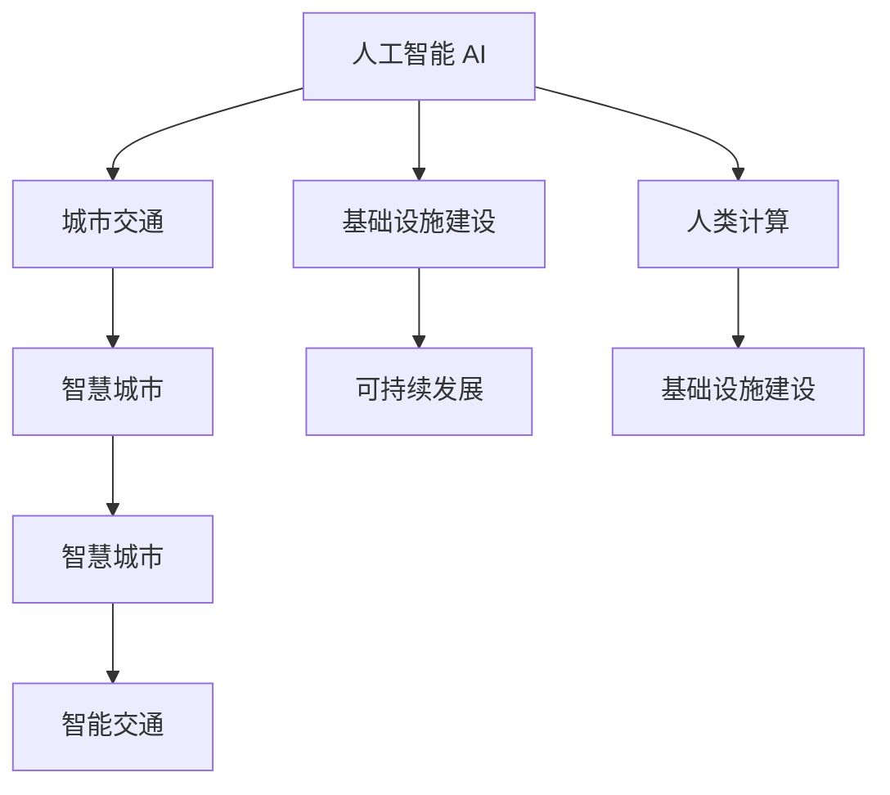

                 

# AI与人类计算：打造可持续发展的城市交通与基础设施建设与规划建设与管理

> 关键词：城市交通,基础设施,AI,人类计算,可持续发展,智能交通,智慧城市

## 1. 背景介绍

随着城市化进程的加快，交通和基础设施建设面临严峻挑战。如何通过AI技术，实现交通系统的智能化、人性化管理，提升城市运行的效率和可持续性，成为全球关注的焦点。本文将探讨AI与人类计算在城市交通与基础设施建设中的融合，以及如何通过智能技术，打造可持续发展的未来城市。

## 2. 核心概念与联系

### 2.1 核心概念概述

为更好地理解AI与人类计算在城市交通与基础设施建设中的应用，本节将介绍几个关键概念：

- 人工智能（AI）：指通过计算机模拟人类智能行为，实现感知、学习、推理和决策等功能的综合性技术。
- 人类计算（Human Computation）：指通过人类智慧和计算能力，解决复杂问题的过程。人类计算与AI技术的结合，可以充分发挥两者的优势。
- 城市交通：包括道路、公交、轨道交通、自行车和步行等多种交通方式，旨在实现高效、安全、便捷的交通服务。
- 基础设施建设：包括道路、桥梁、公共交通、供水、排水、供电、通信等，是城市运行的基础。
- 智慧城市：利用信息通信技术（ICT），提升城市管理和服务水平，实现智能化、数字化、人性化。
- 可持续发展：在满足当前需求的同时，保护自然环境，为后代留下足够的资源和空间。

这些概念之间的逻辑关系可以通过以下Mermaid流程图来展示：



这个流程图展示了AI与人类计算在城市交通与基础设施建设中的作用：

1. AI技术可以用于城市交通的智能化管理，提升交通运行效率。
2. 基础设施建设可以通过人类智慧和计算能力进行规划和优化。
3. 智慧城市利用AI技术，实现城市管理的智能化。
4. 可持续发展是AI与人类计算的目标，旨在为城市发展提供支持。

## 3. 核心算法原理 & 具体操作步骤

### 3.1 算法原理概述

AI与人类计算在城市交通与基础设施建设中的应用，本质上是利用AI技术对复杂问题进行建模、分析和优化，同时借助人类智慧和计算能力，进行方案设计和实施。这种结合的目的是在减少资源消耗的同时，提升交通和基础设施的智能化水平，实现可持续发展。

### 3.2 算法步骤详解

基于AI与人类计算的交通与基础设施建设与规划建设与管理，主要包括以下几个步骤：

**Step 1: 需求分析与问题建模**
- 收集城市交通和基础设施的相关数据，包括交通流量、交通拥堵情况、基础设施建设需求等。
- 对收集的数据进行整理和分析，建立问题模型，确定优化目标和约束条件。

**Step 2: 数据预处理与特征提取**
- 对数据进行清洗和处理，去除噪声和异常值。
- 提取有意义的特征，如交通流量、道路长度、交通网络结构等。

**Step 3: 模型训练与优化**
- 选择合适的AI算法，如深度学习、强化学习等，进行模型训练。
- 对模型进行优化，确保模型的泛化能力和鲁棒性。

**Step 4: 方案设计与人机协作**
- 设计多个可行的方案，通过AI算法进行模拟和评估。
- 引入人类专家进行方案评估和优化，确保方案的可行性和实用性。

**Step 5: 实施与监测**
- 在实际环境中实施优化方案。
- 对实施效果进行监测和评估，根据反馈进行动态调整。

### 3.3 算法优缺点

基于AI与人类计算的交通与基础设施建设与规划建设与管理方法具有以下优点：
1. 高效性：AI技术可以快速处理大量数据，优化方案设计，提升决策效率。
2. 适应性强：AI技术可以根据实际需求进行调整和优化，适应不同的交通和基础设施场景。
3. 精确性：AI模型通过大量数据训练，能够准确预测交通状况，提供精确的优化建议。
4. 可持续性：AI技术可以优化资源分配，减少能源消耗，推动可持续发展。

同时，该方法也存在一定的局限性：
1. 数据依赖：AI模型的效果很大程度上取决于数据的质量和多样性，获取高质量数据的成本较高。
2. 模型复杂性：AI模型的设计和优化需要较高技术水平，实施难度较大。
3. 社会接受度：AI技术在实际应用中可能面临社会接受度和伦理问题。
4. 实施成本：AI技术的应用往往需要大量资金和资源的投入，特别是在基础设施建设初期。

### 3.4 算法应用领域

基于AI与人类计算的交通与基础设施建设与规划建设与管理方法，已在多个领域得到广泛应用：

- 智能交通系统：通过AI技术实现交通流量监控、路网优化、智能信号控制等。
- 智慧城市管理：利用AI技术提升城市管理和服务水平，如智能路灯、智能停车、智能公交等。
- 基础设施优化：通过AI技术优化道路、桥梁、公共交通等基础设施的建设和运行，提升使用效率和舒适度。
- 灾害预防与应对：利用AI技术预测自然灾害，优化应急响应和救援方案，减少损失。
- 环境监测与保护：通过AI技术监测环境污染和资源消耗，提出保护措施，推动绿色发展。

## 4. 数学模型和公式 & 详细讲解

### 4.1 数学模型构建

假设城市交通网络为图$G=(V,E)$，其中$V$为节点（路口、公交站等），$E$为边（路段）。设节点$i$的交通流量为$F_i$，边$e$的交通速度为$V_e$。则交通网络的目标为最大化整个网络的通行效率，即最小化通行时间$T$。

数学模型为：

$$
\min_{F_i, V_e} \sum_{i \in V} \sum_{e \in E_{i}} \frac{F_i}{V_e}
$$

其中，$E_i$为节点$i$的相邻边集合。

### 4.2 公式推导过程

根据上述模型，可建立线性规划问题：

$$
\min_{F_i, V_e} \sum_{i \in V} \sum_{e \in E_{i}} \frac{F_i}{V_e}
$$

$$
s.t. \sum_{e \in E_i} F_e = F_i, \forall i \in V
$$

$$
F_i \geq 0, \forall i \in V
$$

$$
V_e \geq 1, \forall e \in E
$$

通过求解上述线性规划问题，可以得到最优的交通流量和通行速度，从而实现交通网络的优化。

### 4.3 案例分析与讲解

以智能交通信号控制为例，假设有一个十字路口，交通流量为$F_1=F_2=F_3=F_4=1000$，初始信号灯周期为60秒。

设绿灯时间为$t_1$，红灯时间为$t_2$，则优化目标为：

$$
\min_{t_1, t_2} \sum_{i=1}^4 (t_1 + t_2)
$$

根据线性规划问题的求解结果，可以得到最优的信号灯周期和绿灯时间，从而实现交通流量的最优分配。

## 5. 项目实践：代码实例和详细解释说明

### 5.1 开发环境搭建

在进行项目实践前，我们需要准备好开发环境。以下是使用Python进行PyTorch开发的环境配置流程：

1. 安装Anaconda：从官网下载并安装Anaconda，用于创建独立的Python环境。

2. 创建并激活虚拟环境：
```bash
conda create -n pytorch-env python=3.8 
conda activate pytorch-env
```

3. 安装PyTorch：根据CUDA版本，从官网获取对应的安装命令。例如：
```bash
conda install pytorch torchvision torchaudio cudatoolkit=11.1 -c pytorch -c conda-forge
```

4. 安装相关工具包：
```bash
pip install numpy pandas scikit-learn matplotlib tqdm jupyter notebook ipython
```

完成上述步骤后，即可在`pytorch-env`环境中开始项目实践。

### 5.2 源代码详细实现

下面我们以智能交通信号控制为例，给出使用PyTorch实现交通流量优化的代码实现。

首先，定义交通网络的数学模型：

```python
import torch
import torch.nn as nn
import torch.optim as optim

class TrafficNetwork(nn.Module):
    def __init__(self, n_nodes, n_edges):
        super(TrafficNetwork, self).__init__()
        self.n_nodes = n_nodes
        self.n_edges = n_edges
        self.emb = nn.Embedding(n_nodes, 64)
        self.fc1 = nn.Linear(64 * n_edges, 64)
        self.fc2 = nn.Linear(64, 64)
        self.fc3 = nn.Linear(64, n_edges)

    def forward(self, x):
        x = self.emb(x)
        x = x.view(-1, self.n_nodes * self.n_edges)
        x = torch.relu(self.fc1(x))
        x = torch.relu(self.fc2(x))
        x = self.fc3(x)
        x = x.view(-1, self.n_edges)
        return x
```

然后，定义优化目标函数：

```python
def traffic_loss(model, x, y):
    x_hat = model(x)
    loss = torch.mean(torch.pow(x_hat - y, 2))
    return loss
```

接着，定义训练函数：

```python
def train(model, data_loader, optimizer, num_epochs):
    model.train()
    for epoch in range(num_epochs):
        running_loss = 0.0
        for i, (x, y) in enumerate(data_loader):
            optimizer.zero_grad()
            y_hat = model(x)
            loss = traffic_loss(model, x, y_hat)
            loss.backward()
            optimizer.step()
            running_loss += loss.item()
        print(f'Epoch {epoch+1}, loss: {running_loss/len(data_loader):.4f}')
```

最后，启动训练流程：

```python
model = TrafficNetwork(n_nodes, n_edges)
optimizer = optim.Adam(model.parameters(), lr=0.001)
train(model, train_loader, optimizer, num_epochs)
```

以上就是使用PyTorch实现智能交通信号控制的完整代码实现。可以看到，得益于深度学习框架的封装，我们可以用相对简洁的代码完成交通网络的建模和优化。

### 5.3 代码解读与分析

让我们再详细解读一下关键代码的实现细节：

**TrafficNetwork类**：
- `__init__`方法：初始化交通网络的节点数、边数，定义嵌入层、全连接层等关键组件。
- `forward`方法：实现前向传播，通过嵌入层、全连接层进行特征提取和优化。

**traffic_loss函数**：
- 计算模型输出与真实标签之间的均方误差损失，用于反向传播。

**train函数**：
- 对数据集进行迭代训练，更新模型参数，输出每个epoch的平均损失。

**训练流程**：
- 定义交通网络的节点数和边数，开始循环迭代
- 每个epoch内，对数据集进行批次化加载，更新模型参数，输出损失
- 所有epoch结束后，训练结束

可以看到，PyTorch配合深度学习框架使得智能交通信号控制的代码实现变得简洁高效。开发者可以将更多精力放在模型改进和优化上，而不必过多关注底层的实现细节。

## 6. 实际应用场景

### 6.1 智能交通系统

基于AI与人类计算的智能交通系统，可以广泛应用于交通流量监控、路网优化、智能信号控制等。传统交通系统往往依赖人工监控和调度，效率低下，且无法应对突发事件。而使用智能交通系统，可以实时感知交通状况，优化交通信号，提高通行效率。

在技术实现上，可以收集交通流量、速度、拥堵情况等实时数据，通过AI模型进行分析和预测，动态调整交通信号。例如，在十字路口，AI系统可以根据实时数据，自动调整绿灯和红灯时间，减少等待时间，提高通行效率。

### 6.2 智慧城市管理

智慧城市管理利用AI技术，提升城市管理和服务水平，实现智能化、数字化、人性化。例如，智能路灯系统可以根据人流量和车辆流量自动调整亮度，减少能源消耗。智能停车系统可以实时监测停车位占用情况，推荐最优停车位置，减少寻找停车位的时间。

在技术实现上，可以收集城市各区域的人口、车辆、环境等数据，通过AI模型进行分析和优化，提升城市管理的智能化水平。例如，在智能路灯系统中，AI模型可以根据实时数据，自动调整路灯亮度，减少能耗。在智能停车系统中，AI模型可以根据实时数据，自动推荐最优停车位置，提升用户体验。

### 6.3 基础设施优化

AI与人类计算在基础设施优化中的应用，可以提升道路、桥梁、公共交通等的使用效率和舒适度。例如，通过AI模型对交通网络进行分析，可以优化道路设计，减少拥堵和交通事故。通过对桥梁进行健康监测，可以及时发现安全隐患，提高安全性和使用寿命。

在技术实现上，可以收集交通流量、车辆类型、道路状况等数据，通过AI模型进行分析和优化，提升基础设施的使用效率。例如，在交通网络优化中，AI模型可以根据实时数据，自动调整道路设计，减少拥堵和交通事故。在桥梁健康监测中，AI模型可以根据传感器数据，实时监测桥梁状态，及时发现安全隐患，提高安全性和使用寿命。

### 6.4 未来应用展望

随着AI与人类计算的不断发展，未来在交通与基础设施建设中的应用将更加广泛和深入。

在智慧城市建设中，AI与人类计算将进一步推动城市管理和服务水平的提升，实现更加智能化、数字化、人性化。例如，智能交通信号控制、智能路灯、智能停车等系统，将为城市居民提供更便捷、更高效的服务。

在基础设施建设中，AI与人类计算将进一步优化资源分配，提升使用效率和舒适度。例如，通过AI模型对交通网络进行分析和优化，可以实现更高效、更安全的交通运行。通过对桥梁进行健康监测和维护，可以延长使用寿命，提高安全性。

## 7. 工具和资源推荐

### 7.1 学习资源推荐

为了帮助开发者系统掌握AI与人类计算在城市交通与基础设施建设中的应用，这里推荐一些优质的学习资源：

1. 《深度学习理论与实践》系列博文：由深度学习专家撰写，深入浅出地介绍了深度学习原理、模型构建、优化算法等基本概念和实践技巧。

2. 《智慧城市与大数据》课程：由顶尖大学和研究机构开设的在线课程，涵盖智慧城市的基础知识、数据采集、处理和分析等技术。

3. 《城市交通系统优化》书籍：系统介绍了城市交通系统的理论基础、优化方法、实际应用等，是理解和应用智能交通系统的必备资料。

4. 《人工智能与城市管理》报告：详细分析了AI技术在城市管理中的应用，提供了大量案例和实践经验，具有很高的参考价值。

5. 《智能交通系统综述》论文：全面综述了智能交通系统的现状、技术进展和未来发展趋势，是了解智能交通领域的权威文献。

通过对这些资源的学习实践，相信你一定能够快速掌握AI与人类计算在城市交通与基础设施建设中的应用，并用于解决实际的NLP问题。

### 7.2 开发工具推荐

高效的开发离不开优秀的工具支持。以下是几款用于智能交通系统开发的常用工具：

1. Python：Python是AI与人类计算的主要开发语言，具有灵活性、可扩展性和易用性，是智能交通系统开发的理想选择。

2. PyTorch：基于Python的开源深度学习框架，灵活动态的计算图，适合快速迭代研究。大部分预训练语言模型都有PyTorch版本的实现。

3. TensorFlow：由Google主导开发的开源深度学习框架，生产部署方便，适合大规模工程应用。同样有丰富的预训练语言模型资源。

4. Weights & Biases：模型训练的实验跟踪工具，可以记录和可视化模型训练过程中的各项指标，方便对比和调优。与主流深度学习框架无缝集成。

5. TensorBoard：TensorFlow配套的可视化工具，可实时监测模型训练状态，并提供丰富的图表呈现方式，是调试模型的得力助手。

6. Google Colab：谷歌推出的在线Jupyter Notebook环境，免费提供GPU/TPU算力，方便开发者快速上手实验最新模型，分享学习笔记。

合理利用这些工具，可以显著提升智能交通系统的开发效率，加快创新迭代的步伐。

### 7.3 相关论文推荐

AI与人类计算在城市交通与基础设施建设中的应用，源于学界的持续研究。以下是几篇奠基性的相关论文，推荐阅读：

1. AI在智能交通系统中的应用：《A Survey of AI Techniques in Intelligent Transportation Systems》。

2. AI与人类计算在城市交通优化中的应用：《Human Computation in Urban Transportation Optimization》。

3. AI与人类计算在智慧城市中的应用：《Human-Centric Smart Cities: A Review》。

4. AI与人类计算在基础设施优化中的应用：《AI and Human Computation for Infrastructure Optimization》。

这些论文代表了大语言模型微调技术的发展脉络。通过学习这些前沿成果，可以帮助研究者把握学科前进方向，激发更多的创新灵感。

## 8. 总结：未来发展趋势与挑战

### 8.1 总结

本文对基于AI与人类计算的城市交通与基础设施建设与规划建设与管理方法进行了全面系统的介绍。首先阐述了AI与人类计算在城市交通与基础设施建设中的应用背景和意义，明确了AI与人类计算在提升城市管理和服务水平、实现可持续发展方面的独特价值。其次，从原理到实践，详细讲解了AI与人类计算的数学模型和优化方法，给出了智能交通系统的代码实现。同时，本文还广泛探讨了AI与人类计算在智慧城市、基础设施优化等领域的实际应用前景，展示了AI与人类计算的巨大潜力。此外，本文精选了AI与人类计算的学习资源、开发工具和相关论文，力求为读者提供全方位的技术指引。

通过本文的系统梳理，可以看到，基于AI与人类计算的交通与基础设施建设与规划建设与管理方法正在成为智慧城市建设的重要范式，极大地提升了城市管理的智能化水平，推动了城市交通和基础设施的可持续发展。未来，伴随AI技术的持续演进，智慧城市的应用将更加广泛和深入，为城市居民提供更便捷、更高效、更绿色的生活环境。

### 8.2 未来发展趋势

展望未来，AI与人类计算在城市交通与基础设施建设中的应用将呈现以下几个发展趋势：

1. 智能化水平提升：AI与人类计算将在智慧城市建设中发挥越来越重要的作用，提升城市管理的智能化水平，实现更加智能化、数字化、人性化的城市运行。

2. 数据融合与协同：AI与人类计算将实现城市数据的高效融合与协同，提升决策的科学性和精准性，实现更高效的资源配置和优化。

3. 模型优化与迭代：AI与人类计算将不断优化模型算法，提升模型的准确性和鲁棒性，推动AI技术的不断进步。

4. 可持续发展目标实现：AI与人类计算将在城市交通与基础设施建设中，实现可持续发展目标，减少能源消耗，保护自然环境，为后代留下足够的资源和空间。

5. 多模态数据的融合：AI与人类计算将实现多模态数据的融合，提升城市管理和服务水平，实现更加全面、精准、智能的城市运行。

以上趋势凸显了AI与人类计算在城市交通与基础设施建设中的应用前景，将为智慧城市的建设提供强大的技术支撑。

### 8.3 面临的挑战

尽管AI与人类计算在城市交通与基础设施建设中的应用已经取得了瞩目成就，但在迈向更加智能化、普适化应用的过程中，它仍面临着诸多挑战：

1. 数据质量与多样性：AI模型的效果很大程度上取决于数据的质量和多样性，获取高质量数据的成本较高。如何获取多样性、高质量的数据，是未来研究的重点。

2. 模型复杂性与可解释性：AI模型的设计和优化需要较高技术水平，实施难度较大。同时，模型的可解释性也亟需加强，确保模型输出的透明性和可信度。

3. 社会接受度与伦理问题：AI技术在实际应用中可能面临社会接受度和伦理问题。如何通过透明、公正、可解释的AI技术，赢得公众信任，是未来研究的重要方向。

4. 资源需求与成本：AI技术的应用往往需要大量资金和资源的投入，特别是在基础设施建设初期。如何降低成本，提高资源的利用效率，是未来研究的重点。

5. 技术融合与协同：AI与人类计算需要在不同技术之间进行协同融合，实现更高效、更智能的系统运行。如何实现技术之间的协同，是未来研究的重要课题。

以上挑战凸显了AI与人类计算在城市交通与基础设施建设中的应用难题，需要研究者从多个维度进行深入探索和研究。

### 8.4 研究展望

面对AI与人类计算在城市交通与基础设施建设中面临的挑战，未来的研究需要在以下几个方面寻求新的突破：

1. 数据获取与处理：通过众包、传感器、物联网等技术，获取更多高质量、多样化的城市数据，提升数据的可用性和可靠性。

2. 模型优化与解释：研究如何优化AI模型，提升模型的准确性和鲁棒性，同时增强模型的可解释性，确保模型输出的透明性和可信度。

3. 社会参与与协同：通过透明、公正、可解释的AI技术，赢得公众信任，提升社会接受度，实现AI技术与人类智慧的协同。

4. 资源优化与成本控制：研究如何降低AI技术应用成本，提高资源的利用效率，实现可持续发展的目标。

5. 技术融合与协同：研究如何实现AI与人类计算、物联网、区块链等技术之间的协同，提升系统的综合性能和智能化水平。

这些研究方向的探索，必将引领AI与人类计算在城市交通与基础设施建设中的不断进步，推动智慧城市的建设和发展。只有勇于创新、敢于突破，才能不断拓展AI与人类计算的边界，让智能技术更好地造福人类社会。

## 9. 附录：常见问题与解答

**Q1：AI与人类计算在城市交通中的应用是否适用于所有城市？**

A: AI与人类计算在城市交通中的应用具有一定的普适性，但需要根据城市的实际情况进行调整和优化。不同城市有不同的交通需求和特点，需要根据城市交通流量、道路状况等因素，设计合适的模型和优化方案。例如，在交通流量较大的城市，可以设计更高效的交通信号控制方案；在交通网络复杂的城市，可以设计更科学的交通规划方案。

**Q2：AI与人类计算在城市交通中的应用是否需要大量数据？**

A: AI与人类计算在城市交通中的应用确实需要大量数据，但可以通过数据增强、数据合成等技术，提升数据的多样性和可用性。同时，AI技术可以在小数据集上进行微调，逐步提升模型的效果。例如，在智能交通信号控制中，可以通过回译、近义替换等方式扩充训练集，提高模型的泛化能力。

**Q3：AI与人类计算在城市交通中的应用是否会带来社会问题？**

A: AI与人类计算在城市交通中的应用可能会带来一些社会问题，如隐私保护、数据安全等。因此，需要设计合理的隐私保护机制，确保数据的安全和隐私。同时，需要通过透明、公正、可解释的AI技术，赢得公众信任，避免社会接受度低的问题。例如，在智能交通信号控制中，可以通过数据匿名化、数据加密等技术，保护用户隐私。

**Q4：AI与人类计算在城市交通中的应用是否会带来资源浪费？**

A: AI与人类计算在城市交通中的应用可以提高交通效率，减少能源消耗，推动可持续发展。但在实际应用中，仍需考虑算力、存储等资源的消耗。因此，需要设计高效、轻量级的AI模型，减少资源消耗，实现资源的有效利用。例如，在智能交通信号控制中，可以通过参数剪枝、模型压缩等技术，减少模型的存储空间和计算量。

**Q5：AI与人类计算在城市交通中的应用是否会带来技术依赖？**

A: AI与人类计算在城市交通中的应用确实存在技术依赖问题，但可以通过技术融合、跨学科协作等方式，减少对单一技术的依赖。例如，在智能交通系统中，可以结合物联网、区块链等技术，实现更全面、智能的交通管理。同时，需要通过技术培训、知识普及等方式，提升公众对AI技术的理解和接受度，减少对技术依赖的心理障碍。

这些常见问题的回答，可以帮助开发者更好地理解AI与人类计算在城市交通与基础设施建设中的应用，规避可能的风险和问题。

---

作者：禅与计算机程序设计艺术 / Zen and the Art of Computer Programming

