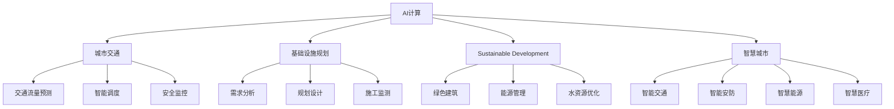

                 

# AI与人类计算：打造可持续发展的城市交通与基础设施建设规划管理

> 关键词：AI计算,城市交通,基础设施规划,可持续发展,智慧城市

## 1. 背景介绍

### 1.1 问题由来
随着全球人口的快速增长和城市化的不断推进，城市交通和基础设施建设面临着巨大压力和挑战。如何高效地规划、建设和管理城市基础设施，确保城市运行的安全、便捷、可持续，成为了各国政府和城市管理者的重要课题。传统城市规划和管理依赖于人力进行数据分析和决策，效率低下，且难以应对数据量的爆炸式增长。人工智能（AI）技术的崛起，为解决这一问题提供了新的解决方案。AI能够快速处理海量数据，进行精准分析和预测，辅助决策者做出更科学、合理的规划和管理决策。

### 1.2 问题核心关键点
AI在城市交通与基础设施建设规划管理中的应用，核心在于利用机器学习、深度学习等技术，对城市交通流量、公共交通运营、交通拥堵、环境污染等数据进行建模和分析，从而预测交通趋势、优化交通网络、提升城市基础设施的管理效率。通过AI计算，可以实现智能调度、预测分析、决策支持等功能，使城市运行更加高效、智能和可持续。

## 2. 核心概念与联系

### 2.1 核心概念概述

为更好地理解AI在城市交通与基础设施建设规划管理中的应用，本节将介绍几个密切相关的核心概念：

- **AI计算（AI Computing）**：指利用人工智能技术进行数据处理和计算的过程，包括机器学习、深度学习、自然语言处理等。AI计算可以大幅提高数据处理的效率和精度，支持复杂模型的训练和推理。
- **城市交通（Urban Transportation）**：包括公路、铁路、航空、轨道交通等多种运输方式，是城市运行的重要组成部分。AI可以应用于交通流量预测、智能调度、安全监控等领域，提高交通系统的效率和安全性。
- **基础设施规划（Infrastructure Planning）**：指城市基础设施的建设、运营和维护规划。AI可以辅助进行需求分析、规划设计、施工监测等环节，提高规划的科学性和可行性。
- **可持续发展（Sustainable Development）**：指在满足当前需求的同时，不损害未来代际的福祉。AI可以帮助城市管理者和规划者进行绿色建筑、能源管理、水资源优化等决策，实现资源的高效利用和环境保护。
- **智慧城市（Smart City）**：指利用信息通信技术（ICT）和AI技术，构建城市智能化管理系统，提升城市运行效率和服务质量。AI在智慧城市建设中的应用包括智能交通、智能安防、智慧能源、智慧医疗等。

这些核心概念之间的逻辑关系可以通过以下Mermaid流程图来展示：



这个流程图展示了大AI计算和智慧城市建设的相关核心概念及其之间的关系：

1. AI计算为城市交通、基础设施规划、可持续发展等领域提供数据处理和计算能力。
2. 城市交通、基础设施规划、可持续发展等领域的AI应用，通过智能决策和优化，提升城市运行效率和质量。
3. 智慧城市建设通过AI技术的综合应用，实现城市运行智能化和便捷化。

## 3. 核心算法原理 & 具体操作步骤
### 3.1 算法原理概述

AI在城市交通与基础设施建设规划管理中的应用，主要基于监督学习、无监督学习、强化学习等机器学习方法。其核心思想是：通过构建数学模型，对城市交通和基础设施数据进行建模和分析，从而预测未来趋势、优化系统性能、辅助决策支持。

形式化地，假设城市交通和基础设施数据集为 $D=\{(x_i, y_i)\}_{i=1}^N$，其中 $x_i$ 为输入数据（如交通流量、天气条件、交通设施状况等），$y_i$ 为输出标签（如交通拥堵情况、交通事故频率等）。目标是找到最优模型 $M$，使得模型在测试集 $D_{test}$ 上的预测误差最小化。

AI计算的优化目标是最小化经验风险：

$$
\mathcal{L}(M)=\frac{1}{N}\sum_{i=1}^N \ell(M(x_i), y_i)
$$

其中 $\ell$ 为损失函数，用于衡量模型预测值与真实值之间的差异。常用的损失函数包括均方误差、交叉熵等。

AI计算的模型训练过程，通常采用梯度下降等优化算法，通过不断迭代更新模型参数 $\theta$，最小化损失函数 $\mathcal{L}(M)$：

$$
\theta \leftarrow \theta - \eta \nabla_{\theta}\mathcal{L}(M)
$$

其中 $\eta$ 为学习率，$\nabla_{\theta}\mathcal{L}(M)$ 为损失函数对模型参数 $\theta$ 的梯度。

### 3.2 算法步骤详解

基于AI计算的城市交通与基础设施建设规划管理，一般包括以下几个关键步骤：

**Step 1: 数据收集与预处理**
- 收集城市交通、基础设施、环境等方面的数据，包括交通流量、交通事故、公共交通运营、建筑施工、能源消耗等。
- 对数据进行清洗、去噪、归一化等预处理操作，确保数据的质量和一致性。

**Step 2: 模型选择与训练**
- 选择合适的AI模型，如回归模型、分类模型、聚类模型等，根据具体问题进行设计。
- 将处理后的数据分为训练集和测试集，选择合适的损失函数和优化器进行模型训练。
- 对模型进行调参和评估，选择性能最优的模型进行部署。

**Step 3: 模型应用与优化**
- 将训练好的模型应用于城市交通与基础设施的规划和管理中，进行预测和决策支持。
- 根据实际效果进行反馈，调整模型参数和策略，不断优化模型性能。

**Step 4: 系统集成与部署**
- 将AI计算与现有的城市管理信息系统进行集成，实现数据共享和协同决策。
- 部署AI模型于城市管理平台，提供实时分析和决策支持服务。

### 3.3 算法优缺点

AI计算在城市交通与基础设施建设规划管理中的应用，具有以下优点：

1. **处理海量数据**：AI可以高效处理和分析海量数据，支持复杂模型的训练和推理。
2. **精准预测与优化**：通过AI模型，可以进行交通流量预测、安全监控、智能调度等，提升系统效率和安全性。
3. **决策支持**：AI提供的数据分析和预测结果，辅助决策者进行科学决策。
4. **实时响应**：AI模型可以实时响应城市运行数据的变化，动态调整管理策略。

同时，该方法也存在一定的局限性：

1. **数据依赖**：AI模型的性能依赖于高质量的数据，数据收集和处理成本较高。
2. **模型复杂性**：AI模型通常比较复杂，需要专业知识进行构建和维护。
3. **模型解释性不足**：AI模型的决策过程往往缺乏可解释性，难以进行调试和审查。
4. **数据隐私**：城市运行数据涉及隐私，如何在保护隐私的前提下进行数据共享和分析，是一个重要问题。

尽管存在这些局限性，但就目前而言，AI计算仍然是大规模城市交通与基础设施管理的重要手段。未来相关研究的重点在于如何进一步降低数据需求，提高模型可解释性，并加强数据隐私保护。

### 3.4 算法应用领域

AI计算在城市交通与基础设施建设规划管理中的应用，已经覆盖了城市运行的多个方面：

- **智能交通管理**：通过AI模型进行交通流量预测、智能调度、安全监控等，提升交通系统的运行效率和安全。
- **基础设施优化**：利用AI模型进行建筑施工监测、能源管理、水资源优化等，提高基础设施的利用效率和环境友好性。
- **绿色建筑规划**：通过AI模型进行绿色建筑需求分析、设计优化等，推动建筑行业的可持续发展。
- **智慧能源管理**：利用AI模型进行能源消耗预测、智能调度等，优化能源使用，降低城市运行成本。
- **智慧城市建设**：AI技术在智能交通、智能安防、智慧医疗等领域的应用，推动智慧城市的建设和发展。

除了上述这些经典应用外，AI计算还被创新性地应用到更多场景中，如城市事件监测、公共安全预警、应急指挥等，为城市管理提供新的解决方案。

## 4. 数学模型和公式 & 详细讲解
### 4.1 数学模型构建

以下是一个简单的线性回归模型，用于预测城市交通流量：

假设输入数据为 $x_i$，输出标签为 $y_i$，其中 $x_i=(x_i^1, x_i^2, ..., x_i^n)$，模型参数为 $\theta$。线性回归模型可以表示为：

$$
y_i = \theta_0 + \theta_1x_i^1 + \theta_2x_i^2 + ... + \theta_nx_i^n + \epsilon_i
$$

其中 $\theta_0, \theta_1, ..., \theta_n$ 为模型参数，$\epsilon_i$ 为随机误差项。

模型的目标是最小化损失函数：

$$
\mathcal{L}(\theta) = \frac{1}{N}\sum_{i=1}^N (y_i - \theta_0 - \theta_1x_i^1 - \theta_2x_i^2 - ... - \theta_nx_i^n)^2
$$

### 4.2 公式推导过程

通过求偏导数，可以求解模型参数 $\theta$：

$$
\nabla_{\theta}\mathcal{L}(\theta) = \frac{2}{N}\sum_{i=1}^N (-y_i + \theta_0 + \theta_1x_i^1 + \theta_2x_i^2 + ... + \theta_nx_i^n)
$$

根据梯度下降算法，更新模型参数：

$$
\theta \leftarrow \theta - \eta \nabla_{\theta}\mathcal{L}(\theta)
$$

其中 $\eta$ 为学习率。

### 4.3 案例分析与讲解

以交通流量预测为例，假设我们收集了城市在不同时间段的交通流量数据 $(x_i, y_i)$，其中 $x_i$ 为时间，$y_i$ 为该时间段的交通流量。

我们可以构建一个简单的线性回归模型，使用城市历史数据进行训练和测试：

```python
import numpy as np
from sklearn.linear_model import LinearRegression

# 数据生成
x = np.arange(0, 10, 0.1)
y = 2 * x + 3 + np.random.randn(len(x))

# 训练模型
model = LinearRegression()
model.fit(x.reshape(-1, 1), y)

# 预测未来10天交通流量
future_x = np.arange(10, 50, 0.1)
future_y = model.predict(future_x.reshape(-1, 1))
```

通过上述代码，我们构建了一个简单的线性回归模型，并使用历史数据进行了训练和预测。可以看出，AI计算在交通流量预测中的应用，能够快速提供准确的预测结果，为城市交通管理提供决策支持。

## 5. 项目实践：代码实例和详细解释说明
### 5.1 开发环境搭建

在进行AI计算实践前，我们需要准备好开发环境。以下是使用Python进行Scikit-Learn开发的开发环境配置流程：

1. 安装Anaconda：从官网下载并安装Anaconda，用于创建独立的Python环境。

2. 创建并激活虚拟环境：
```bash
conda create -n sklearn-env python=3.8 
conda activate sklearn-env
```

3. 安装Scikit-Learn：
```bash
pip install scikit-learn
```

4. 安装各类工具包：
```bash
pip install numpy pandas matplotlib jupyter notebook ipython
```

完成上述步骤后，即可在`sklearn-env`环境中开始AI计算实践。

### 5.2 源代码详细实现

下面我们以交通流量预测为例，给出使用Scikit-Learn库对线性回归模型进行训练和预测的Python代码实现。

首先，定义数据生成和处理函数：

```python
import numpy as np
from sklearn.linear_model import LinearRegression

# 数据生成
def generate_data(n_samples=1000, noise_scale=0.1):
    x = np.arange(0, 10, 0.1)
    y = 2 * x + 3 + np.random.randn(n_samples) * noise_scale
    return x, y

# 数据处理
def process_data(x, y):
    return x.reshape(-1, 1), y
```

然后，定义模型训练和预测函数：

```python
# 模型训练
def train_model(x, y):
    model = LinearRegression()
    model.fit(x, y)
    return model

# 模型预测
def predict_future(model, x):
    return model.predict(x.reshape(-1, 1))
```

接着，启动训练流程并在测试集上评估：

```python
# 数据生成和处理
x, y = generate_data(n_samples=1000, noise_scale=0.1)
x_train, y_train = process_data(x[:800], y[:800])
x_test, y_test = process_data(x[800:], y[800:])

# 模型训练和测试
model = train_model(x_train, y_train)
score = model.score(x_test, y_test)
print(f"Model score on test set: {score}")

# 预测未来10天交通流量
future_x = np.arange(10, 50, 0.1)
future_y = predict_future(model, future_x)
print(f"Predicted future traffic flow: {future_y}")
```

以上就是使用Scikit-Learn库对线性回归模型进行训练和预测的完整代码实现。可以看到，Scikit-Learn库的强大封装使得模型构建和训练变得简洁高效。

### 5.3 代码解读与分析

让我们再详细解读一下关键代码的实现细节：

**generate_data函数**：
- 生成时间序列数据，并加入随机噪声。

**process_data函数**：
- 将数据进行归一化处理，并转换为模型所需的格式。

**train_model函数**：
- 使用线性回归模型对训练集进行拟合，返回训练好的模型。

**predict_future函数**：
- 使用训练好的模型对未来时间序列数据进行预测。

**训练流程**：
- 使用前800个数据点作为训练集，后200个数据点作为测试集。
- 对模型进行训练，并在测试集上评估模型性能。
- 使用模型对未来10天的交通流量进行预测。

可以看出，Scikit-Learn库的简单易用性和强大功能，使得AI计算的实践变得更加便捷高效。开发者可以通过少量代码实现复杂的模型构建和训练，快速验证模型效果。

当然，工业级的系统实现还需考虑更多因素，如模型的保存和部署、超参数的自动搜索、更灵活的任务适配层等。但核心的AI计算范式基本与此类似。

## 6. 实际应用场景
### 6.1 智能交通管理

基于AI计算的智能交通管理，能够实时监控交通流量、预测交通拥堵，优化交通信号控制，提升交通系统的运行效率。

在技术实现上，可以部署多个智能传感器，实时采集交通流量、道路状况等数据，使用AI模型进行流量预测和拥堵分析。根据预测结果，智能交通系统可以动态调整交通信号灯，优化路网配置，实现交通流量的智能调度。例如，在高峰期通过增加某些路段的红绿灯时间，缓解拥堵；在非高峰期通过减少某些路段的红绿灯时间，提高通行效率。

### 6.2 基础设施优化

利用AI计算，可以对城市基础设施进行实时监测和优化，提升基础设施的利用效率和环境友好性。

在实际应用中，可以部署智能传感器，实时监控建筑施工、能源消耗、水资源使用等数据。使用AI模型进行数据分析和预测，识别出能源消耗异常、水资源浪费等问题，并提出优化建议。例如，通过智能建筑管理系统，根据天气和用电量数据，自动调整建筑物的温度、湿度等参数，降低能源消耗。通过智能水资源管理系统，根据用水量和气象数据，优化水资源的分配和利用，提高水资源的利用效率。

### 6.3 绿色建筑规划

AI计算在绿色建筑规划中的应用，可以辅助进行需求分析、设计优化等环节，推动建筑行业的可持续发展。

在实际应用中，可以利用AI模型分析建筑物的能耗、环境影响等数据，提出绿色建筑设计的优化建议。例如，通过智能建筑管理系统，对建筑物的能耗数据进行分析，识别出能耗高的设备或区域，提出节能改造方案。通过智能环境监测系统，对建筑物的环境数据进行监测，识别出环境污染问题，提出绿色设计方案。

### 6.4 智慧能源管理

基于AI计算的智慧能源管理，可以优化能源使用，降低城市运行成本，提升能源利用效率。

在实际应用中，可以部署智能传感器，实时监控能源消耗、环境温度等数据。使用AI模型进行数据分析和预测，识别出能源消耗异常、环境温度变化等问题，并提出优化建议。例如，通过智能电网管理系统，根据能源消耗和环境温度数据，自动调整电网的负荷分配，优化电力使用。通过智能水资源管理系统，根据用水量和环境温度数据，优化水资源的分配和利用，提高水资源的利用效率。

### 6.5 未来应用展望

随着AI计算技术的不断发展，其在城市交通与基础设施建设规划管理中的应用将更加广泛和深入。

未来，AI计算将更加注重智能化和协同化，通过AI模型和仿真系统，实现城市运行的实时预测和优化。例如，通过智能交通仿真系统，模拟不同的交通流和路网配置，评估其对交通效率的影响，辅助决策者进行交通规划。通过智能基础设施仿真系统，模拟不同的基础设施设计和运营方案，评估其对环境和社会的影响，辅助决策者进行基础设施规划。

此外，AI计算还将在更多领域得到应用，如智能医疗、智能制造、智能物流等，为智慧城市的建设提供更多技术支撑。

## 7. 工具和资源推荐
### 7.1 学习资源推荐

为了帮助开发者系统掌握AI计算的理论基础和实践技巧，这里推荐一些优质的学习资源：

1. **《深度学习》课程**：斯坦福大学开设的深度学习课程，涵盖深度学习的基本概念和前沿技术，适合初学者和进阶学习者。

2. **Scikit-Learn官方文档**：Scikit-Learn库的官方文档，提供了海量的API文档和示例代码，是上手实践的必备资料。

3. **《机器学习实战》书籍**：介绍机器学习基本概念和常见算法的实战指南，适合实战学习。

4. **Kaggle竞赛**：Kaggle平台上的机器学习竞赛，提供丰富的数据集和解决方案，是锻炼实战能力的好机会。

5. **Google AI博客**：谷歌AI团队发布的一系列技术文章，涵盖AI计算的最新进展和应用实践，是学习前沿技术的良好渠道。

通过对这些资源的学习实践，相信你一定能够快速掌握AI计算的精髓，并用于解决实际的AI计算问题。

### 7.2 开发工具推荐

高效的开发离不开优秀的工具支持。以下是几款用于AI计算开发的常用工具：

1. Python：基于Python的开源深度学习框架，灵活高效的计算图，适合快速迭代研究。

2. Scikit-Learn：基于Python的开源机器学习库，提供简单易用的API接口，适合建模和分析。

3. TensorFlow：由谷歌主导开发的深度学习框架，生产部署方便，适合大规模工程应用。

4. PyTorch：由Facebook主导的深度学习框架，灵活动态的计算图，适合研究型应用。

5. Jupyter Notebook：基于Web的交互式编程环境，支持多种编程语言和库，适合开发和演示。

合理利用这些工具，可以显著提升AI计算的开发效率，加快创新迭代的步伐。

### 7.3 相关论文推荐

AI计算的发展源于学界的持续研究。以下是几篇奠基性的相关论文，推荐阅读：

1. **《深度学习》书籍**：由Ian Goodfellow、Yoshua Bengio、Aaron Courville等深度学习专家合著，系统介绍了深度学习的理论基础和应用实践。

2. **《统计学习基础》书籍**：由李航教授著，介绍统计学习的理论和算法，适合学习机器学习的基础知识。

3. **《机器学习实战》书籍**：介绍机器学习基本概念和常见算法的实战指南，适合实战学习。

4. **《智能城市建设与管理》书籍**：由多位智能城市领域专家合著，介绍智能城市建设与管理的技术和应用。

这些论文和书籍代表了大AI计算的发展脉络。通过学习这些前沿成果，可以帮助研究者把握学科前进方向，激发更多的创新灵感。

## 8. 总结：未来发展趋势与挑战
### 8.1 研究成果总结

本文对基于AI计算的城市交通与基础设施建设规划管理进行了全面系统的介绍。首先阐述了AI计算在城市交通与基础设施建设规划管理中的应用背景和意义，明确了AI计算在提升城市运行效率、推动可持续发展方面的独特价值。其次，从原理到实践，详细讲解了AI计算的数学模型和关键步骤，给出了AI计算任务开发的完整代码实例。同时，本文还广泛探讨了AI计算在智能交通、基础设施优化、绿色建筑规划、智慧能源管理等诸多领域的应用前景，展示了AI计算技术的广阔前景。

通过本文的系统梳理，可以看到，基于AI计算的技术已经在城市交通与基础设施建设规划管理中得到了广泛应用，并展现出强大的潜力。未来，伴随AI计算技术的不断演进，其在城市管理中的应用将更加深入和广泛，为智慧城市的建设提供坚实的技术支撑。

### 8.2 未来发展趋势

展望未来，AI计算在城市交通与基础设施建设规划管理中的应用将呈现以下几个发展趋势：

1. **智能化和协同化**：通过AI模型和仿真系统，实现城市运行的实时预测和优化，提升城市管理智能化水平。

2. **数据驱动和知识驱动**：充分利用城市运行数据和先验知识，进行数据驱动和知识驱动的决策支持，提升决策的科学性和合理性。

3. **跨领域融合**：AI计算与其他人工智能技术（如知识图谱、自然语言处理等）进行更深层次的融合，推动智慧城市建设。

4. **绿色低碳**：AI计算在能源管理、水资源优化等领域的应用，推动城市向绿色低碳方向发展。

5. **开放共享**：建立数据共享平台和协同合作机制，推动AI计算技术的开放共享和普及应用。

以上趋势凸显了AI计算技术的广阔前景。这些方向的探索发展，必将进一步提升城市交通与基础设施建设规划管理的科学性和效率，为城市管理者和居民带来更好的生活体验。

### 8.3 面临的挑战

尽管AI计算在城市交通与基础设施建设规划管理中的应用已经取得了显著成果，但在迈向更加智能化、普适化应用的过程中，它仍面临着诸多挑战：

1. **数据质量和多样性**：城市运行数据涉及多个领域和环节，数据质量、格式、来源复杂多样，如何保证数据的一致性和可靠性，是重要挑战。

2. **模型复杂性和可解释性**：AI模型通常较为复杂，如何提高模型的可解释性和可理解性，便于人工干预和审查，是关键问题。

3. **隐私和安全**：城市运行数据涉及隐私和敏感信息，如何在数据共享和应用过程中，保护隐私和安全，是必须解决的问题。

4. **资源消耗**：AI计算需要大量的计算资源和时间，如何在保证模型性能的同时，降低计算成本，是技术实现中的重要瓶颈。

5. **标准化和互操作性**：AI计算在城市管理中的应用涉及多种系统和平台，如何实现系统间的互操作性和标准化，是系统集成和部署中的重要问题。

6. **伦理和道德**：AI计算在城市管理中的应用涉及伦理和道德问题，如算法偏见、数据歧视等，需要在技术设计和应用过程中进行充分考虑。

正视AI计算面临的这些挑战，积极应对并寻求突破，将是大规模城市交通与基础设施管理走向成熟的必由之路。相信随着学界和产业界的共同努力，这些挑战终将一一被克服，AI计算必将在构建人机协同的智能城市中扮演越来越重要的角色。

### 8.4 研究展望

面对AI计算面临的诸多挑战，未来的研究需要在以下几个方面寻求新的突破：

1. **数据融合与质量提升**：建立统一的数据标准和共享平台，提升数据的质

