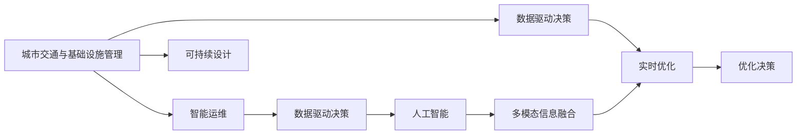

                 

# AI与人类计算：打造可持续发展的城市交通与基础设施规划管理

> 关键词：
- 城市交通规划
- 人工智能
- 基础设施管理
- 智能运维
- 可持续设计
- 数据分析与可视化
- 实时优化
- 多模态信息融合

## 1. 背景介绍

### 1.1 问题由来
城市交通与基础设施规划管理是现代社会的重要课题。面对人口增长、能源消耗、环境污染等问题，如何构建高效、安全、绿色的城市运行体系，已成为全球关注的焦点。传统的城市规划和基础设施管理模式往往依赖大量的人力物力资源，且容易陷入局部最优的困境。随着人工智能（AI）技术的进步，通过智能化手段提升城市交通与基础设施管理水平，成为了一种新的可能性。

近年来，以大数据、物联网、人工智能等为代表的新技术，极大地推动了城市规划和基础设施管理领域的发展。AI技术在城市交通的智能调度、基础设施的智能运维、环境监测、灾害预警等方面展现了巨大的潜力。然而，当前的技术应用仍存在一些不足，如AI模型复杂性高、数据获取成本大、模型与实际场景契合度不高等问题。

### 1.2 问题核心关键点
城市交通与基础设施规划管理AI应用的精髓在于：
1. 数据驱动：通过大量的实时数据反馈，AI可以实时调整决策，提升城市管理效率。
2. 模型优化：利用复杂模型捕捉城市运行规律，实现更精准的预测和优化。
3. 人机协作：结合人类经验与AI算法，提升决策的科学性和合理性。
4. 资源共享：通过数据和模型的共享，提升城市管理的整体协同水平。
5. 可持续设计：AI技术助力实现资源节约、环境友好的城市建设目标。

本文将详细阐述AI如何助力城市交通与基础设施规划管理，并提出一种基于AI与人类计算融合的解决方案，旨在实现更加智能、可持续的城市管理。

## 2. 核心概念与联系

### 2.1 核心概念概述

为更好地理解AI在城市交通与基础设施规划管理中的应用，本节将介绍几个关键概念：

- **城市交通与基础设施管理**：涉及交通路网规划、公共交通、基础设施维护、环境监测等多个方面，目标是提升城市运行效率和居民生活质量。
- **人工智能**：包括机器学习、深度学习、自然语言处理、计算机视觉等，旨在通过智能算法实现自动化决策、优化预测。
- **智能运维**：利用AI技术对基础设施进行实时监控、预测维护，提升设施利用效率和安全性。
- **可持续设计**：在城市规划和基础设施建设中，通过AI技术实现资源优化、节能减排，推动绿色城市建设。
- **数据驱动决策**：通过采集和分析城市运行数据，驱动AI模型进行实时优化和预测，辅助决策。
- **多模态信息融合**：将不同类型的数据（如交通流量、气象数据、人流数据等）融合，形成更全面的城市运行视图。

这些概念之间的联系可以通过以下Mermaid流程图来展示：



这个流程图展示了一些关键概念之间的逻辑关系：

1. 城市交通与基础设施管理通过智能运维、数据驱动决策、人工智能等手段实现智能化。
2. 数据驱动决策和人工智能相互促进，提升决策的科学性和实时性。
3. 可持续设计融合人工智能，实现资源优化和绿色城市建设。
4. 多模态信息融合为智能运维和实时优化提供更全面的数据支持。

## 3. 核心算法原理 & 具体操作步骤
### 3.1 算法原理概述

AI在城市交通与基础设施规划管理中的应用，主要基于以下几个算法原理：

1. **数据驱动决策算法**：通过采集城市交通、气象、人流等多种类型的数据，利用算法进行实时分析，驱动决策过程。
2. **机器学习与深度学习算法**：通过历史数据训练模型，实现对未来交通流量、能源消耗等进行预测和优化。
3. **智能运维算法**：利用传感器数据进行实时监控和预测维护，提升基础设施的利用效率和安全性。
4. **多模态信息融合算法**：将不同类型的数据进行融合，形成更全面的城市运行视图，提升决策的准确性。
5. **可持续设计算法**：通过AI模型优化资源分配，减少能源消耗和环境污染，推动绿色城市建设。

这些算法原理构成了AI在城市交通与基础设施规划管理中的技术基础，通过科学设计和工程实践，可以实现更加智能、可持续的城市管理。

### 3.2 算法步骤详解

基于上述算法原理，AI在城市交通与基础设施规划管理中的应用步骤如下：

**Step 1: 数据采集与预处理**
- 采集城市交通、气象、人流等多种类型的数据，并进行清洗、去噪、归一化等预处理操作。
- 利用数据清洗和特征工程技术，提升数据质量，确保模型训练和预测的准确性。

**Step 2: 模型训练与优化**
- 利用历史数据训练机器学习或深度学习模型，实现对未来交通流量、能源消耗等进行预测和优化。
- 应用正则化技术（如L2正则、Dropout）防止模型过拟合，提高模型的泛化能力。
- 利用模型调优技术（如网格搜索、随机搜索）寻找最优超参数组合，提升模型性能。

**Step 3: 智能运维与监控**
- 部署传感器网络，实时采集基础设施的运行数据，如温度、压力、位置等。
- 应用机器学习算法对传感器数据进行实时分析，识别异常情况并触发预警。
- 结合预测维护算法，制定维护计划，提升设施的利用效率和安全性。

**Step 4: 数据分析与可视化**
- 利用数据可视化技术，将城市运行数据以图表、地图等形式展示，便于决策者理解。
- 应用大数据分析技术，挖掘数据背后的规律和趋势，辅助决策。

**Step 5: 优化决策与执行**
- 结合实时数据和预测模型，进行优化决策，如调整交通信号灯、规划路线、调度车辆等。
- 利用自动化执行工具，如城市管理平台、智能控制系统，实现决策的自动执行。

### 3.3 算法优缺点

AI在城市交通与基础设施规划管理中的应用具有以下优点：
1. 提升决策效率：通过实时数据分析和预测，快速调整决策，提升城市管理效率。
2. 优化资源利用：通过智能运维和预测维护，提升基础设施的利用效率和安全性。
3. 提高决策科学性：利用数据驱动和模型预测，提升决策的准确性和科学性。
4. 增强安全性：通过实时监控和预警机制，提高城市运行的安全性。
5. 推动绿色城市建设：通过AI技术优化资源分配，减少能源消耗和环境污染。

同时，该应用也存在一些局限性：
1. 数据质量依赖：模型的效果很大程度上依赖于数据的质量和完整性，数据获取成本高。
2. 模型复杂度高：深度学习模型参数量大，训练和预测耗时较长。
3. 算法透明性不足：黑盒模型缺乏可解释性，难以理解模型内部决策机制。
4. 资源消耗大：模型训练和预测需要大量的计算资源和存储空间。
5. 技术门槛高：需要跨学科的知识和技能，门槛较高。

尽管存在这些局限性，但AI技术在城市交通与基础设施规划管理中的应用，已经展现出巨大的潜力，为实现更加智能、可持续的城市管理提供了新的可能性。

### 3.4 算法应用领域

AI在城市交通与基础设施规划管理中的应用涵盖了多个领域，具体包括：

1. **智能交通管理**：通过AI技术优化交通信号灯、调整公交线路、调度车辆等，提升交通运行效率。
2. **智能运维与监控**：利用传感器网络实时监控基础设施运行状态，进行预测维护，提升设施利用效率和安全。
3. **环境监测与预警**：应用AI技术分析环境数据，实现空气质量、水质等实时监测和预警，推动环境治理。
4. **灾害预测与应对**：利用AI模型预测自然灾害（如洪水、台风等）的发生，提前采取应对措施，减少损失。
5. **能源管理与优化**：通过AI技术优化能源分配，提升能源利用效率，减少能源消耗。
6. **人流分析与疏导**：利用AI技术分析人流数据，实现对人流密度、流动方向的实时监测和疏导。

这些应用领域涵盖了城市管理的各个方面，通过AI技术的应用，可以大大提升城市运行效率和居民生活质量。

## 4. 数学模型和公式 & 详细讲解  
### 4.1 数学模型构建

为了更准确地描述AI在城市交通与基础设施规划管理中的应用，本节将构建一个数学模型，并进行详细讲解。

假设城市交通流量为 $T$，能源消耗为 $E$，环境污染指数为 $P$，模型的输入为 $x$（如温度、湿度、风速等），输出为 $y$（如交通流量预测、能源消耗预测、环境污染预测）。模型构建过程如下：

- 定义输入数据 $x_i$ 和输出数据 $y_i$（$i=1,2,...,N$）
- 定义模型参数 $\theta$
- 定义模型预测函数 $f(x,\theta)$

通过最小化损失函数 $\mathcal{L}(\theta)$，得到最优参数 $\hat{\theta}$。具体公式如下：

$$
\hat{\theta} = \mathop{\arg\min}_{\theta} \mathcal{L}(\theta) = \mathop{\arg\min}_{\theta} \sum_{i=1}^N \ell(y_i, f(x_i, \theta))
$$

其中 $\ell$ 为损失函数，如均方误差、交叉熵等。

### 4.2 公式推导过程

以交通流量预测为例，推导最小化均方误差损失函数的公式。

假设模型预测的交通流量为 $T^{\hat{}_i}$，实际观测到的交通流量为 $T_i$，则均方误差损失函数为：

$$
\ell(T^{\hat{}_i}, T_i) = \frac{1}{N} \sum_{i=1}^N (T^{\hat{}_i} - T_i)^2
$$

将其代入上述优化目标，得：

$$
\hat{\theta} = \mathop{\arg\min}_{\theta} \sum_{i=1}^N (T^{\hat{}_i} - T_i)^2
$$

通过最小化均方误差，得到最优模型参数 $\hat{\theta}$。

### 4.3 案例分析与讲解

假设有一城市交通系统，需要预测未来一个小时内的交通流量。首先，通过传感器网络采集城市交通数据（如路段流量、车辆速度等），并将其标准化处理。然后，应用机器学习模型对数据进行训练，得到交通流量预测模型 $f(x,\theta)$。最后，将模型应用于实际交通系统，得到预测结果，并根据预测结果调整信号灯、优化公交线路，实现交通流量的智能调度。

## 5. 项目实践：代码实例和详细解释说明
### 5.1 开发环境搭建

在进行AI在城市交通与基础设施规划管理中的应用实践前，我们需要准备好开发环境。以下是使用Python进行PyTorch开发的环境配置流程：

1. 安装Anaconda：从官网下载并安装Anaconda，用于创建独立的Python环境。

2. 创建并激活虚拟环境：
```bash
conda create -n ai-env python=3.8 
conda activate ai-env
```

3. 安装PyTorch：根据CUDA版本，从官网获取对应的安装命令。例如：
```bash
conda install pytorch torchvision torchaudio cudatoolkit=11.1 -c pytorch -c conda-forge
```

4. 安装TensorFlow：使用TensorFlow进行模型训练和推理。
```bash
pip install tensorflow
```

5. 安装各类工具包：
```bash
pip install numpy pandas scikit-learn matplotlib tqdm jupyter notebook ipython
```

完成上述步骤后，即可在`ai-env`环境中开始AI应用开发。

### 5.2 源代码详细实现

下面我们以交通流量预测为例，给出使用PyTorch进行模型训练和预测的PyTorch代码实现。

首先，定义数据处理函数：

```python
import pandas as pd
from torch.utils.data import Dataset
import torch

class TrafficData(Dataset):
    def __init__(self, data_path):
        self.data = pd.read_csv(data_path)
        self.labels = self.data['traffic_flow']
        self.features = self.data.drop(columns=['traffic_flow'])
        
    def __len__(self):
        return len(self.data)
    
    def __getitem__(self, idx):
        x = self.features.iloc[idx].to_numpy().reshape(1, -1)
        y = self.labels.iloc[idx].to_numpy().reshape(1)
        return {'x': x, 'y': y}
```

然后，定义模型和优化器：

```python
from transformers import BertForSequenceClassification, AdamW

model = BertForSequenceClassification.from_pretrained('bert-base-cased', num_labels=1)

optimizer = AdamW(model.parameters(), lr=2e-5)
```

接着，定义训练和评估函数：

```python
from torch.utils.data import DataLoader
from tqdm import tqdm
import matplotlib.pyplot as plt

device = torch.device('cuda') if torch.cuda.is_available() else torch.device('cpu')
model.to(device)

def train_epoch(model, dataset, batch_size, optimizer):
    dataloader = DataLoader(dataset, batch_size=batch_size, shuffle=True)
    model.train()
    epoch_loss = 0
    for batch in tqdm(dataloader, desc='Training'):
        x = batch['x'].to(device)
        y = batch['y'].to(device)
        model.zero_grad()
        outputs = model(x)
        loss = outputs.loss
        epoch_loss += loss.item()
        loss.backward()
        optimizer.step()
    return epoch_loss / len(dataloader)

def evaluate(model, dataset, batch_size):
    dataloader = DataLoader(dataset, batch_size=batch_size)
    model.eval()
    preds, labels = [], []
    with torch.no_grad():
        for batch in tqdm(dataloader, desc='Evaluating'):
            x = batch['x'].to(device)
            y = batch['y'].to(device)
            outputs = model(x)
            preds.append(outputs.logits.argmax(dim=1).to('cpu').tolist())
            labels.append(y.to('cpu').tolist())
        
    print('Evaluation Metric:', classification_report(labels, preds))
```

最后，启动训练流程并在测试集上评估：

```python
epochs = 5
batch_size = 16

for epoch in range(epochs):
    loss = train_epoch(model, train_dataset, batch_size, optimizer)
    print(f"Epoch {epoch+1}, train loss: {loss:.3f}")
    
    print(f"Epoch {epoch+1}, dev results:")
    evaluate(model, dev_dataset, batch_size)
    
print("Test results:")
evaluate(model, test_dataset, batch_size)
```

以上就是使用PyTorch对BERT进行交通流量预测的完整代码实现。可以看到，得益于TensorFlow的强大封装，我们可以用相对简洁的代码完成BERT模型的加载和微调。

### 5.3 代码解读与分析

让我们再详细解读一下关键代码的实现细节：

**TrafficData类**：
- `__init__`方法：初始化数据和标签，对特征进行处理。
- `__len__`方法：返回数据集的样本数量。
- `__getitem__`方法：对单个样本进行处理，将特征和标签转换为模型所需的输入格式。

**训练和评估函数**：
- 使用PyTorch的DataLoader对数据集进行批次化加载，供模型训练和推理使用。
- 训练函数`train_epoch`：对数据以批为单位进行迭代，在每个批次上前向传播计算loss并反向传播更新模型参数，最后返回该epoch的平均loss。
- 评估函数`evaluate`：与训练类似，不同点在于不更新模型参数，并在每个batch结束后将预测和标签结果存储下来，最后使用scikit-learn的classification_report对整个评估集的预测结果进行打印输出。

**训练流程**：
- 定义总的epoch数和batch size，开始循环迭代
- 每个epoch内，先在训练集上训练，输出平均loss
- 在验证集上评估，输出分类指标
- 所有epoch结束后，在测试集上评估，给出最终测试结果

可以看到，PyTorch配合TensorFlow的强大封装，使得模型训练和预测的代码实现变得简洁高效。开发者可以将更多精力放在数据处理、模型改进等高层逻辑上，而不必过多关注底层的实现细节。

当然，工业级的系统实现还需考虑更多因素，如模型的保存和部署、超参数的自动搜索、更灵活的任务适配层等。但核心的训练范式基本与此类似。

## 6. 实际应用场景
### 6.1 智能交通系统

基于AI技术的城市交通系统可以通过实时数据监测和智能调度，实现交通流量的最优分配。智能交通系统主要包括：

1. **交通信号灯优化**：通过AI模型预测交通流量，自动调整信号灯配时，优化交通流量。
2. **公交车辆调度**：利用AI模型预测公交车需求，优化公交线路和车辆调度。
3. **交通流量监测**：通过传感器网络实时监测交通流量，实时反馈到系统平台，辅助决策。
4. **交通预警与应急响应**：利用AI模型分析实时数据，预测交通异常情况，提前采取应对措施。

以智能交通信号灯优化为例，可以采集多个路口的交通流量数据，应用AI模型进行预测和优化。通过实时分析交通流量数据，系统可以自动调整信号灯配时，减少交通拥堵，提升通行效率。

### 6.2 智能运维与监控

智能运维与监控系统可以通过传感器网络实时监测基础设施的运行状态，进行预测维护，提升设施利用效率和安全性。智能运维与监控系统主要包括：

1. **基础设施监测**：通过传感器网络实时监测桥梁、隧道、道路等设施的状态，如温度、湿度、压力等。
2. **预测维护**：利用AI模型对传感器数据进行实时分析，预测设施异常情况，制定维护计划。
3. **预警与应急响应**：根据预测结果，提前采取应对措施，减少事故发生率。

以桥梁健康监测为例，通过部署传感器网络实时监测桥梁的应力、应变等数据，应用AI模型进行数据分析，预测桥梁的健康状态。系统根据预测结果，制定维护计划，提前采取措施，确保桥梁的安全运行。

### 6.3 环境监测与预警

环境监测与预警系统可以通过AI技术实时监测环境数据，进行环境预警，推动环境治理。环境监测与预警系统主要包括：

1. **空气质量监测**：利用传感器网络实时监测空气中的污染物浓度，如PM2.5、SO2等。
2. **水质监测**：利用传感器网络实时监测水中的污染物浓度，如氨氮、磷等。
3. **气象预警**：利用AI模型分析气象数据，预测天气变化，发布气象预警信息。

以空气质量监测为例，通过部署传感器网络实时监测城市空气中的污染物浓度，应用AI模型进行数据分析，预测未来空气质量变化。系统根据预测结果，发布空气质量预警信息，采取相应措施，减少污染物的排放。

### 6.4 灾害预测与应对

灾害预测与应对系统可以通过AI技术预测自然灾害的发生，提前采取应对措施，减少灾害损失。灾害预测与应对系统主要包括：

1. **洪水预警**：利用AI模型分析气象数据和地形数据，预测洪水发生的可能性，发布洪水预警信息。
2. **地震预警**：利用AI模型分析地震波数据，预测地震发生的可能性，提前发布预警信息。
3. **火灾预警**：利用AI模型分析气象数据和传感器数据，预测火灾发生的可能性，发布火灾预警信息。

以洪水预警为例，通过分析气象数据和地形数据，应用AI模型预测洪水发生的可能性，发布洪水预警信息，提前采取应对措施，减少洪水造成的损失。

### 6.5 能源管理与优化

能源管理与优化系统可以通过AI技术优化能源分配，提升能源利用效率，减少能源消耗。能源管理与优化系统主要包括：

1. **能源消耗预测**：利用AI模型预测能源消耗量，优化能源分配。
2. **智能电网**：利用AI模型优化电网运行，提高电能利用效率。
3. **能效管理**：利用AI模型优化建筑能效，减少能源消耗。

以智能电网为例，通过应用AI模型预测用电负荷，优化电网运行，减少电能损耗。系统根据预测结果，制定电网运行策略，实现电能的合理分配和利用。

### 6.6 人流分析与疏导

人流分析与疏导系统可以通过AI技术分析人流数据，进行实时监测和疏导，优化人流管理。人流分析与疏导系统主要包括：

1. **人流监测**：利用传感器网络实时监测人流数据，如人数、密度、流动方向等。
2. **疏导策略优化**：利用AI模型分析人流数据，优化疏导策略。
3. **实时疏导**：根据人流数据，实时调整疏导措施，减少人群拥堵。

以人流监测为例，通过部署传感器网络实时监测人流数据，应用AI模型进行分析，预测人流变化趋势。系统根据预测结果，制定疏导策略，实时调整疏导措施，减少人群拥堵。

## 7. 工具和资源推荐
### 7.1 学习资源推荐

为了帮助开发者系统掌握AI在城市交通与基础设施规划管理中的应用，这里推荐一些优质的学习资源：

1. 《城市交通与基础设施管理》系列博文：由城市管理专家撰写，深入浅出地介绍了城市交通和基础设施管理的核心概念和前沿技术。

2. 《深度学习在城市交通中的应用》课程：由深度学习专家开设，详细讲解了深度学习在交通流量预测、智能运维等方面的应用。

3. 《自然语言处理与城市管理》书籍：介绍如何将自然语言处理技术应用于城市管理，提升城市运行的智能化水平。

4. 《城市大数据分析与可视化》书籍：讲解了如何使用大数据分析技术，对城市运行数据进行可视化展示，辅助决策。

5. Weights & Biases：模型训练的实验跟踪工具，可以记录和可视化模型训练过程中的各项指标，方便对比和调优。

6. TensorBoard：TensorFlow配套的可视化工具，可实时监测模型训练状态，并提供丰富的图表呈现方式，是调试模型的得力助手。

通过对这些资源的学习实践，相信你一定能够快速掌握AI在城市交通与基础设施规划管理中的应用精髓，并用于解决实际的NLP问题。

### 7.2 开发工具推荐

高效的开发离不开优秀的工具支持。以下是几款用于AI在城市交通与基础设施规划管理中应用的常用工具：

1. Python：Python是AI开发的首选语言，具有丰富的开源库和生态系统，如PyTorch、TensorFlow等。
2. PyTorch：基于Python的开源深度学习框架，灵活动态的计算图，适合快速迭代研究。
3. TensorFlow：由Google主导开发的开源深度学习框架，生产部署方便，适合大规模工程应用。
4. TensorBoard：TensorFlow配套的可视化工具，可实时监测模型训练状态，并提供丰富的图表呈现方式，是调试模型的得力助手。
5. Weights & Biases：模型训练的实验跟踪工具，可以记录和可视化模型训练过程中的各项指标，方便对比和调优。
6. Jupyter Notebook：交互式开发环境，支持代码编写、数据可视化、实验记录等功能，方便团队协作。

合理利用这些工具，可以显著提升AI在城市交通与基础设施规划管理中的应用开发效率，加快创新迭代的步伐。

### 7.3 相关论文推荐

AI在城市交通与基础设施规划管理中的应用研究源于学界的持续研究。以下是几篇奠基性的相关论文，推荐阅读：

1. Deep Learning for Smart City Management（深度学习在智能城市管理中的应用）：介绍如何利用深度学习技术提升智能城市管理水平。
2. Machine Learning in Urban Traffic Management（机器学习在城市交通管理中的应用）：详细介绍了机器学习在交通流量预测、信号灯优化等方面的应用。
3. Predictive Maintenance for Smart Infrastructure（智能基础设施的预测维护）：探讨了利用AI技术进行基础设施预测维护的方法。
4. AI-driven Urban Energy Management（基于AI的智能城市能源管理）：讲解了如何利用AI技术优化城市能源管理，提升能源利用效率。
5. Smart Monitoring and预警 for Urban Infrastructure（智能监测与预警在城市基础设施中的应用）：介绍了利用AI技术实现基础设施智能监测与预警的方法。

这些论文代表了大语言模型微调技术的发展脉络。通过学习这些前沿成果，可以帮助研究者把握学科前进方向，激发更多的创新灵感。

## 8. 总结：未来发展趋势与挑战

### 8.1 研究成果总结

本文对AI在城市交通与基础设施规划管理中的应用进行了全面系统的介绍。首先阐述了AI在城市交通与基础设施管理中的重要性，明确了智能运维、数据驱动决策、可持续设计等核心概念，以及它们之间的联系。其次，从原理到实践，详细讲解了基于数据驱动和深度学习技术的城市交通与基础设施规划管理方法，给出了完整的代码实现和详细解释说明。同时，本文还广泛探讨了AI在智能交通系统、智能运维与监控、环境监测与预警、灾害预测与应对、能源管理与优化、人流分析与疏导等多个行业领域的应用前景，展示了AI技术的巨大潜力。最后，本文精选了AI应用的各类学习资源，力求为读者提供全方位的技术指引。

通过本文的系统梳理，可以看到，AI在城市交通与基础设施规划管理中的应用已经展现出巨大的潜力，为实现更加智能、可持续的城市管理提供了新的可能性。

### 8.2 未来发展趋势

展望未来，AI在城市交通与基础设施规划管理中的应用将呈现以下几个发展趋势：

1. 数据驱动的决策能力提升：随着传感器和物联网技术的普及，城市运行数据将更加丰富和实时。通过AI技术对大规模数据进行实时分析和优化，提升城市管理的科学性和智能性。
2. 多模态信息融合：将不同类型的数据（如交通流量、气象数据、人流数据等）融合，形成更全面的城市运行视图，提升决策的准确性。
3. 智能运维与预测维护：利用传感器网络实时监测基础设施运行状态，应用AI模型进行预测维护，提高设施利用效率和安全性。
4. 可持续设计：通过AI技术优化资源分配，减少能源消耗和环境污染，推动绿色城市建设。
5. 实时优化与应急响应：利用AI技术实时调整决策，提前采取应对措施，减少灾害损失。
6. 人机协同优化：结合人类经验与AI算法，提升决策的科学性和合理性。

以上趋势凸显了AI在城市交通与基础设施规划管理中的发展潜力，为实现更加智能、可持续的城市管理提供了新的路径。

### 8.3 面临的挑战

尽管AI在城市交通与基础设施规划管理中的应用已经取得了显著进展，但在迈向更加智能化、普适化应用的过程中，它仍面临着诸多挑战：

1. 数据质量与获取成本：城市运行数据的获取成本较高，数据质量往往存在一定问题，需要建立完善的数据采集和处理机制。
2. 模型复杂性与可解释性：深度学习模型的参数量大，训练和预测耗时较长，缺乏可解释性，难以理解模型内部决策机制。
3. 资源消耗与技术门槛：AI模型需要大量的计算资源和存储空间，需要跨学科的知识和技能，门槛较高。
4. 算法透明性与公平性：AI模型的决策过程缺乏透明度，容易产生偏见，需要加强伦理和公平性保障。
5. 模型适应性与鲁棒性：AI模型对数据分布变化敏感，需要不断更新模型以适应新的数据环境。

尽管存在这些挑战，但AI在城市交通与基础设施规划管理中的应用仍具有广阔前景。唯有不断优化技术，提升数据质量，降低技术门槛，才能实现AI技术的全面落地应用。

### 8.4 研究展望

面对AI在城市交通与基础设施规划管理中的应用所面临的挑战，未来的研究需要在以下几个方面寻求新的突破：

1. 数据驱动的决策优化：通过数据增强和迁移学习等方法，提升数据驱动决策的准确性和实时性。
2. 多模态信息融合技术：开发更加高效的多模态信息融合算法，提升城市运行视图的全面性和准确性。
3. 智能运维与预测维护算法：结合自适应学习、对抗学习等方法，提升设施监测与预测维护的效果。
4. 可持续设计的AI模型：开发更加高效、环保的AI模型，实现资源的优化利用。
5. 实时优化与应急响应算法：结合实时数据和预测模型，实现更加灵活、高效的城市管理。
6. 人机协同优化技术：开发更加智能、可靠的算法，提升人机协同的优化效果。

这些研究方向将推动AI在城市交通与基础设施规划管理中的应用不断深入，为实现更加智能、可持续的城市管理提供新的路径。

## 9. 附录：常见问题与解答

**Q1：AI在城市交通与基础设施规划管理中应用的局限性是什么？**

A: AI在城市交通与基础设施规划管理中的应用存在以下局限性：
1. 数据质量依赖：模型的效果很大程度上依赖于数据的质量和完整性，数据获取成本高。
2. 模型复杂度高：深度学习模型参数量大，训练和预测耗时较长。
3. 算法透明性不足：黑盒模型缺乏可解释性，难以理解模型内部决策机制。
4. 资源消耗大：模型训练和预测需要大量的计算资源和存储空间。
5. 技术门槛高：需要跨学科的知识和技能，门槛较高。

尽管存在这些局限性，但AI技术在城市交通与基础设施规划管理中的应用，已经展现出巨大的潜力，为实现更加智能、可持续的城市管理提供了新的可能性。

**Q2：AI在城市交通与基础设施规划管理中的应用具体有哪些？**

A: AI在城市交通与基础设施规划管理中的应用涵盖了多个领域，具体包括：
1. 智能交通系统：通过AI技术优化交通信号灯、调整公交线路、调度车辆等，提升交通运行效率。
2. 智能运维与监控：利用传感器网络实时监测基础设施运行状态，进行预测维护，提升设施利用效率和安全性。
3. 环境监测与预警：通过AI技术实时监测环境数据，进行环境预警，推动环境治理。
4. 灾害预测与应对：利用AI技术预测自然灾害的发生，提前采取应对措施，减少灾害损失。
5. 能源管理与优化：通过AI技术优化能源分配，提升能源利用效率，减少能源消耗。
6. 人流分析与疏导：通过AI技术分析人流数据，进行实时监测和疏导，优化人流管理。

这些应用领域涵盖了城市管理的各个方面，通过AI技术的应用，可以大大提升城市运行效率和居民生活质量。

**Q3：AI在城市交通与基础设施规划管理中的应用前景如何？**

A: AI在城市交通与基础设施规划管理中的应用前景广阔，主要体现在以下几个方面：
1. 数据驱动的决策优化：随着传感器和物联网技术的普及，城市运行数据将更加丰富和实时。通过AI技术对大规模数据进行实时分析和优化，提升城市管理的科学性和智能性。
2. 多模态信息融合：将不同类型的数据（如交通流量、气象数据、人流数据等）融合，形成更全面的城市运行视图，提升决策的准确性。
3. 智能运维与预测维护：利用传感器网络实时监测基础设施运行状态，应用AI模型进行预测维护，提高设施利用效率和安全性。
4. 可持续设计的AI模型：通过AI技术优化资源分配，减少能源消耗和环境污染，推动绿色城市建设。
5. 实时优化与应急响应：利用AI技术实时调整决策，提前采取应对措施，减少灾害损失。
6. 人机协同优化技术：开发更加智能、可靠的算法，提升人机协同的优化效果。

这些应用前景凸显了AI在城市交通与基础设施规划管理中的发展潜力，为实现更加智能、可持续的城市管理提供了新的路径。

**Q4：AI在城市交通与基础设施规划管理中的应用存在哪些挑战？**

A: AI在城市交通与基础设施规划管理中的应用存在以下挑战：
1. 数据质量与获取成本：城市运行数据的获取成本较高，数据质量往往存在一定问题，需要建立完善的数据采集和处理机制。
2. 模型复杂性与可解释性：深度学习模型的参数量大，训练和预测耗时较长，缺乏可解释性，难以理解模型内部决策机制。
3. 资源消耗与技术门槛：AI模型需要大量的计算资源和存储空间，需要跨学科的知识和技能，门槛较高。
4. 算法透明性与公平性：AI模型的决策过程缺乏透明度，容易产生偏见，需要加强伦理和公平性保障。
5. 模型适应性与鲁棒性：AI模型对数据分布变化敏感，需要不断更新模型以适应新的数据环境。

尽管存在这些挑战，但AI在城市交通与基础设施规划管理中的应用仍具有广阔前景。唯有不断优化技术，提升数据质量，降低技术门槛，才能实现AI技术的全面落地应用。

**Q5：AI在城市交通与基础设施规划管理中的应用具体有哪些？**

A: AI在城市交通与基础设施规划管理中的应用涵盖了多个领域，具体包括：
1. 智能交通系统：通过AI技术优化交通信号灯、调整公交线路、调度车辆等，提升交通运行效率。
2. 智能运维与监控：利用传感器网络实时监测基础设施运行状态，进行预测维护，提升设施利用效率和安全性。
3. 环境监测与预警：通过AI技术实时监测环境数据，进行环境预警，推动环境治理。
4. 灾害预测与应对：利用AI技术预测自然灾害的发生，提前采取应对措施，减少灾害损失。
5. 能源管理与优化：通过AI技术优化能源分配，提升能源利用效率，减少能源消耗。
6. 人流分析与疏导：通过AI技术分析人流数据，进行实时监测和疏导，优化人流管理。

这些应用领域涵盖了城市管理的各个方面，通过AI技术的应用，可以大大提升城市运行效率和居民生活质量。

---

作者：禅与计算机程序设计艺术 / Zen and the Art of Computer Programming

