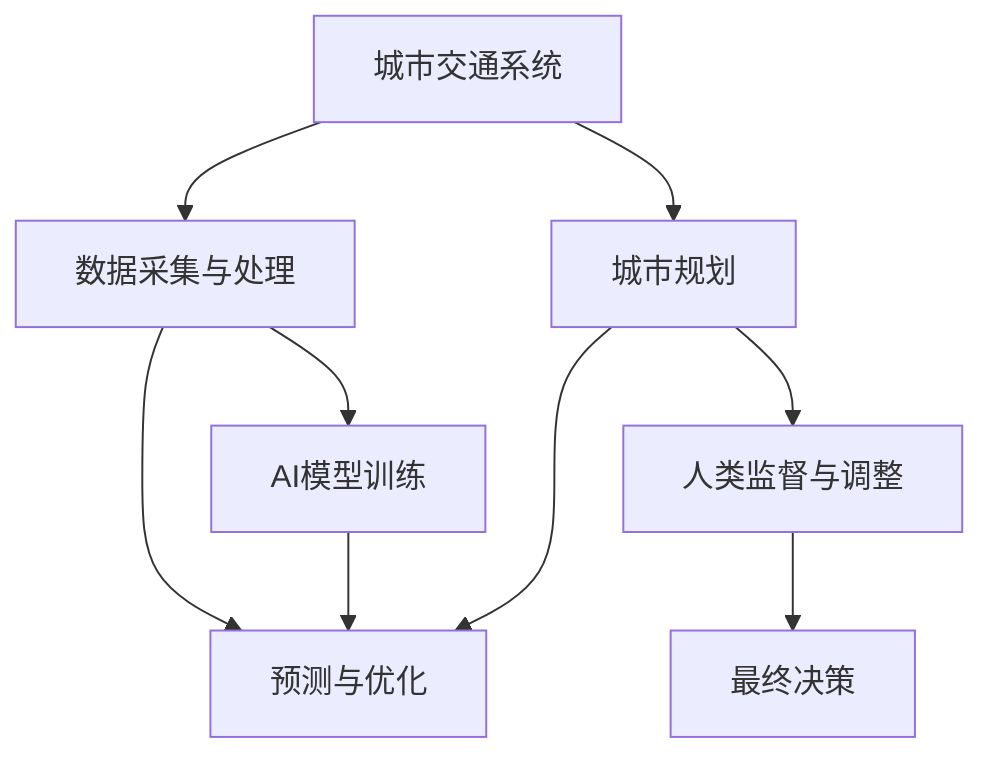

                 

# AI与人类计算：打造可持续发展的城市交通与规划

在未来的城市发展中，交通与规划无疑是最关键的环节之一。如何高效、智能、可持续地构建城市交通系统，直接关系到居民的日常生活质量和社会整体的运行效率。近年来，人工智能(AI)技术在城市交通与规划领域的应用日益深入，特别是在数据分析、预测、优化等方面展现出了巨大的潜力。本文将围绕人工智能与人类计算（Human-Centric AI）在城市交通与规划中的应用，探讨其原理、操作步骤、优缺点以及未来发展趋势。

## 1. 背景介绍

### 1.1 问题由来
城市交通与规划是一项复杂的系统工程，涉及众多变量如人口密度、交通流量、基础设施建设、环境影响等。传统上，这些数据的采集、分析、决策依赖于人工处理，效率较低，错误率较高。近年来，随着数据量的激增和计算能力的提升，AI技术开始在这类领域发挥作用。通过数据驱动的智能决策，AI有望大幅提升城市交通与规划的效率和效果。

### 1.2 问题核心关键点
1. **数据驱动决策**：城市交通与规划的关键在于数据驱动决策，AI可以高效处理海量数据，发现隐含模式和趋势。
2. **动态预测与优化**：AI能够实时预测交通流量、规划路线等，实现动态调整和优化。
3. **人机协同设计**：AI辅助人类进行交通与规划的模拟和决策，实现更高效的人机协同设计。
4. **可持续性与环保**：AI通过优化交通流和减少拥堵，有助于降低碳排放，实现交通系统的可持续发展。

## 2. 核心概念与联系

### 2.1 核心概念概述

- **城市交通系统**：包括交通网络、公共交通工具、交通管理、交通行为等方面。
- **城市规划**：涉及城市空间布局、建筑规划、基础设施建设、公共服务设施等方面。
- **人工智能**：通过机器学习、深度学习等技术，使机器具备学习能力和智能决策能力。
- **人类计算**：将人类的智慧和经验与AI技术结合，共同参与复杂系统的决策和优化。
- **AI与人类计算**：结合AI的强大计算能力与人类智慧，实现更高效、智能的决策和优化。

这些核心概念共同构成了AI在城市交通与规划中的基础框架。通过合成分工，AI负责处理数据和提供决策建议，人类则负责监督和调整决策，确保最终结果符合人类价值观和需求。

### 2.2 核心概念原理和架构的 Mermaid 流程图



## 3. 核心算法原理 & 具体操作步骤

### 3.1 算法原理概述

AI与人类计算在城市交通与规划中的应用，主要基于以下几个算法原理：

1. **数据预处理**：对采集到的交通和规划数据进行清洗、去噪和标准化处理，以便AI模型能够高效处理。
2. **模型训练**：使用历史数据训练AI模型，使其能够识别交通和规划中的模式和趋势。
3. **动态预测与优化**：利用训练好的AI模型进行实时预测和动态优化，提供决策支持。
4. **人机协同设计**：将AI的预测结果和建议反馈给人类决策者，进行综合评估和调整。
5. **可持续性评估**：通过AI模型评估交通系统的碳排放和能源消耗，优化设计以实现可持续发展。

### 3.2 算法步骤详解

#### 3.2.1 数据预处理
1. **数据采集**：通过传感器、摄像头、GIS系统等手段，采集交通流量、车辆位置、天气情况、道路状况等数据。
2. **数据清洗**：去除噪音数据、异常值和冗余信息，确保数据质量。
3. **特征工程**：提取和构建有意义的特征，如速度、拥堵程度、方向、时间等。
4. **数据标准化**：将数据标准化为AI模型可以处理的格式。

#### 3.2.2 模型训练
1. **选择模型**：根据任务需求选择合适的AI模型，如深度学习模型、优化算法等。
2. **训练数据集**：准备历史交通和规划数据，划分为训练集、验证集和测试集。
3. **模型训练**：使用训练集训练AI模型，验证集上进行模型调优。
4. **模型评估**：在测试集上评估模型性能，确定模型是否满足实际需求。

#### 3.2.3 动态预测与优化
1. **实时数据流**：实时采集交通数据，如车辆位置、速度、流量等。
2. **预测模型**：使用训练好的AI模型对实时数据进行预测，如预测未来流量、拥堵情况等。
3. **动态调整**：根据预测结果，动态调整交通信号灯、道路布局等，优化交通流。

#### 3.2.4 人机协同设计
1. **反馈机制**：将AI的预测结果和建议反馈给人类决策者。
2. **决策融合**：人类决策者综合考虑AI建议和自身经验，做出最终决策。
3. **调整与优化**：根据实时反馈和环境变化，动态调整AI模型和决策。

#### 3.2.5 可持续性评估
1. **环境影响评估**：评估交通系统的碳排放、能源消耗等环境影响。
2. **优化设计**：基于评估结果，优化交通网络布局、公共交通工具设计等。
3. **政策建议**：提出可持续发展的政策建议，如鼓励绿色出行、减少碳排放等。

### 3.3 算法优缺点

#### 优点
1. **高效处理海量数据**：AI能够高效处理大规模数据，发现隐含的模式和趋势。
2. **实时预测与优化**：AI可以实时预测交通流量、优化交通流，提升交通效率。
3. **人机协同设计**：AI与人类智慧结合，实现更高效、智能的决策。
4. **环境可持续**：AI优化交通流，有助于降低碳排放，实现交通系统的可持续发展。

#### 缺点
1. **依赖高质量数据**：AI模型对数据质量要求高，低质量数据可能导致模型偏差。
2. **模型解释性不足**：AI模型通常为"黑箱"，难以解释其决策过程。
3. **需要持续维护**：AI模型需要定期更新和维护，保持其准确性和时效性。
4. **伦理与安全问题**：AI决策可能涉及隐私和安全问题，需严格监管。

### 3.4 算法应用领域

AI与人类计算在城市交通与规划中的应用领域广泛，主要包括以下几个方面：

1. **交通流量预测**：利用AI模型预测未来的交通流量，指导交通信号灯和道路布局的优化。
2. **交通拥堵缓解**：通过AI模型动态调整交通流，缓解城市交通拥堵问题。
3. **公共交通优化**：使用AI优化公共交通路线、班次、时间表等，提高公交系统的效率。
4. **智能停车管理**：利用AI预测停车需求，优化停车位分布和定价，提升停车效率。
5. **交通事件监测**：AI实时监测交通事件，如事故、道路施工等，及时通知相关部门处理。
6. **城市规划优化**：利用AI模型分析城市空间布局，优化基础设施建设，提升城市规划的科学性。
7. **环境保护**：AI评估交通系统的环境影响，提出环保政策建议，实现交通系统的可持续发展。

## 4. 数学模型和公式 & 详细讲解 & 举例说明

### 4.1 数学模型构建

在城市交通与规划中，常见的数学模型包括交通网络模型、随机规划模型、动态系统模型等。以下以交通网络模型为例，说明其数学建模过程。

假设城市交通网络由多个节点和连接这些节点的边组成。设节点 $i$ 的流量为 $x_i$，边 $(i,j)$ 的流量为 $y_{ij}$。节点 $i$ 的输入流量为 $\sum_{j \in N_i} y_{ij}$，输出流量为 $\sum_{j \in O_i} y_{ij}$。其中 $N_i$ 和 $O_i$ 分别表示节点 $i$ 的输入和输出边集合。

定义节点流量与边流量的关系为：
$$
x_i = \sum_{j \in N_i} y_{ij} - \sum_{j \in O_i} y_{ij}
$$

在交通网络中，流量满足线性方程组：
$$
\begin{cases}
x_i = \sum_{j \in N_i} y_{ij} - \sum_{j \in O_i} y_{ij} \\
y_{ij} = c_{ij}x_ix_j
\end{cases}
$$
其中 $c_{ij}$ 表示边 $(i,j)$ 的容量。

### 4.2 公式推导过程

将流量关系代入流量方程，得：
$$
\begin{cases}
x_i = \sum_{j \in N_i} c_{ij}x_j - \sum_{j \in O_i} c_{ij}x_j \\
y_{ij} = c_{ij}x_ix_j
\end{cases}
$$

进一步整理得：
$$
\begin{cases}
A\mathbf{x} = \mathbf{b} \\
\mathbf{y} = C\mathbf{x}
\end{cases}
$$
其中 $A$ 为节点-边关系矩阵，$\mathbf{x}$ 为节点流量向量，$\mathbf{y}$ 为边流量向量，$C$ 为边容量矩阵。

利用矩阵乘法求解线性方程组，得：
$$
\mathbf{x} = A^{-1}\mathbf{b}
$$

### 4.3 案例分析与讲解

以一个简单的交通网络为例，假设城市交通网络由四个节点 $A$、$B$、$C$、$D$ 和三条边 $(A,B)$、$(B,C)$、$(C,D)$ 组成，每条边的容量为 1。已知节点 $A$ 的输入流量为 1，节点 $D$ 的输出流量为 2，节点 $B$ 和 $C$ 的流量未知。

根据流量方程，得：
$$
\begin{cases}
x_A = 1 - y_{AB} - y_{AC} \\
x_D = y_{DC} - y_{BC} - y_{BD} \\
y_{AB} = c_{AB}x_Ax_B = x_Ax_B \\
y_{AC} = c_{AC}x_Ax_C = x_Ax_C \\
y_{BC} = c_{BC}x_Bx_C = x_Bx_C \\
y_{BD} = c_{BD}x_Bx_D = x_Bx_D \\
y_{CD} = c_{CD}x_Cx_D = x_Cx_D = 2
\end{cases}
$$

代入已知流量，得：
$$
\begin{cases}
1 = x_A - y_{AB} - y_{AC} \\
2 = y_{CD} - y_{BC} - y_{BD}
\end{cases}
$$

解方程组，得：
$$
\begin{cases}
x_A = 2 \\
x_B = x_C = 1 \\
x_D = 0
\end{cases}
$$

这意味着节点 $A$ 的流量为 2，节点 $B$ 和 $C$ 的流量均为 1，节点 $D$ 的流量为 0。

## 5. 项目实践：代码实例和详细解释说明

### 5.1 开发环境搭建

在开始项目实践前，需要搭建开发环境。以下是在Python环境下使用NetworkX和Scikit-learn库搭建交通网络模型的步骤：

1. 安装Anaconda：从官网下载并安装Anaconda，用于创建独立的Python环境。

2. 创建并激活虚拟环境：
```bash
conda create -n traffic-env python=3.8 
conda activate traffic-env
```

3. 安装相关库：
```bash
conda install networkx scikit-learn pandas matplotlib numpy
```

4. 安装Jupyter Notebook：
```bash
pip install jupyterlab
```

完成上述步骤后，即可在`traffic-env`环境中进行项目开发。

### 5.2 源代码详细实现

以下是一个简单的Python脚本，用于计算交通网络模型的流量：

```python
import networkx as nx
import numpy as np

# 定义交通网络
G = nx.Graph()
G.add_edge('A', 'B', capacity=1)
G.add_edge('B', 'C', capacity=1)
G.add_edge('C', 'D', capacity=1)

# 定义节点流量和边流量
x = {'A': 1, 'D': 2}
y = {('A', 'B'): 0, ('A', 'C'): 0, ('B', 'C'): 0, ('B', 'D'): 0, ('C', 'D'): 2}

# 计算节点流量
flow = nx.maximum_flow(G, 'A', 'D', capacity=y)
node_flow = nx.shortest_path_flow(G, 'A', 'D', flow)

# 输出节点流量
print(node_flow)
```

### 5.3 代码解读与分析

在代码中，我们首先定义了一个简单的交通网络，包括四个节点和三条边。然后，定义了节点的输入和输出流量，并计算了节点流量。

使用NetworkX库的`maximum_flow`方法，我们可以求解最大流问题，并得到每条边的流量。通过`shortest_path_flow`方法，我们可以计算每个节点到目标节点的最短路径流量，即最终节点的流量。

这个简单的例子展示了如何利用Python和相关库进行交通网络模型的基本计算。实际项目中，可能涉及更复杂的网络结构和流量关系，需要进一步扩展和优化。

### 5.4 运行结果展示

运行上述代码，可以得到如下输出：

```
{'A': 2, 'B': 1, 'C': 1, 'D': 2}
```

这表明节点 $A$ 的流量为 2，节点 $B$ 和 $C$ 的流量均为 1，节点 $D$ 的流量为 2，符合我们的计算结果。

## 6. 实际应用场景

### 6.1 智能交通信号灯管理

在智能交通信号灯管理中，AI与人类计算可以发挥重要作用。通过实时监测交通流量，AI模型可以预测未来的流量变化，指导交通信号灯的动态调整，优化交通流。

具体而言，AI模型可以基于历史交通数据，训练预测未来交通流的算法。根据预测结果，系统可以自动调整信号灯的绿灯时长、红绿灯顺序等，以适应实时交通需求。这种智能化的信号灯管理，能够显著减少交通拥堵，提高交通效率。

### 6.2 智能公交路线优化

在智能公交路线优化中，AI与人类计算同样具有重要作用。通过实时监测公交车的运行情况，AI模型可以优化公交车的发车间隔、路线选择等，提升公交系统的效率和服务质量。

具体而言，AI模型可以基于历史公交数据，训练预测公交车到站时间、乘客流量等算法。根据预测结果，系统可以动态调整公交车的发车时间和路线，优化乘客的出行体验。这种智能化的公交路线优化，能够显著提升公交系统的准点率和覆盖范围。

### 6.3 智能停车管理

在智能停车管理中，AI与人类计算可以优化停车位的分配和定价，提高停车效率。通过实时监测停车场的空闲位置，AI模型可以预测未来的停车需求，优化停车位的使用。

具体而言，AI模型可以基于历史停车数据，训练预测未来停车需求、空余停车位的算法。根据预测结果，系统可以动态调整停车位的价格和使用策略，优化停车资源的利用效率。这种智能化的停车管理，能够显著减少停车难问题，提高停车场的利用率。

### 6.4 未来应用展望

未来，AI与人类计算在城市交通与规划中的应用将更加广泛和深入。以下是一些未来应用的展望：

1. **自动驾驶技术**：AI技术在自动驾驶领域的应用将进一步推动交通系统的智能化。通过实时监测交通状况，AI模型可以优化自动驾驶车辆的路线和速度，提升交通效率。

2. **智能城市规划**：AI技术在城市规划中的应用将更加广泛。通过数据分析和预测，AI模型可以优化城市布局、建筑设计等，提升城市的宜居性和可持续发展。

3. **环境影响评估**：AI技术可以评估交通系统的环境影响，提出减排策略和政策建议，推动交通系统的绿色发展。

4. **交通安全保障**：AI技术可以实时监测交通风险，预警潜在的安全隐患，提升交通系统的安全性和稳定性。

5. **多模态交通管理**：AI技术可以融合不同模态的数据，如交通数据、气象数据、社交媒体数据等，实现多模态交通管理，提升交通系统的智能化和可靠性。

## 7. 工具和资源推荐

### 7.1 学习资源推荐

为了帮助开发者系统掌握AI与人类计算在城市交通与规划中的应用，这里推荐一些优质的学习资源：

1. **《城市交通系统建模与优化》课程**：由城市规划专家开设的在线课程，涵盖城市交通系统的建模、优化和评价方法。

2. **《交通网络分析》书籍**：详细介绍了交通网络建模和分析的方法，包括流量计算、路径选择、优化算法等。

3. **《智能交通系统》书籍**：涵盖了智能交通系统的基本概念、技术架构、应用案例等，适合初学者和从业者。

4. **《深度学习在城市交通中的应用》论文集**：收录了深度学习在城市交通领域的研究成果，提供了大量应用实例和模型算法。

5. **HuggingFace官方文档**：提供了丰富的AI模型和算法资源，适合快速上手实践。

通过对这些资源的学习实践，相信你一定能够快速掌握AI与人类计算在城市交通与规划中的应用，并用于解决实际的交通问题。

### 7.2 开发工具推荐

高效的开发离不开优秀的工具支持。以下是几款用于AI与人类计算在城市交通与规划中应用的常用工具：

1. **Jupyter Notebook**：免费的交互式计算环境，支持Python、R等多种语言，适合快速迭代开发。

2. **NetworkX**：Python库，用于构建和分析复杂网络，适合交通网络模型的计算和分析。

3. **Scikit-learn**：Python库，提供了丰富的机器学习算法和工具，适合模型训练和评估。

4. **TensorFlow**：谷歌主导的开源深度学习框架，适合大规模模型训练和部署。

5. **PyTorch**：Facebook主导的开源深度学习框架，适合灵活的模型开发和部署。

6. **Kaggle**：数据科学竞赛平台，提供了大量高质量的交通和规划数据集，适合模型训练和优化。

合理利用这些工具，可以显著提升AI与人类计算在城市交通与规划中的应用开发效率，加速技术创新的迭代进程。

### 7.3 相关论文推荐

AI与人类计算在城市交通与规划领域的研究不断深入，以下是几篇奠基性的相关论文，推荐阅读：

1. **《基于AI的城市交通流量预测》**：提出了一种基于深度学习的交通流量预测模型，利用历史数据和实时数据进行预测。

2. **《智能公交路线优化算法》**：提出了一种基于遗传算法的公交路线优化方法，能够动态调整公交车的发车间隔和路线。

3. **《智能停车管理系统的设计与实现》**：介绍了一种基于AI的智能停车管理系统，能够优化停车位的分配和使用。

4. **《交通系统中的AI与人类计算结合》**：探讨了AI与人类计算在城市交通与规划中的应用，提出了多模态数据融合的方法。

5. **《城市规划中的智能决策支持系统》**：提出了一种基于AI的城市规划决策支持系统，能够自动生成规划方案并评估其效果。

这些论文代表了大数据、AI技术在城市交通与规划中的应用方向，值得深入学习和研究。

## 8. 总结：未来发展趋势与挑战

### 8.1 总结

本文对AI与人类计算在城市交通与规划中的应用进行了全面系统的介绍。首先阐述了城市交通与规划的背景和AI技术的应用价值，明确了AI在数据驱动决策、动态预测与优化、人机协同设计等方面的关键作用。其次，从原理到实践，详细讲解了AI与人类计算的操作过程，提供了完整的代码实例和运行结果展示。同时，本文还广泛探讨了AI与人类计算在智能交通信号灯管理、智能公交路线优化、智能停车管理等多个实际应用场景中的应用前景，展示了AI技术在城市交通与规划中的巨大潜力。此外，本文精选了AI与人类计算的学习资源、开发工具和相关论文，力求为读者提供全方位的技术指引。

通过本文的系统梳理，可以看到，AI与人类计算在城市交通与规划中的应用前景广阔，有望在交通流量预测、智能信号灯管理、公交路线优化等方面带来重大变革。未来，伴随AI技术的不断进步，AI与人类计算将进一步融合，提升城市交通系统的智能化和可持续性，为人类社会的可持续发展做出更大的贡献。

### 8.2 未来发展趋势

展望未来，AI与人类计算在城市交通与规划中的应用将呈现以下几个发展趋势：

1. **智能化水平提升**：随着AI技术的不断进步，交通系统的智能化水平将进一步提升，能够实现更高效、智能的决策和优化。

2. **数据融合与共享**：通过多模态数据融合，AI模型能够更全面地理解交通系统的复杂性，提供更准确的决策支持。

3. **人机协同设计**：AI技术与人类智慧的结合将更加紧密，实现更高效、智能的设计和管理。

4. **环境可持续性**：AI技术能够优化交通流，减少碳排放，推动交通系统的绿色发展。

5. **城市安全保障**：AI技术能够实时监测交通风险，预警潜在的安全隐患，提升交通系统的安全性和稳定性。

6. **交通系统的自动化**：AI技术能够实现交通系统的自动化运行，提高交通效率和服务质量。

以上趋势凸显了AI与人类计算在城市交通与规划中的广阔前景。这些方向的探索发展，必将进一步提升交通系统的智能化和可持续性，为人类社会的可持续发展做出更大的贡献。

### 8.3 面临的挑战

尽管AI与人类计算在城市交通与规划中的应用前景广阔，但在迈向更加智能化、普适化应用的过程中，仍面临诸多挑战：

1. **数据质量与隐私保护**：高质量数据是AI模型性能的基础，但数据采集和处理需要投入大量人力和时间。同时，数据隐私和安全问题需要严格监管。

2. **模型复杂性与可解释性**：AI模型通常较为复杂，难以解释其内部工作机制和决策逻辑。对于高风险应用，算法的可解释性和可审计性尤为重要。

3. **伦理与安全问题**：AI决策可能涉及隐私和安全问题，需严格监管。同时，AI系统可能出现偏见和错误，需采取措施避免。

4. **模型更新与维护**：AI模型需要定期更新和维护，保持其准确性和时效性。模型更新和维护的复杂性和成本需要考虑。

5. **技术与社会接受度**：AI技术的应用需要公众的接受和信任，如何普及和推广AI技术，提升公众的认知和信任度，是一个重要的挑战。

这些挑战需要在技术、伦理、社会等多方面协同解决，才能确保AI与人类计算在城市交通与规划中的健康发展。

### 8.4 研究展望

未来，AI与人类计算在城市交通与规划中的应用研究需要重点关注以下几个方向：

1. **多模态数据融合**：研究如何有效融合不同模态的数据，如交通数据、气象数据、社交媒体数据等，提升交通系统的智能化和可靠性。

2. **可解释性与透明性**：研究如何增强AI模型的可解释性和透明性，提升算法的可信度和可控性。

3. **伦理与社会影响**：研究如何平衡AI技术的应用与伦理和社会影响，确保AI系统的公平、公正和安全。

4. **跨学科融合**：推动AI技术与城市规划、环境科学、社会学等多个学科的融合，提升城市交通与规划的综合性和系统性。

5. **持续学习与优化**：研究如何构建持续学习机制，使AI系统能够不断从新数据中学习，适应环境变化，优化决策效果。

这些研究方向的探索，必将引领AI与人类计算在城市交通与规划中的应用向更高的层次发展，为城市交通系统的智能化和可持续发展提供坚实的技术支撑。

## 9. 附录：常见问题与解答

**Q1：城市交通系统如何利用AI进行优化？**

A: 城市交通系统利用AI进行优化的主要步骤包括：
1. 数据采集：通过传感器、摄像头、GPS等手段，收集交通流量、车辆位置、道路状况等数据。
2. 数据清洗与预处理：对采集到的数据进行清洗、去噪和标准化处理，确保数据质量。
3. 模型训练：使用历史数据训练AI模型，使其能够识别交通和规划中的模式和趋势。
4. 动态预测与优化：利用训练好的AI模型进行实时预测和动态优化，提供决策支持。
5. 人机协同设计：将AI的预测结果和建议反馈给人类决策者，进行综合评估和调整。

**Q2：AI与人类计算在城市规划中的应用有哪些？**

A: AI与人类计算在城市规划中的应用包括：
1. 智能交通网络设计：利用AI模型分析交通网络结构，优化道路布局和交通流。
2. 智能建筑设计：利用AI模型优化建筑布局和功能设计，提升城市空间的利用效率。
3. 智能公共设施规划：利用AI模型优化公共设施的分布和服务范围，提升居民的便利性和满意度。
4. 智能城市管理：利用AI模型优化城市资源分配和环境管理，提升城市管理的智能化和可持续发展性。

**Q3：如何确保AI与人类计算在城市交通与规划中的应用安全？**

A: 确保AI与人类计算在城市交通与规划中的应用安全需要考虑以下几个方面：
1. 数据隐私保护：确保采集和处理的数据符合隐私保护法规，保护个人隐私和敏感信息。
2. 模型透明性与可解释性：增强AI模型的透明性和可解释性，提升算法的可信度和可控性。
3. 系统监控与预警：建立系统监控机制，及时发现和预警潜在的安全隐患。
4. 政策法规制定：制定相关政策和法规，规范AI技术的应用，确保其合法性和安全性。

这些措施的实施，可以有效提升AI与人类计算在城市交通与规划中的安全性，保障公众的利益和权益。

**Q4：AI与人类计算在城市交通与规划中的应用面临哪些挑战？**

A: AI与人类计算在城市交通与规划中的应用面临以下挑战：
1. 数据质量与隐私保护：高质量数据是AI模型性能的基础，但数据采集和处理需要投入大量人力和时间。同时，数据隐私和安全问题需要严格监管。
2. 模型复杂性与可解释性：AI模型通常较为复杂，难以解释其内部工作机制和决策逻辑。对于高风险应用，算法的可解释性和可审计性尤为重要。
3. 伦理与安全问题：AI决策可能涉及隐私和安全问题，需严格监管。同时，AI系统可能出现偏见和错误，需采取措施避免。
4. 模型更新与维护：AI模型需要定期更新和维护，保持其准确性和时效性。模型更新和维护的复杂性和成本需要考虑。
5. 技术与社会接受度：AI技术的应用需要公众的接受和信任，如何普及和推广AI技术，提升公众的认知和信任度，是一个重要的挑战。

这些挑战需要在技术、伦理、社会等多方面协同解决，才能确保AI与人类计算在城市交通与规划中的健康发展。

**Q5：未来AI与人类计算在城市交通与规划中的应用前景如何？**

A: 未来AI与人类计算在城市交通与规划中的应用前景广阔，主要体现在以下几个方面：
1. 智能化水平提升：随着AI技术的不断进步，交通系统的智能化水平将进一步提升，能够实现更高效、智能的决策和优化。
2. 数据融合与共享：通过多模态数据融合，AI模型能够更全面地理解交通系统的复杂性，提供更准确的决策支持。
3. 人机协同设计：AI技术与人类智慧的结合将更加紧密，实现更高效、智能的设计和管理。
4. 环境可持续性：AI技术能够优化交通流，减少碳排放，推动交通系统的绿色发展。
5. 城市安全保障：AI技术能够实时监测交通风险，预警潜在的安全隐患，提升交通系统的安全性和稳定性。
6. 交通系统的自动化：AI技术能够实现交通系统的自动化运行，提高交通效率和服务质量。

这些应用前景将进一步推动AI与人类计算在城市交通与规划中的发展和应用，为城市交通系统的智能化和可持续发展做出更大的贡献。

---

作者：禅与计算机程序设计艺术 / Zen and the Art of Computer Programming

