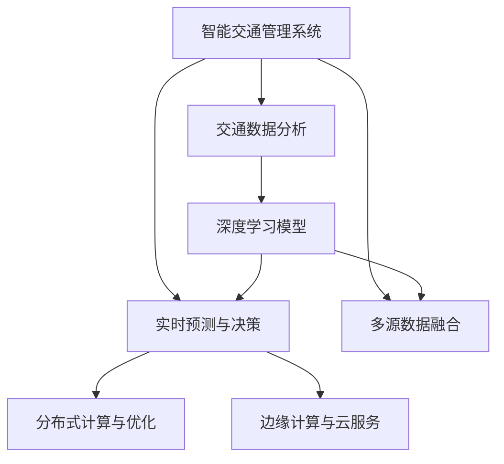

                 

## 1. 背景介绍

### 1.1 问题由来
随着城市化进程的加快，交通拥堵成为全球性问题，给城市经济、环境和社会生活带来巨大影响。传统交通管理依赖于人工监控和调度，效率低下，难以应对复杂的城市交通状况。而随着人工智能技术的不断发展，智能交通管理系统(Smart Traffic Management System, STMS)开始进入人们的视野，有望大幅提升城市交通管理水平。

然而，现有的智能交通管理系统多以摄像头监控和车流量统计为核心，未充分融合人工智能深度学习技术。传统的基于规则的决策系统难以处理动态复杂的城市交通场景，也无法实时响应交通突发事件，无法实现高效、智能、可靠的交通管理。因此，如何将人工智能与城市交通管理紧密结合，打造可持续发展的STMS，成为当前研究的热点话题。

### 1.2 问题核心关键点
- **交通数据分析**：如何高效、准确地处理海量交通数据，识别出交通模式和异常事件。
- **实时预测与决策**：如何实时预测交通状况，并制定最优决策方案，以最大化缓解交通压力。
- **多源数据融合**：如何有效融合多源交通数据，包括视频、传感器、GPS等，以实现更全面的交通态势感知。
- **模型训练与部署**：如何在高性能计算资源上训练复杂深度学习模型，并将模型部署到实际系统中，确保系统实时响应。
- **系统可扩展性与鲁棒性**：如何设计系统以支持大规模用户和动态交通场景，并确保系统在高并发、高动态性环境中的稳定运行。

## 2. 核心概念与联系

### 2.1 核心概念概述

为了更好地理解智能交通管理系统的构建过程，本节将介绍几个密切相关的核心概念：

- **智能交通管理系统**：利用人工智能技术，对城市交通状况进行实时监测、预测和优化，以提升交通效率和安全性。
- **交通数据分析**：对交通视频、传感器数据、GPS轨迹等数据进行清洗、分析和处理，提取有价值的信息。
- **实时预测与决策**：基于交通数据分析结果，使用深度学习模型实时预测交通流量、拥堵区域等，并自动生成决策方案。
- **多源数据融合**：融合不同来源的数据，如视频、传感器数据、GPS数据等，形成多模态数据，提升交通态势感知能力。
- **深度学习模型**：如卷积神经网络(CNN)、循环神经网络(RNN)、Transformer等，用于从交通数据中学习交通模式和异常事件。
- **分布式计算与优化**：利用分布式计算框架如Apache Spark、TensorFlow分布式等，加速模型训练与推理。
- **边缘计算与云服务**：将数据处理和推理任务分布在边缘设备和云端，提高系统效率和可扩展性。

这些核心概念之间的逻辑关系可以通过以下Mermaid流程图来展示：



这个流程图展示了几大核心概念及其之间的关系：

1. 智能交通管理系统作为整体目标，由交通数据分析、实时预测与决策、多源数据融合等子系统协同实现。
2. 交通数据分析是整个系统的基础，提供交通流量、车辆位置、交通事件等数据。
3. 实时预测与决策依赖于交通数据分析结果，通过深度学习模型预测交通状况，并生成决策方案。
4. 多源数据融合是数据处理的高级形式，将多种数据源融合形成统一视图。
5. 深度学习模型在交通数据分析与预测中起到关键作用，学习交通模式和异常事件。
6. 分布式计算与优化加速模型训练与推理，支持大规模数据处理和模型部署。
7. 边缘计算与云服务是实现高性能计算和实时响应的关键技术。

这些概念共同构成了智能交通管理系统的工作原理和架构，使得系统能够实现高效、智能、可靠的交通管理。

## 3. 核心算法原理 & 具体操作步骤

### 3.1 算法原理概述

智能交通管理系统的核心算法原理基于深度学习和大数据技术，主要分为数据处理、特征提取、模型训练与推理、决策生成四个环节。其核心思想是通过构建深度学习模型，学习交通数据的统计特征和动态规律，实现对交通状态的实时预测与决策。

形式化地，假设交通数据为 $D=\{d_i\}_{i=1}^N$，其中 $d_i$ 为第 $i$ 个样本的特征向量，包含车辆位置、速度、交通事件等。定义交通模型 $M_{\theta}:\mathcal{X} \rightarrow \mathcal{Y}$，其中 $\mathcal{X}$ 为输入特征空间，$\mathcal{Y}$ 为输出预测空间，$\theta$ 为模型参数。智能交通管理系统的目标是最小化预测结果与实际状态之间的差异，即：

$$
\theta^* = \mathop{\arg\min}_{\theta} \mathcal{L}(M_{\theta},D)
$$

其中 $\mathcal{L}$ 为损失函数，用于衡量模型预测与实际状态之间的误差。常见的损失函数包括均方误差、交叉熵等。

### 3.2 算法步骤详解

智能交通管理系统的一般流程包括：

**Step 1: 数据收集与预处理**
- 收集交通视频、传感器数据、GPS轨迹等数据，并进行数据清洗、去噪、归一化等预处理操作。
- 对多源数据进行融合，形成统一的交通数据集。

**Step 2: 特征提取与表示**
- 使用卷积神经网络(CNN)、循环神经网络(RNN)、Transformer等深度学习模型，对交通数据进行特征提取和表示。
- 通过多尺度特征融合，形成细粒度的交通特征表示。

**Step 3: 模型训练**
- 在交通数据集上训练深度学习模型，优化模型参数 $\theta$。
- 选择适合的数据分割策略，划分训练集、验证集和测试集。
- 应用优化算法如随机梯度下降、Adam等，更新模型参数，最小化损失函数。

**Step 4: 实时预测与决策生成**
- 实时获取当前交通数据，并输入模型进行预测。
- 根据预测结果，自动生成决策方案，如信号灯控制、路障设置等。
- 将决策方案发送至执行设备，调整交通状况。

### 3.3 算法优缺点

智能交通管理系统的核心算法具有以下优点：
1. 高效处理复杂数据。深度学习模型能够处理多模态、高维度的交通数据，提取高层次的特征表示。
2. 实时预测与决策。基于深度学习的模型可以快速进行实时预测，并自动生成决策方案。
3. 多源数据融合。通过多源数据融合，系统能够获得更加全面和准确的交通态势感知。
4. 可扩展性强。深度学习模型可以通过分布式计算和边缘计算技术，实现大规模系统的构建和部署。

同时，该算法也存在一些局限性：
1. 对标注数据依赖度高。深度学习模型需要大量标注数据进行训练，获取高质量标注数据成本较高。
2. 模型复杂度高。深度学习模型的参数量通常较大，计算资源消耗大。
3. 解释性不足。深度学习模型的决策过程缺乏可解释性，难以理解模型的内部工作机制。
4. 鲁棒性有待提升。模型对输入数据的扰动敏感，难以应对未知的交通场景。

尽管存在这些局限性，但基于深度学习的大规模交通数据分析和实时预测仍然是大数据和人工智能技术的重要应用场景。未来相关研究的重点在于如何进一步降低模型对标注数据的依赖，提高模型的鲁棒性和可解释性。

### 3.4 算法应用领域

智能交通管理系统已经在大规模城市交通管理中得到了广泛应用，具体应用场景包括：

- 交通流量预测：对未来交通流量进行预测，优化交通信号控制和路网管理。
- 交通异常事件检测：实时监控交通视频，检测交通事故、故障车辆等异常事件，快速响应。
- 路线优化与规划：基于实时交通数据，优化车辆行驶路线，减少交通拥堵。
- 交通决策支持：提供基于大数据和深度学习的决策支持，辅助城市交通管理决策。
- 智慧停车管理：通过智能停车辅助系统，提升城市停车管理效率，缓解停车难问题。

除了上述这些经典应用外，智能交通管理系统还被创新性地应用到更多场景中，如智能货运调度、智能交通预警、智能车联网等，为城市交通管理带来了新的发展思路。

## 4. 数学模型和公式 & 详细讲解 & 举例说明

### 4.1 数学模型构建

本节将使用数学语言对智能交通管理系统的构建过程进行更加严格的刻画。

假设交通数据分析结果为 $X=\{x_i\}_{i=1}^N$，其中 $x_i$ 为第 $i$ 个样本的交通特征。定义交通预测模型为 $M_{\theta}:\mathcal{X} \rightarrow \mathcal{Y}$，其中 $\mathcal{X}$ 为输入特征空间，$\mathcal{Y}$ 为输出预测空间，$\theta$ 为模型参数。

定义模型 $M_{\theta}$ 在输入 $x$ 上的损失函数为 $\ell(M_{\theta}(x),y)$，则在数据集 $D$ 上的经验风险为：

$$
\mathcal{L}(\theta) = \frac{1}{N} \sum_{i=1}^N \ell(M_{\theta}(x_i),y_i)
$$

其中 $\ell$ 为损失函数，用于衡量模型预测与实际状态之间的差异。常见的损失函数包括均方误差、交叉熵等。

### 4.2 公式推导过程

以下我们以交通流量预测为例，推导均方误差损失函数及其梯度的计算公式。

假设模型 $M_{\theta}$ 在输入 $x$ 上的预测结果为 $\hat{y}=M_{\theta}(x)$，表示未来交通流量的预测值。真实标签 $y$ 为实际交通流量。则均方误差损失函数定义为：

$$
\ell(M_{\theta}(x),y) = \frac{1}{2}(y-\hat{y})^2
$$

将其代入经验风险公式，得：

$$
\mathcal{L}(\theta) = \frac{1}{2N} \sum_{i=1}^N (y_i-M_{\theta}(x_i))^2
$$

根据链式法则，损失函数对参数 $\theta_k$ 的梯度为：

$$
\frac{\partial \mathcal{L}(\theta)}{\partial \theta_k} = -\frac{1}{N}\sum_{i=1}^N 2(y_i-M_{\theta}(x_i)) \frac{\partial M_{\theta}(x_i)}{\partial \theta_k}
$$

其中 $\frac{\partial M_{\theta}(x_i)}{\partial \theta_k}$ 可进一步递归展开，利用自动微分技术完成计算。

在得到损失函数的梯度后，即可带入参数更新公式，完成模型的迭代优化。重复上述过程直至收敛，最终得到适应交通流量预测的最优模型参数 $\theta^*$。

## 5. 项目实践：代码实例和详细解释说明

### 5.1 开发环境搭建

在进行智能交通管理系统的开发前，我们需要准备好开发环境。以下是使用Python进行PyTorch开发的环境配置流程：

1. 安装Anaconda：从官网下载并安装Anaconda，用于创建独立的Python环境。

2. 创建并激活虚拟环境：
```bash
conda create -n stms python=3.8 
conda activate stms
```

3. 安装PyTorch：根据CUDA版本，从官网获取对应的安装命令。例如：
```bash
conda install pytorch torchvision torchaudio cudatoolkit=11.1 -c pytorch -c conda-forge
```

4. 安装相关库：
```bash
pip install pandas numpy scikit-learn torch tensorboard
```

5. 安装GPU库：
```bash
conda install pytorch-gpu torchvision-gpu torchaudio-gpu -c pytorch
```

6. 安装可视化工具：
```bash
pip install tensorboard
```

完成上述步骤后，即可在`stms`环境中开始智能交通管理系统的开发。

### 5.2 源代码详细实现

下面我们以交通流量预测任务为例，给出使用PyTorch进行智能交通管理系统微调的PyTorch代码实现。

首先，定义交通流量预测任务的损失函数：

```python
import torch.nn as nn
import torch
import torch.optim as optim

class MeanSquareLoss(nn.Module):
    def __init__(self):
        super(MeanSquareLoss, self).__init__()

    def forward(self, y_pred, y_true):
        loss = torch.mean((y_pred - y_true)**2)
        return loss
```

然后，定义智能交通管理系统的模型结构：

```python
class TrafficModel(nn.Module):
    def __init__(self, input_dim, output_dim, hidden_dim, num_layers):
        super(TrafficModel, self).__init__()
        self.hidden_dim = hidden_dim
        self.num_layers = num_layers

        self.encoder = nn.Sequential(
            nn.Linear(input_dim, hidden_dim),
            nn.ReLU(),
            nn.Linear(hidden_dim, hidden_dim),
            nn.ReLU()
        )

        self.decoder = nn.Sequential(
            nn.Linear(hidden_dim, output_dim),
            nn.Sigmoid()
        )

    def forward(self, x):
        h = self.encoder(x)
        y_pred = self.decoder(h)
        return y_pred
```

接着，定义训练和评估函数：

```python
def train_epoch(model, optimizer, loss_func, data_loader, device):
    model.train()
    total_loss = 0
    for batch in data_loader:
        inputs, targets = batch
        inputs = inputs.to(device)
        targets = targets.to(device)

        optimizer.zero_grad()
        outputs = model(inputs)
        loss = loss_func(outputs, targets)
        loss.backward()
        optimizer.step()
        total_loss += loss.item()
    return total_loss / len(data_loader)

def evaluate(model, loss_func, data_loader, device):
    model.eval()
    total_loss = 0
    for batch in data_loader:
        inputs, targets = batch
        inputs = inputs.to(device)
        targets = targets.to(device)

        with torch.no_grad():
            outputs = model(inputs)
            loss = loss_func(outputs, targets)
            total_loss += loss.item()
    return total_loss / len(data_loader)
```

最后，启动训练流程并在测试集上评估：

```python
epochs = 100
batch_size = 32
learning_rate = 0.001

device = torch.device("cuda" if torch.cuda.is_available() else "cpu")

model.to(device)
optimizer = optim.Adam(model.parameters(), lr=learning_rate)

train_loader = ...
val_loader = ...

for epoch in range(epochs):
    train_loss = train_epoch(model, optimizer, loss_func, train_loader, device)
    val_loss = evaluate(model, loss_func, val_loader, device)

    print(f"Epoch {epoch+1}, train loss: {train_loss:.3f}, val loss: {val_loss:.3f}")
    
print("Finished training.")
```

以上就是使用PyTorch对智能交通管理系统进行交通流量预测的完整代码实现。可以看到，通过定义损失函数、模型结构、训练和评估函数，我们能够高效地训练和评估智能交通管理系统的模型。

### 5.3 代码解读与分析

让我们再详细解读一下关键代码的实现细节：

**TrafficModel类**：
- `__init__`方法：定义模型的结构，包括编码器和解码器。
- `forward`方法：定义前向传播的计算过程，对输入数据进行编码和解码。

**MeanSquareLoss类**：
- `__init__`方法：定义均方误差损失函数的初始化。
- `forward`方法：定义损失函数的计算过程，对预测值和真实值进行差分计算。

**训练和评估函数**：
- 训练函数`train_epoch`：对数据以批为单位进行迭代，在每个批次上前向传播计算损失并反向传播更新模型参数，最后返回该epoch的平均损失。
- 评估函数`evaluate`：与训练类似，不同点在于不更新模型参数，并在每个batch结束后将预测和标签结果存储下来，最后使用均方误差损失函数对整个评估集的预测结果进行计算。

**训练流程**：
- 定义总的epoch数和batch size，开始循环迭代
- 每个epoch内，先在训练集上训练，输出平均loss
- 在验证集上评估，输出均方误差损失
- 重复上述步骤直至完成所有epoch
- 训练结束后，输出最终训练和验证集上的均方误差

可以看到，PyTorch框架提供了一系列强大的工具和组件，使得模型的训练和推理过程变得简洁高效。开发者可以专注于模型设计和算法优化，而不必过多关注底层实现细节。

当然，实际应用中还需要进一步优化模型结构、调参策略、数据处理等环节，以实现更高精度的预测和更高效的训练。

## 6. 实际应用场景

### 6.1 智能交通信号灯控制

智能交通信号灯控制是智能交通管理系统的核心应用之一。传统的信号灯控制依赖于固定时间间隔和预设的交通流量，难以应对动态交通场景。通过智能交通管理系统，可以实现自适应的信号灯控制，提升交通流量的优化效果。

具体而言，系统可以通过多源数据融合，获取实时交通流量、车流方向、行人流量等信息，并结合历史交通数据，预测未来交通状况。根据预测结果，自动调整信号灯的时序和相位，优化交通信号控制策略，提高道路通行效率。

### 6.2 交通异常事件检测

交通异常事件检测是智能交通管理系统的重要功能，能够及时发现交通事故、故障车辆等异常事件，快速响应和处理。系统通过实时监控交通视频和传感器数据，使用深度学习模型检测异常事件，并提供告警信息。

例如，系统可以通过卷积神经网络(CNN)和循环神经网络(RNN)模型，对交通视频进行帧间差分和光流估计，检测交通异常事件。系统可以同时处理多路摄像头数据，实现全城市范围的异常事件监测。一旦检测到异常事件，系统自动生成告警信息，发送至指挥中心和相关部门，及时处理事故。

### 6.3 智慧停车管理

智慧停车管理是智能交通管理系统的重要应用方向之一。当前城市停车问题严重，车位利用率低，解决停车难问题是提升城市交通效率的关键。智能交通管理系统可以通过分析停车场和路网数据，优化停车策略，提升停车效率。

具体而言，系统可以通过对历史停车数据进行分析，预测未来停车需求，并根据实时交通状况调整停车策略。例如，系统可以推荐最优停车位置，动态调整停车价格，提供停车诱导服务等。同时，系统可以与智能停车设备对接，实现快速停车和自动支付，提升停车体验。

### 6.4 未来应用展望

随着智能交通管理系统的不断发展，未来将会在更多领域得到应用，为城市交通管理带来变革性影响。

1. **智慧货运调度**：智能交通管理系统可以通过对物流数据和交通数据的融合分析，优化货运路线，减少物流成本，提升货运效率。
2. **智能交通预警**：系统可以根据实时交通数据和天气数据，预测交通状况，并提前发出预警信息，指导出行计划。
3. **智能车联网**：通过与车载设备和移动设备的互联互通，实现智能交通系统的实时监控和控制。
4. **城市规划与建设**：系统可以为城市规划提供交通数据支持，优化路网布局，提升城市规划的科学性。
5. **多模态交通信息整合**：系统可以整合多源数据，如交通视频、传感器数据、GPS数据等，形成全面的交通态势感知，提升系统的准确性和鲁棒性。

此外，智能交通管理系统还可以与城市大数据平台、智慧城市管理平台等系统进行深度整合，实现跨领域的应用创新。相信随着技术的不断发展，智能交通管理系统将在城市交通管理中发挥越来越重要的作用，提升城市交通管理的智能化水平。

## 7. 工具和资源推荐

### 7.1 学习资源推荐

为了帮助开发者系统掌握智能交通管理系统的理论基础和实践技巧，这里推荐一些优质的学习资源：

1. 《深度学习在智能交通中的应用》系列书籍：介绍了深度学习在智能交通管理系统中的应用，涵盖了交通数据分析、实时预测、决策生成等核心技术。
2. Coursera《深度学习》课程：斯坦福大学开设的深度学习课程，详细讲解了深度学习的基本原理和应用。
3. arXiv论文库：深度学习相关论文的集散地，提供了大量的智能交通管理系统研究的最新进展。
4. Kaggle智能交通管理系统竞赛：通过实际竞赛项目，学习智能交通管理系统的实现和优化。

通过对这些资源的学习实践，相信你一定能够快速掌握智能交通管理系统的精髓，并用于解决实际的交通管理问题。

### 7.2 开发工具推荐

高效的开发离不开优秀的工具支持。以下是几款用于智能交通管理系统开发的常用工具：

1. PyTorch：基于Python的开源深度学习框架，灵活动态的计算图，适合快速迭代研究。
2. TensorFlow：由Google主导开发的开源深度学习框架，生产部署方便，适合大规模工程应用。
3. TensorBoard：TensorFlow配套的可视化工具，可实时监测模型训练状态，并提供丰富的图表呈现方式。
4. Apache Spark：分布式计算框架，用于处理大规模数据集，加速模型训练与推理。
5. Hadoop：大数据处理框架，支持海量数据的存储和处理，提供数据预处理和数据仓库功能。

合理利用这些工具，可以显著提升智能交通管理系统的开发效率，加快创新迭代的步伐。

### 7.3 相关论文推荐

智能交通管理系统的发展源于学界的持续研究。以下是几篇奠基性的相关论文，推荐阅读：

1. "Deep Learning in Traffic Flow Prediction"：介绍了深度学习在交通流量预测中的应用，展示了基于卷积神经网络模型的交通流量预测方法。
2. "Traffic Anomaly Detection Using Deep Convolutional Neural Network"：展示了基于卷积神经网络模型对交通异常事件的检测，提升了系统的准确性和鲁棒性。
3. "Traffic Control by Adaptive Signal Control"：介绍了智能交通信号灯控制的原理和实现方法，展示了自适应信号灯控制的优势。
4. "A Survey on Reinforcement Learning for Intelligent Transportation Systems"：介绍了强化学习在智能交通管理系统中的应用，展示了智能交通管理系统的前景和挑战。

这些论文代表了大规模智能交通管理系统的发展脉络。通过学习这些前沿成果，可以帮助研究者把握学科前进方向，激发更多的创新灵感。

## 8. 总结：未来发展趋势与挑战

### 8.1 总结

本文对智能交通管理系统进行了全面系统的介绍。首先阐述了智能交通管理系统的研究背景和意义，明确了系统构建的目标和核心算法。其次，从原理到实践，详细讲解了智能交通管理系统的构建过程，包括数据处理、特征提取、模型训练与推理、决策生成等关键环节，给出了智能交通管理系统微调的完整代码实现。同时，本文还广泛探讨了系统在交通流量预测、交通异常事件检测、智慧停车管理等多个应用场景中的实际应用，展示了智能交通管理系统的广阔前景。最后，本文精选了智能交通管理系统的学习资源、开发工具和相关论文，力求为读者提供全方位的技术指引。

通过本文的系统梳理，可以看到，智能交通管理系统在提升城市交通管理水平、缓解交通拥堵、提高交通安全性等方面具有重要意义。未来，随着人工智能技术的不断发展，智能交通管理系统必将为城市交通管理带来新的变革，提升城市交通管理的智能化水平，构建更加智慧、安全、高效的城市交通环境。

### 8.2 未来发展趋势

展望未来，智能交通管理系统的研究和发展将呈现以下几个趋势：

1. **多模态数据融合**：未来的系统将更加注重多源数据的融合，结合视频、传感器、GPS等多种数据源，形成统一的交通数据视图，提升系统的全面性和准确性。
2. **实时动态优化**：系统将更加注重实时动态优化，根据实时交通状况和历史数据，动态调整交通信号和路径规划，优化交通流。
3. **强化学习**：系统将引入强化学习技术，通过与交通参与者的交互，优化交通决策，提升系统的智能性和鲁棒性。
4. **边缘计算与云服务**：系统将更加注重边缘计算和云服务的结合，在边缘设备上进行初步数据处理，在云端进行复杂计算和决策生成，提高系统的效率和可扩展性。
5. **深度学习与知识图谱的结合**：系统将结合深度学习和知识图谱技术，构建更全面、准确的交通知识库，提升系统的解释性和决策可控性。
6. **跨领域应用拓展**：系统将拓展到更多领域，如智慧物流、智能停车、智慧城市等，实现更广泛的应用场景。

以上趋势凸显了智能交通管理系统的发展潜力。这些方向的探索发展，必将进一步提升系统的性能和应用范围，为城市交通管理带来新的突破。

### 8.3 面临的挑战

尽管智能交通管理系统已经取得了一定的进展，但在迈向更加智能化、普适化应用的过程中，仍面临诸多挑战：

1. **数据获取与标注**：高质量的数据和标注是智能交通管理系统的基础，但数据获取和标注成本高，且需要大量人工参与。如何降低数据获取和标注成本，提升数据质量，是亟待解决的问题。
2. **模型复杂性与可解释性**：深度学习模型通常复杂度高，难以解释其内部工作机制，导致模型的决策过程缺乏透明度。如何提升模型的可解释性和透明度，是未来的一个重要研究方向。
3. **模型鲁棒性与泛化能力**：智能交通管理系统面临动态交通场景和未知因素的影响，模型的鲁棒性和泛化能力有待提升，以应对各种异常情况。
4. **系统安全性与隐私保护**：智能交通管理系统涉及大量敏感数据，系统的安全性与隐私保护是关键问题。如何确保系统数据的安全性和隐私性，防止数据泄露和恶意攻击，是系统设计的重要课题。
5. **跨平台兼容性**：智能交通管理系统需要在不同的平台和设备上运行，系统的跨平台兼容性和接口设计需要进一步优化。

正视智能交通管理系统面临的这些挑战，积极应对并寻求突破，将是大规模智能交通管理系统走向成熟的关键。相信随着技术的不断发展，智能交通管理系统将在保障城市交通安全、提升交通效率、改善城市环境等方面发挥更大的作用。

### 8.4 研究展望

面对智能交通管理系统面临的挑战，未来的研究需要在以下几个方面寻求新的突破：

1. **轻量级模型与算法优化**：开发轻量级模型和高效算法，减少计算资源消耗，提高模型的可部署性。
2. **多源数据融合与动态优化**：研究多源数据融合与动态优化技术，提升系统的全面性和实时性。
3. **知识图谱与深度学习结合**：将知识图谱与深度学习结合，构建更全面、准确的交通知识库，提升系统的解释性和决策可控性。
4. **边缘计算与云服务结合**：研究边缘计算与云服务的结合技术，提升系统的效率和可扩展性。
5. **强化学习与自适应控制**：研究强化学习在智能交通管理系统中的应用，提升系统的智能性和鲁棒性。
6. **模型鲁棒性与泛化能力**：研究模型鲁棒性和泛化能力的提升方法，增强系统对未知因素的适应能力。
7. **跨平台兼容性与接口设计**：研究跨平台兼容性与接口设计技术，确保系统在各种平台和设备上的稳定运行。

这些研究方向将推动智能交通管理系统向更高层次的发展，为城市交通管理带来新的突破，提升城市交通管理的智能化水平。面向未来，智能交通管理系统需要不断突破技术瓶颈，推动多学科交叉融合，才能真正实现其广泛应用和深远影响。

## 9. 附录：常见问题与解答

**Q1：智能交通管理系统需要处理哪些数据？**

A: 智能交通管理系统需要处理多种数据源，包括交通视频、传感器数据、GPS轨迹等。这些数据来源丰富，涵盖城市道路、车辆、行人等多个方面的信息。系统需要从这些数据中提取有用的特征，并进行数据清洗、去噪、归一化等预处理操作。

**Q2：智能交通管理系统如何进行多源数据融合？**

A: 智能交通管理系统通过深度学习模型进行多源数据融合。具体而言，系统可以使用卷积神经网络(CNN)、循环神经网络(RNN)、Transformer等模型，对多源数据进行特征提取和表示。通过多尺度特征融合，形成细粒度的交通特征表示，从而提升系统的全面性和准确性。

**Q3：智能交通管理系统如何进行实时预测与决策生成？**

A: 智能交通管理系统通过深度学习模型进行实时预测与决策生成。具体而言，系统可以在获取当前交通数据后，通过前向传播计算模型的预测结果。然后根据预测结果，自动生成决策方案，如信号灯控制、路障设置等，并将决策方案发送至执行设备。

**Q4：智能交通管理系统如何应对交通异常事件？**

A: 智能交通管理系统通过实时监控交通视频和传感器数据，使用深度学习模型检测交通异常事件。一旦检测到异常事件，系统可以自动生成告警信息，发送至指挥中心和相关部门，快速响应和处理。例如，系统可以通过卷积神经网络(CNN)和循环神经网络(RNN)模型，对交通视频进行帧间差分和光流估计，检测交通异常事件。

**Q5：智能交通管理系统如何处理大数据量？**

A: 智能交通管理系统处理大数据量主要依赖于分布式计算和边缘计算技术。系统可以将数据处理和推理任务分布在边缘设备和云端，利用Apache Spark、TensorFlow分布式等框架进行加速。同时，系统需要优化模型结构，减少计算资源消耗，提高模型的可部署性和可扩展性。

**Q6：智能交通管理系统如何提升模型鲁棒性？**

A: 智能交通管理系统提升模型鲁棒性主要依赖于数据增强、正则化技术、对抗训练等方法。具体而言，系统可以通过数据增强方法，如回译、近义替换等方式扩充训练集，提高模型的泛化能力。同时，系统可以应用正则化技术，如L2正则、Dropout等，防止模型过拟合。此外，系统可以引入对抗训练方法，提高模型的鲁棒性和泛化能力。

**Q7：智能交通管理系统如何确保系统安全性与隐私保护？**

A: 智能交通管理系统确保系统安全性与隐私保护主要依赖于数据加密、访问控制、审计追踪等技术。具体而言，系统需要对传输和存储的数据进行加密处理，防止数据泄露。同时，系统需要设计严格的访问控制机制，限制不同用户的权限，防止未经授权的访问。此外，系统需要建立完善的审计追踪机制，记录和监控系统的操作行为，及时发现和处理异常情况。

**Q8：智能交通管理系统如何提升模型的可解释性？**

A: 智能交通管理系统提升模型的可解释性主要依赖于模型解释方法和可视化技术。具体而言，系统可以使用可解释的模型，如LIME、SHAP等，解释模型的决策过程。同时，系统可以引入可视化技术，如特征重要性图、决策树等，帮助用户理解模型的内部工作机制。

通过这些常见问题的解答，可以看到智能交通管理系统在实际应用中的关键技术点和方法，为系统设计和优化提供参考。未来，随着技术的不断发展，智能交通管理系统将在城市交通管理中发挥越来越重要的作用，提升城市的智能化水平。

