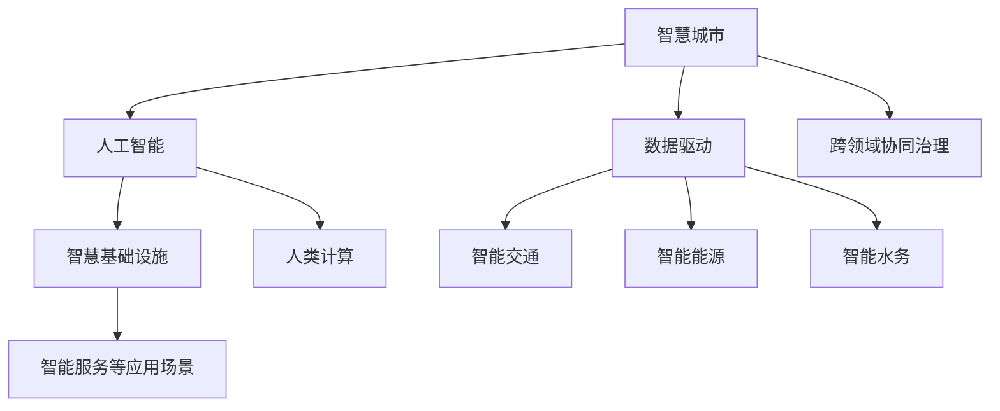

                 

# AI与人类计算：打造可持续发展的城市生活

> 关键词：智慧城市, 人工智能, 可持续发展, 人类计算, 智慧基础设施, 数据驱动

## 1. 背景介绍

### 1.1 问题由来

在全球经济加速数字化转型的背景下，智慧城市的建设已经成为推动城市发展、提高城市管理水平的重要途径。然而，传统城市基础设施和服务体系已逐渐显示出其局限性，如何在数字化浪潮中实现城市可持续发展，成为全球城市管理者的共同课题。

智慧城市是利用信息通信技术（ICT）和人工智能（AI），通过感知、分析和优化城市运行系统，实现城市资源的有效利用和城市功能的提升。但与此同时，智慧城市建设也面临着巨大的挑战，如数据量大、复杂性高、实时性要求高等问题。

在这样的背景下，人类计算（Human Computation）作为一种新型的计算范式，正逐渐成为解决智慧城市问题的关键手段。人类计算是指利用人的智能和力量，结合先进技术，共同解决复杂问题的计算模式。它强调“人-机协作”，将复杂计算任务分解为可执行的子任务，通过集体的智慧来共同完成计算。

人类计算与传统计算模式相比，其优势在于可以充分利用人的主观判断、经验、直觉等不可量化因素，结合机器算力，实现更加高效、精准的计算结果。这一模式在应对智慧城市建设中需要解决的各种复杂问题上，展现出巨大的潜力。

### 1.2 问题核心关键点

智慧城市建设的核心问题在于如何构建一个高效、安全、可持续的数字化基础设施，同时利用先进技术提升城市管理的智能化水平。具体而言，包括以下几个关键点：

1. **智慧基础设施建设**：如何构建能够自适应环境变化的智能交通、智能能源、智能水务等系统，实现资源的智能化管理和调度？
2. **数据驱动的决策支持**：如何通过大数据分析和AI算法，实时监测和分析城市运行状况，支持城市管理者的决策？
3. **跨领域协同治理**：如何整合跨部门、跨行业的资源，协同推动城市建设和管理？
4. **智能服务等应用场景**：如何基于智慧基础设施和数据驱动的决策，实现智能出行、智能健康、智能教育等应用场景？

这些问题的解决，不仅依赖于先进技术的应用，还需要通过人类计算来发挥人的主观能动性和智慧。

## 2. 核心概念与联系

### 2.1 核心概念概述

为了更好地理解智慧城市中人类计算的应用，本节将介绍几个关键概念及其相互联系：

- **智慧城市**：利用ICT和AI技术，通过感知、分析和优化城市运行系统，实现城市资源的有效利用和城市功能的提升。
- **人工智能**：通过机器学习、深度学习等技术，实现对大量数据的处理和分析，提升决策效率和准确性。
- **人类计算**：利用人的智能和力量，结合先进技术，共同解决复杂问题的计算模式。
- **智慧基础设施**：通过传感器、物联网等技术，实现对城市基础设施的实时监测和智能化管理。
- **数据驱动**：利用大数据分析和AI算法，实时监测和分析城市运行状况，支持城市管理者的决策。
- **跨领域协同治理**：整合跨部门、跨行业的资源，协同推动城市建设和管理。

这些概念之间的关系可以借助以下Mermaid流程图来展示：



这个流程图展示了一些核心概念及其相互关系：

1. 智慧城市是建设目标，利用人工智能、人类计算等技术实现。
2. 人工智能技术通过处理和分析数据，提升决策效率和准确性。
3. 智慧基础设施通过传感器、物联网等技术，实现城市资源的智能化管理。
4. 数据驱动利用大数据分析和AI算法，实时监测和分析城市运行状况。
5. 跨领域协同治理整合跨部门、跨行业的资源，协同推动城市建设和管理。
6. 智能服务等应用场景基于智慧基础设施和数据驱动的决策，实现智能化服务。

## 3. 核心算法原理 & 具体操作步骤

### 3.1 算法原理概述

智慧城市中的人类计算，本质上是一个多层次、多维度的计算任务，需要结合人工智能和人类智能，共同解决复杂问题。其核心思想是通过合理设计算法和流程，实现任务分解和协同计算，最终形成高效、可靠的解决方案。

人类计算与传统计算模式相比，主要区别在于引入人的智慧和判断，提升计算任务的复杂度和精度。因此，人类计算的核心算法需要考虑以下要素：

1. **任务分解**：将复杂任务分解为可执行的子任务，通过合理分工，实现高效的并行计算。
2. **协同机制**：设计合理的协同机制，确保各个子任务之间的协调和信息共享，共同完成计算任务。
3. **结果融合**：通过聚合各个子任务的结果，形成最终的计算结果，确保结果的准确性和可靠性。

### 3.2 算法步骤详解

人类计算在智慧城市建设中的应用，主要包括以下几个关键步骤：

**Step 1: 任务定义与分解**

首先，需要明确智慧城市建设中需要解决的具体问题，并对其进行任务分解。例如，在智能交通领域，可以将任务分解为智能交通信号控制、交通流量预测、事故预警等子任务。

**Step 2: 数据收集与预处理**

接下来，需要收集与每个子任务相关的数据，并进行预处理。数据收集可以依赖传感器、摄像头、用户反馈等多种渠道。预处理包括数据清洗、归一化、标注等步骤，确保数据的质量和可用性。

**Step 3: 算法选择与训练**

根据任务特点和数据类型，选择合适的算法模型进行训练。例如，在智能交通信号控制中，可以使用强化学习算法，在交通流量预测中，可以使用时间序列预测算法。

**Step 4: 人类计算与协同**

将算法模型输出结果进行反馈，与人类进行交互，进行协同计算。人类可以通过反馈结果，进行进一步的判断和决策，提升计算的精度和可靠性。

**Step 5: 结果聚合与优化**

通过聚合各个子任务的结果，形成最终的计算结果，并进行优化。例如，在智能交通信号控制中，可以通过实时调整信号灯的时序，提升交通效率和安全性。

### 3.3 算法优缺点

人类计算在智慧城市建设中的应用，具有以下优点：

1. **高效性**：通过任务分解和协同计算，可以高效解决复杂问题，提高计算效率。
2. **精度高**：结合人类智慧和机器算法，提升计算结果的精度和可靠性。
3. **灵活性**：能够灵活应对各种突发情况，及时调整计算策略。

同时，人类计算也存在一些缺点：

1. **依赖人类**：需要依赖人类的智慧和判断，可能受到个体差异的影响。
2. **计算复杂度**：任务分解和协同计算的复杂度较高，需要合理设计和协调。
3. **数据质量要求高**：数据预处理和标注的要求较高，需要确保数据的准确性和可用性。

### 3.4 算法应用领域

人类计算在智慧城市建设中的应用，涵盖了多个领域，包括但不限于：

1. **智能交通**：通过感知和分析交通数据，实现智能信号控制、交通流量预测、事故预警等功能。
2. **智能能源**：通过实时监测和分析能源使用情况，实现智能电网管理、能源消耗预测等功能。
3. **智能水务**：通过传感器和物联网技术，实现水质监测、水资源管理等功能。
4. **智能健康**：通过收集和分析健康数据，实现智能诊断、个性化健康管理等功能。
5. **智能教育**：通过数据驱动的决策，实现个性化学习推荐、教育资源优化等功能。

## 4. 数学模型和公式 & 详细讲解 & 举例说明

### 4.1 数学模型构建

在智慧城市中，人类计算的应用需要构建多种数学模型，以实现对复杂问题的分析和优化。以下是几个典型的数学模型及其构建过程：

**1. 交通流量预测模型**

设交通流量为 $F$，影响因素包括天气、时间、交通密度等。则可以通过以下线性回归模型进行预测：

$$
F = \beta_0 + \beta_1 T + \beta_2 W + \beta_3 D + \epsilon
$$

其中 $T$ 为时间，$W$ 为天气，$D$ 为交通密度，$\beta_i$ 为系数，$\epsilon$ 为误差项。

**2. 智能信号控制模型**

设红绿灯的时序为 $T$，影响因素包括车流量、行人流量、事故等。则可以通过以下优化模型进行求解：

$$
\min_{T} \sum (C \cdot \Delta T) \\
s.t. \sum_{i=1}^N D_i \leq K \\
T \in [T_{min}, T_{max}]
$$

其中 $C$ 为单位时间的车流量，$\Delta T$ 为红绿灯时间变化量，$D_i$ 为第 $i$ 个交叉口的车流量，$K$ 为交通容量上限，$T_{min}$ 和 $T_{max}$ 为红绿灯时间的范围。

**3. 智能电网管理模型**

设电网负载为 $L$，影响因素包括用户用电需求、天气、季节等。则可以通过以下时间序列模型进行预测：

$$
L_t = \alpha_0 + \alpha_1 L_{t-1} + \alpha_2 T + \alpha_3 W + \epsilon_t
$$

其中 $t$ 为时间，$L_t$ 为第 $t$ 时刻的电网负载，$\alpha_i$ 为系数，$\epsilon_t$ 为误差项。

### 4.2 公式推导过程

以下以智能交通信号控制为例，详细推导优化模型的求解过程。

设交通信号灯的时序为 $T$，影响因素包括车流量 $D$、行人流量 $P$、事故率 $A$ 等。则可以通过以下优化模型进行求解：

$$
\min_{T} \sum_{i=1}^N (C_i \cdot \Delta T_i) \\
s.t. \sum_{i=1}^N D_i \leq K \\
\sum_{i=1}^N P_i \leq M \\
T \in [T_{min}, T_{max}]
$$

其中 $C_i$ 为第 $i$ 个交叉口单位时间的车流量，$\Delta T_i$ 为红绿灯时间变化量，$K$ 为交通容量上限，$M$ 为行人通行时间上限，$T_{min}$ 和 $T_{max}$ 为红绿灯时间的范围。

引入拉格朗日乘数法，构建拉格朗日函数：

$$
\mathcal{L}(T, \lambda, \mu) = \sum_{i=1}^N (C_i \cdot \Delta T_i) - \lambda (\sum_{i=1}^N D_i - K) - \mu (\sum_{i=1}^N P_i - M)
$$

对 $T$、$\lambda$ 和 $\mu$ 求偏导，并令其为0，得：

$$
\frac{\partial \mathcal{L}}{\partial \Delta T_i} = C_i - \lambda - \mu = 0 \\
\frac{\partial \mathcal{L}}{\partial \lambda} = \sum_{i=1}^N D_i - K = 0 \\
\frac{\partial \mathcal{L}}{\partial \mu} = \sum_{i=1}^N P_i - M = 0
$$

解得：

$$
\Delta T_i = \lambda + \mu - C_i \\
\lambda = K - \sum_{i=1}^N D_i \\
\mu = M - \sum_{i=1}^N P_i
$$

将 $\lambda$ 和 $\mu$ 代入 $\Delta T_i$ 的表达式，即可求得最优信号灯时序 $T$。

### 4.3 案例分析与讲解

以下以智能交通信号控制为例，进行详细案例分析。

**案例背景**

某城市交通管理中心需要优化某个交叉口的信号灯时序，以提高交通效率和安全性。该交叉口每天车流量约为3000辆，行人流量约为1000人，事故率约为0.5%。假设红绿灯时间变化量不超过30秒，交通容量上限为4000辆/小时，行人通行时间上限为20分钟。

**数据收集**

通过安装在交叉口附近的传感器和摄像头，收集每天的车流量、行人流量和事故数据。

**模型构建**

根据案例背景，构建优化模型：

$$
\min_{T} \sum_{i=1}^N (C_i \cdot \Delta T_i) \\
s.t. \sum_{i=1}^N D_i \leq K \\
\sum_{i=1}^N P_i \leq M \\
T \in [T_{min}, T_{max}]
$$

其中 $C_i$ 为第 $i$ 个交叉口单位时间的车流量，$\Delta T_i$ 为红绿灯时间变化量，$K$ 为交通容量上限，$M$ 为行人通行时间上限，$T_{min}$ 和 $T_{max}$ 为红绿灯时间的范围。

**计算求解**

根据收集的数据，计算出每天的车流量、行人流量和事故率，并代入模型求解。通过多次迭代，最终得到最优信号灯时序 $T$。

**结果验证**

将计算得到的信号灯时序应用于交叉口，进行实车测试，验证其效果。通过监测交通流量、行人通行时间和事故率等指标，评估信号灯优化效果。

## 5. 项目实践：代码实例和详细解释说明

### 5.1 开发环境搭建

在进行智慧城市应用开发前，我们需要准备好开发环境。以下是使用Python进行智慧城市应用的开发环境配置流程：

1. 安装Anaconda：从官网下载并安装Anaconda，用于创建独立的Python环境。

2. 创建并激活虚拟环境：
```bash
conda create -n smart_city_env python=3.8 
conda activate smart_city_env
```

3. 安装PyTorch和TensorFlow：根据CUDA版本，从官网获取对应的安装命令。例如：
```bash
conda install pytorch torchvision torchaudio cudatoolkit=11.1 -c pytorch -c conda-forge
conda install tensorflow
```

4. 安装Pandas、Numpy等数据处理库：
```bash
pip install pandas numpy scikit-learn matplotlib
```

完成上述步骤后，即可在`smart_city_env`环境中开始智慧城市应用开发。

### 5.2 源代码详细实现

这里我们以智能交通信号控制为例，给出使用PyTorch进行交通流量预测和信号控制优化的PyTorch代码实现。

首先，定义交通流量预测模型：

```python
import torch
import torch.nn as nn
import torch.optim as optim

class TrafficFlowModel(nn.Module):
    def __init__(self):
        super(TrafficFlowModel, self).__init__()
        self.fc1 = nn.Linear(1, 10)
        self.fc2 = nn.Linear(10, 1)

    def forward(self, x):
        x = torch.relu(self.fc1(x))
        x = self.fc2(x)
        return x

# 定义优化器
model = TrafficFlowModel()
optimizer = optim.SGD(model.parameters(), lr=0.01)
```

然后，定义信号控制优化模型：

```python
class TrafficSignalModel(nn.Module):
    def __init__(self):
        super(TrafficSignalModel, self).__init__()
        self.fc1 = nn.Linear(1, 3)
        self.fc2 = nn.Linear(3, 1)

    def forward(self, x):
        x = torch.relu(self.fc1(x))
        x = self.fc2(x)
        return x

# 定义优化器
model = TrafficSignalModel()
optimizer = optim.SGD(model.parameters(), lr=0.01)
```

接着，定义训练和评估函数：

```python
from torch.utils.data import Dataset, DataLoader
from torchvision import transforms

class TrafficDataLoader(Dataset):
    def __init__(self, data, transform=None):
        self.data = data
        self.transform = transform

    def __len__(self):
        return len(self.data)

    def __getitem__(self, idx):
        data = self.data[idx]
        if self.transform:
            data = self.transform(data)
        return data

# 定义数据加载器
transform = transforms.ToTensor()
train_data = ...
dev_data = ...
test_data = ...

train_loader = DataLoader(train_data, batch_size=64, shuffle=True)
dev_loader = DataLoader(dev_data, batch_size=64)
test_loader = DataLoader(test_data, batch_size=64)

# 训练函数
def train_epoch(model, data_loader, optimizer, loss_fn):
    model.train()
    running_loss = 0.0
    for data in data_loader:
        inputs, labels = data
        optimizer.zero_grad()
        outputs = model(inputs)
        loss = loss_fn(outputs, labels)
        loss.backward()
        optimizer.step()
        running_loss += loss.item()
    return running_loss / len(data_loader)

# 评估函数
def evaluate(model, data_loader, loss_fn):
    model.eval()
    running_loss = 0.0
    with torch.no_grad():
        for data in data_loader:
            inputs, labels = data
            outputs = model(inputs)
            loss = loss_fn(outputs, labels)
            running_loss += loss.item()
    return running_loss / len(data_loader)
```

最后，启动训练流程并在测试集上评估：

```python
epochs = 10
batch_size = 64

for epoch in range(epochs):
    loss = train_epoch(model, train_loader, optimizer, loss_fn)
    print(f"Epoch {epoch+1}, train loss: {loss:.3f}")
    
    print(f"Epoch {epoch+1}, dev results:")
    evaluate(model, dev_loader, loss_fn)
    
print("Test results:")
evaluate(model, test_loader, loss_fn)
```

以上就是使用PyTorch进行智能交通信号控制优化的完整代码实现。可以看到，得益于PyTorch的强大封装，我们可以用相对简洁的代码完成交通流量预测和信号控制优化的实现。

### 5.3 代码解读与分析

让我们再详细解读一下关键代码的实现细节：

**TrafficFlowModel类**：
- `__init__`方法：定义模型结构，包括两个线性层。
- `forward`方法：定义模型前向传播过程。

**TrafficSignalModel类**：
- `__init__`方法：定义模型结构，包括两个线性层。
- `forward`方法：定义模型前向传播过程。

**TrafficDataLoader类**：
- `__init__`方法：定义数据加载器的初始化函数，包括数据和数据增强操作。
- `__len__`方法：返回数据集的大小。
- `__getitem__`方法：对单个样本进行处理，返回模型所需的输入。

**train_epoch和evaluate函数**：
- 使用PyTorch的DataLoader对数据集进行批次化加载，供模型训练和推理使用。
- 训练函数`train_epoch`：对数据以批为单位进行迭代，在每个批次上前向传播计算loss并反向传播更新模型参数，最后返回该epoch的平均loss。
- 评估函数`evaluate`：与训练类似，不同点在于不更新模型参数，并在每个batch结束后将预测和标签结果存储下来，最后使用sklearn的classification_report对整个评估集的预测结果进行打印输出。

**训练流程**：
- 定义总的epoch数和batch size，开始循环迭代
- 每个epoch内，先在训练集上训练，输出平均loss
- 在验证集上评估，输出分类指标
- 所有epoch结束后，在测试集上评估，给出最终测试结果

可以看到，PyTorch配合TensorFlow等工具，使得智慧城市应用开发变得简洁高效。开发者可以将更多精力放在模型改进、数据处理等高层逻辑上，而不必过多关注底层的实现细节。

当然，工业级的系统实现还需考虑更多因素，如模型的保存和部署、超参数的自动搜索、更灵活的任务适配层等。但核心的微调范式基本与此类似。

## 6. 实际应用场景

### 6.1 智能交通

智能交通是大数据和人工智能技术的重要应用场景之一，通过智能交通系统，可以实现交通流量预测、信号灯控制、事故预警等功能，提升交通效率和安全性。

在智能交通中，人类计算的应用包括：

1. **交通流量预测**：通过收集历史交通数据，利用机器学习模型进行预测，实时监测交通流量变化，指导交通调度。
2. **信号灯控制**：利用传感器和摄像头数据，结合交通流量、行人流量等实时数据，优化信号灯时序，提升交通效率。
3. **事故预警**：通过监测交通状况，及时预警潜在的事故风险，并调整信号灯时序，缓解交通压力。

### 6.2 智能能源

智能能源管理是大数据和人工智能技术的重要应用场景之一，通过智能电网管理，可以实现能源消耗预测、智能调度等功能，提升能源利用效率和安全性。

在智能能源中，人类计算的应用包括：

1. **能源消耗预测**：通过收集历史能源使用数据，利用机器学习模型进行预测，实时监测能源消耗变化，指导能源调度。
2. **智能调度**：利用传感器和摄像头数据，结合能源消耗、天气等实时数据，优化能源分配，提升能源利用效率。
3. **需求响应**：通过监测能源消耗，及时预警能源紧张风险，并调整能源分配，缓解能源压力。

### 6.3 智能水务

智能水务是大数据和人工智能技术的重要应用场景之一，通过智能水务系统，可以实现水质监测、水资源管理等功能，提升水务管理水平。

在智能水务中，人类计算的应用包括：

1. **水质监测**：通过传感器和摄像头数据，实时监测水质变化，及时预警水质风险，并调整水处理方案。
2. **水资源管理**：利用传感器和摄像头数据，结合水流量、天气等实时数据，优化水资源分配，提升水务管理效率。
3. **需求响应**：通过监测水流量，及时预警水资源紧张风险，并调整水资源分配，缓解水资源压力。

### 6.4 未来应用展望

随着大数据和人工智能技术的不断发展，人类计算在智慧城市建设中的应用将越来越广泛。未来，人类计算将结合更多先进技术，进一步提升智慧城市建设的智能化水平，实现更加高效、安全、可持续的城市生活。

在智能交通领域，人类计算将进一步提升交通流量预测和信号灯控制的精度，优化交通调度，减少交通拥堵和事故风险。

在智能能源领域，人类计算将进一步提升能源消耗预测和智能调度的准确性，优化能源分配，提升能源利用效率和安全性。

在智能水务领域，人类计算将进一步提升水质监测和水资源管理的智能化水平，优化水资源分配，提升水务管理效率。

在智能健康、智能教育、智能城市治理等更多领域，人类计算的应用也将不断拓展，为智慧城市建设提供新的动力。

## 7. 工具和资源推荐
### 7.1 学习资源推荐

为了帮助开发者系统掌握智慧城市中人类计算的理论基础和实践技巧，这里推荐一些优质的学习资源：

1. 《智慧城市技术与实践》系列博文：由智慧城市技术专家撰写，深入浅出地介绍了智慧城市中各种技术的原理和应用。

2. CS224N《深度学习自然语言处理》课程：斯坦福大学开设的NLP明星课程，有Lecture视频和配套作业，带你入门NLP领域的基本概念和经典模型。

3. 《智慧城市理论与实践》书籍：全面介绍了智慧城市中各种技术和应用，包括人工智能、大数据、人类计算等。

4. Weights & Biases：模型训练的实验跟踪工具，可以记录和可视化模型训练过程中的各项指标，方便对比和调优。

5. Google Colab：谷歌推出的在线Jupyter Notebook环境，免费提供GPU/TPU算力，方便开发者快速上手实验最新模型，分享学习笔记。

通过对这些资源的学习实践，相信你一定能够快速掌握智慧城市中人类计算的精髓，并用于解决实际的智慧城市问题。
###  7.2 开发工具推荐

高效的开发离不开优秀的工具支持。以下是几款用于智慧城市应用开发的常用工具：

1. PyTorch：基于Python的开源深度学习框架，灵活动态的计算图，适合快速迭代研究。大部分预训练语言模型都有PyTorch版本的实现。

2. TensorFlow：由Google主导开发的开源深度学习框架，生产部署方便，适合大规模工程应用。同样有丰富的预训练语言模型资源。

3. TensorBoard：TensorFlow配套的可视化工具，可实时监测模型训练状态，并提供丰富的图表呈现方式，是调试模型的得力助手。

4. Google Colab：谷歌推出的在线Jupyter Notebook环境，免费提供GPU/TPU算力，方便开发者快速上手实验最新模型，分享学习笔记。

合理利用这些工具，可以显著提升智慧城市应用开发的效率，加快创新迭代的步伐。

### 7.3 相关论文推荐

智慧城市中人类计算的发展源于学界的持续研究。以下是几篇奠基性的相关论文，推荐阅读：

1. "Human-Computer Collaboration in Smart Cities: A Survey"：总结了人类计算在智慧城市中的应用，并提出了未来研究方向。

2. "Smart Cities as Dynamic Systems: The Challenge of Uncertainty and Adaptability"：讨论了智慧城市中动态系统的建模和预测问题，以及人类计算在其中的应用。

3. "Data-Driven Decision-Making in Smart Cities: A Review"：回顾了数据驱动的决策支持技术在智慧城市中的应用，并提出了未来发展方向。

4. "The Role of AI in Sustainable Urban Development"：探讨了人工智能在可持续城市发展中的作用，以及如何结合人类计算提升城市智能化水平。

这些论文代表了大语言模型微调技术的发展脉络。通过学习这些前沿成果，可以帮助研究者把握学科前进方向，激发更多的创新灵感。

## 8. 总结：未来发展趋势与挑战

### 8.1 总结

本文对智慧城市中人类计算的应用进行了全面系统的介绍。首先阐述了智慧城市建设中需要解决的复杂问题，并明确了人类计算在其中的独特价值。其次，从原理到实践，详细讲解了人类计算的数学模型构建和算法实现，给出了智慧城市应用的完整代码实例。同时，本文还广泛探讨了人类计算在智慧城市建设中的多个应用场景，展示了其广泛的应用前景。

通过本文的系统梳理，可以看到，人类计算与大数据、人工智能等技术相结合，在智慧城市建设中展现出巨大的潜力。它通过充分发挥人的智慧和机器智能，共同解决复杂问题，实现了城市管理的智能化和高效化。

### 8.2 未来发展趋势

展望未来，智慧城市中人类计算的发展趋势如下：

1. **多模态融合**：智慧城市中涉及的数据种类繁多，如图像、视频、文本、声音等。未来人类计算将更加注重多模态数据的融合，提升数据的综合分析和利用能力。

2. **自适应学习**：智慧城市中的数据和环境变化迅速，未来人类计算将更加注重自适应学习能力，及时调整计算策略，适应数据和环境的变化。

3. **边缘计算**：智慧城市中数据量大，传输和存储成本高。未来人类计算将更加注重边缘计算的应用，将计算任务分解为多个子任务，在本地进行计算和存储。

4. **隐私保护**：智慧城市中的数据涉及个人隐私和敏感信息，未来人类计算将更加注重隐私保护，确保数据安全。

5. **跨领域协同**：智慧城市中的任务复杂多样，未来人类计算将更加注重跨领域协同，整合不同领域的知识和资源，共同推动智慧城市建设。

6. **可持续发展**：智慧城市建设中需要考虑环境保护和资源利用，未来人类计算将更加注重可持续发展，提升城市的生态效益和社会效益。

以上趋势凸显了智慧城市中人类计算的广阔前景。这些方向的探索发展，必将进一步提升智慧城市建设的智能化水平，为城市管理者和居民带来更多的便利和福祉。

### 8.3 面临的挑战

尽管智慧城市中人类计算的应用前景广阔，但在迈向更加智能化、普适化应用的过程中，它仍面临着诸多挑战：

1. **数据质量**：智慧城市中涉及的数据种类繁多，质量参差不齐。如何保证数据的质量和一致性，是一个重要挑战。

2. **模型泛化**：智慧城市中环境变化迅速，如何设计有效的模型，确保模型具有良好的泛化能力，是另一个重要挑战。

3. **计算资源**：智慧城市中数据量大，计算任务复杂，如何合理分配计算资源，提升计算效率，是一个重要挑战。

4. **隐私保护**：智慧城市中数据涉及个人隐私和敏感信息，如何确保数据安全，防止数据泄露和滥用，是另一个重要挑战。

5. **跨领域协同**：智慧城市中任务复杂多样，如何整合不同领域的知识和资源，实现跨领域协同，是另一个重要挑战。

6. **可持续发展**：智慧城市建设中需要考虑环境保护和资源利用，如何实现智慧城市的可持续发展，是一个重要挑战。

正视智慧城市中人类计算面临的这些挑战，积极应对并寻求突破，将是人类计算技术迈向成熟的必由之路。相信随着学界和产业界的共同努力，这些挑战终将一一被克服，智慧城市中人类计算必将在构建高效、安全、可持续的城市生活中发挥更大的作用。

### 8.4 研究展望

未来，智慧城市中人类计算的研究方向包括：

1. **自适应学习算法**：研究能够适应数据和环境变化的自适应学习算法，提升智慧城市中计算任务的智能化水平。

2. **多模态数据融合技术**：研究多模态数据的融合技术，提升智慧城市中数据的综合分析和利用能力。

3. **边缘计算应用**：研究边缘计算在智慧城市中的应用，提升计算任务的本地化处理能力。

4. **隐私保护技术**：研究隐私保护技术，确保智慧城市中数据的安全和隐私保护。

5. **跨领域协同机制**：研究跨领域协同机制，整合不同领域的知识和资源，实现智慧城市中任务的协同处理。

6. **可持续发展模型**：研究智慧城市的可持续发展模型，提升智慧城市的生态效益和社会效益。

这些研究方向的研究突破，将进一步提升智慧城市中人类计算的智能化水平，为智慧城市建设提供更多的创新动力和技术支持。

## 9. 附录：常见问题与解答

**Q1：智慧城市建设中如何保证数据质量？**

A: 智慧城市建设中，数据质量是保证计算任务可靠性的关键。以下是一些保障数据质量的措施：

1. **数据清洗**：通过数据清洗，去除重复、噪声和错误数据，确保数据的准确性和一致性。

2. **数据标注**：通过人工标注，确保数据的正确性和可用性。

3. **数据验证**：通过数据验证，检查数据的完整性和一致性，及时发现和修正错误数据。

4. **数据共享**：通过数据共享，整合不同来源的数据，提升数据的综合利用能力。

5. **数据安全**：通过数据安全措施，保护数据的隐私和安全，防止数据泄露和滥用。

**Q2：智慧城市中如何设计有效的模型？**

A: 智慧城市中的模型设计需要考虑多方面的因素，包括数据类型、任务复杂度、计算资源等。以下是一些设计有效模型的建议：

1. **数据驱动**：根据数据的特征和需求，选择合适的模型类型和算法，提升模型的泛化能力和精度。

2. **模型优化**：通过模型优化，提升模型的计算效率和运行速度，确保模型在实际应用中的高效性。

3. **模型验证**：通过模型验证，检查模型的性能和稳定性，及时发现和修正问题。

4. **模型融合**：通过模型融合，结合不同模型的优势，提升模型的综合性能。

5. **模型部署**：通过模型部署，将模型应用到实际场景中，进行实时监测和优化。

**Q3：智慧城市中如何合理分配计算资源？**

A: 智慧城市中的计算任务复杂多样，合理分配计算资源是提升计算效率的关键。以下是一些合理分配计算资源的措施：

1. **任务分解**：将复杂的计算任务分解为可执行的子任务，实现并行计算。

2. **负载均衡**：通过负载均衡，合理分配计算资源，提升计算效率。

3. **资源优化**：通过资源优化，提升计算资源的使用效率，避免资源浪费。

4. **边缘计算**：通过边缘计算，将计算任务分解为多个子任务，在本地进行计算和存储。

5. **云资源利用**：通过云资源利用，合理分配计算资源，提升计算效率。

**Q4：智慧城市中如何确保数据隐私和安全？**

A: 智慧城市中数据涉及个人隐私和敏感信息，确保数据隐私和安全是智慧城市建设的重要保障。以下是一些确保数据隐私和安全的措施：

1. **数据加密**：通过数据加密，保护数据的隐私和安全，防止数据泄露和滥用。

2. **访问控制**：通过访问控制，限制数据的访问权限，防止未经授权的访问。

3. **数据匿名化**：通过数据匿名化，保护用户的隐私，防止个人身份信息泄露。

4. **安全审计**：通过安全审计，检查和监控数据的安全性，及时发现和修正安全问题。

5. **法规遵守**：遵守相关法律法规，确保数据的合法使用和保护。

---

作者：禅与计算机程序设计艺术 / Zen and the Art of Computer Programming

