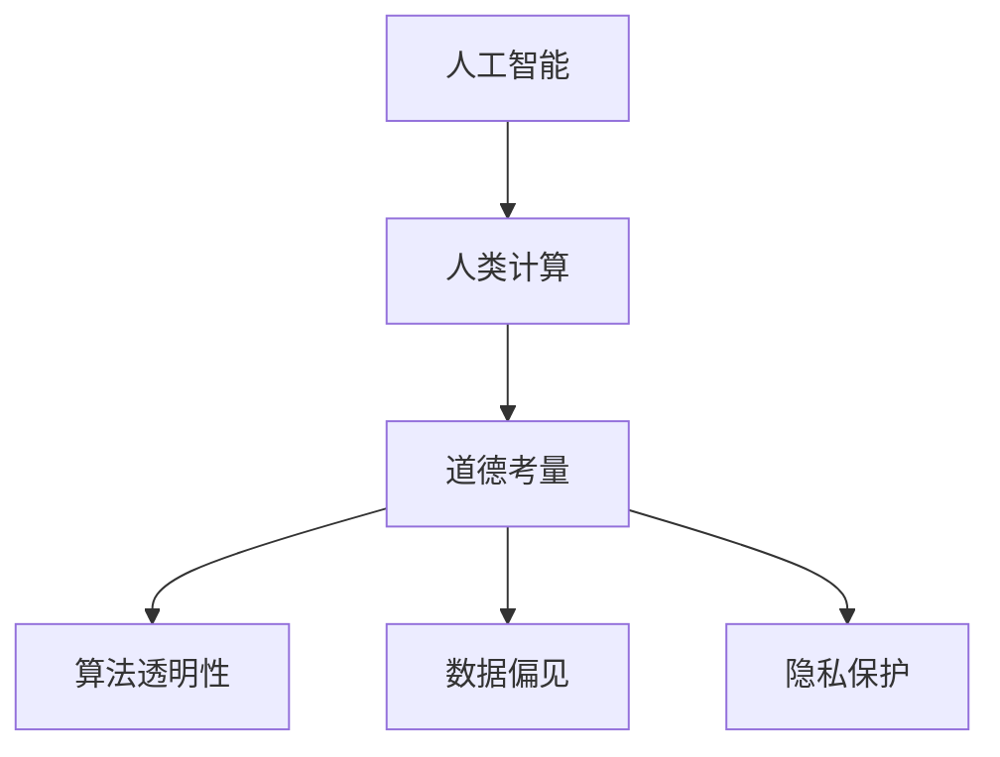

                 

# AI与人类计算：未来的道德考虑

> 关键词：人工智能,人类计算,未来,道德考虑,技术伦理

## 1. 背景介绍

### 1.1 问题由来
人工智能（AI）的迅猛发展为人类社会带来了前所未有的变革与机遇。从自动化生产线到医疗影像诊断，从自动驾驶汽车到个性化推荐系统，AI技术渗透到了人类生活的方方面面。然而，随着AI应用的深化和普及，其带来的道德和伦理问题也愈发凸显。AI在提升效率、优化决策的同时，可能带来隐私泄露、算法偏见、就业影响等负面效应。这些问题如不能妥善解决，可能导致AI技术在应用中失衡，甚至威胁社会稳定与发展。因此，在推动AI技术发展的过程中，道德考量和伦理原则的引入至关重要。

### 1.2 问题核心关键点
AI与人类计算的结合，既包含了技术层面的挑战，也触及了伦理层面的探讨。本文将从这两个维度，全面探讨AI技术在应用中的道德考量问题。

1. **技术层面**：如何设计公正、透明、可解释的AI系统，以应对数据偏见、算法透明性、隐私保护等问题。
2. **伦理层面**：AI技术如何与人类社会的道德价值、法律法规相协调，确保AI技术的应用符合人类的利益和伦理标准。

## 2. 核心概念与联系

### 2.1 核心概念概述

为更好地理解AI与人类计算中的道德考量，本节将介绍几个关键概念及其相互联系：

- **人工智能**：通过算法和数据训练出的智能系统，能够自动完成特定任务。
- **人类计算**：利用人机协同的方式，将复杂问题简化并解决的技术。
- **道德考量**：指在设计和应用AI技术时，需要考虑的伦理原则和社会责任。
- **算法透明性**：AI系统内部决策过程的公开性和可理解性。
- **数据偏见**：指算法因训练数据的不平衡或不充分导致的结果偏向。
- **隐私保护**：保护个人数据不被滥用，确保用户信息的安全性。

这些概念之间的逻辑关系可以通过以下Mermaid流程图来展示：



这个流程图展示了一个从技术到伦理的过程：人工智能在人类计算中的应用，不可避免地涉及道德考量，需要通过算法透明性、数据偏见、隐私保护等维度来加以解决和规范。

## 3. 核心算法原理 & 具体操作步骤
### 3.1 算法原理概述

AI与人类计算的道德考量，核心在于如何在技术应用中平衡效率与伦理，确保AI系统的决策透明、公正、可解释，同时保护用户隐私。

### 3.2 算法步骤详解

**Step 1: 设计透明算法**

- **算法设计**：在算法设计阶段，引入伦理和法律专家，制定算法使用的伦理准则和规范。
- **结果解释**：确保算法输出的结果可解释，能够提供充分的解释和理由。
- **持续监测**：建立机制，持续监测算法在实际应用中的表现，及时调整优化。

**Step 2: 数据处理与偏见缓解**

- **数据收集**：数据收集过程中，确保样本的多样性和代表性，避免数据偏见。
- **数据清洗**：对收集到的数据进行清洗，移除或纠正可能引起偏见的数据点。
- **偏见检测**：利用公平学习技术，检测和纠正数据集中的偏见，保证算法公正性。

**Step 3: 隐私保护措施**

- **数据匿名化**：对敏感数据进行匿名化处理，保护用户隐私。
- **差分隐私**：在数据分析和模型训练中引入差分隐私技术，确保数据的使用不泄露个人身份信息。
- **数据最小化**：仅收集和处理完成任务所需的最少数据，避免数据滥用。

**Step 4: 用户反馈与迭代**

- **用户参与**：在算法开发和应用过程中，邀请用户参与，收集反馈意见。
- **反馈迭代**：根据用户反馈，及时调整算法设计，优化用户体验。
- **伦理审查**：设立伦理审查委员会，对算法应用进行定期审查，确保其符合伦理标准。

### 3.3 算法优缺点

**优点**：

- **增强信任**：透明和公正的算法能够增强用户和公众对AI系统的信任。
- **提升合规性**：符合伦理和法律要求的AI系统，能够在全球范围内更广泛地应用。
- **减少争议**：透明和可解释的AI系统，能够减少因算法决策不公引发的争议。

**缺点**：

- **复杂性增加**：引入道德考量和伦理规范，可能会增加算法设计的复杂性。
- **成本增加**：数据处理、算法监测、伦理审查等措施，需要额外的成本投入。
- **技术限制**：目前的技术手段可能难以全面解决所有道德和伦理问题。

### 3.4 算法应用领域

AI与人类计算的道德考量，广泛应用于多个领域，如医疗健康、金融服务、公共安全、教育培训等。

- **医疗健康**：确保诊断和治疗算法公正，避免因算法偏见导致的医疗不公。
- **金融服务**：保证信贷、保险等金融算法的透明性和公正性，避免歧视性决策。
- **公共安全**：确保面部识别、视频监控等技术不侵犯个人隐私，符合法律规定。
- **教育培训**：开发公正、透明的个性化学习系统，确保学习资源分配的公平。

## 4. 数学模型和公式 & 详细讲解  
### 4.1 数学模型构建

在AI与人类计算中，我们常常使用机器学习模型来进行决策和预测。以下是一个简单的分类模型的数学模型构建过程：

- **输入**：$x = (x_1, x_2, ..., x_n)$
- **输出**：$y \in \{0, 1\}$，表示分类结果
- **模型**：$f(x; \theta) = \sigma(\theta^T x)$，其中$\sigma$为激活函数，$\theta$为模型参数

**公式推导过程**

对于二分类问题，常用的模型包括逻辑回归和支持向量机等。这里以逻辑回归为例，推导其损失函数和梯度下降公式。

- **损失函数**：$L(y, f(x; \theta)) = -y\log f(x; \theta) - (1-y)\log(1-f(x; \theta))$
- **梯度下降公式**：$\frac{\partial L}{\partial \theta} = f(x; \theta) - y$

其中，$y$为真实标签，$f(x; \theta)$为模型预测结果。

**案例分析与讲解**

以金融信用评估为例，设计一个基于AI的信用评分模型。

- **输入**：用户的个人信息、历史交易记录等
- **输出**：用户信用评分，$y \in [0, 1]$
- **模型**：$f(x; \theta) = \sigma(\theta^T x)$

在模型训练时，使用交叉熵损失函数，通过梯度下降优化算法，不断更新模型参数$\theta$。

## 5. 项目实践：代码实例和详细解释说明
### 5.1 开发环境搭建

在开始项目实践前，我们需要准备好开发环境。以下是使用Python进行机器学习开发的环境配置流程：

1. 安装Anaconda：从官网下载并安装Anaconda，用于创建独立的Python环境。

2. 创建并激活虚拟环境：
```bash
conda create -n ml-env python=3.8 
conda activate ml-env
```

3. 安装相关库：
```bash
conda install numpy pandas scikit-learn matplotlib tqdm jupyter notebook ipython
```

4. 安装TensorFlow和PyTorch：
```bash
pip install tensorflow==2.0
pip install torch torchvision torchaudio
```

完成上述步骤后，即可在`ml-env`环境中开始机器学习实践。

### 5.2 源代码详细实现

以下是一个简单的信用评分模型的Python代码实现：

```python
import numpy as np
from sklearn.linear_model import LogisticRegression
from sklearn.metrics import accuracy_score

# 训练数据
X_train = np.array([[1, 2, 3], [4, 5, 6], [7, 8, 9]])
y_train = np.array([0, 1, 0])

# 创建模型并训练
model = LogisticRegression()
model.fit(X_train, y_train)

# 测试数据
X_test = np.array([[10, 11, 12], [13, 14, 15]])
y_test = np.array([1, 1])

# 预测并评估
y_pred = model.predict(X_test)
print(f"预测结果: {y_pred}")
print(f"模型准确率: {accuracy_score(y_test, y_pred)}")
```

### 5.3 代码解读与分析

这段代码展示了如何使用sklearn库中的LogisticRegression模型进行二分类问题的训练和预测。

- `X_train`和`y_train`为训练集数据，`X_test`和`y_test`为测试集数据。
- 创建LogisticRegression模型，并使用训练数据`X_train`和`y_train`进行模型训练。
- 对测试集数据`X_test`进行预测，并计算模型准确率。

## 6. 实际应用场景
### 6.1 医疗健康

在医疗领域，AI技术被广泛应用于疾病诊断、个性化治疗等方面。然而，AI系统的道德考量尤为重要。

- **数据隐私**：医疗数据涉及个人隐私，必须严格保护，防止数据泄露。
- **算法透明性**：确保诊断和治疗算法的透明性和可解释性，减少医疗不公。
- **公平性**：避免因算法偏见导致的诊断和治疗不公平。

例如，使用AI进行肺癌筛查时，必须确保算法的公正性和可解释性，避免因数据偏见导致的误诊和不公。

### 6.2 金融服务

金融领域的AI应用，如信用评分、风险控制等，对道德考量的需求同样迫切。

- **数据偏见**：金融数据中可能存在性别、种族等偏见，需要检测并纠正。
- **隐私保护**：确保用户隐私不被滥用，符合数据保护法规。
- **公平性**：避免因算法偏见导致的金融歧视，确保信用评分和风险控制的公正性。

例如，使用AI进行信用评分时，必须确保算法的公平性和透明性，避免因数据偏见导致的信用歧视。

### 6.3 公共安全

在公共安全领域，如面部识别、视频监控等技术，其道德考量同样重要。

- **隐私保护**：确保面部识别、视频监控等技术不侵犯个人隐私，符合法律规定。
- **透明性**：确保技术使用的透明性和可解释性，避免因算法偏见导致的误判。
- **社会责任**：确保技术应用符合社会道德标准，不滥用技术手段。

例如，使用AI进行面部识别时，必须确保算法的透明性和公正性，避免因偏见导致的误判。

## 7. 工具和资源推荐
### 7.1 学习资源推荐

为了帮助开发者系统掌握AI与人类计算中的道德考量，这里推荐一些优质的学习资源：

1. **《人工智能伦理》课程**：斯坦福大学开设的AI伦理课程，探讨AI技术在应用中的伦理问题，适合入门学习。

2. **《AI伦理与治理》书籍**：详细介绍了AI技术在各领域的应用中的伦理问题，提供了具体的解决方案。

3. **AI Ethics & Governance by Harvard Business Review**：哈佛商业评论的AI伦理专栏，涵盖AI技术在商业应用中的伦理挑战和应对策略。

4. **AI Ethics by IEEE**：IEEE推出的AI伦理标准和指南，提供了AI技术应用中的伦理参考。

5. **AI for Good by United Nations**：联合国AI for Good计划，汇集了全球AI伦理研究的最新成果，值得关注。

通过对这些资源的学习实践，相信你一定能够全面掌握AI与人类计算中的道德考量，并用于解决实际的伦理问题。

### 7.2 开发工具推荐

高效的开发离不开优秀的工具支持。以下是几款用于AI与人类计算开发的常用工具：

1. **Jupyter Notebook**：免费的开源笔记本环境，支持Python、R等语言，适合快速迭代研究。

2. **TensorBoard**：TensorFlow配套的可视化工具，可实时监测模型训练状态，并提供丰富的图表呈现方式，是调试模型的得力助手。

3. **Weights & Biases**：模型训练的实验跟踪工具，可以记录和可视化模型训练过程中的各项指标，方便对比和调优。

4. **MLflow**：全栈式的机器学习平台，集成了数据管理、模型版本控制、模型服务等功能，适合工业级应用。

5. **DataRobot**：自动化机器学习平台，自动选择最优模型并生成可解释报告，便于开发人员快速部署模型。

合理利用这些工具，可以显著提升AI与人类计算任务的开发效率，加快创新迭代的步伐。

### 7.3 相关论文推荐

AI与人类计算中的道德考量，是当前研究的热点话题。以下是几篇奠基性的相关论文，推荐阅读：

1. **Ethical Principles for Artificial Intelligence**：探讨AI技术的伦理原则，提出了一些基本的伦理规范。

2. **The Ethics of Algorithmic Decision Making**：讨论算法决策的伦理问题，提出了算法透明性、公平性等关键原则。

3. **Bias in Machine Learning Systems**：分析数据偏见对AI系统的影响，提出了消除数据偏见的方法。

4. **Privacy-Preserving Machine Learning**：探讨机器学习中的隐私保护技术，提供了具体的实现方法。

5. **Fairness, Accountability, and Transparency**：讨论AI系统的公平性、责任和透明性问题，提出了相应的技术措施。

这些论文代表了大语言模型微调技术的发展脉络。通过学习这些前沿成果，可以帮助研究者把握学科前进方向，激发更多的创新灵感。

## 8. 总结：未来发展趋势与挑战

### 8.1 总结

本文对AI与人类计算中的道德考量进行了全面系统的介绍。首先阐述了AI技术在应用中的伦理问题，明确了技术层面和伦理层面的关键考量点。其次，从原理到实践，详细讲解了透明算法、数据偏见、隐私保护等核心步骤，给出了AI系统的开发实现实例。同时，本文还探讨了AI技术在医疗健康、金融服务、公共安全等诸多领域的应用场景，展示了AI技术在提升效率、优化决策的同时，如何平衡效率与伦理。

通过本文的系统梳理，可以看到，AI技术在提升效率、优化决策的同时，必须注重道德考量和伦理原则的引入，确保技术应用符合人类的利益和伦理标准。未来，伴随AI技术的不断演进，道德考量和伦理原则的引入将变得更加重要，成为AI技术健康发展的基石。

### 8.2 未来发展趋势

展望未来，AI与人类计算的道德考量将呈现以下几个发展趋势：

1. **伦理框架制定**：全球范围内的AI伦理框架将逐渐完善，提供统一的伦理标准和规范。
2. **透明性技术提升**：透明性技术将进一步提升，确保算法的可解释性和公正性。
3. **数据偏见检测**：数据偏见检测技术将更加先进，避免因数据偏见导致的决策不公。
4. **隐私保护加强**：隐私保护技术将不断提升，确保数据的安全和隐私。
5. **跨领域应用扩展**：AI技术将广泛应用于更多领域，推动各行业数字化转型。

以上趋势凸显了AI与人类计算中道德考量的重要性，也为未来的研究提供了方向。这些方向的探索发展，必将进一步提升AI技术的社会效益和应用范围，为人类社会的健康发展提供有力支持。

### 8.3 面临的挑战

尽管AI与人类计算在道德考量方面取得了一定进展，但在迈向更加智能化、普适化应用的过程中，仍面临诸多挑战：

1. **技术复杂性**：引入道德考量和伦理规范，可能会增加算法设计的复杂性。
2. **成本投入高**：数据处理、算法监测、伦理审查等措施，需要额外的成本投入。
3. **技术瓶颈**：目前的技术手段可能难以全面解决所有道德和伦理问题。
4. **伦理共识不足**：不同国家和地区的伦理标准存在差异，导致AI技术的全球应用受限。
5. **社会接受度低**：部分社会群体对AI技术的接受度不高，可能引发抵触情绪。

正视AI与人类计算面临的这些挑战，积极应对并寻求突破，将是大规模AI技术应用的重要保障。

### 8.4 研究展望

面对AI与人类计算的伦理挑战，未来的研究需要在以下几个方面寻求新的突破：

1. **跨学科合作**：结合伦理学、社会学、法律学等多学科知识，全面提升AI系统的道德考量和伦理规范。
2. **技术创新**：开发更加透明、公正、可解释的AI算法，提升算法的公平性和透明度。
3. **法律法规完善**：制定完善的AI法律法规，确保AI技术的合规性和可控性。
4. **公众教育**：加强AI技术的公众教育，提升公众对AI技术的理解和接受度。
5. **国际合作**：推动全球范围内的AI伦理合作，建立统一的伦理标准和规范。

这些研究方向的探索，必将引领AI与人类计算技术的健康发展，为构建人机协同的智能时代提供坚实的基础。面向未来，AI与人类计算技术的伦理考量将成为其健康发展的关键因素，成为人类社会的共识和必然选择。

## 9. 附录：常见问题与解答

**Q1：如何在AI系统中实现道德考量？**

A: 实现AI系统的道德考量，需要从算法设计、数据处理、用户反馈等多个环节入手。

1. **算法设计**：引入伦理和法律专家，制定算法使用的伦理准则和规范。
2. **数据处理**：确保数据的多样性和代表性，避免数据偏见。
3. **用户反馈**：在算法开发和应用过程中，邀请用户参与，收集反馈意见，并根据反馈不断优化算法。
4. **伦理审查**：设立伦理审查委员会，对算法应用进行定期审查，确保其符合伦理标准。

**Q2：AI系统的隐私保护措施有哪些？**

A: AI系统的隐私保护措施主要包括：

1. **数据匿名化**：对敏感数据进行匿名化处理，保护用户隐私。
2. **差分隐私**：在数据分析和模型训练中引入差分隐私技术，确保数据的使用不泄露个人身份信息。
3. **数据最小化**：仅收集和处理完成任务所需的最少数据，避免数据滥用。

**Q3：如何提升AI系统的透明性？**

A: 提升AI系统的透明性，主要通过以下方法：

1. **模型可解释性**：使用可解释性技术，如LIME、SHAP等，生成模型的解释报告，帮助用户理解算法的决策过程。
2. **模型可视化**：通过可视化工具，展示模型的输入输出关系，提供直观的理解。
3. **算法设计透明**：在设计算法时，考虑其透明性和可解释性，避免复杂性导致的透明度不足。

**Q4：数据偏见对AI系统的影响有哪些？**

A: 数据偏见对AI系统的影响主要体现在以下几个方面：

1. **决策不公**：因数据偏见导致的决策不公平，可能对某些群体造成不利影响。
2. **模型性能差**：因数据偏见导致的模型性能下降，可能无法准确预测和分类。
3. **社会信任低**：因算法偏见导致的社会信任度降低，可能引发公众不满和社会抵触。

**Q5：如何在AI系统中实现公平性？**

A: 在AI系统中实现公平性，主要通过以下方法：

1. **数据处理**：确保数据的多样性和代表性，避免数据偏见。
2. **算法检测**：使用公平学习技术，检测和纠正数据集中的偏见，保证算法公正性。
3. **结果调整**：通过调整模型参数或引入正则化技术，优化模型输出，减少偏见影响。

**Q6：AI系统的伦理审查有哪些内容？**

A: AI系统的伦理审查主要包括以下内容：

1. **数据隐私**：检查数据收集和处理是否符合隐私保护法规。
2. **算法透明性**：评估算法的透明性和可解释性，确保用户理解算法决策。
3. **决策公平性**：检查算法是否存在偏见，确保决策公平。
4. **社会责任**：评估系统应用是否符合社会道德标准，避免负面影响。

通过这些方法的综合应用，可以最大限度地提升AI系统的道德考量和伦理规范，确保其在应用中的公正性和透明性。

---

作者：禅与计算机程序设计艺术 / Zen and the Art of Computer Programming

