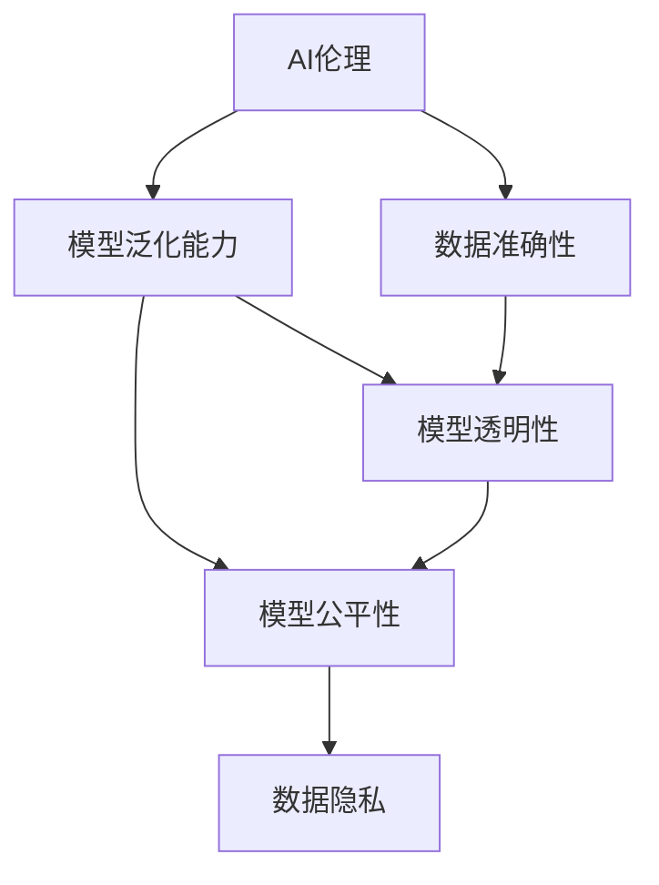

                 

# AI伦理困境:如何确保信息的准确性和可靠性

> 关键词：AI伦理,信息准确性,可靠性,机器学习,数据隐私,公平性,可信度,透明性

## 1. 背景介绍

### 1.1 问题由来

随着人工智能(AI)技术的迅猛发展，其在医疗、金融、司法、广告等诸多领域的应用已愈发广泛。然而，在AI技术给人们带来便利的同时，也引发了一系列伦理困境。其中，如何确保AI系统提供的信息准确性和可靠性，是当前面临的一个重要问题。

AI系统的信息准确性不仅关乎其在决策和推断中的有效性，更影响着社会公众对AI技术的信任。特别是当AI系统用于关键的决策场景，如医疗诊断、司法裁决等，信息的不准确可能导致严重后果，甚至可能威胁到人类的生命财产安全。

### 1.2 问题核心关键点

确保AI系统的信息准确性和可靠性，需要从多个方面进行考虑，包括但不限于：

- 数据的完整性、一致性和准确性。数据是AI系统的基础，任何数据偏差都可能导致模型学习到错误的知识。
- 模型的泛化能力。模型的泛化能力越强，其在未见过的数据上表现越好，避免过度拟合。
- 模型的透明性和可解释性。透明度高的模型更易于理解其决策过程，有助于提高信任度。
- 模型的公平性和偏见避免。避免模型对特定群体或特征存在偏见，确保公平性。
- 数据的隐私保护和合规性。保护用户隐私，遵守相关法律法规。

本文将重点探讨如何通过设计和优化AI系统，确保其信息的准确性和可靠性。

## 2. 核心概念与联系

### 2.1 核心概念概述

为更好地理解AI系统信息准确性，本节将介绍几个关键概念：

- AI伦理：研究AI系统在开发和应用过程中应遵守的道德规范和原则，确保AI技术的公正、透明、安全等特性。
- 数据准确性：指数据集中的每一个数据点在时间、空间、值等维度上的真实性和一致性。
- 模型泛化能力：指模型在未见过的数据上表现良好，避免在特定训练集上过拟合。
- 模型透明性：指模型输出和决策过程的可解释性，便于理解和验证。
- 模型公平性：指模型对所有样本的预测结果公平，避免对特定群体的歧视。
- 数据隐私：指对用户个人数据的保护，避免未经授权的访问和使用。

这些核心概念之间的逻辑关系可以通过以下Mermaid流程图来展示：



这个流程图展示了几者之间的联系：

1. 数据准确性是AI系统的基础。
2. 模型泛化能力越强，系统在未见过的数据上表现越好。
3. 模型的透明性和公平性能够增强系统的信任度和合法性。
4. 数据隐私保护是AI系统应用过程中必须遵守的伦理原则。

## 3. 核心算法原理 & 具体操作步骤

### 3.1 算法原理概述

确保AI系统信息的准确性和可靠性，需要结合多方面的技术手段。包括但不限于：

- 数据预处理：通过清洗、去重、标准化等技术手段，确保输入数据的准确性和一致性。
- 模型训练：通过适当的数据增强、正则化、对抗训练等技术手段，提升模型的泛化能力和鲁棒性。
- 模型评估：通过交叉验证、留一验证等技术手段，评估模型在不同数据集上的性能表现。
- 模型监控：通过实时监控系统的运行状态和输出结果，确保系统的稳定性和可靠性。

这些技术手段相互配合，共同构建了确保AI系统信息准确性和可靠性的整体框架。

### 3.2 算法步骤详解

#### 3.2.1 数据预处理

数据预处理是确保数据准确性的重要步骤，主要包括：

1. 数据清洗：删除或修正数据集中的异常值、错误值或缺失值。
2. 数据标准化：将数据归一化到相同的尺度，便于后续处理。
3. 数据增强：通过生成伪数据、合成样本等方式扩充数据集，避免过拟合。

以医疗影像数据为例，数据预处理步骤包括：

- 图像去噪：利用滤波、降噪算法去除噪声，提升影像清晰度。
- 影像分割：将影像分割成不同区域，提取感兴趣的区域。
- 影像对齐：将不同时间或不同来源的影像对齐，便于后续对比。

#### 3.2.2 模型训练

模型训练是提升模型泛化能力的关键步骤，主要包括：

1. 选择适当的模型架构和优化器。如卷积神经网络(CNN)、循环神经网络(RNN)、注意力机制等。
2. 设定合适的超参数。如学习率、批大小、迭代次数等。
3. 应用正则化技术。如L2正则、Dropout等，防止模型过拟合。
4. 引入对抗样本训练。通过生成对抗样本，提高模型的鲁棒性。

以图像分类模型为例，模型训练步骤包括：

- 数据批处理：将数据按批处理，提高计算效率。
- 前向传播：将输入数据通过模型，计算输出结果。
- 反向传播：计算损失函数，更新模型参数。
- 周期性验证：在每个epoch结束时，在验证集上评估模型性能，避免过拟合。

#### 3.2.3 模型评估

模型评估是确保模型泛化能力和公平性的重要步骤，主要包括：

1. 选择合适的评估指标。如准确率、召回率、F1分数、AUC等。
2. 应用交叉验证技术。如K-fold交叉验证，确保评估结果的可靠性。
3. 检查模型偏差。如通过计算不同群体的预测结果，检查模型是否存在偏见。

以文本分类模型为例，模型评估步骤包括：

- 数据划分：将数据集划分为训练集、验证集和测试集。
- 模型训练：在训练集上训练模型。
- 模型评估：在验证集上评估模型性能，调整超参数。
- 模型测试：在测试集上测试模型性能，评估最终效果。

#### 3.2.4 模型监控

模型监控是确保系统稳定性和可靠性的重要手段，主要包括：

1. 实时监控模型输出。通过日志记录模型运行状态和输出结果，及时发现异常。
2. 异常检测。利用异常检测算法，发现模型输出的异常模式。
3. 自动化修复。通过自动化修复手段，快速修正模型的异常行为。

以智能客服系统为例，模型监控步骤包括：

- 日志记录：记录系统运行的日志信息，包括用户输入、模型输出、异常信息等。
- 异常检测：通过检测系统输出，发现异常模式。
- 自动化修复：根据异常模式，自动调整模型参数或修复系统漏洞。

### 3.3 算法优缺点

#### 3.3.1 优点

确保AI系统信息的准确性和可靠性，具有以下优点：

1. 提升系统效果。通过数据预处理和模型训练，提升系统的性能和泛化能力。
2. 增强系统信任。透明性和公平性提升用户对系统的信任度。
3. 降低风险成本。通过数据隐私保护和模型监控，降低潜在的法律和道德风险。

#### 3.3.2 缺点

同时，也存在以下不足之处：

1. 高成本投入。数据预处理和模型训练需要大量的时间和计算资源。
2. 复杂性增加。多方面技术的组合应用，增加了系统的复杂性和维护难度。
3. 存在未知风险。尽管有严格的监控和修复机制，但无法完全消除所有风险。

## 4. 数学模型和公式 & 详细讲解 & 举例说明

### 4.1 数学模型构建

为了更好地解释模型训练和评估过程，我们构建如下数学模型：

设数据集为 $D=\{(x_i, y_i)\}_{i=1}^N$，其中 $x_i$ 为输入样本，$y_i$ 为标签。模型 $M$ 的输出为 $f(x_i)$，模型损失函数为 $L(y_i, f(x_i))$。

在模型训练过程中，目标是最小化损失函数：

$$
\min_{\theta} \sum_{i=1}^N L(y_i, M_{\theta}(x_i))
$$

其中 $\theta$ 为模型参数。

在模型评估过程中，目标是对模型在不同数据集上的性能进行评估，一般使用交叉验证技术：

$$
\min_{\theta} \sum_{i=1}^N L(y_i, M_{\theta}(x_i))
$$

其中 $D_1, D_2, ..., D_k$ 为 $k$ 个数据集，每个数据集按比例划分训练集和测试集。

### 4.2 公式推导过程

以二分类模型为例，推导损失函数和评估指标的计算公式。

#### 4.2.1 损失函数

二分类模型的损失函数通常使用交叉熵损失函数：

$$
L(y_i, M_{\theta}(x_i)) = -(y_i \log M_{\theta}(x_i) + (1 - y_i) \log (1 - M_{\theta}(x_i)))
$$

其中 $y_i \in \{0, 1\}$ 表示真实标签，$M_{\theta}(x_i) \in (0, 1)$ 表示模型预测概率。

#### 4.2.2 评估指标

常见的评估指标包括准确率、召回率和F1分数：

- 准确率：
$$
\text{Accuracy} = \frac{TP + TN}{TP + TN + FP + FN}
$$
- 召回率：
$$
\text{Recall} = \frac{TP}{TP + FN}
$$
- F1分数：
$$
F1 = 2 \times \frac{\text{Precision} \times \text{Recall}}{\text{Precision} + \text{Recall}}
$$
其中 $TP$ 为真正例，$TN$ 为真负例，$FP$ 为假正例，$FN$ 为假负例。

### 4.3 案例分析与讲解

#### 4.3.1 案例背景

假设我们有一个用于识别肿瘤的AI系统，其输出为肿瘤是否存在。输入数据为医学影像数据，标签为0表示无肿瘤，1表示有肿瘤。

#### 4.3.2 数据预处理

1. 数据清洗：去除噪声和异常值，确保影像数据的清晰度和一致性。
2. 数据标准化：将影像数据归一化到0-1之间，便于模型处理。
3. 数据增强：通过旋转、翻转等变换生成更多样本，避免过拟合。

#### 4.3.3 模型训练

1. 选择模型架构：采用卷积神经网络(CNN)结构。
2. 设定超参数：学习率0.001，批大小32，迭代次数1000。
3. 应用正则化：加入L2正则，防止模型过拟合。
4. 引入对抗样本训练：生成对抗样本，提高模型鲁棒性。

#### 4.3.4 模型评估

1. 数据划分：将数据集分为训练集和测试集，比例为7:3。
2. 模型训练：在训练集上训练模型。
3. 模型评估：在测试集上评估模型性能，调整超参数。
4. 交叉验证：采用K-fold交叉验证，确保评估结果的可靠性。

#### 4.3.5 模型监控

1. 日志记录：记录模型运行的日志信息，包括输入数据、模型输出、异常信息等。
2. 异常检测：通过检测模型输出，发现异常模式。
3. 自动化修复：根据异常模式，自动调整模型参数或修复系统漏洞。

## 5. 项目实践：代码实例和详细解释说明

### 5.1 开发环境搭建

在进行项目实践前，我们需要准备好开发环境。以下是使用Python进行TensorFlow开发的环境配置流程：

1. 安装Anaconda：从官网下载并安装Anaconda，用于创建独立的Python环境。

2. 创建并激活虚拟环境：
```bash
conda create -n tf-env python=3.8 
conda activate tf-env
```

3. 安装TensorFlow：根据CUDA版本，从官网获取对应的安装命令。例如：
```bash
conda install tensorflow tensorflow-gpu -c conda-forge
```

4. 安装各类工具包：
```bash
pip install numpy pandas scikit-learn matplotlib tqdm jupyter notebook ipython
```

完成上述步骤后，即可在`tf-env`环境中开始项目实践。

### 5.2 源代码详细实现

这里以TensorFlow为例，给出用于二分类任务模型的代码实现。

首先，定义数据预处理函数：

```python
import tensorflow as tf
import numpy as np
from sklearn.model_selection import train_test_split

def preprocess_data(X, y, test_size=0.3, random_state=42):
    X_train, X_test, y_train, y_test = train_test_split(X, y, test_size=test_size, random_state=random_state)
    return X_train, X_test, y_train, y_test
```

然后，定义模型和优化器：

```python
def build_model(input_shape):
    model = tf.keras.Sequential([
        tf.keras.layers.Conv2D(32, 3, activation='relu', input_shape=input_shape),
        tf.keras.layers.MaxPooling2D(2),
        tf.keras.layers.Flatten(),
        tf.keras.layers.Dense(128, activation='relu'),
        tf.keras.layers.Dropout(0.5),
        tf.keras.layers.Dense(1, activation='sigmoid')
    ])
    model.compile(optimizer=tf.keras.optimizers.Adam(learning_rate=0.001), loss='binary_crossentropy', metrics=['accuracy'])
    return model
```

接着，定义训练和评估函数：

```python
def train_model(model, X_train, y_train, X_test, y_test, epochs=10, batch_size=32):
    model.fit(X_train, y_train, epochs=epochs, batch_size=batch_size, validation_data=(X_test, y_test))
    
def evaluate_model(model, X_test, y_test):
    _, accuracy = model.evaluate(X_test, y_test)
    print(f'Test accuracy: {accuracy:.2f}')
```

最后，启动训练流程并在测试集上评估：

```python
# 加载数据
X, y = load_data()

# 数据预处理
X_train, X_test, y_train, y_test = preprocess_data(X, y)

# 模型构建
model = build_model(input_shape)

# 模型训练
train_model(model, X_train, y_train, X_test, y_test)

# 模型评估
evaluate_model(model, X_test, y_test)
```

以上就是使用TensorFlow进行二分类任务微调的完整代码实现。可以看到，TensorFlow提供了丰富的API和组件，可以快速构建和训练模型。

### 5.3 代码解读与分析

让我们再详细解读一下关键代码的实现细节：

**preprocess_data函数**：
- `train_test_split`函数：将数据集划分为训练集和测试集，比例为7:3。
- `return`语句：返回划分后的训练集、测试集、训练标签和测试标签。

**build_model函数**：
- `Sequential`层：定义模型结构，包括卷积层、池化层、全连接层等。
- `compile`方法：设置优化器、损失函数和评估指标。
- `return`语句：返回构建好的模型。

**train_model函数**：
- `fit`方法：在训练集上训练模型，设置迭代轮数和批次大小。
- `validation_data`参数：指定验证集，用于评估模型性能。

**evaluate_model函数**：
- `evaluate`方法：在测试集上评估模型性能，输出准确率。

**启动训练流程**：
- `load_data`函数：加载数据集。
- `build_model`函数：构建模型。
- `train_model`函数：训练模型。
- `evaluate_model`函数：评估模型性能。

可以看出，TensorFlow提供了丰富的API和组件，使模型构建和训练过程非常便捷。开发者可以更多地关注模型设计、数据处理和性能评估等高层逻辑，而不必过多关注底层实现细节。

## 6. 实际应用场景

### 6.1 智能医疗

在智能医疗领域，AI系统主要用于辅助医生进行疾病诊断和预测。AI系统需要确保诊断结果的准确性和可靠性，以保障患者的安全。

具体实现方面，需要收集大量的医学影像、电子病历等数据，通过数据预处理和模型训练，提升系统的诊断能力。同时，需要引入对抗样本训练和模型监控，确保系统的鲁棒性和稳定性。

### 6.2 金融风险控制

在金融领域，AI系统主要用于风险控制和信用评估。AI系统需要确保预测结果的准确性和可靠性，以避免潜在的经济损失。

具体实现方面，需要收集用户的历史交易记录、信用评分等数据，通过数据预处理和模型训练，提升系统的风险预测能力。同时，需要引入正则化技术和对抗样本训练，防止模型过拟合。

### 6.3 司法判决

在司法领域，AI系统主要用于辅助法官进行判决。AI系统需要确保判决结果的准确性和可靠性，以保障司法公正。

具体实现方面，需要收集大量的司法案例数据，通过数据预处理和模型训练，提升系统的判决能力。同时，需要引入公平性评估和对抗样本训练，确保系统的公平性和鲁棒性。

### 6.4 未来应用展望

随着AI技术的不断发展，基于数据预处理和模型训练的AI系统将广泛应用于更多领域。未来，AI系统将在以下方向进一步拓展：

1. 自动化程度提升：未来AI系统将更智能化，能够自动进行数据预处理和模型训练，减少人工干预。
2. 实时性增强：未来AI系统将更实时，能够在短时间内完成数据处理和模型训练，满足实时性需求。
3. 多模态融合：未来AI系统将融合多模态数据，如文本、图像、视频等，提升系统的全面性和准确性。
4. 自适应性增强：未来AI系统将具备自适应能力，能够根据环境和任务的变化进行动态调整。

## 7. 工具和资源推荐

### 7.1 学习资源推荐

为了帮助开发者系统掌握AI系统信息准确性的理论基础和实践技巧，这里推荐一些优质的学习资源：

1. 《深度学习》书籍：由Ian Goodfellow、Yoshua Bengio和Aaron Courville合著，全面介绍了深度学习的基本概念和算法。
2. 《TensorFlow实战》书籍：由Christian Berg、Savvaskar Konstantin、Grzegorz Machalski等合著，详细介绍了TensorFlow的API和组件，提供了丰富的实践案例。
3. 《机器学习实战》书籍：由Peter Harrington合著，介绍了机器学习的基本概念和算法，并提供了大量的代码实现。
4. 《PyTorch官方文档》：提供了PyTorch的详细文档和代码实现，是学习和使用PyTorch的重要参考资料。
5. Kaggle竞赛平台：提供了大量的数据集和竞赛题目，可以通过竞赛实践提升AI系统的准确性和可靠性。

通过对这些资源的学习实践，相信你一定能够快速掌握AI系统信息准确性的精髓，并用于解决实际的AI问题。

### 7.2 开发工具推荐

高效的开发离不开优秀的工具支持。以下是几款用于AI系统信息准确性开发的常用工具：

1. TensorFlow：由Google开发的开源深度学习框架，生产部署方便，适合大规模工程应用。
2. PyTorch：由Facebook开发的开源深度学习框架，灵活动态的计算图，适合快速迭代研究。
3. scikit-learn：Python中的机器学习库，提供了丰富的数据预处理和模型评估工具。
4. Jupyter Notebook：开源的交互式笔记本，方便编写和运行Python代码，支持多种编程语言。
5. TensorBoard：TensorFlow配套的可视化工具，可实时监测模型训练状态，并提供丰富的图表呈现方式。

合理利用这些工具，可以显著提升AI系统信息准确性的开发效率，加快创新迭代的步伐。

### 7.3 相关论文推荐

AI系统信息准确性的发展源于学界的持续研究。以下是几篇奠基性的相关论文，推荐阅读：

1. "Deep Learning" (Ian Goodfellow, Yoshua Bengio, Aaron Courville)：介绍了深度学习的基本概念和算法，是AI系统的理论基础。
2. "TensorFlow: A System for Large-Scale Machine Learning" (Jeff Dean, et al.)：介绍了TensorFlow的架构和组件，是AI系统的开发工具。
3. "ImageNet Classification with Deep Convolutional Neural Networks" (Alex Krizhevsky, et al.)：展示了深度卷积神经网络在图像分类任务上的优异表现，为AI系统提供了重要参考。
4. "Fast R-CNN" (Shaoqing Ren, et al.)：介绍了快速区域卷积神经网络，为AI系统提供了高效的图像处理算法。
5. "Attention is All You Need" (Ashish Vaswani, et al.)：展示了注意力机制在自然语言处理任务上的应用，为AI系统提供了重要的技术支持。

这些论文代表了大规模AI系统信息准确性的发展脉络。通过学习这些前沿成果，可以帮助研究者把握学科前进方向，激发更多的创新灵感。

## 8. 总结：未来发展趋势与挑战

### 8.1 总结

本文对AI系统信息准确性的问题进行了全面系统的介绍。首先阐述了AI系统在信息准确性方面面临的伦理困境，明确了确保信息准确性和可靠性的重要性和紧迫性。其次，从原理到实践，详细讲解了数据预处理、模型训练、模型评估等技术手段，提供了AI系统信息准确性的完整框架。同时，本文还广泛探讨了AI系统信息准确性在医疗、金融、司法等多个领域的应用前景，展示了信息准确性的广泛价值。

通过本文的系统梳理，可以看到，确保AI系统信息准确性和可靠性是当前AI技术发展的重要方向。AI系统需要在多个环节进行全面优化，才能真正实现信息的准确性和可靠性。

### 8.2 未来发展趋势

展望未来，AI系统信息准确性将呈现以下几个发展趋势：

1. 数据质量和数量提升。随着数据采集和存储技术的进步，未来AI系统将能够利用更多高质量、高量级的数据，提升系统的准确性。
2. 多模态融合技术发展。未来的AI系统将融合文本、图像、视频等多模态数据，提升系统的全面性和准确性。
3. 自动化和实时化提升。未来AI系统将更智能化和实时化，能够自动进行数据预处理和模型训练，满足实时性需求。
4. 自适应性和鲁棒性增强。未来AI系统将具备自适应能力和鲁棒性，能够根据环境和任务的变化进行动态调整。

以上趋势凸显了AI系统信息准确性的广阔前景。这些方向的探索发展，必将进一步提升AI系统的性能和可靠性，为构建安全、可靠、智能的AI系统铺平道路。

### 8.3 面临的挑战

尽管AI系统信息准确性取得了一定的进展，但在迈向更加智能化、普适化应用的过程中，它仍面临着诸多挑战：

1. 数据获取难度大。高质量、高量级的数据获取和存储成本较高，难以大规模获取。
2. 数据隐私和安全问题。用户隐私数据的安全和合规性保障，是AI系统开发的重要难题。
3. 模型复杂性高。多模态融合和大规模数据处理，增加了AI系统的复杂性和维护难度。
4. 模型鲁棒性不足。面对噪声、异常值等干扰，AI系统的鲁棒性仍有待提升。
5. 模型透明度不足。AI系统的决策过程缺乏可解释性，难以理解和验证。

正视AI系统信息准确性面临的这些挑战，积极应对并寻求突破，将是大规模AI系统信息准确性走向成熟的必由之路。相信随着学界和产业界的共同努力，这些挑战终将一一被克服，AI系统信息准确性必将在构建安全、可靠、智能的AI系统中扮演越来越重要的角色。

### 8.4 研究展望

未来，AI系统信息准确性需要在以下几个方向进行更深入的研究：

1. 引入更多先验知识。将符号化的先验知识，如知识图谱、逻辑规则等，与神经网络模型进行巧妙融合，引导AI系统学习更准确、合理的语言模型。
2. 多模态信息的整合。融合视觉、语音、文本等多模态信息，提升AI系统的全面性和准确性。
3. 引入因果推断方法。通过引入因果推断方法，增强AI系统建立稳定因果关系的能力，学习更加普适、鲁棒的语言表征。
4. 引入公平性约束。在AI系统的训练目标中引入公平性约束，确保模型的预测结果公平，避免对特定群体的歧视。

这些研究方向将进一步提升AI系统信息准确性，为构建更加智能、公平、安全的AI系统提供技术支持。

## 9. 附录：常见问题与解答

**Q1: 如何确保AI系统数据预处理的准确性？**

A: 数据预处理是确保AI系统数据准确性的关键步骤。以下是一些具体的措施：

1. 数据清洗：去除噪声、异常值和缺失值，确保数据的完整性和一致性。
2. 数据标准化：将数据归一化到相同的尺度，便于模型处理。
3. 数据增强：通过生成伪数据、合成样本等方式扩充数据集，避免过拟合。

**Q2: 如何提升AI系统模型的泛化能力？**

A: 提升AI系统模型的泛化能力需要从多个方面入手：

1. 选择合适的模型架构：如卷积神经网络、循环神经网络等，根据任务需求选择合适模型。
2. 应用正则化技术：如L2正则、Dropout等，防止模型过拟合。
3. 引入对抗样本训练：生成对抗样本，提高模型鲁棒性。
4. 应用迁移学习：利用预训练模型在相关任务上迁移学习，提升模型的泛化能力。

**Q3: 如何评估AI系统模型的准确性和可靠性？**

A: 评估AI系统模型的准确性和可靠性需要从多个方面进行：

1. 选择合适的评估指标：如准确率、召回率、F1分数等，根据任务需求选择合适指标。
2. 应用交叉验证技术：如K-fold交叉验证，确保评估结果的可靠性。
3. 检查模型偏差：通过计算不同群体的预测结果，检查模型是否存在偏见。
4. 结合业务场景评估：将模型输出与实际业务场景进行对比，评估模型的实际效果。

**Q4: 如何实现AI系统模型的自动化和实时化？**

A: 实现AI系统模型的自动化和实时化需要从多个方面入手：

1. 引入自动化技术：如自动数据预处理、自动模型训练等，提高模型的自动化程度。
2. 优化计算图：通过优化计算图，减少计算资源消耗，提升实时性。
3. 采用分布式计算：通过分布式计算技术，提升模型的并行处理能力，缩短计算时间。
4. 引入缓存和优化算法：利用缓存和优化算法，减少重复计算，提升计算效率。

**Q5: 如何提升AI系统模型的透明度和可解释性？**

A: 提升AI系统模型的透明度和可解释性需要从多个方面进行：

1. 引入可解释性算法：如LIME、SHAP等，解释模型的决策过程。
2. 引入可视化工具：如TensorBoard等，可视化模型的运行状态和输出结果。
3. 引入解释性测试：通过解释性测试，验证模型的决策是否符合逻辑和常识。

**Q6: 如何确保AI系统模型的公平性和公正性？**

A: 确保AI系统模型的公平性和公正性需要从多个方面进行：

1. 引入公平性约束：在AI系统的训练目标中引入公平性约束，确保模型的预测结果公平。
2. 应用公平性评估方法：如De-biasing方法等，评估模型的公平性。
3. 引入多样性数据：通过引入多样性数据，避免模型对特定群体的歧视。

**Q7: 如何保护AI系统模型的数据隐私？**

A: 保护AI系统模型的数据隐私需要从多个方面进行：

1. 数据匿名化：通过数据匿名化技术，保护用户隐私。
2. 访问控制：通过访问控制技术，限制数据访问权限。
3. 加密技术：通过加密技术，保护数据在传输和存储过程中的安全性。
4. 合规性审查：通过合规性审查，确保数据处理符合法律法规。

通过回答这些常见问题，希望能为你提供更多的帮助和指导，确保AI系统信息准确性的实现和应用。

---

作者：禅与计算机程序设计艺术 / Zen and the Art of Computer Programming

