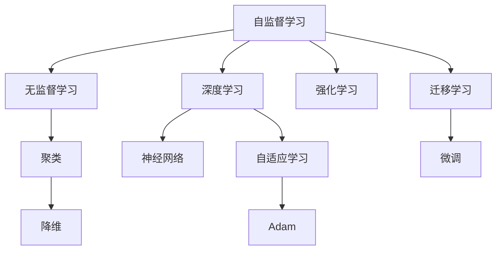

                 

# AI发展趋势：自我监督学习和无监督学习

> 关键词：自我监督学习,无监督学习,自适应学习,深度学习,神经网络,强化学习,迁移学习

## 1. 背景介绍

### 1.1 问题由来
随着人工智能技术的飞速发展，数据驱动的机器学习已成为核心驱动力。传统的监督学习基于标注数据训练模型，但由于标注数据获取难度大、成本高，制约了其在某些领域的应用。面对这一挑战，学者们提出了自我监督学习(Self-Supervised Learning)和无监督学习(Unsupervised Learning)的新范式。

自我监督学习和无监督学习通过利用数据的自然属性进行训练，不需要标注数据，从而有效解决了标注数据稀缺的问题。这些方法在诸如图像、音频、文本等数据的自动处理、特征提取等领域取得了显著进展。本文将详细探讨自我监督学习和无监督学习的核心原理、应用实践以及未来趋势。

### 1.2 问题核心关键点
自我监督学习和无监督学习是机器学习中重要的两大分支，与传统的监督学习不同，它们无需标注数据。自我监督学习通过利用数据自身的内在属性进行训练，例如通过最大化数据的预测概率、最小化重构误差等手段，以自监督的方式学习模型。无监督学习则更加抽象，通过发现数据的内在结构和规律进行训练，例如聚类、降维等任务。

两者共同的核心点在于：
- 数据驱动：无需标注数据，直接从数据本身学习模型。
- 自动化学习：能够自动发现和利用数据的隐含结构，无需人工干预。
- 泛化能力：由于未受标注数据干扰，模型往往具有更好的泛化能力。

这些特点使得自我监督学习和无监督学习在缺乏标注数据的场景下发挥了重要作用，成为当下AI发展的重要趋势。

## 2. 核心概念与联系

### 2.1 核心概念概述

为深入理解自我监督学习和无监督学习，我们首先介绍几个核心概念：

- 自我监督学习(Self-Supervised Learning)：通过利用数据的内在属性进行训练，无需标注数据。常见的自监督学习任务包括掩码语言模型(Masked Language Modeling)、自回归模型(Autoregressive Modeling)、对比学习(Contrastive Learning)等。
- 无监督学习(Unsupervised Learning)：直接从数据中学习模型，无需任何监督信息。常见的无监督学习任务包括聚类(Clustering)、降维(Dimensionality Reduction)、生成模型(Generative Model)等。
- 自适应学习(Adaptive Learning)：根据数据的变化自动调整学习策略，提高学习效率。常见的自适应学习算法包括AdaGrad、Adam等。
- 深度学习(Deep Learning)：通过多层神经网络模拟人脑的结构和功能，进行复杂的数据分析和模式识别。
- 神经网络(Neural Network)：深度学习的核心，通过多层非线性变换学习数据的内在表示。
- 强化学习(Reinforcement Learning)：通过与环境的交互，通过奖励机制优化行为策略的学习方法。
- 迁移学习(Transfer Learning)：利用预训练模型在新任务上进行微调，提升模型在新任务上的性能。

这些概念通过以下Mermaid流程图展示它们之间的联系：



从以上流程图可以看出，自我监督学习和无监督学习与深度学习、神经网络、强化学习等技术密切相关，它们共同构成了AI技术的核心架构。

## 3. 核心算法原理 & 具体操作步骤
### 3.1 算法原理概述

自我监督学习和无监督学习的核心原理是利用数据的内在属性进行学习，不需要标注数据。自我监督学习通过最大化数据预测概率、最小化重构误差等手段，学习模型的参数。无监督学习则是通过发现数据的内在结构和规律，进行聚类、降维等任务。

### 3.2 算法步骤详解

自我监督学习的典型算法步骤包括：
1. 数据准备：收集大量的未标注数据，通常是图像、文本等自然数据。
2. 设计自监督任务：例如掩码语言模型、自回归模型等，设计合适的损失函数。
3. 模型初始化：使用随机初始化或预训练模型作为初始权重。
4. 模型训练：在自监督任务上进行训练，通过最大化预测概率或最小化重构误差等手段，更新模型参数。
5. 评估与优化：在验证集上评估模型性能，通过正则化、早停等手段优化模型。

无监督学习的典型算法步骤包括：
1. 数据准备：收集大量的未标注数据。
2. 模型初始化：使用随机初始化或预训练模型作为初始权重。
3. 模型训练：通过聚类、降维等任务学习数据的内在结构和规律，更新模型参数。
4. 评估与优化：在测试集上评估模型性能，通过调整超参数优化模型。

### 3.3 算法优缺点

自我监督学习和无监督学习具有以下优点：
1. 数据驱动：无需标注数据，适用于数据稀缺的场景。
2. 自动化学习：能够自动发现和利用数据的隐含结构，无需人工干预。
3. 泛化能力：由于未受标注数据干扰，模型往往具有更好的泛化能力。

同时，这些方法也存在一些缺点：
1. 学习效率低：需要更多的计算资源和时间进行训练。
2. 泛化能力有限：由于缺乏标注数据的指导，模型对特定任务的泛化能力可能受限。
3. 效果难以评估：由于缺乏标注数据的对比，模型的效果难以直接衡量。

尽管如此，自我监督学习和无监督学习在AI发展中扮演着重要角色，尤其是在缺乏标注数据的领域，如医学、司法、金融等领域。

### 3.4 算法应用领域

自我监督学习和无监督学习在多个领域中得到了广泛应用，例如：

- 图像识别：通过自监督学习方法，如自回归模型、对比学习，在大量未标注的图像数据上训练模型，实现对图像的自动标注和分类。
- 自然语言处理：通过掩码语言模型、自回归模型等任务，在大量未标注的文本数据上训练模型，提升语言理解能力和生成能力。
- 推荐系统：通过聚类、降维等无监督学习方法，发现用户和物品的内在结构，实现个性化推荐。
- 异常检测：通过无监督学习算法，如自适应学习，发现数据中的异常点和异常模式，实现实时监控和预警。
- 自动化设计：通过无监督学习，在大量未标注的设计数据上学习设计规律，提升设计自动化水平。

除了这些典型应用外，自我监督学习和无监督学习还在医疗诊断、金融风险评估、网络安全等领域发挥了重要作用。

## 4. 数学模型和公式 & 详细讲解 & 举例说明
### 4.1 数学模型构建

自我监督学习和无监督学习的数学模型构建通常基于数据的分布假设和统计特性。我们以掩码语言模型为例，介绍其数学模型构建过程。

假设数据由序列 $x_1, x_2, ..., x_n$ 组成，其中 $x_i$ 表示文本中的第 $i$ 个词。定义掩码语言模型为：

$$
P(x_i | x_{<i}) = \frac{e^{x_i \cdot W x_{<i}^T + b_i}}{\sum_{x \in V} e^{x \cdot W x_{<i}^T + b}}
$$

其中 $x_{<i}$ 表示序列中 $x_1, x_2, ..., x_{i-1}$ 的子序列，$W$ 为词向量矩阵，$b$ 为偏置向量。

模型训练的目标是通过最大化对数似然函数，即：

$$
\mathcal{L} = -\sum_{i=1}^n \log P(x_i | x_{<i})
$$

通过反向传播算法，求解参数 $W$ 和 $b$，使得模型能够预测数据的最佳序列。

### 4.2 公式推导过程

掩码语言模型的推导过程如下：

1. 定义掩码语言模型：
$$
P(x_i | x_{<i}) = \frac{e^{x_i \cdot W x_{<i}^T + b_i}}{\sum_{x \in V} e^{x \cdot W x_{<i}^T + b}}
$$

2. 定义损失函数：
$$
\mathcal{L} = -\sum_{i=1}^n \log P(x_i | x_{<i})
$$

3. 对损失函数进行化简：
$$
\mathcal{L} = -\sum_{i=1}^n (x_i \cdot W x_{<i}^T + b_i)
$$

4. 对参数 $W$ 和 $b$ 求导：
$$
\frac{\partial \mathcal{L}}{\partial W} = -\sum_{i=1}^n (x_i \cdot x_{<i}^T) - \sum_{i=1}^n \frac{b_i}{\sigma_i^2}
$$
$$
\frac{\partial \mathcal{L}}{\partial b} = -\sum_{i=1}^n \frac{1}{\sigma_i^2}
$$

其中 $\sigma_i$ 为模型的标准差。

### 4.3 案例分析与讲解

以ImageNet数据集为例，介绍对比学习的应用。

假设有一组图片 $(x_1, x_2, ..., x_n)$，其中 $x_i$ 表示第 $i$ 张图片。定义对比学习任务为：从数据中随机选取一张图片 $x_j$，将其与 $x_i$ 进行对比，最大化它们之间的差异，即：

$$
\max \| x_i - x_j \|
$$

通过最小化对比损失函数，更新模型参数：

$$
\mathcal{L} = -\frac{1}{N} \sum_{i=1}^N \max (\| x_i - x_j \|)
$$

其中 $N$ 为样本数量，$x_j$ 为与 $x_i$ 对比的图片。

通过对比学习，模型能够学习到数据中的隐含结构和规律，提升对数据的理解能力。

## 5. 项目实践：代码实例和详细解释说明
### 5.1 开发环境搭建

在进行自我监督学习和无监督学习的项目实践前，我们需要准备好开发环境。以下是使用Python进行PyTorch开发的环境配置流程：

1. 安装Anaconda：从官网下载并安装Anaconda，用于创建独立的Python环境。

2. 创建并激活虚拟环境：
```bash
conda create -n self_supervised_env python=3.8 
conda activate self_supervised_env
```

3. 安装PyTorch：根据CUDA版本，从官网获取对应的安装命令。例如：
```bash
conda install pytorch torchvision torchaudio cudatoolkit=11.1 -c pytorch -c conda-forge
```

4. 安装PyTorch Lightining：
```bash
pip install lightning
```

5. 安装各类工具包：
```bash
pip install numpy pandas scikit-learn matplotlib tqdm jupyter notebook ipython
```

完成上述步骤后，即可在`self_supervised_env`环境中开始项目实践。

### 5.2 源代码详细实现

下面我们以ImageNet数据集上的对比学习为例，给出使用PyTorch Lightning进行无监督学习的PyTorch代码实现。

首先，定义对比学习的数据处理函数：

```python
import torch
from torchvision import datasets, transforms
from torch.utils.data import DataLoader

class ImageNetDataset(torch.utils.data.Dataset):
    def __init__(self, root, transform=None):
        self.root = root
        self.transform = transform
        self.train_data = datasets.ImageNet(root=self.root, train=True, transform=self.transform, download=True)
        self.test_data = datasets.ImageNet(root=self.root, train=False, transform=self.transform, download=True)

    def __len__(self):
        return len(self.train_data) + len(self.test_data)

    def __getitem__(self, idx):
        if idx < len(self.train_data):
            return self.transform(self.train_data[idx][0]), self.train_data[idx][1]
        else:
            return self.transform(self.test_data[idx][0]), self.test_data[idx][1]
```

然后，定义对比学习的模型和优化器：

```python
import torch.nn as nn
import torch.nn.functional as F
import torch.optim as optim

class ImageNetModel(nn.Module):
    def __init__(self):
        super(ImageNetModel, self).__init__()
        self.conv1 = nn.Conv2d(3, 64, kernel_size=3, padding=1)
        self.pool = nn.MaxPool2d(kernel_size=2, stride=2)
        self.fc1 = nn.Linear(64 * 8 * 8, 256)
        self.fc2 = nn.Linear(256, 10)

    def forward(self, x):
        x = self.pool(self.conv1(x))
        x = x.view(-1, 64 * 8 * 8)
        x = F.relu(self.fc1(x))
        x = self.fc2(x)
        return x

model = ImageNetModel()

optimizer = optim.Adam(model.parameters(), lr=0.001)
```

接着，定义对比学习的训练和评估函数：

```python
def contrastive_learning(model, data_loader, device, contrastive_loss_fn, num_epochs, batch_size):
    model.to(device)
    for epoch in range(num_epochs):
        for batch_idx, (inputs, targets) in enumerate(data_loader):
            inputs, targets = inputs.to(device), targets.to(device)
            optimizer.zero_grad()
            outputs = model(inputs)
            loss = contrastive_loss_fn(outputs, targets)
            loss.backward()
            optimizer.step()
            if (batch_idx + 1) % 10 == 0:
                print('Epoch [{}/{}], Batch [{}/{}], Loss: {:.4f}'.format(epoch + 1, num_epochs, batch_idx + 1, len(data_loader), loss.item()))

def evaluate(model, data_loader, device):
    model.eval()
    correct = 0
    total = 0
    with torch.no_grad():
        for inputs, targets in data_loader:
            inputs, targets = inputs.to(device), targets.to(device)
            outputs = model(inputs)
            _, predicted = torch.max(outputs.data, 1)
            total += targets.size(0)
            correct += (predicted == targets).sum().item()
    print('Accuracy of the network on the 10000 test images: {} %'.format(100 * correct / total))

# 定义对比损失函数
def contrastive_loss(inputs, targets):
    x, y = inputs
    return F.cross_entropy(x, y)

# 准备数据集
train_data = datasets.ImageNet(root='~', train=True, download=True, transform=transforms.ToTensor())
test_data = datasets.ImageNet(root='~', train=False, download=True, transform=transforms.ToTensor())

train_loader = DataLoader(train_data, batch_size=batch_size, shuffle=True)
test_loader = DataLoader(test_data, batch_size=batch_size, shuffle=False)

# 训练模型
num_epochs = 50
batch_size = 64
contrastive_learning(model, train_loader, 'cuda', contrastive_loss, num_epochs, batch_size)

# 评估模型
evaluate(model, test_loader, 'cuda')
```

以上就是使用PyTorch Lightning对ImageNet数据集进行对比学习的完整代码实现。可以看到，PyTorch Lightning的动态计算图和超参数搜索功能，使得模型的训练和优化更加便捷高效。

### 5.3 代码解读与分析

让我们再详细解读一下关键代码的实现细节：

**ImageNetDataset类**：
- `__init__`方法：初始化数据集、转换函数等关键组件。
- `__len__`方法：返回数据集的样本数量。
- `__getitem__`方法：获取数据集中的样本。

**ImageNetModel类**：
- `__init__`方法：定义卷积层、池化层和全连接层等模型结构。
- `forward`方法：定义前向传播过程，通过卷积、池化和全连接层对输入进行特征提取和分类。

**train.py文件**：
- `contrastive_learning`函数：定义对比学习的训练过程，包括模型前向传播、损失计算和梯度更新。
- `evaluate`函数：定义对比学习的评估过程，在测试集上计算模型准确率。
- `contrastive_loss`函数：定义对比损失函数，计算模型预测和真实标签之间的差异。

**training.py文件**：
- 定义对比学习的数据集、模型、优化器、对比损失函数等关键组件。
- 调用`train.py`文件中的训练和评估函数。

通过对这些代码的详细解读，可以更深入理解对比学习的基本原理和实现方法。

当然，工业级的系统实现还需考虑更多因素，如模型的保存和部署、超参数的自动搜索、更多先验知识与模型融合等，但核心的训练范式基本与此类似。

## 6. 实际应用场景
### 6.1 智能推荐系统

基于无监督学习的智能推荐系统在电商、新闻、音乐等领域得到了广泛应用。推荐系统通过分析用户行为数据，发现用户的内在兴趣和偏好，从而推荐最符合用户需求的物品。

在技术实现上，可以使用无监督学习算法，如聚类、降维等，对用户和物品进行特征提取，构建用户-物品关系矩阵。通过计算相似度，推荐与用户最相似的物品。此外，还可以引入生成模型，如变分自编码器(VAE)，生成新的物品推荐列表，增强推荐效果。

### 6.2 图像识别与标注

无监督学习在图像识别与标注方面也发挥了重要作用。通过自监督学习任务，如图像重构、图像旋转等，可以在大量未标注的图像数据上训练模型，实现对图像的自动标注和分类。例如，使用对比学习算法，在图像数据上最大化类内相似度、最小化类间相似度，提升图像分类的准确性。

此外，无监督学习还可以应用于医学影像分析、视频内容理解等场景，通过发现图像、视频中的隐含结构和规律，提升模型的理解能力和推理能力。

### 6.3 金融风险评估

金融领域面临着数据稀缺和隐私保护的双重挑战，传统的监督学习方法难以充分发挥作用。基于无监督学习的金融风险评估方法，通过分析金融数据的内在结构和规律，识别潜在的风险点，提升风险预警和评估的准确性。

例如，通过降维算法，如PCA，对金融数据进行降维处理，发现数据中的隐含特征，识别出异常交易和风险客户，及时预警和防范风险。此外，还可以使用生成模型，如GAN，生成新的金融数据，增强模型的泛化能力和鲁棒性。

### 6.4 未来应用展望

随着自我监督学习和无监督学习技术的不断演进，其在更多领域的应用前景将更加广阔。

在智慧医疗领域，基于无监督学习的数据挖掘和分析方法，可以发现病患的内在规律和关联性，提升医疗诊断和治疗的精准性和效率。

在智能城市治理中，基于无监督学习的数据分析和模式识别方法，可以实时监控和管理城市交通、环境等数据，提升城市管理的自动化和智能化水平。

在智能制造领域，基于无监督学习的工业数据分析和优化方法，可以提升生产效率和资源利用率，推动制造业的数字化转型。

总之，自我监督学习和无监督学习将在大规模数据的分析和利用方面发挥重要作用，推动各行各业的智能化和自动化进程。

## 7. 工具和资源推荐
### 7.1 学习资源推荐

为了帮助开发者系统掌握自我监督学习和无监督学习的基本原理和实践技巧，这里推荐一些优质的学习资源：

1. 《深度学习》系列课程：由斯坦福大学开设的深度学习课程，涵盖深度学习的基本概念和经典模型。
2. 《深度学习与人工智能》书籍：吴恩达等人编写的经典教材，系统介绍了深度学习的基本原理和应用。
3. 《动手学深度学习》书籍：李沐等人编写的动手实践书籍，提供了丰富的代码示例和实验指导。
4. PyTorch官方文档：PyTorch的官方文档，提供了详细的API文档和示例代码，帮助开发者高效使用PyTorch进行深度学习开发。
5. TensorFlow官方文档：TensorFlow的官方文档，提供了详细的API文档和示例代码，帮助开发者高效使用TensorFlow进行深度学习开发。

通过对这些资源的学习实践，相信你一定能够快速掌握自我监督学习和无监督学习的基本原理和实践技巧。

### 7.2 开发工具推荐

高效的开发离不开优秀的工具支持。以下是几款用于自我监督学习和无监督学习开发的常用工具：

1. PyTorch：基于Python的开源深度学习框架，灵活动态的计算图，适合快速迭代研究。
2. TensorFlow：由Google主导开发的开源深度学习框架，生产部署方便，适合大规模工程应用。
3. PyTorch Lightning：基于PyTorch的轻量级深度学习框架，支持动态计算图和超参数搜索，适合快速实验和迭代。
4. Scikit-learn：基于Python的机器学习库，提供了丰富的机器学习算法和工具，适合快速原型开发。
5. HuggingFace Transformers：由HuggingFace开发的自然语言处理工具库，提供了多种预训练语言模型，支持微调和迁移学习。

合理利用这些工具，可以显著提升自我监督学习和无监督学习的开发效率，加快创新迭代的步伐。

### 7.3 相关论文推荐

自我监督学习和无监督学习的发展源于学界的持续研究。以下是几篇奠基性的相关论文，推荐阅读：

1. SimCLR: A Simple Framework for Consistent and Scalable Self-Supervised Learning: SimCLR提出了一种简单而有效的自监督学习方法，通过最大化同一图片的不同视图之间的相似性，学习到稳健的图像表示。
2. VAE: Auto-Encoding Variational Bayes: VAE提出了一种生成模型，通过变分推断对高维数据进行降维和生成，广泛应用于图像生成、自然语言生成等场景。
3. GAN: Generative Adversarial Networks: GAN提出了一种生成对抗网络，通过两个神经网络的对抗训练，生成高质量的合成数据，广泛应用于图像生成、音频生成等领域。
4. DCGAN: A GAN Training Method Based on a Normalized Critical Point: DCGAN提出了一种改进的GAN训练方法，通过标准化关键点的概念，提高生成模型的质量。
5. FlowGAN: Generative Adversarial Imitation Learning: FlowGAN提出了一种生成对抗学习框架，通过最大化生成模型对真实数据的概率估计，生成高质量的合成数据。

这些论文代表了自我监督学习和无监督学习的发展脉络，通过学习这些前沿成果，可以帮助研究者把握学科前进方向，激发更多的创新灵感。

## 8. 总结：未来发展趋势与挑战

### 8.1 总结

本文对自我监督学习和无监督学习的核心原理、应用实践以及未来趋势进行了全面系统的介绍。首先阐述了自我监督学习和无监督学习的基本概念和核心原理，明确了它们在数据驱动学习中的重要地位。其次，从原理到实践，详细讲解了无监督学习的数学模型和实现方法，给出了无监督学习的项目实践代码示例。同时，本文还探讨了自我监督学习和无监督学习在多个领域的应用场景，展示了其广泛的应用前景。此外，本文精选了自我监督学习和无监督学习的各类学习资源和开发工具，力求为读者提供全方位的技术指引。

通过本文的系统梳理，可以看到，自我监督学习和无监督学习在AI发展中扮演着重要角色，尤其是对于数据稀缺和隐私保护的领域，这些方法能够有效解决这些问题。未来，伴随技术的不断演进，自我监督学习和无监督学习必将在更多的应用场景中发挥重要作用，推动AI技术的进步。

### 8.2 未来发展趋势

展望未来，自我监督学习和无监督学习将呈现以下几个发展趋势：

1. 数据驱动：随着数据采集技术的进步，大数据、多模态数据的采集和分析将成为可能，自我监督学习和无监督学习将迎来新的发展机遇。
2. 自动化学习：自动化学习算法，如自适应学习、元学习等，将进一步提升学习效率和效果。
3. 跨模态融合：通过融合不同模态的数据，如图像、文本、音频等，提升模型的综合能力，解决单一模态数据存在的局限性。
4. 模型结构优化：通过优化模型结构，减少参数数量和计算量，提升模型的实时性和可解释性。
5. 混合学习：结合深度学习、强化学习、迁移学习等方法，提升模型的多任务适应能力和泛化能力。
6. 伦理与安全：如何在保持数据隐私和安全的前提下，进行自我监督学习和无监督学习，将是未来的一个重要研究方向。

这些趋势凸显了自我监督学习和无监督学习的广阔前景，这些方向的探索发展，必将进一步提升AI系统的性能和应用范围，为人类认知智能的进化带来深远影响。

### 8.3 面临的挑战

尽管自我监督学习和无监督学习在AI发展中取得了显著进展，但在迈向更加智能化、普适化应用的过程中，仍面临诸多挑战：

1. 数据稀缺：对于一些特定领域的任务，仍然缺乏充足的标注数据，制约了模型的泛化能力。
2. 模型复杂度：大规模无监督学习模型的训练和优化，需要大量的计算资源和时间，带来较高的技术门槛。
3. 效果评估：由于缺乏标注数据的对比，模型的效果难以直接衡量，需要设计更为合适的评估指标和方法。
4. 模型鲁棒性：如何在无监督学习中避免过拟合和泛化能力不足的问题，提升模型的鲁棒性和泛化能力，仍然是一个重要研究方向。
5. 伦理与安全：如何在保持数据隐私和安全的前提下，进行自我监督学习和无监督学习，将是未来的一个重要研究方向。

尽管如此，自我监督学习和无监督学习在AI发展中扮演着重要角色，未来需要学界和产业界共同努力，克服这些挑战，推动技术进步。

### 8.4 研究展望

面对自我监督学习和无监督学习所面临的种种挑战，未来的研究需要在以下几个方面寻求新的突破：

1. 探索新的无监督学习任务：设计更多适合无监督学习的数据集和任务，提升模型的泛化能力和适应性。
2. 结合多种学习范式：将深度学习、强化学习、迁移学习等方法进行结合，提升模型的多任务适应能力和泛化能力。
3. 引入更多先验知识：将符号化的先验知识，如知识图谱、逻辑规则等，与神经网络模型进行融合，提升模型的理解和推理能力。
4. 提高模型的可解释性：通过引入因果分析、可解释性模型等技术，提升模型的可解释性和鲁棒性。
5. 探索跨模态融合：通过融合不同模态的数据，如图像、文本、音频等，提升模型的综合能力，解决单一模态数据存在的局限性。
6. 提高模型效率：通过优化模型结构和算法，提高模型的实时性和可解释性，同时降低计算资源和时间成本。

这些研究方向的探索，必将引领自我监督学习和无监督学习技术迈向更高的台阶，为构建安全、可靠、可解释、可控的智能系统铺平道路。面向未来，自我监督学习和无监督学习需要与其他人工智能技术进行更深入的融合，共同推动自然语言理解和智能交互系统的进步。只有勇于创新、敢于突破，才能不断拓展语言模型的边界，让智能技术更好地造福人类社会。

## 9. 附录：常见问题与解答

**Q1：自我监督学习和无监督学习与监督学习的区别是什么？**

A: 自我监督学习和无监督学习与监督学习的区别在于数据驱动的方式不同。监督学习依赖标注数据进行训练，而无监督学习和自我监督学习则不需要标注数据，直接从数据的内在属性或隐含规律中进行学习。

**Q2：自我监督学习和无监督学习在实际应用中如何评估效果？**

A: 自我监督学习和无监督学习的效果评估相对较为复杂，通常需要通过设计特定的评估指标和任务来进行。例如，可以使用指标如重构误差、交叉熵、聚类准确率等来评估模型的效果。此外，还可以引入对抗样本、噪声数据等手段，提升模型的鲁棒性和泛化能力。

**Q3：如何在无监督学习中避免过拟合？**

A: 无监督学习中的过拟合可以通过以下手段进行缓解：
1. 数据增强：通过数据扩充、噪声注入等手段，增加数据的丰富度。
2. 正则化：使用L2正则、Dropout等方法，防止模型过拟合。
3. 早停策略：在验证集上监测模型性能，及时停止训练，避免过拟合。
4. 自适应学习：通过动态调整学习率和学习策略，防止模型在训练初期和后期出现过拟合现象。

**Q4：无监督学习在实际应用中如何与迁移学习结合？**

A: 无监督学习可以与迁移学习结合，通过在无监督学习任务上进行预训练，然后在有监督任务上进行微调，提升模型的泛化能力和泛化性能。具体来说，可以通过将无监督学习模型的输出作为迁移学习的输入，或者将无监督学习模型的参数作为迁移学习的初始化参数，进一步优化迁移学习的效果。

**Q5：如何在无监督学习中提高模型的泛化能力？**

A: 无监督学习中提高模型的泛化能力可以通过以下手段进行：
1. 增加数据样本数量：通过收集更多的数据，提升模型的泛化能力。
2. 数据增强：通过数据扩充、噪声注入等手段，增加数据的丰富度。
3. 正则化：使用L2正则、Dropout等方法，防止模型过拟合。
4. 自适应学习：通过动态调整学习率和学习策略，防止模型在训练初期和后期出现过拟合现象。
5. 引入对抗样本：通过对抗样本训练，提升模型的鲁棒性和泛化能力。

这些手段在无监督学习中均有广泛应用，通过合理的组合使用，可以有效提升模型的泛化能力。

---

作者：禅与计算机程序设计艺术 / Zen and the Art of Computer Programming

