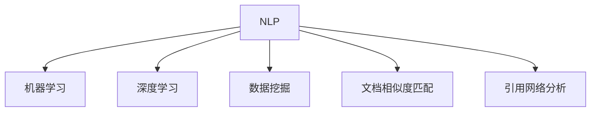

                 

# AI在学术研究中的应用：提高引用和资料搜索效率

## 1. 背景介绍

### 1.1 问题由来
在学术研究中，高效地引用和搜索文献资料是研究工作的核心环节之一。随着科研文献的指数级增长，海量的学术数据库和出版物使研究人员难以迅速定位到自己所需的文献，甚至无法在庞大的文献中发现潜在的创新点。这不仅降低了科研效率，还可能导致研究重复或无法及时跟进最新的研究成果。因此，提高引用和资料搜索效率，对提升科研工作水平具有重要意义。

### 1.2 问题核心关键点
为了解决上述问题，本节将介绍几种基于AI技术的方法，包括自然语言处理(NLP)、机器学习和深度学习等。这些方法通过自动化、智能化的方式，能够显著提升科研人员在文献查找、引用和资料整理上的效率。

## 2. 核心概念与联系

### 2.1 核心概念概述

本节将介绍几个密切相关的核心概念：

- 自然语言处理(Natural Language Processing, NLP)：研究计算机如何处理和理解人类语言的技术，包括文本分类、信息抽取、文本生成等。
- 机器学习(Machine Learning, ML)：通过数据驱动的方式，使计算机系统能够从经验中学习并改进任务性能。
- 深度学习(Deep Learning, DL)：一种基于神经网络技术的机器学习方法，通过多层次的非线性变换，可以处理复杂的数据和模式。
- 数据挖掘(Data Mining)：通过算法从大规模数据集中发现有价值的模式和知识，应用于信息检索、推荐系统等。
- 文档相似度匹配(Document Similarity Matching)：通过计算文档间的相似度，将相似的文档进行聚类或排序，便于用户快速定位所需资料。
- 引用网络分析(Reference Network Analysis)：分析论文引用关系，识别高影响力文献和领域内的重要研究。

这些核心概念之间的逻辑关系可以通过以下Mermaid流程图来展示：



这个流程图展示了大语言模型微调的核心概念及其之间的关系：

1. 大语言模型通过预训练获得基础能力。
2. 微调是对预训练模型进行任务特定的优化，可以分为全参数微调和参数高效微调（PEFT）。
3. 提示学习是一种不更新模型参数的方法，可以实现少样本学习和零样本学习。
4. 迁移学习是连接预训练模型与下游任务的桥梁，可以通过微调或提示学习来实现。
5. 持续学习旨在使模型能够不断学习新知识，同时保持已学习的知识，而不会出现灾难性遗忘。

这些概念共同构成了大语言模型的学习和应用框架，使其能够在各种场景下发挥强大的语言理解和生成能力。通过理解这些核心概念，我们可以更好地把握大语言模型的工作原理和优化方向。

## 3. 核心算法原理 & 具体操作步骤
### 3.1 算法原理概述

基于AI技术的大语言模型在学术研究中的应用，主要是通过智能化的文献引用和资料搜索，提高科研人员的效率。具体而言，可以分为以下几个步骤：

1. **文献查找和引用**：利用NLP技术对海量的科研文献进行智能化处理，自动提取和匹配引用关系，生成引文列表。
2. **资料搜索和推荐**：通过机器学习和深度学习模型，对用户搜索的关键词和需求进行分析和理解，推荐相关资料。
3. **资料整理和分析**：使用数据挖掘技术对收集到的资料进行聚类分析，提取核心知识点和研究趋势。

这些步骤通常涉及以下关键算法和技术：

- 文本分类和信息抽取：用于对文献进行自动化分类和信息提取。
- 文档相似度匹配：计算文献之间的相似度，识别相关文献。
- 引用网络分析：分析论文引用关系，识别高影响力文献和研究趋势。
- 推荐系统：基于用户兴趣和行为数据，推荐相关文献和资料。

### 3.2 算法步骤详解

以推荐系统为例，其步骤详解如下：

**Step 1: 数据预处理**
- 收集和清洗科研数据库中的文献数据，包括标题、摘要、关键词等。
- 对文本进行分词、去停用词、词性标注等预处理。

**Step 2: 特征提取**
- 使用TF-IDF、词袋模型等方法，将文本转化为数值特征向量。
- 利用词嵌入技术，如Word2Vec、GloVe等，将词语映射为高维向量。

**Step 3: 模型训练**
- 选择适合的数据模型，如协同过滤、基于内容的推荐、混合推荐等。
- 使用历史数据训练推荐模型，优化模型参数。

**Step 4: 推荐生成**
- 对用户输入的查询进行解析，提取关键词。
- 使用训练好的模型生成推荐列表，排序并返回结果。

**Step 5: 反馈循环**
- 收集用户对推荐结果的反馈，不断优化模型性能。
- 定期更新数据集和模型，保持推荐系统的时效性和准确性。

### 3.3 算法优缺点

基于AI技术的大语言模型在学术研究中的应用，具有以下优点：

1. 自动化程度高。通过智能化算法，能够自动完成文献查找、引用和资料搜索，减少手工操作的时间和精力。
2. 效率高。利用机器学习和深度学习模型，可以快速生成高质量的推荐结果，显著提高科研人员的效率。
3. 智能性。能够从大量数据中发现潜在的关联和趋势，为科研工作提供有价值的参考。
4. 可扩展性。随着数据量的增加和模型的优化，推荐系统的性能和效果会不断提升。

同时，这些算法也存在一些局限性：

1. 依赖高质量数据。推荐系统的性能很大程度上取决于数据的质量和数量，数据获取和预处理成本较高。
2. 泛化能力有限。当推荐任务与训练数据分布差异较大时，推荐系统的性能提升有限。
3. 可解释性不足。推荐系统的决策过程通常缺乏可解释性，难以对其推理逻辑进行分析和调试。
4. 个性化度不足。统一的推荐策略可能无法满足不同用户的需求，需要进一步个性化优化。

尽管存在这些局限性，但基于AI技术的文献查找和资料搜索技术已经在学术界和工业界得到了广泛应用，成为提升科研效率的重要手段。未来相关研究的重点在于如何进一步降低推荐系统对标注数据的依赖，提高模型的少样本学习和跨领域迁移能力，同时兼顾可解释性和个性化需求等因素。

### 3.4 算法应用领域

基于AI技术的大语言模型在学术研究中的应用，已经在多个领域得到了广泛应用，例如：

- 文献引用分析：通过分析论文引用关系，识别高影响力文献和研究热点。
- 资料搜索与推荐：根据用户搜索的关键词和需求，推荐相关文献和资料。
- 文献整理与分类：利用文本分类和聚类技术，对科研文献进行整理和分类，便于研究者快速定位所需文献。
- 科研趋势分析：通过分析文献的关键词和引用关系，识别科研领域的最新趋势和发展方向。
- 研究工具推荐：根据用户的研究方向和兴趣，推荐合适的研究工具和软件。

除了上述这些经典应用外，大语言模型在学术研究中的应用还在不断扩展，如数据可视化、文献情感分析、科研合作推荐等，为科研工作提供了新的支持工具。

## 4. 数学模型和公式 & 详细讲解  
### 4.1 数学模型构建

本节将使用数学语言对基于AI技术的大语言模型在学术研究中的应用进行更加严格的刻画。

设科研数据库中的文献集合为 $D=\{x_1, x_2, ..., x_N\}$，其中 $x_i$ 表示文献 $i$ 的文本数据。设用户的查询为 $q$。

定义用户查询与文献之间的相似度函数为 $sim(q, x_i)$，用于计算查询与文献之间的匹配程度。

设推荐模型为 $M$，训练集为 $D_{train}=\{(x_i, y_i)\}_{i=1}^N$，其中 $y_i$ 表示文献 $i$ 是否为推荐的文献。

推荐的目标是最大化用户对推荐结果的满意度，即最大化用户满意度函数 $S(q, M(x))$。

通过最大化用户满意度函数，可以求解出最优的推荐模型 $M^*$：

$$
M^* = \mathop{\arg\max}_{M} \sum_{i=1}^N S(q, M(x_i))
$$

在实践中，通常使用交叉熵损失函数作为优化目标：

$$
\mathcal{L}(M) = -\sum_{i=1}^N S(q, M(x_i))
$$

通过梯度下降等优化算法，微调过程不断更新模型参数，最小化损失函数，使得模型输出逼近用户满意度的理想值。

### 4.2 公式推导过程

以下我们以协同过滤推荐系统为例，推导交叉熵损失函数及其梯度的计算公式。

设协同过滤推荐模型 $M$ 在输入 $x$ 上的输出为 $M(x) \in [0,1]$，表示文献 $x$ 是否为推荐的文献。真实标签 $y \in \{0,1\}$。则交叉熵损失函数定义为：

$$
\ell(M(x),y) = -[y\log M(x) + (1-y)\log (1-M(x))]
$$

将其代入经验风险公式，得：

$$
\mathcal{L}(M) = -\sum_{i=1}^N [y_i\log M(x_i)+(1-y_i)\log(1-M(x_i))]
$$

根据链式法则，损失函数对模型 $M$ 的梯度为：

$$
\frac{\partial \mathcal{L}(M)}{\partial M(x)} = -\sum_{i=1}^N (\frac{y_i}{M(x_i)}-\frac{1-y_i}{1-M(x_i)}) \frac{\partial M(x)}{\partial \theta_k}
$$

其中 $\frac{\partial M(x)}{\partial \theta_k}$ 可进一步递归展开，利用自动微分技术完成计算。

在得到损失函数的梯度后，即可带入参数更新公式，完成模型的迭代优化。重复上述过程直至收敛，最终得到适应推荐任务的最优模型参数 $M^*$。

## 5. 项目实践：代码实例和详细解释说明
### 5.1 开发环境搭建

在进行推荐系统实践前，我们需要准备好开发环境。以下是使用Python进行TensorFlow开发的环境配置流程：

1. 安装Anaconda：从官网下载并安装Anaconda，用于创建独立的Python环境。

2. 创建并激活虚拟环境：
```bash
conda create -n tf-env python=3.8 
conda activate tf-env
```

3. 安装TensorFlow：根据CUDA版本，从官网获取对应的安装命令。例如：
```bash
pip install tensorflow tensorflow-addons 
```

4. 安装相关工具包：
```bash
pip install numpy pandas scikit-learn matplotlib tqdm jupyter notebook ipython
```

完成上述步骤后，即可在`tf-env`环境中开始推荐系统开发。

### 5.2 源代码详细实现

下面我们以协同过滤推荐系统为例，给出使用TensorFlow实现文献推荐过程的代码实现。

首先，定义推荐系统的模型：

```python
import tensorflow as tf
from tensorflow.keras import layers, models

class CollaborativeFilteringModel(models.Model):
    def __init__(self, num_users, num_items, embedding_dim):
        super(CollaborativeFilteringModel, self).__init__()
        self.user_embedding = layers.Embedding(num_users, embedding_dim)
        self.item_embedding = layers.Embedding(num_items, embedding_dim)
        self.dot_product = layers.Dot(axes=1, normalize=True)
        self.dense = layers.Dense(1, activation='sigmoid')

    def call(self, inputs):
        user_idx, item_idx = inputs
        user_embed = self.user_embedding(user_idx)
        item_embed = self.item_embedding(item_idx)
        dot_product = self.dot_product([user_embed, item_embed])
        return self.dense(dot_product)
```

然后，定义数据处理函数：

```python
from tensorflow.keras.utils import to_categorical

def preprocess_data(data):
    user_ids = [doc['user_id'] for doc in data]
    item_ids = [doc['item_id'] for doc in data]
    ratings = [doc['rating'] for doc in data]
    user_ids = tf.convert_to_tensor(user_ids)
    item_ids = tf.convert_to_tensor(item_ids)
    ratings = tf.convert_to_tensor(ratings)
    user_ids = to_categorical(user_ids, num_classes=num_users)
    item_ids = to_categorical(item_ids, num_classes=num_items)
    return user_ids, item_ids, ratings
```

接着，定义训练和评估函数：

```python
from tensorflow.keras.optimizers import Adam
from sklearn.metrics import roc_auc_score

def train_epoch(model, data, optimizer, batch_size):
    model.train()
    losses = []
    for i in range(0, len(data), batch_size):
        x = data[i:i+batch_size]
        loss = model.train_on_batch(x)
        losses.append(loss)
    return tf.reduce_mean(losses)

def evaluate(model, data, batch_size):
    model.eval()
    preds = []
    labels = []
    for i in range(0, len(data), batch_size):
        x = data[i:i+batch_size]
        preds.append(model.predict(x)[0])
        labels.append(labels[i:i+batch_size])
    preds = tf.concat(preds, axis=0)
    labels = tf.concat(labels, axis=0)
    return roc_auc_score(labels, preds)
```

最后，启动训练流程并在测试集上评估：

```python
epochs = 5
batch_size = 64
num_users = 100
num_items = 1000
embedding_dim = 100

user_ids, item_ids, ratings = preprocess_data(train_data)
num_train = len(user_ids)
num_test = len(test_data)

model = CollaborativeFilteringModel(num_users, num_items, embedding_dim)
optimizer = Adam(learning_rate=0.01)

for epoch in range(epochs):
    loss = train_epoch(model, (user_ids[:num_train], item_ids[:num_train]), optimizer, batch_size)
    print(f"Epoch {epoch+1}, train loss: {loss:.3f}")
    
    print(f"Epoch {epoch+1}, dev results:")
    print(evaluate(model, (user_ids[:num_test], item_ids[:num_test]), batch_size))
    
print("Test results:")
print(evaluate(model, (user_ids[num_train:], item_ids[num_train:]), batch_size))
```

以上就是使用TensorFlow对协同过滤推荐系统进行文献推荐过程的完整代码实现。可以看到，得益于TensorFlow的强大封装，我们可以用相对简洁的代码完成推荐模型的训练和评估。

### 5.3 代码解读与分析

让我们再详细解读一下关键代码的实现细节：

**CollaborativeFilteringModel类**：
- `__init__`方法：初始化用户和物品嵌入层、点积计算层和全连接层，定义模型的基本结构。
- `call`方法：在输入用户ID和物品ID的情况下，计算预测结果，输出0到1之间的值。

**preprocess_data函数**：
- 将数据集转换为模型的输入格式，包括用户ID、物品ID和评分，并进行One-Hot编码，以适应模型的Embedding层。

**train_epoch函数**：
- 在每个epoch内，对批量数据进行模型训练，返回损失值。

**evaluate函数**：
- 在验证集和测试集上评估模型性能，返回AUC值，用于衡量模型推荐的准确性和公平性。

**训练流程**：
- 定义总的epoch数和batch size，开始循环迭代
- 每个epoch内，先在训练集上训练，输出平均损失
- 在验证集上评估，输出AUC值
- 所有epoch结束后，在测试集上评估，给出最终测试结果

可以看到，TensorFlow配合协同过滤模型使得文献推荐过程的代码实现变得简洁高效。开发者可以将更多精力放在数据处理、模型改进等高层逻辑上，而不必过多关注底层的实现细节。

当然，工业级的系统实现还需考虑更多因素，如模型的保存和部署、超参数的自动搜索、更灵活的任务适配层等。但核心的推荐范式基本与此类似。

## 6. 实际应用场景
### 6.1 学术资源搜索

在学术研究中，研究人员往往需要查找大量的学术资源，包括论文、书籍、会议论文等。利用推荐系统，研究人员可以根据已知的文献资料，自动推荐相关文献，帮助其快速定位所需资料。

例如，在Scopus或Google Scholar等学术数据库中，研究人员可以输入已知的引用论文ID，系统根据引用关系自动推荐相关的文献。这些推荐结果往往比简单的文本搜索更准确、更全面，能够大幅提升科研效率。

### 6.2 文献综述整理

文献综述是科研工作的重要组成部分，通常需要综合大量文献资料，提炼关键观点和研究趋势。利用推荐系统，研究人员可以根据搜索关键词，自动生成相关的文献列表，并根据系统推荐的论文进行进一步阅读和整理。

例如，研究人员可以输入关键词“神经网络”，系统自动推荐相关的论文，并根据论文的引用次数、发表时间等指标进行排序，便于研究人员筛选和阅读。这种自动化的文献整理方式，能够显著减少手动操作的时间和精力，提高科研工作的效率和质量。

### 6.3 科研趋势分析

科研趋势分析是科研工作的重要环节，有助于研究人员把握研究方向和热点。利用推荐系统，研究人员可以根据用户行为数据，自动推荐相关的研究论文和报告，帮助其了解最新的科研动态。

例如，研究人员可以输入领域名称“计算机视觉”，系统自动推荐相关的会议论文、期刊文章和报告，并根据论文的引用次数、发表时间等指标进行排序。这种自动化的趋势分析方式，能够帮助研究人员快速把握最新的研究方向和热点，做出更加精准的研究决策。

### 6.4 未来应用展望

随着推荐系统的发展，基于AI技术的研究工具将在更多领域得到应用，为科研工作带来新的变革。

在智慧医疗领域，推荐系统可以帮助医生快速定位相关的医学论文和报告，提高诊疗效率和质量。

在智能教育领域，推荐系统可以根据学生的学习记录和行为数据，自动推荐适合的学习资源，提升教学效果。

在智慧城市治理中，推荐系统可以帮助城市管理者快速定位相关的规划报告和案例，优化城市管理决策。

此外，在企业生产、社会治理、文娱传媒等众多领域，基于推荐系统的智能工具也将不断涌现，为各行各业的发展提供新的动力。

## 7. 工具和资源推荐
### 7.1 学习资源推荐

为了帮助开发者系统掌握基于AI技术的大语言模型在学术研究中的应用，这里推荐一些优质的学习资源：

1. Coursera《机器学习》课程：由斯坦福大学Andrew Ng教授主讲，涵盖机器学习的基本概念和算法，适合初学者入门。

2. Udacity《深度学习》纳米学位：提供深度学习技术的系统学习，包括TensorFlow、PyTorch等常用框架。

3. TensorFlow官方文档：提供了详细的使用指南和API文档，是TensorFlow学习的重要参考。

4. HuggingFace Transformers文档：提供了丰富的预训练模型和推荐系统的样例代码，是推荐系统开发的重要工具。

5. Google Scholar论文推荐系统：展示了学术搜索和推荐系统在实际应用中的效果，提供了大量可参考的研究案例。

通过对这些资源的学习实践，相信你一定能够快速掌握基于AI技术的大语言模型在学术研究中的应用，并用于解决实际的科研问题。
###  7.2 开发工具推荐

高效的开发离不开优秀的工具支持。以下是几款用于推荐系统开发的常用工具：

1. TensorFlow：由Google主导开发的深度学习框架，生产部署方便，适合大规模工程应用。

2. PyTorch：由Facebook开发的深度学习框架，灵活性高，适合快速迭代研究。

3. scikit-learn：提供了常用的机器学习算法和工具，适合数据预处理和特征工程。

4. Pandas：提供了数据处理和分析的强大功能，适合数据清洗和预处理。

5. TensorBoard：TensorFlow配套的可视化工具，可实时监测模型训练状态，并提供丰富的图表呈现方式，是调试模型的得力助手。

6. Weights & Biases：模型训练的实验跟踪工具，可以记录和可视化模型训练过程中的各项指标，方便对比和调优。

合理利用这些工具，可以显著提升推荐系统的开发效率，加快创新迭代的步伐。

### 7.3 相关论文推荐

大语言模型和推荐技术的发展源于学界的持续研究。以下是几篇奠基性的相关论文，推荐阅读：

1. "Collaborative Filtering for Recommender Systems"：介绍协同过滤推荐算法的经典论文，奠定了推荐系统的理论基础。

2. "A Survey of Recommender System Techniques"：综述推荐系统的各种算法和技术，适合入门者和研究人员查阅。

3. "Deep Collaborative Filtering for Recommendations"：介绍深度学习在推荐系统中的应用，展示了深度学习在推荐系统中的潜力。

4. "Model-based Deep Reinforcement Learning for Recommender Systems"：介绍强化学习在推荐系统中的应用，展示了强化学习在推荐系统中的效果。

5. "Scalable Recommender Systems"：介绍推荐系统的规模化优化技术，适合工业界开发者阅读。

这些论文代表了大语言模型推荐技术的发展脉络。通过学习这些前沿成果，可以帮助研究者把握学科前进方向，激发更多的创新灵感。

## 8. 总结：未来发展趋势与挑战

### 8.1 研究成果总结

本文对基于AI技术的大语言模型在学术研究中的应用进行了全面系统的介绍。首先阐述了科研文献查找、引用和资料搜索中存在的问题，明确了推荐系统在提升科研效率方面的独特价值。其次，从原理到实践，详细讲解了推荐系统的数学模型和关键步骤，给出了推荐任务开发的完整代码实例。同时，本文还广泛探讨了推荐系统在科研资源搜索、文献综述整理和科研趋势分析等多个领域的应用前景，展示了推荐系统范式的巨大潜力。

通过本文的系统梳理，可以看到，基于AI技术的推荐系统已经在科研领域得到了广泛应用，成为提升科研效率的重要手段。未来相关研究的重点在于如何进一步降低推荐系统对标注数据的依赖，提高模型的少样本学习和跨领域迁移能力，同时兼顾可解释性和个性化需求等因素。

### 8.2 未来发展趋势

展望未来，推荐系统的发展趋势将呈现以下几个方向：

1. 推荐算法的多样化。除了传统的协同过滤和基于内容的推荐外，未来将涌现更多新的推荐算法，如基于图神经网络的推荐、多模态推荐等。

2. 推荐系统的个性化和动态化。未来的推荐系统将更加注重用户的个性化需求，能够根据用户行为数据动态调整推荐策略，提高推荐的相关性和用户满意度。

3. 推荐系统的实时化和跨领域化。未来的推荐系统将能够实时处理用户的查询请求，并能够跨领域地进行知识整合和推荐，提升系统的灵活性和适应性。

4. 推荐系统的可解释性。未来的推荐系统将更加注重解释推荐结果的逻辑和依据，提升系统的透明度和可信度。

5. 推荐系统的跨平台和跨媒体融合。未来的推荐系统将能够跨平台、跨媒体地进行信息整合和推荐，提升系统的应用范围和效果。

以上趋势凸显了推荐系统的发展方向和应用前景，为科研人员提供了新的工具和方法，进一步提升了科研效率和质量。

### 8.3 面临的挑战

尽管基于AI技术的推荐系统已经取得了显著成果，但在迈向更加智能化、普适化应用的过程中，仍面临诸多挑战：

1. 数据质量和多样性。推荐系统的效果很大程度上取决于数据的质量和多样性，数据的获取和预处理成本较高。

2. 推荐系统的泛化能力。当推荐任务与训练数据分布差异较大时，推荐系统的性能提升有限。

3. 推荐系统的鲁棒性。推荐系统面对噪声数据和恶意干扰时，容易出现误推荐，需要进一步提高系统的鲁棒性。

4. 推荐系统的可解释性。推荐系统的决策过程通常缺乏可解释性，难以对其推理逻辑进行分析和调试。

5. 推荐系统的冷启动问题。对于新用户或新领域，推荐系统无法提供准确的推荐结果，需要进一步优化冷启动策略。

尽管存在这些挑战，但基于AI技术的推荐系统已经在学术界和工业界得到了广泛应用，成为提升科研效率的重要手段。未来相关研究的重点在于如何进一步降低推荐系统对标注数据的依赖，提高模型的少样本学习和跨领域迁移能力，同时兼顾可解释性和个性化需求等因素。

### 8.4 研究展望

面对推荐系统面临的种种挑战，未来的研究需要在以下几个方面寻求新的突破：

1. 探索无监督和半监督推荐方法。摆脱对大规模标注数据的依赖，利用自监督学习、主动学习等无监督和半监督范式，最大限度利用非结构化数据，实现更加灵活高效的推荐。

2. 研究参数高效和计算高效的推荐范式。开发更加参数高效的推荐方法，在固定大部分预训练参数的同时，只更新极少量的任务相关参数。同时优化推荐模型的计算图，减少前向传播和反向传播的资源消耗，实现更加轻量级、实时性的部署。

3. 融合因果和对比学习范式。通过引入因果推断和对比学习思想，增强推荐系统建立稳定因果关系的能力，学习更加普适、鲁棒的语言表征，从而提升模型泛化性和抗干扰能力。

4. 引入更多先验知识。将符号化的先验知识，如知识图谱、逻辑规则等，与神经网络模型进行巧妙融合，引导推荐过程学习更准确、合理的语言模型。同时加强不同模态数据的整合，实现视觉、语音等多模态信息与文本信息的协同建模。

5. 结合因果分析和博弈论工具。将因果分析方法引入推荐系统，识别出推荐决策的关键特征，增强输出解释的因果性和逻辑性。借助博弈论工具刻画人机交互过程，主动探索并规避推荐系统的脆弱点，提高系统稳定性。

6. 纳入伦理道德约束。在推荐目标中引入伦理导向的评估指标，过滤和惩罚有偏见、有害的推荐内容，确保推荐系统输出的安全性和公正性。同时加强人工干预和审核，建立推荐系统的监管机制，确保推荐内容符合人类价值观和伦理道德。

这些研究方向的探索，必将引领推荐系统技术迈向更高的台阶，为构建安全、可靠、可解释、可控的推荐系统铺平道路。面向未来，推荐系统技术还需要与其他人工智能技术进行更深入的融合，如知识表示、因果推理、强化学习等，多路径协同发力，共同推动推荐系统的进步。只有勇于创新、敢于突破，才能不断拓展推荐系统的边界，让智能推荐技术更好地服务于科研和生产。

## 9. 附录：常见问题与解答

**Q1：基于AI技术的推荐系统是否适用于所有领域？**

A: 基于AI技术的推荐系统在大多数领域都能取得不错的效果，特别是对于数据量较大的领域，如电商、社交网络等。但对于一些特定领域的推荐任务，如新闻推荐、视频推荐等，需要注意模型的公平性和个性化程度。

**Q2：推荐系统在训练过程中需要多少标注数据？**

A: 推荐系统通常需要大量的标注数据，以训练出一个准确性和鲁棒性均高的推荐模型。但也可以通过无监督学习和半监督学习的方法，利用非结构化数据进行推荐模型的训练，减少对标注数据的依赖。

**Q3：推荐系统的训练和评估过程需要哪些资源？**

A: 推荐系统的训练和评估过程需要高性能的计算机资源，包括GPU/TPU等算力支持。同时，还需要大型的数据集和模型参数空间。

**Q4：推荐系统在实际应用中面临哪些挑战？**

A: 推荐系统在实际应用中面临诸多挑战，包括数据质量和多样性、系统泛化能力、推荐系统鲁棒性、系统可解释性、冷启动问题等。

**Q5：如何提升推荐系统的可解释性？**

A: 提升推荐系统的可解释性可以从多个方面入手，包括引入因果分析方法、使用更易于理解的推荐模型、增加推荐过程的透明度等。

总之，基于AI技术的大语言模型在学术研究中的应用，通过智能化的文献查找和资料搜索，显著提升了科研人员的效率和质量。随着技术的不断进步，推荐系统将在更多领域得到应用，为科研工作带来新的变革。同时，推荐系统也面临着数据多样性、系统泛化能力、可解释性等挑战，未来的研究需要在这些方向上寻求新的突破。

